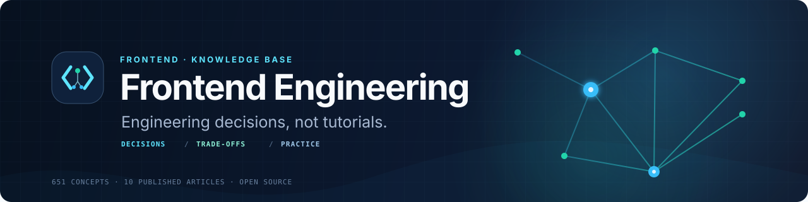

<div align="center">


<h1>Frontend Engineering</h1>

<strong>Engineering decisions, not tutorials.</strong>

<p>A long-term, community-driven, peer-reviewed knowledge base of frontend engineering<br/>patterns, trade-offs, and production-ready practices — framework-aware, not framework-bound.</p>

<p><strong>Stop re-litigating frontend decisions from scratch.</strong><br/>Find the trade-offs, choose deliberately, and ship the decision your future team can defend.</p>

<!-- Banner (replace with final art per assets/branding/README.md) -->


<p>
  <a href="LICENSE"></a>
  <a href="https://github.com/ualiyou/frontend-engineering/actions"></a>
  <a href="CONTRIBUTING.md"></a>
  <a href="CODE_OF_CONDUCT.md"></a>
  <a href="https://github.com/ualiyou/frontend-engineering/commits"></a>
  <a href="https://github.com/ualiyou/frontend-engineering/stargazers"></a>
</p>

</div>

---

## Table of Contents

- [Why this project exists](#why-this-project-exists)
- [What it is — and is not](#what-it-is--and-is-not)
- [Who it's for](#who-its-for)
- [Start with a decision](#start-with-a-decision)
- [Features](#features)
- [Repository structure](#repository-structure)
- [The knowledge map](#the-knowledge-map)
- [Learning paths](#learning-paths)
- [Contributing](#contributing)
- [Roadmap](#roadmap)
- [FAQ](#faq)
- [Community](#community)
- [Acknowledgements](#acknowledgements)
- [License](#license)

## Why this project exists

Frontend engineering knowledge is scattered across blog posts, framework changelogs, conference talks, and tribal experience. Much of it goes stale, contradicts itself, or optimizes for a demo rather than a production system.

**Frontend Engineering** is a durable, versioned, peer-reviewed reference that captures the *decisions* behind good frontend systems — the problem, the options, the trade-offs, and a defensible recommendation — and stays useful for years, independent of any single framework's release cycle. The emphasis is on **reasoning**: *why* one approach is chosen over another, not step-by-step instructions.

Your next data-loading, caching, or validation choice will shape more code than the first pull request suggests. This is the place to make that choice once — with the constraints visible — instead of rediscovering it during the next incident or rewrite.

## What it is — and is not

<table>
<tr><th>It is</th><th>It is not</th></tr>
<tr valign="top"><td>

- A reference for **engineering decisions**: patterns, architecture, trade-offs.
- **Production-ready approaches**, each with when-to-use and when-to-avoid.
- A catalog of **anti-patterns** and why they fail at scale.
- **Framework-aware but not framework-bound** — concepts over any one API.
- **Peer-reviewed and versioned**; it improves through review.

</td><td>

- **Not a tutorial site.** No "build your first component" walkthroughs.
- **Not framework docs.** It doesn't duplicate React/TypeScript docs.
- **Not a link dump.** Every entry is original and self-contained.
- **Not a news feed.** Durable principles, not release announcements.
- **Not unqualified opinion.** Recommendations follow from trade-off analysis.

</td></tr>
</table>

## Who it's for

Mid-level to senior frontend engineers making architectural and design decisions; tech leads and staff engineers setting standards across teams; and engineers preparing for system-design discussions who want structured reasoning rather than recipes. A working knowledge of JavaScript, the browser platform, and at least one component framework is assumed — this is not aimed at absolute beginners.

## Start with a decision

🧭 **Ten peer-reviewed articles are already available.** Start with the decision currently slowing your team down.

| If you're deciding… | Start here | You will leave with |
| --- | --- | --- |
| When to start a request | [Fetch-on-Render vs Render-as-You-Fetch](docs/03-application-architecture/data-server-state/fetch-on-render-vs-render-as-you-fetch.md) | A loading model that matches the user experience you need. |
| What makes cached data the same data | [Cache Keys](docs/03-application-architecture/data-server-state/cache-keys.md) | A stable cache identity that avoids subtle duplication and invalidation bugs. |
| How to keep form input trustworthy | [Schema Validation](docs/03-application-architecture/forms-validation/schema-validation.md) | A contract between UI, validation, and inferred types. |

Browse the complete published collections: [Data & Server State](docs/03-application-architecture/data-server-state/) and [Forms & Validation](docs/03-application-architecture/forms-validation/). If this would save your team a future debate, [star the repository](https://github.com/ualiyou/frontend-engineering/stargazers) and come back when the next one begins.

### ⚡ The familiar feeling

<table>
<tr><td width="50%" align="center">

<a href="https://imgflip.com/memegenerator/87743020/Two-Buttons"></a>

<strong>Open 14 tabs</strong> &nbsp;↔&nbsp; <strong>Compare trade-offs</strong><br/>
<sub>Frontend engineer, 20 minutes before review.</sub>

</td><td width="50%" align="center">


<strong>Less recipe.</strong> More reasoning.

</td></tr>
</table>

## Features

- 🗺️ **Four-level knowledge map** — Part → Domain → Topic → Article — that scales to 1000+ entries without the root ever widening.
- 🔗 **Typed cross-links** between every article: prerequisites, next, related, alternatives, and common mistakes.
- 🧩 **Dependency graph** with difficulty, reading time, and recommended order for every entry.
- 🧭 **Role-based learning paths** — curated journeys for beginners, React developers, architects, and specialists.
- ⚖️ **Standardized template** — every article contrasts a realistic *bad example* with a production-ready *good example*.
- ✅ **Two-stage review** — technical correctness and editorial craft are checked separately before anything ships.
- 🛡️ **CI-validated** — Markdown lint, link checking, spell checking, and frontmatter validation run on every change.

## Repository structure

```text
frontend-engineering/
├─ docs/                  # The knowledge base — 9 Parts (see the map below)
├─ paths/                 # Role-based learning paths across the map
├─ examples/              # Minimal, focused code illustrating one decision
├─ recipes/               # End-to-end solutions to recurring problems
├─ anti-patterns/         # Documented pitfalls and why they fail at scale
├─ templates/             # The standard article template every entry follows
├─ standards/             # The content framework every document must follow
├─ assets/                # Diagrams, images, and brand assets
├─ scripts/               # Link/graph build + validation tooling
├─ KNOWLEDGE_MAP.md       # Full taxonomy and priorities
├─ ARTICLE_INVENTORY.md   # Per-article backlog (title, slug, difficulty, status)
├─ GRAPH.md               # Dependency graph, difficulty, reading order
├─ INTERNAL_LINKING.md    # Cross-link strategy (five typed relations)
└─ .github/               # Community health, labels, CI, project specs
```

## The knowledge map

Documentation lives under [`docs/`](docs/), ordered as a learning gradient from foundations to leadership. Full structure and priorities are in the [Knowledge Map](KNOWLEDGE_MAP.md); the per-article backlog is in the [Article Inventory](ARTICLE_INVENTORY.md); learning dependencies and reading order are in the [Dependency Graph](GRAPH.md).

| Part | Focus | Priority |
| --- | --- | --- |
| [00 · Foundations](docs/00-foundations/) | Web platform, runtime, browser APIs, networking | Critical |
| [01 · Core Languages](docs/01-core-languages/) | HTML, CSS, JavaScript, TypeScript | Critical |
| [02 · Rendering & Frameworks](docs/02-rendering-frameworks/) | Rendering architectures, React, reactivity, routing | Critical |
| [03 · Application Architecture](docs/03-application-architecture/) | Architecture, state, data, forms, API contracts | Critical |
| [04 · Interface Engineering](docs/04-interface-engineering/) | Components, design systems, accessibility, motion | High |
| [05 · Reliability & Quality](docs/05-reliability-quality/) | Performance, security, testing, observability | Critical |
| [06 · Engineering Systems](docs/06-engineering-systems/) | Build, packages, developer experience, delivery | High |
| [07 · Platform Reach](docs/07-platform-reach/) | Internationalization, PWA, graphics & immersive | Medium |
| [08 · Craft & Leadership](docs/08-craft-leadership/) | Engineering practices, systems thinking, leadership | High |

## Learning paths

Rather than reading top to bottom, follow a [role-based path](paths/) curated through the map:

- [Frontend Beginner](paths/frontend-beginner.md) · [React Developer](paths/react-developer.md) · [TypeScript Mastery](paths/typescript-mastery.md)
- [Performance Engineer](paths/performance-engineer.md) · [Testing Specialist](paths/testing-specialist.md) · [Accessibility Specialist](paths/accessibility-specialist.md)
- [Senior Frontend Engineer](paths/senior-frontend-engineer.md) · [Frontend Architect](paths/frontend-architect.md) · [Staff Engineer](paths/staff-engineer.md)

## Contributing

Contributions are welcome and encouraged. Every entry follows the standard [article template](templates/article-template.md) and passes peer review. Good starting points are issues labeled [`good first issue`](https://github.com/ualiyou/frontend-engineering/issues?q=is%3Aissue+is%3Aopen+label%3A%22good+first+issue%22) and content corrections.

Before opening a pull request, read:

- **[CONTRIBUTING.md](CONTRIBUTING.md)** — how to contribute, standards, naming, and review criteria.
- **[standards/](standards/README.md)** — the content framework every document follows: philosophy, voice, quality bar, code and diagram rules, review pipeline, and health metrics.
- **[CODE_OF_CONDUCT.md](CODE_OF_CONDUCT.md)** — community standards.
- **[GOVERNANCE.md](GOVERNANCE.md)** — roles, decision-making, and the RFC process.

Work is organized with a scalable [label system](.github/LABELS.md), a [project board](.github/PROJECT_BOARD.md), and [milestones](.github/MILESTONES.md).

## Roadmap

The project ships in versioned releases; a "release" is a citable snapshot of the content. Full goals and completion criteria are in [`.github/MILESTONES.md`](.github/MILESTONES.md).

- [x] **v0.1 — Foundation:** structure, standards, governance, and the full professional GitHub surface.
- [ ] **v0.2 — Core Articles:** seed the critical Parts with peer-reviewed articles.
- [ ] **v0.3 — Examples:** runnable code tied to the reasoning.
- [ ] **v0.4 — Recipes:** end-to-end solutions to recurring problems.
- [ ] **v0.5 — Anti-patterns:** documented pitfalls with honest caveats.
- [ ] **v1.0 — Stable:** coverage across all nine Parts, decision guides, and a maintenance cadence.

## FAQ

<details>
<summary><strong>How is this different from MDN or the official framework docs?</strong></summary>

MDN and framework docs explain *what an API does*. This repository explains *which approach to choose and why*, across competing options, with the trade-offs made explicit. It complements reference docs; it doesn't replace them.
</details>

<details>
<summary><strong>Is this a tutorial or course?</strong></summary>

No. There are no "getting started" walkthroughs. Every entry assumes working familiarity and focuses on engineering decisions. If you want to learn your first framework, start elsewhere and come back when you're making architectural choices.
</details>

<details>
<summary><strong>Which frameworks does it cover?</strong></summary>

It is framework-aware but not framework-bound. Concepts that transfer are prioritized; where a pattern is framework-specific (often React), it says so and names versions when behavior depends on them.
</details>

<details>
<summary><strong>Can I contribute if I'm not a staff engineer?</strong></summary>

Yes. Corrections, references, clearer prose, and examples are all valuable, and every contribution is reviewed against clear criteria. See [CONTRIBUTING.md](CONTRIBUTING.md).
</details>

<details>
<summary><strong>How do I cite it?</strong></summary>

Use the metadata in [`CITATION.cff`](CITATION.cff), and cite a specific release tag so the reference is stable.
</details>

## Community

- 💬 **[Discussions](https://github.com/ualiyou/frontend-engineering/discussions)** — ask conceptual questions and propose topics.
- 🐞 **[Issues](https://github.com/ualiyou/frontend-engineering/issues)** — report content errors or propose articles using the templates.
- 🔒 **[Security](SECURITY.md)** — privately report unsafe example code or tooling risk.
- 🙋 **[Support](SUPPORT.md)** — where to go for what.

Participation is governed by our [Code of Conduct](CODE_OF_CONDUCT.md).

## Acknowledgements

This project's structure and standards are inspired by the maintainers who set the bar for open-source quality — the teams behind React, TypeScript, TanStack, shadcn/ui, Next.js, Vitest, and Astro — and by the countless engineers whose blog posts, talks, and code reviews turned scattered lessons into shared craft. Thank you to every contributor who helps keep this reference accurate and durable.

## License

Released under the [MIT License](LICENSE). Content contributed to this repository is shared under the same terms.

<div align="center"><sub>Built for engineers making decisions. · <a href="CONTRIBUTING.md">Contribute</a> · <a href="https://github.com/ualiyou/frontend-engineering/discussions">Discuss</a></sub></div>
