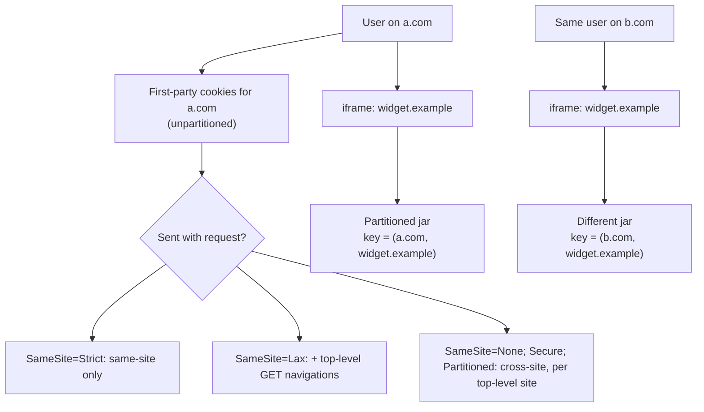

# Cookies & Partitioned Storage

> A cookie is the only client storage that travels with every request automatically — which is exactly why it can authenticate you and exactly why it can be exploited to authenticate someone else's request as you.

**Part:** [00 · Foundations](../) · **Domain:** Browser APIs · **Priority:** Critical · **Difficulty:** Foundational · **Reading time:** ~11 min

## TL;DR

Cookies are small name/value pairs the browser attaches to requests matching their `Domain` and `Path`. Their attributes are the whole security model: **`HttpOnly`** hides them from JavaScript (so XSS cannot read the session), **`Secure`** restricts them to HTTPS, **`SameSite`** controls whether they ride along on cross-site requests (`Lax` is now the browser default, `None` requires `Secure`), and `Max-Age`/`Expires` decide persistence. Separately, browsers have moved to **storage partitioning**: an embedded third-party's cookies and storage are keyed by *top-level site + the embedded site*, so `widget.example` embedded on `a.com` gets a different jar than on `b.com`. **CHIPS** (`Partitioned` attribute) is the sanctioned way to keep a working third-party cookie under that model. Because cookies are sent automatically, they are the root cause of CSRF, and because they are sent on every matching request, they are a bandwidth cost on every request too.

> **Recommendation:** Use `HttpOnly; Secure; SameSite=Lax` cookies for session identity, keep them small and path-scoped, add `Partitioned` for any cookie that must work in a third-party context, and never store tokens in `localStorage`.

## At a Glance

| | |
| --- | --- |
| **Use when** | The server must see the value — session identity, CSRF tokens, locale for server rendering, A/B assignment. |
| **Avoid when** | Only the client needs the data — that is Web Storage or IndexedDB, with no per-request cost. |
| **Alternatives** | [Web Storage](#alternative-approaches), [IndexedDB](#alternative-approaches), `Authorization` headers, server sessions keyed by an opaque ID. |
| **Primary risk** | Cross-site request forgery from automatic transmission, and token theft from non-`HttpOnly` cookies. |
| **Maturity** | Stable core; partitioning and CHIPS are actively rolling out and browser behavior still differs. |

## Prerequisites

Origin scoping and storage basics come first.

- [Web Storage](./web-storage.md) — the client-only alternative and the origin model cookies deviate from.

## Overview

A cookie is set with a `Set-Cookie` response header (or `document.cookie` for non-`HttpOnly` ones) and returned on subsequent matching requests in a single `Cookie` header.

| Attribute | Effect | Practical guidance |
| --- | --- | --- |
| `HttpOnly` | Hidden from `document.cookie` | Mandatory for session and auth cookies |
| `Secure` | Sent only over HTTPS | Always; required when `SameSite=None` |
| `SameSite=Strict` | Never sent on cross-site requests, including top-level navigation | Breaks inbound links into authenticated pages |
| `SameSite=Lax` | Sent on top-level GET navigations only | The modern default; right for most sessions |
| `SameSite=None` | Sent on all cross-site requests | Requires `Secure`; needs `Partitioned` under partitioning |
| `Domain` | Widens scope to a domain and its subdomains | Omit to keep it host-only — the safer default |
| `Path` | Restricts to a path prefix | Not a security boundary; same-origin scripts bypass it |
| `Max-Age` / `Expires` | Persistence | Omit for session cookies that die with the browser |
| `Partitioned` | Keys the cookie by top-level site (CHIPS) | Required for third-party cookies going forward |

Two scoping subtleties matter. Cookies use **site**, not **origin**: `https://app.example.com` and `http://app.example.com` share a cookie jar in ways `localStorage` does not, and a `Domain=example.com` cookie is visible to every subdomain. And the `__Host-` name prefix enforces the strictest configuration — `Secure`, no `Domain`, `Path=/` — which browsers verify, making it the most tamper-resistant option for session cookies.

**Storage partitioning** changes the third-party picture wholesale. Under partitioning, an iframe from `widget.example` embedded in `a.com` sees storage keyed to (`a.com`, `widget.example`); the same widget on `b.com` sees a different jar; and neither is the jar `widget.example` has when visited directly. This applies to cookies and to `localStorage`, IndexedDB, and Cache Storage alike. **CHIPS** re-enables the legitimate cases: a cookie set with `Partitioned` works in a third-party context but is scoped to that top-level site, so it cannot be used for cross-site tracking.

## The Problem

The default configuration is dangerous, and the common workaround is worse.

```http
Set-Cookie: session=abc123
```

No `HttpOnly`, so any XSS — including one in a third-party script — reads the session with one line of JavaScript. No `Secure`, so the cookie is sent in plaintext over any HTTP request to the same site. No `SameSite` — modern browsers default to `Lax`, but older ones default to `None`, so behavior differs by client. No `__Host-` prefix, so a compromised subdomain can overwrite it.

The workaround people reach for is storing the token where JavaScript can see it:

```js
// ❌ Now every script on the page can exfiltrate the token.
localStorage.setItem("token", jwt);
fetch("/api", { headers: { Authorization: `Bearer ${localStorage.token}` } });
```

This trades CSRF for XSS. It does remove automatic transmission, but it puts the credential in the one place an injected script can reach it — and unlike an `HttpOnly` cookie, there is no browser-enforced barrier at all.

The third problem is scale. Cookies are sent on every matching request, including images, fonts, and API calls:

```http
Cookie: session=abc123; prefs={"theme":"dark","density":"compact",…}; ab_test=…; analytics_id=…
```

Four kilobytes of cookies on two hundred requests is 800 KB of upload on a page load, on connections where upload is the scarce resource.

And the fourth is the one that broke many integrations recently: a third-party embed that relied on an unpartitioned cookie simply stops working when the browser partitions storage, with no error other than "the user appears logged out inside the iframe".

## Why It Matters

Cookies are the substrate of web authentication. Session identity, CSRF defense, and server-side personalization all depend on them, and the attributes are not tuning knobs — they are the difference between a session that survives an XSS and one that does not. `HttpOnly` alone converts a full account takeover into a much narrower attack.

Automatic transmission is what makes CSRF possible at all: a form on `attacker.com` posting to `bank.example` carries the victim's cookies unless `SameSite` prevents it. `SameSite=Lax` closed the default hole for cross-site POSTs, which is why it is now the browser default — but `Lax` still allows top-level GET navigations, so any state-changing GET endpoint remains exposed.

Partitioning matters because it invalidates a decade of assumptions. Analytics, embedded chat, payment iframes, SSO in iframes, and shared session state across a group of related sites all assumed a single third-party jar. Under partitioning they must either move to a first-party context, adopt CHIPS with per-site state, or use an explicit permission API. Teams that discover this from a support ticket rather than a plan lose weeks.

## Mental Model

One jar per (top-level site, cookie site) pair, with attributes deciding who reads and when it is sent.



Four rules follow.

**Cookies are automatic; everything else is explicit.** That single property causes both their usefulness and CSRF.

**`HttpOnly` is the boundary between "XSS reads data" and "XSS steals the session".**

**Scope is by site, not origin, and `Domain` widens it further.** Omit `Domain` unless subdomains genuinely need the cookie.

**Third-party context is partitioned by default.** A cookie that must work there needs `Partitioned`, and its state is per top-level site.

## Best Practices

**Set session cookies as `__Host-session=…; HttpOnly; Secure; SameSite=Lax; Path=/`.** The prefix is browser-enforced, so a subdomain cannot overwrite it.

**Never store credentials in `localStorage` or a readable cookie.** `HttpOnly` is the only client-side barrier that an injected script cannot cross.

**Keep cookies tiny and few.** Everything the server does not need belongs in Web Storage or IndexedDB, which cost nothing per request.

**Serve static assets from a cookieless origin** so bundles and images are not carrying session headers.

**Add `Partitioned` to any cookie that must work in an embedded context**, and design for per-top-level-site state rather than one shared value.

**Pair `SameSite=Lax` with anti-CSRF tokens for state-changing requests.** `Lax` still permits top-level GET, so no state change should happen on GET.

**Rotate the session identifier on privilege change.** Login, logout, and role escalation should all issue a new value.

**Test the third-party path with partitioning enabled**, not just in a browser that still allows legacy third-party cookies.

## Trade-offs

Cookies buy automatic, server-visible state at a real cost.

**Advantages**

- Sent automatically, so no client code is needed to authenticate a request or a navigation.
- Visible to the server on the *first* request, which is what makes server-side rendering personalizable.
- `HttpOnly` gives a browser-enforced barrier no JavaScript-readable storage can match.
- Attribute-level control over transport, scope, lifetime, and cross-site behavior.
- Survive across tabs and, with `Max-Age`, across sessions.

**Disadvantages**

- Automatic transmission is the mechanism of CSRF.
- Bandwidth cost on every matching request, including static assets.
- ~4 KB per cookie and a per-domain count limit — not a general store.
- Scoping is by site with subdomain leakage via `Domain`, unlike origin-scoped storage.
- Third-party behavior is changing under partitioning, so integrations need active maintenance.

| Dimension | Cookie | Web Storage | IndexedDB |
| --- | --- | --- | --- |
| Server sees it | Yes, automatically | No | No |
| Readable by JS | Unless `HttpOnly` | Always | Always |
| Size | ~4 KB per cookie | ~5 MB | Large |
| Per-request cost | Yes, every match | None | None |
| Scope | Site (+ subdomains via `Domain`) | Origin | Origin |
| Partitioned in third-party context | Yes (CHIPS) | Yes | Yes |
| Best for | Session identity, server-read flags | Small client preferences | Client data at scale |

## Alternative Approaches

| Approach | Best when | Weakness | See |
| --- | --- | --- | --- |
| `HttpOnly` session cookie | Standard authenticated web apps | Requires CSRF defense; per-request bytes | (this article) |
| Token in `Authorization` header | Cross-origin APIs, native clients | Token must be stored somewhere JS can read | [Same-Origin Policy · Security](../../05-reliability-quality/security/same-origin-policy.md) |
| Web Storage | Client-only preferences | Not sent to the server; readable by any script | [Web Storage](./web-storage.md) |
| IndexedDB | Large client-side data | Not sent to the server | [IndexedDB](./indexeddb.md) |
| CHIPS (`Partitioned`) | A third-party embed that needs its own state per site | State cannot be shared across top-level sites — by design | (this article) |

## Bad Example

An authentication setup that fails on every attribute.

```http
# ❌ Readable by JS, sent over HTTP, no SameSite, scoped to all subdomains.
Set-Cookie: session=eyJhbGciOi...; Domain=.example.com; Path=/; Max-Age=31536000
```

```js
// ❌ Duplicating the token where any script can read it.
document.cookie = `token=${jwt}; path=/`;
localStorage.setItem("token", jwt);

// ❌ Storing a whole preferences object in a cookie, sent on every request.
document.cookie = `prefs=${encodeURIComponent(JSON.stringify(prefs))}; path=/`;

// ❌ A state-changing GET endpoint — reachable cross-site even with SameSite=Lax.
// GET /account/delete?confirm=1
```

```html
<!-- ❌ Third-party embed assuming a shared, unpartitioned cookie jar. -->
<iframe src="https://widget.example/session"></iframe>
```

**What goes wrong:** The session cookie omits `HttpOnly`, so a single XSS anywhere on the site — including in a third-party analytics script — reads it with `document.cookie` and the attacker has a full year of authenticated access, since `Max-Age=31536000` also makes it persistent. Omitting `Secure` means the same cookie is transmitted in cleartext to any `http://` URL on the domain, so a network attacker on shared Wi-Fi can capture it without any XSS at all. `Domain=.example.com` shares the session with every subdomain, so a compromised marketing or staging subdomain can both read and overwrite it. Copying the JWT into `localStorage` removes even the theoretical protection, and storing preferences in a cookie adds their full JSON to every request the browser makes to the site, including every image and font. The `GET /account/delete` endpoint is reachable cross-site even under `SameSite=Lax`, because `Lax` explicitly permits top-level GET navigations — an `` or a link from another site is enough. And the iframe assumes `widget.example` has one cookie jar across all embedders, which under storage partitioning it does not, so the widget shows a logged-out state on every site and the failure looks like a widget bug rather than a platform change.

## Good Example

Attributes that carry the security model, with client data kept out of the request path.

```http
# ✅ Prefix enforced by the browser: Secure, no Domain, Path=/.
Set-Cookie: __Host-session=<opaque-id>; HttpOnly; Secure; SameSite=Lax; Path=/

# ✅ CSRF token: readable by JS on purpose, so it can be echoed in a header.
Set-Cookie: __Host-csrf=<random>; Secure; SameSite=Lax; Path=/

# ✅ Third-party widget cookie under CHIPS — per top-level site by design.
Set-Cookie: __Host-widget=<id>; HttpOnly; Secure; SameSite=None; Partitioned; Path=/
```

```js
// ✅ Client-only preferences never touch the request path.
localStorage.setItem("prefs", JSON.stringify(prefs));

// ✅ State changes are POST/PUT/DELETE and carry the double-submit token.
async function deleteAccount() {
  const csrf = document.cookie
    .split("; ")
    .find((c) => c.startsWith("__Host-csrf="))
    ?.split("=")[1];

  await fetch("/account", {
    method: "DELETE",                 // never GET for a state change
    headers: { "X-CSRF-Token": csrf },
    credentials: "same-origin",       // explicit about cookie transmission
  });
}
```

```js
// ✅ Server-side: rotate on privilege change, and expire deliberately.
function issueSession(res, userId) {
  const id = crypto.randomUUID();                 // opaque; no claims in the cookie
  sessions.set(id, { userId, createdAt: Date.now() });
  res.setHeader("Set-Cookie", [
    `__Host-session=${id}; HttpOnly; Secure; SameSite=Lax; Path=/; Max-Age=86400`,
  ]);
}

function logout(res, id) {
  sessions.delete(id);                            // invalidate server-side too
  res.setHeader("Set-Cookie", "__Host-session=; HttpOnly; Secure; SameSite=Lax; Path=/; Max-Age=0");
}
```

```js
// ✅ Embedded widget: detect partitioning and ask for access only when needed.
async function ensureEmbeddedSession() {
  if (document.hasStorageAccess && !(await document.hasStorageAccess())) {
    try {
      await document.requestStorageAccess();      // user-gesture required
    } catch {
      // Fall back to a partitioned, per-site session rather than failing.
      return startPartitionedSession();
    }
  }
  return resumeSession();
}
```

**Why it's better:** The session cookie is opaque — a random ID, not a token containing claims — so even if it leaks it grants nothing beyond a session the server can revoke, and `sessions.delete` on logout makes revocation real rather than advisory. The `__Host-` prefix is enforced by the browser, which rejects the cookie unless it is `Secure`, has no `Domain`, and uses `Path=/`, so a compromised subdomain cannot overwrite it and the strict configuration cannot be silently weakened by a later change. `HttpOnly` keeps it out of reach of any injected script, while the separate CSRF cookie is deliberately readable so the client can echo it in a header — the double-submit pattern that covers the requests `SameSite=Lax` still permits. Making the delete endpoint a `DELETE` rather than a `GET` closes the top-level-navigation hole that `Lax` leaves open. Preferences move to `localStorage`, removing their bytes from every request the browser makes. The widget cookie carries `Partitioned`, so it works inside an iframe under the current storage model with state scoped per top-level site, and the embed code checks `hasStorageAccess` first, requesting access only with a user gesture and falling back to a partitioned per-site session rather than appearing broken.

## Common Mistakes

See the [Browser APIs anti-patterns](../../../anti-patterns/) for the domain catalog. Concept-specific:

### Mistake: Storing auth tokens where JavaScript can read them

- **Symptom:** A single XSS — often in a third-party script — results in full account takeover rather than limited damage.
- **Why it fails:** `localStorage`, `sessionStorage`, and non-`HttpOnly` cookies are all readable by any script running on the page. There is no browser-enforced boundary between your code and injected code.
- **Fix:** Keep session identity in an `HttpOnly; Secure; SameSite=Lax` cookie, ideally with the `__Host-` prefix, and pair it with CSRF tokens for state-changing requests.

### Mistake: Treating `SameSite=Lax` as complete CSRF protection

- **Symptom:** A state-changing GET endpoint is triggered from another site via a link or an image tag.
- **Why it fails:** `Lax` still sends cookies on top-level GET navigations, by design, so that inbound links to authenticated pages work. Anything that changes state on GET is still reachable.
- **Fix:** Use POST/PUT/DELETE for all state changes and validate an anti-CSRF token; reserve `Strict` for cookies where losing inbound-link sessions is acceptable.

### Mistake: Assuming a third-party cookie jar is shared across sites

- **Symptom:** An embedded widget, chat, or SSO iframe shows a logged-out state on some or all embedding sites, with no error.
- **Why it fails:** Storage partitioning keys third-party cookies and storage by (top-level site, embedded site), so state established on one embedder is invisible on another — and unpartitioned third-party cookies may be blocked entirely.
- **Fix:** Add `Partitioned` (CHIPS) and design for per-top-level-site state, or use the Storage Access API with a user gesture where genuinely shared state is required.

## Checklist

- [ ] Session cookies are `HttpOnly`, `Secure`, `SameSite=Lax` (or `Strict`), and use the `__Host-` prefix.
- [ ] No credential, token, or JWT is stored in `localStorage`, `sessionStorage`, or a JS-readable cookie.
- [ ] `Domain` is omitted unless subdomains genuinely need the cookie.
- [ ] All state-changing endpoints are non-GET and validate an anti-CSRF token.
- [ ] Session identifiers are opaque and rotate on login, logout, and privilege change.
- [ ] Client-only data lives in Web Storage or IndexedDB, not in cookies.
- [ ] Total cookie size per request is measured and kept small; static assets are served cookieless.
- [ ] Cookies needed in embedded contexts carry `Partitioned`, with per-top-level-site state assumed.
- [ ] Third-party integrations were tested with third-party cookies blocked and partitioning enabled.
- [ ] `credentials` is set explicitly on cross-origin `fetch` calls rather than left to defaults.

## Related Articles

- [Web Storage](./web-storage.md) — where client-only preferences belong, with no per-request cost.
- [IndexedDB](./indexeddb.md) — structured client data, also subject to partitioning in third-party contexts.
- [The Cache Storage API](./the-cache-storage-api.md) — cached responses, which must not be shared across credential states.
- [Storage Quotas & Eviction](./) (planned) — the partitioned bucket cookies and storage now share.
- **Canonical home:** origin isolation, CSRF, and cross-site request rules are owned by [Same-Origin Policy · Security](../../05-reliability-quality/security/same-origin-policy.md).
- [HTTP/1.1 Semantics · Networking & Protocols](../networking-protocols/http-1-1-semantics.md) — the header mechanics `Set-Cookie` and `Cookie` ride on.

## References

- [IETF — RFC 6265bis: Cookies](https://datatracker.ietf.org/doc/html/draft-ietf-httpbis-rfc6265bis) — the current normative definition, including `SameSite` and prefixes.
- [MDN — Using HTTP cookies](https://developer.mozilla.org/en-US/docs/Web/HTTP/Cookies) — attributes, scoping, and security guidance.
- [MDN — `Set-Cookie`](https://developer.mozilla.org/en-US/docs/Web/HTTP/Headers/Set-Cookie) — per-attribute reference including `Partitioned`.
- [W3C Privacy CG — CHIPS](https://privacycg.github.io/CHIPS/) — partitioned third-party cookies and their constraints.
- [MDN — State Partitioning](https://developer.mozilla.org/en-US/docs/Web/Privacy/State_Partitioning) — how partitioning applies across cookies, Web Storage, IndexedDB, and Cache Storage.
