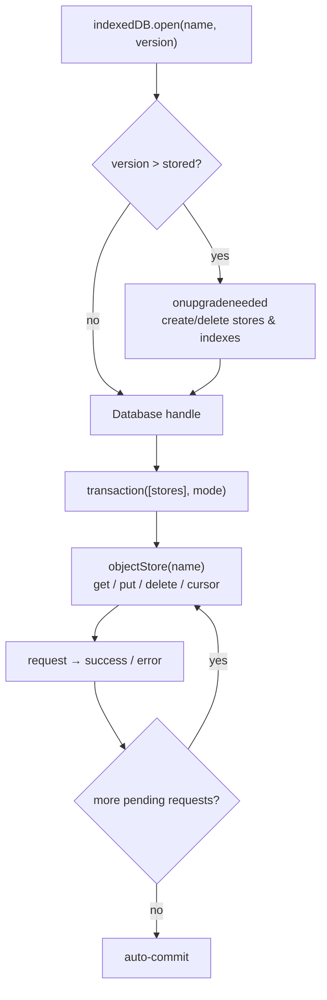

# IndexedDB

> A transaction stays open only as long as it has pending work. `await fetch()` in the middle of one does not pause it — it ends it, and the next store access throws.

**Part:** [00 · Foundations](../) · **Domain:** Browser APIs · **Priority:** Critical · **Difficulty:** Foundational · **Reading time:** ~8 min

## TL;DR

**IndexedDB** is an asynchronous, transactional, origin-scoped database in the browser. It stores **structured-clone** values — objects, arrays, `Date`, `Map`, `Set`, `Blob`, `ArrayBuffer` — under a key, in named **object stores**, with optional **indexes** for querying by non-key fields. Unlike Web Storage it never blocks the main thread, is available in workers and service workers, and has quota measured in hundreds of megabytes or more. The costs are a verbose event-based API, a schema versioning ceremony via `onupgradeneeded`, and one rule that surprises everyone: a transaction **auto-commits as soon as its request queue drains**, so any `await` on something outside IndexedDB inside a transaction silently closes it.

> **Recommendation:** Use IndexedDB for anything structured, large, or frequently written, and wrap it in a thin promise layer (or the `idb` library) rather than using the raw event API directly.

## At a Glance

| | |
| --- | --- |
| **Use when** | Storing collections, offline data, drafts, binary blobs, or anything written more than occasionally. |
| **Avoid when** | A handful of small scalar preferences — Web Storage is simpler; or caching HTTP responses — Cache Storage fits better. |
| **Alternatives** | [Web Storage](#alternative-approaches), [Cache Storage](#alternative-approaches), in-memory state, server persistence. |
| **Primary risk** | Transactions auto-committing across `await` boundaries, producing "TransactionInactiveError" under load. |
| **Maturity** | Stable — universally supported; IndexedDB 3.0 adds promise-friendly ergonomics incrementally. |

## Prerequisites

The simplest storage first, because IndexedDB is what you graduate to.

- [Web Storage](./web-storage.md) — the synchronous, string-only store and the limits that push you here.

## Overview

The model is four nested concepts:

| Concept | Role |
| --- | --- |
| **Database** | Named, origin-scoped, versioned. One schema per version. |
| **Object store** | A keyed collection — roughly a table. Keys are in-line (`keyPath`) or out-of-line (supplied per write). |
| **Index** | A secondary lookup over a property of stored values, optionally `unique` or `multiEntry`. |
| **Transaction** | The unit of atomicity, scoped to named stores, in mode `readonly`, `readwrite`, or `versionchange`. |

Schema changes happen only inside `onupgradeneeded`, which fires when the requested version exceeds the stored one. Creating and deleting stores and indexes is legal only there.

Values are stored by **structured clone**, so functions, DOM nodes, class prototypes, and symbols cannot be persisted — a class instance comes back as a plain object. Keys must be a number, string, `Date`, `ArrayBuffer`, or an array of those.

The transaction lifetime rule is the thing to learn first. A transaction is active while requests are outstanding; when the microtask queue drains with no pending request, it commits. So this works:

```js
const tx = db.transaction("drafts", "readwrite");
tx.objectStore("drafts").put(a);
tx.objectStore("drafts").put(b);   // still active — queued in the same turn
```

…and this throws, because the `await` lets the queue drain:

```js
const tx = db.transaction("drafts", "readwrite");
await fetch("/api/token");                      // transaction commits here
tx.objectStore("drafts").put(a);                // TransactionInactiveError
```

Awaiting an IndexedDB request itself is fine — that request keeps the transaction alive.

## The Problem

The raw API is event-based and easy to get subtly wrong.

```js
// ❌ Callback pyramid, no error handling, schema work in the wrong place.
const req = indexedDB.open("app");
req.onsuccess = () => {
  const db = req.result;
  const tx = db.transaction("todos", "readwrite");   // throws if store doesn't exist
  const store = tx.objectStore("todos");
  store.put({ id: 1, title: "Ship it" });
};
```

Three failures hide here. Opening without a version means the store may not exist on a first run, and store creation is illegal outside `onupgradeneeded`. Nothing listens for `onerror` or `onblocked`, so a failed open or a tab holding an old version stalls silently. And `tx.oncomplete` is never observed, so the caller has no way to know the write actually landed — `store.put()` resolving is not the same as the transaction committing.

The second problem is data that cannot round-trip:

```js
class Draft { constructor(t) { this.title = t; } save() { /* … */ } }
store.put(new Draft("Hello"));
const back = await store.get(1);
back.save();    // TypeError: back.save is not a function
```

Structured clone copies own enumerable data, not the prototype. The object survives; the class does not.

The third is treating IndexedDB as a synchronous cache — reading it in a render path, or per item in a loop, opening one transaction per record. Each transaction has setup cost, and hundreds of them serialize behind each other.

## Why It Matters

IndexedDB is the only general-purpose storage in the browser that is asynchronous, large, structured, and available to workers. That combination is what makes offline-capable applications possible: a service worker can read and write it while no page is open, a web worker can query it without touching the main thread, and hundreds of megabytes fit where Web Storage offers five.

It also has real query capability. Indexes support range queries (`IDBKeyRange.bound`), cursors stream results without loading everything into memory, and `count()` answers without materializing rows. Applications that outgrow "load the whole array and filter in JavaScript" have somewhere to go that is not a server round-trip.

The transactional guarantee matters more than it first appears. A `readwrite` transaction over several stores either fully commits or fully aborts, so a draft, its attachments, and its index entry cannot end up half-written after a crash or a closed tab. No other client storage offers that.

## Mental Model

A database of keyed stores, entered only through transactions that live for one turn of work.



Four rules follow.

**Schema changes only in `onupgradeneeded`.** Everywhere else, stores and indexes are read-only structures.

**A transaction is a short-lived turn, not a session.** Queue all its work synchronously or via IndexedDB requests only.

**`await` on anything else ends it.** Fetch first, then open the transaction.

**Committed means `tx.oncomplete`, not `request.onsuccess`.** Only the former guarantees durability.

## Best Practices

**Wrap the API in promises once.** A ~30-line helper, or the `idb` library, removes the event plumbing from every call site.

**Version explicitly and make upgrades additive.** Create the store if missing, add indexes, migrate data — and never assume the previous version's shape.

**Handle `onblocked` and `onversionchange`.** An old tab holding a connection blocks the upgrade; listen and prompt the user to reload.

**Batch writes into one transaction.** Queue every `put` in the same transaction rather than opening one per record.

**Do all fetching before opening a transaction.** Compute the values first, then write them in one uninterrupted turn.

**Use indexes and `IDBKeyRange` instead of loading everything.** Cursors stream; `getAll` with a range is usually enough.

**Store plain data.** Serialize class instances to plain objects on write and rehydrate on read.

**Request persistence for data that must survive pressure.** `navigator.storage.persist()` opts out of best-effort eviction.

## Trade-offs

IndexedDB trades ergonomics for capability.

**Advantages**

- Asynchronous — never blocks the main thread, unlike Web Storage.
- Large quota, typically a percentage of available disk rather than a fixed few megabytes.
- Structured values including `Blob` and `ArrayBuffer`, with no manual serialization.
- Real queries: indexes, ranges, cursors, counts.
- Atomic multi-store transactions.
- Available in workers and service workers.

**Disadvantages**

- Verbose event-based API that nearly everyone wraps.
- Transaction lifetime rules are unintuitive and fail only under specific timing.
- Schema migration ceremony for changes that would be trivial elsewhere.
- Subject to eviction under storage pressure unless persistence is granted.
- Debugging is harder — the devtools view is less immediate than Web Storage's key/value list.

| Dimension | IndexedDB | Web Storage | Cache Storage |
| --- | --- | --- | --- |
| API style | Async, event/promise | Sync | Async, promise |
| Value types | Structured clone | Strings only | `Request`/`Response` pairs |
| Typical quota | Large (disk-proportional) | ~5 MB | Large (shared bucket) |
| Query support | Indexes, ranges, cursors | None | URL matching |
| Worker access | Yes | No | Yes |
| Best for | App data, drafts, offline records | Small preferences | HTTP responses, assets |

## Alternative Approaches

| Approach | Best when | Weakness | See |
| --- | --- | --- | --- |
| IndexedDB directly | Full control, no dependency budget | Verbose; easy to misuse transactions | (this article) |
| `idb` wrapper library | Almost always — same semantics, promise API | One small dependency | (this article) |
| Web Storage | A few small scalar preferences | Synchronous, string-only, ~5 MB | [Web Storage](./web-storage.md) |
| Cache Storage | Caching HTTP responses and assets | Keyed by request, not by data shape | [The Cache Storage API](./the-cache-storage-api.md) |
| Server + query cache | Data must be shared across devices | Requires network; needs its own offline story | [Cache Invalidation · Data & Server State](../../03-application-architecture/data-server-state/cache-invalidation.md) |

## Bad Example

A draft store built directly on the event API.

```js
// ❌ No version, so the store may not exist; no error handling anywhere.
function saveDraft(draft) {
  const open = indexedDB.open("app");
  open.onsuccess = () => {
    const db = open.result;
    const tx = db.transaction("drafts", "readwrite");
    tx.objectStore("drafts").put(draft);
    // ❌ Caller has no idea whether this committed.
  };
}

// ❌ One transaction per item: N round trips, no atomicity.
async function saveAll(drafts) {
  for (const d of drafts) saveDraft(d);
}

// ❌ Network call inside a transaction: it commits at the await.
async function syncDraft(id) {
  const db = await openDb();
  const tx = db.transaction("drafts", "readwrite");
  const store = tx.objectStore("drafts");
  const draft = await promisify(store.get(id));

  const res = await fetch("/api/sync", { method: "POST", body: JSON.stringify(draft) });
  const saved = await res.json();

  store.put(saved);            // ❌ TransactionInactiveError
}

// ❌ Loads every record to find a few.
async function findByAuthor(author) {
  const all = await promisify(store.getAll());
  return all.filter((d) => d.author === author);
}

// ❌ Class instance stored; methods are gone on read.
store.put(new Draft("Hello"));
```

**What goes wrong:** `saveDraft` opens without a version, so on a fresh profile the `drafts` store does not exist and `db.transaction("drafts")` throws `NotFoundError` — and because nothing listens to `onerror`, the failure is invisible. Even when the store exists, the function returns before `tx.oncomplete`, so callers cannot distinguish "queued" from "durably written" and a tab closed a moment later loses the draft with no error. `saveAll` opens a separate transaction per draft, which serializes N setup costs and gives up atomicity entirely — a crash halfway through leaves some drafts saved and some not. `syncDraft` is the classic transaction-lifetime failure: `await fetch(...)` lets the microtask queue drain with no pending IndexedDB request, so the transaction auto-commits and the subsequent `store.put` throws — intermittently, because it depends on how fast the network responds. `findByAuthor` materializes the entire store into memory to return a handful of records, which is the pattern indexes exist to prevent. And the `Draft` instance is flattened by structured clone, so reading it back gives a plain object whose methods no longer exist.

## Good Example

The same store with a thin promise wrapper and transactions that respect their lifetime.

```js
// ✅ One place that knows about versions, upgrades, and blocking.
function openDb() {
  return new Promise((resolve, reject) => {
    const req = indexedDB.open("app", 2);

    req.onupgradeneeded = (e) => {
      const db = req.result;
      if (!db.objectStoreNames.contains("drafts")) {
        const store = db.createObjectStore("drafts", { keyPath: "id" });
        store.createIndex("by_author", "author");
        store.createIndex("by_updated", "updatedAt");
      }
      if (e.oldVersion < 2) {
        req.transaction.objectStore("drafts").createIndex("by_status", "status");
      }
    };

    req.onsuccess = () => {
      // An upgrade elsewhere needs this connection closed.
      req.result.onversionchange = () => req.result.close();
      resolve(req.result);
    };
    req.onerror = () => reject(req.error);
    req.onblocked = () => reject(new Error("Close other tabs to upgrade the database"));
  });
}

// ✅ Resolve on commit, not on request success.
function txDone(tx) {
  return new Promise((resolve, reject) => {
    tx.oncomplete = () => resolve();
    tx.onerror = () => reject(tx.error);
    tx.onabort = () => reject(tx.error ?? new Error("Transaction aborted"));
  });
}

const request = (req) =>
  new Promise((resolve, reject) => {
    req.onsuccess = () => resolve(req.result);
    req.onerror = () => reject(req.error);
  });
```

```js
// ✅ All writes in one atomic transaction; awaits only on IDB requests.
export async function saveAll(drafts) {
  const db = await openDb();
  const tx = db.transaction("drafts", "readwrite");
  const store = tx.objectStore("drafts");
  for (const d of drafts) store.put(toPlain(d));   // queued in one turn
  await txDone(tx);                                 // durable when this resolves
}

// ✅ Network first, transaction second — never interleaved.
export async function syncDraft(id) {
  const db = await openDb();

  const read = db.transaction("drafts", "readonly");
  const draft = await request(read.objectStore("drafts").get(id));

  const res = await fetch("/api/sync", {
    method: "POST",
    body: JSON.stringify(draft),
  });
  const saved = await res.json();

  const write = db.transaction("drafts", "readwrite");
  write.objectStore("drafts").put(saved);
  await txDone(write);
}

// ✅ Index + range instead of loading the whole store.
export async function findByAuthor(author) {
  const db = await openDb();
  const tx = db.transaction("drafts", "readonly");
  const index = tx.objectStore("drafts").index("by_author");
  return request(index.getAll(IDBKeyRange.only(author)));
}
```

```js
// ✅ Plain data in, rehydration out — structured clone stays happy.
const toPlain = (d) => ({ id: d.id, title: d.title, author: d.author, updatedAt: d.updatedAt });
const toDraft = (row) => Object.assign(new Draft(row.title), row);

// ✅ Ask for persistence where losing the data would matter.
if (navigator.storage?.persist) {
  const persisted = await navigator.storage.persist();
  if (!persisted) console.info("Storage is best-effort; data may be evicted.");
}
```

**Why it's better:** `openDb` centralizes the version number, creates stores and indexes only inside `onupgradeneeded` where that is legal, and handles the two events people forget — `onblocked`, which fires when another tab holds an older connection, and `onversionchange`, which lets this tab step aside for someone else's upgrade. `txDone` resolves on `oncomplete`, so `await saveAll(...)` means the data is durably committed rather than merely queued, and a caller can safely tell the user the draft is saved. `saveAll` queues every `put` inside one transaction in a single turn, giving both atomicity — all drafts or none — and a single setup cost regardless of count. `syncDraft` splits the work into read, network, write, so no `await` on a non-IndexedDB promise ever sits inside a live transaction, which removes the intermittent `TransactionInactiveError` entirely. `findByAuthor` queries the `by_author` index with a key range, so the browser returns only matching records instead of materializing the store. And the plain-object conversion makes the structured-clone constraint explicit at the boundary rather than discovering it when a method is missing, while `navigator.storage.persist()` moves the data out of the best-effort eviction pool.

## Common Mistakes

See the [Browser APIs anti-patterns](../../../anti-patterns/) for the domain catalog. Concept-specific:

### Mistake: Awaiting a non-IndexedDB promise inside a transaction

- **Symptom:** Intermittent `TransactionInactiveError`, usually only on slower networks or under load.
- **Why it fails:** A transaction auto-commits as soon as its request queue drains. Awaiting a fetch, a timer, or any unrelated promise lets that happen, so the transaction is already closed when the next store call runs.
- **Fix:** Do all external work before opening the transaction, then queue every store operation in one uninterrupted turn. Awaiting IndexedDB requests themselves is safe.

### Mistake: Treating `request.onsuccess` as "saved"

- **Symptom:** Data is missing after a tab closes or a crash, despite the write appearing to succeed.
- **Why it fails:** A successful request means the operation was accepted by the transaction, not that the transaction committed. Durability is signalled by `tx.oncomplete`.
- **Fix:** Resolve write helpers on `oncomplete` and reject on `onerror`/`onabort`; only report success to the user after that.

### Mistake: Creating stores or indexes outside `onupgradeneeded`

- **Symptom:** `InvalidStateError` on `createObjectStore`, or `NotFoundError` when opening a transaction on a store that was never created.
- **Why it fails:** Schema changes are legal only inside a `versionchange` transaction, which the browser runs during `onupgradeneeded` after a version bump.
- **Fix:** Bump the version and create or migrate structures inside `onupgradeneeded`, guarding with `objectStoreNames.contains` so upgrades are idempotent.

## Checklist

- [ ] The database is opened with an explicit version, and all schema work happens in `onupgradeneeded`.
- [ ] `onerror`, `onblocked`, and `onversionchange` are all handled.
- [ ] Write helpers resolve on `tx.oncomplete`, not on request success.
- [ ] No `await` on non-IndexedDB promises occurs inside an open transaction.
- [ ] Bulk writes share one transaction rather than one per record.
- [ ] Queries use indexes and `IDBKeyRange` instead of `getAll` plus client-side filtering.
- [ ] Stored values are plain, structured-cloneable data; class instances are serialized and rehydrated.
- [ ] `navigator.storage.persist()` is requested where data loss would be user-visible.
- [ ] Upgrade paths are tested from every previously shipped version, not just from empty.

## Related Articles

- [Web Storage](./web-storage.md) — the simpler store, and the limits that lead here.
- [The Cache Storage API](./the-cache-storage-api.md) — response-level storage for offline assets, alongside this for data.
- [Cookies & Partitioned Storage](./cookies-and-partitioned-storage.md) — the store the server can see, and its partitioning rules.
- [Storage Quotas & Eviction](./) (planned) — how much space you get and when the browser reclaims it.
- [Cache Invalidation · Data & Server State](../../03-application-architecture/data-server-state/cache-invalidation.md) — keeping persisted client data consistent with the server.
- **Canonical home:** what "origin" means for storage isolation is owned by [Same-Origin Policy · Security](../../05-reliability-quality/security/same-origin-policy.md).

## References

- [W3C — Indexed Database API 3.0](https://www.w3.org/TR/IndexedDB/) — the normative transaction lifetime and upgrade semantics.
- [MDN — IndexedDB API](https://developer.mozilla.org/en-US/docs/Web/API/IndexedDB_API) — interface reference for databases, stores, indexes, and cursors.
- [MDN — Using IndexedDB](https://developer.mozilla.org/en-US/docs/Web/API/IndexedDB_API/Using_IndexedDB) — worked examples including versioning and blocked upgrades.
- [MDN — The structured clone algorithm](https://developer.mozilla.org/en-US/docs/Web/API/Web_Workers_API/Structured_clone_algorithm) — exactly which values can be persisted.
