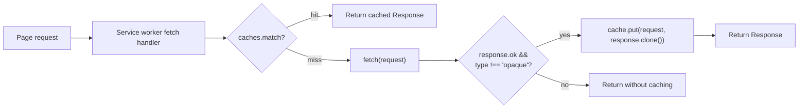

# The Cache Storage API

> `caches` is not the HTTP cache. It is a map from `Request` to `Response` that you control completely — which means nothing expires unless you delete it.

**Part:** [00 · Foundations](../) · **Domain:** Browser APIs · **Priority:** Critical · **Difficulty:** Foundational · **Reading time:** ~8 min

## TL;DR

The **Cache Storage API** (`caches`) stores whole `Request`/`Response` pairs in named caches, keyed by request URL plus optional `Vary` matching. It is available on `window`, in workers, and in service workers, and it is **entirely under your control**: no `Cache-Control` header is consulted, nothing is evicted by age, and a stale entry stays until you remove it. That makes it the right place for precached application shells, offline fallbacks, and explicit caching strategies (cache-first, network-first, stale-while-revalidate), and the wrong place for structured application data — that belongs in [IndexedDB](./indexeddb.md). The main hazards are unbounded growth, missing cleanup of old cache versions, and **opaque responses** from no-CORS cross-origin requests, which are unreadable, uncheckable for errors, and padded to a large fixed size against your quota.

> **Recommendation:** Version your cache names, delete old versions in `activate`, never cache non-`ok` or opaque responses without a deliberate reason, and keep runtime caches size-bounded.

## At a Glance

| | |
| --- | --- |
| **Use when** | Offline support, app-shell precaching, and explicit request-level caching strategies. |
| **Avoid when** | Storing structured data, queries, or anything you need to search — use IndexedDB. |
| **Alternatives** | [HTTP cache headers](#alternative-approaches), [IndexedDB](#alternative-approaches), in-memory query caches. |
| **Primary risk** | Caches that grow without bound or serve stale assets forever because nothing invalidates them. |
| **Maturity** | Stable — part of the Service Workers specification, supported in all modern browsers. |

## Prerequisites

Storage fundamentals first.

- [Web Storage](./web-storage.md) — origin scoping and the quota model this shares.

## Overview

Two interfaces:

| Interface | Purpose |
| --- | --- |
| `caches` (`CacheStorage`) | Named caches: `open`, `has`, `delete`, `keys`, and a cross-cache `match`. |
| `Cache` | Entries within one cache: `match`, `matchAll`, `add`, `addAll`, `put`, `delete`, `keys`. |

Behavior worth knowing before writing a strategy:

**Matching is by URL, and by default the full URL including query string.** `ignoreSearch`, `ignoreMethod`, and `ignoreVary` relax this per call.

**Only GET is cached by default.** `cache.put` with a non-GET request throws unless `ignoreMethod` is used on lookup; POST responses are not cacheable here.

**`add`/`addAll` fetch and store, and reject on any non-`ok` response.** `put` stores whatever you hand it, including a 404 — which is why explicit `response.ok` checks matter when using `put`.

**Responses are streams and can be consumed once.** You must `response.clone()` before storing a response you also intend to return.

**Opaque responses (`type: "opaque"`)** come from cross-origin `no-cors` requests. Status reads as `0`, headers and body are unreadable, and browsers pad their quota cost — often to several hundred kilobytes each regardless of actual size — to prevent size-based cross-origin probing.

Cache Storage sits alongside, not inside, the HTTP cache. A `fetch()` inside a service worker may itself be served from the HTTP cache; what you `put` into `caches` is a second, independent copy that no header controls.

## The Problem

The naive service worker caches everything and cleans up nothing.

```js
// ❌ Unversioned cache name; nothing ever invalidates.
self.addEventListener("install", (e) => {
  e.waitUntil(caches.open("assets").then((c) => c.addAll(["/", "/app.js", "/app.css"])));
});

// ❌ Cache-first for everything, including API calls and third-party requests.
self.addEventListener("fetch", (e) => {
  e.respondWith(
    caches.match(e.request).then((hit) => hit || fetch(e.request).then((res) => {
      caches.open("assets").then((c) => c.put(e.request, res));   // ❌ body consumed
      return res;
    }))
  );
});
```

Four failures. The cache name never changes, so a deployment that ships a new `app.js` at the same URL is never seen — users run last week's build until they clear site data. Cache-first applied to API responses means data never refreshes. Every cross-origin request (fonts, analytics, ad pixels) is stored as an opaque response, each charged a padded size against the quota until the origin is evicted wholesale. And `c.put(e.request, res)` stores the same `Response` object that is being returned to the page, so whichever consumer reads the body first leaves the other with an already-consumed stream — producing an empty response or a `TypeError`, intermittently.

The related failure is caching errors:

```js
const res = await fetch(request);
await cache.put(request, res.clone());   // ❌ a 500 or a redirect to a login page
```

A single failed deploy or an expired session can pin an error page into the cache indefinitely, and because nothing expires, the user sees it after the outage is resolved.

## Why It Matters

Cache Storage is the mechanism behind every offline-capable web application. It is what lets a service worker answer a navigation request with no network, what makes an installed PWA start instantly, and what allows a flaky-connection experience to degrade to "last known good" rather than a browser error page. Nothing else in the platform can serve a `Response` when the network is unavailable.

Its manual nature is both the feature and the danger. Because no header controls it, you can serve a hashed bundle forever and swap versions atomically — the correctness model most build pipelines already assume. But the same property means a mistake is permanent: there is no max-age to eventually rescue you, and the users affected are precisely those who visited before the fix.

Quota is the second reason to care. Cache Storage shares the origin's quota with IndexedDB and the rest of the storage bucket, and an unbounded runtime cache — especially one full of padded opaque responses — can push the origin over its limit, at which point the browser may evict *everything*, including the IndexedDB data an offline application depends on.

## Mental Model

An explicit map you own, sitting between the page and the network.



Four rules follow.

**You are the expiry policy.** Nothing leaves the cache unless you delete it.

**Version the cache name, not the entries.** A new version is a new cache; the old one is deleted wholesale on `activate`.

**Clone before you store.** A `Response` body is a single-use stream.

**Different content types want different strategies.** Hashed assets are cache-first; HTML and API data are network-first or stale-while-revalidate.

## Best Practices

**Name caches with a version: `assets-v7`.** Deploying a new version installs a fresh cache; the old one is deleted in `activate`.

**Delete unknown caches in `activate`.** `caches.keys()` minus your current names, deleted — that is the whole cleanup story.

**Match the strategy to the resource.** Cache-first for hashed, immutable assets; network-first for HTML and API responses; stale-while-revalidate for content that can be one revision old.

**Check `response.ok` and `response.type` before `put`.** Never persist a 4xx/5xx, a redirect to an auth page, or an opaque response you did not intend.

**Clone explicitly.** `cache.put(req, res.clone())`, returning the original.

**Bound runtime caches.** Cap entry count or age and trim on write; the API has no LRU of its own.

**Restrict cross-origin caching to a known allowlist.** Fonts and CDN assets, requested with CORS where possible so the responses are not opaque.

**Provide an offline fallback for navigations.** A cached `/offline.html` is a far better failure than the browser's error page.

## Trade-offs

Total control means total responsibility.

**Advantages**

- Works with no network at all — the only storage that can answer a `fetch`.
- Immune to header misconfiguration; the cache does exactly what your code says.
- Atomic version swaps: install the new cache, then delete the old one.
- Available in service workers, so caching happens without a page open.
- Stores the full `Response` including headers and status.

**Disadvantages**

- No expiry, no LRU, no size limits — all of it is your code.
- Opaque responses are unreadable, unverifiable, and quota-expensive.
- Easy to serve stale application code indefinitely after a bad deploy.
- Shares the origin quota, so overgrowth can trigger eviction of other storage.
- Debugging requires reasoning about two caches (HTTP and Cache Storage) at once.

| Dimension | Cache Storage | HTTP cache | IndexedDB |
| --- | --- | --- | --- |
| Controlled by | Your code | Response headers | Your code |
| Works offline | Yes, via service worker | Only for fresh entries | Yes (data, not responses) |
| Unit stored | `Request` → `Response` | Response, per URL | Structured values by key |
| Expiry | Manual only | `Cache-Control`, heuristics | Manual only |
| Queryable | By URL match | No | Indexes, ranges, cursors |
| Best for | App shell, offline, strategies | Standard asset caching | Application data |

## Alternative Approaches

| Approach | Best when | Weakness | See |
| --- | --- | --- | --- |
| Cache Storage + service worker | Offline support and explicit strategies | You own expiry and size management | (this article) |
| HTTP `Cache-Control` alone | Standard asset caching with no offline requirement | Cannot serve when offline; no programmatic control | [Resource Prefetch & Preload · Performance](../../05-reliability-quality/performance/resource-prefetch-and-preload.md) |
| IndexedDB | Structured data, queries, drafts | Not a `Response` store; cannot answer a fetch | [IndexedDB](./indexeddb.md) |
| In-memory query cache | Session-scoped server state in the page | Lost on reload; no offline value | [Cache Invalidation · Data & Server State](../../03-application-architecture/data-server-state/cache-invalidation.md) |
| Workbox | You want strategies, expiry, and precaching pre-built | A dependency and a build step | (this article) |

## Bad Example

A service worker that caches indiscriminately and never cleans up.

```js
const CACHE = "assets";                       // ❌ never versioned

self.addEventListener("install", (event) => {
  event.waitUntil(
    caches.open(CACHE).then((c) => c.addAll(["/", "/app.js", "/app.css"]))
  );
});

self.addEventListener("fetch", (event) => {
  event.respondWith(
    (async () => {
      const hit = await caches.match(event.request);
      if (hit) return hit;                     // ❌ cache-first for everything

      const res = await fetch(event.request);
      const cache = await caches.open(CACHE);
      cache.put(event.request, res);           // ❌ stores the un-cloned response
      return res;                              // ❌ body already claimed
    })()
  );
});

// ❌ No activate handler at all: old caches accumulate across deploys.
```

**What goes wrong:** The cache name is a constant, so every deploy writes into the same cache and the `addAll` in `install` finds `/app.js` already present — users keep running the build they first installed, and the only recovery is clearing site data. Cache-first is applied to every request, so API responses are frozen at their first value and the application shows data that never updates, while third-party requests are stored as opaque responses whose padded quota cost can be hundreds of kilobytes each. `cache.put(event.request, res)` passes the same `Response` that is returned to the page, and since a body is a single-use stream, whichever side reads it first leaves the other with nothing — the symptom is intermittently blank pages or `TypeError: Failed to execute 'put'`. There is no check on `res.ok`, so a 500 during a deploy or a redirect to a login page is cached permanently and served after the incident is over. And with no `activate` handler, caches from every previous cache-name change linger, consuming quota until the browser evicts the origin — taking IndexedDB with it.

## Good Example

Versioned caches, per-resource strategies, and explicit cleanup.

```js
const VERSION = "v7";
const PRECACHE = `precache-${VERSION}`;
const RUNTIME = `runtime-${VERSION}`;
const PRECACHE_URLS = ["/", "/offline.html", "/app.js", "/app.css"];

// ✅ New version → new cache. Install is atomic.
self.addEventListener("install", (event) => {
  event.waitUntil(
    caches.open(PRECACHE).then((c) => c.addAll(PRECACHE_URLS))
  );
});

// ✅ Delete every cache that isn't part of this version.
self.addEventListener("activate", (event) => {
  event.waitUntil(
    (async () => {
      const keep = new Set([PRECACHE, RUNTIME]);
      const names = await caches.keys();
      await Promise.all(names.filter((n) => !keep.has(n)).map((n) => caches.delete(n)));
      await self.clients.claim();
    })()
  );
});
```

```js
// ✅ Only cache responses that are worth caching.
function isCacheable(response) {
  return response.ok && response.type !== "opaque" && response.status !== 206;
}

// ✅ Strategy chosen per resource type.
self.addEventListener("fetch", (event) => {
  const { request } = event;
  if (request.method !== "GET") return;                  // POST/PUT go to the network

  const url = new URL(request.url);
  if (url.origin !== self.location.origin) return;       // no opaque third-party caching

  if (request.mode === "navigate") {
    event.respondWith(networkFirst(request));            // fresh HTML, offline fallback
  } else if (url.pathname.startsWith("/api/")) {
    event.respondWith(staleWhileRevalidate(request));    // fast, then refresh
  } else {
    event.respondWith(cacheFirst(request));              // hashed static assets
  }
});
```

```js
async function cacheFirst(request) {
  const cached = await caches.match(request);
  if (cached) return cached;

  const response = await fetch(request);
  if (isCacheable(response)) {
    const cache = await caches.open(RUNTIME);
    await cache.put(request, response.clone());          // ✅ clone before storing
    await trim(RUNTIME, 60);
  }
  return response;
}

async function networkFirst(request) {
  try {
    const response = await fetch(request);
    if (isCacheable(response)) {
      const cache = await caches.open(RUNTIME);
      await cache.put(request, response.clone());
    }
    return response;
  } catch {
    return (await caches.match(request)) ?? (await caches.match("/offline.html"));
  }
}

async function staleWhileRevalidate(request) {
  const cache = await caches.open(RUNTIME);
  const cached = await cache.match(request);

  const network = fetch(request).then((response) => {
    if (isCacheable(response)) cache.put(request, response.clone());
    return response;
  });

  return cached ?? network;                              // instant if cached, else wait
}

// ✅ The LRU the API does not provide.
async function trim(cacheName, maxEntries) {
  const cache = await caches.open(cacheName);
  const keys = await cache.keys();
  if (keys.length <= maxEntries) return;
  await Promise.all(keys.slice(0, keys.length - maxEntries).map((k) => cache.delete(k)));
}
```

**Why it's better:** Versioning the cache names means a deploy creates a brand-new cache and precaches into it, so there is no possibility of an old `app.js` surviving — and the `activate` handler deletes every cache not in the current version's set, which bounds total growth to one generation. Restricting caching to same-origin GET requests eliminates opaque responses entirely, removing both the quota padding and the inability to detect errors in them. `isCacheable` refuses non-`ok` and partial responses, so an outage cannot pin a 500 or a login redirect into storage. Each response is cloned before `put`, so the copy stored and the copy returned to the page are independent streams and neither can consume the other. The strategy split matches each resource to its freshness needs: navigations go network-first with a cached `/offline.html` fallback so an offline user sees a real page instead of a browser error, API calls use stale-while-revalidate for instant renders that self-correct, and hashed assets use cache-first because their URLs change when their contents do. And `trim` supplies the eviction policy the API omits, keeping the runtime cache from growing until the browser evicts the whole origin.

## Common Mistakes

See the [Browser APIs anti-patterns](../../../anti-patterns/) for the domain catalog. Concept-specific:

### Mistake: Never versioning or cleaning up caches

- **Symptom:** Users run an old build after deploys, storage usage climbs indefinitely, and clearing site data is the only fix.
- **Why it fails:** Cache Storage has no expiry. An unversioned cache name means new deploys write into the same cache while old entries at the same URLs continue to be served, and old caches from earlier naming schemes are never removed.
- **Fix:** Include a build version in the cache name, precache into the new one during `install`, and delete every non-current cache in `activate`.

### Mistake: Storing a `Response` without cloning it

- **Symptom:** Intermittently blank responses, or `TypeError: Failed to execute 'put' on 'Cache': Response body is already used`.
- **Why it fails:** A `Response` body is a single-use stream. Passing the same object to both `cache.put` and the page means one consumer drains it and the other gets nothing.
- **Fix:** `cache.put(request, response.clone())` and return the original.

### Mistake: Caching opaque cross-origin responses indiscriminately

- **Symptom:** Storage usage far exceeds the apparent size of cached assets; failures are undetectable because status is always `0`.
- **Why it fails:** `no-cors` cross-origin responses are opaque: status, headers, and body are unreadable, so an error cannot be distinguished from success, and browsers pad their quota cost to prevent size-based probing.
- **Fix:** Restrict caching to same-origin requests plus an explicit allowlist fetched with CORS, so responses are readable and `response.ok` is meaningful.

## Checklist

- [ ] Cache names include a build or version identifier.
- [ ] An `activate` handler deletes every cache not in the current version's set.
- [ ] Responses are cloned before being stored.
- [ ] `response.ok` and `response.type` are checked before any `put`.
- [ ] Cross-origin requests are cached only from an explicit allowlist, with CORS.
- [ ] Navigations are network-first with a cached offline fallback page.
- [ ] Hashed immutable assets use cache-first; API data uses network-first or stale-while-revalidate.
- [ ] Runtime caches are bounded by entry count or age, trimmed on write.
- [ ] Only GET requests are cached; other methods pass through.
- [ ] The update path was tested by deploying twice and confirming the old cache is removed.

## Related Articles

- [Web Storage](./web-storage.md) — the simplest store, and the origin/quota model shared here.
- [IndexedDB](./indexeddb.md) — where structured application data belongs, alongside cached responses.
- [Cookies & Partitioned Storage](./cookies-and-partitioned-storage.md) — the credentials that affect what a cached response should contain.
- [Storage Quotas & Eviction](./) (planned) — the shared budget an unbounded cache consumes.
- [Resource Prefetch & Preload · Performance Engineering](../../05-reliability-quality/performance/resource-prefetch-and-preload.md) — the declarative side of getting resources early.
- [The Critical Rendering Path · Performance Engineering](../../05-reliability-quality/performance/the-critical-rendering-path.md) — what a cache hit removes from the startup path.

## References

- [W3C — Service Workers: Cache Storage](https://www.w3.org/TR/service-workers/#cache-interface) — normative matching rules, `Vary` handling, and method restrictions.
- [MDN — `CacheStorage`](https://developer.mozilla.org/en-US/docs/Web/API/CacheStorage) — the top-level named-cache interface.
- [MDN — `Cache`](https://developer.mozilla.org/en-US/docs/Web/API/Cache) — entry-level operations and the `add`/`put` difference.
- [Chrome for Developers — Caching strategies](https://developer.chrome.com/docs/workbox/caching-strategies-overview) — the standard strategies and when each applies.
