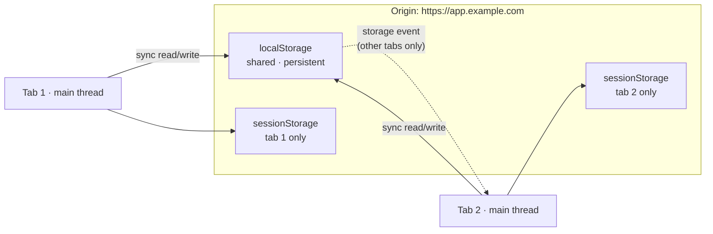

# Web Storage

> `localStorage` and `sessionStorage` give you a synchronous string-to-string map scoped to an origin — the simplest storage the platform offers, and the one most often used past the point where it fits.

**Part:** [00 · Foundations](../) · **Domain:** Browser APIs · **Priority:** Critical · **Difficulty:** Foundational · **Reading time:** ~8 min

## TL;DR

The **Web Storage API** provides two stores, `localStorage` (persists until cleared) and `sessionStorage` (scoped to one tab, cleared when it closes). Both are **synchronous**, **string-only**, **origin-scoped**, and capped at roughly **5 MB** per origin. Synchronous is the operative word: every read and write blocks the main thread, so Web Storage is appropriate for small, infrequently accessed values — a theme preference, a dismissed-banner flag, a draft form field — and inappropriate for lists, caches, binary data, or anything you touch in a loop or a render pass. It is also readable by any JavaScript on the origin, which rules out tokens and anything sensitive. When the data grows or the access frequency rises, the answer is IndexedDB, not a cleverer serializer.

> **Recommendation:** Use `localStorage` for a handful of small scalar preferences behind a typed, error-handling wrapper. Reach for IndexedDB the moment you're storing collections or writing more than occasionally.

## At a Glance

| | |
| --- | --- |
| **Use when** | A few small values must survive reload, and reads are rare — theme, locale, feature flags, "seen this tip". |
| **Avoid when** | Data is large, structured, binary, frequently written, or sensitive; or you need it in a worker. |
| **Alternatives** | [IndexedDB](#alternative-approaches), [Cache Storage](#alternative-approaches), [cookies](#alternative-approaches), in-memory state. |
| **Primary risk** | Synchronous main-thread blocking, and silent `QuotaExceededError` in private-mode or full-quota conditions. |
| **Maturity** | Stable — specified in HTML, universally supported, unlikely to change. |

## Prerequisites

You need the main-thread cost model to see why a "simple" storage read matters at all.

- [Process & Thread Architecture](../web-platform/process-and-thread-architecture.md) (`· The Web Platform`) — why a synchronous API on the main thread is the entire trade-off here.

## Overview

**Web Storage** exposes two `Storage` objects on `window`. `localStorage` persists across tabs, windows, and browser restarts until explicitly cleared by the site, the user, or eviction. `sessionStorage` is scoped to a single top-level browsing context — a tab or window — and is discarded when it closes; duplicating a tab copies its contents, opening a new tab does not share them. Both expose the same tiny interface: `getItem`, `setItem`, `removeItem`, `clear`, `key(n)`, and `length`.

Two constraints define everything else. First, **values are strings**. Assigning an object stores `"[object Object]"`, so real usage means `JSON.stringify` on the way in and `JSON.parse` on the way out — with all the parse-failure and schema-drift consequences that implies. Second, **the API is synchronous**. There is no promise, no callback, no worker access; a read blocks the main thread until the browser has consulted the on-disk store, and a write blocks until it is durable enough for the browser's guarantees. On a warm store that is microseconds. Under memory pressure, on a slow disk, or with a large serialized value, it is milliseconds — and milliseconds on the main thread are frames.

Access is **origin-scoped**: `https://app.example.com` and `https://www.example.com` see different stores, and so do `http://` and `https://` versions of the same host. Third-party contexts are increasingly *partitioned*, meaning an iframe's storage is keyed by the top-level site as well as its own origin.

## The Problem

Web Storage is the first storage API most engineers meet, and its simplicity is a trap. The API cannot fail loudly in the ways you'd want: `getItem` returns `null` for a missing key and for a key you never set, so typos are invisible. Values come back as strings, so `localStorage.getItem('count') + 1` yields `"41"`, not `42`. There is no schema, so a value written by last quarter's code shape is read by this quarter's code and fails somewhere far from the storage call. There is no versioning and no migration story.

The failure modes are worse in production than in development. In Safari's private browsing and in some embedded webviews, `setItem` throws `QuotaExceededError` on the first write. With storage blocked by user settings, merely *accessing* `window.localStorage` can throw a `SecurityError` — before you call a single method. Code that assumes the object exists and the write succeeds crashes on exactly the users whose configuration you didn't test.

And then there is scale. A team stores a cached API response "just for now", the response grows, and now every page load synchronously parses a 3 MB JSON string on the main thread before first paint. The API gave no signal that this was a bad idea; it just got slower.

## Why It Matters

Storage choice is a performance decision disguised as a convenience decision. A synchronous read during hydration or inside a render sits directly in the critical path of first paint, and a synchronous write inside a scroll or input handler sits directly in the interaction path — both are long-task material. The cost is invisible in a profiler until data grows, which is precisely when nobody is looking at that code anymore.

It is also a security decision. `localStorage` is readable by every script running on the origin, including every third-party analytics, tag manager, and dependency in your bundle. A single XSS or a compromised transitive dependency exfiltrates everything in it in one line. This is why access tokens belong in `HttpOnly` cookies, which JavaScript cannot read, rather than in `localStorage` — see [Same-Origin Policy · Security](../../05-reliability-quality/security/same-origin-policy.md) for what the origin boundary does and does not protect.

Finally it is a correctness decision across tabs. `localStorage` is shared by every tab on the origin, and the `storage` event is the only notification you get — it fires in *other* tabs, never the one that wrote. Multi-tab apps that ignore this drift out of sync in ways that are hard to reproduce and easy to blame on the server.

## Mental Model

Think of `localStorage` as a **single shared file on disk holding a string-to-string map**, which every tab on the origin opens with a blocking read or write.



Four consequences fall out of the picture. **Blocking**: the arrows into the store are synchronous, so their cost is main-thread cost, proportional to the serialized size. **Sharing**: `localStorage` has one arrow from each tab, so last write wins and there is no transaction — two tabs incrementing the same counter can lose an update. **Notification**: the dashed line is the `storage` event, which reaches other tabs but never the writer, so a writing tab must update its own state itself. **Isolation**: `sessionStorage` boxes are per-tab and never connected, which is exactly what you want for a wizard's progress and exactly wrong for a user preference.

## Best Practices

**Wrap it once, in one module.** Every access should go through a typed helper that handles the `SecurityError` on access, the `QuotaExceededError` on write, and the `SyntaxError` on parse. Raw `localStorage.getItem` scattered across a codebase is unauditable and untestable.

**Namespace and version your keys.** `app:v1:theme` beats `theme`. The prefix prevents collisions with third-party scripts sharing your origin, and the version gives you a migration seam when the shape changes.

**Validate on read, don't trust what you wrote.** The value in storage was written by an older build, possibly by a different user of the same browser profile, possibly hand-edited. Parse it, validate it against the shape you expect, and fall back to a default when it doesn't match.

**Read once at startup, write on change.** Hydrate into in-memory state during initialization, serve every subsequent read from memory, and write back only when the value actually changes. This turns hundreds of synchronous reads into one.

**Debounce writes in hot paths.** A draft-autosave that writes on every keystroke is a synchronous disk write per keystroke. Debounce to a few hundred milliseconds, and flush on `visibilitychange` so nothing is lost when the tab is backgrounded.

**Never store secrets, tokens, or PII.** If a script on your origin shouldn't read it, `localStorage` is the wrong place, full stop.

## Trade-offs

Web Storage trades capability and performance headroom for an API you can learn in a minute.

**Advantages**

- Trivially simple, universally supported, no setup, no async plumbing.
- Synchronous reads mean no flash of default state during hydration — the value is there before first render.
- `sessionStorage` gives per-tab isolation that no other storage API offers as cleanly.

**Disadvantages**

- Every operation blocks the main thread, and the cost scales with the serialized value.
- Strings only, so structured data needs manual serialization with no schema or migration support.
- ~5 MB cap, no transactions, no indexes, no worker access, and readable by any script on the origin.

| Dimension | Web Storage | Cost / caveat |
| --- | --- | --- |
| API cost | Synchronous, one line | Blocks the main thread on every call |
| Capacity | ~5 MB per origin | Throws `QuotaExceededError`, sometimes on the first write |
| Data model | String → string | Manual JSON, no schema, no migrations |
| Concurrency | Shared across tabs | Last write wins; no transactions |
| Availability | `window` only | No workers, no service worker |
| Security | Origin-scoped | Readable by every script on the origin, including third parties |

## Alternative Approaches

The right store depends on size, access pattern, and who needs to read it.

| Approach | Best when | Weakness | See |
| --- | --- | --- | --- |
| Web Storage | A few small scalars, read rarely, needed synchronously | Blocking, string-only, ~5 MB, script-readable | (this article) |
| [IndexedDB](./) (planned) | Collections, binary data, large or frequently written state | Async, verbose API (use a thin wrapper) | `IndexedDB · Browser APIs` |
| [The Cache Storage API](./) (planned) | Whole HTTP responses for offline or performance | Only models Request/Response pairs | `The Cache Storage API · Browser APIs` |
| [Cookies](./) (planned) | The **server** must see the value; or the value is a session token | Sent on every request; ~4 KB; needs `HttpOnly`/`Secure`/`SameSite` | `Cookies & Partitioned Storage · Browser APIs` |
| In-memory (module state) | The value need not survive reload | Lost on navigation and refresh | `Categories of State · State Management` |

The practical rule: **small and synchronous → Web Storage; anything else → IndexedDB; the server needs it → a cookie.**

## Bad Example

A preferences module that treats storage as an always-available, always-valid object.

```js
// ❌ Assumes localStorage exists, writes succeed, and values round-trip.
export function getPrefs() {
  // Throws SecurityError in blocked-storage configurations, before any call.
  return JSON.parse(localStorage.getItem('prefs')); // JSON.parse(null) → null
}

export function setPref(key, value) {
  const prefs = getPrefs() || {};
  prefs[key] = value;
  // Throws QuotaExceededError in Safari private mode — uncaught, kills the handler.
  localStorage.setItem('prefs', JSON.stringify(prefs));
}

// Called on every keystroke: a synchronous disk write per character.
input.addEventListener('input', (e) => setPref('draft', e.target.value));

// Read inside render: a synchronous read on every single render pass.
function ThemeToggle() {
  const theme = getPrefs()?.theme ?? 'light';
  return <button data-theme={theme}>…</button>;
}
```

**What goes wrong:** Five failures, all silent until production. Accessing `localStorage` can throw before any method is called, so the module crashes on load for users with storage disabled. `JSON.parse(null)` returns `null` rather than throwing, so the "no value yet" case is indistinguishable from a stored `null`, and a *corrupt* value throws `SyntaxError` from a function whose name promises it just reads preferences. The uncaught `QuotaExceededError` kills the input handler and, with it, the rest of the interaction. The per-keystroke write is a synchronous disk write inside the interaction path. And the read inside render turns a one-time hydration into an unbounded number of blocking reads.

## Good Example

The same preferences, behind a wrapper that acknowledges every way storage fails.

```ts
// ✅ storage.ts — one audited seam for all Web Storage access.
const NAMESPACE = 'app:v1:';

/** localStorage can throw on *access*, not just on use. Probe once. */
const store: Storage | null = (() => {
  try {
    const probe = '__probe__';
    window.localStorage.setItem(probe, probe);
    window.localStorage.removeItem(probe);
    return window.localStorage;
  } catch {
    return null; // blocked, private mode, or quota-zero — degrade, don't crash
  }
})();

export function read<T>(key: string, parse: (raw: unknown) => T, fallback: T): T {
  if (!store) return fallback;
  const raw = store.getItem(NAMESPACE + key);
  if (raw === null) return fallback;          // absent is not an error
  try {
    return parse(JSON.parse(raw));            // validate: the value may predate this build
  } catch {
    store.removeItem(NAMESPACE + key);        // corrupt or stale shape — drop it
    return fallback;
  }
}

export function write(key: string, value: unknown): boolean {
  if (!store) return false;
  try {
    store.setItem(NAMESPACE + key, JSON.stringify(value));
    return true;
  } catch (error) {
    // QuotaExceededError (name varies by engine) — the feature must survive this.
    if (error instanceof DOMException) return false;
    throw error;
  }
}
```

```ts
// ✅ prefs.ts — hydrate once into memory; persist on change, debounced.
type Prefs = { theme: 'light' | 'dark'; locale: string };
const DEFAULTS: Prefs = { theme: 'light', locale: 'en-US' };

const parsePrefs = (raw: unknown): Prefs => {
  if (typeof raw !== 'object' || raw === null) throw new Error('not an object');
  const { theme, locale } = raw as Partial<Prefs>;
  return {
    theme: theme === 'dark' ? 'dark' : 'light',
    locale: typeof locale === 'string' ? locale : DEFAULTS.locale,
  };
};

let prefs: Prefs = read('prefs', parsePrefs, DEFAULTS); // ONE synchronous read, at startup
export const getPrefs = (): Prefs => prefs;             // every later read is in-memory

let flushTimer: number | undefined;
export function setPref<K extends keyof Prefs>(key: K, value: Prefs[K]): void {
  if (prefs[key] === value) return;            // no write when nothing changed
  prefs = { ...prefs, [key]: value };
  clearTimeout(flushTimer);
  flushTimer = window.setTimeout(() => write('prefs', prefs), 300);
}

// Don't lose a pending write when the tab is hidden or closed.
document.addEventListener('visibilitychange', () => {
  if (document.visibilityState === 'hidden') {
    clearTimeout(flushTimer);
    write('prefs', prefs);
  }
});

// Keep other tabs in sync — this event never fires in the tab that wrote.
window.addEventListener('storage', (event) => {
  if (event.key !== `${NAMESPACE}prefs`) return;
  prefs = read('prefs', parsePrefs, DEFAULTS);
  document.dispatchEvent(new CustomEvent('prefs:changed', { detail: prefs }));
});
```

**Why it's better:** The probe turns "storage is unavailable" from a crash into a degraded mode where the app still works with defaults. Validation on read means a value written by an older build cannot poison the app — it is dropped and replaced with a default. `write` returns a boolean instead of throwing, so a full quota degrades the preference feature rather than the interaction that triggered it. Hydrating once into memory replaces every per-render blocking read with a plain property access, and debouncing plus a `visibilitychange` flush turns per-keystroke disk writes into at most one write per pause without losing data. The `storage` listener closes the multi-tab gap the API leaves open.

## Common Mistakes

See the [Browser API anti-patterns](../../../anti-patterns/) for the domain catalog. Concept-specific:

### Mistake: Storing authentication tokens in `localStorage`

- **Symptom:** A JWT or session token is read from `localStorage` and attached to requests in an interceptor.
- **Why it fails:** Every script on the origin — including third-party tags and any compromised transitive dependency — can read it. One XSS is total account compromise, and unlike a cookie there is no `HttpOnly` to opt out of script access.
- **Fix:** Keep session credentials in `HttpOnly; Secure; SameSite` cookies so JavaScript cannot read them. If a token must live in the page, keep it in memory only, for the lifetime of the tab.

### Mistake: Using it as a cache for API responses

- **Symptom:** A list endpoint's response is stringified into `localStorage`; page load slows as the dataset grows, and `QuotaExceededError` appears in error reports.
- **Why it fails:** Serializing and parsing a growing payload is synchronous main-thread work on every load, and 5 MB arrives faster than anyone expects. There are no indexes, so any query means parsing everything.
- **Fix:** Use [IndexedDB](./) (planned) for structured collections or [the Cache Storage API](./) (planned) for whole responses; keep server data in a query cache rather than hand-rolled persistence.

### Mistake: Expecting the `storage` event in the writing tab

- **Symptom:** State updates in every tab except the one the user is actually using.
- **Why it fails:** By specification, `storage` fires only in *other* browsing contexts on the origin. The writer is expected to already know what it wrote.
- **Fix:** Update local state directly at the write site and treat the `storage` event purely as the cross-tab channel — or use `BroadcastChannel` when you want a symmetric one.

## Checklist

- [ ] All access goes through one wrapper module, not scattered `localStorage` calls.
- [ ] Access itself is guarded — the code survives storage being blocked or quota-zero.
- [ ] Writes handle `QuotaExceededError` without breaking the surrounding interaction.
- [ ] Reads validate the parsed shape and fall back to a default on mismatch.
- [ ] Keys are namespaced and versioned (`app:v1:…`).
- [ ] Values are hydrated once at startup; renders read from memory, not storage.
- [ ] Hot-path writes are debounced and flushed on `visibilitychange`.
- [ ] No tokens, credentials, or PII are stored.
- [ ] Cross-tab consistency is handled via `storage` or `BroadcastChannel` where it matters.

## Related Articles

- [IndexedDB](./) (planned) — the asynchronous, structured, worker-accessible store to graduate to.
- [The Cache Storage API](./) (planned) — response-level storage for offline and performance.
- [Cookies & Partitioned Storage](./) (planned) — the store the server can see, and the one that holds session tokens.
- [Storage Quotas & Eviction](./) (planned) — how much you get and when the browser takes it back.
- **Canonical home:** what "origin" means for storage isolation is owned by [Same-Origin Policy · Security](../../05-reliability-quality/security/same-origin-policy.md).

## References

- [WHATWG — HTML Standard: Web storage](https://html.spec.whatwg.org/multipage/webstorage.html) — the normative definition, including the `storage` event's other-context rule.
- [MDN — Web Storage API](https://developer.mozilla.org/en-US/docs/Web/API/Web_Storage_API) — practical reference for both stores and their limits.
- [MDN — Window: storage event](https://developer.mozilla.org/en-US/docs/Web/API/Window/storage_event) — the cross-tab notification contract in detail.
