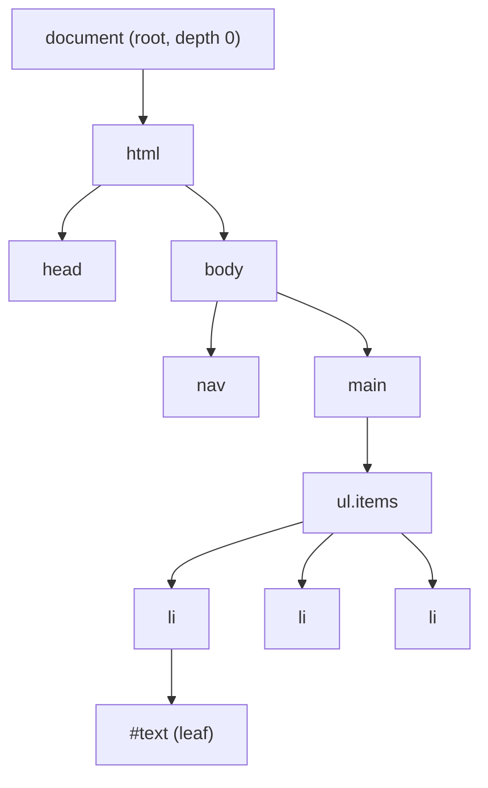

# Trees & the DOM as a Tree

> A *tree* is a hierarchy where every node has exactly one parent, and the DOM is the tree every frontend engineer works in all day — knowing its shape is what makes UI performance and correctness reasonable rather than mysterious.

**Part:** [00 · Foundations](../) · **Domain:** Computer Science for Frontend · **Priority:** Critical · **Difficulty:** Foundational · **Reading time:** ~8 min

## TL;DR

A *tree* is a connected structure of nodes in which every node has exactly one parent except a single root, and no cycles exist. The **DOM is a tree**, and so are the component trees, the accessibility tree, and the render tree that browsers derive from it. That single-parent rule is what makes the expensive operations predictable: an ancestor change costs its whole *subtree*, a lookup by identity is cheap, and a lookup by shape is proportional to the nodes you walk. Most "mystery" UI slowness — a re-render storm, a layout thrash, a selector that scans thousands of nodes — is a tree operation applied at the wrong depth. Reason in terms of *node, parent, subtree, depth* and the cost of a change becomes something you can estimate before you write it.

> **Recommendation:** Before optimizing any UI operation, name the node you are changing and the subtree it invalidates. Push mutations as deep in the tree as correctness allows.

## At a Glance

| | |
| --- | --- |
| **Use when** | Reasoning about any hierarchy: the DOM, component trees, route trees, file trees, comment threads, menus. |
| **Avoid when** | The relationships are many-to-many (a node needs several parents) — that's a graph, not a tree. |
| **Alternatives** | [Graphs](#alternative-approaches) for arbitrary relations; flat maps for identity lookup. |
| **Primary risk** | Treating tree work as O(1) — a change near the root silently costs the whole subtree beneath it. |
| **Maturity** | Stable — the DOM tree model has been normative since DOM Level 1. |

## Prerequisites

None. This is the entry point of the Computer Science for Frontend domain, and every other data structure here builds on it. Reading familiarity with basic JavaScript objects and arrays is enough.

## Overview

A *tree* is a data structure made of **nodes** connected by **edges**, with three defining rules: there is exactly one **root** with no parent, every other node has exactly one parent, and there are no cycles. Nodes with no children are **leaves**; the nodes above a node are its **ancestors**, the nodes below are its **descendants**, and a node plus all its descendants is a **subtree**. The number of edges from the root to a node is its **depth**; the longest such path in the whole tree is its **height**.

The Document Object Model is precisely this structure. `document` is the root, elements nest to form parents and children, and text nodes are leaves. Every DOM API is a tree operation wearing an ergonomic name: `parentNode` walks up one edge, `children` walks down one level, `querySelectorAll` searches a subtree, `appendChild` re-parents a node, and `remove()` deletes an entire subtree in one call. The boundary worth drawing: the DOM is a *tree*, but the relationships you layer on top of it — `aria-labelledby` pointing across the document, event delegation, CSS sibling selectors — are *graph* edges that the tree does not model. When you need those, you have left tree territory, and [Graphs & Dependency Modeling](./) (planned) is the right tool.

## The Problem

Engineers work with the DOM constantly but rarely name it as a tree, and the cost model stays invisible as a result. Someone writes a loop that reads `element.offsetHeight` and then sets `element.style.width` on each iteration, and the page stutters. Someone attaches a click handler to every row of a 5,000-row table and memory climbs. Someone calls `document.querySelectorAll('.item')` inside a scroll handler and the frame budget evaporates. None of these look wrong locally. Each is a tree operation whose cost is proportional to something the author never counted.

The same blindness shows up above the DOM. A React state update placed at the top of the tree re-renders everything beneath it; the same state placed two levels lower re-renders almost nothing. A context provider wrapped around the app root turns every consumer update into a full-subtree pass. The code reads identically in both places — the difference is entirely *where in the tree* it sits, which is information the code does not make visible. Without a tree vocabulary, the team debugs symptoms ("this page is slow") instead of causes ("this mutation invalidates a 4,000-node subtree").

## Why It Matters

Cost in UI work scales with subtree size, not with lines of code. Style recalculation, layout, paint, React reconciliation, and accessibility-tree updates all propagate downward from the node that changed. Knowing that a change at depth 2 in a 3,000-node document is a different animal from the same change at depth 12 is the difference between an optimization that works and one that shuffles code around. This is also the reason "move state down" and "lift state up" are meaningful architectural moves rather than style preferences — they change which subtree pays.

Correctness depends on the same model. Focus management, event bubbling, `contains()` checks for click-outside behavior, ARIA relationships, and CSS inheritance are all defined in terms of ancestor and descendant relationships. Getting them right means reasoning about paths through the tree, not about individual elements. And because the tree is also what assistive technology consumes, a structurally wrong tree is an accessibility defect regardless of how the page looks — a point [The Document Outline · HTML & Document Semantics](../../01-core-languages/html-semantics/the-document-outline.md) develops in detail.

## Mental Model

Hold three questions for any tree operation: *which node am I touching*, *what is above it*, and *what is below it*. Work that reads goes **up** (cheap: bounded by depth). Work that invalidates goes **down** (expensive: bounded by subtree size). Work that searches goes **across** (proportional to the nodes visited).



Three costs follow directly from the picture. Walking **up** from `#text` to the root costs the depth — small and bounded, which is why `closest()` and event bubbling are cheap. Invalidating **down** from `body` touches everything, which is why a class toggle on `<body>` can trigger a full-document style recalculation while the same toggle on `li` touches one node. Searching **across** with `querySelectorAll` visits the whole subtree you scope it to, which is why scoping matters: `list.querySelectorAll('li')` is bounded by the list, `document.querySelectorAll('li')` is bounded by the document.

Traversal comes in two flavors worth naming. **Depth-first** goes as deep as possible before backtracking — this is document order, what `TreeWalker` and `textContent` produce, and it's naturally expressed with a stack (or recursion, which is a stack). **Breadth-first** visits level by level using a queue, and is what you want when "nearest matching descendant" beats "first in document order". Both visit every node once: O(n) in the subtree size.

## Best Practices

**Scope every search to the smallest subtree that can contain the answer.** Hold a reference to a container and query from it. This turns an O(document) scan into an O(subtree) one and survives the page growing around you.

**Push mutations down.** Whether it is a DOM class, a CSS custom property, or a piece of component state, applying it at the deepest node that still produces the correct result minimizes what gets invalidated. "Where does this state live?" is a tree question first and an architecture question second.

**Batch reads before writes.** Interleaving a read of layout (`offsetWidth`, `getBoundingClientRect`) with a write forces the browser to recompute layout for the affected subtree on every iteration. Read everything, then write everything.

**Use identity lookups when you have them.** `getElementById` and a `Map` from id to node are O(1); a selector scan is O(n). If you find yourself re-querying the same nodes in a loop, build the map once — see [Hash Maps & Sets](./) (planned).

**Delegate events to an ancestor.** One listener on a container plus `event.target.closest(selector)` replaces n listeners on n children, and keeps working as children are added and removed. This is bubbling — an upward walk — used deliberately.

## Trade-offs

The tree model buys a simple, cheap, universally understood structure. What you pay for is expressiveness: exactly one parent, and no relation the hierarchy doesn't already encode.

**Advantages**

- Every node has one path to the root, so ancestor queries and inheritance are unambiguous and cheap.
- Structural operations are local: removing a node removes its subtree, with no dangling references to repair.
- The single-parent rule prevents cycles by construction, so naive traversal always terminates.

**Disadvantages**

- Any many-to-many relationship (cross-references, dependency links) must be modeled outside the tree.
- Finding a node by a property, rather than by path, requires a scan unless you maintain a separate index.
- Deep trees make ancestor walks longer and can make recursive traversal risk stack depth on pathological input.

| Dimension | Tree | Cost / caveat |
| --- | --- | --- |
| Lookup by identity | O(1) with an id index | Index must be kept in sync with mutations |
| Lookup by shape/selector | O(n) in the searched subtree | Scope the search or the document size becomes your cost |
| Insert / remove | O(1) at a known node | The invalidation it triggers is O(subtree), not O(1) |
| Ancestor query | O(depth) | Cheap in practice; depth is typically under 30 |
| Expressiveness | One parent per node | Cross-cutting relations need a graph alongside |

## Alternative Approaches

A tree is one point on a spectrum. When the single-parent rule stops fitting, or when hierarchy isn't what you're querying, something else wins.

| Approach | Best when | Weakness | See |
| --- | --- | --- | --- |
| Tree | Data is genuinely hierarchical and each item has one owner | Cannot express many-to-many relations | (this article) |
| [Graph](./) (planned) | Nodes relate to several others: dependencies, ARIA references, routing links | Cycles are possible, so traversal needs visited-tracking | `Graphs & Dependency Modeling` |
| [Hash map](./) (planned) | You look items up by id and don't care about hierarchy | Loses ordering and containment entirely | `Hash Maps & Sets` |
| Flat array + parent id | You need both hierarchy and cheap iteration/serialization | Reconstructing the hierarchy is an extra pass | (normalization pattern) |

Most real applications use two at once: a flat map for identity lookup, and the tree for structure — exactly what the DOM does internally with its id cache.

## Bad Example

A "highlight matching rows" feature that ignores every property of the tree it is operating on.

```js
// ❌ Rescans the whole document, and interleaves layout reads with writes.
function highlightMatches(term) {
  // Scans every element in the document, on every keystroke.
  const rows = document.querySelectorAll('.data-row');

  for (const row of rows) {
    const text = row.textContent.toLowerCase();
    const matches = text.includes(term.toLowerCase());

    // Read layout...
    const height = row.offsetHeight;      // forces layout for the affected subtree
    // ...then write, inside the same iteration.
    row.style.background = matches ? '#ffe' : '';
    row.style.minHeight = `${height}px`;  // write invalidates layout again
  }
}

// One listener per row, re-attached whenever rows change.
document.querySelectorAll('.data-row').forEach((row) => {
  row.addEventListener('click', () => selectRow(row.dataset.id));
});
```

**What goes wrong:** Three separate tree mistakes compound. The unscoped `querySelectorAll` walks the entire document subtree on every keystroke instead of the table's subtree. The read/write interleaving forces *layout thrashing* — each `offsetHeight` must flush the pending style writes from the previous iteration, so an O(n) loop performs n layout passes. And per-row listeners mean the handler count grows with the data, leaking whenever rows are removed without cleanup, because each listener holds a reference to a node that would otherwise be collectable with its subtree.

## Good Example

The same feature, written with the tree's cost model in mind.

```js
// ✅ Scoped subtree, batched read/write phases, one delegated listener.
const table = document.getElementById('data-table'); // O(1) identity lookup
if (!table) throw new Error('highlightMatches: #data-table not found');

// Cache the row list; refresh only when the data actually changes.
let rows = Array.from(table.querySelectorAll('.data-row')); // scoped to the subtree

export function refreshRows() {
  rows = Array.from(table.querySelectorAll('.data-row'));
}

export function highlightMatches(term) {
  const needle = term.trim().toLowerCase();

  // Phase 1 — read only. No writes, so no forced layout.
  const decisions = rows.map((row) => ({
    row,
    matches: needle !== '' && row.textContent.toLowerCase().includes(needle),
  }));

  // Phase 2 — write only. Class toggles keep styling in CSS and touch one node each.
  for (const { row, matches } of decisions) {
    row.classList.toggle('is-match', matches);
  }
}

// One listener on the ancestor; `closest` walks up O(depth), not across O(n).
table.addEventListener('click', (event) => {
  const row = event.target.closest('.data-row');
  if (!row || !table.contains(row)) return; // guard: clicks outside the table subtree
  selectRow(row.dataset.id);
});
```

**Why it's better:** Every change maps to a property of the tree. `getElementById` replaces a scan with an O(1) identity lookup. Scoping `querySelectorAll` to `table` bounds the search by the table's subtree rather than the document's. Splitting read and write phases means layout is computed once instead of n times. Toggling a class instead of writing inline styles keeps the invalidation to a single node and leaves the cascade to CSS. And the delegated listener replaces n downward attachments with one upward walk per click — `closest()` costs the depth, which is a handful of edges, and the `contains()` guard makes the subtree boundary explicit.

## Common Mistakes

See the [Computer Science anti-patterns](../../../anti-patterns/) for the domain catalog. Concept-specific:

### Mistake: Treating a DOM mutation as a constant-time operation

- **Symptom:** A single `classList.add` on a wrapper element, or one state update in a top-level provider, causes a visible frame drop.
- **Why it fails:** The write is O(1), but the invalidation it schedules is O(subtree) — style recalculation, layout, and paint all cascade downward from the changed node. Near the root, that is the whole page.
- **Fix:** Move the mutation to the deepest node that still produces the correct result, and prefer class toggles over inline style writes so the cascade does the propagation.

### Mistake: Searching the document when you mean a subtree

- **Symptom:** `document.querySelectorAll(...)` inside a scroll, resize, or input handler; performance degrades as unrelated parts of the page grow.
- **Why it fails:** The search visits every descendant of the scope you gave it. Passing `document` makes your cost a function of the entire page, including markup your feature has nothing to do with.
- **Fix:** Hold a reference to the container and query from it, or keep an id-keyed map of the nodes you touch repeatedly.

### Mistake: Recursing without a depth or cycle guard on untrusted structure

- **Symptom:** A tree walker over user-supplied or server-supplied data throws `RangeError: Maximum call stack size exceeded`, or hangs.
- **Why it fails:** Recursion uses the call stack as its stack. Real DOM trees are shallow, but data that *claims* to be a tree — a comment thread, a category hierarchy from an API — can be deeper than the stack allows, or can contain a cycle that the tree contract forbids but the payload does not enforce.
- **Fix:** Convert to an explicit stack-based iterative walk (see [Stacks & Queues](./), planned) and track visited ids when the input is not trusted to be acyclic.

## Checklist

- [ ] Every selector query is scoped to the smallest container that can contain the result.
- [ ] Layout reads and style writes are in separate phases, never interleaved in a loop.
- [ ] Mutations are applied at the deepest node that produces the correct outcome.
- [ ] Repeated lookups by id use a map or `getElementById`, not a selector scan.
- [ ] Handlers for lists are delegated to an ancestor rather than attached per item.
- [ ] Any traversal over non-DOM "tree" data is iterative, or has a depth bound.
- [ ] Relationships that need more than one parent are modeled as a graph, not forced into the hierarchy.

## Related Articles

- [Graphs & Dependency Modeling](./) (planned) — what to reach for when one parent per node stops being enough.
- [Hash Maps & Sets](./) (planned) — the O(1) index you pair with a tree for identity lookups.
- [Stacks & Queues](./) (planned) — the structures behind depth-first and breadth-first traversal.
- [Linked & Persistent Lists](./) (planned) — how structural sharing lets you "change" a tree without copying it.
- Tree Diffing Algorithms (planned) — how frameworks compare two trees cheaply, and the assumptions that make it possible.
- **Canonical home:** the browser-side consequences of tree depth are owned by [Process & Thread Architecture · The Web Platform](../web-platform/process-and-thread-architecture.md).

## References

- [WHATWG — DOM Standard](https://dom.spec.whatwg.org/) — the normative definition of nodes, trees, and document order.
- [MDN — Introduction to the DOM](https://developer.mozilla.org/en-US/docs/Web/API/Document_Object_Model/Introduction) — the practical orientation to the DOM as a node tree.
- [MDN — TreeWalker](https://developer.mozilla.org/en-US/docs/Web/API/TreeWalker) — the platform's built-in depth-first traversal API, with filtering.
