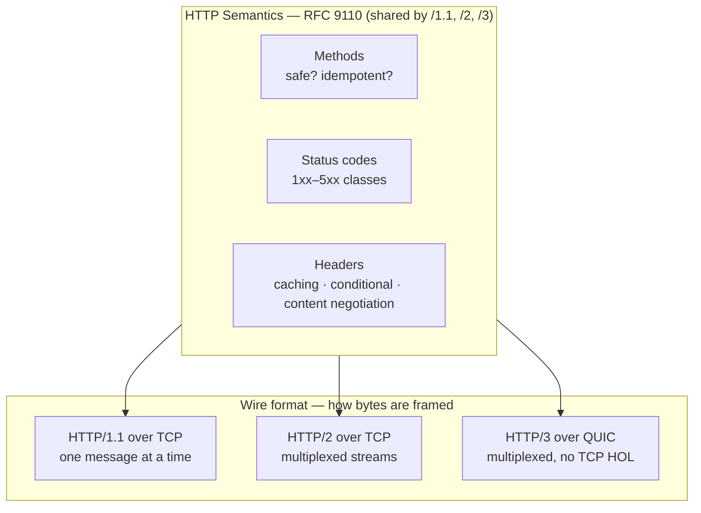

# HTTP/1.1 Semantics

> HTTP/1.1 is two things that are usually conflated: a set of *semantics* — what a method means, what a status code promises — and a *wire format* that HTTP/2 and HTTP/3 replaced. The semantics are what you actually program against.

**Part:** [00 · Foundations](../) · **Domain:** Networking & Protocols · **Priority:** Critical · **Difficulty:** Foundational · **Reading time:** ~8 min

## TL;DR

**HTTP semantics** — defined today in RFC 9110 and shared unchanged by HTTP/1.1, HTTP/2, and HTTP/3 — specify what a request *means*: which methods are **safe** (no intended side effect: `GET`, `HEAD`, `OPTIONS`), which are **idempotent** (repeating is equivalent to doing it once: safe methods plus `PUT` and `DELETE`), and what each status class promises. Those two properties drive real client behavior: caches store safe responses, browsers and proxies retry idempotent requests, and `POST` gets neither. The HTTP/1.1 *wire format* adds one message per connection at a time, which produces **head-of-line blocking** and the six-connections-per-origin limit — the constraint that motivated HTTP/2. Learn the semantics once; they survive every transport change.

> **Recommendation:** Choose methods by their semantics, not by convenience. If a request can be safely repeated, say so with an idempotent method — retries, caches, and CDNs are built on that promise.

## At a Glance

| | |
| --- | --- |
| **Use when** | Designing any HTTP API surface, debugging cache behavior, or deciding what a client may retry. |
| **Avoid when** | You need server-push, bidirectional streams, or sub-second live updates — that's WebSocket, SSE, or WebTransport. |
| **Alternatives** | [HTTP/2](#alternative-approaches) and [HTTP/3](#alternative-approaches) as transports; [WebSocket/SSE](#alternative-approaches) for push. |
| **Primary risk** | Mislabeling a non-idempotent operation as `GET` or `PUT`, so a retry or a prefetch silently duplicates it. |
| **Maturity** | Stable — semantics re-specified in RFC 9110 (2022) with no behavioral change. |

## Prerequisites

You need to know where network work happens relative to the page, since HTTP requests are issued from the renderer but executed by a privileged process.

- [Process & Thread Architecture](../web-platform/process-and-thread-architecture.md) (`· The Web Platform`) — why network I/O doesn't block the main thread but response *handling* does.

## Overview

An HTTP exchange is a **request** and a **response**. A request carries a *method*, a *target* (path plus query), *headers*, and optionally a *body*. A response carries a *status code*, headers, and optionally a body. That much is unchanged from 1996. What RFC 9110 clarified is the split: this meaning layer is "HTTP semantics", while RFC 9112 covers the specific way HTTP/1.1 encodes it as text on a TCP connection.

Two method properties carry almost all the practical weight. A method is **safe** if it is not intended to change server state — `GET`, `HEAD`, `OPTIONS`, `TRACE`. Safe methods can be prefetched by browsers, crawled by bots, and cached by intermediaries you don't control. A method is **idempotent** if issuing it *n* times has the same effect as issuing it once — all safe methods, plus `PUT` (set to this value) and `DELETE` (ensure absent). `POST` and `PATCH` are neither, which is why no layer will retry them for you.

Status codes group into five classes: `1xx` informational, `2xx` success, `3xx` redirection, `4xx` client error, `5xx` server error. The class is the contract a generic client reasons about — a `5xx` or `429` is retryable, a `4xx` other than `408`/`429` is not, because repeating a request the client got wrong will keep being wrong.

HTTP/1.1's own contributions to the wire format were **persistent connections** (`Connection: keep-alive` by default, so a TCP handshake is amortized across requests), the mandatory `Host` header (which made virtual hosting possible), **chunked transfer encoding** (bodies of unknown length), and conditional requests (`If-None-Match`, `If-Modified-Since`) that power revalidation.

## The Problem

Two problems, one semantic and one structural.

The semantic problem is that HTTP's rules are advisory to *your* server and binding on *everyone else's* infrastructure. If you implement `GET /orders/42/cancel` as an action, nothing rejects it — but a browser may prefetch the link, a corporate proxy may cache the response, and a link-scanning bot in an email client will cheerfully cancel the order on the user's behalf. Similarly, if `POST /transfers` is retried by an over-eager client after a timeout, the money moves twice, because `POST` never promised otherwise and the client had no way to know it was unsafe.

The structural problem is HTTP/1.1's one-message-at-a-time connection. A response must be sent completely before the next one starts, so a slow response blocks everything queued behind it on that connection — **head-of-line blocking**. Browsers work around it by opening around six connections per origin, which is why a page with 60 subresources on one host serializes into ten rounds, and why the era of domain sharding, sprite sheets, and bundle-everything existed. Those workarounds are actively harmful on HTTP/2, where multiplexing removes the limit — so the wire format you're actually served over changes what "fast" means.

## Why It Matters

Every caching layer between your code and your user acts on semantics. A `GET` with the right `Cache-Control` can be served from the browser cache, a service worker, or a CDN edge without touching your origin; the same data behind a `POST` cannot be cached by any of them. Getting method choice right is often a larger performance lever than any client-side optimization, because it decides whether the request happens at all.

Retry behavior depends on it too. Browsers retry idempotent requests on connection failure. Service meshes, CDNs, and HTTP client libraries have retry policies keyed on method and status. If your `POST /payments` is retried because someone configured "retry on 5xx" globally, you get double charges — which is why idempotency keys exist as an application-level fix for a semantic gap.

And knowing the transport shapes architecture. Under HTTP/1.1, bundling many small files into few large ones was a genuine win. Under HTTP/2 and HTTP/3, requests are multiplexed over one connection, so fine-grained files cache better and the old advice inverts. Teams still shipping HTTP/1.1-era build configurations pay for a constraint their CDN removed years ago — a point [Code Splitting · Performance](../../05-reliability-quality/performance/code-splitting.md) develops further.

## Mental Model

Separate the two layers and keep them separate.



The semantics box is what your API design lives in. The wire box is what your performance work lives in, and it changes underneath you without any code change.

Within the semantics box, hold this table:

| Method | Safe | Idempotent | Cacheable | Means |
| --- | --- | --- | --- | --- |
| `GET` | ✅ | ✅ | ✅ | Retrieve the resource |
| `HEAD` | ✅ | ✅ | ✅ | Retrieve headers only |
| `PUT` | ❌ | ✅ | ❌ | Set the resource to this state |
| `DELETE` | ❌ | ✅ | ❌ | Ensure the resource is absent |
| `POST` | ❌ | ❌ | Rarely | Process this data — meaning is server-defined |
| `PATCH` | ❌ | ❌ | ❌ | Apply this partial modification |

`PUT` is idempotent because it sends the *whole desired state*: sending it twice lands on the same value. `PATCH` is not, because a patch like "increment by 1" applied twice increments by 2. That distinction is the one most often gotten wrong.

## Best Practices

**Match the method to the promise you can keep.** A read is a `GET`. A full replacement is a `PUT`. A removal is a `DELETE`. Anything whose repetition matters — creating an order, charging a card, sending a message — is a `POST`, and should carry an idempotency key if the client may retry it.

**Never put actions behind `GET`.** Prefetchers, crawlers, and caches treat `GET` as free. If clicking a link changes state, someone's link scanner will change it for them.

**Return the status code that describes the situation, not the one that's convenient.** `404` for absent, `409` for a conflicting state, `422` for a well-formed request that fails validation, `429` with `Retry-After` for rate limits, `503` with `Retry-After` for planned unavailability. Generic clients act on these; a `200` with `{"error": …}` inside defeats every layer above you.

**Use conditional requests.** Serve `ETag` (or `Last-Modified`) and honor `If-None-Match`, so revalidation costs a `304` with no body instead of a full transfer.

**Keep URLs cache-keyable.** Everything that changes the response should be in the URL or in a header named by `Vary`. A `GET` whose response depends on an unnamed header will be served wrong from some cache, eventually.

**Stop bundling for HTTP/1.1 unless you're actually on it.** Check what your CDN negotiates. On HTTP/2+, prefer more, smaller, well-cached files over one large bundle.

## Trade-offs

HTTP/1.1's design bought universal interoperability and debuggability at the cost of connection efficiency.

**Advantages**

- Human-readable, text-framed messages you can read in a terminal — unmatched for debugging.
- Semantics are simple enough that every proxy, CDN, and client agrees on them, which is what makes intermediary caching possible at all.
- Stateless request/response composes cleanly with load balancers and horizontal scaling.

**Disadvantages**

- One in-flight message per connection means head-of-line blocking and a hard six-connection-per-origin ceiling.
- Headers are re-sent in full on every request, uncompressed — a real cost with large cookies.
- No server push and no multiplexing, so latency-bound pages pay round trips the transport can't hide.

| Dimension | HTTP/1.1 | Cost / caveat |
| --- | --- | --- |
| Concurrency | ~6 connections per origin | Head-of-line blocking within each |
| Header overhead | Plain text, repeated per request | Large cookies multiply across every subresource |
| Debuggability | Excellent — readable on the wire | Encouraged text-parsing bugs (request smuggling) |
| Caching | Rich, well-understood, intermediary-friendly | Only for safe, cacheable methods |
| Push | None | Requires SSE, WebSocket, or HTTP/2+ |

## Alternative Approaches

The semantics are not optional on the web. What you choose is the transport, and whether request/response is the right shape at all.

| Approach | Best when | Weakness | See |
| --- | --- | --- | --- |
| HTTP/1.1 | Legacy clients, simple internal services, debugging | Head-of-line blocking, connection limits | (this article) |
| [HTTP/2](./) (planned) | Many subresources over one connection | TCP-level head-of-line blocking remains on packet loss | `HTTP/2 Multiplexing · Networking & Protocols` |
| [HTTP/3 & QUIC](./) (planned) | Lossy or mobile networks; fastest connection setup | UDP blocked on some networks; newer tooling | `HTTP/3 & QUIC · Networking & Protocols` |
| Server-Sent Events | One-way server→client streaming over plain HTTP | Text only, one direction, connection-per-stream on HTTP/1.1 | `Streaming · Networking & Protocols` (planned) |
| WebSocket | Genuine bidirectional, low-latency messaging | Leaves HTTP semantics behind: no caching, no status codes | `WebSocket · Networking & Protocols` (planned) |

## Bad Example

An API surface that ignores every semantic promise it implicitly makes.

```http
### ❌ A state change behind a safe method.
GET /api/orders/42/cancel HTTP/1.1
Host: api.example.com

HTTP/1.1 200 OK
Content-Type: application/json
Cache-Control: no-cache

{"ok": false, "error": "ORDER_ALREADY_SHIPPED"}
```

```js
// ❌ Client that retries a non-idempotent request and ignores status semantics.
async function createPayment(body) {
  for (let attempt = 0; attempt < 3; attempt++) {
    const res = await fetch('/api/payments', {
      method: 'POST',
      headers: { 'Content-Type': 'application/json' },
      body: JSON.stringify(body),
    });
    // Retries on ANY non-2xx, including 422 and 409 — and including a POST
    // whose timeout may mean "already succeeded, response lost".
    if (res.ok) return res.json();
  }
  throw new Error('payment failed');
}
```

**What goes wrong:** The cancel endpoint is a `GET`, so a browser prefetch, an email-client link scanner, or a shared proxy cache can trigger or replay it — and a `200` on failure means every intermediary records success while the operation failed. On the client, retrying a `POST` is exactly the case HTTP refuses to promise: if the first attempt succeeded but the response was lost to a timeout, retry creates a second payment. Retrying a `422` or `409` is pure waste, because the request itself is what was wrong. And `res.ok` collapses `404`, `422`, and `503` into one indistinguishable failure.

## Good Example

The same operations with semantics honored on both sides.

```http
### ✅ State change behind a non-safe method, with an idempotency key.
POST /api/orders/42/cancellation HTTP/1.1
Host: api.example.com
Content-Type: application/json
Idempotency-Key: 8f1a5b2c-7d3e-4a91-b0c6-2e5f9d4a1c33

{"reason": "customer_request"}

HTTP/1.1 409 Conflict
Content-Type: application/problem+json
Cache-Control: no-store

{"type": "https://example.com/probs/already-shipped",
 "title": "Order already shipped", "status": 409}
```

```ts
// ✅ Retry only what HTTP says is retryable; make POST safe with a key.
const RETRYABLE_STATUS = new Set([408, 429, 500, 502, 503, 504]);

export async function createPayment(body: PaymentInput, signal?: AbortSignal) {
  // One key for the whole logical operation — the server dedupes replays.
  const idempotencyKey = crypto.randomUUID();

  for (let attempt = 0; ; attempt++) {
    const res = await fetch('/api/payments', {
      method: 'POST',
      headers: {
        'Content-Type': 'application/json',
        'Idempotency-Key': idempotencyKey,
      },
      body: JSON.stringify(body),
      signal,
    });

    if (res.ok) return res.json();

    // 4xx other than 408/429 means the request itself is wrong: retrying can't help.
    if (!RETRYABLE_STATUS.has(res.status) || attempt >= 2) {
      throw new HttpError(res.status, await res.text());
    }

    // Honor the server's own backoff instruction before inventing one.
    const retryAfter = Number(res.headers.get('Retry-After'));
    const delay = Number.isFinite(retryAfter) && retryAfter > 0
      ? retryAfter * 1000
      : 2 ** attempt * 250 + Math.random() * 250; // exponential + jitter
    await new Promise((r) => setTimeout(r, delay));
  }
}
```

```ts
// ✅ Reads are GETs, and revalidate cheaply with a conditional request.
export async function fetchOrder(id: string, etag?: string) {
  const res = await fetch(`/api/orders/${id}`, {
    headers: etag ? { 'If-None-Match': etag } : {},
  });
  if (res.status === 304) return { changed: false as const };   // no body transferred
  if (!res.ok) throw new HttpError(res.status, await res.text());
  return { changed: true as const, etag: res.headers.get('ETag'), data: await res.json() };
}
```

**Why it's better:** The cancellation is a `POST` to a resource, so no prefetcher or cache can trigger it, and the failure is a `409` that every intermediary and client correctly reads as "do not cache, do not retry". The idempotency key restores the safety `POST` cannot promise, so a retry after a lost response is deduped server-side rather than duplicating a payment. The client retries only the statuses HTTP marks as transient, respects `Retry-After` when the server sends it, and adds jitter so a fleet of clients doesn't synchronize its retries. And the read path uses `If-None-Match`, turning an unchanged resource into a `304` with no body — the cheapest possible confirmation.

## Common Mistakes

See the [Networking anti-patterns](../../../anti-patterns/) for the domain catalog. Concept-specific:

### Mistake: Tunneling everything through `POST`

- **Symptom:** Read endpoints are `POST /api/query` with a JSON body describing what to fetch.
- **Why it fails:** `POST` responses are not cacheable by browsers, service workers, or CDNs, so every read hits the origin. It also breaks link sharing, prefetching, and the browser's own back/forward cache behavior.
- **Fix:** Use `GET` with query parameters for reads. If parameters genuinely exceed URL limits, keep `POST` but treat losing all caching as a deliberate, documented cost.

### Mistake: `200 OK` with an error in the body

- **Symptom:** Every response is `200`; failure is signaled by `{"success": false}`.
- **Why it fails:** Status codes are the interface every intermediary understands. A `200` is cacheable and non-retryable by default, so caches store failures and retry logic never fires. Monitoring based on status codes reports 100% success during an outage.
- **Fix:** Return the accurate status class and put detail in the body — `application/problem+json` (RFC 9457) is a good default shape.

### Mistake: Optimizing for HTTP/1.1 on an HTTP/2 connection

- **Symptom:** Domain sharding, image sprites, and a single giant bundle, on a site served by a modern CDN.
- **Why it fails:** Sharding forces extra connections and extra TLS handshakes where multiplexing needed none, and one giant bundle means any change invalidates the whole cache entry.
- **Fix:** Confirm the negotiated protocol (DevTools' Protocol column), then split by change frequency and let multiplexing handle the request count.

## Checklist

- [ ] No state change is reachable by `GET`, `HEAD`, or `OPTIONS`.
- [ ] Methods that claim idempotency actually are — `PUT` sends full state, `PATCH` is not treated as idempotent.
- [ ] Non-idempotent operations that clients may retry accept an idempotency key.
- [ ] Status codes are accurate; failures are never `200`.
- [ ] Client retries are limited to `408`, `429`, and `5xx`, with backoff and jitter, honoring `Retry-After`.
- [ ] Cacheable reads send `ETag`/`Last-Modified` and handle `304`.
- [ ] Anything that varies the response is in the URL or named in `Vary`.
- [ ] Bundling strategy matches the protocol actually negotiated in production.

## Related Articles

- [HTTP/2 Multiplexing](./) (planned) — how multiplexing removes the connection limit and inverts bundling advice.
- [HTTP/3 & QUIC](./) (planned) — moving off TCP to remove transport-level head-of-line blocking.
- [Methods, Status Codes & Headers](./) (planned) — the full reference for the semantics summarized here.
- The HTTP Cache (planned) and Cache-Control & Validators (ETag) (planned) — the caching model these semantics enable.
- **Canonical home:** what an "origin" is, and why it gates cross-origin requests, is owned by [Same-Origin Policy · Security](../../05-reliability-quality/security/same-origin-policy.md).

## References

- [RFC 9110 — HTTP Semantics](https://www.rfc-editor.org/rfc/rfc9110) — the current normative definition of methods, status codes, and safety/idempotency.
- [RFC 9112 — HTTP/1.1](https://www.rfc-editor.org/rfc/rfc9112) — the HTTP/1.1 message syntax and connection management, separated from semantics.
- [MDN — HTTP](https://developer.mozilla.org/en-US/docs/Web/HTTP) — practical reference with per-method and per-status detail.
