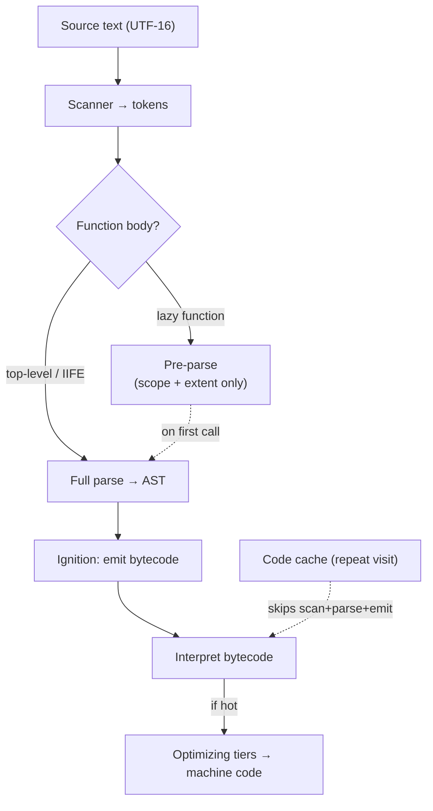

# Parsing & Bytecode

> Every byte of JavaScript you ship must be scanned, parsed, and compiled to bytecode on the main thread before it can do anything — which is why "smaller bundle" is a correctness argument about startup, not just a download argument.

**Part:** [00 · Foundations](../) · **Domain:** Runtime & Execution · **Priority:** Critical · **Difficulty:** Intermediate · **Reading time:** ~12 min

## TL;DR

A JavaScript engine turns source text into an executable program in stages: **scan** (characters → tokens), **parse** (tokens → AST), and **compile** (AST → **bytecode**) for an interpreter to execute. V8 calls its interpreter *Ignition*; hot code is later re-compiled to machine code by the optimizing tiers. The costs that matter to frontend engineers are the first ones: parsing and bytecode generation happen **on the main thread** (partly off-thread for streaming, but evaluation never is), scale with the *amount of code*, and are paid before your app renders anything. Engines mitigate this with **lazy parsing** — function bodies are pre-parsed cheaply and fully parsed only when first called — and with **code caching**, which lets a repeat visit skip compilation entirely. Your levers are: ship less code, defer what isn't needed for first render, and don't defeat the engine's caching.

> **Recommendation:** Treat "JavaScript bytes shipped" as a startup budget, not a bandwidth budget. Download is amortized by the network; parse and compile are paid by the main thread every cold start.

## At a Glance

| | |
| --- | --- |
| **Use when** | Diagnosing slow startup, high Total Blocking Time, or a large gap between download complete and interactive. |
| **Avoid when** | The bottleneck is rendering, layout, or network latency — parse cost is a *code-volume* problem, not a general slowness explanation. |
| **Alternatives** | [Code splitting](#alternative-approaches), [server rendering](#alternative-approaches), and WebAssembly as ways to move or reduce the work. |
| **Primary risk** | Optimizing compressed transfer size while shipping the same uncompressed bytes the engine must still parse. |
| **Maturity** | Stable — the pipeline shape has been consistent across V8, SpiderMonkey, and JavaScriptCore for a decade. |

## Prerequisites

You need to know which thread pays for this, because that is the whole reason it matters.

- [Process & Thread Architecture](../web-platform/process-and-thread-architecture.md) (`· The Web Platform`) — script evaluation is main-thread work, competing with rendering and input.

## Overview

**Parsing** is the transformation from source text to a structured representation the engine can compile; **bytecode** is the compact, engine-specific instruction format that representation is compiled into. The pipeline in V8 runs: *scanner* produces tokens from UTF-16 characters; *parser* produces an abstract syntax tree; *Ignition* walks the AST and emits bytecode; the Ignition interpreter executes that bytecode. Only when a function proves hot do the optimizing compilers (Sparkplug, Maglev, TurboFan in current V8) produce machine code, which is the subject of [JIT Compilation & Deoptimization](./) (planned), not this article.

The engineering-relevant subtlety is **lazy parsing** (also called pre-parsing). Fully parsing every function in a large bundle would be wasteful, because most functions are never called on a given page. So the engine does a cheap *pre-parse* pass over function bodies: enough to find syntax errors, record the function's extent, and note which outer-scope variables it references — but no AST and no bytecode. When the function is first called, it is **fully parsed** then. The consequence is that parse cost is not one lump at load; it is a smaller lump at load plus a scatter of small costs at first call, some of which land inside your first interaction.

The second mechanism is **code caching**. Browsers cache compiled bytecode keyed by the script's URL and content, so a repeat visit can skip scanning, parsing, and bytecode generation. Cold visits, cache-busted filenames, and inline scripts get no benefit; that asymmetry is why synthetic "reload" measurements often look much better than real first-visit data.

## The Problem

Bundle-size discussions almost always happen in compressed kilobytes, because that is what the network transfers and what CI reports. But the engine does not parse gzip. A 300 KB gzipped bundle is roughly 1.2 MB of source text that must be scanned and parsed. On a fast desktop machine that is a few tens of milliseconds and invisible; on a mid-tier Android phone it is several hundred milliseconds of pure main-thread blocking, before a single component mounts. Two teams with the same "bundle size" number can have wildly different startup profiles depending on device mix.

The costs also hide in unexpected places. A large JSON payload embedded as a JavaScript object literal is parsed by the *JavaScript* parser, which is far slower than `JSON.parse` on the equivalent string — the JSON grammar is tiny and its parser is specialized. Immediately-invoked function expressions defeat lazy parsing by signaling "this runs now", which is a win when true and a tax when a bundler wraps every module in one. Top-level side effects in modules run at import time, so tree-shaking cannot drop them and a "we don't use that feature" module still pays parse *and* execution.

And the fix people reach for first — `defer` or `async` on the script tag — changes *when* the work happens, not how much. The parse still lands on the main thread; it just lands after the parser-blocking phase, where it can now collide with user input instead of with HTML parsing.

## Why It Matters

Startup metrics are dominated by this work on real devices. Total Blocking Time and Interaction to Next Paint both measure main-thread availability, and script evaluation is typically the largest single contributor on a JavaScript-heavy page. A user who taps during your bundle's evaluation waits for it to finish, because the main thread runs tasks to completion.

There is also a compounding effect with hydration. Server-rendered markup paints early, which looks fast, but the page is not interactive until the framework bundle has been parsed, compiled, and executed, and hydration has walked the tree. The gap between "looks ready" and "responds to taps" is largely parse-and-evaluate time, and it is the single most common cause of the "I tapped and nothing happened" complaint that metrics on fast hardware never reproduce.

Finally it shapes architecture decisions that are otherwise hard to justify. Route-level code splitting, deferring analytics and chat widgets, and avoiding barrel files that pull in whole libraries are all defended most concretely in terms of parse cost — the argument that "we download 200 KB we never call" is weak when the network is fast, but "we parse 800 KB of source we never call, on the main thread, before first input" is not.

## Mental Model

Picture a funnel with two exits: work you pay at load, and work you pay at first call.



Three practical readings of the diagram.

**Load-time cost is proportional to total source bytes**, because the scanner touches every character regardless of laziness. Pre-parsing is cheaper than full parsing — roughly half the cost in V8's own measurements — but it is not free, so unused code is never free.

**First-call cost is where lazy parsing lands.** A function that is pre-parsed at load is fully parsed and compiled the first time it runs. If that first run is inside a click handler, the parse is inside your interaction latency. This is why "the first click is always slow" is a real phenomenon and not superstition.

**The code cache is the only path that skips the whole left side.** It is keyed on the script resource, so stable URLs and long-lived caching make repeat visits dramatically cheaper — and inline scripts, `eval`, and `new Function` bodies get none of it, because there is no cacheable resource.

## Best Practices

**Budget uncompressed bytes, not transfer size.** Track both in CI. Transfer size predicts download time; uncompressed size predicts parse and compile time, which is the one that scales badly on cheap phones.

**Split by route and by interaction.** Everything not needed for the first meaningful render should be a dynamic `import()`. The goal is not a smaller total — it is a smaller *first* payload, since the rest is parsed later or never.

**Prefetch the code you'll need before the user asks for it.** `<link rel="modulepreload">` or an idle-time `import()` warms both the network and, on repeat visits, the code cache — so the parse happens during idle time rather than inside the click.

**Keep large data as JSON strings, not object literals.** `JSON.parse('{"a":1,…}')` is measurably faster than the equivalent JavaScript literal for payloads over a few kilobytes, because the JSON grammar is far simpler. Bundlers can be configured to emit this.

**Avoid barrel files at module boundaries.** `export * from './everything'` forces the whole barrel into the module graph, so code you never call is still scanned and pre-parsed.

**Keep script URLs stable and cacheable.** Content-hashed filenames with long `max-age` let the code cache survive; cache-busting query strings on every deploy throw it away. Avoid `eval` and `new Function`, which are never cached and force a fresh parse each time.

**Move genuinely heavy computation off the thread entirely.** If a module exists to crunch data rather than render it, a worker pays its parse cost on its own thread — see [Process & Thread Architecture · The Web Platform](../web-platform/process-and-thread-architecture.md).

## Trade-offs

The engine's design trades some startup work for the ability to run huge programs without compiling all of them, and gives you code caching in exchange for stable resource identity.

**Advantages**

- Lazy parsing means an application can ship far more code than it executes without paying full compilation for all of it.
- Bytecode is compact, so memory stays reasonable compared to compiling everything to machine code up front.
- Code caching makes repeat visits substantially cheaper with no application changes.

**Disadvantages**

- Every byte still pays scanning and pre-parsing, so unused code is cheaper but never free.
- Lazy parse costs land at unpredictable moments — often inside the first interaction with a feature.
- The cache is opaque and easy to defeat accidentally through URL churn, inline scripts, or dynamic code generation.

| Dimension | Parse + bytecode pipeline | Cost / caveat |
| --- | --- | --- |
| Startup | Scales with uncompressed source size | Invisible on desktop, dominant on low-end mobile |
| Laziness | Unused functions avoid full parse | Pre-parse still touches every byte |
| Repeat visits | Code cache can skip compilation | Requires stable URLs; no benefit for inline or `eval` |
| Memory | Bytecode is compact | Optimized machine code for hot functions costs more |
| Predictability | Deterministic at load | First-call parse lands inside interactions |

## Alternative Approaches

You cannot opt out of parsing, so the alternatives are ways to reduce, move, or avoid the work.

| Approach | Best when | Weakness | See |
| --- | --- | --- | --- |
| Parse it all at load | Small apps (<100 KB uncompressed) | Doesn't scale; every feature taxes startup | (this article) |
| [Code splitting](../../05-reliability-quality/performance/code-splitting.md) | Large apps with distinct routes or rarely-used features | Adds request waterfalls if split too finely | `Code Splitting · Performance` |
| Server rendering / streaming HTML | First paint matters more than rich interactivity | Hydration still parses the client bundle | `Rendering Architectures` (planned) |
| Islands / partial hydration | Most of the page is static content | Requires framework support and discipline | `Rendering Architectures` (planned) |
| WebAssembly | CPU-bound computation, not UI code | Larger toolchain cost; no DOM access | `WebAssembly · Runtime & Execution` (planned) |

The honest ordering: ship less, then split what's left, then move computation off the thread. Wasm solves a different problem than bundle-size-driven startup cost.

## Bad Example

A module that maximizes parse cost in three separate ways, all of them common.

```js
// ❌ 1. A 600 KB object literal — parsed by the JavaScript parser, not JSON.parse.
export const COUNTRY_DATA = {
  AF: { name: 'Afghanistan', dial: '+93', currency: 'AFN', regions: [/* … 34 entries … */] },
  AL: { name: 'Albania', dial: '+355', currency: 'ALL', regions: [/* … */] },
  // … 200 more countries, each with nested objects and arrays …
};

// ❌ 2. A barrel that drags every icon into the module graph.
export * from './icons'; // 900 named exports; the app uses 6

// ❌ 3. Top-level side effects: run at import time, cannot be tree-shaken.
import { initAnalytics } from 'heavy-analytics-sdk';
initAnalytics({ appId: 'abc' }); // parses + executes the SDK before first render

// ❌ 4. Dynamic code generation: never code-cached, re-parsed on every call.
export function makeFormatter(pattern) {
  return new Function('value', `return \`${pattern}\`;`);
}
```

**What goes wrong:** The country literal is roughly 600 KB of source that the full JavaScript grammar must parse, when the same data as a JSON string would parse several times faster. The barrel export means all 900 icon modules enter the graph and are scanned and pre-parsed, even though tree-shaking will later drop 894 of them from the output — and if any has a side effect, it won't drop them at all. The analytics call at module top level guarantees the SDK is parsed *and executed* during startup, in the critical path of first render. And `new Function` compiles fresh source at runtime with no code cache, so every call pays a full parse, on the main thread, wherever it happens to be called.

## Good Example

The same functionality, with the parse cost measured, moved, or removed.

```js
// ✅ 1. Large data as a JSON string: the JSON parser is far faster than the JS parser.
//    (Bundler plugins can emit this shape automatically from a .json import.)
let countries;
export function getCountries() {
  // Parse on first use, not at module load — and only if this feature is reached.
  countries ??= JSON.parse(COUNTRY_JSON); // COUNTRY_JSON is a single string literal
  return countries;
}
```

```js
// ✅ 2. Direct imports keep the module graph to what's actually used.
import { ChevronIcon } from './icons/chevron.js';
import { SearchIcon } from './icons/search.js';
// 6 modules scanned instead of 900.
```

```js
// ✅ 3. Side-effecting SDKs load after first render, during idle time.
export function scheduleAnalytics(appId) {
  const start = () =>
    import('heavy-analytics-sdk')            // parsed off the startup critical path
      .then(({ initAnalytics }) => initAnalytics({ appId }))
      .catch(() => { /* analytics must never break the app */ });

  if ('requestIdleCallback' in window) requestIdleCallback(start, { timeout: 4000 });
  else setTimeout(start, 2000);
}
```

```js
// ✅ 4. A real function instead of generated source: parsed once, cacheable, optimizable.
const TOKEN = /\{(\w+)\}/g;
export function makeFormatter(pattern) {
  return (values) => pattern.replace(TOKEN, (_, key) => String(values[key] ?? ''));
}
```

```js
// ✅ 5. Warm the code for the next screen during idle time, so its first-call
//    parse happens before the user clicks rather than inside the click.
router.on('hover:/reports', () => { void import('./routes/reports.js'); });
```

**Why it's better:** Each change targets a specific cost in the pipeline. The JSON string moves a large payload from the general JavaScript grammar to the specialized JSON parser and defers it to first use, so a user who never opens the country picker never pays. Direct imports shrink the set of modules the scanner touches at all. Deferring the analytics SDK removes both its parse and its execution from the startup critical path, and the `.catch` means a third-party failure degrades analytics rather than the app. Replacing `new Function` with a closure over a regex gives the engine something it can parse once, cache, and optimize — a generated function is opaque to all three. And prefetching on hover moves the lazy-parse cost of the next route into idle time, which is exactly the moment the main thread is free.

## Common Mistakes

See the [Runtime & Execution anti-patterns](../../../anti-patterns/) for the domain catalog. Concept-specific:

### Mistake: Measuring bundle size only after compression

- **Symptom:** The CI budget is green at 250 KB gzipped, but low-end devices show 600 ms+ of script evaluation in field data.
- **Why it fails:** Compression affects transfer, not compilation. The engine parses the decompressed source — typically 3–4× the gzipped figure — and that number is what predicts main-thread blocking.
- **Fix:** Track uncompressed size alongside transfer size in the budget, and validate against a throttled mid-tier device profile rather than a development machine.

### Mistake: Assuming `defer`/`async` removes the cost

- **Symptom:** Scripts are marked `defer`, Time to First Byte and First Contentful Paint improve, but interaction latency gets *worse*.
- **Why it fails:** `defer` only moves evaluation after HTML parsing. The same parse, compile, and execute work still runs on the main thread — now potentially concurrent with the user's first tap rather than before it.
- **Fix:** Reduce the amount of code in the startup path via splitting, and schedule non-critical scripts explicitly during idle time instead of relying on load-order attributes.

### Mistake: Defeating the code cache with unstable URLs or generated code

- **Symptom:** Repeat visits are barely faster than first visits; the profile shows full compilation on every load.
- **Why it fails:** The cache is keyed on the script resource. Cache-busting query parameters, inline `<script>` blocks, `eval`, and `new Function` all present as new or non-cacheable source every time.
- **Fix:** Use content-hashed filenames with long-lived caching, keep bundles out of inline scripts, and replace dynamic code generation with ordinary functions.

## Checklist

- [ ] Uncompressed JavaScript size is tracked in CI, not just transfer size.
- [ ] Startup path contains only what first render needs; everything else is a dynamic `import()`.
- [ ] Large data payloads are JSON strings parsed on demand, not object literals in the bundle.
- [ ] No barrel files (`export *`) in the application's import graph.
- [ ] Third-party SDKs load after first render, in idle time, with failures contained.
- [ ] No `eval` or `new Function` in application code.
- [ ] Script URLs are content-hashed and cached long-term so the code cache survives deploys.
- [ ] Likely-next routes are prefetched on intent (hover, viewport) to move first-call parse out of the interaction.
- [ ] Performance is validated on a throttled mid-tier device, not the development machine.

## Related Articles

- [JIT Compilation & Deoptimization](./) (planned) — what happens after bytecode, when a function gets hot.
- [Hidden Classes & Shapes](./) (planned) and [Inline Caches](./) (planned) — how the engine makes property access fast, and how to avoid breaking it.
- The Call Stack (planned) — how bytecode execution maps to frames.
- [Code Splitting](../../05-reliability-quality/performance/code-splitting.md) (`· Performance`) — the primary lever for reducing startup parse cost.
- **Canonical home:** main-thread budgeting is owned by [Process & Thread Architecture · The Web Platform](../web-platform/process-and-thread-architecture.md).

## References

- [V8 — Blazingly fast parsing, part 1: optimizing the scanner](https://v8.dev/blog/scanner) — why scanning every byte is itself a measurable cost.
- [V8 — Blazingly fast parsing, part 2: lazy parsing](https://v8.dev/blog/preparser) — the pre-parse/full-parse split and what triggers each.
- [V8 — Understanding V8's bytecode](https://medium.com/dailyjs/understanding-v8s-bytecode-49c0c21a61ea) — what Ignition bytecode actually looks like.
- [V8 — Improving V8's code caching](https://v8.dev/blog/code-caching-for-devs) — how to keep repeat visits from recompiling.
