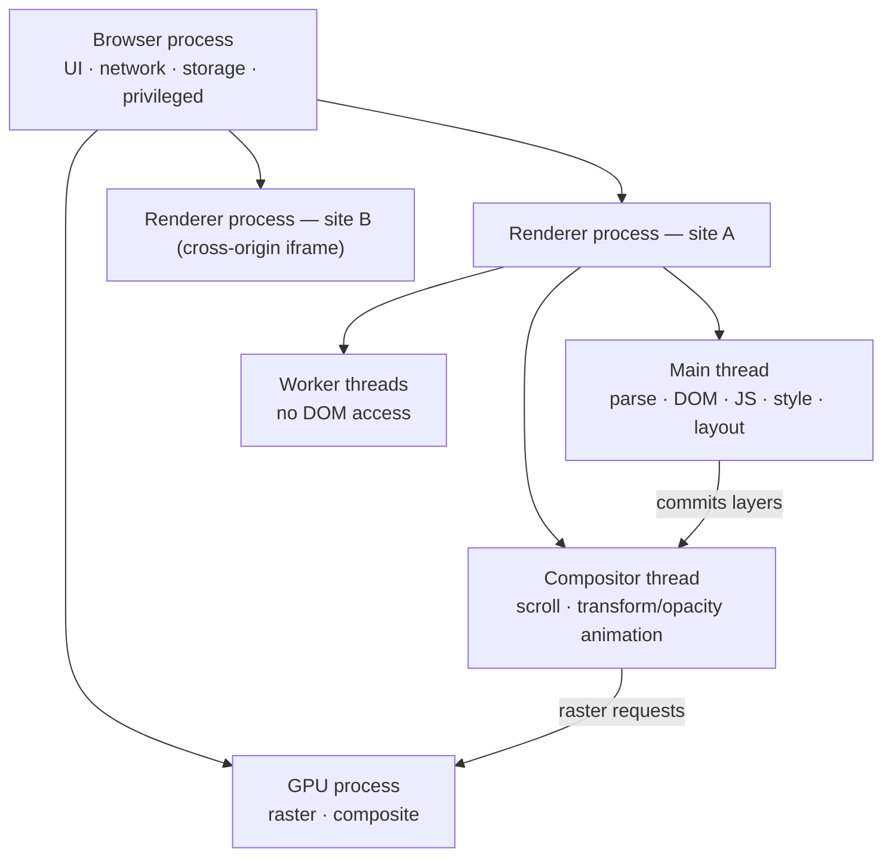

# Process & Thread Architecture

> A browser is not one program but a fleet of sandboxed processes, and inside the one that runs your page there is exactly one thread that owns the DOM — every frontend performance rule follows from that.

**Part:** [00 · Foundations](../) · **Domain:** The Web Platform · **Priority:** Critical · **Difficulty:** Foundational · **Reading time:** ~11 min

## TL;DR

Modern browsers use a **multi-process architecture**: a privileged *browser process* coordinates the UI and network, while sandboxed *renderer processes* run page content, one per site under site isolation. Inside a renderer, the **main thread** parses HTML, builds the DOM, runs JavaScript, calculates style, and performs layout — all of it, serially. Other threads exist (compositor, raster, network, worker) but none of them can touch the DOM. That single serialized main thread is the scarce resource in every frontend system: if a task holds it for 200 ms, input, animation, and rendering all wait. Performance work is therefore mostly *main-thread budgeting* — move work off it, break it up, or don't do it — and security boundaries are mostly *process* boundaries, which is why cross-origin isolation shows up as a process-level decision.

> **Recommendation:** Treat the main thread as a hard budget of ~16 ms per frame and ~50 ms per task. Anything longer belongs in a worker, in smaller chunks, or on the server.

## At a Glance

| | |
| --- | --- |
| **Use when** | Diagnosing jank, input delay, or memory growth; deciding what to offload; reasoning about cross-origin isolation. |
| **Avoid when** | You need per-thread control — the web platform deliberately hides scheduling; you get workers and yielding, not threads. |
| **Alternatives** | [Web Workers](#alternative-approaches) and [server-side work](#alternative-approaches) as the two ways off the main thread. |
| **Primary risk** | Assuming "async" means "off the main thread" — a promise still resolves on the main thread and still blocks it. |
| **Maturity** | Stable — multi-process since 2008, site isolation broadly deployed since 2018. |

## Prerequisites

You should be comfortable with the DOM as a hierarchical structure, since the reason the DOM is single-threaded is a direct consequence of it being a mutable shared tree.

- [Trees & the DOM as a Tree](../computer-science/trees-and-the-dom-as-a-tree.md) (`· Computer Science for Frontend`) — the shared mutable structure that the main thread exclusively owns.

## Overview

The **browser process model** describes how a browser splits its work into operating-system processes, and how each process splits its work across threads. A *process* has its own memory space and cannot read another's; a *thread* is a unit of execution that shares memory with the other threads in its process. Browsers use both, and for different reasons: processes provide **security and crash isolation**, threads provide **parallelism**.

Chromium's shape is the common reference. A **browser process** (sometimes called the parent or UI process) owns the address bar, tabs, bookmarks, and the privileged network and storage services. **Renderer processes** — one per site instance under *site isolation* — run everything inside the content area: HTML parsing, JavaScript, style, layout, and paint. A **GPU process** rasterizes and composites. **Utility processes** handle audio, network, and storage. Renderers are sandboxed: they cannot read files or open sockets directly, only ask the browser process to.

The distinction that trips people up is what "the main thread" means. Each renderer process has one main thread, and *that* thread — not the process — owns the DOM. The DOM is a mutable tree with no locking; two threads mutating it concurrently would require a locking model the platform deliberately never adopted. So the DOM is confined to one thread, forever. Everything else about frontend performance follows from that one design decision.

## The Problem

Without a model of processes and threads, symptoms are unattributable. A page stutters during scroll — is that layout, JavaScript, or the compositor? An input takes 300 ms to respond after a fetch resolves — but the network was fast, so why? Memory climbs steadily in a tab that seems idle. A cross-origin iframe on the page appears to slow the parent, or appears not to, and nobody can say which to expect. Each of these has a precise answer in the architecture, and no answer at all without it.

The most expensive version of the confusion is the belief that `async`/`await` and promises provide concurrency. They provide *deferral*, not parallelism. `await fetch(...)` frees the main thread while the network is in flight, because the network runs elsewhere — but the `.then()` callback, the `JSON.parse` of a 4 MB response, and the state update that follows all run on the main thread, in one uninterruptible task. Teams routinely "make it async" and are surprised the jank is unchanged, because they moved *when* the work runs without moving *where*.

The second expensive version is treating tab or iframe isolation as free or as absent. Both are wrong in different situations: an iframe from a different site is a separate process and genuinely cannot block your main thread, while an iframe from the *same* site shares yours and absolutely can.

## Why It Matters

The main thread is where user-visible responsiveness is won or lost. Input Delay — the "I" in INP — is literally the time an input event spends waiting for the main thread to become free. A single 300 ms task, whether it is parsing a large JSON payload, running an expensive React render, or executing a third-party analytics bundle, guarantees that any interaction arriving during it is at least that late. Frame rendering is on the same thread: a long task means dropped frames, which is what "jank" is. No amount of clever CSS fixes a main thread that is busy.

Processes matter for a different set of reasons. Crash isolation means one runaway page kills its renderer, not the browser. Security isolation means a compromised renderer running a site's code cannot read another site's memory — the mitigation that Spectre-class attacks forced the industry to take seriously, and the reason `SharedArrayBuffer` and high-resolution timers are gated behind cross-origin isolation headers. Memory is the trade: each process carries real overhead, which is why browsers consolidate processes under memory pressure and why a hundred open tabs behaves differently than ten.

## Mental Model

Picture two nested boxes. The outer box is the **process**, which draws a security and memory boundary. The inner box is the **main thread**, which draws a *time* boundary — a single queue of tasks executed one at a time, to completion.



Read it as three rules.

**Rule one: one main thread per renderer, and it does everything DOM-related.** HTML parsing, DOM construction, JavaScript execution, style calculation, layout, and the paint *instructions* are all main-thread work. They are serialized, so they compete with each other and with your event handlers.

**Rule two: the compositor thread can move pixels without the main thread.** Scrolling, and animations of `transform` and `opacity` only, can run on the compositor using layers the main thread already committed. That is why a `transform` animation survives a busy main thread and a `top`/`left` animation does not — the latter requires layout, which is main-thread work.

**Rule three: workers get a thread but not the DOM.** A `Worker` runs real parallel JavaScript in the same process, communicating by message passing (structured clone) or shared memory (`SharedArrayBuffer`, gated behind cross-origin isolation). It cannot touch `document`. So the offloading question is always "is this computation separable from DOM mutation?" — if yes, it can leave the main thread; if no, it must be chunked instead.

Cross-origin iframes deserve one line: under site isolation they get their own renderer process, so their JavaScript runs on a *different* main thread and cannot block yours. Same-site iframes share your process and your main thread, and can.

## Best Practices

**Budget the main thread explicitly.** Target tasks under 50 ms — the threshold above which the platform calls it a *long task* — and under ~16 ms during animation. Measure with the Performance panel or `PerformanceObserver` on `longtask`; do not estimate.

**Yield, don't just defer.** Breaking a long loop into `await scheduler.yield()` (or `setTimeout(…, 0)` as the portable fallback) hands the thread back so pending input can run. Wrapping the same loop in a promise without yielding changes nothing.

**Offload computation, not DOM work.** Parsing, diffing, compression, crypto, image processing, search indexing, and large-array transforms all belong in a worker. Serialize the *result*, not the intermediate structures, to keep the postMessage cost low — structured clone of a huge object can itself become the bottleneck, in which case use a `Transferable`.

**Animate only compositor-friendly properties.** `transform` and `opacity` stay off the main thread. `top`, `left`, `width`, and `height` force layout on every frame and will stutter under load.

**Treat third-party scripts as main-thread tenants.** Every analytics, tag manager, or chat widget script executes on your one main thread. Load them with `async`/`defer`, and measure their long tasks separately — this is usually the largest uncontrolled cost on a real page.

**Reach for cross-origin isolation deliberately.** `SharedArrayBuffer` and precise timers require `Cross-Origin-Opener-Policy: same-origin` and `Cross-Origin-Embedder-Policy: require-corp`, which will break embeds that don't opt in. Adopt it when you need shared memory, not by default.

## Trade-offs

The multi-process, single-main-thread design trades memory and programming convenience for security, stability, and a model with no data races.

**Advantages**

- A compromised or crashed renderer cannot read or take down other sites, or the browser itself.
- The DOM needs no locks, so there is an entire class of concurrency bug the web simply does not have.
- Compositor and GPU threads keep scrolling and simple animation smooth even when the main thread is busy.

**Disadvantages**

- Every process has fixed memory overhead, so isolation costs RAM that scales with tabs and cross-origin frames.
- The main thread is a hard serialization point that no amount of `async` syntax removes.
- Parallelism requires workers, and workers require message passing, which adds serialization cost and architectural complexity.

| Dimension | Multi-process + single main thread | Cost / caveat |
| --- | --- | --- |
| Security | Site isolation contains cross-site reads | More processes, more memory |
| Stability | One page crash is contained | Process startup latency on navigation |
| Concurrency | No DOM data races by construction | All DOM work serialized on one thread |
| Performance | Compositor keeps scroll/animation smooth | Only for `transform` / `opacity`; anything else needs the main thread |
| Developer model | Simple, deterministic execution | Parallelism only via workers and message passing |

## Alternative Approaches

There is no alternative *architecture* to choose — this is the platform. The real decision is where a given piece of work should run, and there are only four places.

| Approach | Best when | Weakness | See |
| --- | --- | --- | --- |
| Main thread | The work touches the DOM, or is short (<5 ms) | Blocks input and rendering while it runs | (this article) |
| Chunked main thread | DOM work that is inherently large (rendering a long list) | Total time is unchanged; only responsiveness improves | `List Virtualization · Data & Server State` |
| [Web Worker](https://developer.mozilla.org/en-US/docs/Web/API/Web_Workers_API) | Pure computation with a serializable input and output | No DOM; message passing costs and adds latency | `Web Workers · Runtime & Execution` (planned) |
| Server | The work needs data or CPU the client shouldn't spend | Network round trip; requires server capacity | `Rendering Architectures` |

The honest default: if it touches the DOM, chunk it; if it doesn't, move it off; if it needs neither the DOM nor the client, move it to the server.

## Bad Example

A dashboard that fetches a large report and renders it — written as if `async` meant "off the main thread".

```js
// ❌ "Async" here defers work; it never leaves the main thread.
async function loadReport(reportId) {
  const response = await fetch(`/api/reports/${reportId}`);
  const rows = await response.json(); // ~8 MB parse — main thread, uninterruptible

  // A synchronous O(n log n) pass over 200k rows, on the main thread.
  const summary = rows
    .map(normalizeRow)
    .filter((r) => r.status !== 'void')
    .sort((a, b) => b.amount - a.amount);

  // Then a single write of 200k nodes, also on the main thread.
  const container = document.getElementById('report');
  container.innerHTML = summary.map(rowToHtml).join('');

  // And a layout-driven "animation" on top of it.
  container.animate?.(null);
  let x = 0;
  const id = setInterval(() => {
    container.style.left = `${(x += 2)}px`; // forces layout every frame
    if (x > 400) clearInterval(id);
  }, 16);
}
```

**What goes wrong:** Four distinct main-thread stalls, none of which `await` prevents. `response.json()` parses megabytes synchronously once the body arrives. The map/filter/sort chain is pure computation with no DOM dependency — it has no business on this thread at all. The `innerHTML` write constructs and lays out a 200k-node subtree in one uninterruptible task. And animating `left` forces layout on every frame, so the "animation" competes with everything else. Any click during this sequence waits for all of it; INP will be measured in seconds, not milliseconds.

## Good Example

The same feature, with each piece of work placed on the thread that should own it.

```js
// ✅ report.worker.js — pure computation, no DOM, runs on its own thread.
self.onmessage = async ({ data: { reportId, url } }) => {
  try {
    const response = await fetch(url, { credentials: 'same-origin' });
    if (!response.ok) throw new Error(`Report ${reportId} failed: ${response.status}`);

    const rows = await response.json();       // parse cost paid off the main thread
    const summary = rows
      .map(normalizeRow)
      .filter((r) => r.status !== 'void')
      .sort((a, b) => b.amount - a.amount)
      .slice(0, 500);                          // only send what the UI will show

    self.postMessage({ ok: true, summary });
  } catch (error) {
    self.postMessage({ ok: false, message: String(error.message ?? error) });
  }
};
```

```js
// ✅ main.js — the main thread only does what only it can do: touch the DOM.
const worker = new Worker(new URL('./report.worker.js', import.meta.url), { type: 'module' });
const container = document.getElementById('report');
if (!container) throw new Error('loadReport: #report not found');

export function loadReport(reportId, signal) {
  return new Promise((resolve, reject) => {
    const onAbort = () => { worker.onmessage = null; reject(signal.reason); };
    signal?.addEventListener('abort', onAbort, { once: true });

    worker.onmessage = async ({ data }) => {
      signal?.removeEventListener('abort', onAbort);
      if (!data.ok) return reject(new Error(data.message));

      // Render in yielding chunks so input can interleave.
      const fragment = document.createDocumentFragment();
      for (let i = 0; i < data.summary.length; i += 50) {
        for (const row of data.summary.slice(i, i + 50)) fragment.append(renderRow(row));
        // Hand the thread back between chunks.
        await (globalThis.scheduler?.yield?.() ?? new Promise((r) => setTimeout(r, 0)));
      }
      container.replaceChildren(fragment);
      resolve(data.summary.length);
    };

    worker.postMessage({ reportId, url: `/api/reports/${reportId}` });
  });
}
```

```css
/* ✅ Compositor-only animation: no layout, no main-thread work per frame. */
#report {
  transition: transform 240ms ease-out;
  will-change: transform;
}
#report.is-shifted { transform: translateX(400px); }
```

**Why it's better:** Each stall from the bad version is removed by moving work to the right thread rather than by rewriting the algorithm. Fetch *and* JSON parse now happen in the worker, so the 8 MB parse never touches the main thread. The transform pipeline is pure computation and belongs there too; the worker sends 500 rows instead of 200,000, so the structured clone is small. DOM construction has to be on the main thread, so it is chunked with an explicit yield — total time is similar, but input can run between chunks, which is what INP measures. The animation moves to `transform` in CSS, which the compositor handles without the main thread at all. Cancellation is wired through an `AbortSignal` so an abandoned navigation doesn't render into a stale DOM.

## Common Mistakes

See the [Web Platform anti-patterns](../../../anti-patterns/) for the domain catalog. Concept-specific:

### Mistake: Believing `async`/`await` moves work off the main thread

- **Symptom:** A function is converted to `async` and the jank is unchanged; the profile still shows one long task.
- **Why it fails:** `await` yields to the event loop only while an *external* operation (network, timer, I/O) is pending. All the JavaScript before and after the await — including `JSON.parse`, array transforms, and framework rendering — runs on the main thread, in one task.
- **Fix:** Separate deferral from offloading. Move DOM-independent computation into a `Worker`; break DOM-dependent work into chunks with an explicit yield between them.

### Mistake: Animating layout-inducing properties

- **Symptom:** An animation is smooth on an idle page and stutters as soon as anything else runs.
- **Why it fails:** `top`, `left`, `width`, `height`, and `margin` require layout, which is main-thread work performed every frame. Any competing task delays it. `transform` and `opacity` are composited and need no main-thread frame work.
- **Fix:** Animate `transform` and `opacity`. If a layout-affecting change is unavoidable, apply it once rather than per frame.

### Mistake: Assuming all iframes are isolated (or that none are)

- **Symptom:** A third-party widget is blamed for main-thread jank it can't cause, or a same-site embed is exonerated when it is the cause.
- **Why it fails:** Under site isolation, a *cross-site* iframe runs in its own renderer process with its own main thread. A *same-site* iframe shares the parent's process and main thread.
- **Fix:** Check the process assignment in the browser's task manager before attributing a long task, and prefer cross-origin embedding for untrusted heavy widgets.

## Checklist

- [ ] No main-thread task exceeds 50 ms under realistic data volumes.
- [ ] DOM-independent computation (parse, transform, sort, crypto, compression) runs in a worker.
- [ ] Long DOM work is chunked with an explicit yield between chunks.
- [ ] Animations use `transform`/`opacity`; layout-affecting properties are not animated per frame.
- [ ] Third-party scripts are `async`/`defer` and their long tasks are measured separately.
- [ ] Worker messages carry the smallest payload that satisfies the UI, using `Transferable` for large buffers.
- [ ] Cross-origin isolation headers are set only where `SharedArrayBuffer` or precise timers are genuinely needed.

## Related Articles

- [Sandboxing & Site Isolation](./) (planned) — how the process boundary becomes a security boundary.
- [The Main Thread](./) (planned) — the task queue, long tasks, and the frame budget in detail.
- HTML Parsing & DOM Construction (planned) — the first main-thread job of any page load.
- Style Calculation (planned) and Layout & Reflow (planned) — the pipeline stages that make main-thread work expensive.
- **Canonical home:** the security consequences of the process boundary are owned by [Same-Origin Policy · Security](../../05-reliability-quality/security/same-origin-policy.md).

## References

- [Chrome — Inside look at modern web browser (part 1)](https://developer.chrome.com/blog/inside-browser-part1) — the canonical walkthrough of the browser/renderer/GPU process split.
- [Chromium — Site Isolation Design](https://www.chromium.org/Home/chromium-security/site-isolation/) — why cross-site frames get their own process, and what that guarantees.
- [MDN — Web Workers API](https://developer.mozilla.org/en-US/docs/Web/API/Web_Workers_API) — the supported way to get real parallelism on the web.
- [WHATWG — HTML Standard: Agents and agent clusters](https://html.spec.whatwg.org/multipage/webappapis.html#agents-and-agent-clusters) — the spec-level model behind "one thread owns the DOM".
