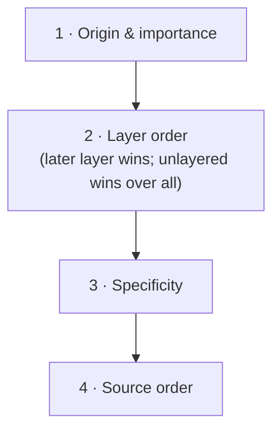

# Cascade Layers (@layer)

> A layer decides which body of CSS wins before specificity is ever consulted — which is how a one-class utility can beat a three-class component rule without `!important`.

**Part:** [01 · Core Languages](../) · **Domain:** CSS & Visual Systems · **Priority:** Critical · **Difficulty:** Foundational · **Reading time:** ~8 min

## TL;DR

`@layer` adds a step to the cascade **above specificity**: within one origin, declarations are compared by layer order first, and only rules in the same layer are compared by specificity. Layer order is set by the first `@layer a, b, c;` statement that appears, and **later layers win**. **Unlayered styles beat every layer** in the normal (non-`!important`) case, which is the rule most teams get wrong. For `!important` declarations the whole order reverses — the *first* layer wins, and unlayered `!important` loses to layered `!important`.

> **Recommendation:** Declare the layer order once at the top of the entry stylesheet, put third-party and reset CSS in the earliest layers, and keep application code either fully layered or fully unlayered — not half of each.

## At a Glance

| | |
| --- | --- |
| **Use when** | You need predictable precedence between bodies of CSS: reset, vendor, base, components, utilities, overrides. |
| **Avoid when** | The problem is a single rule losing to another in the same body — that is a selector design problem. |
| **Alternatives** | [`:where()` for zero specificity](#alternative-approaches), [custom properties](./custom-properties.md), scoped styles. |
| **Primary risk** | Mixing layered and unlayered CSS, so unlayered rules silently outrank everything you carefully ordered. |
| **Maturity** | Stable — supported in all major browsers since March 2022. |

## Prerequisites

Layers are a step in the cascade, so the steps around them come first.

- [Specificity](./specificity.md) — the tiebreaker that layers now sit above.

## Overview

A **cascade layer** is a named bucket of declarations. The cascade compares, in order: origin and importance, then **layer order**, then specificity, then source order. Adding layers therefore does not change specificity — it inserts a stronger criterion in front of it, so a `.btn` rule in a later layer beats a `.page .card .btn` rule in an earlier one.

Layer order is established by **the first mention of each layer name**, which is why the convention is a bare statement at the top of the entry file:

```css
@layer reset, vendor, base, components, utilities;
```

Everything after that can add to those layers in any order and in any file; the sequence above is what decides precedence. Layers can nest (`@layer components.forms`), and an unnamed `@layer { … }` block creates an anonymous layer at that position that nothing else can add to.

The rule with the most practical consequence: **unlayered styles win against all layers** for normal declarations. Layers were designed so that existing, unlayered stylesheets keep working when a layered system is introduced around them — the migration path is safe, but it means a stray unlayered rule outranks the utilities layer that was supposed to have the final word.

## The Problem

Without layers, precedence between bodies of CSS has to be expressed through specificity, and the only tools are more selectors and `!important`.

```css
/* Vendor stylesheet, loaded first, written defensively. */
.ui-kit .ui-btn.ui-btn--primary { background: #2563eb; }

/* Your design system, loaded second, loses on specificity. */
.btn-primary { background: var(--brand); }        /* ignored */

/* So it escalates. */
.app .ui-kit .btn-primary { background: var(--brand); }
.btn-primary { background: var(--brand) !important; }  /* and now nothing can override it */
```

Every override raises the floor for the next one. Utilities suffer most: `.mt-0` is a single class by design, so it loses to any component rule with two, and utility frameworks historically shipped `!important` on every declaration to compensate — which then breaks the one case where a component genuinely needs to win.

The second problem is load-order fragility. Without layers, "which stylesheet wins" depends on the order bundles happen to be inserted, so a change in the build — code splitting, a lazily loaded route, a `<style>` injected by a component library at runtime — silently reorders precedence. The CSS did not change; the outcome did.

## Why It Matters

Layers turn precedence into architecture. Declaring `@layer reset, vendor, base, components, utilities;` states the system's intent in one line, and that line survives bundler changes, lazy loading, and runtime style injection, because layer order is fixed by declaration rather than by insertion order.

They also let selectors go back to describing *what they match* instead of *how badly they need to win*. Once utilities are in the last layer, a utility can be a single class and still override a component; once vendor CSS is in an early layer, defensive `.app .vendor .thing` chains can be deleted. That reduction is the main day-to-day benefit — specificity stops being a currency.

There is an interoperability angle too. Third-party widgets, embedded editors, and CMS-injected styles are the classic sources of unfixable overrides. Importing them into an early layer (`@import url(widget.css) layer(vendor);`) subordinates them without touching their source.

## Mental Model

Think of the cascade as a sorted list where layers are consulted **before** specificity.



Four rules make it usable.

**Later layers win, and unlayered beats all layers.** Picture unlayered CSS as an implicit final layer for normal declarations.

**`!important` reverses the layer order.** With `!important`, the *earliest* layer wins and unlayered `!important` is the weakest. This is deliberate: it lets a reset layer assert something a later layer cannot take back, and it is why `!important` inside a utilities layer is usually a mistake.

**Order is set by first mention.** A bare `@layer a, b, c;` statement at the top is the only reliable way to control it; relying on the order files happen to load reintroduces the problem layers solve.

**Nesting is a sub-order, not an escape.** `@layer components.forms` sorts inside `components`; it never outranks a later top-level layer.

## Best Practices

**Declare the full order once, first, in the entry stylesheet.** Every other file then contributes to a layer whose position is already decided.

**Import third-party CSS into a layer.** `@import url('vendor.css') layer(vendor);` subordinates code you cannot edit.

**Keep application CSS fully layered.** A single unlayered rule outranks every layer, so "mostly layered" produces exactly the confusion layers were meant to remove.

**Put utilities last, without `!important`.** The layer already gives them the final word for normal declarations.

**Use `revert-layer` to undo a layer's own opinion** rather than re-declaring the previous value by hand.

**Combine layers with `:where()` for library defaults.** Zero-specificity selectors inside an early layer are the most overridable possible baseline.

**Do not layer by component.** Layers express precedence, not organization; a layer per component produces a global ordering nobody can reason about.

## Trade-offs

Layers buy predictable precedence at the cost of a global configuration everyone must know.

**Advantages**

- Precedence becomes explicit and independent of load order, bundling, and runtime injection.
- Selectors can stay flat, because winning no longer requires added weight.
- Third-party CSS can be subordinated without editing it or wrapping it in defensive selectors.

**Disadvantages**

- Layer order is global state: understanding any rule's precedence requires knowing the layer list.
- The unlayered-wins rule and the `!important` reversal are counter-intuitive and are learned by being surprised.
- Debugging requires devtools that display layers; without that, a losing rule looks unexplained.

| Dimension | Cascade layers | Specificity escalation | `!important` |
| --- | --- | --- | --- |
| Expresses | Precedence between bodies of CSS | Precedence between individual rules | A single unconditional override |
| Selector cost | Flat selectors stay flat | Grows with every override | None, but unbeatable afterward |
| Load-order sensitivity | None once declared | High | None |
| Reversibility | `revert-layer` | Another, heavier selector | Another `!important` |
| Failure mode | Unlayered rules bypass the system | Arms race | Dead end |

## Alternative Approaches

| Approach | Best when | Weakness | See |
| --- | --- | --- | --- |
| Cascade layers | Ordering reset, vendor, base, components, utilities | Global order everyone must know | (this article) |
| `:where()` | A library needs easily overridable defaults | Zero specificity only; no ordering between bodies | [Specificity](./specificity.md) |
| Custom properties | The difference is a value, not a rule | Cannot restructure layout or override arbitrary properties | [Custom Properties](./custom-properties.md) |
| Scoped styles (`@scope`, CSS Modules, Shadow DOM) | Isolation matters more than global ordering | Theming across the boundary needs custom properties | Styling Strategies · Design Systems (planned) |
| `!important` | Genuinely unconditional (print, forced-colors overrides) | Reverses layer order; no way back | [Specificity](./specificity.md) |

## Bad Example

A codebase that expresses precedence through weight and load order.

```css
/* main.css — order depends on how the bundler concatenates these. */
@import url('vendor/ui-kit.css');
@import url('reset.css');
@import url('components.css');
@import url('utilities.css');

/* ❌ Defensive selectors written to out-specify the vendor. */
.app .ui-kit .card .card-title { color: var(--text); }

/* ❌ Utilities shipped with !important so a single class can win. */
.u-mt-0 { margin-top: 0 !important; }
.u-hidden { display: none !important; }

/* ❌ A component that must override a utility now has no move left. */
.dialog.is-open { display: grid !important; }   /* ties with .u-hidden; source order decides */

/* ❌ A lazily loaded route injects this at runtime, after everything. */
.card-title { color: #000; }   /* wins by source order, silently */
```

**What goes wrong:** Precedence is decided by two things nobody controls precisely — selector weight and the order the bundler emits imports — so `reset.css` loading after `ui-kit.css` may or may not do what it claims depending on the build. The defensive `.app .ui-kit .card .card-title` chain exists only to out-weigh vendor CSS, and it will need another segment the next time the vendor updates. The utilities carry `!important` because a single class cannot beat a component rule otherwise; that works until `.dialog.is-open` also needs `!important`, at which point two `!important` declarations tie and source order — the thing being avoided — decides whether the dialog opens. And the lazily loaded `.card-title` rule wins over everything simply by arriving last, which makes the bug appear only on the route that loads it.

## Good Example

The same system with precedence declared once.

```css
/* main.css — the whole precedence model of the codebase, in one line. */
@layer reset, vendor, base, components, utilities;

/* ✅ Third-party CSS is subordinated without touching its source. */
@import url('vendor/ui-kit.css') layer(vendor);
@import url('reset.css') layer(reset);
@import url('base.css') layer(base);
@import url('components.css') layer(components);
@import url('utilities.css') layer(utilities);
```

```css
/* components.css — flat selectors; no need to out-weigh the vendor. */
@layer components {
  .card-title {
    color: var(--text);
    font-size: 1.125rem;
  }

  /* Sub-layers order within components without outranking `utilities`. */
  @layer forms {
    .field-label { color: var(--text-muted); }
  }
}
```

```css
/* utilities.css — single classes win because of the layer, not !important. */
@layer utilities {
  .mt-0 { margin-top: 0; }
  .hidden { display: none; }
}
```

```css
/* base.css — zero-specificity defaults that anything can override. */
@layer base {
  :where(button, input, select, textarea) {
    font: inherit;
    color: inherit;
  }

  /* `!important` in the earliest layer is the one place it is a design tool:
     a forced-colors override that later layers must not undo. */
  @media (forced-colors: active) {
    :where(a, button):focus-visible {
      outline: 2px solid Highlight !important;
    }
  }
}
```

```css
/* ✅ Undo one layer's opinion instead of re-declaring the previous value. */
@layer components {
  .card--bare {
    all: revert-layer;   /* falls back to `base`, then `vendor`, then `reset` */
  }
}
```

**Why it's better:** The single `@layer reset, vendor, base, components, utilities;` statement makes precedence independent of import order, bundling, and lazily injected styles — a rule that arrives at runtime lands in its declared layer rather than at the end. Importing the vendor stylesheet with `layer(vendor)` subordinates it, so `.card-title` can be a single class and the `.app .ui-kit .card` chain is deleted rather than extended. Utilities win because they are last, so `!important` disappears from them and a component that must override a utility can simply do so from a later position or with a more specific selector inside the same layer. The one remaining `!important` sits in an early layer, where the reversed order for important declarations makes it genuinely unbeatable — which is what a forced-colors accessibility override should be. And `revert-layer` gives a component a way to opt out of its own layer's styling without duplicating whatever the base layer said.

## Common Mistakes

See the [CSS & Visual Systems anti-patterns](../../../anti-patterns/) for the domain catalog. Concept-specific:

### Mistake: Assuming layered CSS beats unlayered CSS

- **Symptom:** A carefully ordered utilities layer is overridden by a stray rule in a component file that forgot its `@layer` wrapper.
- **Why it fails:** For normal declarations, unlayered styles have higher priority than every layer — a deliberate design choice so that adopting layers cannot break an existing stylesheet. "Mostly layered" therefore behaves worse than either extreme.
- **Fix:** Keep application CSS fully layered. If a build step or component library injects unlayered styles, wrap or import them into a layer.

### Mistake: Using `!important` inside a late layer

- **Symptom:** An `!important` utility loses to an `!important` rule in the reset layer, which reads as the opposite of what `!important` is supposed to do.
- **Why it fails:** For important declarations the layer order reverses: earlier layers win. An `!important` in the last layer is therefore the *weakest* important declaration in the system.
- **Fix:** Remove `!important` from late layers — the layer already gives them precedence. Reserve important declarations for early layers where the reversal makes them intentionally unbeatable.

### Mistake: Creating a layer per component

- **Symptom:** Dozens of layers, an order statement nobody can read, and precedence questions that require a graph to answer.
- **Why it fails:** Layers express a global precedence order, not file organization. With one layer per component, every pairwise precedence question depends on a position in a long list that no one maintains deliberately.
- **Fix:** Use a small, fixed set of layers by *role* — reset, vendor, base, components, utilities, overrides — and sub-layer inside `components` if grouping is needed.

## Checklist

- [ ] A single `@layer …;` statement at the top of the entry stylesheet declares the full order.
- [ ] Third-party CSS is imported with `layer(...)`, not loaded unlayered.
- [ ] No application CSS is left unlayered.
- [ ] Utilities are the last layer and contain no `!important`.
- [ ] Any `!important` lives in an early layer and its reason is documented in a comment.
- [ ] The layer list is by role, not by component, and fits on one line.
- [ ] `revert-layer` is used to undo a layer's declarations instead of re-declaring previous values.
- [ ] Runtime-injected styles (component libraries, CMS) were checked for layer membership.

## Related Articles

- [Specificity](./specificity.md) — the criterion layers sit above, and the arms race they remove.
- [Inheritance & Initial Values](./inheritance-and-initial-values.md) — what `revert-layer` falls back to.
- [Custom Properties](./custom-properties.md) — the other way to avoid override fights, at the value level.
- Styling Strategies · Design Systems (planned) — where layers fit alongside scoping and utility approaches.

## References

- [CSS Cascading and Inheritance Level 5 — Cascade Layers](https://www.w3.org/TR/css-cascade-5/#layering) — the normative ordering rules, including the `!important` reversal.
- [MDN — `@layer`](https://developer.mozilla.org/en-US/docs/Web/CSS/@layer) — syntax, nesting, and anonymous layers.
- [MDN — Cascade layers guide](https://developer.mozilla.org/en-US/docs/Web/CSS/CSS_cascade/Cascade_layers) — worked examples of layer ordering.
- [Chrome for Developers — Cascade layers](https://developer.chrome.com/docs/css-ui/cascade-layers) — practical patterns and devtools support.
