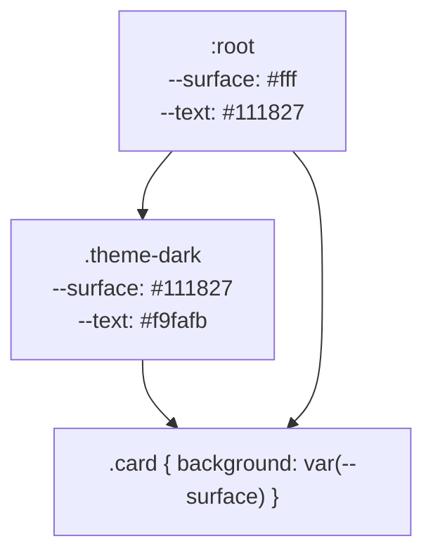

# Custom Properties

> A custom property is an inherited value, not a preprocessor variable — which is what lets one declaration re-theme a subtree at runtime, and what makes its failure modes unfamiliar.

**Part:** [01 · Core Languages](../) · **Domain:** CSS & Visual Systems · **Priority:** Critical · **Difficulty:** Foundational · **Reading time:** ~8 min

## TL;DR

A **custom property** (`--brand: #2563eb`) is a real CSS property that participates in the cascade and **always inherits**. `var(--brand, fallback)` substitutes its value at computed-value time, so a change anywhere — a media query, a class on `<html>`, a `style` attribute set from JavaScript — re-themes every descendant without new selectors. Two behaviors surprise people: custom properties are **untyped by default**, so a bad value is only detected where it is used and makes that whole declaration **invalid at computed-value time** (the property falls back to inherited or initial, not to the previous rule); and they cannot be animated unless registered with **`@property`**, which adds a type, an initial value, and control over inheritance.

> **Recommendation:** Define tokens on `:root`, consume them with a fallback in components, and register any custom property you intend to animate or that must be type-checked with `@property`.

## At a Glance

| | |
| --- | --- |
| **Use when** | The variation is a *value* — color, spacing, radius, duration — that changes by theme, breakpoint, state, or runtime input. |
| **Avoid when** | The variation is structural (which rules apply); use a class, a cascade layer, or a container query instead. |
| **Alternatives** | [Preprocessor variables](#alternative-approaches), [cascade layers](./cascade-layers-layer.md), utility classes, inline styles. |
| **Primary risk** | Invalid-at-computed-value-time: one bad token silently drops a declaration to its inherited or initial value. |
| **Maturity** | Stable — custom properties since 2016; `@property` in all major browsers since July 2024. |

## Prerequisites

Custom properties are ordinary properties that cascade and inherit, so both mechanisms come first.

- [Specificity](./specificity.md) — how a custom property's value is chosen when several rules set it.
- [Inheritance & Initial Values](./inheritance-and-initial-values.md) — the inheritance that makes them a theming mechanism.

## Overview

A **custom property** is any property whose name starts with `--`. It is stored as a nearly free-form token stream, cascades like any other property, and — unlike almost every other property — **inherits by default**. `var(--name)` substitutes its computed value into another declaration; `var(--name, fallback)` supplies a value to use when the property is not set at all.

The comparison people reach for is a Sass variable, and it is the wrong model. A preprocessor variable is resolved at build time and has no relationship to the DOM: it cannot differ between two elements, cannot change at runtime, and cannot be read by JavaScript. A custom property is resolved per element, so `--gap` can be one value inside a sidebar and another inside a modal, and `element.style.setProperty('--x', …)` changes it live.

The boundary worth drawing is **value versus structure**. Custom properties vary values within the same rules. When a theme needs a different *layout* — a different `display`, a different element order, an extra rule — that is a class, a container query, or a cascade layer, not a variable.

## The Problem

Theming without custom properties means duplicating rules per theme, and the duplication grows with every theme times every component.

```css
/* Every component gains a dark-mode twin, and the two drift. */
.card { background: #fff; color: #111827; border: 1px solid #e5e7eb; }
.theme-dark .card { background: #111827; color: #f9fafb; border-color: #374151; }

.panel { background: #fff; color: #111827; }
.theme-dark .panel { background: #111827; color: #f9fafb; }
/* …and the `.theme-dark` prefix adds specificity, so utilities stop working. */
```

Every new surface needs two rules, every new theme multiplies them, and each `.theme-dark` prefix is an extra class in the selector — so a `.mt-0` utility that worked in light mode loses in dark mode.

The second problem is the failure mode when a token is wrong. Because custom properties are untyped, `--radius: 8` (missing units) is a perfectly valid custom property; the error only appears where it is substituted, and the result is not "ignore this declaration and use the previous one":

```css
:root { --radius: 8; }              /* valid custom property, unusable length */
.card { border-radius: 4px; }
.card { border-radius: var(--radius); }  /* invalid at computed-value time */
/* border-radius is now `initial` (0), not the 4px from the earlier rule. */
```

The third is expecting animation to work. `transition: --progress 300ms` does nothing for an unregistered property, because the browser has no type information and cannot interpolate a token stream.

## Why It Matters

Custom properties are what make runtime theming affordable. Dark mode, high-contrast variants, per-tenant branding, and user-adjustable density all reduce to changing a handful of values at a single element, with no rule duplication and no added specificity — which is why they, not class-per-theme selectors, are the mechanism design systems settled on.

They are also the supported channel between JavaScript and CSS. A drag handle, a scroll-linked effect, or a chart that needs a computed color can write one property and let the cascade distribute it, instead of setting inline styles on many elements or toggling classes. Because the write is a single `setProperty` call on one element, it is also cheap: style recalculation is scoped to that subtree.

And they interact well with the rest of the cascade in a way preprocessor variables cannot. A component can consume `var(--surface, white)` and remain correct in a page that never defines `--surface`, which makes a library's defaults overridable without either side knowing about the other.

## Mental Model

Picture a custom property as **a value flowing down the tree, read at the point of use**.



Four behaviors follow.

**Substitution happens at computed-value time, on the element using it.** `var()` reads the value the *consuming* element inherited, so the same `.card` rule produces different colors in different subtrees.

**The fallback is for absence, not for invalidity.** `var(--x, red)` uses `red` only when `--x` is not set. If `--x` is set to something the property cannot accept, the declaration becomes **invalid at computed-value time** and the property falls back to inherited or initial — the fallback in `var()` does not rescue it, and neither does the previous rule.

**They are untyped unless registered.** `@property --radius { syntax: '<length>'; inherits: false; initial-value: 4px; }` gives the browser a type, a guaranteed initial value, and control over inheritance — which also makes the property animatable and makes a bad value fall back to the registered initial rather than poisoning the declaration.

**JavaScript reads and writes them through the ordinary style API.** `el.style.setProperty('--x', '12px')` and `getComputedStyle(el).getPropertyValue('--x')`. Values are strings; whitespace is preserved.

## Best Practices

**Define tokens on `:root` and re-define them on a scope to re-theme.** `[data-theme='dark'] { --surface: … }` on `<html>` re-themes everything below with one rule and no specificity cost inside components.

**Consume with a fallback in library code.** `var(--surface, Canvas)` keeps a component usable in a page that never defined the token.

**Name by role, not by appearance.** `--surface-raised` survives a palette change; `--gray-100` does not.

**Register properties you animate or that must be typed.** `@property` is the only way to transition a custom property, and its `initial-value` prevents the invalid-value trap.

**Keep the write side to one element.** Setting a property on a shared ancestor and letting it inherit is cheaper and simpler than writing it on many nodes.

**Prefer `light-dark()` or a `color-scheme`-aware token for two-mode themes** where support allows, and keep `prefers-color-scheme` as the default with a class or attribute override for an explicit user choice.

**Do not build logic out of them.** Space-toggle and similar tricks are clever, fragile, and unreadable; a class or a container query expresses conditional structure honestly.

## Trade-offs

Custom properties trade compile-time certainty for runtime flexibility.

**Advantages**

- One declaration re-themes a subtree, with no rule duplication and no added specificity.
- Values are readable and writable at runtime, from media queries, container queries, JavaScript, or a `style` attribute.
- Components can consume tokens they do not own, with fallbacks, which decouples a library from its host page.

**Disadvantages**

- Untyped by default, so mistakes surface at the point of use as a silently dropped declaration.
- Not animatable without `@property`, and registration is per-property boilerplate.
- Deep chains of `var()` referencing other `var()` are hard to debug — devtools show the final value, not the path.

| Dimension | Custom properties | Preprocessor variables |
| --- | --- | --- |
| Resolved | At computed-value time, per element | At build time, globally |
| Varies per element | Yes, through inheritance | No |
| Runtime changes | Yes, including from JavaScript | No |
| Type checking | None unless `@property` | Build-time, by the preprocessor |
| Cost | A real property in the cascade | Zero at runtime |

## Alternative Approaches

| Approach | Best when | Weakness | See |
| --- | --- | --- | --- |
| Custom properties | Values change by theme, scope, state, or at runtime | Untyped; invalid values drop declarations | (this article) |
| Preprocessor variables | Values are fixed at build time (breakpoint literals, math) | Cannot vary per element or at runtime | (this article) |
| Cascade layers | The difference is which rules win, not which values | Does not parameterize values | [Cascade Layers (@layer)](./cascade-layers-layer.md) |
| Utility classes | Variation is per element and enumerable | Combinatorial growth; markup churn | [Specificity](./specificity.md) |
| Inline styles | A single element's one-off value | Highest priority; hard to override; no inheritance benefit | [Specificity](./specificity.md) |

## Bad Example

Tokens used as if they were preprocessor variables, with the type traps intact.

```css
/* ❌ Named for appearance, so a palette change renames everything. */
:root {
  --gray-100: #f3f4f6;
  --blue-600: #2563eb;
  --radius: 8;              /* ❌ no unit — a valid custom property, unusable length */
  --shadow-opacity: 0.2;
}

/* ❌ Dark mode still duplicates every rule, and adds specificity doing it. */
.card { background: var(--gray-100); color: #111827; }
.theme-dark .card { background: #111827; color: #f9fafb; }

.card {
  border-radius: 4px;
}
.card {
  border-radius: var(--radius);   /* ❌ invalid at computed-value time → 0, not 4px */
  box-shadow: 0 1px 2px rgba(0, 0, 0, var(--shadow-opacity));
}

/* ❌ Transition on an unregistered custom property: silently does nothing. */
.progress {
  --progress: 0%;
  transition: --progress 300ms ease;
  background: linear-gradient(to right, var(--blue-600) var(--progress), transparent 0);
}

/* ❌ No fallback, so a consumer page that omits the token gets an invalid declaration. */
.library-widget { background: var(--widget-surface); }
```

```js
// ❌ Writing the same value onto many elements instead of one ancestor.
document.querySelectorAll('.card').forEach((el) => {
  el.style.setProperty('--gray-100', '#111827');
});
```

**What goes wrong:** `--radius: 8` is a legal custom property — the error appears only where it is substituted, and `border-radius: var(--radius)` then becomes invalid at computed-value time, which resets `border-radius` to its initial `0` rather than falling back to the `4px` declared in the earlier rule. That behavior is unique to custom properties and is why the corner disappears with no error anywhere. Naming tokens `--gray-100` and `--blue-600` ties them to a palette, so switching to dark mode cannot reuse them and the theme falls back to duplicating rules with a `.theme-dark` prefix — which adds a class to the selector and breaks single-class utilities. The `transition: --progress` does nothing because an unregistered custom property has no type to interpolate. `var(--widget-surface)` without a fallback makes the library depend on a token the host page may never define. And the JavaScript loop writes the same value onto every card instead of setting it once on a shared ancestor, doing N style invalidations for one logical change.

## Good Example

Role-named tokens, registered where it matters, themed at one element.

```css
/* ✅ Registered: typed, with a guaranteed initial value, and animatable. */
@property --progress {
  syntax: '<percentage>';
  inherits: false;
  initial-value: 0%;
}

@property --radius {
  syntax: '<length>';
  inherits: true;
  initial-value: 4px;      /* a bad override now falls back here, not to 0 */
}

/* ✅ Tokens named by role; light is the default, dark is one rule. */
:root {
  color-scheme: light dark;

  --surface: #ffffff;
  --surface-raised: #f9fafb;
  --text: #111827;
  --text-muted: #6b7280;
  --border: #e5e7eb;
  --accent: #2563eb;
  --shadow-color: 0 0 0;
}

@media (prefers-color-scheme: dark) {
  :root:not([data-theme='light']) {
    --surface: #0b1220;
    --surface-raised: #111827;
    --text: #f9fafb;
    --text-muted: #9ca3af;
    --border: #374151;
    --accent: #60a5fa;
  }
}

/* ✅ An explicit user choice overrides the media query, still at one element. */
:root[data-theme='dark'] {
  --surface: #0b1220;
  --surface-raised: #111827;
  --text: #f9fafb;
  --text-muted: #9ca3af;
  --border: #374151;
  --accent: #60a5fa;
}
```

```css
/* ✅ One rule per component, valid in every theme. */
.card {
  background: var(--surface-raised);
  color: var(--text);
  border: 1px solid var(--border);
  border-radius: var(--radius);
  box-shadow: 0 1px 2px rgb(var(--shadow-color) / 0.2);
}

/* ✅ Scoped re-theming: an inverted region needs no component changes. */
.region--inverted {
  --surface-raised: #111827;
  --text: #f9fafb;
  --border: #374151;
}

/* ✅ Library defaults survive a page that never defines the token. */
.library-widget {
  background: var(--widget-surface, Canvas);
  color: var(--widget-text, CanvasText);
}

/* ✅ Registration makes this transition real. */
.progress-bar {
  background: linear-gradient(to right, var(--accent) var(--progress), var(--border) 0);
  transition: --progress 300ms ease-out;
}
```

```js
// ✅ One write on one element; the cascade distributes it.
function setTheme(theme /* 'light' | 'dark' | 'system' */) {
  const root = document.documentElement;
  if (theme === 'system') root.removeAttribute('data-theme');
  else root.setAttribute('data-theme', theme);
}

// ✅ A live value written once on the owning element, not on its children.
function setProgress(bar, ratio) {
  bar.style.setProperty('--progress', `${Math.min(Math.max(ratio, 0), 1) * 100}%`);
}
```

**Why it's better:** `@property` gives `--progress` and `--radius` a syntax and an initial value, which makes the transition actually interpolate and turns a malformed override into a fallback to `4px` instead of a silently dropped `border-radius`. Tokens are named by role, so the same `.card` rule is correct in both themes and dark mode is one block of value changes rather than a duplicate of every component rule — and because the switch happens on `:root`, no component selector gains a class or loses to a utility. Supporting both `prefers-color-scheme` and a `data-theme` attribute lets the system default follow the OS while an explicit user choice still wins, with no extra rules per component. `.region--inverted` shows the mechanism that class-per-theme cannot express: re-declaring tokens on a subtree re-themes only that subtree. The library widget consumes tokens with system-color fallbacks, so it renders correctly in a host page that has never heard of it. And the JavaScript writes one property on one element in each case, so a theme switch or a progress update invalidates a single subtree rather than N nodes.

## Common Mistakes

See the [CSS & Visual Systems anti-patterns](../../../anti-patterns/) for the domain catalog. Concept-specific:

### Mistake: Expecting `var()`'s fallback to catch invalid values

- **Symptom:** `border-radius: var(--radius, 4px)` renders with no radius when `--radius` holds a bad value, and devtools show the declaration as invalid.
- **Why it fails:** The fallback applies only when the property is *not set*. When it is set to something the consuming property cannot parse, the declaration is invalid at computed-value time, and the property takes its inherited or initial value — skipping every earlier rule that would otherwise have applied.
- **Fix:** Register the property with `@property` and an `initial-value`, so an unusable value falls back to a defined one, and validate tokens at their source (a linter or a design-token build step).

### Mistake: Naming tokens after their appearance

- **Symptom:** `--gray-100` used as a dark surface; `--blue-600` used for an error state; a palette change requires renaming across the codebase.
- **Why it fails:** An appearance-based name encodes the current theme's answer, so it becomes wrong the moment a second theme exists. The rules then need duplicating per theme, which is what custom properties were meant to eliminate.
- **Fix:** Name by role — `--surface`, `--text-muted`, `--border`, `--accent` — and let each theme assign the palette value.

### Mistake: Transitioning or animating an unregistered custom property

- **Symptom:** `transition: --x 300ms` has no visible effect; the value jumps.
- **Why it fails:** Without registration the browser treats the value as an untyped token stream and has no interpolation rule for it.
- **Fix:** Declare `@property --x { syntax: '<length>' | '<percentage>' | '<color>'; inherits: …; initial-value: …; }`. Registration is what makes the property animatable.

## Checklist

- [ ] Tokens are named by role, not by palette value.
- [ ] Theme values are declared once on `:root` (or one scope element), never duplicated per component.
- [ ] Components consume tokens with a fallback when they may be used outside the design system.
- [ ] Any custom property that is animated or transitioned is registered with `@property`.
- [ ] Properties whose invalid values would be damaging have a registered `initial-value`.
- [ ] Theme switching sets one attribute or class on `<html>`, not styles on many elements.
- [ ] `prefers-color-scheme` provides the default and an explicit user choice can override it.
- [ ] No conditional logic is built from custom property tricks; classes or container queries express structure.

## Related Articles

- [Specificity](./specificity.md) — how a custom property's own value is chosen among competing rules.
- [Inheritance & Initial Values](./inheritance-and-initial-values.md) — the inheritance that makes subtree theming work.
- [Cascade Layers (@layer)](./cascade-layers-layer.md) — controlling which body of CSS defines a token.
- The Box Model (planned) — the properties these tokens most often feed.

## References

- [CSS Custom Properties for Cascading Variables Level 1](https://www.w3.org/TR/css-variables-1/) — the normative definition, including invalid at computed-value time.
- [MDN — Using CSS custom properties](https://developer.mozilla.org/en-US/docs/Web/CSS/CSS_cascading_variables/Using_CSS_custom_properties) — substitution, fallbacks, and scoping.
- [MDN — `@property`](https://developer.mozilla.org/en-US/docs/Web/CSS/@property) — registering syntax, inheritance, and initial values.
- [MDN — `setProperty`](https://developer.mozilla.org/en-US/docs/Web/API/CSSStyleDeclaration/setProperty) — reading and writing custom properties from JavaScript.
