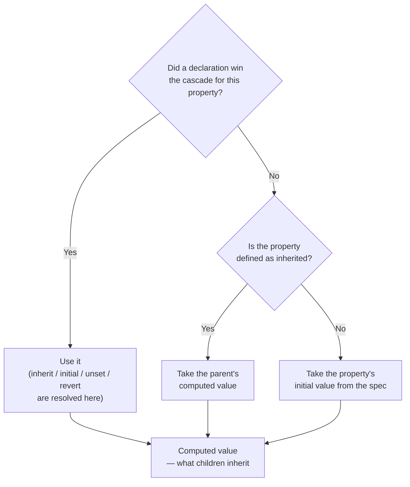

# Inheritance & Initial Values

> Every property on every element always has a value; the cascade only decides where it came from — a matching rule, the parent, or the property's own default.

**Part:** [01 · Core Languages](../) · **Domain:** CSS & Visual Systems · **Priority:** Critical · **Difficulty:** Foundational · **Reading time:** ~11 min

## TL;DR

When no declaration wins for a property on an element, CSS falls back in a fixed way: **inherited properties** (mostly typography — `color`, `font-*`, `line-height`, `visibility`, `direction`) take the parent's computed value; **non-inherited properties** (layout and box properties — `display`, `margin`, `border`, `background`, `position`) take their **initial value** from the specification. Four global keywords let you invoke that machinery explicitly: `inherit` (take the parent's value), `initial` (the spec default, which is often *not* what the browser shows), `unset` (inherit if inherited, else initial), and `revert` (roll back to the previous origin, usually the user-agent stylesheet). `revert-layer` does the same one cascade layer at a time.

> **Recommendation:** Use `inherit` to opt individual properties into the parent's value, and `revert` — not `initial` — when you want an element to look like the browser's default again.

## At a Glance

| | |
| --- | --- |
| **Use when** | Designing themes, resets, and component defaults; debugging "where did this value come from?" |
| **Avoid when** | Using `all: initial` or `all: unset` as a component reset — it strips accessibility-relevant defaults too. |
| **Alternatives** | [Custom properties for theming](#alternative-approaches), [cascade layers for reset ordering](#alternative-approaches), scoped styles. |
| **Primary risk** | Confusing `initial` (spec default) with `revert` (browser default) — `display: initial` makes a `<div>` inline. |
| **Maturity** | Stable — inheritance since CSS1; `unset`/`initial` widely supported since 2015, `revert-layer` since 2022. |

## Prerequisites

Inheritance is the step the cascade falls through to, so the cascade's ordering comes first.

- [Specificity](./specificity.md) — how a winning declaration is chosen before inheritance is considered at all.

## Overview

CSS resolves a value for **every property on every element**, whether or not any rule mentions it. The resolution runs in stages: the cascade picks a *declared* value if one exists; if none does, the property falls back to **inheritance** or its **initial value** depending on whether the property is defined as inherited. The result is the **computed value**, which is what children inherit and what `getComputedStyle` reports.

Whether a property inherits is fixed by the specification, not chosen by the author. The rough rule is that properties describing *text* inherit — `color`, `font-family`, `font-size`, `font-weight`, `line-height`, `letter-spacing`, `text-align`, `white-space`, `visibility`, `cursor`, `direction`, and custom properties — while properties describing *boxes* do not: `display`, `width`, `margin`, `padding`, `border`, `background`, `position`, `overflow`, `float`. MDN's page for each property states it explicitly, and that is the authoritative answer.

The distinction that trips people is **initial value versus browser default**. The initial value of `display` is `inline`; a `<div>` looks like a block because the *user-agent stylesheet* sets `display: block`, not because that is the property's initial value. So `display: initial` on a `<div>` makes it inline — almost never what was intended. `display: revert` restores the user-agent value, which is what "make it a normal div again" actually means.

## The Problem

Two failure shapes recur, and both come from the same misunderstanding.

The first is a reset that erases too much. `all: unset` on a component root looks like a clean slate, and it is — it also removes `display`, so a `<button>` stops being a button box, loses its focus ring, and drops the type-in-a-form behaviors the user-agent stylesheet provided.

```css
/* Looks like isolation. Removes the browser's accessibility defaults with it. */
.card * {
  all: unset;
}
```

Buttons lose their default cursor and focus appearance, `<ul>` loses its list semantics visually, and `<input>` becomes unrecognizable — which affects users relying on visual affordances long before it affects the design.

The second is fighting inheritance one selector at a time. A `color` set on `body` reaches everything, so a component that must not inherit it gets `color: #111` written explicitly; then a dark theme arrives and every one of those hardcoded values must be found. The property was already the right mechanism — the value was the wrong one to hardcode.

The third is inherited values that are *not* what they look like. `line-height: 1.5` and `line-height: 150%` behave differently in children: the unitless number inherits the *ratio* and is recomputed per element, while the percentage inherits the *computed pixel value* from the parent, so a child with a smaller font keeps the parent's line box.

```css
/* Nested small text overflows its lines, and nobody can see why. */
body { font-size: 16px; line-height: 150%; }  /* children inherit 24px, not 150% */
.caption { font-size: 11px; }                  /* still 24px line-height */
```

## Why It Matters

Inheritance is the mechanism that makes theming cheap. Setting `color` and `font-family` once at the root and letting them flow is what keeps a design system from needing a rule per component — and knowing which properties inherit tells you which ones can be set at the root at all. A team that does not know `background` is not inherited writes it on every surface and then wonders why a theme switch misses half the page.

The `initial` versus `revert` distinction has direct correctness consequences. `all: initial` and `all: unset` remove user-agent styling that carries real behavior signals: focus rings, list markers, form control appearance, and the block/inline distinction. Those defaults are the accessibility baseline the browser provides for free, and replacing them is a deliberate cost, not a side effect to absorb by accident.

And the computed-value pipeline is what makes a debugging session finite. When a value appears "from nowhere," the answer is always one of three: a rule matched somewhere you did not look, the parent's computed value flowed in, or the property fell to its initial value. Checking them in that order is faster than reading the stylesheet.

## Mental Model

For each property on each element, picture a **funnel with one output**.



Four things to hold onto.

**Inheritance passes computed values, not declarations.** A parent with `font-size: 2em` computes to a pixel value; the child inherits that number, not the `2em` expression. This is why percentage-based `line-height` and `font-size` behave the way they do.

**The four global keywords work on any property.** `inherit` forces the parent's value even for non-inherited properties (`border: inherit` is legal and occasionally useful). `initial` is the spec's default. `unset` is `inherit` for inherited properties and `initial` for the rest. `revert` rolls back to the value from the previous cascade origin — for author CSS, that is the user-agent stylesheet.

**`revert-layer` is the layered version.** Inside a cascade layer, it rolls back to whatever the previous layer (or origin) established, which makes it the tool for "undo my layer's opinion here."

**Custom properties always inherit.** That is what makes them a theming mechanism: `--surface-color` set on `:root` reaches every descendant, and re-declaring it on a subtree re-themes only that subtree.

## Best Practices

**Set inheritable typography once, high up.** `color`, `font-family`, `line-height`, and `letter-spacing` belong on `:root` or `body`, not repeated per component.

**Use `revert`, not `initial`, to restore browser behavior.** `initial` means the spec default, which for `display` is `inline` — rarely the intent.

**Prefer unitless `line-height`.** It inherits as a ratio and recomputes per element, so nested text at a different size gets a proportional line box.

**Reset deliberately, property by property, on the element you own.** `button { font: inherit; color: inherit; background: none; border: none; }` states exactly what changed; `all: unset` states nothing and removes the focus ring.

**Reach for custom properties when the variation is a value.** A themable border color is `border-color: var(--border)`, not a rule that has to win a specificity contest.

**Use `:where()` for defaults you expect to be overridden.** It contributes zero specificity, so a component's baseline styles never fight the page that consumes them.

**Check whether a property inherits before writing a rule for it.** MDN's per-property "Inherited: yes/no" line answers it in seconds and often removes the rule entirely.

## Trade-offs

Inheritance makes global styling cheap and local isolation harder.

**Advantages**

- One declaration reaches an entire subtree, which is what makes theming and dark mode feasible without touching components.
- Values recompute per element for unitless and keyword values, so nested content scales correctly.
- The global keywords give precise, per-property control without new selectors or specificity escalation.

**Disadvantages**

- Inherited values cross component boundaries, so a component cannot fully predict its own typography.
- `initial` values are specification defaults that frequently differ from what the browser displays, which surprises people at exactly the wrong moment.
- Blanket resets (`all: unset`) remove accessibility-relevant user-agent defaults along with the unwanted ones.

| Keyword | Resolves to | Typical use | Trap |
| --- | --- | --- | --- |
| `inherit` | Parent's computed value | Opting a non-inherited property into the parent's value | Inherits from the *parent*, not the nearest styled ancestor |
| `initial` | Spec default | Truly resetting one property to its defined default | `display: initial` is `inline`, not `block` |
| `unset` | Inherit or initial per property | Neutralizing a single property generically | Same `display` trap when used via `all` |
| `revert` | Previous origin (usually user-agent) | Restoring browser defaults | Reverts to user-agent, not to your reset layer |
| `revert-layer` | Previous cascade layer | Undoing one layer's opinion | Meaningless outside `@layer` |

## Alternative Approaches

| Approach | Best when | Weakness | See |
| --- | --- | --- | --- |
| Inheritance from the root | Typography and color that should be global | Crosses component boundaries by design | (this article) |
| Custom properties | The variation is a value that changes per theme or subtree | Values only; cannot restructure layout | [Custom Properties](./custom-properties.md) |
| Cascade layers | Reset, base, components, and utilities need a fixed precedence | Layer order is global configuration | [Cascade Layers (@layer)](./cascade-layers-layer.md) |
| Scoped styles (`@scope`, CSS Modules, Shadow DOM) | A component must be isolated from page styles | Inherited properties still cross a shadow boundary | Styling Strategies · Design Systems (planned) |
| Explicit per-property reset | A single element needs browser defaults removed | More verbose than `all: unset` — deliberately | (this article) |

## Bad Example

A component that resets with a hammer and hardcodes what it should inherit.

```css
/* ❌ Strips user-agent defaults, including the ones that carry meaning. */
.widget * {
  all: unset;
}

/* ❌ `initial` used as "make it normal again". */
.widget .panel {
  display: initial;        /* now inline — the layout silently collapses */
  color: initial;          /* CanvasText, not the theme's text color */
}

/* ❌ Percentage line-height: children inherit the computed pixel value. */
.widget {
  font-size: 16px;
  line-height: 150%;
}
.widget .caption {
  font-size: 11px;         /* still has a 24px line box */
}

/* ❌ Hardcoded values that inheritance was already handling. */
.widget h2,
.widget p,
.widget li,
.widget td {
  color: #111827;
  font-family: 'Inter', sans-serif;
}

/* ❌ Buttons rebuilt from nothing, focus ring included. */
.widget button {
  all: unset;
  padding: 8px 16px;
  background: #2563eb;
  color: white;
}
```

**What goes wrong:** `all: unset` on every descendant removes `display`, so block elements become inline and the widget's layout depends on whatever the author re-adds; it also removes the focus indicator, the list markers, and the form control appearance that the user-agent stylesheet supplied — a keyboard user can no longer see where they are. `display: initial` restores `inline`, not `block`, so the panel that was meant to look "normal" now sits in the text flow. `color: initial` resolves to `CanvasText`, ignoring the theme entirely. The percentage `line-height` computes to `24px` on `.widget` and children inherit that number, so 11px captions keep a 24px line box and the vertical rhythm is wrong in a way that inspecting `.caption` does not reveal. The four hardcoded typography rules re-declare values that would have arrived by inheritance, so a theme change now has four extra places to miss. And the button is rebuilt from `all: unset` with no `:focus-visible` style, which is the single most common way a design system ships an unusable keyboard experience.

## Good Example

The same component leaning on inheritance and reverting deliberately.

```css
/* ✅ Inheritable typography declared once, as values that a theme can change. */
:root {
  --text-color: #111827;
  --text-color-muted: #6b7280;
  --font-sans: 'Inter', system-ui, sans-serif;
}

body {
  color: var(--text-color);
  font-family: var(--font-sans);
  line-height: 1.5;          /* ✅ unitless: children recompute their own line box */
}

/* ✅ The widget inherits everything above and states only what differs. */
.widget {
  display: grid;
  gap: 1rem;
}

.widget .caption {
  font-size: 0.6875rem;      /* line box scales with it, because 1.5 is a ratio */
  color: var(--text-color-muted);
}
```

```css
/* ✅ A targeted reset on the elements this component owns, property by property. */
.widget button {
  font: inherit;             /* takes the page's family, size, weight, line-height */
  color: inherit;
  background: none;
  border: none;
  padding: 0.5rem 1rem;
  cursor: pointer;
}

/* ✅ The focus indicator is kept, not removed and forgotten. */
.widget button:focus-visible {
  outline: 2px solid var(--focus-ring, Highlight);
  outline-offset: 2px;
}

/* ✅ `revert` restores the browser's own styling — the actual "make it normal" tool. */
.prose :where(ul, ol) {
  list-style: revert;
  padding-inline-start: revert;
}

/* ✅ Inside layers, undo just this layer's opinion. */
@layer components {
  .widget .panel {
    all: revert-layer;       /* falls back to whatever `base` established */
  }
}

/* ✅ Non-inherited properties can be opted in explicitly where it helps. */
.widget .divider {
  border-color: inherit;     /* follows the parent's currentColor-driven border */
}
```

**Why it's better:** Typography is declared once on `body` as custom properties, so every descendant inherits it and a theme switch is a change to two variables rather than to every component rule. The unitless `line-height: 1.5` inherits as a ratio, so the 11px caption gets a proportional line box automatically — the bug the percentage version could not express. The button reset names the four properties it actually wants to change and keeps everything else the browser provided, and `:focus-visible` restores an explicit indicator so keyboard users are never worse off than with the default. `list-style: revert` restores the user-agent value rather than the spec initial, which is what "let lists look like lists again" means. `revert-layer` inside `@layer components` undoes only that layer's declarations, so the panel falls back to the base layer instead of to the browser. And `border-color: inherit` shows the deliberate use of the keyword on a non-inherited property, where the intent is explicit and local rather than a blanket reset.

## Common Mistakes

See the [CSS & Visual Systems anti-patterns](../../../anti-patterns/) for the domain catalog. Concept-specific:

### Mistake: Using `all: unset` or `all: initial` as a component reset

- **Symptom:** Buttons without focus rings, block elements rendering inline, form controls that no longer look interactive.
- **Why it fails:** These keywords apply to every property, including `display` and the user-agent styles that communicate affordance and state. The reset removes the browser's accessibility baseline along with the styling nobody wanted.
- **Fix:** Reset the specific properties you intend to change (`font`, `color`, `background`, `border`, `padding`), and add an explicit `:focus-visible` style whenever you touch outline or appearance.

### Mistake: Reaching for `initial` when you mean the browser default

- **Symptom:** `display: initial` collapses a layout; `color: initial` ignores the theme; `font-size: initial` produces `medium`.
- **Why it fails:** `initial` is the value the specification defines for the property, not the value the browser's own stylesheet applies. For `display` those differ for nearly every element that matters.
- **Fix:** Use `revert` to return to the user-agent value, or state the value you want explicitly.

### Mistake: Percentage or unit-bearing `line-height`

- **Symptom:** Small nested text — captions, footnotes, badges — has too much leading, and adjusting the child does not help.
- **Why it fails:** A percentage or length computes on the element where it is declared, and children inherit that computed length. Only a unitless number inherits as a ratio and recomputes against each element's own `font-size`.
- **Fix:** Declare `line-height` as a unitless number at the root, and override with a number where a specific ratio is needed.

## Checklist

- [ ] Global typography (`color`, `font-family`, `line-height`) is declared once near the root, not per component.
- [ ] `line-height` is unitless wherever it can inherit.
- [ ] No `all: unset` or `all: initial` on elements users interact with.
- [ ] Any rule that removes an outline or `appearance` adds a `:focus-visible` style.
- [ ] `revert` (not `initial`) is used when the intent is "restore browser defaults."
- [ ] `revert-layer` is used to undo a layer's own declarations inside `@layer`.
- [ ] Themable values are custom properties rather than hardcoded literals in component rules.
- [ ] Before writing a rule, the property's "Inherited: yes/no" was checked.

## Related Articles

- [Specificity](./specificity.md) — how the winning declaration is chosen before this fallback applies.
- [Cascade Layers (@layer)](./cascade-layers-layer.md) — controlling precedence between bodies of CSS, and what `revert-layer` rolls back to.
- [Custom Properties](./custom-properties.md) — inheritance used deliberately as a theming mechanism.
- The Box Model (planned) — what the resolved values do once the cascade is finished.

## References

- [CSS Cascading and Inheritance Level 5 — Inheritance](https://www.w3.org/TR/css-cascade-5/#inheriting) — the normative definition, including the global keywords.
- [MDN — Inheritance](https://developer.mozilla.org/en-US/docs/Web/CSS/CSS_cascade/Inheritance) — which properties inherit and how to control it.
- [MDN — Value processing](https://developer.mozilla.org/en-US/docs/Web/CSS/CSS_cascade/Value_processing) — declared, cascaded, computed, used, and actual values.
- [MDN — `revert-layer`](https://developer.mozilla.org/en-US/docs/Web/CSS/revert-layer) — rolling back one cascade layer at a time.
