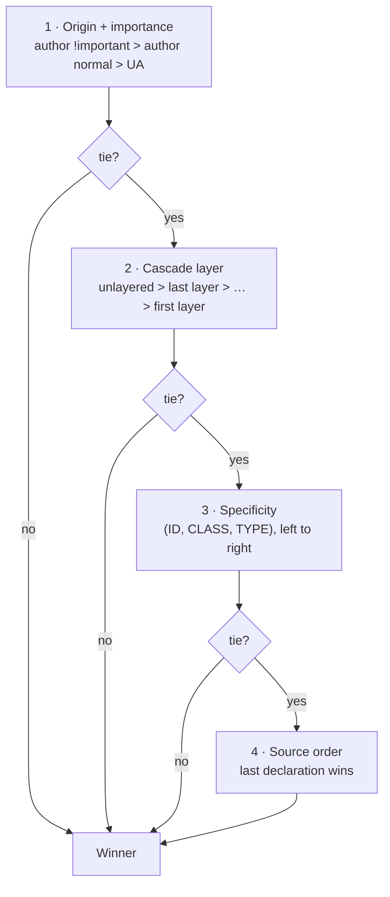

# Specificity

> When two CSS rules set the same property on the same element, *specificity* decides which one wins — and a codebase where the answer is always "add another selector" has stopped designing and started escalating.

**Part:** [01 · Core Languages](../) · **Domain:** CSS & Visual Systems · **Priority:** Critical · **Difficulty:** Foundational · **Reading time:** ~8 min

## TL;DR

**Specificity** is a three-part score — `(ID, CLASS, TYPE)` — computed per selector and compared left to right, used by the cascade as a tiebreaker *after* origin and cascade layer, and *before* source order. IDs beat any number of classes; classes beat any number of element selectors; the universal selector and combinators count for nothing. `!important` isn't a specificity value at all — it moves the declaration into a different, higher-priority origin bucket, which is why it can't be outranked by ordinary selectors. Inline styles sit above all author selectors. The practical goal is **flat, predictable specificity**: keep almost everything at one class, use `:where()` (specificity zero) for defaults, and reach for `@layer` when you need to control precedence between whole bodies of CSS rather than between individual rules.

> **Recommendation:** Author at `(0,1,0)` — a single class — by default. When you need to override, change the layer or the selector's meaning, never add weight for its own sake.

## At a Glance

| | |
| --- | --- |
| **Use when** | Any time two rules could target the same element: component libraries, design systems, theming, third-party overrides. |
| **Avoid when** | You're using it as an override mechanism — that's what cascade layers and better selector design are for. |
| **Alternatives** | [Cascade layers](#alternative-approaches), [`:where()`](#alternative-approaches), scoped/atomic CSS, custom properties. |
| **Primary risk** | A specificity arms race: each override raises the bar, until `!important` is the only tool left. |
| **Maturity** | Stable — the algorithm is unchanged since CSS2; `@layer` and `:where()` (2022) are the modern escape hatches. |

## Prerequisites

Style resolution is main-thread work, and understanding where it sits in the rendering pipeline explains why selector design has a performance dimension as well as a correctness one.

- [Process & Thread Architecture](../../00-foundations/web-platform/process-and-thread-architecture.md) (`· The Web Platform`) — style calculation runs on the main thread, on every invalidation.

## Overview

The **cascade** decides, for each element and each property, which declared value wins. It applies a fixed sequence of criteria, and specificity is only one step in it:

1. **Origin and importance** — user-agent, user, and author stylesheets, with `!important` declarations reversing the normal order within that comparison.
2. **Cascade layers** (`@layer`) — later-declared layers beat earlier ones; unlayered author styles beat all author layers.
3. **Specificity** — the three-part score, compared component by component.
4. **Source order** — the last matching declaration wins.

**Specificity** itself is a tuple `(A, B, C)`:

- **A** — the number of ID selectors (`#header`).
- **B** — the number of class selectors (`.card`), attribute selectors (`[data-open]`), and pseudo-classes (`:hover`, `:nth-child()`).
- **C** — the number of type selectors (`div`, `input`) and pseudo-elements (`::before`).

Comparison is lexicographic: `(1,0,0)` beats `(0,99,0)`. Combinators (a space, `>`, `+`, `~`) and the universal selector `*` add nothing. Three functional pseudo-classes bend the rules deliberately: `:is()` and `:not()` take the specificity of their *most specific* argument, `:has()` does the same, and **`:where()` always contributes zero** — which makes it the tool for shipping low-specificity defaults that any consumer can override.

The distinction most often confused: `!important` is *not* "very high specificity". It moves the declaration into a separate importance bucket that is compared before specificity ever runs, which is why nothing you add to a normal selector can beat it, and why the only counter to an `!important` is another `!important` of higher origin, layer, or specificity.

## The Problem

Specificity failures don't announce themselves. A component ships with `.button { background: blue }`. Someone needs a variant, and instead of a modifier class writes `.sidebar .button { background: green }`. Now the button's appearance depends on where it sits in the DOM, which is invisible from the component's own file. The next engineer needs a third case, finds their `.button--danger` mysteriously ignored, and fixes it with `.sidebar .button.button--danger`. Two escalations later, `!important` appears, and from then on that property can never be overridden by ordinary means — including by the theming system that ships six months later.

The compounding version is a design system consumed by application code. If the library authors at `(0,2,0)`, consumers must author at `(0,3,0)` to override, and any *second* consumer layer needs `(0,4,0)`. Specificity becomes an API surface nobody documented, and every consumer discovers it by trial and error in the browser inspector.

There is a performance edge too. Long descendant selectors are matched right-to-left by the engine, so `.sidebar .panel .list .item a` starts from every `a` and walks ancestors. On a large document with frequent class changes, that is real style-recalculation cost on the main thread — usually second-order compared to the maintainability cost, but not zero.

## Why It Matters

Specificity is what determines whether CSS is *composable*. A component whose styles can be overridden by a single class is reusable; one that requires guessing a selector shape is not. Every design system, theming layer, dark mode implementation, and white-label build depends on a predictable override story — and that story is entirely a specificity and layering decision made early, usually by accident.

It also determines how safely a codebase can be changed. Flat specificity means a rule's effect is local: you can read one selector and know what it does. Escalated specificity means effects are contextual, so deleting a seemingly-dead rule can change three pages, and moving a component into a different container can change its appearance. That is the difference between CSS you can refactor and CSS you can only add to — which is why stylesheets in specificity-escalated codebases grow monotonically and never shrink.

## Mental Model

Read the cascade as a series of gates. Specificity is the third gate, and it only runs if the earlier ones tie.



For the specificity gate itself, count in three buckets and never carry:

| Selector | A (ID) | B (class/attr/pseudo-class) | C (type/pseudo-element) | Score |
| --- | --- | --- | --- | --- |
| `a` | 0 | 0 | 1 | `(0,0,1)` |
| `.link` | 0 | 1 | 0 | `(0,1,0)` |
| `a.link:hover` | 0 | 2 | 1 | `(0,2,1)` |
| `#nav .link` | 1 | 1 | 0 | `(1,1,0)` |
| `:where(.theme-dark) .link` | 0 | 1 | 0 | `(0,1,0)` |
| `:is(#nav, .sidebar) .link` | 1 | 1 | 0 | `(1,1,0)` |
| `[data-state="open"]` | 0 | 1 | 0 | `(0,1,0)` |
| `* > div` | 0 | 0 | 1 | `(0,0,1)` |

Two readings worth internalizing. `:is()` takes its *most specific* argument, so `:is(#nav, .sidebar)` costs an ID even when it matched the class — a common surprise. `:where()` takes zero no matter what is inside it, which is exactly why it's the right wrapper for theme scopes, resets, and library defaults.

## Best Practices

**Author at one class.** `(0,1,0)` for essentially everything. A component's own styles, its modifiers, and its states all fit at that level with `.card`, `.card--compact`, `.card[data-loading]`.

**Express state as an attribute or class on the element itself**, not as an ancestor selector. `.card[data-loading]` is `(0,2,0)` and self-contained; `.page-loading .card` is `(0,2,0)` too but couples the component to an ancestor it doesn't own.

**Wrap scoping conditions in `:where()`.** `:where(.theme-dark) .button` lets a theme apply without raising the bar for anyone overriding `.button` later. This is the single highest-leverage habit for library authors.

**Use `@layer` for precedence between bodies of CSS.** Reset, then base, then components, then utilities, then overrides — declared in that order once, at the top of your entry stylesheet. Layer order beats specificity, so a `(0,1,0)` utility in a later layer defeats a `(0,3,0)` component rule without any escalation.

**Never use IDs for styling.** They're `(1,0,0)`, unbeatable by any realistic number of classes, and provide no benefit over a class. Keep IDs for fragment links, `for`/`id` label association, and `aria-*` references.

**Treat `!important` as reserved.** Legitimate uses are narrow: utility classes that must win by contract (and even then, a layer is usually better), and overriding third-party CSS you cannot edit. Anywhere else it is a signal that the architecture needs fixing, not the rule.

## Trade-offs

Specificity gives you a deterministic, dependency-free conflict resolution mechanism. The cost is that it is *global and implicit* — nothing in a file tells you what else might outrank it.

**Advantages**

- Fully deterministic: the same document and stylesheets always resolve identically, with no build step or runtime.
- Lets targeted rules override general ones without any explicit ordering, which is what makes progressive refinement of styles possible.
- Cheap to compute, so the browser can resolve thousands of rules per element without measurable cost.

**Disadvantages**

- The score is invisible in the source; you can't tell whether a rule will win by reading it alone.
- Escalation is one-directional — once a codebase reaches `(0,3,0)`, coming back down requires touching every override.
- `!important` bypasses the mechanism entirely, so a single misuse can make a property permanently unoverridable in practice.

| Dimension | Specificity | Cost / caveat |
| --- | --- | --- |
| Determinism | Total ordering, no ambiguity | Ordering is implicit, not visible in any one file |
| Composability | Targeted rules refine general ones | Only if specificity stays flat across the codebase |
| Override story | Works without coordination | Becomes an undocumented API contract between layers |
| Performance | Negligible to compute | Long descendant selectors cost real style-recalc time |
| Escape hatch | `!important` always wins | Removes the property from the cascade for everyone downstream |

## Alternative Approaches

The alternatives don't replace specificity — they let you stop *using* it as your precedence mechanism.

| Approach | Best when | Weakness | See |
| --- | --- | --- | --- |
| Flat specificity by convention | Any codebase; the baseline discipline | Requires review to enforce; nothing prevents escalation | (this article) |
| [Cascade layers (`@layer`)](./) (planned) | You need precedence between whole bodies of CSS (reset vs components vs utilities) | Layer order is global config; must be declared once, up front | `Cascade Layers (@layer) · CSS & Visual Systems` |
| `:where()` for defaults | Library and design-system authors shipping overridable styles | Zero specificity means source order becomes the only tiebreaker among peers | (this article) |
| Scoped CSS (CSS Modules, Shadow DOM, `@scope`) | Component isolation matters more than cross-cutting themes | Theming across the boundary needs custom properties | `Styling Strategies · Design Systems` (planned) |
| [Custom properties](./) (planned) | The variation is a *value*, not a rule (color, spacing, radius) | Only works for values; can't restructure layout | `Custom Properties · CSS & Visual Systems` |

The strongest combination in practice: **layers for precedence, one class for specificity, custom properties for variation.** Specificity stops being a lever you pull at all.

## Bad Example

A component whose override story is "add more selectors", ending where they all end.

```css
/* ❌ Component base — already coupled to an ancestor. */
.sidebar .card {                      /* (0,2,0) */
  padding: 16px;
  background: #fff;
  border-radius: 8px;
}

/* Modifier can't win — same specificity, but it's declared earlier in the bundle. */
.card--compact {                      /* (0,1,0) — loses to (0,2,0) */
  padding: 8px;
}

/* Escalation round 1: match the ancestor too. */
.sidebar .card.card--compact {        /* (0,3,0) */
  padding: 8px;
}

/* Escalation round 2: the theme needs to win over that. */
#app .theme-dark .sidebar .card {     /* (1,3,0) — now nothing reasonable beats it */
  background: #1b1b1f;
}

/* Escalation round 3: the utility class gives up and reaches for the hammer. */
.u-p-0 {
  padding: 0 !important;              /* permanently unoverridable for every consumer */
}
```

```html
<!-- The component's appearance now depends on where it is, not what it is. -->
<div class="sidebar"><div class="card card--compact">…</div></div>
<div class="main"><div class="card card--compact">…</div></div> <!-- unstyled -->
```

**What goes wrong:** The base rule bakes an ancestor into the component's identity, so the same markup renders differently in `.main` — a bug that only appears when someone reuses the component. Each override then has to out-specify the last, and the ID in the theme rule sets a `(1,x,x)` floor that no class-based override can ever cross. The `!important` utility is the terminal state: it wins everywhere, including in the cases where a consumer legitimately needs padding, and the only escalation left is another `!important`. Every one of these rules is individually reasonable; the architecture is what failed.

## Good Example

The same requirements, resolved with layers and flat specificity instead of weight.

```css
/* ✅ Declare precedence once, explicitly. Layer order beats specificity. */
@layer reset, base, components, utilities;

@layer components {
  /* Component owns itself: no ancestor in the selector. (0,1,0) */
  .card {
    padding: var(--card-padding, 16px);
    background: var(--card-bg, #fff);
    border-radius: 8px;
  }

  /* Modifier at the same level; source order decides, and it's declared after. */
  .card--compact {                    /* (0,1,0) */
    --card-padding: 8px;
  }

  /* State lives on the element, not on an ancestor. (0,2,0) */
  .card[data-loading] {
    opacity: 0.6;
    pointer-events: none;
  }
}

@layer base {
  /* Theming via :where() contributes ZERO specificity, so it never raises the bar. */
  :where(.theme-dark) {
    --card-bg: #1b1b1f;
  }
}

@layer utilities {
  /* A utility in a later layer beats ANY component rule — no !important needed. */
  .u-p-0 { padding: 0; }              /* (0,1,0), and it still wins */
}
```

```html
<!-- Appearance depends on the element's own classes, wherever it sits. -->
<div class="sidebar"><div class="card card--compact">…</div></div>
<div class="main"><div class="card card--compact u-p-0">…</div></div>
```

**Why it's better:** Precedence is declared once, in one line, and is readable — you no longer reconstruct it by counting selectors across files. Every rule stays at one or two classes, so any of them can be overridden by any other at the same level plus later source order, and nothing escalates. The component has no ancestor in its selector, so it renders identically wherever it's placed. Theming moves from a *rule* override to a *value* override through a custom property, with `:where()` keeping the theme scope at specificity zero — a consumer overriding `--card-bg` on the element wins trivially. And the utility beats components because of its layer, not because of `!important`, so a consumer who needs to override *it* still can.

## Common Mistakes

See the [CSS anti-patterns](../../../anti-patterns/) for the domain catalog. Concept-specific:

### Mistake: Using `!important` to win an override

- **Symptom:** A rule doesn't apply, so `!important` is appended and the ticket closes.
- **Why it fails:** `!important` moves the declaration into a higher-priority origin, outside the specificity comparison entirely. Nothing in normal author CSS can beat it, so every future override — including the theming layer and the consumer's own styles — must also use `!important`, and the cascade stops being a useful mechanism for that property.
- **Fix:** Find why the intended rule loses. Usually the answer is an ancestor selector that shouldn't be there, or missing cascade layers. Fix the precedence model, not the individual rule.

### Mistake: Styling with ID selectors

- **Symptom:** `#header nav a { … }` in a stylesheet; later attempts to restyle that link with classes have no effect.
- **Why it fails:** One ID is `(1,0,0)`, which beats any number of classes. It sets a floor that every subsequent override must match, and IDs are unique so the rule can never be reused anyway.
- **Fix:** Use a class for styling and keep the ID for fragment navigation, label association, and ARIA references. If you must target existing ID-based markup, `:where(#header)` gives you the match at specificity zero.

### Mistake: Assuming `:is()` and `:not()` are specificity-neutral

- **Symptom:** Refactoring `.a .x, .b .x` into `:is(.a, #b) .x` unexpectedly makes the rule unbeatable.
- **Why it fails:** `:is()`, `:not()`, and `:has()` all inherit the specificity of their *most specific* argument, regardless of which branch actually matched. A single ID inside the list applies to every match.
- **Fix:** Use `:where()` when you want the grouping without the weight, and keep IDs out of `:is()` argument lists.

## Checklist

- [ ] No ID selectors are used for styling.
- [ ] No `!important` outside a documented, narrow escape hatch for third-party CSS.
- [ ] Component rules contain no ancestor selectors — a component's appearance depends only on its own classes and attributes.
- [ ] Cascade layers are declared once, in order, at the top of the entry stylesheet.
- [ ] Library and theme scopes are wrapped in `:where()` so they contribute zero specificity.
- [ ] State is expressed as an attribute or class on the element, not on an ancestor.
- [ ] Variation that is purely a value uses a custom property rather than a new rule.
- [ ] No `:is()`/`:not()`/`:has()` argument list contains an ID.

## Related Articles

- [Inheritance & Initial Values](./) (planned) — what happens when *no* rule matches, and how inherited values interact with the cascade.
- [Cascade Layers (@layer)](./) (planned) — the modern way to control precedence between bodies of CSS.
- [Custom Properties](./) (planned) — moving variation from rules to values, which sidesteps specificity entirely.
- The Box Model (planned) and Formatting Contexts (planned) — what the winning declarations actually do once resolved.
- **Canonical home:** the cost of style recalculation on the main thread is owned by [Process & Thread Architecture · The Web Platform](../../00-foundations/web-platform/process-and-thread-architecture.md).

## References

- [W3C — CSS Cascading and Inheritance Level 5](https://www.w3.org/TR/css-cascade-5/) — the normative cascade order, including layers and importance.
- [MDN — Specificity](https://developer.mozilla.org/en-US/docs/Web/CSS/CSS_cascade/Specificity) — the calculation in detail, with the `:is()`/`:where()` rules.
- [MDN — Cascade layers](https://developer.mozilla.org/en-US/docs/Web/CSS/@layer) — practical guidance on ordering whole bodies of CSS.
