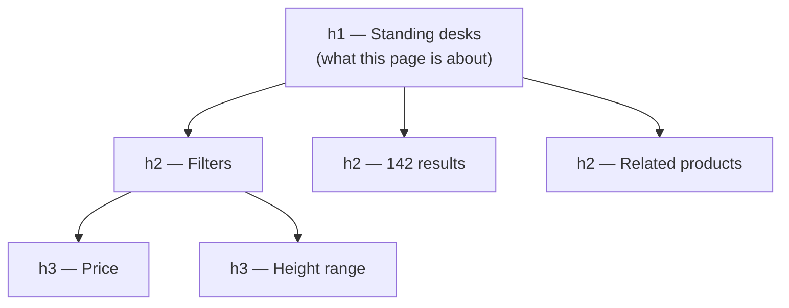

# Headings Hierarchy

> A heading level is a structural claim about what contains what — so it is chosen from the document's shape, never from how large the text should look.

**Part:** [01 · Core Languages](../) · **Domain:** HTML & Document Semantics · **Priority:** Critical · **Difficulty:** Foundational · **Reading time:** ~8 min

## TL;DR

Headings form the outline assistive technology uses to navigate, and the rules are short: **one `<h1>` per page** naming what the page is about, **levels descend by one** as content nests, and a level is **never chosen for its font size**. Because the HTML outline algorithm was never implemented, `<section>` nesting does **not** adjust heading levels — an `<h1>` inside a nested `<section>` is still a level 1. Components that can appear at different depths should therefore take their level as a prop (or read it from context) rather than hardcoding one, and CSS should be applied by class so appearance and level can vary independently.

> **Recommendation:** Write the heading tree first as a document outline, style it with classes afterwards, and give reusable components a `level` prop with a sensible default.

## At a Glance

| | |
| --- | --- |
| **Use when** | Any content with sections — which is every page. Headings are the primary screen reader navigation method. |
| **Avoid when** | The text is a label or a caption, not a section title; use `<label>`, `<caption>`, or `<figcaption>`. |
| **Alternatives** | [`aria-level` on `role="heading"`](#alternative-approaches), [visually hidden headings](#alternative-approaches), landmarks. |
| **Primary risk** | Levels chosen for visual weight, producing an outline that contradicts the visible structure. |
| **Maturity** | Stable — `<h1>`–`<h6>` since HTML 2.0; the outline algorithm was removed from the spec, never implemented. |

## Prerequisites

Heading levels only make sense against the document structure they describe.

- [The Document Outline](./the-document-outline.md) — what the outline is, and why the algorithm that was supposed to compute it does not exist.

## Overview

A **heading** marks the start of a section and declares its depth. `<h1>` through `<h6>` are the entire vocabulary; the number is the depth, not a size. Together the headings on a page form a tree, and screen readers expose that tree directly: users list headings, jump between them, and move by level to skim a page the way a sighted user skims by scanning.

The critical fact is that **heading levels are absolute, not relative to their container**. The HTML5 outline algorithm was supposed to make `<h1>` inside `<section>` behave as a level 2, but no browser or assistive technology ever implemented it, and it has since been removed from the specification. A nested `<h1>` is a level 1, full stop.

The boundary against `<section>` matters here: landmarks tell a user *which region* they are in, headings tell them *where in the content* they are. Both are navigation aids, they answer different questions, and neither substitutes for the other. A page can have perfect landmarks and still be unnavigable if every heading is an `<h3>` chosen because the design called for 18-pixel text.

## The Problem

Heading levels get chosen by appearance, because in most designs the appearance is the visible thing and the outline is not.

```html
<!-- The design has a small section title, so someone reached for h4. -->
<h1>Acme</h1>              <!-- the logo, not the page subject -->
<h4>Standing desks</h4>    <!-- the actual page subject -->
<h2>Filters</h2>
<h5>Price</h5>             <!-- looks right, skips a level -->
<h3>142 results</h3>
```

The rendered page looks correct. The outline a screen reader announces is "Acme, level 1 → Standing desks, level 4 → Filters, level 2 → Price, level 5 → 142 results, level 3," which describes a document that does not exist. A user navigating by level cannot tell which sections contain which.

The second problem is the reusable component. A `<Card>` that renders `<h3>` internally is correct on the page it was built for and wrong on the page where cards sit directly under the `<h1>`, or inside a section that is already at level 3. Because the component owns the markup, the consuming page cannot fix it without a fork.

The third is missing headings entirely. A results grid with no heading, a sidebar with no heading, and a footer with no heading leave large parts of the page unreachable by heading navigation — the content exists but has no entry in the outline.

## Why It Matters

Heading navigation is the most-used screen reader orientation strategy — WebAIM's surveys have repeatedly found that most respondents navigate by headings first when they land on an unfamiliar page. An outline that contradicts the visible structure is therefore not a minor inaccuracy; it is the primary navigation surface being wrong.

It also has direct WCAG consequences. Section 1.3.1 (Info and Relationships) requires that structure conveyed visually is available programmatically, so headings that look like a hierarchy but do not encode one fail it. Section 2.4.6 (Headings and Labels) requires headings to describe their topic, which rules out decorative headings and generic ones like "More."

There is a practical dividend beyond accessibility: a correct outline is a readable table of contents, which documentation tooling, search engines, and in-page navigation generators all consume for free. Getting it right once produces a structure several systems can use.

## Mental Model

Read the page as **an outline you could write down**, then map each entry to a level.



Four rules cover nearly every case.

**One `<h1>`, naming the page's subject.** Not the site name — the site name belongs in the logo link and the `<title>`. On a product page the `<h1>` is the product; on a search page it is the search subject.

**Descend by one, ascend by any amount.** Going from `<h2>` to `<h4>` is a skip and breaks level navigation; going from `<h4>` back to `<h2>` is normal, because the new section is simply shallower.

**Level comes from nesting, appearance comes from a class.** `<h2 class="text-sm">` is entirely legitimate; `<h4>` chosen because it renders at 18 pixels is not.

**Every meaningful region has a heading, even if it is visually hidden.** A visually hidden `<h2>` gives heading navigation an entry point for a region whose title is obvious to sighted users from layout alone.

## Best Practices

**Write the outline before the markup.** If the headings alone do not read as a sensible table of contents, the structure is wrong, not the styling.

**Give reusable components a `level` prop with a default.** `<Card level={3}>` renders `<h3>`; the page that places the card decides.

**Or derive the level from context.** A heading-level provider that increments inside each section lets deeply composed layouts stay correct without threading props by hand.

**Style by class, never by tag alone.** A design system that maps `.title-lg`, `.title-md`, `.title-sm` to sizes lets any level take any size.

**Use a visually hidden heading for regions that need an entry in the outline** but whose purpose is obvious visually — a results list, a filter panel, a footer.

**Do not use a heading as a label.** Form fields take `<label>`, tables take `<caption>`, figures take `<figcaption>`. A heading marks the start of a section of content.

**Check the outline with a tool.** Browser devtools' accessibility pane, a heading-map extension, or a screen reader's heading list shows what users actually get.

## Trade-offs

Heading discipline costs a little markup flexibility and repays it in navigability.

**Advantages**

- Gives assistive technology the navigation method its users reach for first, at no runtime cost.
- Satisfies WCAG 1.3.1 and 2.4.6 directly, with structure that reviewers can read in the markup.
- Produces a reusable table of contents for docs tooling, in-page navigation, and search engines.

**Disadvantages**

- Component reuse requires threading a level, which is friction that hardcoding avoids.
- Design and structure can genuinely conflict — a visually small heading may be structurally important — so styling must be decoupled deliberately.
- Only six levels exist; very deep documents have to flatten, though needing more than four is usually a sign the content should split.

| Dimension | Correct hierarchy | Appearance-driven levels |
| --- | --- | --- |
| Screen reader navigation | Works by level and by list | Misleading or unusable |
| WCAG 1.3.1 / 2.4.6 | Satisfied | Failed |
| Component reuse | Needs a level prop or context | Breaks silently on other pages |
| Styling freedom | Full, via classes | Coupled to structure |

## Alternative Approaches

| Approach | Best when | Weakness | See |
| --- | --- | --- | --- |
| `<h1>`–`<h6>` chosen by structure | Always the default | Requires components to know their depth | (this article) |
| `level` prop on components | A component appears at several depths | Must be passed at every call site | (this article) |
| Heading-level context provider | Deeply composed layouts | Implicit; needs a documented convention and a guard | (this article) |
| `role="heading" aria-level="n"` | Retrofitting markup that cannot use `<h*>` | No default styling or behavior; easy to set a wrong level | [MDN — heading role](https://developer.mozilla.org/en-US/docs/Web/Accessibility/ARIA/Roles/heading_role) |
| Visually hidden heading | A region needs an outline entry but no visible title | Invisible to sighted users, so it can rot unnoticed | (this article) |
| Landmarks | Navigating between page regions | Does not describe content nesting | [Sectioning & Landmarks](./sectioning-and-landmarks.md) |

## Bad Example

A page whose heading levels were chosen from the type scale.

```html
<body>
  <header>
    <!-- ❌ The h1 names the site, not the page. -->
    <h1>Acme</h1>
  </header>

  <main>
    <!-- ❌ The real page subject, demoted because the design shows it small. -->
    <h4>Standing desks</h4>

    <section>
      <!-- ❌ A nested h1: no outline algorithm exists to demote it. -->
      <h1>Filters</h1>
      <!-- ❌ Skips from 1 to 5. -->
      <h5>Price</h5>
      <h5>Height range</h5>
    </section>

    <!-- ❌ No heading at all: the results region has no entry in the outline. -->
    <div class="results">
      <div class="card">
        <!-- ❌ Hardcoded h3 inside a reusable component. -->
        <h3>ErgoDesk Pro</h3>
        <p>$499</p>
      </div>
    </div>

    <!-- ❌ A heading used as a form label. -->
    <h3>Email</h3>
    <input type="email" name="email">
  </main>

  <footer>
    <!-- ❌ Heading level picked to match the small footer type. -->
    <h6>Company</h6>
  </footer>
</body>
```

**What goes wrong:** The `<h1>` names the site rather than the page, so every page in the site announces the same first heading and a user cannot tell where they landed. The actual subject is an `<h4>`, chosen because the design renders it small, which makes the page's most important heading appear to be a fourth-level subsection of nothing. The nested `<h1>` inside `<section>` was written on the assumption that sectioning would demote it — nothing does, so the outline now contains two level-1 headings. The jump from level 1 to level 5 breaks navigation by level entirely. The results region has no heading, so the part of the page users came for cannot be reached by heading navigation at all. The card hardcodes `<h3>`, so it is wrong on any page where cards do not sit under a level 2. And `<h3>Email</h3>` above an input is a heading doing a label's job: clicking it does not focus the field, and the input has no accessible name.

## Good Example

The same page with an outline that matches its structure.

```html
<body>
  <header>
    <!-- ✅ The site name is a link, not the page heading. -->
    <a href="/" aria-label="Acme home">
      
    </a>
  </header>

  <main id="main">
    <!-- ✅ One h1: what this page is about. Size comes from a class. -->
    <h1 class="title-md">Standing desks</h1>

    <section aria-labelledby="filters-heading">
      <h2 id="filters-heading" class="title-sm">Filters</h2>

      <!-- ✅ Descends by one; both subsections are siblings. -->
      <h3 class="title-xs">Price</h3>
      <fieldset>
        <legend>Price range</legend>
        …
      </fieldset>

      <h3 class="title-xs">Height range</h3>
      …
    </section>

    <div class="results">
      <!-- ✅ Visually hidden, but present in the outline. -->
      <h2 class="visually-hidden">Results</h2>

      <article class="card">
        <!-- ✅ Level supplied by the page, styling by class. -->
        <h3 class="title-sm">ErgoDesk Pro</h3>
        <p>$499</p>
      </article>
    </div>

    <!-- ✅ A label is a label. -->
    <label for="email">Email</label>
    <input id="email" type="email" name="email">
  </main>

  <footer>
    <!-- ✅ Level 2 because it is a top-level region; small type via a class. -->
    <h2 class="title-xs">Company</h2>
  </footer>
</body>
```

```tsx
// ✅ A component that takes its level, with a safe default and a clamp.
type HeadingLevel = 1 | 2 | 3 | 4 | 5 | 6;

function Heading({
  level = 2,
  className,
  children,
}: {
  level?: HeadingLevel;
  className?: string;
  children: React.ReactNode;
}) {
  const Tag = `h${level}` as const;
  return <Tag className={className}>{children}</Tag>;
}

// ✅ Or derive it from context, so composition cannot get it wrong.
const LevelContext = React.createContext<HeadingLevel>(1);

function Section({ children }: { children: React.ReactNode }) {
  const level = React.useContext(LevelContext);
  const next = Math.min(level + 1, 6) as HeadingLevel;
  return (
    <LevelContext.Provider value={next}>
      <section>{children}</section>
    </LevelContext.Provider>
  );
}

function SectionHeading({ children, className }: { children: React.ReactNode; className?: string }) {
  const level = React.useContext(LevelContext);
  return <Heading level={level} className={className}>{children}</Heading>;
}

// <Card> now renders <SectionHeading> and is correct at any depth.
```

```css
/* ✅ Appearance is a class, so any level can take any size. */
.title-md { font-size: 1.5rem; font-weight: 600; }
.title-sm { font-size: 1.125rem; font-weight: 600; }
.title-xs { font-size: 0.9375rem; font-weight: 600; }

/* ✅ Hidden visually, still in the accessibility tree and the heading list. */
.visually-hidden {
  position: absolute;
  width: 1px;
  height: 1px;
  margin: -1px;
  padding: 0;
  overflow: hidden;
  clip-path: inset(50%);
  white-space: nowrap;
}
```

**Why it's better:** The `<h1>` names the page, so a user landing from search hears what they opened rather than the company name, and the site logo keeps its own accessible name as a link. Levels descend by one with no skips, so navigating by level moves through the document the way the layout suggests. The visually hidden "Results" heading gives the main content region an entry in the heading list without changing the design — the case where the outline needs something the visual design does not. Sizes come from `.title-*` classes, so the small footer heading can be a structurally correct `<h2>`, which is the decoupling that makes the whole system work. The `Heading` component takes a level with a default, and the context-based `SectionHeading` removes the need to thread it through deeply composed layouts, with a clamp so a very deep tree degrades to `<h6>` rather than emitting invalid markup. And the email field uses a real `<label for>`, which gives the input an accessible name and makes the label clickable — behavior a heading never provided.

## Common Mistakes

See the [HTML & Document Semantics anti-patterns](../../../anti-patterns/) for the domain catalog. Concept-specific:

### Mistake: Picking a level for its font size

- **Symptom:** `<h4>` for a page title because it renders small; `<h2>` for a caption because it renders large.
- **Why it fails:** The level is a structural claim, so an appearance-driven choice publishes an outline that contradicts the visible hierarchy. Users navigating by level are told a section is nested inside something it is not.
- **Fix:** Choose the level from the content's nesting and set the size with a class. A design system with size classes decoupled from tags makes this the path of least resistance.

### Mistake: Assuming `<section>` demotes headings

- **Symptom:** Multiple `<h1>` elements, one per nested section, on the assumption that the outline algorithm resolves them.
- **Why it fails:** The HTML5 outline algorithm was never implemented by any browser or screen reader and has been removed from the specification. Nesting has no effect on a heading's level.
- **Fix:** Set explicit levels that reflect the nesting, and use a level prop or context so components adapt to where they are placed.

### Mistake: Skipping levels on the way down

- **Symptom:** An `<h2>` followed by an `<h4>`, usually because an `<h3>` existed in an earlier design.
- **Why it fails:** Level navigation relies on the sequence being continuous; a skip makes it ambiguous whether the `<h4>` belongs to the `<h2>` or to a missing section. Automated accessibility checks flag it, and users cannot tell which reading is intended.
- **Fix:** Descend one level at a time. If an intermediate section genuinely does not exist, promote the deeper heading rather than leaving the gap.

## Checklist

- [ ] Exactly one `<h1>` per page, naming the page's subject rather than the site.
- [ ] Levels descend by one; no skipped levels anywhere in the document.
- [ ] No heading level was chosen because of its rendered size.
- [ ] Heading size is applied by class, so any level can take any appearance.
- [ ] Reusable components take a `level` prop or read the level from context.
- [ ] Every significant region has a heading, visually hidden where the design has no room.
- [ ] Headings are not used as form labels, table captions, or figure captions.
- [ ] The final outline was verified in the accessibility tree or a screen reader heading list.

## Related Articles

- [The Document Outline](./the-document-outline.md) — why the outline algorithm does not exist and what replaced it.
- [Sectioning & Landmarks](./sectioning-and-landmarks.md) — the region-level navigation that complements headings.
- Tables & Data Semantics (planned) — captions and header cells, which are labels rather than headings.
- [Accessible Name Computation · Accessibility](../../04-interface-engineering/accessibility/accessible-name-computation.md) — how a heading's text becomes its accessible name.

## References

- [HTML Standard — Headings and outlines](https://html.spec.whatwg.org/multipage/sections.html#headings-and-outlines) — the normative rules, including the removal of the outline algorithm.
- [WCAG 2.2 — Understanding 1.3.1 Info and Relationships](https://www.w3.org/WAI/WCAG22/Understanding/info-and-relationships.html) — structure must be programmatically available.
- [WCAG 2.2 — Understanding 2.4.6 Headings and Labels](https://www.w3.org/WAI/WCAG22/Understanding/headings-and-labels.html) — headings must describe their topic.
- [WebAIM — Screen Reader User Survey](https://webaim.org/projects/screenreadersurvey10/) — how respondents report navigating unfamiliar pages.
