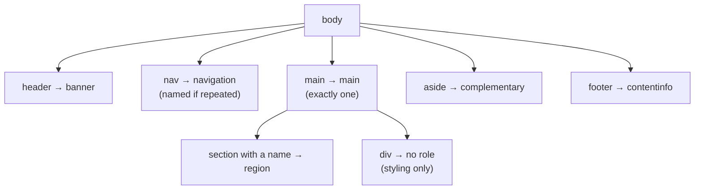

# Sectioning & Landmarks

> Landmarks are the page's table of contents for keyboard and screen reader users — a small, fixed set of regions that turn "tab through everything" into "jump to the part I want."

**Part:** [01 · Core Languages](../) · **Domain:** HTML & Document Semantics · **Priority:** Critical · **Difficulty:** Foundational · **Reading time:** ~8 min

## TL;DR

Seven HTML elements map to **ARIA landmark roles** and give assistive technology a navigable map of the page: `<main>` (one per page), `<nav>`, `<header>` and `<footer>` (landmarks only when they are direct children of `<body>`), `<aside>`, `<form>` with an accessible name, and `<search>`. `<section>` is a landmark **only when it has an accessible name**, and `<div>` is never one. Repeated landmark types need distinguishing names — `<nav aria-label="Primary">` and `<nav aria-label="Pagination">` — and the naming should not repeat the role, because screen readers already announce it.

> **Recommendation:** Give every page exactly one `<main>`, name every landmark that appears more than once, and add a skip link to `<main>` as the first focusable element.

## At a Glance

| | |
| --- | --- |
| **Use when** | Structuring any page or view — landmarks are the baseline navigation layer, not an enhancement. |
| **Avoid when** | Wrapping arbitrary groupings; a `<div>` is correct when there is no region to announce. |
| **Alternatives** | [Explicit ARIA roles](#alternative-approaches), [headings-only navigation](#alternative-approaches), skip links. |
| **Primary risk** | Landmark soup — a dozen unnamed regions is harder to navigate than none. |
| **Maturity** | Stable — HTML5 sectioning elements and their implicit roles are long settled. |

## Prerequisites

Landmarks are one half of a document's navigable structure; the other half is its heading tree.

- [The Document Outline](./the-document-outline.md) — how the document's structure is exposed and why the outline algorithm never shipped.

## Overview

A **landmark** is a region of the page that assistive technology can list and jump to. Screen readers expose them in a rotor or elements list, so a user can go straight to the main content, the primary navigation, or the site footer without traversing everything in between. That navigation mode exists only for landmark-role elements — no amount of visual grouping produces it.

The mapping from HTML to landmark role is fixed:

| Element | Landmark role | Notes |
| --- | --- | --- |
| `<main>` | `main` | One per page; the primary content |
| `<nav>` | `navigation` | Major navigation blocks, not every group of links |
| `<header>` | `banner` | Only when not inside `<article>`, `<aside>`, `<main>`, `<nav>`, or `<section>` |
| `<footer>` | `contentinfo` | Same scoping rule as `<header>` |
| `<aside>` | `complementary` | Content related to, but separable from, the main content |
| `<form>` | `form` | Landmark **only** when it has an accessible name |
| `<search>` | `search` | The search form region |
| `<section>` | `region` | Landmark **only** when it has an accessible name |

The scoping rule for `<header>` and `<footer>` is the one that catches people: a `<header>` inside an `<article>` is an ordinary grouping element with no role, which is correct — a card's header is not the page's banner.

## The Problem

Two opposite failures, both of which make landmark navigation useless.

The first is a page built entirely from `<div>`s. Nothing appears in the landmark list, so a screen reader user reaching the site has no way to skip the header and the navigation; every visit starts with the same forty links. Keyboard users without a skip link are in the same position.

```html
<!-- Nothing here is navigable as a region. -->
<div class="header">…</div>
<div class="nav">…</div>
<div class="content">…</div>
<div class="footer">…</div>
```

The second is landmark inflation. A team learns that landmarks help and wraps every visual block in `<section>` with a role, producing fifteen unnamed regions announced as "region, region, region." The list is now longer than the page's headings and carries less information.

```html
<!-- A rotor full of identical, unnamed entries. -->
<section><h2>Filters</h2>…</section>
<section><h2>Results</h2>…</section>
<section><h2>Related</h2>…</section>
<nav>…</nav>
<nav>…</nav>
<nav>…</nav>
```

The third is naming that fights the screen reader: `<nav aria-label="Main navigation">` is announced as "Main navigation navigation," because the role is already spoken. The same applies to `<main aria-label="Main content">`.

## Why It Matters

Landmark navigation is one of the two ways screen reader users orient on an unfamiliar page — headings being the other. WebAIM's screen reader surveys have consistently found heading and region navigation to be the primary strategies, and a page without either forces linear reading, which is the difference between using a site and enduring it.

Landmarks also carry the cheapest fix for WCAG 2.4.1 (Bypass Blocks): a skip link to `<main>` plus a correctly marked-up main region satisfies the criterion, works for keyboard-only users as well as screen reader users, and takes three lines of markup.

There is a maintenance benefit too. Landmarks push a page toward describing its structure once, in HTML, rather than encoding it in class names that only CSS understands. When the structure is in the markup, testing tools can check it and reviewers can read it.

## Mental Model

Think of a page as **a small set of named rooms**, not a grid of boxes.



Four rules keep the set small and useful.

**One `<main>` per page, containing the content that is unique to this view.** Everything repeated across pages — masthead, primary nav, footer — belongs outside it.

**Name a landmark when its type appears more than once.** `aria-label` or `aria-labelledby` (pointing at a visible heading) distinguishes "Primary" from "Pagination" navigation.

**Do not repeat the role in the name.** "Primary" not "Primary navigation"; "Site" not "Site footer."

**`<section>` earns a role only with a name.** An unnamed `<section>` is a `<div>` with different default margins, so either name it or use a `<div>`.

## Best Practices

**Start every page template with the five-landmark skeleton** — `header`, `nav`, `main`, optional `aside`, `footer` — and add nothing else until a region genuinely needs to be jumped to.

**Prefer `aria-labelledby` pointing at a visible heading** over an invisible `aria-label`; the two then cannot drift, and sighted users see the same label.

**Put the skip link first in the DOM and make it visible on focus.** A skip link that never becomes visible helps screen reader users and abandons sighted keyboard users.

**Use `<search>` for the search region** where support allows, with `role="search"` as a fallback on the form.

**Keep repeated content out of `<main>`.** Site navigation inside `<main>` defeats the purpose of the landmark that exists to skip it.

**Check the landmark list, not the markup.** Browser devtools' accessibility tree, or a screen reader's rotor, shows what a user actually gets — which is the only thing that matters.

## Trade-offs

Landmarks are close to free, and their cost is discipline about quantity.

**Advantages**

- Gives assistive technology a page map at effectively zero cost in markup and none in bytes.
- Satisfies a WCAG criterion and improves keyboard navigation for everyone, not only screen reader users.
- Encodes structure in HTML, where tooling and reviewers can verify it.

**Disadvantages**

- Too many landmarks degrade the feature, and there is no automated warning at the point of writing.
- The `<header>`/`<footer>` scoping rule and the "named `<section>`" rule are easy to get subtly wrong.
- Visual grouping and semantic regions do not always coincide, so a design can push authors toward the wrong element.

| Dimension | Semantic landmarks | `<div>` + ARIA roles | No landmarks |
| --- | --- | --- | --- |
| Assistive navigation | Full | Full, if roles are correct | None |
| Markup cost | None beyond choosing the element | An attribute per region, easy to mistype | None |
| Review clarity | Structure is visible in the HTML | Structure is spread across attributes | Structure exists only in CSS |
| Failure mode | Too many regions | Wrong or duplicated roles | Linear reading only |

## Alternative Approaches

| Approach | Best when | Weakness | See |
| --- | --- | --- | --- |
| Native sectioning elements | Always the default | Scoping rules must be learned | (this article) |
| Explicit `role="…"` on `<div>` | Retrofitting markup you cannot restructure | Verbose; easy to duplicate or misspell a role | [MDN — landmark roles](https://developer.mozilla.org/en-US/docs/Web/Accessibility/ARIA/Roles#3._landmark_roles) |
| Headings-only structure | Content documents with little chrome | No way to skip repeated blocks | [Headings Hierarchy](./headings-hierarchy.md) |
| Skip links | Always, alongside landmarks | Helps only the paths you provide links for | [WCAG 2.4.1](https://www.w3.org/WAI/WCAG22/Understanding/bypass-blocks.html) |

## Bad Example

A page that has structure only in its class names.

```html
<!-- ❌ No landmarks, no skip link, and roles applied where they do not belong. -->
<body>
  <div class="site-header">
    <div class="logo">Acme</div>
    <div class="nav">
      <a href="/products">Products</a>
      <a href="/pricing">Pricing</a>
    </div>
  </div>

  <div class="layout">
    <!-- ❌ Three unnamed regions, announced as "region, region, region". -->
    <section><h2>Filters</h2>…</section>
    <section><h2>Results</h2>…</section>
    <section><h2>Related products</h2>…</section>

    <!-- ❌ Two <main> elements: the landmark that must be unique is not. -->
    <main class="results">…</main>
    <main class="detail">…</main>
  </div>

  <!-- ❌ Name repeats the role: announced as "Main navigation navigation". -->
  <nav aria-label="Main navigation">…</nav>
  <nav>…</nav>            <!-- ❌ second, indistinguishable navigation -->

  <div class="site-footer">© Acme</div>
</body>
```

**What goes wrong:** The header, navigation, and footer are `<div>`s, so nothing appears in the landmark list and there is no way to skip the masthead — every visit to every page starts by traversing the same links, and with no skip link the keyboard-only path is identical. The three `<section>` elements have no accessible name, so they either expose no role at all or appear as indistinguishable "region" entries that add noise without information. Two `<main>` elements break the one-per-page rule, so the "jump to main content" command becomes ambiguous. `aria-label="Main navigation"` is announced together with the role, producing "Main navigation navigation," and the second `<nav>` has no name at all, so a user hearing two navigation landmarks cannot tell which is which. The result is a page that is harder to navigate than an unstyled document.

## Good Example

The same page with a small, named set of landmarks.

```html
<body>
  <!-- ✅ First focusable element, visible on focus. -->
  <a class="skip-link" href="#main">Skip to main content</a>

  <!-- ✅ banner: direct child of <body>. -->
  <header>
    <a href="/" aria-label="Acme home">
      
    </a>

    <!-- ✅ Named without repeating the role. -->
    <nav aria-label="Primary">
      <ul>
        <li><a href="/products">Products</a></li>
        <li><a href="/pricing">Pricing</a></li>
      </ul>
    </nav>

    <!-- ✅ The search region, named by its own control. -->
    <search>
      <form action="/search" role="search">
        <label for="q">Search products</label>
        <input id="q" name="q" type="search">
        <button type="submit">Search</button>
      </form>
    </search>
  </header>

  <!-- ✅ Exactly one main, holding only this view's unique content. -->
  <main id="main">
    <h1>Standing desks</h1>

    <!-- ✅ A named region, labelled by the heading users can already see. -->
    <section aria-labelledby="filters-heading">
      <h2 id="filters-heading">Filters</h2>
      …
    </section>

    <!-- ✅ No landmark needed here: a div is honest about being a wrapper. -->
    <div class="results-grid">
      <h2>142 results</h2>
      …
    </div>

    <!-- ✅ Repeated landmark type, distinguished by name. -->
    <nav aria-label="Pagination">
      <ul>…</ul>
    </nav>
  </main>

  <!-- ✅ complementary: related but separable. -->
  <aside aria-labelledby="related-heading">
    <h2 id="related-heading">Related products</h2>
    …
  </aside>

  <!-- ✅ contentinfo: direct child of <body>. -->
  <footer>
    <p>© Acme</p>
  </footer>
</body>
```

```css
/* ✅ The skip link is available to sighted keyboard users, not only screen readers. */
.skip-link {
  position: absolute;
  inset-inline-start: 0;
  inset-block-start: 0;
  translate: 0 -100%;
  padding: 0.5rem 1rem;
  background: Canvas;
  color: CanvasText;
}

.skip-link:focus-visible {
  translate: 0 0;
}
```

**Why it's better:** The landmark list is now six entries long and every one is distinguishable: banner, Primary navigation, search, main, Pagination navigation, complementary, contentinfo. A screen reader user can jump to main content in one command, and a sighted keyboard user gets the same shortcut through a skip link that becomes visible when focused rather than staying hidden. The single `<main>` contains only what is unique to this view, so skipping the header genuinely skips the repeated content. `aria-label="Primary"` and `aria-label="Pagination"` distinguish the two navigation regions without repeating the word the screen reader already says. The filters `<section>` earns its `region` role by pointing `aria-labelledby` at the heading users can see, so the name cannot drift from the visible text, while the results wrapper stays a `<div>` because there is nothing to announce. And `<search>` with `role="search"` on the form covers both current and older assistive technology.

## Common Mistakes

See the [HTML & Document Semantics anti-patterns](../../../anti-patterns/) for the domain catalog. Concept-specific:

### Mistake: Unnamed `<section>` elements used as generic wrappers

- **Symptom:** A rotor listing several identical "region" entries, or `<section>` elements that expose no role at all.
- **Why it fails:** `<section>` maps to the `region` role only when it has an accessible name. Without one it adds no navigational value, and when several *are* named badly they crowd out the landmarks that matter.
- **Fix:** Use `<div>` for grouping that exists for layout. Reserve `<section aria-labelledby="…">` for regions a user would plausibly want to jump to, and point the label at a visible heading.

### Mistake: Repeating the role in the landmark's name

- **Symptom:** Screen readers announce "Main navigation navigation," "Site footer contentinfo," "Search form search."
- **Why it fails:** The accessible name is announced together with the role, so any role word in the name is spoken twice. It also makes the rotor list harder to scan.
- **Fix:** Name by purpose only: "Primary," "Pagination," "Breadcrumb," "Site."

### Mistake: Putting the primary navigation inside `<main>`

- **Symptom:** "Skip to main content" lands the user before the site navigation, so the repeated block is not skipped after all.
- **Why it fails:** `<main>` is defined as the content unique to this document. Anything repeated across pages inside it is content the skip link was supposed to bypass.
- **Fix:** Keep masthead, primary navigation, and footer outside `<main>`. In-page navigation that belongs to this view specifically (a table of contents, pagination) can stay inside, with its own name.

## Checklist

- [ ] Exactly one `<main>` per page, containing only this view's unique content.
- [ ] A skip link to `<main>` is the first focusable element and becomes visible on focus.
- [ ] `<header>` and `<footer>` used for the page banner and contentinfo are direct children of `<body>`.
- [ ] Every landmark type that appears more than once has a distinguishing name.
- [ ] No landmark name contains its own role word.
- [ ] `<section>` is used only with an accessible name; otherwise `<div>`.
- [ ] Names come from `aria-labelledby` on a visible heading wherever one exists.
- [ ] The landmark list was checked in the accessibility tree or a screen reader rotor, not just in the markup.

## Related Articles

- [The Document Outline](./the-document-outline.md) — the structure landmarks and headings jointly expose.
- [Headings Hierarchy](./headings-hierarchy.md) — the other navigation axis assistive technology relies on.
- Tables & Data Semantics (planned) — structure for tabular regions inside `<main>`.
- [The ARIA Model · Accessibility](../../04-interface-engineering/accessibility/the-aria-model.md) — how implicit roles relate to explicit ones.

## References

- [HTML Standard — Sections](https://html.spec.whatwg.org/multipage/sections.html) — the normative definitions of the sectioning elements.
- [MDN — ARIA landmark roles](https://developer.mozilla.org/en-US/docs/Web/Accessibility/ARIA/Roles#3._landmark_roles) — the element-to-role mapping and naming guidance.
- [W3C ARIA Authoring Practices — Landmarks](https://www.w3.org/WAI/ARIA/apg/patterns/landmarks/) — worked examples, including when to name a landmark.
- [WCAG 2.2 — Understanding 2.4.1 Bypass Blocks](https://www.w3.org/WAI/WCAG22/Understanding/bypass-blocks.html) — the criterion landmarks and skip links satisfy.
