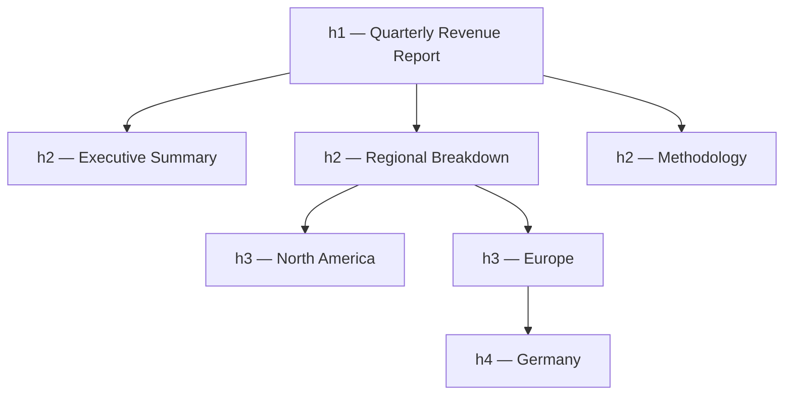

# The Document Outline

> Sighted users skim a page by looking at it. Everyone else navigates by its *outline* — the tree of headings and landmarks the markup declares — and that outline is either something you designed or something you got by accident.

**Part:** [01 · Core Languages](../) · **Domain:** HTML & Document Semantics · **Priority:** Critical · **Difficulty:** Foundational · **Reading time:** ~8 min

## TL;DR

The **document outline** is the hierarchical structure a browser and assistive technology derive from a page's headings (`h1`–`h6`) and landmark elements (`header`, `nav`, `main`, `aside`, `footer`, `section`, `article`). It is the primary navigation mechanism for screen-reader users — the large majority navigate by jumping between headings — and a significant input to how search engines understand a page. The rule that surprises people: **the "HTML5 outline algorithm" was never implemented by any browser and was removed from the spec**, so nesting `<section>` does *not* re-level your headings. `<h1>` inside a `<section>` is still an `h1`. You must set heading levels explicitly and keep them sequential, and use exactly one `<main>` per page. Style with CSS; choose the element for its meaning.

> **Recommendation:** Pick heading levels from the content's structure, never from its font size. Verify with the browser's accessibility pane before shipping — the outline is a deliverable, not a side effect.

## At a Glance

| | |
| --- | --- |
| **Use when** | Every page and every component that contributes content to a page — this is not an optional layer. |
| **Avoid when** | Never; the only question is whether a given element is a heading, a landmark, or neither. |
| **Alternatives** | [ARIA roles](#alternative-approaches) only where native elements genuinely can't express the structure. |
| **Primary risk** | Choosing heading levels by visual size, producing a skipped or nonsensical outline nobody sees in review. |
| **Maturity** | Stable — heading semantics predate CSS; the outline algorithm was formally dropped in 2022. |

## Prerequisites

The outline is derived from the DOM as the page is parsed, so knowing how the browser builds and consumes that tree makes the derivation concrete.

- [Process & Thread Architecture](../../00-foundations/web-platform/process-and-thread-architecture.md) (`· The Web Platform`) — the renderer builds the DOM, and the accessibility tree alongside it.

## Overview

Two mechanisms produce the outline, and they answer different questions.

**Headings** answer *"what is this content about, and what is it part of?"* Levels `h1` through `h6` form a nesting hierarchy: an `h3` is understood as a subsection of the nearest preceding `h2`. Assistive technology exposes a heading list users can jump through, and WebAIM's screen-reader surveys consistently find heading navigation to be the most-used way of finding content on a page — ahead of landmarks, ahead of search, ahead of reading linearly.

**Landmarks** answer *"what region of the page am I in?"* `<header>`, `<nav>`, `<main>`, `<aside>`, `<footer>`, `<form>` (when named), and `<section>` (when named) map to ARIA roles — `banner`, `navigation`, `main`, `complementary`, `contentinfo`, `form`, `region` — and give users a coarse map to skip between. `<main>` is special: exactly one per page, containing the content unique to that page, and it is what "skip to content" links target.

The critical historical correction: HTML5 originally specified an **outline algorithm** in which sectioning elements would implicitly re-level headings, so an `<h1>` inside a nested `<section>` would behave like an `<h2>`. **No browser or assistive technology ever implemented it**, and the WHATWG removed it from the specification. Content and tutorials written between roughly 2011 and 2020 still teach it. Treat any advice that says "just use `h1` everywhere and let sections handle levels" as actively wrong.

## The Problem

Heading levels get chosen for the wrong reason. A designer specifies a small subheading, so a developer writes `<h4>` because it renders at the right size; a marketing hero needs large text, so it becomes an `<h1>` on a page that already has one. Neither decision was about structure, and neither shows up in a visual review — the page looks correct. The outline it produces is `h1, h1, h4, h2, h4`, which a screen-reader user encounters as a table of contents with missing chapters and duplicate titles.

Component architecture makes it worse. A `<Card>` component hardcodes `<h3>` for its title. It is used inside an `<h2>` section on one page and directly under the `<h1>` on another. One of those placements is wrong, and neither the component nor its consumer has any mechanism to notice. The same problem appears with modals, drawers, and tab panels — each written in isolation, each guessing its depth.

The third failure is landmark inflation. `<div>`s become `<section>`s during a "semantic HTML" cleanup, without accessible names. An unnamed `<section>` is not exposed as a landmark at all in most engines, so the change is inert; when they *are* named, forty of them produce a landmark list that is worse than none. Meanwhile the real problems — no `<main>`, three elements claiming to be `<nav>` with no way to tell them apart — go unfixed.

## Why It Matters

For screen-reader users, a broken outline is the difference between reaching content in two keystrokes and reading the entire page linearly. It is the highest-leverage accessibility work available in HTML, and it costs nothing at runtime. WCAG makes parts of it normative — 1.3.1 Info and Relationships (structure must be programmatically determinable) and 2.4.6 Headings and Labels (headings must describe topic or purpose) — so it is also a conformance requirement, not a nicety. See [WCAG Principles (POUR) · Accessibility](../../04-interface-engineering/accessibility/wcag-principles-pour.md) for how these criteria fit together.

Search engines use the same structure. Headings are among the strongest on-page signals for what a document covers and how its parts relate, and a coherent hierarchy is what allows a search engine to surface a *section* of your page as the answer rather than the whole thing.

There's an engineering payoff too. A page with a correct outline is one whose information architecture someone actually thought about. In practice, the exercise of assigning heading levels surfaces content-model problems — two things that are siblings in the design but parent and child in the markup, or a "section" that turns out to contain nothing — well before they become layout bugs.

## Mental Model

Think of the page as a **book's table of contents**, and headings as its entries. Levels express containment: `h2` is a chapter, `h3` a section within that chapter. Skipping from `h2` to `h4` is a table of contents with a missing tier — the reader can't tell what the `h4` belongs to.



Landmarks are the orthogonal axis — regions, not depth:

```html
<body>
  <header>        <!-- role="banner"     — site-level, outside <main> -->
    <nav aria-label="Primary">…</nav>       <!-- role="navigation" -->
  </header>
  <main>          <!-- role="main"       — exactly one, page-unique content -->
    <h1>…</h1>
    <article>…</article>
  </main>
  <aside aria-label="Related articles">…</aside>  <!-- role="complementary" -->
  <footer>…</footer>                        <!-- role="contentinfo" -->
</body>
```

Three rules follow directly. **One `h1` per page**, naming what the page is — it is the title in the outline, and duplicating it means the outline has two roots. **Never skip a level going down**; jumping back up any number of levels is fine, because that closes sections rather than opening an undefined one. **Name your landmarks when there is more than one of a kind**: two `<nav>` elements need `aria-label="Primary"` and `aria-label="Breadcrumb"` or a user hears "navigation, navigation" with no way to choose.

And the rule that overrides intuition: **nesting does not change level**. `<section><h1>` is an `h1`. The level is whatever you typed.

## Best Practices

**Derive levels from content, style with CSS.** If an `<h2>` needs to look small, give it a class. Never pick `<h4>` for its default font size — the visual and semantic hierarchies are independent by design, and CSS exists to reconcile them.

**Make component heading levels a prop, with a sane default.** A card, panel, or modal that hardcodes its level will be wrong somewhere. Accept `as="h3"` or a numeric `level` so the consumer, who knows the surrounding depth, decides.

**Give every page exactly one `<main>` and one `<h1>`.** Put a skip link as the first focusable element on the page, targeting `<main>`, so keyboard users can bypass repeated navigation.

**Label duplicate landmarks.** `aria-label` or `aria-labelledby` on each `<nav>`, `<aside>`, or named `<section>` when more than one of that role exists.

**Use `<section>` only when it has an accessible name.** An unnamed `<section>` conveys nothing extra over a `<div>`; if you have no name for it, `<div>` is the honest choice.

**Never leave a heading empty or use one for spacing.** An `<h2></h2>` used as a visual divider appears in the heading list as a blank entry, which is actively confusing.

**Verify the outline, don't assume it.** Chrome DevTools' Accessibility pane, Firefox's Accessibility inspector, and browser extensions such as HeadingsMap or axe all render the actual outline. Check it once per page template, and add automated heading-order checks to CI.

## Trade-offs

Semantic structure is close to a free lunch, but it isn't entirely free — it constrains markup in ways that occasionally fight layout, and it needs discipline no compiler enforces.

**Advantages**

- Zero runtime cost: the browser derives the outline while parsing, with no JavaScript and no extra bytes.
- Serves screen readers, search engines, reader modes, and content extraction tools with one piece of work.
- The exercise surfaces information-architecture problems early, when they're cheap to fix.

**Disadvantages**

- Nothing enforces correctness — invalid outlines render perfectly, so errors survive visual review indefinitely.
- Component reuse across different depths requires an explicit level API, which is real design surface.
- Layout requirements (grid placement, sticky positioning) occasionally push toward markup order that fights document order.

| Dimension | Semantic outline | Cost / caveat |
| --- | --- | --- |
| Runtime cost | None | — |
| Accessibility | The primary navigation mechanism for screen readers | Requires manual verification; automated tools catch only ordering |
| SEO | Strong structural signal | No direct ranking guarantee |
| Component design | Forces explicit depth contracts | Level must be a prop, not a constant |
| Maintenance | Structure documents itself | Silent to break; needs CI checks to stay correct |

## Alternative Approaches

There is no substitute for a correct native outline. ARIA can *describe* structure the platform can't express, but it never beats using the right element.

| Approach | Best when | Weakness | See |
| --- | --- | --- | --- |
| Native headings + landmarks | Always the default | Requires discipline; no compiler enforcement | (this article) |
| `role="heading" aria-level="n"` | Retrofitting markup you genuinely cannot change | No default styling, no browser features, easy to get `aria-level` wrong | `The ARIA Model · Accessibility` (planned) |
| `aria-labelledby` on regions | Naming a landmark from visible text already on the page | Requires stable IDs; breaks silently if the target moves | [Sectioning & Landmarks](./sectioning-and-landmarks.md) |
| Visually hidden headings | A region needs a name in the outline but the design has no visible title | Overuse creates an outline that doesn't match what sighted users see | (this article) |

The first rule of ARIA applies verbatim: don't use ARIA if a native element with the semantics you need already exists.

## Bad Example

A dashboard page whose outline was chosen entirely by font size.

```html
<!-- ❌ Levels picked for appearance; landmarks missing or duplicated. -->
<body>
  <div class="topbar">
    <h1 class="logo">Acme</h1>              <!-- h1 #1: the company, not the page -->
    <div class="menu">…</div>               <!-- navigation with no <nav> -->
  </div>

  <div class="page">
    <h1 class="page-title">Reports</h1>     <!-- h1 #2: two roots in the outline -->

    <div class="panel">
      <h4>Revenue</h4>                      <!-- h4 because the design wanted 14px -->
      <p>…</p>
      <h3>By region</h3>                    <!-- level goes UP inside its own section -->
    </div>

    <section>                                <!-- unnamed: not exposed as a landmark -->
      <h2></h2>                              <!-- empty heading used as a spacer -->
      <div class="chart">…</div>
    </section>

    <nav>…</nav>                             <!-- two navs, neither labelled -->
    <nav>…</nav>
  </div>
</body>
```

**What goes wrong:** A screen-reader user pulling up the heading list sees `Acme, Reports, (blank), Revenue, By region` — two competing page titles, a blank entry, and a section whose `h4` sits under nothing while its `h3` appears to *contain* it. There is no `<main>`, so a skip link has no target and the "jump to main content" shortcut does nothing. The two unlabelled `<nav>` elements are announced identically, so the landmark list is unusable. And the unnamed `<section>` adds no semantics at all — it is a `<div>` with extra characters. None of this is visible in a screenshot, which is why it shipped.

## Good Example

The same page, with the outline treated as a deliverable.

```html
<!-- ✅ One h1, sequential levels, named landmarks, a real <main>. -->
<body>
  <a class="skip-link" href="#main">Skip to main content</a>

  <header>                                  <!-- role="banner" -->
    <a href="/" class="logo" aria-label="Acme home">Acme</a>  <!-- a link, not a heading -->
    <nav aria-label="Primary">…</nav>
  </header>

  <main id="main">                          <!-- exactly one; the skip-link target -->
    <h1>Reports</h1>                        <!-- the one page title -->

    <section aria-labelledby="revenue-h">   <!-- named → exposed as a region -->
      <h2 id="revenue-h" class="text-sm">Revenue</h2>  <!-- level from structure, size from CSS -->
      <p>…</p>

      <h3>By region</h3>                    <!-- a genuine child of Revenue -->
      <div class="chart">…</div>

      <h4>Germany</h4>                      <!-- one level down, no skips -->
      <p>…</p>
    </section>

    <section aria-labelledby="forecast-h">
      <h2 id="forecast-h">Forecast</h2>     <!-- back up to h2: closes the previous section -->
      <div class="chart">…</div>
    </section>
  </main>

  <nav aria-label="Report shortcuts">…</nav> <!-- distinct name from the primary nav -->
  <footer>…</footer>                         <!-- role="contentinfo" -->
</body>
```

```tsx
// ✅ Components take their level from the consumer, who knows the surrounding depth.
type PanelProps = {
  title: string;
  /** Heading level for the panel title. Defaults to h2; pass 3 inside an h2 section. */
  level?: 2 | 3 | 4 | 5 | 6;
  children: React.ReactNode;
};

export function Panel({ title, level = 2, children }: PanelProps) {
  const Heading = `h${level}` as const;
  const id = React.useId();
  return (
    <section aria-labelledby={id}>
      <Heading id={id} className="panel__title">{title}</Heading>
      {children}
    </section>
  );
}
```

```css
/* ✅ Visual hierarchy is CSS's job; semantic hierarchy is HTML's. */
.panel__title { font-size: 0.875rem; font-weight: 600; }

/* The skip link is present for keyboard users, out of the way until focused. */
.skip-link { position: absolute; left: -9999px; }
.skip-link:focus { left: 1rem; top: 1rem; z-index: 100; }
```

**Why it's better:** The heading list now reads `Reports → Revenue → By region → Germany → Forecast`, which is an accurate table of contents someone can navigate. The logo became a link with an accessible name instead of a competing `h1`, so there is one page title. Each `<section>` is named via `aria-labelledby` pointing at its own heading, so it registers as a landmark *and* its name matches what sighted users see. The two `<nav>` elements have distinct labels, making the landmark list actionable. `<main>` exists, so the skip link works — the single highest-value keyboard affordance on any page. And the `Panel` component pushes the level decision to the consumer with `React.useId()` wiring the name automatically, which is what makes the component correct at any depth rather than at one.

## Common Mistakes

See the [HTML anti-patterns](../../../anti-patterns/) for the domain catalog. Concept-specific:

### Mistake: Choosing heading levels by visual size

- **Symptom:** `<h4>` used for a small subheading directly under an `<h1>`; `<h1>` used for a hero because it needs to be large.
- **Why it fails:** The outline is built from levels, not from computed styles. A skipped level leaves the reader unable to tell what a heading belongs to, and it fails WCAG 1.3.1 because the visual relationship isn't programmatically determinable.
- **Fix:** Choose the level from the content hierarchy and set the size with a CSS class. If you find yourself wanting a level for its size, that is the signal.

### Mistake: Believing `<section>` re-levels headings

- **Symptom:** Every component uses `<h1>` inside its own `<section>`, on the theory that nesting handles the rest.
- **Why it fails:** The HTML5 outline algorithm was never implemented in any browser or screen reader and has been removed from the specification. Every one of those `<h1>`s is announced as a top-level heading.
- **Fix:** Set levels explicitly. Give reusable components a `level` prop so the consumer supplies the correct depth.

### Mistake: Landmark inflation without names

- **Symptom:** A refactor replaces every layout `<div>` with `<section>`, or adds `<nav>` to every group of links, with no `aria-label` anywhere.
- **Why it fails:** An unnamed `<section>` isn't exposed as a landmark, so the change accomplishes nothing; multiple unnamed landmarks of the same role are announced identically and can't be distinguished.
- **Fix:** Use a landmark only for a genuine page region, name it when more than one of its role exists, and leave generic grouping containers as `<div>`.

## Checklist

- [ ] Exactly one `<h1>` per page, naming that page's content.
- [ ] Heading levels never skip downward (`h2` → `h4`); returning upward is fine.
- [ ] No heading is empty or used purely for spacing.
- [ ] Exactly one `<main>`, containing the page-unique content.
- [ ] A skip link is the first focusable element and targets `<main>`.
- [ ] Every `<nav>`, `<aside>`, and named `<section>` has an accessible name when more than one of its role exists.
- [ ] `<section>` is used only where it has a name; otherwise `<div>`.
- [ ] Reusable components accept a heading level rather than hardcoding one.
- [ ] The outline has been inspected in the browser's accessibility pane, not just assumed.

## Related Articles

- [Sectioning & Landmarks](./sectioning-and-landmarks.md) — the full landmark set and how each maps to an ARIA role.
- [Headings Hierarchy](./headings-hierarchy.md) — level selection and component heading APIs in depth.
- [Tables & Data Semantics](./) (planned) — structure for tabular content, which has its own outline rules.
- Native Form Controls (planned) and Buttons, Links & Actions (planned) — choosing the element that carries the right semantics.
- **Canonical home:** the conformance criteria this structure satisfies are owned by [WCAG Principles (POUR) · Accessibility](../../04-interface-engineering/accessibility/wcag-principles-pour.md).

## References

- [WHATWG — HTML Standard: Headings and outlines](https://html.spec.whatwg.org/multipage/sections.html#headings-and-outlines) — the current, normative guidance, including the removal of the outline algorithm.
- [W3C — ARIA in HTML](https://www.w3.org/TR/html-aria/) — which native elements carry which implicit roles.
- [MDN — HTML: A good basis for accessibility](https://developer.mozilla.org/en-US/docs/Learn_web_development/Core/Accessibility/HTML) — practical patterns for semantic structure.
- [WebAIM — Screen Reader User Survey](https://webaim.org/projects/screenreadersurvey10/) — the data behind "heading navigation is how people actually move through a page".
