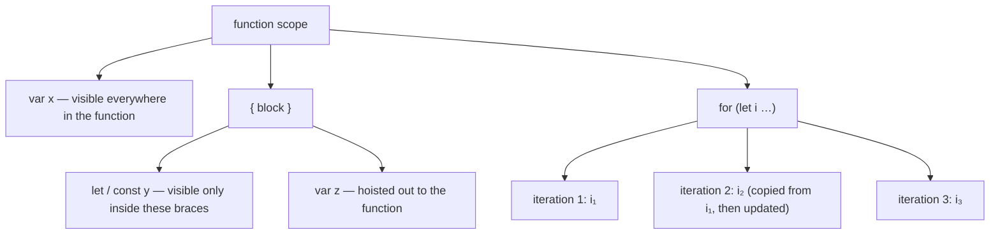

# Block vs Function Scope

> `let` in a `for` loop does not create one variable — it creates one per iteration, and copies the value forward. That single detail is why the loop-closure bug disappeared.

**Part:** [01 · Core Languages](../) · **Domain:** JavaScript · **Priority:** Critical · **Difficulty:** Foundational · **Reading time:** ~8 min

## TL;DR

`var` bindings belong to the nearest **function** (or module/script), so braces around them mean nothing: a `var` inside an `if`, a `for`, or a bare block is visible throughout the entire function. `let`, `const`, `class`, and — in strict mode — `function` declarations belong to the nearest **block**, so they vanish at the closing brace. The most consequential difference appears in loops: `for (let i …)` creates a **fresh binding per iteration** and copies the previous value into it, so closures created inside the loop each capture their own `i`. `for (var i …)` has exactly one binding for the whole loop, so every closure sees the final value. Before ES2015 the workaround was an IIFE per iteration; `let` makes that unnecessary.

> **Recommendation:** Use `const` by default and `let` where reassignment is needed; declare inside the smallest block that uses the value. Treat any surviving `var` as a scope bug waiting to happen.

## At a Glance

| | |
| --- | --- |
| **Use when** | Always — every declaration lands in one of the two scoping models. |
| **Avoid when** | Never; the choice is `let`/`const` versus `var`, and the answer is `let`/`const`. |
| **Alternatives** | [IIFE for isolation](#alternative-approaches), module scope, closures over parameters. |
| **Primary risk** | `var` leaking a binding across a whole function, and loop closures capturing a shared variable. |
| **Maturity** | Stable — block scoping specified in ES2015; per-iteration bindings unchanged since. |

## Prerequisites

Scoping rules build directly on where names live and when they become usable.

- [Lexical Scope](./lexical-scope.md) — the outward lookup chain that both models plug into.
- [Primitives & Wrappers](./primitives-and-wrappers.md) — value semantics, which is what a per-iteration binding copies.

## Overview

A **scope** is the region in which a binding is visible. JavaScript has two granularities:

| Construct | `var` lands in | `let` / `const` / `class` land in |
| --- | --- | --- |
| `function f() { … }` | This function | This function body block |
| `if (…) { … }` | Enclosing function | The block |
| `for (…) { … }` | Enclosing function | The loop (per iteration for the head binding) |
| `{ … }` bare block | Enclosing function | The block |
| `try { … } catch (e) { … }` | Enclosing function | The block; `e` is always block-scoped |
| Module top level | Module | Module |

Block scoping also changes what shadowing means. An inner `let x` shadows an outer `x` only within its block, so the outer value is untouched — whereas a `var x` in an inner block *is* the same binding as the function's `x`, and assigning to it overwrites the outer value.

The loop case has its own rule in the specification. For `for (let i = 0; …)`, the engine creates a new environment for each iteration and copies the current value in, then runs the update expression against the new binding. That is `CreatePerIterationEnvironment`, and it is what makes each closure capture a distinct `i`. `for...of` and `for...in` with `let`/`const` get a fresh binding per iteration as well.

## The Problem

The canonical demonstration is a loop that schedules work.

```js
const buttons = document.querySelectorAll("button");

for (var i = 0; i < buttons.length; i++) {
  buttons[i].addEventListener("click", () => {
    console.log("clicked button", i);   // always logs buttons.length
  });
}
```

There is one `i` for the whole function. Every handler closes over that same binding, and by the time any click happens the loop has finished, so `i` holds its terminal value. The output is identical for every button, which looks like an event-binding bug and is actually a scoping one.

The second failure is quieter — a `var` escaping the branch that created it:

```js
function describe(user) {
  if (user.isAdmin) {
    var role = "admin";
  }
  return `role: ${role}`;   // "role: undefined" for non-admins
}
```

And the third is accidental overwrite through shadowing that isn't:

```js
function process(items) {
  var result = [];
  for (var i = 0; i < items.length; i++) {
    if (items[i].nested) {
      // Intended as a local temp; actually reassigns the outer `i`.
      for (var i = 0; i < items[i].nested.length; i++) { /* … */ }
    }
    result.push(items[i]);
  }
  return result;
}
```

The inner loop reuses the same `i`, so the outer loop's counter is clobbered and the function either skips items or never terminates. None of these three throw.

## Why It Matters

Block scoping shrinks the region in which a name has meaning, and that is the whole point: fewer live names at any line means fewer ways to get them wrong. A `const` inside an `if` block cannot be read below it, cannot be reassigned by a later branch, and cannot collide with a same-named binding elsewhere in the function.

The loop-binding rule matters far beyond `setTimeout` demos. Every framework's event handlers, every `Promise` created in a loop, every `array.map` producing callbacks, and every React effect registered per item depends on capturing the right value. With `let`, capture is per iteration and correct by default; with `var`, correctness requires manually creating a scope.

There is a maintenance angle too. Because `var` is function-scoped, moving a block of code — extracting an `if` body into a helper, wrapping a section in a new block — can change which bindings are visible without any error. `let`/`const` make the extraction fail loudly if a dependency was missed.

## Mental Model

Braces are either walls or decoration, depending on the declaration form.



Three rules follow.

**`var` sees braces as decoration.** Only `function` boundaries stop it. This is why `var` in an `if` or a loop is visible before and after that construct.

**`let`/`const` see braces as walls.** The binding does not exist outside them, so the name is free for reuse elsewhere.

**A `let` loop head is one binding per iteration, not one per loop.** Closures created in different iterations capture different bindings; reassigning `i` inside the body affects only that iteration's copy.

## Best Practices

**Declare in the smallest block that needs the value.** If a value is used only inside an `if`, declare it there.

**Use `const` unless the binding is reassigned.** Reassignment is the only reason to reach for `let`, and its absence is useful information for a reader.

**Use `for (const item of items)` for iteration.** Per-iteration binding plus no reassignment is the safest loop form; use `let` in the head only when you need index arithmetic.

**Never declare `var` in a block.** If legacy code does, converting it may change visibility — check every use before and after the block.

**Prefer extraction over IIFEs.** A named function gives the same isolation as an IIFE, plus a stack-frame name and a testable unit.

**Shadow deliberately, and briefly.** A short-lived `const` that shadows an outer name inside one block is fine; a long block that shadows a parameter is a rename waiting to happen.

**Let the linter enforce it.** `no-var`, `prefer-const`, `block-scoped-var`, and `no-shadow` cover almost the entire category mechanically.

## Trade-offs

Block scoping is strictly the better default, but it is not free of friction.

**Advantages**

- Bindings disappear at the closing brace, so fewer names are live at any point.
- Loop closures capture the value they visually appear to capture.
- Extracting or moving a block fails loudly if it depended on an outer binding.
- `const` additionally rules out reassignment, which removes a class of "who changed this" questions.

**Disadvantages**

- A value genuinely needed after a block must be declared before it, which produces the `let x; if (…) { x = … }` shape that some find noisier than `var`.
- The TDZ means block-scoped bindings can throw where `var` would have given `undefined` — better, but a behavior change during migration.
- Per-iteration bindings allocate an environment per iteration; irrelevant at normal sizes, measurable in very hot numeric loops.

| Dimension | `var` (function scope) | `let` / `const` (block scope) |
| --- | --- | --- |
| Visible outside its block | Yes | No |
| Redeclaration in same scope | Allowed | `SyntaxError` |
| Loop closure capture | One shared binding | One binding per iteration |
| Read before declaration | `undefined` | `ReferenceError` |
| Shadowing an outer name | Same binding if in same function | True shadow, outer untouched |
| Safe to extract a block | No — may silently change scope | Yes — missing deps error |

## Alternative Approaches

| Approach | Best when | Weakness | See |
| --- | --- | --- | --- |
| `let` / `const` block scope | Default for all code | Values needed after a block must be hoisted manually | (this article) |
| IIFE per iteration | Legacy environments without `let` | Extra function per iteration; noisy | [Closures](./closures.md) |
| `forEach` / `map` callbacks | You want a fresh parameter binding per element | Cannot `break`; extra call per item | (this article) |
| Extracted named function | The block is long or reused | An extra name to maintain | (this article) |
| Module scope | The value is shared by the whole file | Wider visibility than most values deserve | The Module System (planned) |

## Bad Example

A function whose bindings all live at function scope.

```js
function renderReport(rows, container) {
  var output = [];

  // ❌ One `i` for the entire function.
  for (var i = 0; i < rows.length; i++) {
    var row = rows[i];

    if (row.status === "error") {
      // ❌ `message` leaks to the whole function.
      var message = "failed: " + row.reason;
    }

    // ❌ Reads a binding from a branch that may not have run —
    //    and from a *previous* iteration when it did.
    output.push(row.name + " " + message);

    // ❌ Every handler closes over the same `i` and the same `row`.
    container.children[i].addEventListener("click", function () {
      console.log("row", i, rows[i].name);
    });
  }

  // ❌ Loop bindings are still alive here.
  console.log(i, row, message);

  return output;
}
```

**What goes wrong:** The single `i` means every click handler logs the row count instead of its own index, and `rows[i]` is `undefined` at that point, so the handlers throw when clicked rather than misbehaving visibly at render time. `message` is function-scoped, so a row with no error reads whatever the *last* errored row set — the report shows stale failure text attached to healthy rows, which is worse than showing nothing. `row` has the same problem in miniature: it survives the loop, so the code after it reads the final row as if that were meaningful. Nothing here errors during rendering; the bugs appear as wrong text on screen and as exceptions in handlers that fire minutes later, far from this function. And because all four bindings are visible for the whole body, extracting any part of this loop into a helper silently changes which values it can see.

## Good Example

The same function with every binding scoped to its use.

```js
function renderReport(rows, container) {
  const output = [];

  // ✅ Fresh `index` and `row` per iteration; both invisible afterwards.
  rows.forEach((row, index) => {
    // ✅ Scoped to the branch, with an explicit default for the other path.
    const message = row.status === "error" ? `failed: ${row.reason}` : "";

    output.push(`${row.name} ${message}`.trim());

    // ✅ Captures this iteration's `row` and `index`.
    container.children[index].addEventListener("click", () => {
      console.log("row", index, row.name);
    });
  });

  return output;
}
```

```js
// ✅ Where index arithmetic is needed, `for (let …)` gives per-iteration capture.
function scheduleAll(tasks) {
  for (let i = 0; i < tasks.length; i++) {
    setTimeout(() => console.log(`task ${i}: ${tasks[i].name}`), i * 100);
  }
  // console.log(i);   // ReferenceError — `i` does not exist out here
}
```

```js
// ✅ A value genuinely needed after a block is declared before it, once.
function resolveTheme(prefs) {
  let theme;                      // `let` because it is assigned in branches
  if (prefs.explicit) {
    theme = prefs.explicit;
  } else if (matchMedia("(prefers-color-scheme: dark)").matches) {
    theme = "dark";
  } else {
    theme = "light";
  }
  return theme;
}

// ✅ Or avoid the mutable binding entirely.
const resolveThemePure = (prefs) =>
  prefs.explicit ??
  (matchMedia("(prefers-color-scheme: dark)").matches ? "dark" : "light");
```

```js
// ✅ Deliberate, short-lived shadowing inside a block leaves the outer value intact.
const items = ["a", "b"];
{
  const items = items2Normalize();   // shadows only within these braces
  process(items);
}
console.log(items);                  // still ["a", "b"]
```

**Why it's better:** `forEach` gives a fresh `row` and `index` parameter per element, so each handler captures the element it was attached to and the click logs are correct even though they fire long after the loop ended. `message` is a `const` computed per row with an explicit empty default, which removes the stale-text bug at its source instead of guarding against it downstream. Nothing from the loop survives it, so the code below cannot accidentally depend on the last iteration's state, and the loop body can be extracted into a helper mechanically — any missing dependency becomes a `ReferenceError` at the first test run rather than a silent capture. The `for (let i …)` example keeps index arithmetic where it is genuinely needed while still getting per-iteration capture, so `setTimeout` logs `0, 1, 2…` rather than the length three times. The `resolveTheme` pair shows both honest options for a value needed after a branch: one mutable `let` declared once, or an expression that removes the mutation entirely. And the shadowing block demonstrates the property `var` cannot offer — the inner name is a genuinely separate binding, so the outer array is untouched after the block.

## Common Mistakes

See the [JavaScript anti-patterns](../../../anti-patterns/) for the domain catalog. Concept-specific:

### Mistake: Creating closures in a `var` loop

- **Symptom:** Every callback — timeout, event handler, promise — reports the loop's final index instead of its own.
- **Why it fails:** `var` creates one binding for the entire function, so all closures reference the same variable, and they run after the loop has finished updating it.
- **Fix:** Use `for (let i …)` or an array iteration method. Both give a fresh binding per iteration; no IIFE is needed.

### Mistake: Declaring `var` inside a block and reading it outside

- **Symptom:** A variable "defined in the `if`" reads as `undefined`, or holds a value from an earlier iteration, on paths where the branch did not run.
- **Why it fails:** `var` is function-scoped, so the binding exists on every path regardless of whether its assignment executed. There is no error, only a stale or absent value.
- **Fix:** Declare with `const` inside the block, or compute the value with a conditional expression so every path assigns it.

### Mistake: Reusing a loop variable name in a nested `var` loop

- **Symptom:** The outer loop terminates early, repeats items, or never terminates.
- **Why it fails:** With `var`, the inner `for (var i …)` is not a new binding — it is the same `i` the outer loop is using, so the inner loop resets and advances the outer counter.
- **Fix:** Use `let` (which genuinely shadows per block) and give nested loops distinct, meaningful names anyway.

## Checklist

- [ ] No `var` remains; every conversion checked for visibility changes before and after its block.
- [ ] `const` is the default; `let` appears only where a binding is reassigned.
- [ ] Loops that create closures use `let` in the head or an array iteration method.
- [ ] No binding is read outside the block that assigns it.
- [ ] Nested loops use distinct index names even though block scoping permits reuse.
- [ ] Values needed after a branch are declared once above it, with every path assigning them.
- [ ] `no-var`, `prefer-const`, `block-scoped-var`, and `no-shadow` are enabled.
- [ ] Deliberate shadowing is short, commented, and confined to one block.

## Related Articles

- [Lexical Scope](./lexical-scope.md) — the lookup chain both scoping models participate in.
- [Hoisting & TDZ](./hoisting-and-tdz.md) — the timing half of the `var` versus `let` difference.
- [Closures](./closures.md) — what a captured binding actually holds, and why per-iteration bindings fix loops.
- [Primitives & Wrappers](./primitives-and-wrappers.md) — value semantics, which is what each iteration's copy relies on.

## References

- [ECMAScript — Block Statement Runtime Semantics](https://tc39.es/ecma262/#sec-block-runtime-semantics-evaluation) — the new environment record created on block entry.
- [ECMAScript — `CreatePerIterationEnvironment`](https://tc39.es/ecma262/#sec-createperiterationenvironment) — the normative per-iteration binding rule for `for (let …)`.
- [MDN — `var`](https://developer.mozilla.org/en-US/docs/Web/JavaScript/Reference/Statements/var) — function-scoping behavior and its interaction with blocks.
- [MDN — `let`](https://developer.mozilla.org/en-US/docs/Web/JavaScript/Reference/Statements/let) — block scoping, redeclaration errors, and loop semantics.
