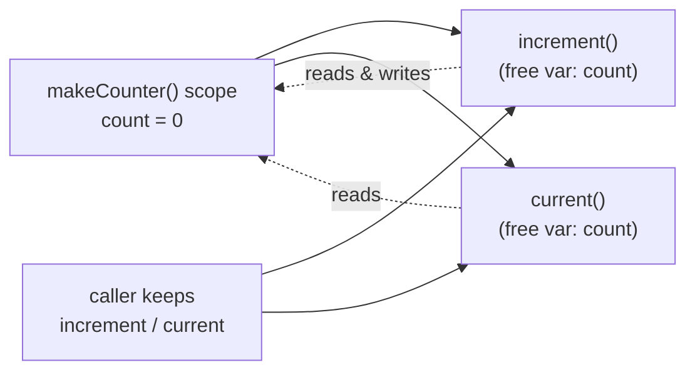

# Closures

> A closure is a function packaged together with the variables that were in scope where it was defined. It keeps reading and writing those variables even after the outer function has returned.

**Part:** [01 · Core Languages](../) · **Domain:** JavaScript · **Priority:** Critical · **Difficulty:** Foundational · **Reading time:** ~12 min

## TL;DR

A *closure* is the pairing of a function with the lexical environment in which it was created. Because JavaScript resolves free variables by where a function is written, not where it is called, an inner function keeps a live reference to its outer variables even after the outer call has returned. This is the mechanism behind private state, factory functions, event handlers that remember their setup, and most of the "how does this callback still know that value?" moments in real code. The cost is that a captured variable cannot be garbage-collected while the closure is reachable, so a long-lived closure over a large object is a memory leak waiting to happen. Capture the minimum you need, and release closures when their owner is torn down.

> **Recommendation:** Reach for a closure to encapsulate state that a set of functions must share privately; keep the captured set small, and drop the reference (remove the listener, clear the timer) when the closure's lifetime ends.

## At a Glance

| | |
| --- | --- |
| **Use when** | A function must remember state across calls, or several functions must share private, non-global state. |
| **Avoid when** | The state is better modeled as an explicit object field, or the captured value is large and long-lived. |
| **Alternatives** | Closures are a language primitive, not a swappable technique — the near neighbors are object fields and module state, not substitutes. |
| **Primary risk** | Retaining a large captured environment past its usefulness — a leak that grows over a session. |
| **Maturity** | Stable — part of the language since its first edition. |

## Prerequisites

This article assumes you understand how a function body resolves variable names against its surrounding scope, and the difference between a value and a reference.

- Lexical Scope (planned) — closures are the runtime consequence of lexical scoping, so the scoping rules come first.
- [Primitives & Wrappers](./primitives-and-wrappers.md) — what is captured "by reference" versus what behaves as a copied value.

## Overview

A *closure* is created every time a function is defined: the function value carries a hidden link to the environment record of the scope it was born in. When the function later runs and refers to a variable it did not declare itself — a *free variable* — the engine walks that chain of environments outward until it finds the binding. The important part is *when* that link is fixed: at definition time, by position in the source, not at call time by who invoked it.

This is why an inner function returned from an outer one still works after the outer call is gone. The outer function's local variables would normally be discarded when it returns, but if a surviving inner function still references them, the engine keeps that environment alive. The closure is not a copy of the values; it is a live view of the same bindings, so two closures over the same variable see each other's writes. Closures are often confused with objects (both bundle behavior with state) and with simple callbacks (not every callback closes over anything), but the defining trait is the retained link to an outer scope.

## The Problem

Consider a module that needs a counter shared by a few functions but hidden from the rest of the app. The naive options are both bad: a module-level `let` is visible and mutable by anything in the file, and threading the count through every function signature is noisy and easy to get wrong. You want state that a small group of functions can read and update, and nothing else can touch.

The second, sharper problem is the one closures cause rather than solve. Because a closure keeps its whole surrounding environment reachable, a handler that captures one small field can accidentally pin a large object graph in memory. A classic case: an event listener defined inside a component closes over the component's entire props or a big data array, and because the listener is never removed, the array outlives the component forever. The problem is not "use closures" versus "don't"; it is understanding exactly what a closure holds onto and for how long.

## Why It Matters

Closures are not an advanced trick you can skip — they are how ordinary JavaScript already works, so misreading them produces bugs that look like magic. The single most common interview-and-production trap, a loop that captures the wrong variable, is a closure misunderstanding. So is the stale-value bug where a callback reads an old copy of state because it closed over a binding that has since been replaced. Getting the mental model right turns these from mysteries into predictable outcomes.

On the systems side, closures are a leading cause of front-end memory growth. Every retained listener, timer, or subscription that closes over component state is a potential leak, and leaks in a long-lived single-page app accumulate silently until the tab is sluggish. Because the leak is invisible in a quick test and only shows up after minutes of use, it is exactly the kind of defect that reaches production. Understanding what a closure captures is what lets you reason about — and cap — that cost.

## Mental Model

Think of a function as a note that says "look up `count` in the room I was written in." When you carry that note to another room and read it, it still points back to the original room. As long as the note exists, that room cannot be demolished, because the note might need it. A closure is the note plus the room it points to.



Two properties fall out of this model. First, closures over the *same* scope share it: `increment` and `current` above see one `count`, so a write from one is visible to the other. Second, a variable stays alive precisely as long as *some* reachable closure references it — no more, no less. That single rule explains both the feature (state persists) and the failure (memory persists). If you can name what is reachable, you can predict both.

## Best Practices

Capture the minimum. If a handler only needs an id, close over the id, not the whole object that contains it. Pulling the small value into a local before defining the inner function shrinks what the closure pins in memory.

Prefer closures for genuinely private state. When a few functions must share state that nothing else should reach, a closure (or a module scope) expresses that better than a public field a caller could mutate. This is the "module pattern" and the reason factory functions are so common.

Release closures at end of life. A closure held by a listener, timer, or subscription lives as long as that registration does. Remove the listener, clear the interval, and unsubscribe on teardown so the captured environment becomes collectable.

Beware the loop variable. In a loop, decide deliberately whether each iteration's callback should see that iteration's value (use `let`, which creates a fresh binding per iteration) or a single shared value (use `var` or an outer variable). The bug is almost always an accidental share.

## Trade-offs

Closures trade a small, invisible memory commitment for expressive, encapsulated state. For short-lived or small captures the trade is free; for large, long-lived captures it becomes the dominant cost.

**Advantages**

- Encapsulation without classes: private state that only a chosen set of functions can touch.
- State that persists across calls without a global or an extra parameter.
- The foundation for callbacks, factories, currying, and most functional patterns.

**Disadvantages**

- A captured variable cannot be collected while the closure is reachable, so careless capture leaks memory.
- The "live shared binding" semantics surprise people expecting a snapshot copy.
- Over-using closures for state that belongs on an object can obscure data flow.

| Dimension | Closures | Cost / caveat |
| --- | --- | --- |
| Expressiveness | Private, persistent state with no boilerplate | Easy to hide state that would be clearer as a field |
| Memory | Only what is captured stays alive | A large capture pins its whole environment |
| Correctness | Deterministic once the model is clear | Loop-variable and stale-value bugs if it is not |
| Performance | Cheap to create and call | Many long-lived closures add GC pressure |

## Alternative Approaches

Closures are a language primitive rather than one option among interchangeable techniques, so there is no true substitute for the mechanism itself. What competes is *where you put shared state*: a closure keeps it in a scope, whereas an object keeps it in a field and a module keeps it in module scope. Choose an object when the state is naturally "the thing's data" and callers legitimately need access; choose a closure when the state must stay private to a set of collaborating functions.

## Bad Example

A per-row handler defined in a loop that closes over the loop variable, plus a listener that captures a large array and is never removed.

```js
// ❌ Two closure bugs in one place.
function attachRowHandlers(rows, hugeDataset) {
  for (var i = 0; i < rows.length; i++) {
    // BUG 1: every handler closes over the SAME `i` (var is function-scoped),
    // so by the time any click fires, `i` is rows.length — all handlers read
    // the last index.
    rows[i].addEventListener('click', function () {
      console.log('clicked row', i);
    });
  }

  // BUG 2: this listener closes over `hugeDataset`, and nothing ever removes it,
  // so the entire array is retained for the life of the document.
  window.addEventListener('resize', function () {
    console.log('rows:', rows.length, 'records:', hugeDataset.length);
  });
}
```

**What goes wrong:** The `var i` binding is shared by every iteration's closure, so all handlers log the final index — the canonical loop-closure bug. Separately, the `resize` listener pins `hugeDataset` in memory permanently because the closure is reachable from a global event target and is never detached: a steady memory leak that a short test never reveals.

## Good Example

The same feature with a per-iteration binding, a minimal capture, and explicit teardown that releases every closure.

```js
// ✅ Fresh binding per iteration, minimal capture, and cleanup.
function attachRowHandlers(rows, hugeDataset) {
  const count = hugeDataset.length; // capture only the number, not the array

  for (const [index, row] of rows.entries()) {
    // `index` is a fresh binding each iteration, so each handler sees its own.
    row.addEventListener('click', () => {
      console.log('clicked row', index);
    });
  }

  const onResize = () => {
    console.log('rows:', rows.length, 'records:', count);
  };
  window.addEventListener('resize', onResize);

  // Return a cleanup function so the caller can release the closures at end of life.
  return () => {
    window.removeEventListener('resize', onResize);
  };
}
```

**Why it's better:** Iterating with `for...of` (or `let`) gives each handler its own `index`, fixing the shared-variable bug. The `resize` handler closes over `count`, a single number, instead of the whole dataset, so the array is free to be collected once the caller drops it. Returning a cleanup function makes the listener's lifetime explicit, so the closure — and anything it captured — is released on teardown instead of leaking.

## Production Example

The module pattern: a factory that returns functions sharing one private, non-global piece of state, with no way for callers to reach it directly.

```js
// A rate limiter whose internal state is captured, not exposed.
function createRateLimiter({ max, windowMs }) {
  let hits = [];

  function allow() {
    const now = Date.now();
    // Drop timestamps outside the window; `hits` is private to these functions.
    hits = hits.filter((t) => now - t < windowMs);
    if (hits.length >= max) return false;
    hits.push(now);
    return true;
  }

  function reset() {
    hits = [];
  }

  // Callers get behavior, never the `hits` array itself.
  return { allow, reset };
}

const limiter = createRateLimiter({ max: 5, windowMs: 1000 });
if (limiter.allow()) {
  // ...perform the guarded action
}
```

The returned `allow` and `reset` both close over the same `hits` binding, so they coordinate through shared private state that nothing outside the factory can read or corrupt. Because `hits` only holds recent timestamps and is pruned on each call, the captured state stays bounded — the closure keeps state alive deliberately, not accidentally.

## Common Mistakes

See the [JavaScript anti-patterns](../../../anti-patterns/#javascript) for the domain catalog. Concept-specific:

### Mistake: Capturing the loop variable with `var`

- **Symptom:** Every callback created in a loop reads the same final value instead of its own iteration's value.
- **Why it fails:** `var` has one function-scoped binding shared by all iterations, so each closure references the same variable, which ends at its last value.
- **Fix:** Use `let` or `for...of`, which create a fresh binding per iteration, or pass the value into an immediately-invoked function to capture it explicitly.

### Mistake: Closing over more than you need

- **Symptom:** Memory grows over a session; a heap snapshot shows large objects retained by handler closures long after the UI that created them is gone.
- **Why it fails:** A closure keeps its entire surrounding environment reachable, so capturing a big object (or `this`) pins it until the closure itself is released.
- **Fix:** Pull the minimal value into a local before defining the inner function, and remove listeners, timers, and subscriptions on teardown.

## Checklist

- [ ] Callbacks created in a loop use `let` or `for...of` when each should see its own value.
- [ ] Long-lived closures (listeners, timers, subscriptions) capture the smallest value needed, not whole objects.
- [ ] Every registration that holds a closure has a matching teardown (remove, clear, unsubscribe).
- [ ] Private state shared by several functions is expressed with a closure or module scope, not a public field callers can mutate.
- [ ] Where a snapshot is intended, the value is copied at capture rather than read live from a shared binding.

## Related Articles

- Lexical Scope (planned) — the name-resolution rules that closures are built on.
- [Hoisting & TDZ](./hoisting-and-tdz.md) — how bindings come into existence within a scope before a closure reads them.
- [Block vs Function Scope](./block-vs-function-scope.md) — why `let` and `var` capture so differently in loops.

## References

- [MDN — Closures](https://developer.mozilla.org/en-US/docs/Web/JavaScript/Closures) — the canonical explanation with worked examples.
- [ECMAScript — Execution Contexts and Environment Records](https://tc39.es/ecma262/#sec-execution-contexts) — the specification mechanism behind captured bindings.
- [MDN — Memory management](https://developer.mozilla.org/en-US/docs/Web/JavaScript/Memory_management) — reachability and garbage collection, which govern what a closure keeps alive.
