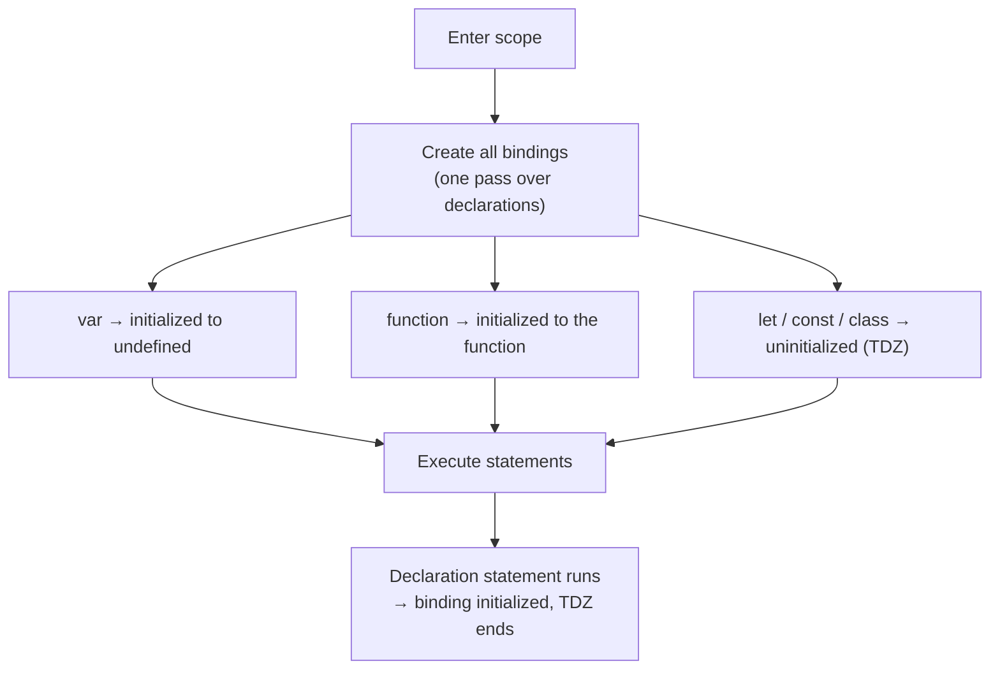

# Hoisting & TDZ

> Nothing actually moves. The bindings for a scope are all created the moment the scope is entered — hoisting is just the name for the gap between *created* and *initialized*.

**Part:** [01 · Core Languages](../) · **Domain:** JavaScript · **Priority:** Critical · **Difficulty:** Foundational · **Reading time:** ~8 min

## TL;DR

When the engine enters a scope it **instantiates every declaration in that scope first**, before executing a single statement. What differs is the initial state of each binding. `var` bindings are created *and initialized to `undefined`*, so reading one before its assignment yields `undefined`. `function` declarations are created *and fully initialized*, so they are callable before their line. `let`, `const`, and `class` bindings are created but left **uninitialized**; touching one before its declaration executes throws `ReferenceError`, and the region between scope entry and that declaration is the **temporal dead zone (TDZ)**. The TDZ is not a syntax rule — it is a runtime state, which is why a function defined earlier can still hit it when called later.

> **Recommendation:** Use `const` by default and `let` when reassignment is required; the TDZ then turns "used before defined" from a silent `undefined` into a loud error at the exact line.

## At a Glance

| | |
| --- | --- |
| **Use when** | Always relevant — every declaration in every scope is subject to these rules. |
| **Avoid when** | Never; the choice is which declaration form to use, not whether hoisting applies. |
| **Alternatives** | [`var` hoisting](#alternative-approaches), function declarations vs function expressions, module top-level bindings. |
| **Primary risk** | `var`'s `undefined` reads hiding ordering bugs, and TDZ errors appearing only on certain call paths. |
| **Maturity** | Stable — `let`/`const` TDZ behavior fixed in ES2015 and unchanged since. |

## Prerequisites

Hoisting is a property of how scopes are set up, so the scope model comes first.

- [Lexical Scope](./lexical-scope.md) — which scope a name belongs to, decided by source position.
- [Primitives & Wrappers](./primitives-and-wrappers.md) — what `undefined` actually is, as distinct from "not declared".

## Overview

Entering a scope — a function call, a block, a module — creates an **environment record**: a table of names for that scope. Populating it happens in one pass before execution, and each declaration form specifies its own starting state:

| Declaration | Binding created | Initialized at creation | Read before declaration |
| --- | --- | --- | --- |
| `var x` | Function scope | Yes, to `undefined` | `undefined` |
| `function f()` | Enclosing scope | Yes, to the function | Works — callable |
| `let x` | Block scope | No | `ReferenceError` (TDZ) |
| `const x` | Block scope | No | `ReferenceError` (TDZ) |
| `class C` | Block scope | No | `ReferenceError` (TDZ) |
| `import x` | Module scope | Yes (hoisted, live binding) | Works |

The phrase "hoisted to the top" describes the *effect* for `var` and `function`, not a transformation of the source. Nothing is rewritten; the binding simply exists from the first instruction of the scope.

The TDZ ends when the declaration statement executes — not when it is parsed. That distinction is the whole subtlety:

```js
{
  // TDZ for `value` starts here.
  const read = () => value;   // fine: not called yet
  // read();                  // would throw: still in TDZ
  const value = 1;            // TDZ ends here
  console.log(read());        // 1
}
```

`typeof` offers no escape hatch: `typeof undeclaredName` is `"undefined"`, but `typeof tdzName` throws. TDZ bindings are declared, just not usable yet.

## The Problem

`var` hoisting makes an ordering mistake look like a data problem.

```js
function checkout(cart) {
  if (cart.items.length > total) {   // total is `undefined` here
    applyBulkDiscount(cart);         // never runs — comparison is NaN-ish false
  }
  var total = cart.items.reduce((n, i) => n + i.price, 0);
  return total;
}
```

Nothing throws. `total` exists from the first line of the function with the value `undefined`, so `length > undefined` is `false` and the discount silently never applies. The bug surfaces as a pricing discrepancy in production, several layers away from the line that caused it.

Function declarations create the inverse trap — code that works until someone converts it:

```js
setup();                       // ✅ works: declaration is fully hoisted
function setup() { /* … */ }

start();                       // ❌ TypeError: start is not a function
var start = function () { /* … */ };   // binding hoisted, value not
```

Both lines look like "define a function", but only the first is usable before its position. A refactor from declaration to arrow-function `const` moves the call from "works" to "throws" with no visible change in intent.

The third failure mode is the one people meet in loops, where `var`'s function scope means every iteration shares one binding — the classic reason `setTimeout` in a `for (var i …)` loop logs the final value repeatedly. That is covered in [Block vs Function Scope](./block-vs-function-scope.md).

## Why It Matters

The practical difference between `var` and `let` is *when you learn about a mistake*. `var` converts "read before write" into a legal `undefined`, which then propagates: `undefined` in arithmetic gives `NaN`, in string concatenation gives `"undefined"`, and in a conditional gives a silently skipped branch. `let`'s TDZ converts the same mistake into a `ReferenceError` naming the variable, at the line that read it.

It also matters for dependency order in modules and class fields. Class bodies are full of TDZ interactions — a static field referencing a later static field, a `class` extending an identifier declared below it — and each of them throws rather than producing a half-built object. That is the desirable outcome, but only if you recognize the error for what it is.

Finally, it explains recursion and mutual reference. Function declarations being fully initialized before execution is what allows two functions to call each other regardless of order; the equivalent pair written as `const` arrow functions works only because the *calls* happen later, after both declarations have run.

## Mental Model

Scope entry is a two-beat rhythm: create all bindings, then run the code.



Three rules cover every case.

**Creation is unconditional; initialization is positional.** Every declared name exists from scope entry. Only `let`/`const`/`class` wait for their statement to run.

**The TDZ is temporal, not spatial.** A closure written above the declaration is fine as long as it is *called* after it. "Before" means before in time, not above in the file.

**`function` declarations are the exception that people generalize from.** They are the only form whose *value* is available before its line — which is why converting one to a `const` expression can break call sites that never moved.

## Best Practices

**Default to `const`, escalate to `let`, never `var`.** The TDZ is a feature: it reports ordering bugs at their cause.

**Declare close to first use.** A short distance between declaration and use makes the TDZ irrelevant in practice.

**Keep function declarations for top-level, mutually recursive helpers.** Their full hoisting is genuinely useful there, and order-independence is the point.

**Do not rely on hoisting for readability.** "Call the function at the top, define it at the bottom" works, but only for declarations — the pattern breaks silently when someone modernizes the definition.

**Watch class bodies.** A `class` binding is in TDZ inside its own `extends` clause and static initializers reference each other in source order.

**Enable `no-use-before-define`.** The linter catches the entire category at authoring time, including the `var` cases the runtime will not.

**Prefer module top-level `const` over `var` for configuration.** Module bindings are hoisted but immutable-by-default; the combination gives order-safety across the import graph.

## Trade-offs

Hoisting is not a decision, but declaration form is.

**Advantages of `let`/`const` and the TDZ**

- Ordering mistakes fail loudly, at the reading line, with the variable named.
- Block scoping matches how most people already read braces.
- `const` additionally prevents reassignment, so the binding's meaning is stable.

**Disadvantages**

- TDZ errors can appear at runtime only on some code paths, so they are not fully caught by tests that miss those paths.
- Mutually recursive functions written as `const` arrows depend on call timing rather than being order-free.
- The error message ("Cannot access 'x' before initialization") is unfamiliar enough that people misread it as "x is not defined".

| Dimension | `var` | `let` / `const` | `function` declaration |
| --- | --- | --- | --- |
| Scope | Function | Block | Enclosing scope |
| Pre-declaration read | `undefined` | `ReferenceError` | Works |
| Redeclaration | Allowed | `SyntaxError` | Allowed |
| Loop-per-iteration binding | No | Yes (`let` in `for`) | n/a |
| Failure mode | Silent wrong value | Loud error | Order-independent |
| Use today | Legacy only | Default | Top-level helpers |

## Alternative Approaches

| Approach | Best when | Weakness | See |
| --- | --- | --- | --- |
| `const`/`let` with TDZ | Default for all new code | Runtime-only errors on untested paths | (this article) |
| `function` declarations | Mutually recursive top-level helpers | Encourages define-below-use that breaks on refactor | (this article) |
| `var` | Never in new code; only reading legacy | Silent `undefined`, function-scoped leaks | [Block vs Function Scope](./block-vs-function-scope.md) |
| Lazy initialization via closure | Value must be computed on first use, not at declaration | Adds a call layer; must handle re-entrancy | [Closures](./closures.md) |
| Module-level `import` | Cross-file order independence | Only for module boundaries | The Module System (planned) |

## Bad Example

A module whose behavior depends on hoisting in three different ways.

```js
// ❌ Reads a `var` before it is assigned — legal, and wrong.
function priceCart(cart) {
  logSummary(cart, total);          // total === undefined
  var total = cart.items.reduce((n, i) => n + i.price, 0);
  return total;
}

// ❌ `typeof` used as an existence check for a TDZ binding.
function isFeatureOn() {
  if (typeof featureFlags === "undefined") return false;  // throws, not returns
  return featureFlags.newCheckout;
}
const featureFlags = loadFlags();

// ❌ A `var` inside a block leaks to the whole function.
function render(items) {
  if (items.length) {
    var first = items[0];
  }
  return first.name;                // TypeError when items is empty: `first` is undefined
}

// ❌ Redeclaration silently overwrites, with no error.
var handler = onSubmit;
// …200 lines later…
var handler = onCancel;             // legal; the first assignment is simply lost
```

**What goes wrong:** `priceCart` logs `undefined` as the total because the `var` binding exists from the function's first instruction with no value yet — the log is wrong but nothing throws, so it ships. `isFeatureOn` uses the `typeof` idiom that safely handles *undeclared* names, but `featureFlags` is declared with `const`, so it is in the TDZ and `typeof` throws a `ReferenceError` instead of returning `"undefined"` — the guard designed to prevent a crash causes one. In `render`, the `var` inside the `if` block is function-scoped, so `first` exists on every path but holds `undefined` when the list is empty, converting a clear "not defined" into a `TypeError` on property access one line later. And the duplicated `var handler` is not an error at all: the second declaration is ignored (the binding already exists) while the second *assignment* wins, so whichever line runs last silently decides behavior.

## Good Example

The same module with declaration forms that report mistakes.

```js
// ✅ Declare before use; `const` makes the order a compile-time-visible fact.
function priceCart(cart) {
  const total = cart.items.reduce((n, i) => n + i.price, 0);
  logSummary(cart, total);
  return total;
}
```

```js
// ✅ Explicit optional value instead of `typeof` existence probing.
const featureFlags = loadFlags();               // runs before any caller

function isFeatureOn() {
  return featureFlags?.newCheckout ?? false;
}
```

```js
// ✅ Block-scoped binding cannot escape the branch that defines it.
function render(items) {
  if (!items.length) return null;
  const first = items[0];
  return first.name;
}
```

```js
// ✅ `const` turns accidental redeclaration into a SyntaxError at parse time.
const handler = onSubmit;
// const handler = onCancel;   // SyntaxError: Identifier 'handler' has already been declared

// ✅ Function declarations kept where order-independence is the point.
function isEven(n) { return n === 0 ? true : isOdd(n - 1); }
function isOdd(n)  { return n === 0 ? false : isEven(n - 1); }
```

```js
// ✅ TDZ used deliberately: a closure defined above the value it reads,
//    called only after initialization.
function createReporter() {
  const report = () => `${appName} v${appVersion}`;   // reads later-declared consts
  const appName = "checkout";
  const appVersion = "2.1.0";
  return report;                                       // safe: called after init
}
```

**Why it's better:** `priceCart` computes before it logs, so there is no window in which `total` is meaningless; `const` also documents that the value never changes after that line. Replacing the `typeof` probe with optional chaining removes the one idiom that behaves differently for TDZ bindings than for undeclared ones, and the early module-level initialization means `featureFlags` is always ready by the time any function runs. Scoping `first` to the branch that created it means the empty-list case returns early instead of reaching a property access on `undefined` — the error becomes structurally impossible rather than merely unlikely. `const` makes the duplicate `handler` a `SyntaxError` that the parser reports before the code ever runs, which is the earliest possible feedback. The mutually recursive pair stays as function declarations because that is the case where full hoisting is the right tool. And `createReporter` shows the TDZ working as designed: the closure is *written* above its dependencies but *called* after them, which the temporal rule permits.

## Common Mistakes

See the [JavaScript anti-patterns](../../../anti-patterns/) for the domain catalog. Concept-specific:

### Mistake: Reading `typeof x` to test whether a `let`/`const` exists

- **Symptom:** `typeof config === "undefined"` throws `ReferenceError` instead of returning a string.
- **Why it fails:** `typeof` is only safe for *undeclared* identifiers. A `let`/`const`/`class` binding in its TDZ is declared, and every access — including `typeof` — throws until initialization.
- **Fix:** Restructure so the binding is initialized before any caller runs, and use `?.`/`??` for optional values instead of existence probing.

### Mistake: Reading "Cannot access before initialization" as "not defined"

- **Symptom:** Time is spent hunting for a missing import or typo when the identifier is right there, a few lines below.
- **Why it fails:** The two errors have different causes. `x is not defined` means no binding exists anywhere in scope; `Cannot access 'x' before initialization` means the binding exists but the declaration has not executed yet.
- **Fix:** Read the message precisely; for the second form, move the access after the declaration or move the declaration earlier.

### Mistake: Converting a function declaration to `const` without checking call order

- **Symptom:** Code that worked for years starts throwing `ReferenceError` or `TypeError` after a "modernize to arrow functions" change.
- **Why it fails:** Declarations are initialized at scope entry; `const` arrow functions are initialized when their line runs. Any call above the definition breaks.
- **Fix:** Move the definition above its first use as part of the same change, or keep the declaration form where the call order genuinely requires it.

## Checklist

- [ ] No `var` in new code; existing `var` is converted with scope changes reviewed.
- [ ] Every binding is declared before its first use in execution order.
- [ ] `typeof` is not used as an existence check for locally declared names.
- [ ] `const` is the default; `let` appears only where reassignment happens.
- [ ] Function declarations are reserved for order-independent, top-level helpers.
- [ ] Class static initializers and `extends` clauses reference only already-initialized bindings.
- [ ] `no-use-before-define` is enabled in the lint config.
- [ ] Any deliberate "declared above, called below" closure has a comment explaining the timing.

## Related Articles

- [Lexical Scope](./lexical-scope.md) — which scope each binding belongs to, and how lookup walks outward.
- [Block vs Function Scope](./block-vs-function-scope.md) — the scoping half of the `var` vs `let` difference, including loop bindings.
- [Closures](./closures.md) — why a function written above a declaration can still read it, as long as it runs later.
- [Primitives & Wrappers](./primitives-and-wrappers.md) — `undefined` as a value versus a binding that has no value yet.

## References

- [ECMAScript — Declarative Environment Records](https://tc39.es/ecma262/#sec-declarative-environment-records) — the normative "uninitialized binding" state that produces the TDZ.
- [ECMAScript — Block Declaration Instantiation](https://tc39.es/ecma262/#sec-blockdeclarationinstantiation) — the pass that creates every binding on scope entry.
- [MDN — Hoisting](https://developer.mozilla.org/en-US/docs/Glossary/Hoisting) — the practical summary of each declaration form's behavior.
- [MDN — Temporal dead zone](https://developer.mozilla.org/en-US/docs/Web/JavaScript/Reference/Statements/let#temporal_dead_zone_tdz) — worked examples including the `typeof` case.
