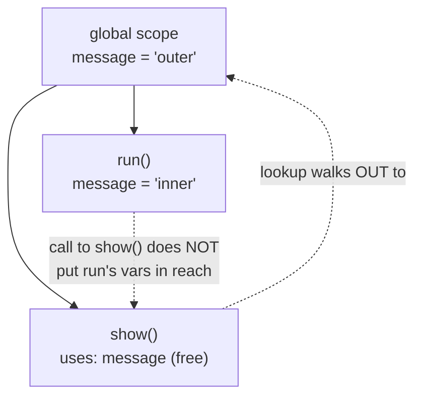

# Lexical Scope

> Lexical scope is the rule that a name is resolved by where the code is written, not where it runs. A function can read the variables of the scopes it is nested inside, decided once, at authoring time.

**Part:** [01 · Core Languages](../) · **Domain:** JavaScript · **Priority:** Critical · **Difficulty:** Foundational · **Reading time:** ~10 min

## TL;DR

*Lexical scope* (also called static scope) means the engine resolves a variable name by looking at the physical structure of the source — the nesting of functions and blocks around the point of use — not by looking at the call stack at runtime. An inner function can see the variables of every scope it is written inside, and that visibility is fixed when you write the code, so you can determine it by reading, before anything executes. This is the single rule underneath closures, module privacy, hoisting behavior, and the `let`/`var` difference. The opposite model, *dynamic scope*, where lookups follow the caller, does not exist in JavaScript — mistaking one for the other is the root of a whole class of "why is this variable `undefined`?" bugs.

> **Recommendation:** Resolve every free variable in your head by walking *outward* through the source, never by asking who called the function; keep scopes small and nesting shallow so that walk stays short.

## At a Glance

| | |
| --- | --- |
| **Use when** | Always — lexical scope is not opt-in; it is how every JavaScript name is resolved. |
| **Avoid when** | Never applicable — you cannot turn it off, only reason with or against it. |
| **Alternatives** | None in JavaScript. Dynamic scope is the theoretical contrast, but the language does not offer it. |
| **Primary risk** | Assuming a variable resolves via the caller (dynamic scope), or that a block introduces a scope when `var` ignores it. |
| **Maturity** | Stable — a core semantic since the language's first edition. |

## Prerequisites

This article assumes you can tell a declaration from a reference, and that you know a variable holds a value that other code may read or reassign.

- Primitives & Wrappers (planned) — what a binding actually holds, which clarifies what a nested scope is reaching for when it reads an outer name.

## Overview

*Lexical scope* is the policy JavaScript uses to answer one question: when a function refers to a name it did not declare itself, which binding does that name point to? The answer is decided by *where the code is written* — the text — meaning it is determined by where the reference sits in the nested structure of functions and blocks in the source file. When a scope cannot satisfy a lookup, the engine consults the scope that textually encloses it, and so on outward until it reaches the global scope; this ordered series of environments is the *scope chain*.

The crucial word is *static*: the chain is built from how the code is written, so it is knowable without running the program. This is what distinguishes lexical scope from *dynamic scope*, where a lookup would instead follow the chain of callers at runtime. JavaScript is lexically scoped for variables (with one deliberate exception, `this`, which is dynamic), and conflating the two models is the source of much confusion — so it is worth drawing the boundary sharply before going further.

## The Problem

Read this and predict what it prints:

```js
const message = 'outer';

function show() {
  console.log(message);
}

function run() {
  const message = 'inner';
  show(); // ?
}

run();
```

Intuition trained on "the value nearby wins" says `inner`, because `show` is *called* from inside `run`, right next to a `message` of `'inner'`. But lexical scope decides by where `show` is *written*, and `show` is written at the top level, so its free `message` resolves to the outer `'outer'`. The call site is irrelevant. Every engineer hits some version of this — a helper that reads a config, a callback that references state — and the bug is always the same mistaken instinct: that the *caller's* variables are in reach. They are not. Only the scopes textually surrounding the definition are.

## Why It Matters

Lexical scope is not trivia; it is the load-bearing rule beneath features you use constantly. Closures are nothing more than lexical scope surviving after the enclosing function returns — a function keeps its scope chain, so it keeps seeing its birthplace's variables. Module privacy works because names declared in a module or a factory are simply not on any outer scope chain, so nothing outside can resolve them. The notorious `var`-in-a-loop bug is a lexical-scope story: `var` binds to the function scope, so every iteration's callback shares one binding, while `let` creates a fresh block-scoped binding per iteration.

Getting the model right also changes how you read unfamiliar code. Because resolution is static, you can determine what any variable refers to by reading outward through the source — no need to trace execution or guess at call order. That makes code auditable and tooling possible: linters flag undeclared names, bundlers safely rename variables, and minifiers shrink them, all because scope is decided by text rather than by runtime behavior. Teams that internalize this reason about state precisely; teams that do not chase phantom bugs.

## Mental Model

Picture the source as a set of nested boxes. Each function and each `{ }` block draws a box, and a box may sit inside another. To resolve a name, start in the box where the name is *used* and look for a matching declaration; if it is not there, step out to the box that encloses it, then the next, until you either find it or reach the outermost box (global). You only ever step *outward*, and you step according to the drawing on the page — never according to who called whom.



Two consequences fall out. First, a variable is visible to everything nested inside its box and to nothing outside it — visibility flows inward, never outward, so an inner scope can read outer variables but an outer scope cannot see inner ones. Second, name resolution is *shadowing-aware*: an inner declaration of the same name hides the outer one for the rest of that box, because the walk stops at the first match. If you can draw the boxes, you can resolve every name — and if you cannot draw them, the fix is almost always to look at where the code is written, not where it runs.

## Best Practices

Declare variables in the narrowest scope that works. A name confined to the block or function that uses it cannot be read, shadowed, or clobbered from anywhere else, which is fewer places a bug can hide. Prefer `const` and `let`, which respect block scope, over `var`, which leaks a binding to the whole enclosing function.

Resolve names by reading outward, not by tracing calls. When a variable's value surprises you, find its declaration by walking out through the enclosing functions and blocks in the source; the call stack is a distraction for variable lookups (though not for `this`).

Avoid deep nesting and accidental shadowing. Every extra layer lengthens the scope chain a reader must walk, and reusing an outer name in an inner scope invites confusion about which binding is in play. Rename rather than shadow when both bindings are meaningful.

Do not lean on the global scope as shared state. A name on the global object is reachable from every scope chain, which makes it maximally exposed to accidental overwrites; reach for module scope or a closure when a value must be shared privately by a few functions.

## Trade-offs

Lexical scope is not a choice with a downside to weigh — it is the fixed semantics of the language. The "trade-offs" are really the properties that follow from it and the pitfalls of reasoning against it.

**Advantages**

- Static and readable: a name's meaning is knowable from the source alone, before execution.
- Enables closures, module privacy, and safe automated renaming/minification.
- Predictable: the same function resolves its free variables the same way regardless of who calls it.

**Disadvantages**

- Counterintuitive for those expecting the caller's variables to be visible (dynamic-scope thinking).
- Shadowing can silently hide an outer binding, producing bugs that read as "impossible."
- The `var`/`let` block-scope split is a frequent trap, especially in loops.

| Dimension | Lexical scope | Cost / caveat |
| --- | --- | --- |
| Predictability | Resolution fixed at author time | Requires reading structure, not runtime |
| Encapsulation | Inner scopes are private by default | Global scope defeats it if overused |
| Tooling | Enables renaming, tree-shaking, linting | `eval`/`with` can defeat static analysis |
| Correctness | Deterministic once the model is clear | Shadowing and `var` hoisting surprise the unaware |

## Alternative Approaches

There is no alternative *scoping model* to choose within JavaScript — the language is lexically scoped and does not expose a dynamic-scope mode. The honest contrast is conceptual: in a dynamically scoped language, a function's free variables would resolve against whatever is in scope at the *call site*, so the same function could see different bindings depending on who invoked it. That is how JavaScript's `this` behaves (it is set by the call, not the definition), which is exactly why arrow functions, which capture `this` lexically, exist to remove that surprise. Where you genuinely want call-site-dependent values, the lexical answer is to pass them in as arguments rather than reach for an ambient binding.

## Bad Example

Code written as if the caller's variables were in scope, plus an accidental shadow that hides the value the author meant to use.

```js
// ❌ Assumes dynamic scope and shadows an outer name.
const currency = 'USD';

function format(amount) {
  // BUG 1: `locale` is expected to come from the caller's scope, but lexical
  // scope does not reach into callers. `locale` is undeclared here, so this
  // throws a ReferenceError (or reads a stray global) — never the caller's value.
  return new Intl.NumberFormat(locale, { style: 'currency', currency }).format(amount);
}

function checkout(locale) {
  // The author believes `format()` will "see" this `locale`. It will not.
  const currency = 'EUR'; // BUG 2: shadows the outer `currency`, but format()
                          // was written outside this scope, so it still uses 'USD'.
  return format(19.99);
}

checkout('de-DE');
```

**What goes wrong:** `format` is written at the top level, so its free names resolve against the top level and nothing else. `locale` is not declared in any scope that encloses `format`, so the reference fails — the caller's `locale` is unreachable no matter how directly `checkout` calls `format`. The inner `currency = 'EUR'` looks like it should change the output, but `format` does not sit inside `checkout`'s scope, so it never sees that binding and keeps formatting in `'USD'`. Both bugs are the same mistake: expecting resolution to follow the call, not the source.

## Good Example

The same feature with values passed explicitly, so every name `format` uses is either its own parameter or resolves through the source structure as intended.

```js
// ✅ Pass call-site values in; let lexical lookups resolve statically.
const DEFAULT_CURRENCY = 'USD';

function format(amount, { locale, currency = DEFAULT_CURRENCY }) {
  // Every free name here resolves lexically: `locale` and `currency` are this
  // function's own parameters; `DEFAULT_CURRENCY` is found by walking OUT to the
  // module scope where it is declared. No reliance on the caller's environment.
  return new Intl.NumberFormat(locale, { style: 'currency', currency }).format(amount);
}

function checkout(locale) {
  // What the caller wants is handed over explicitly, not left to scope magic.
  return format(19.99, { locale, currency: 'EUR' });
}

checkout('de-DE'); // "19,99 €"
```

**Why it's better:** Nothing depends on who calls `format`. Its parameters supply the call-specific values, and its one remaining free name, `DEFAULT_CURRENCY`, resolves by the scope chain out to the module — a lookup you can verify by reading, without running anything. Because resolution is fully static, the function behaves identically regardless of call site, and there is no shadow to reason about.

## Production Example

The module pattern relies entirely on lexical scope: names declared inside a factory live on a scope chain that no outside code shares, so they are private by construction.

```js
// A small event bus whose subscriber map is unreachable from outside.
function createEventBus() {
  // `handlers` is declared in this function's scope. Nothing outside
  // createEventBus is on a scope chain that includes it, so it is private —
  // not by convention, but because lexical scope makes it unreachable.
  const handlers = new Map();

  function on(type, fn) {
    const set = handlers.get(type) ?? new Set();
    set.add(fn);
    handlers.set(type, set);
    return () => set.delete(fn); // unsubscribe closes over the same `handlers`
  }

  function emit(type, payload) {
    handlers.get(type)?.forEach((fn) => fn(payload));
  }

  // Callers receive behavior; `handlers` never leaves this scope.
  return { on, emit };
}

const bus = createEventBus();
const off = bus.on('login', (user) => console.log('welcome', user));
bus.emit('login', 'ada');
off();
```

The returned `on` and `emit` are written *inside* `createEventBus`, so their scope chain includes its locals; that is why they can both reach the same `handlers` while callers cannot. This is lexical scope doing the work usually attributed to closures: the privacy comes from *where the functions are defined*, and closures are simply that scope chain persisting after `createEventBus` returns.

## Common Mistakes

See the [JavaScript anti-patterns](../../../anti-patterns/#javascript) for the domain catalog. Concept-specific:

### Mistake: Expecting a callee to see the caller's variables

- **Symptom:** A function throws `ReferenceError` or reads a stale/global value for a name the caller "obviously" has in scope.
- **Why it fails:** Variable resolution is lexical — it follows where the function is written, not where it is called — so the caller's locals are never on the callee's scope chain.
- **Fix:** Pass the value in as an argument (or define the function inside the scope that owns the value), instead of relying on the call site.

### Mistake: Treating a block as a scope for `var`

- **Symptom:** A `var` declared inside an `if` or `for` block is visible and mutable after the block, and loop callbacks all read the final value.
- **Why it fails:** `var` is function-scoped, so it ignores block boundaries; every reference resolves to one shared binding in the enclosing function.
- **Fix:** Use `let`/`const`, which are block-scoped, so each block — and each loop iteration — gets its own binding.

## Checklist

- [ ] Free variables are resolved by reading outward through the source, not by tracing the call stack.
- [ ] Values that depend on the call site are passed as arguments rather than reached for ambiently.
- [ ] Declarations sit in the narrowest scope that works; `const`/`let` are used over `var`.
- [ ] Inner scopes do not accidentally shadow an outer name that is still needed.
- [ ] Shared private state uses module or closure scope, not a global reachable from every chain.

## Related Articles

- [Closures](./closures.md) — lexical scope that outlives its enclosing call; the direct follow-on to this article.
- Hoisting & TDZ (planned) — how bindings come into existence within a scope before code reads them.
- Block vs Function Scope (planned) — why `let` and `var` resolve so differently inside blocks and loops.

## References

- [MDN — Scope](https://developer.mozilla.org/en-US/docs/Glossary/Scope) — the concise definition and the lexical-vs-dynamic distinction.
- [MDN — Closures](https://developer.mozilla.org/en-US/docs/Web/JavaScript/Closures) — how lexical scope persists past a function's return.
- [ECMAScript — Environment Records](https://tc39.es/ecma262/#sec-environment-records) — the specification machinery that implements the scope chain.
