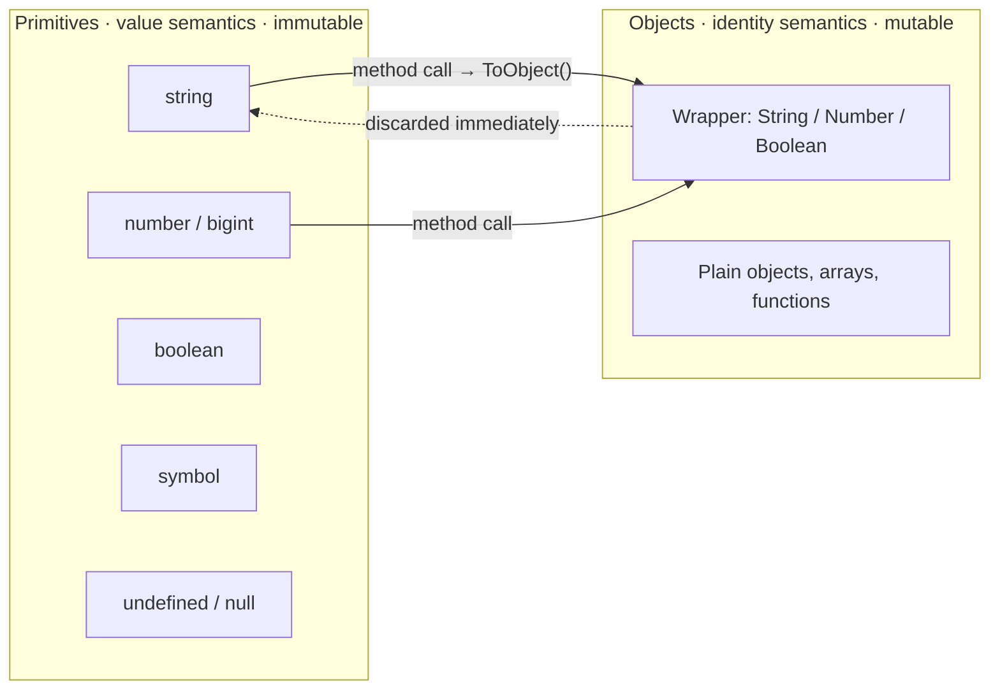

# Primitives & Wrappers

> A primitive has no methods, yet `"abc".toUpperCase()` works — the language quietly builds an object, calls the method, and throws the object away before you can see it.

**Part:** [01 · Core Languages](../) · **Domain:** JavaScript · **Priority:** Critical · **Difficulty:** Foundational · **Reading time:** ~8 min

## TL;DR

JavaScript has **seven primitive types** — `string`, `number`, `bigint`, `boolean`, `symbol`, `undefined`, `null` — and everything else is an object. Primitives are **immutable** and compared **by value**; objects are mutable and compared **by identity**. When you call a method on a primitive, the engine performs **autoboxing**: it creates a temporary wrapper object (`String`, `Number`, `Boolean`, `Symbol`, `BigInt`), reads the method from that wrapper's prototype, calls it, and discards the wrapper. That temporary is invisible, which is why assigning to it silently does nothing. The explicit constructors `new String("a")` and `new Number(0)` create *permanent* wrappers, and those behave like objects — always truthy, never `===` to the primitive they hold. There is essentially no reason to write them.

> **Recommendation:** Use primitives everywhere and never call `new String`/`new Number`/`new Boolean`. Use `typeof` for primitives and `Object.is`/`===` for comparison; treat any wrapper object you find in a codebase as a bug to unwrap.

## At a Glance

| | |
| --- | --- |
| **Use when** | Always — primitives are the default representation for text, numbers, flags, and identity keys. |
| **Avoid when** | Never avoided; only their *wrapper object* form should be avoided. |
| **Alternatives** | [Wrapper objects](#alternative-approaches), boxed value classes, `BigInt` for integers past `Number.MAX_SAFE_INTEGER`. |
| **Primary risk** | Assuming primitives are mutable (`str[0] = "X"` fails silently) or that wrapper objects compare like values. |
| **Maturity** | Stable — `symbol` since ES2015, `bigint` since ES2020; the model has not changed since. |

## Prerequisites

Values live somewhere and are produced by something, so the memory and execution model come first.

- [Trees & the DOM as a Tree](../../00-foundations/computer-science/trees-and-the-dom-as-a-tree.md) — reference-vs-value intuition applied to structures you already know.
- [Parsing & Bytecode](../../00-foundations/runtime-execution/parsing-and-bytecode.md) — how literals become values the engine can specialize on.

## Overview

A **primitive** is a value that is not an object and has no methods of its own. The seven of them:

| Type | `typeof` | Literal | Notes |
| --- | --- | --- | --- |
| String | `"string"` | `"hi"` | Immutable sequence of UTF-16 code units. |
| Number | `"number"` | `42`, `1.5` | IEEE-754 double; one `NaN`, two zeros. |
| BigInt | `"bigint"` | `9007199254740993n` | Arbitrary-precision integers; never mixes with `number`. |
| Boolean | `"boolean"` | `true` | Two values. |
| Symbol | `"symbol"` | `Symbol("id")` | Unique, unforgeable property key. |
| Undefined | `"undefined"` | `undefined` | "No value assigned." |
| Null | `"object"` | `null` | "Intentionally empty" — the `typeof` result is a famous historical bug. |

Primitives are **immutable**: every string operation returns a new string, and `s[0] = "X"` is a no-op (a `TypeError` in strict mode for frozen-like targets, silently ignored otherwise). They are also compared structurally — `"ab" === "ab"` is `true` regardless of how each string was built, because there is no identity to distinguish.

Method access is where the object system leaks in. Evaluating `value.method()` on a primitive runs `ToObject(value)`, producing a wrapper whose prototype carries the methods. `String.prototype`, `Number.prototype`, `Boolean.prototype`, `Symbol.prototype`, and `BigInt.prototype` exist precisely to serve those temporary objects. `undefined` and `null` have no wrapper, which is why they throw on property access.

## The Problem

Without understanding boxing, three behaviors look arbitrary.

```js
const s = "hello";
s.lang = "en";          // ✅ no error (sloppy mode)
console.log(s.lang);    // undefined — the wrapper that received it is gone

const n = new Number(0);
if (n) console.log("truthy");   // logs — objects are always truthy
console.log(n === 0);           // false
console.log(typeof n);          // "object"

console.log([1, 2, 3].includes(new Number(2)));  // false
```

The assignment succeeds because a *fresh* wrapper is created for that one expression, receives the property, and is immediately garbage. The `new Number(0)` case is worse: it survives, and every truthiness check, `===` comparison, `JSON.stringify` round-trip, and `Map` key lookup treats it as an unfamiliar object rather than the zero it appears to be.

The same confusion runs the other way. Because objects compare by identity, developers reach for value semantics that do not exist:

```js
const a = { id: 1 };
const b = { id: 1 };
console.log(a === b);              // false — two objects
console.log([a].includes(b));      // false
```

The rule underneath both cases is one sentence: **primitives compare by value, objects compare by identity, and boxing turns the first into the second.**

## Why It Matters

Value semantics are the reason primitives are safe to pass around. A string handed to a function cannot be mutated by that function, so no defensive copy is needed; an object can be, so one usually is. Knowing which category a value falls into decides whether you need `structuredClone`, whether a memo key is stable, and whether `useEffect`-style dependency comparison will do what you expect.

Engines lean on immutability hard. Small integers are stored unboxed, strings are interned and shared, and hidden-class machinery specializes on primitive shapes. Boxed values defeat all of it: `new Number(0)` is a heap allocation with a pointer chase where the primitive was a machine word.

Identity also drives the platform APIs. `Set` and `Map` use SameValueZero, so `new String("a")` and `new String("a")` occupy two slots while `"a"` occupies one. `Symbol` exists *because* primitives compare by value — it is the one primitive whose values are guaranteed unique, which is what makes it a collision-free property key for library metadata.

## Mental Model

Two territories, with a one-way temporary bridge between them.



Three rules follow.

**The bridge is temporary.** A wrapper created by autoboxing lives for exactly one property access. Writing to it is writing to garbage.

**`new` makes the bridge permanent, which is the bug.** `new Number(0)` opts into identity semantics for a value whose whole point is value semantics.

**`undefined` and `null` have no bridge.** `ToObject` throws on them, which is why `null.foo` is a `TypeError` rather than `undefined` — and why optional chaining (`?.`) exists.

## Best Practices

**Never use `new` with `String`, `Number`, `Boolean`.** Called *without* `new` these are conversion functions and are fine: `Number("42")`, `String(x)`, `Boolean(x)`.

**Use `typeof` for primitives, not `instanceof`.** `"x" instanceof String` is `false`; `typeof "x" === "string"` is what you meant.

**Prefer `Object.is` when `NaN` or `-0` matter.** `NaN === NaN` is `false` and `0 === -0` is `true`; `Object.is` inverts both.

**Reach for `BigInt` only past `Number.MAX_SAFE_INTEGER`.** It never mixes with `number` in arithmetic, so introducing it changes every call site downstream.

**Use `Symbol` for property keys that must not collide** — library-internal metadata on user objects, or protocol hooks like `Symbol.iterator`.

**Treat strings as immutable in hot loops.** Building a string by repeated `+=` in a large loop allocates repeatedly; collect into an array and `join("")` when the count is large.

**Normalize at the boundary.** If a value can arrive boxed (older libraries, some serialization layers), unbox once on entry with `valueOf()` rather than handling both forms everywhere.

## Trade-offs

The value/identity split is not a design you choose, but the way you represent data within it is.

**Advantages of staying primitive**

- No aliasing: a value cannot be mutated by a function you passed it to.
- Structural equality for free — `===`, `Set`, and `Map` behave intuitively.
- Cheapest representation the engine has; no allocation for small numbers, interning for strings.

**Disadvantages**

- No place to attach metadata; a "user ID" and a "post ID" are both just `number`, with nothing stopping a mix-up (a gap [branded types](../typescript/literal-and-unit-types.md) fill at the type level).
- Immutability means every transformation allocates a new value.
- `number` cannot represent integers beyond 2⁵³−1, forcing a `bigint` migration that is not backwards compatible with existing arithmetic.

| Dimension | Primitive | Wrapper object (`new Number`) | Plain object `{ value }` |
| --- | --- | --- | --- |
| Equality | By value | By identity | By identity |
| Truthiness of "empty" | `0`/`""` falsy | Always truthy | Always truthy |
| `typeof` | `"number"` / `"string"` | `"object"` | `"object"` |
| Mutable | No | Yes (properties) | Yes |
| Allocation | Often none | Always heap | Always heap |
| Sensible use | Everything | None | Deliberate reference semantics |

## Alternative Approaches

| Approach | Best when | Weakness | See |
| --- | --- | --- | --- |
| Primitive values | Always the default | No metadata, no nominal identity | (this article) |
| `Symbol` keys | Metadata must not collide with user keys | Not JSON-serializable; harder to debug | (this article) |
| `BigInt` | Integers exceeding 2⁵³−1 (IDs, currency in minor units) | Cannot mix with `number`; no `JSON` support | (this article) |
| Branded/nominal types | You want `UserId` and `PostId` to be incompatible | Type-level only; erased at runtime | [Literal & Unit Types · TypeScript](../typescript/literal-and-unit-types.md) |
| Explicit wrapper objects | Never in practice | Identity semantics, truthiness traps | (this article) |

## Bad Example

A "value object" layer built on wrapper objects and mutation assumptions.

```js
// ❌ Boxing to "attach behavior" to values.
function createScore(n) {
  const score = new Number(n);
  score.label = n >= 50 ? "pass" : "fail";
  return score;
}

const zero = createScore(0);

// ❌ Objects are always truthy — the guard never fires for a zero score.
if (!zero) {
  console.log("no score recorded");
}

// ❌ Identity comparison against a primitive.
if (zero === 0) {
  console.log("zero");            // never runs
}

// ❌ Set/Map treat every box as a distinct key.
const seen = new Set();
seen.add(createScore(10));
seen.add(createScore(10));
console.log(seen.size);           // 2

// ❌ Mutating a string primitive, silently.
function redact(name) {
  name[0] = "*";                  // no-op; `name` is unchanged
  return name;
}
console.log(redact("Ada"));       // "Ada"

// ❌ Serialization loses the attached data anyway.
console.log(JSON.stringify({ score: zero }));   // {"score":0}
```

**What goes wrong:** `createScore` returns an object, so the falsy check on a legitimate score of `0` never fires and the "no score recorded" branch is dead code — the exact bug boxing is famous for. `zero === 0` is `false` because the comparison is between an object and a number, so the equality path silently takes the wrong branch instead of throwing where you could see it. The `Set` stores two entries for the same conceptual score because each `new Number(10)` is a distinct identity. `redact` looks like it mutates but strings are immutable, so the assignment is discarded and the function returns its input untouched — with no error to point at. And the `label` property, the entire reason the box existed, vanishes on serialization because `JSON.stringify` unwraps `Number` objects through `valueOf`. Every one of these failures is silent.

## Good Example

Primitives kept primitive, with structure expressed as data.

```js
// ✅ A plain object carries the metadata; the value stays a number.
function createScore(value) {
  return { value, label: value >= 50 ? "pass" : "fail" };
}

const zero = createScore(0);

// ✅ Falsy checks operate on the primitive, so 0 behaves as 0.
if (zero.value === 0) {
  console.log("zero");
}

// ✅ Set/Map key on the primitive — value semantics, one entry.
const seen = new Set();
seen.add(createScore(10).value);
seen.add(createScore(10).value);
console.log(seen.size);          // 1
```

```js
// ✅ Immutability made explicit: transform, don't mutate.
function redact(name) {
  return "*" + name.slice(1);
}
console.log(redact("Ada"));      // "*da"
```

```js
// ✅ typeof for primitives; Object.is where NaN and -0 matter.
const isString = (v) => typeof v === "string";
const isSameValue = (a, b) => Object.is(a, b);

console.log(isSameValue(NaN, NaN));   // true  (=== would be false)
console.log(isSameValue(0, -0));      // false (=== would be true)

// ✅ Symbol for a key that cannot collide with user data.
const INTERNAL = Symbol("cache");
function attachCache(target, cache) {
  target[INTERNAL] = cache;      // invisible to JSON, Object.keys, spread
  return target;
}

// ✅ BigInt only where the range demands it — and never mixed with number.
const twitterSnowflakeId = 1789012345678901234n;
console.log(twitterSnowflakeId + 1n);   // fine
// console.log(snowflakeId + 1);        // TypeError: cannot mix BigInt and other types
```

```js
// ✅ Unbox once at the boundary if a legacy layer hands you wrappers.
const unbox = (v) =>
  v instanceof Number || v instanceof String || v instanceof Boolean
    ? v.valueOf()
    : v;
```

**Why it's better:** The score is a plain object whose `value` is a real number, so `0` stays falsy where it should be and comparisons against numeric literals behave. Keying the `Set` on the primitive gives value semantics, so identical scores deduplicate — the intent of using a `Set` at all. `redact` returns a new string rather than pretending to mutate one, which makes the immutability of strings visible in the signature instead of hidden in a no-op. `Object.is` handles the two cases where `===` is deliberately non-reflexive, so `NaN` deduplication and `-0` detection are correct rather than accidentally right. The `Symbol` key attaches internal state without appearing in `Object.keys`, spreads, or JSON, which is exactly what "internal" should mean. And `unbox` confines wrapper handling to one boundary function, so no downstream code has to ask whether it received a `Number` or a number.

## Common Mistakes

See the [JavaScript anti-patterns](../../../anti-patterns/) for the domain catalog. Concept-specific:

### Mistake: Using `new Number` / `new String` / `new Boolean`

- **Symptom:** A falsy value (`0`, `""`, `false`) passes a truthiness check, or `===` against a literal fails for values that print identically.
- **Why it fails:** These constructors return objects. Every object is truthy, and `===` between an object and a primitive is always `false` — the printed representation hides the difference.
- **Fix:** Call the functions without `new` for conversion (`Number(x)`), or use literals. If a wrapper reaches you from elsewhere, unbox with `.valueOf()` at the boundary.

### Mistake: Assigning properties to a primitive

- **Symptom:** `str.meta = {...}` runs without error but `str.meta` reads back as `undefined`.
- **Why it fails:** The assignment targets a temporary wrapper created for that one expression, which is discarded immediately afterwards. In strict mode it throws instead of failing silently.
- **Fix:** Store the association in a `Map` keyed by the value, or model the pair as an object (`{ value, meta }`).

### Mistake: Expecting `typeof null === "null"`

- **Symptom:** A `typeof v === "object"` guard lets `null` through and the next property access throws.
- **Why it fails:** `typeof null` returns `"object"`, a bug preserved for backwards compatibility since 1995. `null` is a primitive with no wrapper, so property access on it throws.
- **Fix:** Check `v !== null && typeof v === "object"`, or use `v == null` to catch `null` and `undefined` together.

## Checklist

- [ ] No `new String`, `new Number`, or `new Boolean` anywhere in the codebase.
- [ ] Type guards use `typeof` for primitives, not `instanceof`.
- [ ] `null` is excluded explicitly wherever `typeof v === "object"` is used.
- [ ] `Object.is` is used where `NaN` or `-0` semantics matter.
- [ ] Metadata about a value lives in an object or a `Map`, never assigned onto the primitive.
- [ ] `Symbol` is used for keys that must not collide with user-supplied properties.
- [ ] `BigInt` appears only where values can exceed `Number.MAX_SAFE_INTEGER`, and never mixes with `number`.
- [ ] String building in hot loops collects into an array and joins once.

## Related Articles

- [Coercion & Conversion](./) (planned) — what happens when a primitive of one type is asked to behave as another.
- [Equality & Comparison](./) (planned) — `==`, `===`, and `Object.is` in full, including the boxing rules.
- [null, undefined & Nullish](./) (planned) — the two absence primitives and the operators built for them.
- [Lexical Scope](./lexical-scope.md) — where these values live and how long they stay reachable.
- [Literal & Unit Types · TypeScript](../typescript/literal-and-unit-types.md) — recovering nominal distinctions primitives cannot express at runtime.

## References

- [ECMAScript — ECMAScript Language Types](https://tc39.es/ecma262/#sec-ecmascript-language-types) — the normative list of the seven primitives and the Object type.
- [ECMAScript — `ToObject`](https://tc39.es/ecma262/#sec-toobject) — the boxing operation, including why `null` and `undefined` throw.
- [MDN — Primitive](https://developer.mozilla.org/en-US/docs/Glossary/Primitive) — the practical summary, with the autoboxing example.
- [MDN — JavaScript data types and data structures](https://developer.mozilla.org/en-US/docs/Web/JavaScript/Guide/Data_structures) — type-by-type reference including `BigInt` and `Symbol`.
