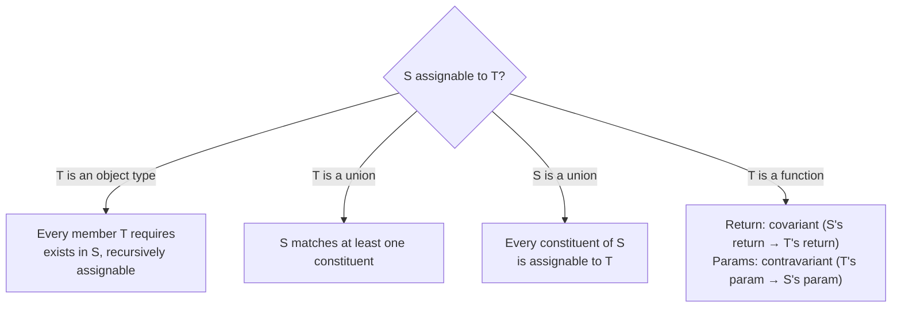

# Assignability

> Assignability is the one question the compiler asks at every assignment, argument, and return — and knowing its rules turns most type errors from mysteries into arithmetic.

**Part:** [01 · Core Languages](../) · **Domain:** TypeScript · **Priority:** Critical · **Difficulty:** Foundational · **Reading time:** ~8 min

## TL;DR

**Assignability** decides whether a value of type `S` may be used where type `T` is expected. For object types the rule is width: `S` is assignable to `T` when `S` has every member `T` requires, at assignable types. Around that core sit four modifiers that produce most real errors — **unions** (assignable when *every* constituent is), **function variance** (parameters contravariant under `strictFunctionTypes`, methods bivariant), **freshness** (object literals get an extra excess-property check), and the **unsound escapes** (`any` in both directions, array covariance). TypeScript deliberately accepts some unsound assignments for ergonomics, so "it compiles" is not the same as "it is correct."

> **Recommendation:** Read every assignability error as *which member or which parameter position failed*, and fix the type there; reach for `as` only when you can name the invariant the compiler cannot see.

## At a Glance

| | |
| --- | --- |
| **Use when** | Always — every assignment, argument, return, and generic instantiation is an assignability check. |
| **Avoid when** | Never avoidable; the choice is whether you understand the rule or fight it with casts. |
| **Alternatives** | [Branded types](./structural-typing.md#alternative-approaches), [`unknown` with narrowing](#alternative-approaches), runtime validation. |
| **Primary risk** | Assuming assignability implies soundness — bivariant methods, array covariance, and `any` all accept wrong programs. |
| **Maturity** | Stable — the rules have been fixed since `strictFunctionTypes` shipped in TypeScript 2.6. |

## Prerequisites

Assignability is the algorithm that runs on top of structural comparison, so the shape rules come first.

- [Structural Typing](./structural-typing.md) — why compatibility is decided by members rather than names.

## Overview

**Assignability** is the relation `S → T`: can an expression of type `S` appear where the compiler expects `T`? Every error that begins "Type X is not assignable to type Y" is this relation failing, and the rest of the message names the exact position where it failed — a missing property, a wrong parameter, an incompatible return.

It is worth separating assignability from two neighbors it is often confused with. **Subtyping** is a stricter relation used internally for things like best-common-type inference; assignability is subtyping plus a few deliberate relaxations (notably `any`, and `undefined`/`null` under non-strict settings). **Identity** is stricter still — two types being mutually assignable does not make them the same type, which is why an error can appear on one side of a swap and not the other.

The relation is directional, and the direction is the thing readers most often lose track of. `{ id: string; name: string }` is assignable to `{ id: string }`, never the reverse. Everything below is a consequence of that direction applied through unions, functions, and generics.

## The Problem

The failure mode is not that assignability is wrong; it is that its error messages are read as noise. A team hits `Type 'string | undefined' is not assignable to type 'string'`, and instead of fixing the source of the `undefined`, someone writes `value!` or `value as string`. The assertion silences the check at that line and moves the failure to runtime, usually far from the file that changed.

The second problem is variance surprise. A `(e: MouseEvent) => void` handler is rejected where `(e: Event) => void` is expected, which reads backwards to anyone who thinks "a `MouseEvent` *is* an `Event`, so my handler is fine." The parameter position inverts the direction, and until that clicks the fix looks arbitrary.

```ts
const handlers: Array<(e: Event) => void> = [];
handlers.push((e: MouseEvent) => console.log(e.clientX));
// ❌ Type '(e: MouseEvent) => void' is not assignable to type '(e: Event) => void'.
//    Types of parameters 'e' and 'e' are incompatible.
```

The third is the opposite: assignments that *should* fail and do not. Arrays are covariant in TypeScript, so `Dog[]` is assignable to `Animal[]`, and writing a `Cat` through the widened reference typechecks while corrupting the original array. The compiler accepts it knowingly — the alternative would reject a large amount of correct, ordinary code.

## Why It Matters

Assignability is the interface between every part of a codebase. Props flowing into a component, a payload flowing into a mutation, a callback handed to a library — each crossing is an assignability check, so the rules determine how much a refactor can break silently and how much it breaks loudly at compile time.

It also decides what an error message costs the team. Read fluently, a nested assignability error is a precise map: the compiler tells you the exact property path and parameter index where two shapes diverge. Read as noise, that same message produces a cast, and a cast at a boundary removes checking for everything downstream of it, not just the line that annoyed someone.

Finally, knowing where TypeScript is deliberately unsound tells you where tests and runtime checks still have to do the work. Method bivariance, array covariance, and `any` are not bugs to report; they are documented trade-offs, and the code around them needs the care the type system is explicitly not providing.

## Mental Model

Picture assignability as **a checklist walked recursively, with the arrows flipping inside parameter positions**.



Four refinements carry most of the day-to-day behavior.

**Unions flip with the side they are on.** `S` being a union means *every* member must be assignable to `T`; `T` being a union means `S` must match *at least one* member. That asymmetry explains why `string | undefined` fails against `string` but `string` succeeds against `string | undefined`.

**Functions are covariant in return, contravariant in parameters.** A function may return something more specific than promised and must accept something at least as general as promised. Under `strictFunctionTypes` this is enforced for function-type properties — but **methods declared with method syntax stay bivariant**, because the standard library and DOM types depend on it. That exception is the single most common source of "why did this compile?"

**Freshness is a separate, stricter pass.** A fresh object literal assigned directly to a target is additionally rejected for properties the target does not declare. Storing it in a variable first removes the freshness, not the assignability check.

**`any` is assignable both ways, `never` to everything, `unknown` from everything.** These three sit at the edges of the lattice and are covered in [unknown, never & any](./unknown-never-and-any.md); the relevant point here is that `any` makes the relation vacuously true in both directions, which is why one `any` propagates failure far past where it was introduced.

## Best Practices

**Read the last line of the error first.** TypeScript reports the outermost mismatch first and narrows through nested causes; the deepest line names the actual property or parameter that failed.

**Fix the type at the source of the mismatch, not the site of the complaint.** If a value is `string | undefined`, the question is whether `undefined` is genuinely possible — narrow it, default it, or make the source non-optional. Asserting it away moves the bug rather than removing it.

**Enable `strictFunctionTypes` and prefer property syntax for callbacks.** Declaring `onChange: (value: string) => void` gets contravariant checking; declaring `onChange(value: string): void` opts into bivariance and accepts handlers that are too specific.

**Prefer `readonly` array parameters when you only read.** `readonly T[]` accepts both mutable and readonly arrays, so it widens what callers may pass while removing the write that makes covariance unsound.

**Do not use `as` to bridge two object types.** A cast between unrelated shapes is a claim the compiler cannot check; if the shapes genuinely differ, write a mapping function, which also gives you a place to handle the fields that do not correspond.

**Reach for `satisfies` when you want checking without widening.** `const config = { … } satisfies Config` verifies assignability and keeps the literal's narrow inferred type, where an annotation would widen it.

## Trade-offs

Assignability trades a small amount of soundness for the ability to describe JavaScript that already exists.

**Advantages**

- One recursive rule explains assignments, arguments, returns, and generic instantiation, so learning it pays off everywhere.
- The deliberate relaxations keep ordinary code — array reuse, DOM event handlers, library callbacks — compiling without ceremony.
- Errors are positional: the message names the exact member or parameter that failed, which makes large refactors tractable.

**Disadvantages**

- Method bivariance and array covariance accept programs that are wrong at runtime, and neither is reported.
- `any` short-circuits the relation in both directions, so a single loose type silently disables checking downstream.
- Deeply nested generic mismatches produce long, hard-to-read errors, which pushes people toward casts.

| Dimension | Assignability as designed | Cost / caveat |
| --- | --- | --- |
| Soundness | High for object width and function returns | Bivariant methods and covariant arrays are unsound by design |
| Ergonomics | Existing JavaScript patterns typecheck unchanged | The relaxations are invisible until they bite |
| Error quality | Positional and specific | Nested generics produce long chains that hide the root cause |
| Refactor safety | Shape changes surface at every crossing | One `any` erases the signal across a whole subtree |
| Learnability | A single recursive rule | Variance and freshness are exceptions that must be memorized |

## Alternative Approaches

There is no alternative to assignability itself; the alternatives are what to do when a check fails.

| Approach | Best when | Weakness | See |
| --- | --- | --- | --- |
| Narrow with a type guard | The value genuinely can be several things | Requires a runtime check on every path | [Literal & Unit Types](./literal-and-unit-types.md) |
| `satisfies` | You want a check without losing the literal type | TypeScript 4.9+; not a replacement for annotation on a mutable binding | (this article) |
| `unknown` + parse at the boundary | Data comes from outside the program | Runtime cost; needs a schema to stay in sync | [unknown, never & any](./unknown-never-and-any.md) |
| Branded types | Two same-shaped values must not interchange | Needs a constructor; compile-time only | [Structural Typing](./structural-typing.md#alternative-approaches) |
| `as` assertion | You hold an invariant the compiler cannot express | Disables checking entirely, including unrelated mistakes in the same expression | (this article) |

## Bad Example

A settings module that treats assignability errors as obstacles.

```ts
// ❌ Every failure is silenced instead of understood.
type Theme = 'light' | 'dark';
type Settings = { theme: Theme; fontSize: number; locale: string };

function loadSettings(raw: Record<string, unknown>): Settings {
  return raw as Settings; // asserts across an unchecked boundary
}

const stored = loadSettings(JSON.parse(localStorage.getItem('settings') ?? '{}'));
document.body.dataset.theme = stored.theme; // 'dark-mode' at runtime, nobody noticed

// ❌ Bivariance smuggled in through method syntax.
interface Store {
  subscribe(listener: (event: Event) => void): void;
}
const store: Store = createStore();
store.subscribe((event: CustomEvent) => console.log(event.detail));
// Compiles. Throws when a plain Event arrives and `.detail` is undefined.

// ❌ Covariant array write.
const cats: Cat[] = [siamese];
const animals: Animal[] = cats;   // allowed
animals.push(labrador);           // allowed — `cats` now contains a Dog
cats[1].meow();                   // TypeError at runtime

// ❌ `any` used to end an argument with the compiler.
function applyPatch(settings: Settings, patch: any) {
  return { ...settings, ...patch }; // return type is Settings; patch could be anything
}
applyPatch(stored, { fontSize: 'large' }); // no error, breaks layout math downstream
```

**What goes wrong:** Four distinct holes, none of them reported. The `raw as Settings` assertion claims a shape nobody verified, so a `theme` of `'dark-mode'` — a value outside the union — flows through the program with the compiler believing it is `Theme`. The `subscribe` declaration uses method syntax, which stays bivariant even under `strictFunctionTypes`, so a listener that is *too specific* is accepted and reads `.detail` off events that do not have it. The array assignment is legal covariance, and the `push` through the widened alias mutates `cats`, which now violates its own type. And `patch: any` makes the spread accept anything at all while the return type still claims `Settings`, so a `fontSize` of `'large'` typechecks as a `number` for every later reader.

## Good Example

The same module, with each failure fixed at its source.

```ts
// ✅ Parse at the boundary; the type describes data that was actually checked.
const THEMES = ['light', 'dark'] as const;
type Theme = (typeof THEMES)[number];
type Settings = { theme: Theme; fontSize: number; locale: string };

const isTheme = (v: unknown): v is Theme =>
  typeof v === 'string' && (THEMES as readonly string[]).includes(v);

const DEFAULTS: Settings = { theme: 'light', fontSize: 16, locale: 'en-US' };

export function parseSettings(raw: unknown): Settings {
  if (typeof raw !== 'object' || raw === null) return DEFAULTS;
  const o = raw as Record<string, unknown>;
  return {
    theme: isTheme(o.theme) ? o.theme : DEFAULTS.theme,
    fontSize: typeof o.fontSize === 'number' && Number.isFinite(o.fontSize)
      ? o.fontSize
      : DEFAULTS.fontSize,
    locale: typeof o.locale === 'string' ? o.locale : DEFAULTS.locale,
  };
}
```

```ts
// ✅ Property syntax gets contravariant parameter checking under strictFunctionTypes.
interface Store {
  subscribe: (listener: (event: Event) => void) => () => void;
}

store.subscribe((event: CustomEvent) => console.log(event.detail));
// ❌ Type '(event: CustomEvent) => void' is not assignable to '(event: Event) => void'.
//    The listener must accept every Event the store can send.

const unsubscribe = store.subscribe((event) => {
  // ✅ Narrow inside the handler, where the check is real.
  if (event instanceof CustomEvent) console.log(event.detail);
});
```

```ts
// ✅ `readonly` removes the write that made covariance unsound.
function describeAll(animals: readonly Animal[]): string {
  return animals.map((a) => a.name).join(', ');
}
describeAll(cats);   // still accepts Cat[]
// animals.push(labrador) — ❌ Property 'push' does not exist on type 'readonly Animal[]'.

// ✅ A typed patch keeps the return type honest.
function applyPatch(settings: Settings, patch: Partial<Settings>): Settings {
  return { ...settings, ...patch };
}
applyPatch(stored, { fontSize: 'large' });
// ❌ Type 'string' is not assignable to type 'number'.

// ✅ `satisfies` checks assignability without widening the literal.
const FEATURE_FLAGS = {
  newEditor: true,
  betaSearch: false,
} satisfies Record<string, boolean>;
// FEATURE_FLAGS.newEditor is `boolean` here, and the key set stays exact,
// so `FEATURE_FLAGS.newEdit0r` is a compile error rather than `undefined`.
```

**Why it's better:** `parseSettings` takes `unknown` and returns a value the compiler's type actually describes, because every field was checked on the way in — the assignability claim is now backed by a runtime test instead of an assertion. Switching `subscribe` to property syntax turns on contravariant parameter checking, so the too-specific listener is rejected at the call site and the correct fix (narrow inside the handler) is the obvious one. `readonly Animal[]` accepts exactly the same callers as `Animal[]` while removing `push`, which is the operation that made covariance dangerous in the first place. `Partial<Settings>` gives the patch a real type, so a `string` in a `number` field fails at the call rather than in layout code three modules away. And `satisfies` verifies the flags object against `Record<string, boolean>` without widening it, keeping typo protection on the key set.

## Common Mistakes

See the [TypeScript anti-patterns](../../../anti-patterns/) for the domain catalog. Concept-specific:

### Mistake: Reading the assignability direction backwards

- **Symptom:** "A `Dog` is an `Animal`, so why can't I pass `(a: Dog) => void` where `(a: Animal) => void` is expected?"
- **Why it fails:** Parameter positions are contravariant. The consumer will call the callback with *any* `Animal`, so the callback must accept every `Animal`, not merely the `Dog` subset. Return positions go the other way, which is why returning a `Dog` where an `Animal` is promised is fine.
- **Fix:** Widen the parameter to what the caller can actually send, then narrow inside the function body with `instanceof` or a discriminant check.

### Mistake: Using `!` or `as` on a `string | undefined` error

- **Symptom:** `const id = params.id!;` appears wherever `strictNullChecks` complains.
- **Why it fails:** The non-null assertion tells the compiler the value is present without checking, so the `undefined` that the type correctly predicted reaches runtime — usually as "cannot read property of undefined" somewhere else.
- **Fix:** Handle the absent case where it originates: default it, return early, or make the producing type non-optional if `undefined` is genuinely impossible.

### Mistake: Trusting method-syntax callbacks to be checked strictly

- **Symptom:** A handler that reads properties the base event type does not have compiles cleanly, then throws.
- **Why it fails:** `strictFunctionTypes` exempts parameters of members declared with method syntax; they remain bivariant so that built-in types like `Array.prototype.push` keep working.
- **Fix:** Declare callback-taking members as properties with function types (`subscribe: (l: Listener) => void`), which restores contravariant checking.

## Checklist

- [ ] `strict` (and therefore `strictFunctionTypes` and `strictNullChecks`) is enabled in `tsconfig.json`.
- [ ] Callback-accepting members are declared as properties with function types, not method syntax.
- [ ] Array parameters that are only read are typed `readonly T[]`.
- [ ] No `as` assertion bridges two object shapes; a mapping function does it instead.
- [ ] `!` appears only where an invariant is documented in a comment on the same line.
- [ ] Data from outside the program enters as `unknown` and is parsed before it is typed.
- [ ] `satisfies` is used where a literal must be checked without being widened.
- [ ] Assignability errors were fixed at the reported position, not at the line that complained.

## Related Articles

- [Structural Typing](./structural-typing.md) — the shape comparison assignability is built on.
- [unknown, never & any](./unknown-never-and-any.md) — the three types at the edges of the assignability lattice.
- [Literal & Unit Types](./literal-and-unit-types.md) — how literal widening changes what is assignable to what.
- [Unions & Intersections](./unions-and-intersections.md) — the composition rules the union cases above depend on.

## References

- [TypeScript Handbook — Type Compatibility](https://www.typescriptlang.org/docs/handbook/type-compatibility.html) — the normative description of the assignability relation, including function comparison.
- [TypeScript Handbook — More on Functions](https://www.typescriptlang.org/docs/handbook/2/functions.html) — parameter and return checking, including the method-syntax exception.
- [TSConfig Reference — `strictFunctionTypes`](https://www.typescriptlang.org/tsconfig/#strictFunctionTypes) — what the flag enables and what it deliberately exempts.
