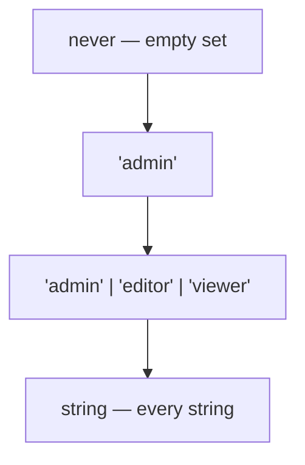

<!-- cspell:ignore primry -- deliberate typo in the Bad Example -->

# Literal & Unit Types

> A literal type has exactly one value, which is what lets the compiler tell `'admin'` from `'adnim'` — and what makes discriminated unions, exhaustive switches, and typed configuration possible.

**Part:** [01 · Core Languages](../) · **Domain:** TypeScript · **Priority:** Critical · **Difficulty:** Foundational · **Reading time:** ~8 min

## TL;DR

A **literal type** (also called a *unit type*) is inhabited by a single value: `'admin'`, `42`, `true`, `1000n`. On its own it is nearly useless; combined into unions it becomes the backbone of domain modelling in TypeScript, because a union of literals is a closed set the compiler can check for exhaustiveness. The rule that trips everyone is **widening**: `let` bindings and mutable object properties widen a literal to its base type (`'admin'` becomes `string`), while `const` bindings and `as const` assertions keep it narrow. Deciding where to stop widening is most of the practical skill.

> **Recommendation:** Model closed sets as unions of string literals with `as const` arrays as the runtime source; reach for `enum` only when you need a runtime object with reverse mapping.

## At a Glance

| | |
| --- | --- |
| **Use when** | A value comes from a fixed, known set — statuses, variants, roles, event names, HTTP methods. |
| **Avoid when** | The set is open or user-supplied; then validate at the boundary and widen to `string` deliberately. |
| **Alternatives** | [`enum`](#alternative-approaches), [branded strings](./structural-typing.md#alternative-approaches), plain `string` with runtime validation. |
| **Primary risk** | Unintended widening silently turns a checked set back into `string`, removing every guarantee. |
| **Maturity** | Stable — literal types since TypeScript 1.8, `as const` since 3.4, template literal types since 4.1. |

## Prerequisites

Literal types are ordinary types with one value, so how the compiler compares types comes first.

- [Structural Typing](./structural-typing.md) — how compatibility is decided.
- [Assignability](./assignability.md) — why `'admin'` is assignable to `string` and not the reverse.

## Overview

A **literal type** names one value. `type Role = 'admin'` admits the string `'admin'` and nothing else. Because a literal is a subtype of its base type, `'admin'` is assignable to `string`, while `string` is not assignable to `'admin'` — that direction is the entire reason literals add safety.

The useful form is almost always a union: `type Role = 'admin' | 'editor' | 'viewer'`. This is a *closed set*, and closed sets are what let the compiler narrow inside a `switch`, verify exhaustiveness with `never`, and reject `'Admin'` at the point it is written rather than at the point it is compared.

The boundary to be clear about is **widening**. TypeScript infers the narrowest useful type at a `const` binding and the base type at a mutable one, because a mutable binding will probably be reassigned. `const role = 'admin'` has type `'admin'`; `let role = 'admin'` has type `string`; `{ role: 'admin' }` has property type `string`. This is not a bug, but it is the source of most "why is this `string`?" confusion, and `as const` is the instruction that turns it off.

## The Problem

Without literal types, a domain vocabulary is stringly typed, and the compiler is blind to the difference between a valid member and a typo.

```ts
// Every one of these compiles. One of them is a bug.
function setStatus(status: string) { /* … */ }
setStatus('loading');
setStatus('Loading');
setStatus('lodaing');
```

Teams respond by adding runtime guards — an `if` that logs a warning, a lookup table with a fallback — which pushes detection to the moment the code runs, and often to a code path nobody exercises before release.

The second problem is widening in configuration objects, where a value that *looks* literal is not. This is the shape of the error most people meet first in React or a router config:

```ts
const options = { method: 'POST', cache: 'no-store' };
fetch(url, options);
// ❌ Type 'string' is not assignable to type 'RequestMethod'.
//    The object's properties widened to `string` when it was created.
```

The third is enum overuse. `enum Role { Admin, Editor }` looks like the tool for a closed set, but numeric enums are assignable from arbitrary numbers in older TypeScript versions, all enums emit a runtime object, and `const enum` interacts badly with isolated module transpilers such as Vite and esbuild. A union of string literals covers most cases with no runtime footprint.

## Why It Matters

Domain unions are where the type system pays for itself in application code. Statuses, roles, plan tiers, event names, and feature flags are all closed sets, and modelling them as literal unions turns an entire class of bug — a value outside the set — into a compile error, without a single runtime check.

Literal unions are also the precondition for **exhaustiveness**. A discriminated union narrowed by a literal discriminant lets `never` prove that a `switch` handles every case, so adding a state to the union breaks the build at each place that must change. That guarantee does not exist for `string`, which is why the same code with widened types silently keeps compiling and silently stops working.

There is a cross-cutting benefit too: literal types are what make editor autocomplete useful. A parameter typed `'sm' | 'md' | 'lg'` offers three options; a parameter typed `string` offers none, and the reader has to find the documentation.

## Mental Model

Think of a literal type as **a set with one element**, and a union of literals as the explicit enumeration of a set. Assignability is subset inclusion.



Three rules govern where a value lands in that picture.

**Widening happens at mutable positions.** `const` keeps the literal; `let`, `var`, and object properties widen to the base type. A literal type annotation (`let role: Role = 'admin'`) prevents widening because the annotation, not inference, decides.

**`as const` freezes an entire expression.** Applied to an object or array literal, it makes every property `readonly` and every value its literal type, recursively. `['light', 'dark'] as const` has type `readonly ['light', 'dark']`, from which `(typeof themes)[number]` derives the union `'light' | 'dark'` — one declaration serving both the runtime list and the type.

**Narrowing is comparison against a literal.** `if (status === 'ready')` narrows the union in the true branch, and a `switch` on a discriminant property narrows the whole object type. This is what makes discriminated unions work: `{ kind: 'ok'; data: T } | { kind: 'err'; error: E }` narrows to one member as soon as `kind` is compared.

**Template literal types compose them.** `` type Event = `user:${'created' | 'deleted'}` `` produces `'user:created' | 'user:deleted'`, which is how typed event buses and CSS-token unions are built without listing every combination by hand.

## Best Practices

**Derive the union from the runtime array, not the other way round.** `const ROLES = ['admin', 'editor', 'viewer'] as const;` then `type Role = (typeof ROLES)[number];` — the list is iterable at runtime and the type can never drift from it.

**Annotate object literals whose properties must stay narrow**, or apply `as const`. `const opts = { method: 'POST' } as const` and `const opts: RequestInit = { method: 'POST' }` both work; an unannotated mutable object does not.

**Use a literal discriminant on every union member.** A `kind`, `type`, or `status` property with a distinct literal value is what makes narrowing possible; unions of structurally similar objects without one cannot be narrowed reliably.

**Prefer string literals to numeric ones for domain values.** They survive serialization, appear readably in logs and devtools, and cannot be confused with an index or a count.

**Use `satisfies` when a config object must be checked but stay narrow.** An annotation widens the values to the annotated type; `satisfies` checks against it and keeps the literals, so lookups on the object remain precisely typed.

**Do not widen a union at a function parameter to "be flexible."** Accepting `string` because a caller found the union inconvenient moves the error from their file to yours.

## Trade-offs

Literal unions trade a little flexibility for a closed, checkable vocabulary.

**Advantages**

- A value outside the set is a compile error, with no runtime cost and no validation code.
- Editors autocomplete the members, so the API documents itself at the call site.
- Combined with `never`, they make exhaustiveness a build-time guarantee rather than a review responsibility.

**Disadvantages**

- Widening rules are unintuitive, and a missing `as const` produces an error far from its cause.
- Very large unions (hundreds of members, or template literal combinations) slow down type checking noticeably.
- The set is closed by definition, so genuinely extensible vocabularies need a different model.

| Dimension | Literal unions | Cost / caveat |
| --- | --- | --- |
| Safety | Invalid members rejected at compile time | Only for values known statically; runtime input still needs validation |
| Runtime footprint | None — types are erased | The runtime list must be declared separately (`as const`) |
| Ergonomics | Autocomplete and narrowing everywhere | Widening surprises, especially in object literals |
| Extensibility | Closed set, deliberately | Third-party extension requires a `string & {}` escape or a different design |
| Compiler performance | Fine at typical sizes | Template literal explosions can produce thousands of members |

## Alternative Approaches

| Approach | Best when | Weakness | See |
| --- | --- | --- | --- |
| Union of string literals | The default for closed sets | No runtime object; needs `as const` for iteration | (this article) |
| `as const` object + `(typeof X)[keyof typeof X]` | You need a namespaced runtime constant | Slightly more ceremony than a bare array | (this article) |
| `enum` | You need reverse mapping or a nominal-ish runtime value | Emits runtime code; `const enum` breaks under isolated transpilation | (this article) |
| Branded `string` | The set is open but values must be validated | Compile-time only; needs a constructor | [Structural Typing](./structural-typing.md#alternative-approaches) |
| `string` + schema validation | The value comes from outside the program | Runtime cost; the type is only as good as the schema | [unknown, never & any](./unknown-never-and-any.md) |

## Bad Example

A component API and a fetch layer that both lose their literals to widening.

```ts
// ❌ The vocabulary exists in comments, not in types.
type ButtonProps = {
  /** 'primary' | 'secondary' | 'danger' */
  variant: string;
  /** 'sm' | 'md' | 'lg' */
  size: string;
};

<Button variant="primry" size="medium" />; // both wrong, both compile

// ❌ Widened object properties.
const requestOptions = { method: 'POST', credentials: 'include' };
await fetch('/api/orders', requestOptions);
// ❌ Type 'string' is not assignable to type 'RequestCredentials'.

// ❌ The list and the type are declared twice and drift.
type Locale = 'en-US' | 'de-DE' | 'fr-FR';
const SUPPORTED_LOCALES = ['en-US', 'de-DE', 'fr-FR', 'es-ES']; // es-ES added here only

// ❌ A numeric enum used as a domain vocabulary.
enum Status { Idle, Loading, Ready }
function render(status: Status) {
  if (status === Status.Ready) return <Chart />;
  return <Spinner />;
}
logger.info(`status=${status}`); // logs "status=2" — unreadable in production
```

**What goes wrong:** The `variant: string` prop documents its options in a comment, so `"primry"` reaches the component and falls through whatever style lookup it hits, usually rendering an unstyled button. `requestOptions` is a mutable object literal, so `credentials` widens to `string` and `fetch` rejects it — the error appears at the call, not at the declaration where the fix belongs. `SUPPORTED_LOCALES` and `Locale` are independent declarations, so adding `'es-ES'` to the array compiles while every type-level consumer still believes there are three locales. And the numeric enum serializes as `2`, which means logs, analytics events, and stored preferences all carry a number whose meaning depends on the declaration order — reorder the members and yesterday's persisted data means something else.

## Good Example

The same code with a single source for each vocabulary.

```ts
// ✅ One declaration produces both the runtime list and the type.
export const VARIANTS = ['primary', 'secondary', 'danger'] as const;
export const SIZES = ['sm', 'md', 'lg'] as const;

export type Variant = (typeof VARIANTS)[number]; // 'primary' | 'secondary' | 'danger'
export type Size = (typeof SIZES)[number];       // 'sm' | 'md' | 'lg'

type ButtonProps = {
  variant?: Variant;
  size?: Size;
  onClick?: () => void;
  children: React.ReactNode;
};

// <Button variant="primry" />
// ❌ Type '"primry"' is not assignable to type 'Variant'. Did you mean '"primary"'?
```

```ts
// ✅ `satisfies` checks the shape and keeps every value narrow.
const REQUEST_DEFAULTS = {
  method: 'POST',
  credentials: 'include',
  headers: { 'Content-Type': 'application/json' },
} satisfies RequestInit;

await fetch('/api/orders', REQUEST_DEFAULTS); // `method` is still 'POST', not `string`

// ✅ A runtime guard derived from the same list — the two cannot drift.
export const LOCALES = ['en-US', 'de-DE', 'fr-FR', 'es-ES'] as const;
export type Locale = (typeof LOCALES)[number];

export const isLocale = (value: unknown): value is Locale =>
  typeof value === 'string' && (LOCALES as readonly string[]).includes(value);

export function resolveLocale(input: unknown): Locale {
  return isLocale(input) ? input : 'en-US'; // boundary handled once, explicitly
}
```

```tsx
// ✅ A discriminated union with literal discriminants narrows exhaustively.
type RequestState<T> =
  | { status: 'idle' }
  | { status: 'loading' }
  | { status: 'ready'; data: T }
  | { status: 'failed'; error: Error };

function OrdersView({ state }: { state: RequestState<Order[]> }) {
  switch (state.status) {
    case 'idle':
      return <EmptyState />;
    case 'loading':
      return <Spinner aria-label="Loading orders" />;
    case 'ready':
      return <OrderTable orders={state.data} />;   // `data` exists only in this branch
    case 'failed':
      return <ErrorPanel message={state.error.message} />;
    default:
      return assertNever(state, 'RequestState');   // adding a state breaks the build here
  }
}
```

**Why it's better:** `VARIANTS` is declared once with `as const`, and `(typeof VARIANTS)[number]` derives the type from it, so the list you iterate in a Storybook story and the type the compiler checks can never disagree. The typo now produces an error at the call site with a suggested correction, which is the cheapest possible moment to catch it. `satisfies RequestInit` verifies the defaults object against the real DOM type while leaving `method` as `'POST'`, so it stays assignable where an annotation would have widened it. `isLocale` derives its check from the same array as the type, turning the boundary into one function instead of a scattered set of comparisons. And the `RequestState` union ties each `status` literal to exactly the fields that exist in that state — `state.data` is unavailable outside the `'ready'` branch, so the "render the table while loading" bug cannot be written.

## Common Mistakes

See the [TypeScript anti-patterns](../../../anti-patterns/) for the domain catalog. Concept-specific:

### Mistake: Expecting an object literal to keep its literal types

- **Symptom:** `Type 'string' is not assignable to type 'Variant'` when passing a config object that clearly contains the right string.
- **Why it fails:** Object properties are mutable, so inference widens each value to its base type at the point the object is created. The value is correct; its *type* was widened before it reached the call.
- **Fix:** Add `as const` to the literal, annotate the binding with the target type, or use `satisfies` when you need checking without widening.

### Mistake: Maintaining the runtime list and the union separately

- **Symptom:** A dropdown offers an option that the type rejects, or the type allows a value the list never renders.
- **Why it fails:** Two declarations of the same vocabulary drift the first time someone edits one of them. Nothing connects them, so nothing reports the divergence.
- **Fix:** Declare the array `as const` and derive the union with `(typeof ARR)[number]`. One edit updates both.

### Mistake: Reaching for `enum` by habit

- **Symptom:** Numeric enums in serialized payloads, `const enum` breaking under Vite or `isolatedModules`, reverse-mapping objects nobody uses.
- **Why it fails:** Enums add a runtime construct to solve a compile-time problem. Numeric members serialize as integers whose meaning depends on declaration order, and `const enum` requires whole-program information that per-file transpilers do not have.
- **Fix:** Use a union of string literals with an `as const` array. Keep `enum` for the cases that genuinely need a runtime object with reverse mapping, and prefer `as const` objects even there.

## Checklist

- [ ] Every closed vocabulary is declared once as an `as const` array or object.
- [ ] The union type is derived from that declaration, never typed out a second time.
- [ ] Config objects that must stay narrow use `as const`, an annotation, or `satisfies`.
- [ ] Union members carry a literal discriminant property (`status`, `kind`, `type`).
- [ ] Switches over discriminated unions end in `assertNever`.
- [ ] Domain values are string literals, not numeric ones, wherever they are logged or persisted.
- [ ] Values arriving from outside the program are validated against the literal set before use.
- [ ] No public API widens a union to `string` for caller convenience.

## Related Articles

- [Structural Typing](./structural-typing.md) — the comparison model literal types plug into.
- [Assignability](./assignability.md) — why literals are assignable to their base type and not the reverse.
- [unknown, never & any](./unknown-never-and-any.md) — `never` is what makes exhaustiveness checks report.
- [Unions & Intersections](./unions-and-intersections.md) — composing literals into discriminated unions.

## References

- [TypeScript Handbook — Literal Types](https://www.typescriptlang.org/docs/handbook/2/everyday-types.html#literal-types) — literal inference and widening.
- [TypeScript 3.4 Release Notes — `const` assertions](https://www.typescriptlang.org/docs/handbook/release-notes/typescript-3-4.html#const-assertions) — what `as const` does to objects and arrays.
- [TypeScript Handbook — Template Literal Types](https://www.typescriptlang.org/docs/handbook/2/template-literal-types.html) — building literal unions by composition.
