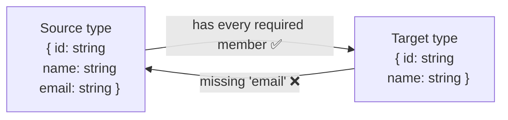

# Structural Typing

> TypeScript doesn't care what a type is *called*. It cares what shape it has — and once that clicks, assignability, excess property checks, and the need for branded types all stop being surprises.

**Part:** [01 · Core Languages](../) · **Domain:** TypeScript · **Priority:** Critical · **Difficulty:** Foundational · **Reading time:** ~8 min

## TL;DR

TypeScript uses **structural typing**: a value of type `A` is assignable to type `B` if `A`'s shape includes everything `B` requires, regardless of declared names or inheritance. Two independently declared interfaces with the same members are interchangeable; a class never needs to `implement` an interface to satisfy it. This is what makes TypeScript feel natural over idiomatic JavaScript — you type the values you already have. It also means the compiler will *not* stop you from passing a `UserId` where a `PostId` is expected when both are `string`. The two things everyone trips over are **excess property checks** (fresh object literals get an extra, deliberately stricter check) and **the absence of nominal typing** (which you can emulate with branded types when a distinction genuinely matters).

> **Recommendation:** Design types as shapes describing data, not as a class hierarchy. Reach for branded types only where confusing two same-shaped values would be a real bug — ids, units, validated inputs.

## At a Glance

| | |
| --- | --- |
| **Use when** | Always — it's how TypeScript works. The decision is when to *break out* of it with branding. |
| **Avoid when** | Two values share a shape but must never be interchanged (`UserId` vs `OrderId`, `Celsius` vs `Fahrenheit`). |
| **Alternatives** | [Branded/nominal types](#alternative-approaches), [discriminated unions](#alternative-approaches), runtime validation. |
| **Primary risk** | Assuming the compiler distinguishes types it can't see a shape difference in — it doesn't. |
| **Maturity** | Stable — structural typing has been TypeScript's compatibility model since 1.0. |

## Prerequisites

You need JavaScript's value model first, since TypeScript's types describe runtime values that already exist.

- Primitives & Wrappers (planned, `· JavaScript`) — what the underlying values are, before any type describes them.

## Overview

**Structural typing** (sometimes called *duck typing* by analogy) determines compatibility from a type's members. TypeScript asks one question when checking `source` against `target`: *does `source` have, at compatible types, every member `target` requires?* If yes, it's assignable. Nothing about names, declaration site, or inheritance enters into it.

The contrast is **nominal typing**, used by Java, C#, Rust, and most of the languages TypeScript's syntax resembles. There, `class Point` and `class Vector` with identical fields are unrelated types, and compatibility requires an explicit `implements` or `extends`. TypeScript's choice of structural typing is deliberate: it has to describe existing JavaScript, where objects are shapes assembled at runtime and no one declared anything.

Three consequences follow immediately, and they're worth stating as facts rather than discovering later.

**`implements` is a checked assertion, not a requirement.** A class satisfies an interface by having the right members. `implements` just asks the compiler to verify it at the declaration site — useful for error locality, never necessary for assignability.

**Extra members are fine — usually.** A type with more members than required is assignable to one with fewer; that's ordinary width subtyping. The exception is the **excess property check**: when you assign a *fresh object literal* directly, TypeScript additionally rejects properties the target doesn't declare, on the theory that a literal written inline with an unexpected key is almost always a typo. Assign the literal to a variable first and the check doesn't apply.

**Private members break structure.** A class with `private` or `#private` fields is only compatible with itself and its subclasses, because private members are keyed to the declaring class. This is the one place TypeScript is nominal by default.

## The Problem

Structural typing's failure mode is *false confidence*. Consider a function `getOrder(userId: string, orderId: string)`. Both parameters are `string`, so the call `getOrder(orderId, userId)` — arguments swapped — typechecks perfectly and fails at runtime, or worse, returns someone else's order. The types documented intent without enforcing it. The same shape recurs everywhere: `distance: number` in meters passed where feet were expected, a raw user string passed where a sanitized one was required, a database row passed where an API DTO was required because they happen to have the same fields today.

The second problem is the excess property check's *asymmetry*, which reads as a compiler bug until you know the rule:

```ts
type Options = { retries: number };
const a: Options = { retries: 3, timeout: 1000 };   // ❌ error: 'timeout' does not exist
const raw = { retries: 3, timeout: 1000 };
const b: Options = raw;                              // ✅ no error — same data
```

Both lines pass an object with an extra property. Only the literal is rejected. Engineers who hit this conclude the checking is arbitrary and start reaching for `as` casts, which disables far more checking than they intended.

The third is over-modelling. Coming from a nominal language, the instinct is to build class hierarchies and `implements` chains to express relationships that TypeScript expresses more simply — and more flexibly — as plain object shapes and unions.

## Why It Matters

Structural typing is what makes TypeScript adoptable incrementally. You can type an existing JavaScript codebase without restructuring it, describe a third-party API's response shape without owning the type, and accept `{ name: string }` from any source — a literal, a class, a JSON parse, a mock in a test. Nominal typing would require every producer to opt in to your declaration, which for JavaScript's ecosystem would be unworkable.

It also shapes API design. Functions should ask for the narrowest shape they actually use — `function greet(user: { name: string })` rather than `function greet(user: User)` — because that maximizes what can be passed and minimizes coupling. In a nominal language this would be a burden; structurally, it's free and it makes tests trivial to write, since a test can pass a two-property literal instead of constructing a full domain object.

And knowing where structure *stops* being enough is what prevents a class of production bug that types otherwise appear to rule out. Ids, currency amounts, units, and validated-vs-raw strings all share representations while being semantically incompatible, and branding them is a few lines of code that turns a runtime incident into a compile error.

## Mental Model

Think of a type as a **checklist of requirements**, and assignability as "does this value satisfy every item?" Extra items on the value are not a problem — nobody checks for them.



The arrow goes one way: **more specific → less specific**. A richer object satisfies a poorer requirement, never the reverse.

Then keep three refinements in mind.

**Freshness.** The excess property check applies only to *fresh* object literals — one written directly at the assignment or call site. It's a lint-like heuristic layered on top of assignability, not part of it, and it disappears as soon as the literal is stored in a variable or widened.

**Function parameters are bivariant for methods, contravariant for standalone functions.** Under `strictFunctionTypes`, a function type's parameters are checked contravariantly (a handler accepting a *wider* type is assignable where a narrower one is expected), but methods declared with method syntax stay bivariant for compatibility with JavaScript's array and DOM types. This is why `(e: Event) => void` is assignable where `(e: MouseEvent) => void` is expected, and not the other way round.

**Private fields opt out.** `class A { private x = 1 }` and `class B { private x = 1 }` are *not* compatible, because private members carry their declaring class's identity. That's the built-in escape hatch to nominal behavior, though branded types are usually a better tool since they work on plain data.

## Best Practices

**Ask for the smallest shape you use.** A function that reads `user.name` should take `{ name: string }`, not `User`. It makes the dependency explicit, makes testing trivial, and decouples the function from a type that will grow.

**Model data with `type` aliases and unions; reserve classes for things with behavior and identity.** Structural typing means you rarely need inheritance to share a shape — an intersection or a union does the job with fewer constraints.

**Brand the values that must not be confused.** Ids, units, currency, and validated inputs get a phantom property so the compiler can tell them apart. It costs one type alias and a constructor function.

**Use discriminated unions instead of optional-property soup.** `{ status: 'ok'; data: T } | { status: 'error'; error: E }` narrows precisely; `{ data?: T; error?: E }` typechecks in states that can't happen.

**Never silence an excess property check with `as`.** The cast disables assignability checking entirely, not just the freshness rule. Either add the property to the type, or use an index signature if extra keys are genuinely allowed.

**Validate at the boundary.** Structural types describe compile-time shape and vanish at runtime. Anything crossing a trust boundary — network responses, `localStorage`, URL params, form input — needs a runtime schema check, after which the *validated* result can carry a brand. See [Schema Validation · Forms & Validation](../../03-application-architecture/forms-validation/schema-validation.md).

## Trade-offs

Structural typing buys flexibility and JavaScript compatibility at the cost of semantic distinctions the compiler cannot infer.

**Advantages**

- Types describe values that already exist, so existing JavaScript can be typed without restructuring.
- Any object satisfying a shape works — no registration, no `implements`, no adapters between libraries.
- Encourages narrow, precise parameter types, which reduces coupling and makes tests cheap.

**Disadvantages**

- Same-shaped types are interchangeable even when they're semantically incompatible, so unit and id confusion is invisible.
- The excess property check is a special case that behaves inconsistently with plain assignability and surprises people.
- Types are erased at runtime, so nothing structural protects you at a trust boundary.

| Dimension | Structural typing | Cost / caveat |
| --- | --- | --- |
| Flexibility | Any matching shape is accepted | Accepts shapes you didn't intend to accept |
| JS interop | Describes existing objects directly | Only describes them; enforces nothing at runtime |
| Semantic safety | None beyond shape | Requires branding for ids, units, validated data |
| Learning curve | Simple rule, few exceptions | Excess property checks and variance are the exceptions |
| Refactoring | Renaming a type breaks nothing structurally | …which also means renames won't surface real mismatches |

## Alternative Approaches

You can't switch TypeScript to nominal typing, but you can opt individual types out of pure structure.

| Approach | Best when | Weakness | See |
| --- | --- | --- | --- |
| Plain structural types | The default for all data shapes | Same-shaped types interchange freely | (this article) |
| Branded types | Ids, units, currency, validated strings | Requires a constructor/validator; brand is compile-time only | (this article) |
| `private`/`#` class fields | You already model the concept as a class | Forces class instantiation; awkward for plain data and JSON | `Classes · TypeScript` (planned) |
| Discriminated unions | A value has several distinct *states* | Requires a literal discriminant property on every member | [Unions & Intersections](./unions-and-intersections.md) |
| Runtime schema (Zod, Valibot) | Data crosses a trust boundary | Runtime cost; schema and type must stay in sync (infer the type from the schema) | [`Schema-Inferred Types · Forms & Validation`](../../03-application-architecture/forms-validation/schema-inferred-types.md) |

## Bad Example

An API layer where every semantically distinct value is the same structural type.

```ts
// ❌ Everything is a string or a number; the compiler cannot tell them apart.
type User = { id: string; name: string; email: string };
type Order = { id: string; userId: string; total: number };

async function fetchOrder(userId: string, orderId: string): Promise<Order> {
  const res = await fetch(`/api/users/${userId}/orders/${orderId}`);
  return res.json() as Order; // asserts a shape nobody verified
}

// Arguments swapped — typechecks, fails (or silently returns the wrong data) at runtime.
const order = await fetchOrder(someOrder.id, currentUser.id);

// Units are invisible too.
function scheduleRetry(delay: number) { setTimeout(retry, delay); }
scheduleRetry(30);        // 30 what? The caller meant seconds. It's milliseconds.

// Excess property check "fixed" with a cast, which disables all checking.
type RequestOptions = { retries: number; timeoutMs: number };
const opts = { retries: 3, timeout: 5000 } as RequestOptions; // typo survives, silently
```

**What goes wrong:** Three distinct bugs, none of which the compiler can see. Swapping `userId` and `orderId` is undetectable because both are `string` — structurally identical, semantically unrelated. `scheduleRetry(30)` compiles because `number` carries no unit, so a seconds/milliseconds mix-up ships. And the `as RequestOptions` cast doesn't just suppress the excess property warning; it suppresses assignability entirely, so the misspelled `timeout` is accepted *and* the missing `timeoutMs` goes unreported — the object is now wrong in two ways with zero diagnostics. On top of all of it, `res.json() as Order` asserts a shape from an untrusted source without checking anything.

## Good Example

The same layer, with structure used where it fits and branding where it doesn't.

```ts
// ✅ A tiny branding utility: a phantom property that exists only at compile time.
declare const brand: unique symbol;
type Brand<T, B extends string> = T & { readonly [brand]: B };

export type UserId = Brand<string, 'UserId'>;
export type OrderId = Brand<string, 'OrderId'>;
export type Milliseconds = Brand<number, 'Milliseconds'>;

// Constructors are the only way in — validation happens here, once.
export const UserId = (raw: string): UserId => {
  if (!/^usr_[a-z0-9]{12}$/.test(raw)) throw new TypeError(`Invalid UserId: ${raw}`);
  return raw as UserId;
};
export const OrderId = (raw: string): OrderId => {
  if (!/^ord_[a-z0-9]{12}$/.test(raw)) throw new TypeError(`Invalid OrderId: ${raw}`);
  return raw as OrderId;
};
export const ms = (n: number): Milliseconds => n as Milliseconds;
export const seconds = (n: number): Milliseconds => (n * 1000) as Milliseconds;
```

```ts
// ✅ The signature now enforces what the parameter names only suggested.
async function fetchOrder(userId: UserId, orderId: OrderId): Promise<Order> {
  const res = await fetch(`/api/users/${userId}/orders/${orderId}`);
  if (!res.ok) throw new HttpError(res.status, await res.text());
  return OrderSchema.parse(await res.json()); // validated at the boundary, not asserted
}

fetchOrder(order.id, user.id);
// ❌ Argument of type 'OrderId' is not assignable to parameter of type 'UserId'.
//    Types have separate declarations of a private property.

function scheduleRetry(delay: Milliseconds) { setTimeout(retry, delay); }
scheduleRetry(30);            // ❌ number is not assignable to Milliseconds
scheduleRetry(seconds(30));   // ✅ the unit is now part of the type
```

```ts
// ✅ Narrow parameter shapes: ask for what you use, not for the whole entity.
function renderAvatar(user: { name: string; avatarUrl?: string }) { /* … */ }
renderAvatar(currentUser);                    // a full User satisfies it
renderAvatar({ name: 'Ada' });                // and so does a test literal — no mocks needed

// ✅ Extra properties: widen the type honestly instead of casting.
type RequestOptions = {
  retries: number;
  timeoutMs: number;
  /** Forward-compatible passthrough for transport-specific flags. */
  transport?: Record<string, unknown>;
};
const opts: RequestOptions = { retries: 3, timeoutMs: 5000 }; // typo would now be caught
```

**Why it's better:** Branding gives the compiler the distinction it could not infer — `UserId` and `OrderId` are still `string` at runtime, with zero cost, but the swapped call is now a compile error rather than a production incident. Making the constructors the only entry point means format validation happens exactly once, at the point a raw string becomes a domain value. `Milliseconds` moves a unit from a comment into the type, so `scheduleRetry(30)` can't compile. The narrow `{ name: string; avatarUrl?: string }` parameter uses structural typing as intended: production passes a full `User`, tests pass a one-line literal, and neither needs to know about the other. And replacing `as` with a schema `parse` at the network boundary means the type reflects data that was actually checked, rather than data that was merely claimed.

## Common Mistakes

See the [TypeScript anti-patterns](../../../anti-patterns/) for the domain catalog. Concept-specific:

### Mistake: Using `as` to silence an excess property error

- **Symptom:** `const opts = { retrys: 3 } as Options;` compiles, and the misspelled key ships.
- **Why it fails:** A type assertion doesn't relax the freshness check — it bypasses assignability checking altogether. Missing required properties and wrong-typed properties stop being reported too, so one small suppression removes all safety from that expression.
- **Fix:** If the property belongs in the type, add it. If arbitrary extra keys are legitimate, declare an index signature or a `Record<string, unknown>` passthrough field. If you're widening a literal deliberately, assign it to an intermediate variable — that removes freshness without removing checking.

### Mistake: Expecting the compiler to distinguish same-shaped domain types

- **Symptom:** Ids, units, or "validated vs raw" strings get swapped, and code review is the only thing catching it.
- **Why it fails:** Structural typing compares members. `type UserId = string` and `type OrderId = string` are *aliases*, not distinct types — they're both `string`, and the alias name is documentation the compiler ignores.
- **Fix:** Brand them. `type UserId = string & { readonly __brand: 'UserId' }` (or the `unique symbol` variant above), with a constructor function as the only way to produce one.

### Mistake: Reaching for class hierarchies to express data relationships

- **Symptom:** `abstract class BaseEntity`, `implements` chains, and adapter classes to convert between two shapes that already match.
- **Why it fails:** Structural typing already gives you the compatibility that inheritance is providing in a nominal language — and the hierarchy adds constraints (single inheritance, constructor coupling, awkward JSON round-tripping) that plain object types don't have.
- **Fix:** Model data as `type` aliases, compose with intersections, and express variants as discriminated unions. Keep classes for things that own behavior and identity.

## Checklist

- [ ] Function parameters ask for the narrowest shape the function actually uses.
- [ ] Ids, units, currency, and validated strings are branded, not bare `string`/`number` aliases.
- [ ] Brand constructors are the only way to produce a branded value, and they validate.
- [ ] No `as` assertion is used to silence an excess property error.
- [ ] Data crossing a trust boundary is parsed by a runtime schema, not asserted with `as`.
- [ ] Variants are discriminated unions rather than objects full of optional properties.
- [ ] `implements` is used for error locality where helpful, never assumed to be required.
- [ ] Class hierarchies exist only where there is real behavior, not to share a shape.

## Related Articles

- [Assignability](./assignability.md) — the full rules for when one type can be used as another, including variance.
- [unknown, never & any](./unknown-never-and-any.md) — the types at the edges of the assignability lattice.
- [Literal & Unit Types](./literal-and-unit-types.md) — narrowing a shape down to specific values, the basis of discriminated unions.
- [Unions & Intersections](./unions-and-intersections.md) and Generics (planned) — composing shapes rather than inheriting them.
- [Schema-Inferred Types](../../03-application-architecture/forms-validation/schema-inferred-types.md) (`· Forms & Validation`) — deriving compile-time types from runtime validators so the two can't drift.

## References

- [TypeScript Handbook — Type Compatibility](https://www.typescriptlang.org/docs/handbook/type-compatibility.html) — the normative description of structural assignability, including function variance.
- [TypeScript Handbook — Excess Property Checks](https://www.typescriptlang.org/docs/handbook/2/objects.html#excess-property-checks) — why fresh object literals are checked more strictly.
- [TypeScript Handbook — Everyday Types](https://www.typescriptlang.org/docs/handbook/2/everyday-types.html) — the practical vocabulary for describing shapes.
