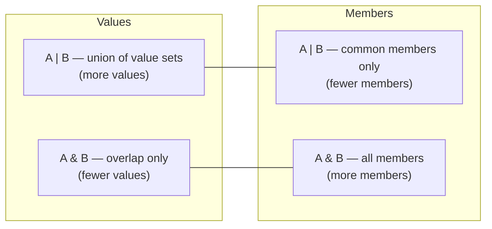

# Unions & Intersections

> `|` widens the set of values and narrows the members you can touch; `&` does the opposite — and knowing which direction you need is most of type composition in TypeScript.

**Part:** [01 · Core Languages](../) · **Domain:** TypeScript · **Priority:** Critical · **Difficulty:** Foundational · **Reading time:** ~8 min

## TL;DR

A **union** `A | B` is a value that is either an `A` or a `B`; you may only access what both have in common until you narrow. An **intersection** `A & B` is a value that satisfies both at once; you may access everything from either side. The counter-intuitive part is that unions have *more values* but *fewer usable members*, and intersections have *fewer values* but *more members*. The highest-value application is the **discriminated union** — union members that share a literal tag property — because it lets the compiler narrow an object to exactly one shape and prove a `switch` exhaustive.

> **Recommendation:** Model "one of several states" as a discriminated union rather than one object with optional fields; use intersections to extend a shape, not to model variants.

## At a Glance

| | |
| --- | --- |
| **Use when** | A union for a value that is one of several shapes or literals; an intersection to combine independent capability shapes. |
| **Avoid when** | Intersecting types with conflicting primitive members — the result is `never` and the error is far from the cause. |
| **Alternatives** | [Optional properties](#alternative-approaches), [generics](#alternative-approaches), class hierarchies. |
| **Primary risk** | Untagged unions of similar objects cannot be narrowed, so consumers reach for casts. |
| **Maturity** | Stable — union and intersection types have been core since TypeScript 1.4 and 1.6. |

## Prerequisites

Composition operates on shapes, so how the compiler compares shapes comes first.

- [Structural Typing](./structural-typing.md) — members, not names, decide compatibility.
- [Assignability](./assignability.md) — the union rules that make `|` and `&` behave asymmetrically.
- [Literal & Unit Types](./literal-and-unit-types.md) — the discriminants that make unions narrowable.

## Overview

**Union types** (`A | B`) describe a value that is one of several types. Assignability follows from that: `A` is assignable to `A | B`, and `A | B` is assignable to `T` only if both `A` and `B` are. Because the compiler cannot know which constituent it holds, the accessible members of a union are the *intersection* of the members — only what every constituent has.

**Intersection types** (`A & B`) describe a value that is all of several types at once. A value must satisfy every constituent, so fewer values qualify, and the accessible members are the *union* of the members. For object types this behaves like merging; for conflicting primitives it produces `never`, because no value can be both a `string` and a `number`.

The pairing is often described as sum and product types, and the analogy holds: a union is a choice between alternatives, an intersection is a combination of parts. The design question in application code is almost always "is this value one of several things, or is it one thing with several aspects?" — and answering it wrongly is what produces objects full of optional properties.

## The Problem

The default way to model a value with several states is one object with optional fields, and it typechecks in states that cannot exist.

```ts
type FetchState<T> = {
  loading: boolean;
  data?: T;
  error?: Error;
};

function render(state: FetchState<Order[]>) {
  if (state.data) return <Table orders={state.data} />;
  if (state.error) return <ErrorPanel error={state.error} />;
  return <Spinner />;
}
```

Nothing prevents `{ loading: true, data: orders, error: err }`. The type admits eight combinations for three fields, of which perhaps three are real, and every consumer has to re-derive which combinations to trust. When a fourth state arrives — "refetching with stale data visible" — another boolean is added, the combinations double, and the render function grows conditionals nobody can verify.

The second problem is the union that cannot be narrowed. Two response shapes with no shared literal tag force consumers into property probing or casts:

```ts
type Response = { data: Order[] } | { message: string; code: number };

function handle(res: Response) {
  if ('data' in res) return res.data;   // works, but fragile as shapes grow
  return (res as { message: string }).message; // and this appears the moment `in` gets awkward
}
```

The third is intersection misuse: combining two types that both declare the same property with incompatible types. The resulting property is `never`, and the error surfaces not at the declaration but wherever someone tries to assign to it, often in a different file.

## Why It Matters

Making impossible states unrepresentable is the highest-leverage use of a structural type system, and unions are how it is done. A discriminated union collapses the eight-combination `FetchState` above into four legitimate shapes, and the compiler then refuses the code paths that read `data` before it exists — which removes an entire category of "loading spinner over stale data" and "undefined is not an object" bugs without a single runtime check.

It also changes how a codebase absorbs new requirements. Adding a `'refetching'` state to a discriminated union produces a compile error at every exhaustive switch, which is a complete, automatically generated list of the places that need attention. Adding another boolean to an optional-property object produces no errors at all, and the missing handling shows up in QA or production.

Intersections matter for a narrower but common purpose: composing independent capability shapes — a component's own props intersected with `React.ComponentPropsWithoutRef<'button'>`, or a base entity intersected with timestamps — without inheritance and without repeating members.

## Mental Model

Hold two pictures at once: **sets of values**, and **sets of accessible members**. They move in opposite directions.



Four behaviors follow.

**Narrowing recovers the members.** A union's constituent members become accessible once a check identifies the constituent: `typeof`, `instanceof`, `in`, a type predicate, or — best — a comparison against a literal discriminant.

**A discriminant is a literal-typed property present on every member with a distinct value.** `kind`, `type`, `status`, and `success` are conventional names. Given one, a `switch` narrows the entire object, and `never` in the default branch proves the set is covered.

**Intersections merge object members and annihilate conflicting primitives.** `{ id: string } & { name: string }` is a two-property object. `string & number` is `never`, and so is a property that appears with incompatible types on both sides — which is why an intersection error often reads "not assignable to type 'never'."

**Unions distribute; intersections do not.** Union constituents are processed one at a time by conditional and mapped types, so `('a' | 'b')[]` and `'a'[] | 'b'[]` are different types, and `Exclude`, `Extract`, and `NonNullable` all rely on that distribution.

## Best Practices

**Tag every union member with a literal discriminant.** Even when `in` checks would work today, a tag keeps narrowing reliable as members grow and makes `switch` exhaustiveness possible.

**Model state machines as unions of states, not as flags.** Each member holds exactly the data that exists in that state, so a field cannot be read where it is meaningless.

**Put the discriminant first and name it consistently across the codebase.** Mixed conventions (`kind` here, `type` there) prevent shared helpers such as a generic `matchState`.

**Prefer intersections to interface inheritance for composing props.** `type Props = OwnProps & Omit<React.ComponentPropsWithoutRef<'button'>, keyof OwnProps>` composes without the single-inheritance constraint, and `Omit` prevents the conflicting-member `never`.

**Keep unions small enough to switch over.** Beyond roughly a dozen members, a union usually wants to become a `Record` lookup or a different decomposition; very large unions also slow type checking.

**Do not union a type with `any` or `unknown` "to be safe."** `T | any` is `any` and `T | unknown` is `unknown`; both discard the rest of the union.

## Trade-offs

Composition makes illegal states unrepresentable at the cost of more explicit shapes.

**Advantages**

- Impossible combinations stop compiling, which removes defensive checks from every consumer.
- Adding a state produces a precise, compiler-generated list of the code that must change.
- Narrowing gives each branch exactly the fields it needs, so property access is safe without optional chaining.

**Disadvantages**

- Every member repeats the discriminant, and shared fields either repeat or move behind an intersection.
- Constructing a union value requires deciding the state up front, which is more ceremony than mutating flags.
- Large unions and heavy conditional-type manipulation slow the compiler and produce long error messages.

| Dimension | Discriminated union | Optional-property object |
| --- | --- | --- |
| Illegal states | Unrepresentable | Representable and common |
| Adding a state | Compile errors at every switch | Silent; handling must be found by hand |
| Field access | Safe after narrowing | Optional chaining everywhere |
| Construction | Must pick a member | Mutate a flag |
| Compiler cost | Grows with member count | Flat |

## Alternative Approaches

| Approach | Best when | Weakness | See |
| --- | --- | --- | --- |
| Discriminated union | A value is in one of several states | Repeats the tag on every member | (this article) |
| Intersection of shapes | Combining independent aspects of one value | Conflicting members silently become `never` | (this article) |
| Optional properties | Fields are genuinely independent and all combinations are valid | Admits impossible combinations when they are not | (this article) |
| Generics | The shape varies by a type the caller supplies | Does not model *states*, only parameterization | Generics · TypeScript (planned) |
| Class hierarchy | Variants own behavior, not just data | Single inheritance; awkward to serialize | [Structural Typing](./structural-typing.md#alternative-approaches) |

## Bad Example

A data-fetching layer modelled with flags and an untagged response union.

```ts
// ❌ Eight combinations, three of which are real.
type FetchState<T> = {
  loading: boolean;
  refetching: boolean;
  data?: T;
  error?: Error;
};

// ❌ No discriminant, so every consumer probes properties.
type ApiResponse<T> = { data: T } | { message: string; code: number };

function useOrders(): FetchState<Order[]> { /* … */ }

function OrdersView() {
  const state = useOrders();

  // Which of these is authoritative when two are true?
  if (state.loading && !state.data) return <Spinner />;
  if (state.error) return <ErrorPanel error={state.error} />;
  return <Table orders={state.data!} />; // `!` because the type cannot prove it
}

function unwrap<T>(res: ApiResponse<T>): T {
  if ('data' in res) return res.data;
  throw new ApiError((res as { message: string }).message); // cast to reach the field
}

// ❌ An intersection with a conflicting member.
type Base = { id: string; version: number };
type Draft = { id: string; version: 'draft' };
type Record_ = Base & Draft;         // `version` is `never`
const r: Record_ = { id: 'a', version: 1 };
// ❌ Type 'number' is not assignable to type 'never' — reported here, caused above.
```

**What goes wrong:** `FetchState` lets `loading` and `error` and `data` all be set at once, so every consumer invents its own precedence rules and they disagree — one component shows a spinner over stale data, another shows an error panel while a retry is already succeeding. The `state.data!` assertion exists because the type genuinely cannot prove the data is there, which means the assertion is load-bearing and wrong in at least one reachable state. `ApiResponse` has no tag, so `unwrap` probes with `in` and then casts when the probe gets awkward — and the cast will keep compiling after the error shape changes. And `Base & Draft` declares `version` as both `number` and `'draft'`, which intersects to `never`; the declaration is accepted silently and the error appears wherever someone tries to build the value.

## Good Example

The same layer as a discriminated union, with intersections used only to compose.

```ts
// ✅ Each state carries exactly the data that exists in it.
type FetchState<T> =
  | { status: 'idle' }
  | { status: 'loading' }
  | { status: 'refetching'; data: T }
  | { status: 'ready'; data: T }
  | { status: 'failed'; error: Error };

// ✅ A tagged response union narrows without probing or casting.
type ApiResponse<T> =
  | { ok: true; data: T }
  | { ok: false; message: string; code: number };

export function unwrap<T>(res: ApiResponse<T>): T {
  if (res.ok) return res.data;              // `data` exists only here
  throw new ApiError(res.message, res.code); // `message` and `code` exist only here
}
```

```tsx
// ✅ Every branch has precisely the fields it needs, and the set is proven complete.
function OrdersView({ state }: { state: FetchState<Order[]> }) {
  switch (state.status) {
    case 'idle':
      return <EmptyState />;
    case 'loading':
      return <Spinner aria-label="Loading orders" />;
    case 'refetching':
      return <Table orders={state.data} aria-busy="true" />;
    case 'ready':
      return <Table orders={state.data} />;
    case 'failed':
      return <ErrorPanel error={state.error} />;
    default:
      return assertNever(state, 'FetchState');
  }
}
```

```ts
// ✅ Intersections compose independent aspects; `Omit` prevents conflicting members.
type Timestamped = { createdAt: string; updatedAt: string };
type Identified = { id: string };
type Order = Identified & Timestamped & { total: number; currency: 'USD' | 'EUR' };

// ✅ Component props: own props plus the native element's, without collisions.
type OwnProps = {
  variant: 'primary' | 'secondary';
  loading?: boolean;
};
type ButtonProps = OwnProps &
  Omit<React.ComponentPropsWithoutRef<'button'>, keyof OwnProps>;

// ✅ A published draft is a *state*, not an intersection — so it is a union.
type Document =
  | { state: 'draft'; id: string; body: string }
  | { state: 'published'; id: string; body: string; version: number };
```

**Why it's better:** The `FetchState` union has five members and no impossible combinations, so `'refetching'` can hold data while `'loading'` cannot — the distinction the boolean version tried and failed to express. Every branch of the switch accesses only fields that exist there, so the `!` assertion disappears along with the bug it was hiding, and `assertNever` makes a future `'cancelled'` state a build error at exactly the places that must handle it. `ApiResponse` uses `ok: true | false` as its discriminant, which narrows on a plain `if` and removes both the `in` probe and the cast. The intersections now compose orthogonal aspects — identity, timestamps, payload — and `Omit<…, keyof OwnProps>` removes the native `variant`-shaped collisions before they can intersect to `never`. And the draft/published distinction, which was the thing incorrectly modelled as an intersection, is a union, because it is a choice between shapes rather than a combination of them.

## Common Mistakes

See the [TypeScript anti-patterns](../../../anti-patterns/) for the domain catalog. Concept-specific:

### Mistake: Modelling states as booleans and optional fields

- **Symptom:** `isLoading`, `isError`, `data?`, `error?` on one object, with each consumer inventing its own precedence.
- **Why it fails:** The type admits every combination of the flags, including the contradictory ones, so the compiler cannot rule out reading `data` in a state where it is absent. The `!` assertions that follow are the type system reporting a modelling problem.
- **Fix:** Replace with a discriminated union whose members hold only the fields valid in that state, and switch on the discriminant.

### Mistake: A union of object types with no discriminant

- **Symptom:** `'data' in res` checks, followed by casts once the shapes grow similar.
- **Why it fails:** Structural narrowing by property presence works only while the members differ by property, and it silently stops narrowing when two members share a field. Nothing warns; consumers reach for `as`.
- **Fix:** Add a literal tag (`ok`, `kind`, `type`) to every member. It costs one property and makes narrowing total.

### Mistake: Using an intersection where a union belongs

- **Symptom:** `type Admin = User & { role: 'admin' }` alongside `type Guest = User & { role: 'guest' }`, then `Admin & Guest` somewhere, or a member typed `never` with no obvious cause.
- **Why it fails:** An intersection means "both at once." Two variants of the same concept are alternatives, and intersecting their conflicting members produces `never`, an error that surfaces at construction rather than declaration.
- **Fix:** Union the variants (`type Account = Admin | Guest`) and reserve intersections for genuinely independent aspects of a single value.

## Checklist

- [ ] Every union of object types carries a literal discriminant on all members.
- [ ] Discriminant property names are consistent across the codebase.
- [ ] Each union member holds only the fields valid in that state — no optional stand-ins.
- [ ] Switches over unions end in `assertNever` rather than a fallback branch.
- [ ] Intersections combine independent aspects, never variants of one concept.
- [ ] Prop intersections use `Omit<…, keyof OwnProps>` to avoid conflicting members.
- [ ] No union includes `any` or `unknown` alongside real members.
- [ ] Unions large enough to be unswitchable have been reconsidered as a lookup or a decomposition.

## Related Articles

- [Structural Typing](./structural-typing.md) — the member comparison composition is built on.
- [Assignability](./assignability.md) — the asymmetric union rules that explain `|` and `&`.
- [Literal & Unit Types](./literal-and-unit-types.md) — the discriminants that make narrowing work.
- Generics (planned), Conditional Types (planned), and Mapped Types (planned) — the composition tools that build on unions, including distribution.

## References

- [TypeScript Handbook — Union Types](https://www.typescriptlang.org/docs/handbook/2/everyday-types.html#union-types) — the accessible-member rule and basic narrowing.
- [TypeScript Handbook — Intersection Types](https://www.typescriptlang.org/docs/handbook/2/objects.html#intersection-types) — merging object types and conflicting members.
- [TypeScript Handbook — Discriminated Unions](https://www.typescriptlang.org/docs/handbook/2/narrowing.html#discriminated-unions) — tagging, narrowing, and exhaustiveness.
