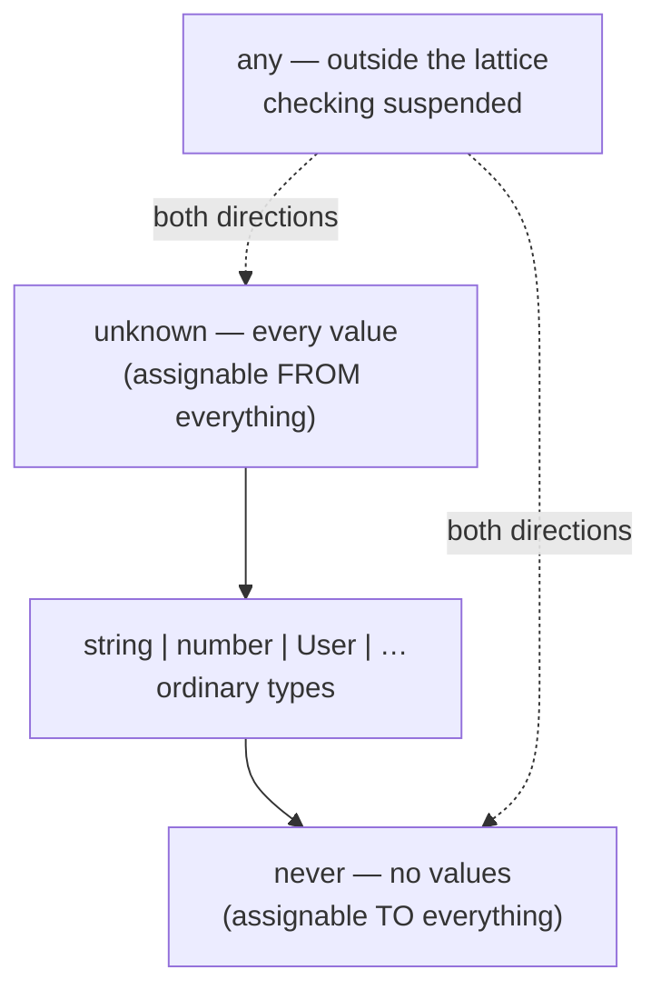

<!-- cspell:ignore revenu -- deliberate typo in the Bad Example -->

# unknown, never & any

> `unknown` accepts everything and lets you do nothing until you check; `never` accepts nothing and proves a case is impossible; `any` disables the compiler wherever it spreads.

**Part:** [01 · Core Languages](../) · **Domain:** TypeScript · **Priority:** Critical · **Difficulty:** Foundational · **Reading time:** ~8 min

## TL;DR

These three types sit at the edges of TypeScript's [assignability](./assignability.md) lattice. **`unknown`** is the top type: every value is assignable to it, and it is assignable to nothing else, so it forces a narrowing check before use. **`never`** is the bottom type: nothing is assignable to it, and it is assignable to everything, which makes it the return type of functions that do not return and the tool for exhaustiveness checks. **`any`** is outside the lattice entirely — assignable in both directions — so it does not describe a value, it suspends checking for every expression it touches.

> **Recommendation:** Use `unknown` at every boundary where data arrives untyped, `never` to prove a switch is exhaustive, and `any` only inside a module you are actively migrating — never in an exported signature.

## At a Glance

| | |
| --- | --- |
| **Use when** | `unknown` for untyped input; `never` for impossible states and exhaustiveness; `any` for staged migration only. |
| **Avoid when** | `any` in any exported type; `unknown` where a real type is already known; `never` as a way to silence an error. |
| **Alternatives** | [Runtime schema validation](#alternative-approaches), [discriminated unions](./literal-and-unit-types.md), generics. |
| **Primary risk** | `any` propagates silently through inference and removes checking far beyond where it was written. |
| **Maturity** | Stable — `unknown` has been available since TypeScript 3.0; `never` and `any` since 1.0. |

## Prerequisites

These three types are defined by how they behave in assignability, so the shape rules come first.

- [Structural Typing](./structural-typing.md) — how the compiler compares types at all.
- [Assignability](./assignability.md) — the relation these three sit at the extremes of.

## Overview

TypeScript's types form a lattice ordered by assignability, and **`unknown`** and **`never`** are its two ends. `unknown` is the *top*: `unknown` is a supertype of every type, so any value can be stored in it, and — because nothing is a supertype of `unknown` other than itself — you can do nothing with the value until you narrow it. `never` is the *bottom*: it has no values at all, so nothing can be assigned to it, while it is assignable to every type (vacuously, since there is no value to be wrong).

**`any`** is not part of that ordering. It is assignable to every type *and* every type is assignable to it, which is a contradiction the compiler resolves by simply not checking. That is the entire semantics: `any` means "stop asking."

The distinction that matters in practice is between `unknown` and `any` at a boundary. Both accept the parsed result of a network response. `unknown` then requires a check before the first property access; `any` allows every access, including the ones that are wrong. They cost the same to write and differ completely in what they prevent.

## The Problem

Untyped data enters a frontend constantly — `fetch` responses, `JSON.parse`, `localStorage`, URL parameters, `postMessage`, third-party callbacks, and anything from a package without types. Each of those crossings needs a decision, and the path of least resistance is `any`, either written explicitly or inherited from an untyped dependency.

```ts
// The response is `any`, so every line below typechecks — including the wrong ones.
const user = await fetch('/api/me').then((r) => r.json());
render(user.profile.displayName.toUpperCase()); // three possible runtime failures, zero errors
```

The damage is not local. `any` propagates through inference: assign it to a variable, and the variable is `any`; spread it into an object, and the surrounding fields lose checking; return it from a function without an annotation, and every caller inherits it. A single untyped import can erase checking across a feature without a single error appearing anywhere.

The second problem is the opposite instinct — treating `never` as an error to be removed. A `switch` that has covered every case leaves a variable of type `never`, and code that assigns it somewhere fails to compile. That failure is usually the type system reporting something correct: a case was added to a union and this switch was not updated.

## Why It Matters

The boundary decision determines whether type errors surface at compile time or as production incidents. A codebase that admits `unknown` at its edges and parses immediately gets a single, well-located failure when an API changes shape. The same codebase using `any` gets a `TypeError` in a component, days later, with a stack trace that points nowhere near the contract that broke.

`never` matters for a different reason: it is how the compiler proves *absence*. Exhaustiveness checking with `never` turns "someone added a status and forgot a branch" from a runtime surprise into a build failure, which is the single highest-value use of the type system in an application with evolving domain unions.

And the cost of `any` compounds with codebase size. A 20-file project can absorb loose typing; a 2,000-file one cannot, because nobody can tell which parts of the graph are still checked. `noImplicitAny` exists because the implicit case — a parameter nobody annotated — is where most of it enters.

## Mental Model

Think of the three as **positions relative to the set of all values**.



**`unknown` is a promise you owe the compiler.** You may hold the value, pass it around, and store it. You may not read a property, call it, or do arithmetic until a check — `typeof`, `instanceof`, `in`, a type predicate, or a schema parse — narrows it to something specific.

**`never` appears wherever a value cannot exist.** The return type of a function that always throws or never terminates. The result of narrowing a union down to nothing. The element type of an empty array literal in some inference positions. And, most usefully, the type of the default branch in an exhaustive `switch`.

**`any` is not a type, it is an off switch.** It does not describe values; it tells the checker to skip. This is why `any` beats every other type in a union (`string | any` is `any`) and why one appearance can quietly widen a whole call chain.

There is one asymmetry worth memorizing: `unknown` in a union absorbs into `unknown` (`unknown | string` is `unknown`), and `never` in a union disappears (`never | string` is `string`). That is why `never` is invisible in a union type and `unknown` erases the rest.

## Best Practices

**Type every boundary as `unknown`, then parse.** `JSON.parse`, `postMessage` payloads, and untyped library callbacks should enter as `unknown` and leave a validation function as a real type.

**Write exhaustiveness checks with an `assertNever` helper.** One shared function turns every unhandled union member into a compile error at the point the union grows.

**Enable `noImplicitAny` and treat an implicit `any` as a bug.** The explicit ones are visible in review; the implicit ones are the ones that spread.

**Prefer generics to `any` for pass-through code.** A function that returns what it was given should be `<T>(value: T) => T`, not `(value: any) => any` — the generic preserves the caller's type, the `any` destroys it.

**Never export a signature containing `any`.** Inside a file being migrated, `any` is a temporary cost; in an exported type it becomes every consumer's cost.

**Prefer `unknown` to `any` in `catch`.** With `useUnknownInCatchVariables` (part of `strict`), a caught value is `unknown`, which forces the `instanceof Error` check that most error handlers skip.

## Trade-offs

The choice among these three is a choice about where the cost of uncertainty is paid.

**Advantages**

- `unknown` moves the cost to a single, explicit narrowing site, so failures are local and legible.
- `never` lets the compiler prove that a set of cases is complete, which no amount of testing can do as cheaply.
- `any` genuinely does unblock incremental migration of a large untyped codebase — that is its legitimate use.

**Disadvantages**

- `unknown` requires a check on every path, which is real work when a payload is deeply nested.
- `never` produces error messages ("Type 'X' is not assignable to type 'never'") that are opaque until you recognize the pattern.
- `any` removes checking invisibly and transitively, and its absence of errors is indistinguishable from correctness.

| Dimension | `unknown` | `never` | `any` |
| --- | --- | --- | --- |
| Accepts | Every value | No value | Every value |
| Assignable to | Only `unknown` (and `any`) | Every type | Every type |
| Cost to use | A narrowing check | None — it never occurs | None upfront, all of it later |
| Failure mode | Verbose narrowing code | Cryptic error message | Silent runtime error |
| Right place | Boundaries | Exhaustiveness, impossible states | Migration, scoped to a file |

## Alternative Approaches

| Approach | Best when | Weakness | See |
| --- | --- | --- | --- |
| `unknown` + hand-written type guard | One or two small shapes | Guards drift from the type they claim to check | (this article) |
| Runtime schema (Zod, Valibot, ArkType) | Payloads are nested or numerous | Bundle cost; schema is the source of truth | [Schema-Inferred Types · Forms & Validation](../../03-application-architecture/forms-validation/schema-inferred-types.md) |
| Generics | The function passes values through unchanged | Does not validate anything, only preserves types | [Assignability](./assignability.md) |
| Discriminated union + `assertNever` | A value has a fixed set of states | Requires a literal discriminant on every member | [Literal & Unit Types](./literal-and-unit-types.md) |
| `any` scoped to a file with a lint exception | Migrating legacy code under a deadline | Becomes permanent unless the exception is tracked | (this article) |

## Bad Example

An analytics module that lets `any` in at the edges.

```ts
// ❌ Every boundary here is `any`, so nothing below is checked.
export async function loadDashboard(userId: string) {
  const res = await fetch(`/api/dashboard/${userId}`);
  const data = await res.json();           // `any`
  return {
    revenue: data.metrics.revenue,          // `any` — no error if `metrics` is absent
    trend: data.metrics.trend.slice(0, 12), // `any` — no error if `trend` is a number
  };
}

// ❌ The return type is inferred as `any`, so every caller loses checking too.
const dashboard = await loadDashboard(currentUser.id);
dashboard.revenu.toFixed(2); // typo compiles; TypeError at runtime

// ❌ `any` in a catch, so the error handling is guesswork.
try {
  await loadDashboard(id);
} catch (error: any) {
  logger.error(error.response.data.message); // three assumptions, none checked
}

// ❌ A union that grew, and a switch that did not.
type Status = 'idle' | 'loading' | 'ready' | 'failed';
function label(status: Status): string {
  switch (status) {
    case 'idle': return 'Idle';
    case 'loading': return 'Loading…';
    case 'ready': return 'Ready';
  }
  return ''; // silently swallows 'failed'
}
```

**What goes wrong:** `res.json()` returns `Promise<any>`, and that `any` flows into the returned object, so `loadDashboard` exports an `any`-shaped result to every caller — `dashboard.revenu` is a typo the compiler is no longer able to catch. Inside the function, `data.metrics.trend.slice` typechecks whether `trend` is an array, a number, or missing, so an API change becomes a runtime `TypeError` rather than a build failure. `catch (error: any)` opts out of the `unknown` that `strict` would have given, so the three chained property accesses are unchecked assumptions about a value that might be a `TypeError`, a `DOMException`, or a string. And the `switch` returns `''` for `'failed'`: the fallback that looks defensive is exactly what hides the missing branch when the union grows.

## Good Example

The same module, with `unknown` at the boundary and `never` proving the switch complete.

```ts
// ✅ One shared helper turns every unhandled case into a compile error.
export function assertNever(value: never, context: string): never {
  throw new Error(`Unhandled ${context}: ${JSON.stringify(value)}`);
}
```

```ts
// ✅ Data enters as `unknown` and leaves as a type the checks actually support.
type Dashboard = { revenue: number; trend: readonly number[] };

function isRecord(v: unknown): v is Record<string, unknown> {
  return typeof v === 'object' && v !== null;
}

function parseDashboard(raw: unknown): Dashboard {
  if (!isRecord(raw) || !isRecord(raw.metrics)) {
    throw new TypeError('Dashboard payload is missing `metrics`');
  }
  const { revenue, trend } = raw.metrics;
  if (typeof revenue !== 'number' || !Number.isFinite(revenue)) {
    throw new TypeError('Dashboard payload has a non-numeric `revenue`');
  }
  if (!Array.isArray(trend) || !trend.every((n): n is number => typeof n === 'number')) {
    throw new TypeError('Dashboard payload has a malformed `trend`');
  }
  return { revenue, trend: trend.slice(0, 12) };
}

export async function loadDashboard(userId: string, signal?: AbortSignal): Promise<Dashboard> {
  const res = await fetch(`/api/dashboard/${encodeURIComponent(userId)}`, { signal });
  if (!res.ok) throw new HttpError(res.status, res.statusText);
  return parseDashboard((await res.json()) as unknown);
}
```

```ts
// ✅ `unknown` in catch forces the handler to establish what it caught.
try {
  await loadDashboard(id, controller.signal);
} catch (error: unknown) {
  if (error instanceof DOMException && error.name === 'AbortError') return; // expected
  logger.error(error instanceof Error ? error.message : String(error));
}

// ✅ `never` makes the compiler check the switch instead of a fallback swallowing the gap.
type Status = 'idle' | 'loading' | 'ready' | 'failed';

function label(status: Status): string {
  switch (status) {
    case 'idle': return 'Idle';
    case 'loading': return 'Loading…';
    case 'ready': return 'Ready';
    case 'failed': return 'Failed';
    default: return assertNever(status, 'Status');
    // Removing the 'failed' case now fails the build:
    // Argument of type '"failed"' is not assignable to parameter of type 'never'.
  }
}
```

**Why it's better:** `parseDashboard` takes `unknown`, so the compiler refuses every property access until a check justifies it — the narrowing code *is* the validation, and there is exactly one place to look when the API changes. `loadDashboard` now has an explicit `Promise<Dashboard>` return type, so a typo at a call site is a compile error rather than a `TypeError`, and the `AbortSignal` plus `res.ok` check make the failure paths real instead of assumed. `catch (error: unknown)` forces the handler to distinguish an expected abort from a genuine failure before touching any property. And `assertNever` converts the union's completeness into a build-time guarantee: adding `'cancelled'` to `Status` breaks compilation at every switch that has not handled it, which is the moment the change is cheapest to make.

## Common Mistakes

See the [TypeScript anti-patterns](../../../anti-patterns/) for the domain catalog. Concept-specific:

### Mistake: Using `any` where `unknown` would do

- **Symptom:** `function handle(payload: any)` at every message, event, or response boundary.
- **Why it fails:** `any` accepts the value *and* every operation on it. The parameter type communicates "we do not know what this is," but the compiler reads it as "do not check anything," which is a much larger claim — and it leaks into every value derived from the parameter.
- **Fix:** Change the annotation to `unknown`. The compiler will then list every unchecked access, which is the validation work that was always required.

### Mistake: Casting `unknown` straight to the target type

- **Symptom:** `const user = raw as User;` immediately after receiving an `unknown`.
- **Why it fails:** The assertion re-creates the `any` problem with extra steps — no property was checked, so the type is a claim rather than a fact, and the first divergence between the API and the interface fails at runtime.
- **Fix:** Narrow with a type predicate or parse with a schema, so the resulting type is backed by checks that actually ran.

### Mistake: Adding a `default` branch that returns a fallback

- **Symptom:** `default: return '';` or `default: return null;` in a switch over a union.
- **Why it fails:** The fallback makes the switch total for the compiler, which removes the only signal that a union member is unhandled. The gap then surfaces as an empty label or a missing behavior in the UI, with nothing pointing at the cause.
- **Fix:** Call `assertNever(value, 'Name')` in the default branch. Genuine unknown input (a value from outside the program) should be validated before it reaches the switch, not absorbed by it.

## Checklist

- [ ] `strict` is enabled, so `noImplicitAny` and `useUnknownInCatchVariables` are on.
- [ ] Every `fetch`/`JSON.parse`/`postMessage` boundary produces `unknown`, not `any`.
- [ ] An `unknown` is narrowed by a check or a schema, never by a bare `as`.
- [ ] No exported function signature or public type contains `any`.
- [ ] Pass-through helpers use generics rather than `any`.
- [ ] Every `switch` over a union ends in `assertNever`, not a fallback value.
- [ ] `catch` clauses type the error as `unknown` and check before accessing properties.
- [ ] Remaining `any` usages are scoped to a file and tracked with a lint suppression that names the reason.

## Related Articles

- [Structural Typing](./structural-typing.md) — the shape rules these three types sit outside of.
- [Assignability](./assignability.md) — the relation that defines top, bottom, and the `any` escape.
- [Literal & Unit Types](./literal-and-unit-types.md) — the narrowing targets that make `unknown` useful.
- [Unions & Intersections](./unions-and-intersections.md) — how `never` and `unknown` behave when composed.

## References

- [TypeScript Handbook — `unknown`](https://www.typescriptlang.org/docs/handbook/2/functions.html#unknown) — the top type and what it permits.
- [TypeScript Handbook — `never`](https://www.typescriptlang.org/docs/handbook/2/functions.html#never) — functions that never return, and the bottom type.
- [TSConfig Reference — `noImplicitAny`](https://www.typescriptlang.org/tsconfig/#noImplicitAny) — where implicit `any` enters and how the flag reports it.
