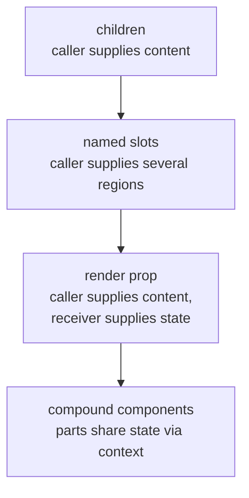

# Composition & Children

> A component that accepts UI instead of describing it stops growing props; `children` is the simplest form of that, and every other composition pattern is a variation on where the caller's markup goes.

**Part:** [02 · Rendering & Frameworks](../) · **Domain:** React · **Priority:** Critical · **Difficulty:** Intermediate · **Reading time:** ~12 min

## TL;DR

**Composition** means a component receives elements from its caller rather than accumulating props to describe every variation. `children` is the default slot; **named slot props** (`header`, `footer`, `icon`) handle multiple positions; **render props** (`children` as a function) hand internal state back to the caller; **compound components** share state through context so a caller can arrange the parts freely. Each step adds power and cost, and the ordering matters — reach for the simplest one that expresses the requirement. `cloneElement` is the exception: it looks like composition but couples a parent to the internals of children it did not write.

> **Recommendation:** Start with `children`; add named slots when there is more than one insertion point; move to context-based compound components only when the parts need shared state.

## At a Glance

| | |
| --- | --- |
| **Use when** | A component's variations are about *what goes inside*, not about behavior — layouts, cards, dialogs, tables, forms. |
| **Avoid when** | The content is fixed and internal; composition then adds indirection with no caller benefit. |
| **Alternatives** | [Configuration props](#alternative-approaches), [render props](#alternative-approaches), [hooks](#alternative-approaches). |
| **Primary risk** | Over-composition — a "flexible" API where callers must assemble six parts correctly to get a working component. |
| **Maturity** | Stable — `children` since React 0.x; the compound-component pattern is standard across major UI libraries. |

## Prerequisites

Composition is about passing elements, so what an element is comes first.

- [Elements vs Components](./elements-vs-components.md) — the difference between passing an element and passing a component.
- [JSX Semantics](./jsx-semantics.md) — how `children` is populated by the transform.

## Overview

**Composition** in React means a component's shape is determined partly by its caller. The mechanism is ordinary props: JSX nests content into the `children` prop, and any other prop can hold elements just as well. Nothing else is required — no slot API, no directives — because elements are values.

The distinction to hold onto is **elements versus components as props**. A slot prop holding `<Icon name="check" />` is an element: already created, ready to place. A prop holding `Icon` is a component: the receiver decides when and with what props to call it. Both are legitimate; confusing them produces "Functions are not valid as a React child" or a prop that renders nothing. TypeScript names them distinctly: `React.ReactNode` for anything renderable, `React.ReactElement` for a single element, `React.ComponentType<P>` for a component.

The boundary with **configuration** is the design decision. A `Card` that accepts `title`, `subtitle`, `badge`, `badgeColor`, `actionLabel`, and `onAction` is describing its content through props; a `Card` that accepts `header` and `children` lets the caller describe it. The first is easier to use for the exact case it anticipates and grows a prop per variation; the second is slightly more verbose per call and stops growing.

## The Problem

The prop explosion is gradual and each step is reasonable. A `Modal` starts with `title` and `children`. Then a design needs an icon next to the title: add `titleIcon`. Then a destructive variant: add `variant`. Then a footer with two buttons: add `primaryLabel`, `onPrimary`, `secondaryLabel`, `onSecondary`. Then one screen needs a link in the footer instead of a button: add `footerSlot`, at which point the component has two mutually exclusive footer APIs and a conditional to reconcile them.

```tsx
// The end state of configuration-driven design.
<Modal
  title="Delete project"
  titleIcon="warning"
  variant="danger"
  primaryLabel="Delete"
  onPrimary={handleDelete}
  primaryDisabled={!confirmed}
  secondaryLabel="Cancel"
  onSecondary={close}
  footerSlot={undefined}
  bodyClassName="delete-modal-body"
/>
```

Every prop is a decision the component author had to anticipate, and the one case they did not anticipate requires either another prop or a fork.

The second problem is the opposite failure: composition taken so far that the component no longer guarantees anything. If a `Select` exposes `Select.Trigger`, `Select.Portal`, `Select.Content`, `Select.Viewport`, `Select.Item`, and `Select.ItemIndicator`, a caller who omits `Select.Viewport` gets a subtly broken listbox, and nothing reports it. Flexibility moved the correctness burden to every call site.

The third is `cloneElement`. It appears to solve slot injection — take the child the caller gave you and add props — but it requires the parent to know the child's prop names, silently does nothing if the caller wraps the child in a `<div>`, and breaks when the child is a fragment or an array.

## Why It Matters

Composition is what determines whether a shared component survives its second consumer. A configuration-driven component is a growing surface that its owner must maintain, and every new consumer either fits the existing props or files a request. A composition-driven component transfers that variation to the caller, which is where the knowledge about the specific screen already lives.

It also has a direct rendering consequence. Elements passed as `children` are created by the *parent*, so when a component re-renders due to its own state, the `children` elements it received are the same objects as before — React can bail out of re-rendering that subtree. This makes "lift the expensive subtree into `children`" one of the few structural performance techniques that costs nothing and does not require memoization.

Finally, composition shapes accessibility. A `Dialog` that owns its header can wire `aria-labelledby` to the title it rendered; one that takes an arbitrary `header` slot must either generate ids and pass them down through context or document the requirement and hope. Which pattern you choose decides whether correct ARIA is the default or an instruction.

## Mental Model

Think of a component as **a frame with holes**, and the patterns as different answers to *who fills the hole and with what information*.



**`children` is a prop like any other.** `<Card>text</Card>` and `<Card children="text" />` produce the same element. That is why children can be an element, an array, a string, or a function.

**Named slots are just element-typed props.** `header={<CardHeader />}` places an element in a fixed position. They are the right tool when the number of regions is fixed and small.

**A render prop inverts the flow of information.** `children` typed as `(state) => ReactNode` lets the receiver hand internal state outward: `<Tooltip>{({ isOpen }) => …}</Tooltip>`. Since hooks arrived, most render props that existed to share *logic* are better as hooks; the ones that remain exist to share *rendering position* plus state.

**Compound components use context to connect parts.** `<Tabs>` provides the selected value; `<Tabs.List>`, `<Tabs.Trigger>`, and `<Tabs.Panel>` consume it. The caller arranges markup freely, and the parts coordinate without prop drilling. The cost is that the parts are only valid inside the parent, which the implementation must enforce with a clear error.

**Children passed down are stable references.** A parent re-render does not create new `children` elements for a component that received them from *its* parent — the elements were created one level up. This is why moving a costly subtree into `children` can eliminate re-renders that memoization would otherwise be needed for.

## Best Practices

**Default to `children`; add a named slot only for a second insertion point.** Two slots and `children` is a comfortable ceiling for most components.

**Type slots precisely.** `React.ReactNode` for content, `React.ReactElement<IconProps>` when you will inspect or clone (rare), `React.ComponentType<P>` when the receiver will render it with its own props.

**Prefer context over `cloneElement` for passing state to parts.** Context survives arbitrary nesting; `cloneElement` breaks the moment a caller wraps a child.

**Give compound components a runtime guard.** A `useTabsContext` hook that throws "Tabs.Trigger must be used within Tabs" turns an invisible bug into an immediate, actionable error.

**Keep the accessible structure inside the component, not in the caller's hands.** Generate ids with `useId`, wire `aria-labelledby`/`aria-controls` internally, and expose slots for *content* rather than for structural elements that carry ARIA.

**Move an expensive subtree into `children` when a parent re-renders often.** A `<Layout>` that owns a frequently-changing state re-renders itself while its `children` elements stay identical, so the subtree is skipped.

## Trade-offs

Composition trades a slightly more verbose call site for a component that stops growing.

**Advantages**

- The component's API stops expanding as consumers multiply, because variation lives at the call site.
- Elements passed as `children` are created by the caller, so unrelated parent state changes do not re-render them.
- Callers can use any markup, including components the shared library has never heard of.

**Disadvantages**

- Every call site repeats structure, so a change to the intended shape is a codemod rather than a one-line default.
- Highly composed APIs let callers assemble the parts wrongly, and the failure is usually visual or ARIA-level, not an exception.
- Context-based coordination makes the data flow implicit, which is harder to follow than props in a stack trace.

| Dimension | Composition | Configuration props |
| --- | --- | --- |
| API growth | Flat as consumers grow | One prop per anticipated variation |
| Call-site verbosity | Higher | Lower for the anticipated case |
| Unanticipated needs | Handled by the caller | Require a change to the component |
| Correctness guarantees | Weaker — the caller can assemble it wrong | Stronger — the component controls the structure |
| Re-render behavior | `children` are stable across parent renders | Props recreated by the parent each render |

## Alternative Approaches

| Approach | Best when | Weakness | See |
| --- | --- | --- | --- |
| `children` | One content region | Cannot address multiple positions | (this article) |
| Named slot props | Two to three fixed regions | Grows back into configuration if unchecked | (this article) |
| Render prop | The caller needs the receiver's internal state | Nesting gets deep; often replaceable by a hook | (this article) |
| Compound components + context | Parts must coordinate and be arranged freely | Implicit data flow; needs runtime guards | [Passing Data Deeply with Context](https://react.dev/learn/passing-data-deeply-with-context) |
| Custom hook | Only *logic* is shared, not layout | Provides no markup; the caller writes it all | (this article) |
| `cloneElement` | Legacy code you cannot restructure yet | Couples parent to child internals; breaks on wrapping | [React — cloneElement](https://react.dev/reference/react/cloneElement) |

## Bad Example

A dialog that grew one prop per requirement, plus a `cloneElement` slot.

```tsx
// ❌ Configuration for everything, and two competing footer APIs.
type ModalProps = {
  title: string;
  titleIcon?: 'warning' | 'info' | 'success';
  variant?: 'default' | 'danger';
  body: string;
  bodyClassName?: string;
  primaryLabel?: string;
  onPrimary?: () => void;
  primaryDisabled?: boolean;
  secondaryLabel?: string;
  onSecondary?: () => void;
  footerSlot?: React.ReactNode;
  children?: React.ReactElement;   // injected with props via cloneElement
};

export function Modal(props: ModalProps) {
  const {
    title, titleIcon, variant = 'default', body, bodyClassName,
    primaryLabel, onPrimary, primaryDisabled, secondaryLabel, onSecondary,
    footerSlot, children,
  } = props;

  return (
    <div role="dialog" className={`modal modal--${variant}`}>
      <h2>
        {titleIcon && <Icon name={titleIcon} />} {title}
      </h2>

      {/* Body can only ever be a string. */}
      <div className={bodyClassName}>{body}</div>

      {/* ❌ Injects props into a child whose shape the Modal does not own. */}
      {children && React.cloneElement(children, { variant, onClose: onSecondary })}

      {/* ❌ Two footer mechanisms, reconciled by a conditional nobody can read. */}
      {footerSlot ?? (
        <footer>
          {secondaryLabel && <button onClick={onSecondary}>{secondaryLabel}</button>}
          {primaryLabel && (
            <button onClick={onPrimary} disabled={primaryDisabled}>{primaryLabel}</button>
          )}
        </footer>
      )}
    </div>
  );
}
```

**What goes wrong:** Thirteen props encode variations the author had to predict, and the fourteenth requirement — a footer with a link and a checkbox — has no home, so `footerSlot` was added and now contradicts the four button props whenever both are supplied. `body: string` means a body containing a list or a form is impossible without another prop. The `cloneElement` call injects `variant` and `onClose` into whatever the caller passed, which silently does nothing if the caller wraps their content in a `<div>`, throws if they pass a fragment or two elements, and requires the child to accept props it never declared. And the dialog is not actually accessible: `role="dialog"` with no `aria-labelledby` pointing at the heading and no focus management means screen reader users get an unnamed dialog — a defect that the prop-heavy design hides because the structure looks owned and complete.

## Good Example

The same dialog as a small composed set, with the accessible wiring kept inside.

```tsx
import { createContext, useContext, useId } from 'react';

type DialogContextValue = { titleId: string; onClose: () => void };
const DialogContext = createContext<DialogContextValue | null>(null);

function useDialogContext(part: string): DialogContextValue {
  const ctx = useContext(DialogContext);
  if (!ctx) throw new Error(`<Dialog.${part}> must be rendered inside <Dialog>`);
  return ctx;
}

type DialogProps = {
  onClose: () => void;
  variant?: 'default' | 'danger';
  children: React.ReactNode;
};

export function Dialog({ onClose, variant = 'default', children }: DialogProps) {
  // ✅ The id is generated and wired internally, so callers cannot forget it.
  const titleId = useId();
  return (
    <DialogContext.Provider value={{ titleId, onClose }}>
      <div role="dialog" aria-modal="true" aria-labelledby={titleId} className={`dialog dialog--${variant}`}>
        {children}
      </div>
    </DialogContext.Provider>
  );
}

Dialog.Title = function DialogTitle({ children }: { children: React.ReactNode }) {
  const { titleId } = useDialogContext('Title');
  return <h2 id={titleId}>{children}</h2>;   // ✅ always matches aria-labelledby
};

Dialog.Body = function DialogBody({ children }: { children: React.ReactNode }) {
  return <div className="dialog__body">{children}</div>;
};

Dialog.Footer = function DialogFooter({ children }: { children: React.ReactNode }) {
  return <footer className="dialog__footer">{children}</footer>;
};

Dialog.CloseButton = function DialogCloseButton({ children }: { children: React.ReactNode }) {
  const { onClose } = useDialogContext('CloseButton');
  return <button type="button" onClick={onClose}>{children}</button>;
};
```

```tsx
// ✅ The call site describes exactly this screen — no props were invented for it.
<Dialog variant="danger" onClose={close}>
  <Dialog.Title>
    <Icon name="warning" aria-hidden="true" /> Delete project
  </Dialog.Title>

  <Dialog.Body>
    <p>This removes {project.name} and its {project.itemCount} items.</p>
    <Checkbox checked={confirmed} onChange={setConfirmed}>
      I understand this cannot be undone
    </Checkbox>
  </Dialog.Body>

  <Dialog.Footer>
    <a href="/docs/deletion">What gets deleted?</a>
    <Dialog.CloseButton>Cancel</Dialog.CloseButton>
    <Button variant="danger" disabled={!confirmed} onClick={handleDelete}>
      Delete
    </Button>
  </Dialog.Footer>
</Dialog>
```

```tsx
// ✅ Children are created by the caller, so `Layout`'s own state changes
//    do not re-render this subtree — no memo needed.
function Layout({ children }: { children: React.ReactNode }) {
  const [sidebarOpen, setSidebarOpen] = useState(false);
  return (
    <div className={sidebarOpen ? 'layout layout--open' : 'layout'}>
      <Sidebar open={sidebarOpen} onToggle={() => setSidebarOpen((v) => !v)} />
      <main>{children}</main>
    </div>
  );
}
```

**Why it's better:** The dialog's API is three props, and the fourteenth requirement is a change at one call site rather than a change to a shared component. `useId` plus the context-provided `titleId` means `aria-labelledby` and the heading's `id` cannot drift apart — the accessible name is structural, not a documented instruction. `useDialogContext` throws a named error if a part is used outside its parent, which converts the classic composed-API failure from "renders, looks slightly wrong" into an immediate message. Context replaces `cloneElement`, so callers may wrap parts in any markup and the parts still receive what they need. The footer now holds a link, a cancel button, and a destructive action — a combination the configuration version could not express — with no new props. And `Layout` shows the rendering benefit: `children` arrive as elements created by the route above, so toggling the sidebar re-renders `Layout` and `Sidebar` while the page content is skipped entirely.

## Common Mistakes

See the [React anti-patterns](../../../anti-patterns/) for the domain catalog. Concept-specific:

### Mistake: Growing configuration props instead of opening a slot

- **Symptom:** A shared component with a dozen optional props, several of which are mutually exclusive, and a `*ClassName` escape hatch per region.
- **Why it fails:** Each prop encodes a variation the author anticipated, so the component must change for every consumer it did not. The mutually exclusive props then need conditionals that no one can fully reason about.
- **Fix:** Replace the region-describing props with a slot: `header`, `footer`, or a compound part. Keep props for *behavior* (`onClose`, `variant`) and give *content* to the caller.

### Mistake: `cloneElement` to inject props into children

- **Symptom:** A parent adds props to `children`; it stops working when a caller wraps the child in a `<div>`, passes a fragment, or passes two elements.
- **Why it fails:** `cloneElement` only reaches the immediate element and requires it to accept props the parent chose. It couples the parent to the children's implementation and fails silently when the shape changes.
- **Fix:** Provide the values through context and consume them in the parts that need them. React's own documentation lists `cloneElement` as an approach to avoid in new code.

### Mistake: Composing so far that correct usage is optional

- **Symptom:** Six required sub-components; omitting one produces a listbox with no ARIA relationship or a menu that does not close.
- **Why it fails:** Flexibility moved responsibility for correctness to the call site, where the knowledge about ARIA and keyboard behavior usually is not.
- **Fix:** Keep the structural and accessible skeleton inside the component and expose slots for content. Where parts must be separate, add runtime guards and make the common arrangement the documented default.

## Checklist

- [ ] Content-shaped props hold elements (`ReactNode`), not strings that will need markup later.
- [ ] The component has at most a few slots; further variation is handled by composition, not new props.
- [ ] No `cloneElement`; shared state reaches the parts through context.
- [ ] Compound parts throw a named error when used outside their parent.
- [ ] Ids for `aria-labelledby`/`aria-controls` are generated with `useId` inside the component.
- [ ] Props that hold components (`ComponentType`) are named and typed distinctly from props that hold elements.
- [ ] Expensive subtrees under a frequently re-rendering parent are passed as `children`.
- [ ] The default arrangement of a composed API is documented and covered by a test.

## Related Articles

- [Elements vs Components](./elements-vs-components.md) — why passing an element differs from passing a component.
- [JSX Semantics](./jsx-semantics.md) — how `children` is assembled by the transform.
- [The Render Phase](./the-render-phase.md) — why `children` created by a parent let React skip a subtree.
- Context (planned) and [Keys & List Reconciliation](./keys-and-list-reconciliation.md) — the mechanisms compound components rely on.

## References

- [React — Passing JSX as children](https://react.dev/learn/passing-props-to-a-component#passing-jsx-as-children) — the canonical description of the `children` prop.
- [React — Passing Data Deeply with Context](https://react.dev/learn/passing-data-deeply-with-context) — the mechanism behind compound components.
- [React — `cloneElement`](https://react.dev/reference/react/cloneElement) — the API and its documented alternatives.
