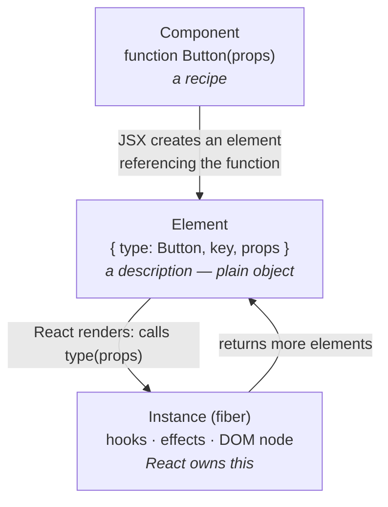

# Elements vs Components

> A component is a *function*. An element is the *plain object* that function returns. Almost every mysterious "why did my state reset?" bug in React is this distinction being violated somewhere.

**Part:** [02 · Rendering & Frameworks](../) · **Domain:** React · **Priority:** Critical · **Difficulty:** Intermediate · **Reading time:** ~12 min

## TL;DR

A **React element** is an immutable plain object — roughly `{ type, props, key }` — that *describes* what should appear on screen. A **component** is a function (or class) whose `type` an element can reference and which returns elements. `<Button color="red" />` doesn't call `Button`; it creates the object `{ type: Button, props: { color: 'red' } }` and hands it to React, which decides when and whether to call it. Reconciliation compares elements at the same position: **same `type` (by reference) and same `key` → same instance, state preserved; different `type` → unmount, remount, state destroyed.** Because a component defined inside another component is a *new function reference* on every render, its elements have a new `type` every time, and React tears down the whole subtree — the single most common cause of lost state, lost focus, and remount loops.

> **Recommendation:** Define components at module scope, always. When you need to inject markup, pass *elements* (via `children` or a prop), not component definitions created inline.

## At a Glance

| | |
| --- | --- |
| **Use when** | Any time you reason about state preservation, remounts, render props, slots, or component identity. |
| **Avoid when** | N/A — this is React's core model, not an optional technique. |
| **Alternatives** | [Passing elements as props](#alternative-approaches), [render props](#alternative-approaches), [`key` to force a reset](#alternative-approaches). |
| **Primary risk** | Defining a component inside a render, which gives it a new identity every render and destroys its subtree's state. |
| **Maturity** | Stable — the element/component split has been unchanged since React 0.12 (2014). |

## Prerequisites

You need JavaScript's value and reference semantics, the client-rendering model React operates in, and the DOM structure React ultimately produces.

- Primitives & Wrappers (planned, `· JavaScript`) — element identity is reference identity, which is why an inline function is a new type.
- The CSR Model (planned, `· Rendering Architectures`) — where React's render/commit cycle sits.
- [The Document Outline](../../01-core-languages/html-semantics/the-document-outline.md) (`· HTML & Document Semantics`) — what the tree of elements ultimately has to produce.

## Overview

**Elements** are values. `<div className="row" />` compiles (via the modern JSX transform) to `jsx('div', { className: 'row' })`, which returns a frozen plain object approximating:

```js
{ type: 'div', key: null, props: { className: 'row' }, /* internal fields */ }
```

That object does nothing. It has no methods, no lifecycle, no DOM node. It is a *description*, cheap to create and cheap to throw away — which is what makes "re-render the whole tree and diff it" a viable strategy at all.

**Components** are functions from props to elements. `function Button(props) { return <button>{props.label}</button> }` is a component; `<Button label="Save" />` is an element whose `type` *is* the `Button` function. React calls `Button` during the render phase — you never call it yourself.

**Instances** are the third thing, and they're React's, not yours. When React commits an element to the tree, it creates internal state (a fiber) holding hooks, effects, and the DOM node. That instance survives across renders as long as the element at that position keeps the same `type` and `key`. That survival rule is the whole game.

The boundary worth drawing: `<Button />` and `Button` are different values with different uses. `<Button />` is an element — a *thing to render*. `Button` is a component — a *recipe*. Passing `<Icon />` as a prop hands over a description; passing `Icon` hands over a recipe the receiver must invoke. Both are valid patterns, but confusing them is where the bugs live.

## The Problem

The canonical failure looks entirely reasonable:

```jsx
function ProfilePage({ user }) {
  // Defined during render — a NEW function object on every single render.
  function Details() {
    return <input defaultValue={user.bio} />;
  }
  return <Details />;
}
```

Every time `ProfilePage` renders, `Details` is a freshly created function. The element `<Details />` therefore has a `type` that is reference-unequal to the previous one. React compares them, concludes the element at this position is a *different kind of thing*, unmounts the old subtree, and mounts a new one. The input loses its value, focus jumps to the body, any `useState` inside resets, effects re-run with cleanup, and animations restart. The symptoms show up as "the form clears while I'm typing" or "focus keeps escaping", which is a long way from the line that caused it.

A second family of problems comes from passing components where elements were wanted, or vice versa. A layout that accepts `icon={<Icon />}` renders it directly; one that accepts `icon={Icon}` must do `<Icon />` itself. Mixing the conventions in one codebase produces `Objects are not valid as a React child` (an element rendered as a component) or a component function rendered as text.

A third is *positional* identity. React matches elements by their position in the returned tree, not by any notion of "the same component". Rendering `cond ? <Input a /> : <Input b />` at the same position preserves state across the switch, because both are `type: Input` at the same slot — which is sometimes what you want and sometimes deeply wrong.

## Why It Matters

Component identity determines when state, effects, refs, and DOM nodes are preserved or destroyed — and those consequences are user-visible in the worst ways. A remount clears uncontrolled inputs, drops focus (an accessibility failure, not just an annoyance), cancels in-flight animations, and re-runs effects, which can mean duplicate network requests, duplicate subscriptions, or duplicate analytics events on every keystroke.

It's a performance issue too. Unmount-and-remount is the most expensive path in reconciliation: React must tear down fibers, run cleanup, construct new fibers, mount effects, and rebuild DOM nodes, where an update would have diffed props and patched attributes. A component defined inline in a frequently-rendering parent turns every parent render into a full subtree replacement — jank whose cause is invisible in a flame chart that just shows "a lot of React work".

Conversely, understanding the rule gives you a precise tool. `key` is not just for lists: changing a `key` on any element deliberately destroys and recreates its instance. That is the idiomatic way to reset a form when the edited record changes, and it is far more reliable than an effect that watches an id and clears state.

## Mental Model

Hold three layers, and keep them separate.



Then the reconciliation rule, which is short enough to memorize:

> At a given position in the tree, React compares the new element's `type` and `key` with the old one's. **Same both → keep the instance and update props. Different either → unmount the old subtree and mount a new one.**

Four consequences worth stating explicitly:

**`type` comparison is `===`.** `'div' === 'div'` is true, so host elements are stable. `Button === Button` is true when `Button` is a module-scope function. A function defined during render is never `===` its previous self.

**Position matters, name doesn't.** React has no idea your component is "the same one" — it knows the element at slot 2 of this parent's children. Change what sits at slot 2 and the instance goes.

**Props changing never remounts.** Passing entirely different props to the same `type` updates in place. This is why passing `<Icon />` as a prop is cheap: the element object is new each render, but its `type` is the stable `Icon` function.

**`key` overrides position.** Two elements of the same type at the same position with different keys are treated as different instances. That's the escape hatch, in both directions.

## Best Practices

**Define every component at module scope.** No exceptions. If a component seems to need closure over the parent's variables, pass those as props instead — that is what props are.

**Prefer passing elements over passing components.** `<Layout sidebar={<Filters />} />` is more flexible than `<Layout sidebar={Filters} />`: the caller controls the props, the receiver just places it, and there is no chance of an accidental inline component definition.

**Use `children` for the common slot.** It's the idiomatic single-slot API and it composes naturally. Reach for named element props when there are several distinct slots.

**Use `key` deliberately to reset state.** `<EditForm key={recordId} record={record} />` guarantees a fresh instance when the record changes — clearer and less bug-prone than an effect that resets fields.

**Memoize elements, not just components.** `React.memo` compares props; if a prop is an element created inline, it is a new object every render and memoization is defeated. Hoist stable elements to module scope or wrap them in `useMemo` when the parent renders often.

**Be aware that rendering an element prop as a component is a real bug.** `function Panel({ header }) { return <header /> }` renders an HTML `<header>`, not the prop. Naming conventions (`headerSlot` for elements, `HeaderComponent` for components) prevent an entire class of confusion.

## Trade-offs

React's element model buys a simple, declarative mental model in exchange for a positional identity rule that is implicit and easy to violate.

**Advantages**

- Elements are cheap, immutable plain objects, so describing the entire UI on every render is affordable.
- Composition is just passing values, so slots, wrappers, and higher-order patterns need no framework machinery.
- The identity rule is a single sentence and gives you precise, deliberate control over state lifetime via `key`.

**Disadvantages**

- Identity depends on position and reference equality, neither of which is visible in JSX at a glance.
- A one-line mistake (an inline component) causes a catastrophic, hard-to-attribute failure mode.
- The element/component distinction is invisible in JSX syntax, so API conventions must carry it.

| Dimension | Element model | Cost / caveat |
| --- | --- | --- |
| Cost per render | Cheap object allocation | Allocation pressure in very hot trees |
| State lifetime | Preserved while type + key + position hold | Silently destroyed when any of the three changes |
| Composition | Pass elements as ordinary values | Element props defeat naive `React.memo` |
| Debuggability | Component names appear in DevTools | Position-based identity isn't shown; remounts are easy to miss |
| Control | `key` gives explicit reset semantics | Misused keys cause remounts you didn't intend |

## Alternative Approaches

These aren't alternatives to the element model — they're the choices available *within* it when you need to inject UI.

| Approach | Best when | Weakness | See |
| --- | --- | --- | --- |
| `children` | One slot; the natural nesting reads well in JSX | Only one unnamed slot | `Composition & Children · React` (planned) |
| Element props (`icon={<Icon />}`) | Multiple named slots; caller owns the props | Element props break shallow `memo` comparison | (this article) |
| Component props (`renderRow={Row}`) | The receiver must supply props the caller can't know | Caller must not define the component inline | (this article) |
| Render props (`children={(item) => …}`) | The receiver has data the caller needs, per item | Verbose; function identity must be stable to memoize | `Composition & Children · React` (planned) |
| `key` for reset | You *want* a fresh instance on identity change | Full remount cost; loses any intentional carry-over | `Keys & List Reconciliation · React` (planned) |

The default ordering: `children` first, named element props when you need more slots, render props only when the receiver owns data the caller needs.

## Bad Example

A settings panel that defines components during render and confuses elements with components.

```jsx
// ❌ Every render redefines these — new function identity → full remount.
function SettingsPage({ user, onSave }) {
  const [tab, setTab] = useState('profile');

  // New function object on EVERY render of SettingsPage.
  function ProfileTab() {
    const [bio, setBio] = useState(user.bio);          // resets on every parent render
    useEffect(() => {
      const sub = subscribeToPresence(user.id);        // re-subscribes every render
      return () => sub.unsubscribe();
    }, [user.id]);
    return <textarea value={bio} onChange={(e) => setBio(e.target.value)} />;
  }

  // Same problem, plus a wrapper that changes identity too.
  const Section = ({ children }) => <section className="card">{children}</section>;

  return (
    <Section>
      <nav>
        <button onClick={() => setTab('profile')}>Profile</button>
        <button onClick={() => setTab('billing')}>Billing</button>
      </nav>
      {tab === 'profile' ? <ProfileTab /> : <BillingTab />}
      {/* Passing a COMPONENT where the child renders an ELEMENT: */}
      <Toolbar icon={SaveIcon} onSave={onSave} />
    </Section>
  );
}

function Toolbar({ icon, onSave }) {
  // `icon` is a function, not an element. Rendering it directly throws.
  return <button onClick={onSave}>{icon}</button>;
  // ❌ "Functions are not valid as a React child."
}
```

**What goes wrong:** `ProfileTab` and `Section` are recreated on every render of `SettingsPage`, so their elements have a new `type` each time. React unmounts and remounts both subtrees on every keystroke in the textarea: `bio` resets to `user.bio` (so typing appears to do nothing), the presence subscription is torn down and re-established continuously despite its `[user.id]` dependency array, and focus is lost from the textarea after every character. The `useEffect` dependency array is irrelevant here — dependencies only matter *within* an instance's lifetime, and the instance doesn't survive. Separately, `Toolbar` receives `SaveIcon`, a function, and tries to render it as a child, which React rejects at runtime.

## Good Example

The same UI, with components at module scope and a clear element/component convention.

```jsx
// ✅ Module scope: stable identity for the lifetime of the module.
function Section({ children }) {
  return <section className="card">{children}</section>;
}

function ProfileTab({ userId, initialBio }) {
  const [bio, setBio] = useState(initialBio);

  useEffect(() => {
    const sub = subscribeToPresence(userId);
    return () => sub.unsubscribe();     // now runs only when userId actually changes
  }, [userId]);

  return (
    <textarea
      value={bio}
      onChange={(e) => setBio(e.target.value)}
      aria-label="Profile bio"
    />
  );
}

// ✅ Convention: props ending in `Slot` hold ELEMENTS and are rendered directly.
function Toolbar({ iconSlot, onSave }) {
  return (
    <button type="button" onClick={onSave}>
      {iconSlot}
      Save
    </button>
  );
}
```

```jsx
// ✅ The page composes stable components and passes elements, not definitions.
const SAVE_ICON = <SaveIcon aria-hidden="true" />; // hoisted: identical object every render

export function SettingsPage({ user, onSave }) {
  const [tab, setTab] = useState('profile');

  return (
    <Section>
      <nav>
        <button type="button" onClick={() => setTab('profile')} aria-current={tab === 'profile'}>
          Profile
        </button>
        <button type="button" onClick={() => setTab('billing')} aria-current={tab === 'billing'}>
          Billing
        </button>
      </nav>

      {tab === 'profile' ? (
        // `key` makes the reset explicit: switching users starts a fresh instance,
        // rather than leaving the previous user's draft bio in the textarea.
        <ProfileTab key={user.id} userId={user.id} initialBio={user.bio} />
      ) : (
        <BillingTab key={user.id} userId={user.id} />
      )}

      <Toolbar iconSlot={SAVE_ICON} onSave={onSave} />
    </Section>
  );
}
```

**Why it's better:** Moving `ProfileTab` and `Section` to module scope gives their elements a stable `type`, so React updates the existing instances instead of replacing them — `bio` persists while typing, focus stays in the textarea, and the presence subscription is created once per `userId` exactly as the dependency array intended. What the closure used to provide is now passed as props, which is both explicit and testable. The `key={user.id}` turns state reset from an accident into a stated intention: switching users *should* discard the previous draft, and this is the mechanism that guarantees it. The `iconSlot` naming makes the element-vs-component contract visible at the call site, and hoisting `SAVE_ICON` to module scope means the prop is reference-stable, so `Toolbar` stays memoizable.

## Common Mistakes

See the [React anti-patterns](../../../anti-patterns/) for the domain catalog. Concept-specific:

### Mistake: Defining a component inside another component

- **Symptom:** Uncontrolled inputs clear while typing, focus escapes, effects re-run every render despite a correct dependency array, animations restart.
- **Why it fails:** The inner function is a new object on every render, so the element's `type` fails the `===` check. React unmounts the entire subtree and mounts a fresh one, discarding all state, refs, and DOM nodes.
- **Fix:** Move the definition to module scope and pass what it closed over as props. If it needs to be co-located for readability, pass an element via `children` or a slot prop instead of defining a component. The `react/no-unstable-nested-components` ESLint rule catches this automatically — enable it.

### Mistake: Passing a component where an element is expected (or vice versa)

- **Symptom:** `Functions are not valid as a React child`, or `Objects are not valid as a React child`, or a prop that silently renders nothing.
- **Why it fails:** `<Icon />` is an object to place; `Icon` is a function to call. A receiver that renders `{icon}` needs the first; one that renders `<Icon />` needs the second. JSX makes them look interchangeable.
- **Fix:** Adopt a naming convention — `xxxSlot`/`xxxElement` for elements, `XxxComponent`/`renderXxx` for components — and type it in TypeScript: `React.ReactNode` for elements, `React.ComponentType<P>` for components.

### Mistake: Using an array index as a key in a reorderable list

- **Symptom:** Rows swap content when the list is sorted or filtered; the wrong row's input keeps its value; checkboxes attach to the wrong item.
- **Why it fails:** With index keys, position *is* the key, so reordering keeps the same key at the same slot. React updates props on the existing instance instead of moving it, and any internal state stays attached to the position rather than to the data.
- **Fix:** Key by a stable id from the data. Index keys are safe only for lists that are append-only and never reordered, filtered, or sorted.

## Checklist

- [ ] No component is defined inside another component's body.
- [ ] `react/no-unstable-nested-components` is enabled in ESLint.
- [ ] Slot props that hold elements are named and typed distinctly from props that hold components.
- [ ] Elements passed as props are hoisted or memoized when the parent renders frequently.
- [ ] `key` is used deliberately where a state reset is intended, and is a stable data id in lists.
- [ ] No array indexes as keys in lists that can be reordered, filtered, or sorted.
- [ ] Conditional branches that should *not* share state render at different positions or carry different keys.
- [ ] Unexpected remounts have been checked in React DevTools' Profiler (mount vs update), not assumed absent.

## Related Articles

- [JSX Semantics](./) (planned) — exactly what JSX compiles to, and why the transform matters here.
- [Composition & Children](./) (planned) — slot patterns, render props, and choosing between them.
- The Render Phase (planned) and Reconciliation & Diffing (planned) — what React does with the elements you return.
- [Keys & List Reconciliation](./) (planned) — the key rule in the context where it bites most often.
- **Canonical home:** the DOM structure these elements ultimately produce is owned by [The Document Outline · HTML & Document Semantics](../../01-core-languages/html-semantics/the-document-outline.md).

## References

- [React — Describing the UI](https://react.dev/learn/describing-the-ui) — the official framing of components as functions returning element trees.
- [React — Preserving and Resetting State](https://react.dev/learn/preserving-and-resetting-state) — the normative explanation of position, type, and `key` identity.
- [React — createElement](https://react.dev/reference/react/createElement) — the element object's actual shape, beneath JSX.
- [React — Passing JSX as children](https://react.dev/learn/passing-props-to-a-component#passing-jsx-as-children) — the idiomatic way to hand elements to a component.
