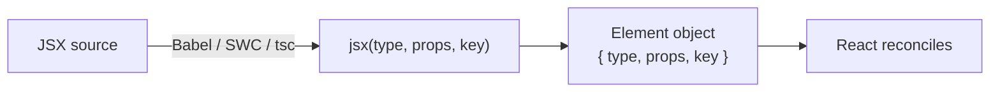

# JSX Semantics

> JSX is a compile-time transform into ordinary function calls; every rendering surprise — a stray `0`, a lost `key`, a `class` that does nothing — is a rule of that transform, not a mystery of React.

**Part:** [02 · Rendering & Frameworks](../) · **Domain:** React · **Priority:** Critical · **Difficulty:** Intermediate · **Reading time:** ~12 min

## TL;DR

JSX is syntax, not behavior. Under the **automatic runtime** (React 17+, the default in every current toolchain) `<Button color="red">Save</Button>` compiles to `jsx(Button, { color: 'red', children: 'Save' })` — a call that returns a plain element object without importing `React`. Three rules explain most confusion: **capitalization decides** whether the `type` is a string (host element) or a reference (component); **`key` is extracted by the transform** and never appears in `props`; and **`false`, `null`, `undefined`, and `true` render nothing while `0` and `NaN` render as text**, which is why `{count && <Badge />}` prints a zero.

> **Recommendation:** Use the automatic runtime, render conditionals with ternaries or explicit boolean coercion rather than `&&` on numbers, and keep expressions in JSX free of side effects.

## At a Glance

| | |
| --- | --- |
| **Use when** | Always, for describing element trees — the alternative is hand-writing the same calls. |
| **Avoid when** | Generating elements from data at runtime, where `jsx()`/`createElement` directly is clearer. |
| **Alternatives** | [`createElement` directly](#alternative-approaches), [template literals (htm)](#alternative-approaches), a different framework's template syntax. |
| **Primary risk** | Treating JSX as HTML: `class`, `for`, raw `0` values, and injected markup all behave differently. |
| **Maturity** | Stable — JSX since React 0.4; the automatic runtime since React 17 (2020). |

## Prerequisites

JSX produces elements, so what an element is comes first.

- [Elements vs Components](./elements-vs-components.md) — the object JSX creates and the function it may reference.

## Overview

**JSX** is an expression syntax that a compiler — Babel, SWC, esbuild, or TypeScript itself — rewrites into function calls before the code ever runs. The browser never sees JSX. Under the **classic runtime**, the output was `React.createElement(type, props, ...children)`, which is why files needed `import React from 'react'` even when the identifier appeared nowhere in the source. Under the **automatic runtime**, the compiler injects `import { jsx as _jsx } from 'react/jsx-runtime'` and emits `_jsx(type, props, key)`, with `jsxs` used when children are a static array and `jsxDEV` in development builds, which carries source location for error messages.

The boundary worth drawing: JSX is not HTML and not a template language. It has no loops, no conditionals, and no directives, because it does not need them — anything inside `{}` is a JavaScript expression, and the surrounding language supplies the control flow. What JSX does add is a set of small, fixed rules about attribute names, children flattening, whitespace, and which values are renderable. Those rules are the whole surface area, and they are where the bugs live.

## The Problem

JSX looks enough like HTML that engineers apply HTML intuitions, and the failures are quiet.

```tsx
// Renders "0" above an empty list instead of nothing.
{items.length && <ItemList items={items} />}

// The attribute is dropped: `class` is not a DOM property React sets.
<div class="card" />

// The key is inside the spread, so React never receives it as a key.
<Row {...{ ...row, key: row.id }} />
```

The first is the best-known: `&&` returns its left operand when that operand is falsy, and `0` is a renderable value, so an empty list renders a literal zero into the layout. The second silently loses styling in a way that looks like a CSS problem. The third produces a `key` warning or, worse, no warning and a list that reorders incorrectly.

A second class of problem comes from treating JSX as a place to *do* things. An expression that mutates state, fires analytics, or creates an object literal runs on every render, in render phase, where React makes no guarantees about how many times it will call your function. Under Strict Mode in development it deliberately calls twice, which turns "runs once" assumptions into duplicated events.

The third is trusting JSX with untrusted markup. `dangerouslySetInnerHTML` is the only way to inject raw HTML, and the ceremony of its name is the entire safety mechanism — the API does no sanitization at all.

## Why It Matters

Every component in a React codebase is written in JSX, so its rules are exercised thousands of times a day. A rule that is nearly understood produces bugs that are individually small — a stray zero, a dropped attribute, a list that reorders wrongly — and collectively expensive, because each one is diagnosed from the rendered output rather than from a compile error.

Knowing the compiled form also changes how you reason about performance and identity. Seeing that `<Row {...props} />` is a function call returning a fresh object makes it obvious why a new object literal in a prop breaks memoization, why an inline arrow is a new reference each render, and why hoisting a constant element out of a component is a real (if small) win. Without that model, these are folklore rules; with it, they are arithmetic.

And the security dimension is not optional. JSX escapes interpolated strings, which is why React applications are largely free of reflected XSS by default — but `dangerouslySetInnerHTML`, `href={userValue}`, and `<script>` injection through third-party HTML all sit outside that protection, and the rules for each are part of knowing the syntax.

## Mental Model

Read JSX as **nested function calls with an object argument**.

```tsx
<Card title="Orders" onSelect={handleSelect}>
  <Row key={order.id} order={order} />
  {total > 0 && <Total value={total} />}
</Card>
```

compiles (automatic runtime, simplified) to:

```js
jsxs(Card, {
  title: 'Orders',
  onSelect: handleSelect,
  children: [
    jsx(Row, { order: order }, order.id),   // `key` is the third argument, not a prop
    total > 0 && jsx(Total, { value: total }),
  ],
});
```

Five rules follow from that shape.

**Capitalization selects the `type`.** A lowercase tag becomes the string `'div'`; a capitalized identifier or a dotted member expression (`Icons.Chevron`) becomes the value itself. This is why a component defined with a lowercase name renders as an unknown HTML element rather than being called.

**Props are one object, and `children` is a prop.** Attributes, spreads, and the nested content all land in the same object. `key` and (before React 19) `ref` are the exceptions, extracted by the transform and consumed by React itself.

**Attribute names are DOM property names, not HTML attribute names.** `className`, `htmlFor`, `tabIndex`, `readOnly`. Custom attributes and `data-*`/`aria-*` pass through as written.

**Renderable values are a fixed set.** Strings and numbers render as text; arrays render each item; elements render; `null`, `undefined`, `false`, and `true` render nothing. Everything else — plain objects, functions, symbols — throws. `0` and `NaN` are numbers, so they render.

**Whitespace follows text-layout rules, not source layout.** JSX removes lines that are pure whitespace and trims leading and trailing whitespace on each line, joining the remainder with a single space. A space you need between two elements must be explicit: `{' '}` or a string literal.



## Best Practices

**Use the automatic runtime.** Set `"jsx": "react-jsx"` in `tsconfig.json` (or the equivalent bundler default) and delete the unused `React` imports; error messages improve and bundles shrink slightly.

**Coerce before `&&`.** Write `{items.length > 0 && <List />}` or a ternary. The rule is: never put a value that could be `0` or `NaN` on the left of `&&` in JSX.

**Pass `key` explicitly, outside any spread.** `<Row key={row.id} {...row} />`. Keys are consumed by the transform, so a `key` hidden in a spread object does not reliably become the element's key.

**Keep JSX expressions pure.** No state updates, no analytics calls, no `Date.now()` that feeds rendered output. Render may run more than once for one commit, and does so deliberately in development Strict Mode.

**Extract complex conditions into variables above the return.** A ternary nested three levels deep is unreadable and hides which branch renders nothing; a named `const banner = …` fixes both.

**Sanitize before `dangerouslySetInnerHTML`, and prefer not to use it.** If markup must come from a CMS or user content, run it through a sanitizer (DOMPurify or a server-side equivalent) with an explicit allowlist, and never interpolate untrusted data into `javascript:`-capable attributes such as `href` or `src`.

## Trade-offs

JSX trades a build step and a small learning surface for expressions that compose with the language.

**Advantages**

- Control flow is plain JavaScript, so there is no template DSL to learn, extend, or debug.
- Compiles to ordinary calls, which keeps the mental model simple and makes tooling (type checking, linting, refactoring) work on ordinary code.
- Interpolated strings are escaped by default, which removes the most common XSS vector.

**Disadvantages**

- Requires a compiler, so no plain-`<script>` usage without a runtime transform.
- The near-HTML syntax invites HTML assumptions that are wrong (`class`, whitespace, `0` rendering).
- Long conditional trees are easy to write and hard to read, and the syntax does nothing to discourage them.

| Dimension | JSX | Cost / caveat |
| --- | --- | --- |
| Expressiveness | Full JavaScript inside `{}` | Also permits side effects that break render purity |
| Safety | Auto-escaped interpolation | `dangerouslySetInnerHTML` and URL attributes are outside it |
| Tooling | Type-checked, lintable, refactorable | Needs correct `jsx` compiler settings to type-check at all |
| Readability | Structure mirrors output | Deep ternaries degrade quickly |
| Build | One transform, universally supported | A build step is mandatory |

## Alternative Approaches

| Approach | Best when | Weakness | See |
| --- | --- | --- | --- |
| JSX | The default for React code | Requires a compiler | (this article) |
| `createElement` / `jsx()` directly | Generating elements dynamically from data | Verbose and hard to scan for static trees | [Elements vs Components](./elements-vs-components.md) |
| Tagged templates (`htm`) | No build step is available | Non-standard tooling; weaker type checking | (this article) |
| Element-returning helpers | A tree is repeated with small variations | Hides structure; often better as a component | [Composition & Children](./composition-and-children.md) |

## Bad Example

A dashboard header that applies HTML intuitions to JSX.

```tsx
// ❌ Several rules broken at once.
function DashboardHeader({ user, notifications, htmlBio }) {
  return (
    <header class="dashboard-header">                    {/* dropped: not a DOM property */}
      <h1>Welcome back, {user.name}</h1>

      {/* Renders a literal "0" when there are no notifications. */}
      {notifications.length && <Badge count={notifications.length} />}

      {/* Fires on every render, including Strict Mode's second pass. */}
      {analytics.track('header_rendered', { userId: user.id })}

      {/* Unsanitized markup from a CMS field. */}
      <div dangerouslySetInnerHTML={{ __html: htmlBio }} />

      <nav>
        {notifications.map((n, i) => (
          // Key inside a spread, and an index fallback that reorders wrongly.
          <NotificationRow {...{ ...n, key: n.id ?? i }} />
        ))}
      </nav>

      <a href={user.website}>Website</a>          {/* `javascript:` URLs execute */}
      <label for="search">Search</label>          {/* dropped: use htmlFor */}
    </header>
  );
}
```

**What goes wrong:** `class` and `for` are HTML attribute names; React sets DOM properties, so the styling and the label association both silently fail — and neither produces a runtime error, so they are found by a designer, not by CI. `notifications.length &&` renders `0` into the header whenever the list is empty, because `&&` returns the number and numbers are renderable. The `analytics.track(...)` call sits in an expression slot, so it runs during render — twice per render in development Strict Mode, and again on every re-render, inflating the metric and returning `undefined` into the tree. `dangerouslySetInnerHTML` injects CMS markup with no sanitizer, so a stored `` is a stored XSS. The `key` is buried inside a spread rather than passed as its own attribute, and the `?? i` fallback keys by position, which swaps row state when the list reorders. And `href={user.website}` will happily render `javascript:alert(1)` if that string reaches the profile field.

## Good Example

The same header with the transform's rules respected.

```tsx
import DOMPurify from 'dompurify';

type DashboardHeaderProps = {
  user: { name: string; website: string | null; bioHtml: string };
  notifications: readonly Notification[];
};

/** Only http(s) links are rendered; anything else is shown as plain text. */
function safeHref(raw: string | null): string | undefined {
  if (!raw) return undefined;
  try {
    const url = new URL(raw, window.location.origin);
    return url.protocol === 'https:' || url.protocol === 'http:' ? url.href : undefined;
  } catch {
    return undefined;
  }
}

export function DashboardHeader({ user, notifications }: DashboardHeaderProps) {
  const hasNotifications = notifications.length > 0;
  const website = safeHref(user.website);
  // ✅ Sanitize once per value, not on every render of every child.
  const bio = React.useMemo(() => DOMPurify.sanitize(user.bioHtml), [user.bioHtml]);

  return (
    <header className="dashboard-header">
      <h1>Welcome back, {user.name}</h1>

      {/* ✅ Boolean on the left of `&&`, so nothing renders when the list is empty. */}
      {hasNotifications && <Badge count={notifications.length} />}

      {/* ✅ Sanitized, and the field is documented as HTML in the prop name. */}
      <div className="bio" dangerouslySetInnerHTML={{ __html: bio }} />

      <nav aria-label="Notifications">
        {notifications.map((notification) => (
          // ✅ `key` is its own attribute and a stable id from the data.
          <NotificationRow key={notification.id} notification={notification} />
        ))}
      </nav>

      {website ? (
        <a href={website} rel="noopener noreferrer">
          Website
        </a>
      ) : (
        <span>{user.website ?? 'No website'}</span>
      )}

      <label htmlFor="search">Search</label>
      <input id="search" type="search" />
    </header>
  );
}
```

```tsx
// ✅ Side effects belong in an effect, not in an expression slot.
React.useEffect(() => {
  analytics.track('header_viewed', { userId: user.id });
}, [user.id]);

// ✅ Explicit whitespace where JSX would otherwise drop it.
<p>
  Signed in as <strong>{user.name}</strong>{' '}
  <a href="/account">Manage account</a>
</p>;
```

**Why it's better:** `className` and `htmlFor` are the property names React actually sets, so the styling and the label-to-input association work — and the `htmlFor`/`id` pair is what makes the input reachable by screen readers and by clicking the label. `hasNotifications` puts a boolean on the left of `&&`, which is the general fix for the stray-zero class of bug, and it names the condition at the same time. The analytics call moved into `useEffect` with a dependency, so it fires once per user, after commit, regardless of how many times render runs. `DOMPurify.sanitize` runs inside `useMemo` so untrusted markup is filtered against an allowlist once per value rather than on every render. `safeHref` rejects any protocol other than HTTP(S), which closes the `javascript:` URL vector while still rendering the raw text so the user can see what was stored. And `key` is passed as its own attribute with a stable id, so reordering moves instances instead of reassigning their contents.

## Common Mistakes

See the [React anti-patterns](../../../anti-patterns/) for the domain catalog. Concept-specific:

### Mistake: `{count && <Component />}` with a numeric left operand

- **Symptom:** A literal `0` appears in the UI where nothing should render, often inside a flex row that now has an extra text node.
- **Why it fails:** `&&` evaluates to its left operand when that operand is falsy, and `0` is a renderable value in JSX. The same applies to `NaN` and to empty strings in some layouts.
- **Fix:** Compare explicitly (`count > 0 && …`), coerce (`Boolean(count) && …`), or use a ternary with an explicit `null` branch.

### Mistake: Putting `key` inside a spread

- **Symptom:** A `key` warning that persists after "adding a key," or list rows whose internal state follows position instead of data.
- **Why it fails:** `key` is consumed by the JSX transform, not passed through as a prop, so a `key` that only exists inside a spread object is not reliably seen as the element's key.
- **Fix:** Write `key` as its own attribute on the element, before or after the spread, and source it from a stable id in the data.

### Mistake: Calling `dangerouslySetInnerHTML` on content you did not author

- **Symptom:** A CMS field, a Markdown render, or a user bio is injected directly; a stored `` executes for every viewer.
- **Why it fails:** React escapes interpolated strings but performs no sanitization on `__html` — the API exists precisely to opt out of the escaping. "It comes from our CMS" is not a trust boundary if any user can edit the CMS.
- **Fix:** Sanitize with an allowlist-based library before rendering, or render structured content (Markdown AST to components) so raw HTML never enters. Keep a `Content-Security-Policy` as a second layer.

## Checklist

- [ ] `"jsx": "react-jsx"` (automatic runtime) is configured, and no file imports `React` only for JSX.
- [ ] No `&&` in JSX has a numeric or string left operand.
- [ ] `key` is always a standalone attribute with a stable data id, never inside a spread and never an index in reorderable lists.
- [ ] JSX expression slots contain no side effects — no state updates, tracking calls, or mutation.
- [ ] Attribute names use DOM property spellings (`className`, `htmlFor`, `tabIndex`, `readOnly`).
- [ ] Every `dangerouslySetInnerHTML` value is sanitized with an allowlist, and the sanitize call is memoized.
- [ ] URL-valued attributes (`href`, `src`, `action`) built from user data are protocol-checked.
- [ ] Intentional whitespace between inline elements is written explicitly with `{' '}`.

## Related Articles

- [Elements vs Components](./elements-vs-components.md) — the objects JSX produces and the identity rules that follow.
- [Composition & Children](./composition-and-children.md) — how `children` and slot props are typed and passed.
- [The Render Phase](./the-render-phase.md) — what React does with the elements a component returns, and why expressions must stay pure.
- [Keys & List Reconciliation](./keys-and-list-reconciliation.md) — the `key` rule in the context where it matters most.

## References

- [React — Writing Markup with JSX](https://react.dev/learn/writing-markup-with-jsx) — the syntax rules, including attribute naming and single-root requirements.
- [Introducing the New JSX Transform](https://legacy.reactjs.org/blog/2020/09/22/introducing-the-new-jsx-transform.html) — what the automatic runtime emits and why the `React` import became unnecessary.
- [React — Conditional Rendering](https://react.dev/learn/conditional-rendering) — the renderable-value rules behind the `&&` behavior.
- [React — Dangerously setting the inner HTML](https://react.dev/reference/react-dom/components/common#dangerously-setting-the-inner-html) — the documented escape hatch and its warning.
