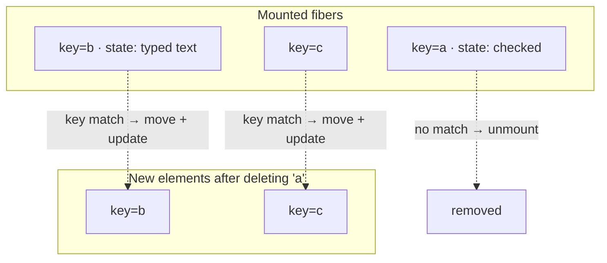

# Keys & List Reconciliation

> A key is not an ID for React's benefit. It is your answer to the question "which of last render's siblings is this one?" — and an index answers it wrong the moment the list changes shape.

**Part:** [02 · Rendering & Frameworks](../) · **Domain:** React · **Priority:** Critical · **Difficulty:** Intermediate · **Reading time:** ~12 min

## TL;DR

Inside a set of siblings, React matches new elements to existing fibers by **`key` first, position second**. With no key, position *is* the identity, so inserting an item at the top shifts every element into a different slot and React updates each fiber with the wrong item's props — preserving state (input values, focus, animation, uncontrolled DOM state) in the wrong rows. A key that is derived from array **index** has the same failure, because indices renumber on every insertion, deletion, sort, and filter. A correct key is **stable, unique among its siblings, and derived from the data's identity** — usually a server ID. Keys are scoped to the sibling set, not global, and they are consumed by React rather than passed to your component as a prop.

> **Recommendation:** Key every list by a stable data ID. Use the index only for lists that are static, append-only, and contain no state, no refs, and no uncontrolled inputs — and add a comment saying so.

## At a Glance

| | |
| --- | --- |
| **Use when** | Rendering any array of elements, and whenever you need a subtree to reset on identity change. |
| **Avoid when** | Never avoided for lists; only *index* keys should be avoided. |
| **Alternatives** | [Index keys](#alternative-approaches), composite keys, client-generated IDs, `useId` for form associations. |
| **Primary risk** | Index keys silently pairing item data with the wrong row's state after a reorder or deletion. |
| **Maturity** | Stable — key semantics unchanged across every React version. |

## Prerequisites

Keys refine a diff you need to understand first.

- [The Render Phase](./the-render-phase.md) — when this matching happens and what it produces.
- [Elements vs Components](./elements-vs-components.md) — `key` as a field on the element, not a prop on the component.

## Overview

When React reconciles a set of siblings, it builds a map of the existing children by key and matches the new children against it:

| Situation | React's behavior |
| --- | --- |
| New child's key matches an existing child's key | Reuse that fiber — even if it moved position. Update props, keep state and DOM. |
| New child's key has no match | Mount a fresh subtree. |
| Existing key has no new child | Unmount that subtree, running cleanups. |
| No keys supplied | Fall back to index-based matching — position is identity. |

Three properties of keys catch people out.

**Keys are scoped to siblings.** Two lists elsewhere in the tree may use the same key values with no interaction. Keys do not need to be globally unique — only unique among direct siblings.

**Keys are not props.** `key` is stripped from `props` by `createElement`. A component that needs the same value must receive it separately (`<Row key={id} id={id} />`).

**`key` works outside lists too.** Placing `key` on a single element makes it an identity marker; changing it forces a remount. That is the sanctioned way to reset a subtree on entity change.

Fragments accept keys only in their explicit form: `<React.Fragment key={id}>…</React.Fragment>`, not `<>…</>`.

## The Problem

Index keys look correct because they satisfy the warning React prints. They fail as soon as the list changes shape.

```jsx
function TodoList({ todos, onDelete }) {
  return (
    <ul>
      {todos.map((todo, i) => (
        <li key={i}>                          {/* ❌ */}
          <input type="checkbox" defaultChecked={todo.done} />
          <input type="text" defaultValue={todo.title} />
          <button onClick={() => onDelete(todo.id)}>x</button>
        </li>
      ))}
    </ul>
  );
}
```

Delete the first todo. The second item moves to index `0`, so React matches the *new* item at key `0` against the fiber that used to hold the deleted item. Since the type matches, it updates rather than remounts — and the `<input>` elements are uncontrolled, so their DOM state stays. The user sees the deleted row's checkbox and typed text now attached to the row below it. React reports no error; the data is right and the DOM is wrong.

Sorting makes it worse: nothing mounts or unmounts at all, every fiber is simply updated in place, so all preserved state stays put while the labels shuffle around it. Focus, scroll position within a row, and CSS transitions all belong to the wrong item.

The opposite mistake is a key that changes when it should not:

```jsx
{items.map((item) => (
  <Row key={Math.random()} item={item} />   // ❌ new key every render
))}
```

Every render produces keys with no matches, so React unmounts the entire list and mounts it again — destroying all state, re-running every effect, and rebuilding every DOM node on every update.

## Why It Matters

The failure mode is uniquely nasty because the *visible data is correct*. Props flow from the array, so labels, prices, and statuses all render the right values. What is wrong is everything React preserves rather than re-renders: uncontrolled input values, checkbox state, focus, text selection, scroll offsets inside the row, `useState` inside the row component, refs, in-flight CSS transitions, and video playback position. Reviewers reading the code see correct data flow; QA sees "the checkbox jumped".

There is a performance dimension as well. With correct keys, moving an item is a DOM move — React reorders the existing nodes. With index keys, a reorder becomes N prop updates across N fibers, and with random keys it becomes N unmounts plus N mounts, along with every effect cleanup and setup in the list. On a virtualized or animated list this is the difference between a smooth reorder and a visible rebuild.

Keys are also the cleanest reset mechanism React offers. Resetting a subtree by clearing six pieces of state in an effect is fragile and easy to leave incomplete; `key={entityId}` resets everything, is one line, and states the intent at the call site.

## Mental Model

Think of the sibling set as a keyed map, not a positional array.



Four rules cover it.

**The key answers "which one is this?"** If the answer changes when the item did not, state moves. If it stays the same when the item changed, stale state persists.

**Index is a positional answer to an identity question.** It is correct only while position and identity coincide — that is, never after an insertion, deletion, sort, or filter.

**Keys are sibling-scoped.** Uniqueness is required only within one array; reuse across different lists is fine.

**Changing a key is a remount request.** Outside lists, that is the feature; inside lists, it is usually a bug.

## Best Practices

**Key by a stable ID from the data.** Server-assigned IDs are ideal because they survive refetches, reorders, and cache updates.

**Generate IDs at creation time for client-only items.** `crypto.randomUUID()` when the item is created — not during render — gives optimistic rows a stable identity before the server responds.

**Compose a key from fields only when nothing else is unique.** `` `${row.date}-${row.userId}` `` is acceptable if that pair is genuinely unique and stable; document why.

**Never call `Math.random()` or `Date.now()` in a key.** Both change every render and force a full remount of the list.

**Put the key on the outermost element returned by `map`.** Not on a child inside it, and not on the component's own root inside its definition.

**Use keyed `<Fragment>` when a row renders multiple siblings.** `<>` cannot carry a key.

**Use `key` deliberately outside lists** to reset a subtree when an entity changes, instead of writing a reset effect.

## Trade-offs

Keys give identity, and identity has to come from somewhere.

**Advantages**

- Reorders become moves rather than rebuilds — state, focus, and DOM nodes follow their item.
- Insertions and deletions touch only the affected rows.
- A one-line, self-documenting reset mechanism for non-list subtrees.
- Correct animation and transition behavior for items that move.

**Disadvantages**

- Requires a stable identity to exist, which client-created items do not have until you make one.
- Composite keys are brittle: they silently break when a "unique" combination turns out not to be.
- Keys are invisible in the rendered output, so a wrong key is not observable without reproducing the reorder.
- Changing a key intentionally discards *all* state below it, including state you may have wanted to keep.

| Dimension | Stable ID key | Index key | Random key |
| --- | --- | --- | --- |
| Insert at top | One mount | N updates, state misaligned | Full remount |
| Delete middle | One unmount | N updates, state shifts up | Full remount |
| Sort | Moves, state follows | Updates in place, state stays put | Full remount |
| Uncontrolled input safety | Safe | Corrupted | Wiped every render |
| Cost per update | Proportional to changes | Proportional to list length | Proportional to list length |
| Acceptable when | Always | Static, append-only, stateless rows | Never |

## Alternative Approaches

| Approach | Best when | Weakness | See |
| --- | --- | --- | --- |
| Server ID as key | The default whenever data has an ID | Requires the ID to be present before render | (this article) |
| Client-generated UUID | Optimistic or draft rows created in the browser | Must be generated at creation, never in render | [Optimistic Updates · Data & Server State](../../03-application-architecture/data-server-state/optimistic-updates.md) |
| Composite key from fields | No single unique field exists | Breaks silently if the combination repeats | (this article) |
| Index key | Static, append-only, no state or refs in rows | Any reorder or deletion corrupts state alignment | (this article) |
| `key` outside a list | Resetting a subtree when an entity changes | Discards all subtree state, not just the parts you meant | [Reconciliation & Diffing](./reconciliation-and-diffing.md) |

## Bad Example

A list whose keys track position rather than identity.

```jsx
function Cart({ lines, onRemove, onReorder }) {
  return (
    <ul>
      {lines.map((line, i) => (
        // ❌ Index: renumbers on every removal and reorder.
        <li key={i}>
          <QuantityStepper defaultValue={line.qty} />   {/* uncontrolled state */}
          <span>{line.product.name}</span>
          <button onClick={() => onRemove(i)}>Remove</button>
        </li>
      ))}
    </ul>
  );
}

function RecentlyViewed({ products }) {
  return (
    <div>
      {products.map((p) => (
        // ❌ New key every render → unmount + mount the whole list, always.
        <ProductCard key={Math.random()} product={p} />
      ))}
    </div>
  );
}

function Rows({ rows }) {
  return rows.map((row) => (
    // ❌ Fragment shorthand cannot carry a key; React warns and falls back to index.
    <>
      <dt>{row.term}</dt>
      <dd>{row.definition}</dd>
    </>
  ));
}
```

**What goes wrong:** In `Cart`, removing the second of five lines shifts lines three through five down one index, so React updates the fibers at indices 1–3 with new props while keeping their existing state — every `QuantityStepper` below the removed line now displays the quantity that belonged to the line above it. The product names are correct because they come from props, which is exactly why this survives code review: the bug lives entirely in the state React preserved. `RecentlyViewed` is the opposite extreme — `Math.random()` produces keys that never match, so every render unmounts and remounts every card, re-running image loads, effect subscriptions, and entry animations on each parent update, which reads as "the list flickers". And `Rows` uses the fragment shorthand, which cannot accept a key at all, so React logs a warning and falls back to index matching, quietly reintroducing the first bug in a place where the author believed no key was needed.

## Good Example

The same lists keyed by identity.

```jsx
function Cart({ lines, onRemove }) {
  return (
    <ul>
      {lines.map((line) => (
        // ✅ Stable identity: the line survives reorders and removals.
        <li key={line.id}>
          <QuantityStepper defaultValue={line.qty} />
          <span>{line.product.name}</span>
          <button onClick={() => onRemove(line.id)}>Remove</button>
        </li>
      ))}
    </ul>
  );
}
```

```jsx
// ✅ IDs assigned at creation time, not during render.
function addDraftLine(lines, product) {
  return [...lines, { id: crypto.randomUUID(), product, qty: 1, pending: true }];
}

function RecentlyViewed({ products }) {
  return (
    <div>
      {products.map((p) => (
        <ProductCard key={p.id} product={p} />
      ))}
    </div>
  );
}
```

```jsx
// ✅ Explicit Fragment carries the key when a row renders multiple siblings.
import { Fragment } from "react";

function Rows({ rows }) {
  return rows.map((row) => (
    <Fragment key={row.id}>
      <dt>{row.term}</dt>
      <dd>{row.definition}</dd>
    </Fragment>
  ));
}
```

```jsx
// ✅ A composite key where no single field is unique — with the reason recorded.
function Availability({ slots }) {
  return slots.map((slot) => (
    // One slot per (room, startsAt) pair is guaranteed by the booking service.
    <Slot key={`${slot.roomId}:${slot.startsAt}`} slot={slot} />
  ));
}
```

```jsx
// ✅ `key` outside a list: switching conversations starts a clean composer.
<MessageComposer key={conversationId} conversationId={conversationId} />
```

**Why it's better:** Keying `Cart` by `line.id` means React matches each fiber to its own line regardless of position, so removing a line unmounts exactly that row and every remaining stepper keeps the quantity that belongs to it — the reorder becomes a DOM move rather than a cascade of mismatched prop updates. Removing by `line.id` instead of index removes the parallel indexing bug in the callback. Generating the UUID inside `addDraftLine` gives optimistic rows an identity from the instant they exist, so a draft keeps its state while the server round-trip completes and can later be reconciled with the server's ID. `ProductCard` keyed by `p.id` renders once and stays mounted, so image loading and entry animations happen once instead of on every parent render. The explicit `Fragment` carries the key that `<>` cannot, eliminating the silent index fallback. The composite key is used only where no single unique field exists and carries a comment naming the invariant it depends on, so a future change to the booking service has something to invalidate. And `key={conversationId}` on the composer resets the draft when the user switches threads — one line that replaces a reset effect and cannot forget a field.

## Common Mistakes

See the [React anti-patterns](../../../anti-patterns/) for the domain catalog. Concept-specific:

### Mistake: Using the array index as a key

- **Symptom:** After deleting, inserting, or sorting, checkbox states, typed input values, focus, or per-row component state belong to the wrong rows — while the text content is correct.
- **Why it fails:** Indices renumber when the list changes shape, so a key that meant "item A" now means "item B". React matches by key, finds the same type, and updates rather than remounts — carrying the previous row's preserved state into the new row.
- **Fix:** Key by a stable data ID. If items are created client-side, generate an ID at creation time and store it with the item.

### Mistake: Generating a key during render

- **Symptom:** The list flickers, animations restart, effects re-run, and inputs lose focus on every parent render.
- **Why it fails:** `Math.random()`, `Date.now()`, or `uuid()` called inside `map` produce different keys every render, so nothing matches and React unmounts and remounts the entire list.
- **Fix:** Move ID generation to the moment the item is created and persist it in state or on the server.

### Mistake: Putting the key on the wrong element

- **Symptom:** React still warns about missing keys, or reordering still misbehaves despite "having keys".
- **Why it fails:** The key must be on the element returned directly by the `map` callback. A key on a child inside that element, or on the component's own root in its definition, does not participate in the sibling matching.
- **Fix:** Attach `key` to the outermost element in the callback, and use `<Fragment key={…}>` when the callback returns multiple siblings.

## Checklist

- [ ] Every `map` that returns elements supplies a key derived from data identity.
- [ ] No key is computed with `Math.random()`, `Date.now()`, or a counter incremented in render.
- [ ] Index keys, if any, sit on lists that are static, append-only, and contain no state, refs, or uncontrolled inputs — with a comment saying so.
- [ ] Client-created items receive an ID at creation time, not at render time.
- [ ] Composite keys document the uniqueness invariant they rely on.
- [ ] Multi-element rows use `<Fragment key={…}>` rather than `<>`.
- [ ] Callbacks identify items by ID, not by index, wherever the list can reorder.
- [ ] Deliberate `key`-based resets outside lists are intentional and named after the entity they track.

## Related Articles

- [Reconciliation & Diffing](./reconciliation-and-diffing.md) — the positional matching that keys override.
- [The Render Phase](./the-render-phase.md) — where list matching happens within a render.
- [The Commit Phase](./the-commit-phase.md) — how the resulting moves, mounts, and deletions reach the DOM.
- [List Virtualization · Data & Server State](../../03-application-architecture/data-server-state/list-virtualization.md) — keying windowed lists whose rendered slice changes constantly.
- [Optimistic Updates · Data & Server State](../../03-application-architecture/data-server-state/optimistic-updates.md) — identity for rows that exist before the server has seen them.

## References

- [React — Rendering Lists](https://react.dev/learn/rendering-lists) — key rules, sources of stable IDs, and the index caveat.
- [React — Preserving and Resetting State](https://react.dev/learn/preserving-and-resetting-state) — using `key` deliberately to reset a subtree.
- [React — `Fragment`](https://react.dev/reference/react/Fragment) — why the shorthand cannot carry a key.
- [React — Reconciliation: keys](https://legacy.reactjs.org/docs/reconciliation.html#keys) — the original explanation of keyed sibling matching.
