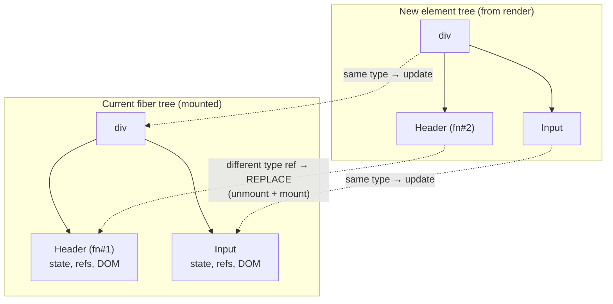

# Reconciliation & Diffing

> React does not ask "is this the same component?" — it asks "is something of the same type still at this position?" Everything about state preservation follows from that one question.

**Part:** [02 · Rendering & Frameworks](../) · **Domain:** React · **Priority:** Critical · **Difficulty:** Intermediate · **Reading time:** ~12 min

## TL;DR

**Reconciliation** is the render-phase work of comparing the element tree your components just returned against the **fiber tree** describing what is currently mounted, and deciding — per position — whether to update the existing fiber, create a new one, or delete it. Identity is `(position in the tree, element type)`, plus `key` where one is supplied. If both match, React reuses the fiber and its state and reruns the component with new props. If the type changed — even from one function component to another that renders identical markup — React **deletes the whole subtree and mounts a fresh one**, destroying state, refs, and DOM nodes. A general tree diff would be O(n³); React gets O(n) by never comparing across positions, never matching by structural similarity, and bailing out of subtrees whose props and state are unchanged.

> **Recommendation:** Keep component types stable across renders — define components at module scope, avoid conditional wrappers that change type — and reach for `key` when you *want* a reset. Never define a component inside another component's body.

## At a Glance

| | |
| --- | --- |
| **Use when** | Understanding why state resets, why a subtree remounts, or why an input loses focus mid-typing. |
| **Avoid when** | Nothing to avoid — this is the mechanism; the choices are about type and key stability. |
| **Alternatives** | [`key` for deliberate resets](#alternative-approaches), `memo` for bailouts, lifting state out of the resetting subtree. |
| **Primary risk** | Unstable component types (inline definitions, conditional wrappers) causing invisible remounts every render. |
| **Maturity** | Stable — the position-and-type rule has been unchanged since React 16; fiber internals evolve, semantics do not. |

## Prerequisites

Reconciliation compares the output of rendering, so both come first.

- [The Render Phase](./the-render-phase.md) — where reconciliation runs, and why it can be discarded.
- [Elements vs Components](./elements-vs-components.md) — the element objects being compared and the type field that decides identity.

## Overview

Each render produces a tree of **elements** — plain objects of the shape `{ type, key, props }`. React holds a parallel tree of **fibers**, one per mounted position, each holding the state hooks, refs, and DOM node for that position. Reconciliation walks both trees together, position by position, and applies three rules:

| Comparison at a position | Result |
| --- | --- |
| Same `type`, same `key` | **Update** — reuse the fiber, keep state/refs, apply new props, recurse into children. |
| Different `type` or different `key` | **Replace** — unmount the old subtree (running cleanups, discarding state), mount the new one. |
| Element absent where a fiber exists | **Delete** — unmount that subtree. |
| Fiber absent where an element exists | **Mount** — create the fiber and its subtree. |

"Type" is compared with `Object.is`, so it means *reference* identity for function and class components, and string identity for host elements (`"div"`, `"input"`). This is why a component redefined each render — a new function object every time — never matches its predecessor.

The comparison is strictly positional. React never searches the old tree for a similar node elsewhere; if a `<Sidebar>` moves from being the first child to the second, the fiber previously at slot one is compared against whatever is now at slot one. Within lists, `key` overrides positional matching, which is the subject of [Keys & List Reconciliation](./keys-and-list-reconciliation.md).

Finally, reconciliation can stop early. If a component's props are referentially equal to last time, its state has not changed, and its context has not changed, React **bails out** and reuses the entire existing subtree without rendering it. `memo` extends this to props compared shallowly rather than by reference.

## The Problem

The single most common React bug is a component defined inside another component.

```jsx
function ProfilePage({ user }) {
  // ❌ A new function object on every ProfilePage render.
  function Header() {
    return <h1>{user.name}</h1>;
  }

  return (
    <div>
      <Header />
      <NameInput />
    </div>
  );
}
```

`Header` is a different type reference every render, so reconciliation sees "different type at this position" and replaces the subtree — unmounting and remounting `Header` and everything below it on *every* keystroke that re-renders `ProfilePage`. State resets, effects re-run their setup and cleanup, DOM nodes are recreated, and inputs lose focus and selection. Nothing throws; the symptom is "my input loses focus while typing" or "the animation restarts constantly".

The second form is a conditional wrapper that changes type:

```jsx
{isModal
  ? <Modal><Form /></Modal>
  : <Panel><Form /></Panel>}
```

`Form` sits at the same conceptual place, but the fiber above it changed type, so its subtree is replaced and the half-filled form is wiped when the layout switches.

The third is the inverse — expecting a reset that does not happen:

```jsx
<UserProfile userId={selectedId} />   // same type, same position
```

Switching `selectedId` updates props but preserves state, so a draft comment typed for user A remains in the box when user B is selected. Nothing indicates the leak.

## Why It Matters

State preservation is a user-visible contract. Scroll position, focus, text selection, uncontrolled input values, media playback position, and CSS transitions all live in DOM nodes that survive an update and die on a replace. Getting the type stable is what keeps them alive; getting the key right is what kills them on purpose.

The performance consequence is second but real. A remount discards every DOM node in the subtree and creates new ones, which is dramatically more expensive than mutating a few attributes — and it runs every effect cleanup and setup, which often means re-subscribing, re-fetching, and re-measuring. A single misplaced inline component can turn a cheap keystroke into a full subtree rebuild.

Understanding the bailout rules is what makes performance work productive. Most "React is slow" reports are subtrees that could have bailed out but did not, because a prop was a new object or array literal each render. Knowing that reconciliation compares props by reference redirects effort from adding `memo` everywhere to stabilizing the few values that break the bailout.

## Mental Model

Two trees, walked in lockstep, compared only at matching positions.



Four rules cover the behavior.

**Identity is position plus type, never structural similarity.** Two subtrees that render identical markup are unrelated if their types differ.

**Type equality is reference equality.** A component recreated each render is a new type, every time.

**Replacement is recursive and total.** Everything below the changed node is unmounted; there is no partial salvage.

**Bailouts are the fast path, and reference equality is their gate.** Unchanged props by reference plus unchanged state and context means the subtree is not re-rendered at all.

## Best Practices

**Define every component at module scope.** If a component needs values from another component, pass them as props or `children`, never close over them by nesting the definition.

**Keep the element type stable across conditional branches.** Vary props rather than swapping wrapper components when the subtree below must keep its state.

**Use `key` to force a reset deliberately.** `<UserProfile key={userId} …/>` gives a clean remount per user — clearer than a `useEffect` that resets six state variables.

**Stabilize props you want bailouts for.** Object and array literals in JSX create a new reference each render and defeat `memo`; hoist constants or memoize the computed value.

**Prefer `children` over `memo` for skipping work.** A subtree passed as `children` from a parent that did not re-render is already a stable element and is reused without any comparison.

**Do not restructure the tree to "help" the diff.** React does not reward structural similarity; it only compares positions.

**Verify remounts in the Profiler.** "Why did this render" in React DevTools distinguishes an update from a mount, which is the difference between a slow render and a destroyed subtree.

## Trade-offs

React's diff trades theoretical generality for linear time and predictable rules.

**Advantages**

- O(n) instead of O(n³) — a full tree comparison is affordable on every update.
- The rules are simple enough to reason about statically: same position, same type, same key.
- Deliberate resets are expressible with one attribute (`key`) instead of manual state teardown.
- Bailouts make large unchanged regions nearly free.

**Disadvantages**

- Moving a subtree to a different position without a key destroys and rebuilds it, even though the content is identical.
- Type instability produces catastrophic behavior (constant remounts) with no error and only indirect symptoms.
- Reference-equality gating means correctness of bailouts depends on how props are constructed, which is easy to break accidentally.
- The rules are invisible in the source: nothing at the call site indicates that a wrapper swap will wipe state below it.

| Dimension | Update (type matches) | Replace (type differs) | Bailout (no changes) |
| --- | --- | --- | --- |
| Component state | Preserved | Destroyed | Preserved |
| Refs & DOM nodes | Reused | Recreated | Untouched |
| Effects | Deps compared, may re-run | Cleanup then fresh setup | Not re-run |
| Cost | Proportional to changed props | Proportional to subtree size | ~Zero |
| Triggered by | New props/state at same type | Type or key change | Referentially equal props |

## Alternative Approaches

| Approach | Best when | Weakness | See |
| --- | --- | --- | --- |
| Stable types + prop updates | The default for everything | Requires discipline about where components are defined | (this article) |
| `key` to force a remount | Switching entity identity (user, document, route param) | Discards *all* subtree state, including things you wanted to keep | [Keys & List Reconciliation](./keys-and-list-reconciliation.md) |
| `memo` + stable props | A subtree is expensive and its props rarely change | Adds comparison cost; broken by one unstable prop | (this article) |
| `children` as a prop | A parent re-renders often but its content does not depend on that state | Restructures the component boundary | [Composition & Children](./composition-and-children.md) |
| Lifting state above the resetting boundary | State must survive a subtree that legitimately remounts | Widens the state's scope | [Lifting State Up · State Management](../../03-application-architecture/state-management/lifting-state-up.md) |

## Bad Example

A page whose types change on almost every render.

```jsx
function Dashboard({ user, filters }) {
  const [query, setQuery] = useState("");

  // ❌ New component type on every Dashboard render.
  const Toolbar = () => (
    <div className="toolbar">
      <input value={query} onChange={(e) => setQuery(e.target.value)} />
    </div>
  );

  // ❌ Wrapper type flips with a boolean; everything below it remounts.
  const Layout = filters.compact ? CompactShell : WideShell;

  return (
    <Layout>
      <Toolbar />

      {/* ❌ New object and array references every render defeat memo. */}
      <ExpensiveChart
        options={{ animate: true, theme: "dark" }}
        series={data.map((d) => d.value)}
      />

      {/* ❌ Same type + same position: state survives when it should not. */}
      <CommentDraft userId={user.id} />
    </Layout>
  );
}
```

**What goes wrong:** `Toolbar` is recreated on every render, so its type reference never matches the previous one and reconciliation replaces it — which unmounts the `<input>` inside. Typing a character sets `query`, `Dashboard` re-renders, the input is destroyed and recreated, and focus is lost after every keystroke: the user can type exactly one character at a time. Flipping `filters.compact` swaps `Layout` between two component types at the same position, so the entire page below is unmounted and rebuilt — scroll position, chart animation state, and the comment draft all disappear on what the user experiences as a cosmetic density toggle. `ExpensiveChart` is presumably wrapped in `memo`, but the `options` object literal and the `series` array from `.map()` are new references on every render, so the shallow comparison always reports "changed" and the memo does nothing but add overhead. And `CommentDraft` has the opposite bug: switching `user.id` keeps the same type at the same position, so the fiber and its state are preserved and a draft written about one user appears in the box for the next.

## Good Example

The same page with type stability made explicit.

```jsx
// ✅ Defined once, at module scope — a stable type forever.
function Toolbar({ query, onQueryChange }) {
  return (
    <div className="toolbar">
      <input value={query} onChange={(e) => onQueryChange(e.target.value)} />
    </div>
  );
}

// ✅ Stable references hoisted out of render.
const CHART_OPTIONS = { animate: true, theme: "dark" };
```

```jsx
function Dashboard({ user, filters, data }) {
  const [query, setQuery] = useState("");

  // ✅ Derived value is memoized, so the prop reference is stable.
  const series = useMemo(() => data.map((d) => d.value), [data]);

  return (
    // ✅ One wrapper type; the variation is a prop, so nothing below remounts.
    <Shell compact={filters.compact}>
      <Toolbar query={query} onQueryChange={setQuery} />

      <ExpensiveChart options={CHART_OPTIONS} series={series} />

      {/* ✅ `key` makes the identity change explicit: new user, new draft. */}
      <CommentDraft key={user.id} userId={user.id} />
    </Shell>
  );
}
```

```jsx
// ✅ `children` lets a frequently re-rendering parent skip a static subtree
//    without any memo comparison at all.
function Page({ sidebar, children }) {
  const [collapsed, setCollapsed] = useState(false);
  return (
    <div data-collapsed={collapsed}>
      <button onClick={() => setCollapsed((c) => !c)}>Toggle</button>
      <aside>{sidebar}</aside>
      <main>{children}</main>   {/* same element objects; reused as-is */}
    </div>
  );
}
```

**Why it's better:** `Toolbar` lives at module scope, so its type is one reference for the life of the program and reconciliation always finds a match at that position — the input keeps its focus, selection, and IME composition state across every keystroke. Replacing the swapped wrapper with a single `Shell` that takes `compact` as a prop means the density toggle updates a class name instead of destroying the page, so scroll position and in-progress work survive. Hoisting `CHART_OPTIONS` to module scope and memoizing `series` gives `ExpensiveChart` referentially stable props, so its `memo` actually bails out and the comparison it performs pays for itself. Adding `key={user.id}` to `CommentDraft` turns the identity change into a real remount, which is both the correct behavior and self-documenting — a reader sees that switching users starts a fresh draft, without hunting for a reset effect. And the `Page` example shows the cheapest bailout available: `children` arrives as already-constructed element objects from a parent that did not re-render, so React reuses those fibers without comparing props at all.

## Common Mistakes

See the [React anti-patterns](../../../anti-patterns/) for the domain catalog. Concept-specific:

### Mistake: Defining a component inside another component

- **Symptom:** Inputs lose focus while typing, animations restart, child state resets on every parent update, effects re-run constantly.
- **Why it fails:** The nested definition creates a new function object per render, so the element's `type` never matches the mounted fiber's type and React replaces the subtree instead of updating it.
- **Fix:** Move the component to module scope and pass what it needs as props. If it must close over parent values, pass them explicitly or render it as `children`.

### Mistake: Swapping wrapper component types conditionally

- **Symptom:** Toggling a layout, theme shell, or modal/inline switch wipes form state and scroll position below it.
- **Why it fails:** The wrapper occupies a position; changing its type replaces that position's fiber and, recursively, the entire subtree beneath it.
- **Fix:** Use one wrapper type with a prop controlling the variation, or lift the state that must survive above the swapping boundary.

### Mistake: Assuming new props mean a fresh component

- **Symptom:** Data from a previously selected entity — a draft, a scroll offset, a validation error — persists after switching to a different entity.
- **Why it fails:** Same type at the same position is an *update*, not a remount. Props change; state does not.
- **Fix:** Add `key={entityId}` to make the identity change explicit, or derive the displayed value from props instead of copying it into state.

## Checklist

- [ ] No component is defined inside another component's body or a hook.
- [ ] Conditional rendering varies props, not wrapper component types, above state that must survive.
- [ ] Entity-scoped subtrees carry `key={id}` where switching entities should reset them.
- [ ] Props passed to `memo`ed components are referentially stable (hoisted constants or `useMemo`).
- [ ] `children` is used to skip subtrees before reaching for `memo`.
- [ ] Effects that must not re-run were checked against the possibility of a remount, not just a dependency change.
- [ ] Remount-versus-update was confirmed in the React DevTools Profiler, not assumed.
- [ ] Any deliberate remount has a comment or a `key` that names the identity it tracks.

## Related Articles

- [The Render Phase](./the-render-phase.md) — the phase reconciliation runs in, and why its results may be discarded.
- [Keys & List Reconciliation](./keys-and-list-reconciliation.md) — how `key` overrides positional matching inside lists.
- [The Commit Phase](./the-commit-phase.md) — where the mutations reconciliation decided on are applied.
- [Elements vs Components](./elements-vs-components.md) — the `type` field that all of this identity logic reads.
- [Composition & Children](./composition-and-children.md) — passing subtrees so they can be reused without comparison.

## References

- [React — Preserving and Resetting State](https://react.dev/learn/preserving-and-resetting-state) — the position-and-type rule with worked examples.
- [React — Render and Commit](https://react.dev/learn/render-and-commit) — where reconciliation sits between rendering and mutation.
- [React — Reconciliation](https://legacy.reactjs.org/docs/reconciliation.html) — the original write-up of the heuristics and their complexity trade-off.
- [React — `memo`](https://react.dev/reference/react/memo) — how shallow prop comparison extends the bailout path.
