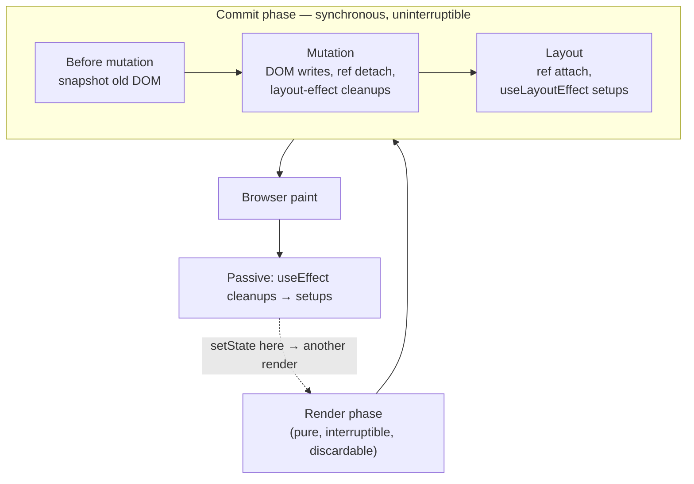

# The Commit Phase

> The render phase can be paused, restarted, and thrown away. The commit phase cannot — once it starts, the browser is frozen until it finishes, which is why what you put in a layout effect is a performance decision.

**Part:** [02 · Rendering & Frameworks](../) · **Domain:** React · **Priority:** Critical · **Difficulty:** Intermediate · **Reading time:** ~12 min

## TL;DR

Once reconciliation has produced a list of changes, React **commits** them in one synchronous, uninterruptible pass with three sub-phases. **Before mutation**: snapshot the DOM as it is (`getSnapshotBeforeUpdate`). **Mutation**: insert, move, update, and delete DOM nodes, detach old refs, and run `useLayoutEffect` *cleanups* for unmounting or changed effects. **Layout**: attach new refs and run `useLayoutEffect` *setups* — with the new DOM in place but **before the browser paints**. Passive effects (`useEffect`) are scheduled separately and flush **after** paint, asynchronously. That ordering is the whole practical rule: layout effects can measure and re-mutate the DOM without the user seeing an intermediate frame, at the cost of blocking paint; passive effects never block paint, at the cost of the user potentially seeing one frame of the pre-effect state.

> **Recommendation:** Put everything in `useEffect` by default. Move to `useLayoutEffect` only when a measurement-then-mutation would otherwise flash — tooltips, popovers, scroll restoration — and keep that work small.

## At a Glance

| | |
| --- | --- |
| **Use when** | Deciding between `useEffect` and `useLayoutEffect`, debugging visual flashes, or explaining why refs are `null` during render. |
| **Avoid when** | Nothing to avoid — the choice is what work you schedule into which sub-phase. |
| **Alternatives** | [`useEffect` after paint](#alternative-approaches), CSS-only positioning, `flushSync` for forced synchronous commits. |
| **Primary risk** | Heavy or thrashing work in `useLayoutEffect`, which delays paint for every commit that runs it. |
| **Maturity** | Stable — the phase split and effect ordering have held since React 16 and are unchanged by concurrent features. |

## Prerequisites

The commit applies decisions made earlier in the pipeline.

- [The Render Phase](./the-render-phase.md) — where the work list is produced, and why that phase is restartable.
- [Elements vs Components](./elements-vs-components.md) — the elements whose diffs become DOM mutations here.

## Overview

A React update is two phases. The render phase is pure, interruptible, and may be discarded; the commit phase is impure, synchronous, and always completes.

| Sub-phase | What runs | DOM state | Can the browser paint? |
| --- | --- | --- | --- |
| Before mutation | `getSnapshotBeforeUpdate` (class components) | Old DOM | No |
| Mutation | Node insert/move/update/delete, ref detach, layout-effect cleanups | Changing | No |
| Layout | Ref attach, `useLayoutEffect` setups | New DOM | No |
| — paint — | Browser style, layout, paint, composite | New DOM | Yes |
| Passive | `useEffect` cleanups then setups | New DOM | Already painted |

Two consequences follow directly.

**Refs are populated in the layout sub-phase.** During render, `ref.current` still holds the previous value (or `null` on mount), which is why measuring in the component body is always wrong.

**`useEffect` is not guaranteed to run before the next paint.** React flushes passive effects on a scheduled callback after paint — usually within a few milliseconds, but after the user has seen the frame. If an effect sets state that changes layout, the user sees the intermediate frame.

`flushSync` forces a synchronous render-and-commit inside an event handler, which is occasionally required to interleave a React update with an imperative DOM API (focus after a list change, `scrollIntoView` on a node that must already exist). It opts out of batching and is expensive.

## The Problem

The most visible symptom of getting the phase wrong is a one-frame flash.

```jsx
function Tooltip({ anchorRef, children }) {
  const ref = useRef(null);
  const [top, setTop] = useState(0);

  // ❌ Runs after paint: the tooltip is visible at top: 0 for one frame.
  useEffect(() => {
    const anchor = anchorRef.current.getBoundingClientRect();
    const self = ref.current.getBoundingClientRect();
    setTop(anchor.top - self.height - 8);
  }, [anchorRef]);

  return <div ref={ref} style={{ top }}>{children}</div>;
}
```

The commit paints the tooltip at `top: 0`, then the passive effect measures, sets state, and React commits again — so the user sees the tooltip jump from the top of the viewport to its intended place. The logic is correct; only the timing is wrong.

The second problem is the opposite: expensive work in the layout phase.

```jsx
useLayoutEffect(() => {
  items.forEach((item) => {
    const el = refs.current[item.id];
    const h = el.getBoundingClientRect().height;   // forces layout
    el.style.height = `${h + 4}px`;                // invalidates layout
  });
}, [items]);
```

Every read after a write forces a synchronous reflow, and all of it happens before paint, so a hundred-item list turns each commit into a visible freeze.

The third is measuring at the wrong time entirely:

```jsx
function Chart({ data }) {
  const ref = useRef(null);
  const width = ref.current?.offsetWidth ?? 0;   // ❌ null on mount, stale after
  return <svg ref={ref} width={width} />;
}
```

Refs are not attached during render, so this reads `null` on the first render and last commit's value on subsequent ones — producing a chart that is one update behind, forever.

## Why It Matters

Everything in the commit phase is on the critical path to the next frame. The render phase can be time-sliced by concurrent React, but commit cannot: React must not leave the DOM half-updated, so the browser is blocked from painting until the last layout effect returns. A 30 ms layout effect is 30 ms of unresponsive UI on every commit that triggers it, and it does not show up as a "slow render" in the Profiler's render column.

The phase split is also the correctness boundary for anything imperative. Focus management, scroll restoration, canvas drawing, third-party widget initialization, and measurement-driven positioning all require the new DOM to exist, and some of them require it to exist *before* the user sees anything. Choosing the wrong hook produces either a flash (too late) or a jank (too early and too heavy).

Finally, understanding that the commit is where cleanups run for *changed* effects explains a family of subtle bugs: subscriptions that briefly overlap, timers that fire against a stale closure, and `ResizeObserver` instances that observe a detached node. The order is always cleanup-then-setup, per effect, in the same commit.

## Mental Model

One update, two phases, one paint boundary.



Four rules follow.

**Everything before the paint box blocks the frame.** Layout effects included.

**Refs exist from the layout sub-phase onward.** Never in render, never in the previous commit's passive effects for a node mounted in this one.

**`useLayoutEffect` = "the user must not see the before state".** `useEffect` = "after paint is fine".

**State set in a layout effect is flushed before paint;** state set in a passive effect produces a second visible frame.

## Best Practices

**Default to `useEffect`.** Subscriptions, data fetching, logging, analytics, and timers all belong after paint.

**Use `useLayoutEffect` only for measure-then-mutate.** Positioning a floating element, restoring scroll, syncing a third-party widget's geometry — anything where the intermediate frame would be visibly wrong.

**Keep layout effects small and batched.** Do all reads first, then all writes, so the browser performs one layout instead of one per item.

**Never read `ref.current` during render.** Read it in an effect or an event handler.

**Prefer CSS to measurement.** Anchor positioning, `position: sticky`, container queries, and the Popover API remove entire classes of layout effects.

**Reserve `flushSync` for imperative interop.** Focusing a node that must exist, or scrolling to an item added in the same handler — and measure the cost.

**Remember Strict Mode runs setup/cleanup twice in development.** An effect that is not idempotent will misbehave there before it misbehaves in production.

## Trade-offs

The two effect timings buy opposite things.

**Advantages of layout effects**

- No intermediate frame — the user never sees the unpositioned or unmeasured state.
- The DOM is guaranteed present and current, so imperative APIs are safe.
- State set inside is applied before paint, so a measure-then-adjust cycle is invisible.

**Disadvantages**

- Blocks paint for their full duration, on every commit that runs them.
- Encourages read/write interleaving that forces synchronous reflows.
- Server rendering has no layout phase, so layout effects warn on the server and must be guarded or replaced.
- Overuse converts a concurrent, interruptible render pipeline into a synchronous one at the last step.

| Dimension | `useLayoutEffect` | `useEffect` | `flushSync` |
| --- | --- | --- | --- |
| Runs | Before paint, same commit | After paint, scheduled | Forces full render+commit inline |
| Blocks paint | Yes | No | Yes, plus a full render |
| Sees final DOM | Yes | Yes | Yes, immediately |
| Server rendering | Not run; warns | Not run | n/a |
| Typical use | Positioning, scroll restoration | Subscriptions, fetching, logging | Focus/scroll after an imperative change |
| Cost if misused | Frozen frames | One-frame flash | Lost batching, repeated layout |

## Alternative Approaches

| Approach | Best when | Weakness | See |
| --- | --- | --- | --- |
| `useEffect` | Almost everything | One frame of pre-effect state may be visible | (this article) |
| `useLayoutEffect` | Measurement must precede paint | Blocks paint; no server equivalent | (this article) |
| CSS-only (anchor positioning, `sticky`, container queries) | The relationship is expressible declaratively | Newer features need fallbacks | [Custom Properties · CSS](../../01-core-languages/css/custom-properties.md) |
| `ResizeObserver` / `IntersectionObserver` | Reacting to size or visibility over time | Asynchronous; not a pre-paint guarantee | Resize Observer · Browser APIs (planned) |
| `flushSync` | An imperative API must observe the update immediately | Opts out of batching; expensive | (this article) |

## Bad Example

A dropdown that positions itself after paint and thrashes layout while doing it.

```jsx
function Dropdown({ anchorRef, items, open }) {
  const listRef = useRef(null);
  const [pos, setPos] = useState({ top: 0, left: 0 });

  // ❌ After paint: renders at 0,0 first, then jumps.
  useEffect(() => {
    if (!open) return;
    const a = anchorRef.current.getBoundingClientRect();
    setPos({ top: a.bottom + 4, left: a.left });
  }, [open, anchorRef]);

  // ❌ Blocks paint, and interleaves reads and writes per item.
  useLayoutEffect(() => {
    if (!listRef.current) return;
    for (const el of listRef.current.children) {
      const h = el.getBoundingClientRect().height;   // read → forces layout
      el.style.minHeight = `${h}px`;                 // write → invalidates it
      el.style.opacity = "1";                        // write
      void el.offsetTop;                             // read → forces layout again
    }
    logAnalytics("dropdown_opened", { count: items.length });   // not layout work
  }, [items]);

  // ❌ Reading a ref during render.
  const width = listRef.current?.offsetWidth ?? 200;

  return (
    <ul ref={listRef} style={{ ...pos, width }} hidden={!open}>
      {items.map((i) => <li key={i.id}>{i.label}</li>)}
    </ul>
  );
}
```

**What goes wrong:** The positioning effect is passive, so the commit paints the list at `top: 0, left: 0` — top-left corner of the viewport — and only then measures and re-renders, producing a visible jump every time the dropdown opens. The layout effect does the opposite thing wrong: it alternates a `getBoundingClientRect()` read with a style write for each item, forcing the browser to recompute layout once per iteration, and all of it happens before paint, so a 50-item menu freezes the frame. The analytics call is in the layout effect for no reason, adding whatever that function costs to the paint-blocking path. And `listRef.current` is read during render, where refs are not yet attached, so `width` is the fallback on mount and one commit stale forever after — the list is sized for the *previous* set of items.

## Good Example

The same dropdown with each piece of work in the phase it belongs to.

```jsx
function Dropdown({ anchorRef, items, open }) {
  const listRef = useRef(null);
  const [pos, setPos] = useState(null);

  // ✅ Measure and position before paint — no intermediate frame.
  useLayoutEffect(() => {
    if (!open || !anchorRef.current) return;
    const a = anchorRef.current.getBoundingClientRect();
    setPos({ top: a.bottom + 4, left: a.left });
  }, [open, anchorRef]);

  // ✅ Reads first, then writes: one layout pass instead of one per item.
  useLayoutEffect(() => {
    const list = listRef.current;
    if (!list) return;
    const els = [...list.children];
    const heights = els.map((el) => el.getBoundingClientRect().height);  // all reads
    els.forEach((el, i) => { el.style.minHeight = `${heights[i]}px`; }); // all writes
  }, [items]);

  // ✅ Non-visual work runs after paint.
  useEffect(() => {
    if (!open) return;
    logAnalytics("dropdown_opened", { count: items.length });
  }, [open, items.length]);

  // ✅ Don't render until positioned; no flash to hide.
  if (!open || !pos) return null;

  return (
    <ul ref={listRef} style={pos}>
      {items.map((i) => <li key={i.id}>{i.label}</li>)}
    </ul>
  );
}
```

```jsx
// ✅ Measure with an observer instead of reading refs in render.
function useMeasuredWidth() {
  const ref = useRef(null);
  const [width, setWidth] = useState(0);

  useLayoutEffect(() => {
    const el = ref.current;
    if (!el) return;
    const ro = new ResizeObserver(([entry]) => setWidth(entry.contentRect.width));
    ro.observe(el);
    return () => ro.disconnect();     // cleanup runs in the mutation sub-phase
  }, []);

  return [ref, width];
}
```

```jsx
// ✅ flushSync where an imperative API must see the committed DOM.
function MessageList({ messages, onSend }) {
  const endRef = useRef(null);

  function handleSend(text) {
    flushSync(() => onSend(text));            // DOM now contains the new message
    endRef.current?.scrollIntoView({ behavior: "smooth" });
  }

  return (
    <>
      {messages.map((m) => <Message key={m.id} message={m} />)}
      <div ref={endRef} />
    </>
  );
}
```

**Why it's better:** Positioning moved to a layout effect, so the measurement and the resulting state update both complete before the browser paints — the dropdown's first visible frame is already in the right place, and the jump is gone. Returning `null` until `pos` exists makes that guarantee structural rather than incidental. The style-syncing effect performs all its reads before any of its writes, so the browser computes layout once for the whole list instead of once per item, cutting the paint-blocking work from O(n) reflows to one. Analytics moved to a passive effect, where it belongs: the user's frame no longer waits on a network-adjacent call. `useMeasuredWidth` replaces render-time ref reading with a `ResizeObserver` whose cleanup is returned from the effect, so the observer is disconnected during the mutation sub-phase of the unmounting commit rather than leaking. And `flushSync` appears exactly once, in the one situation that justifies it — an imperative `scrollIntoView` that requires the newly added message to already be in the DOM.

## Common Mistakes

See the [React anti-patterns](../../../anti-patterns/) for the domain catalog. Concept-specific:

### Mistake: Measuring in `useEffect` and getting a visible flash

- **Symptom:** A tooltip, popover, or dynamically sized element appears briefly in the wrong place or at the wrong size before snapping into position.
- **Why it fails:** Passive effects run after paint, so the browser has already shown the unmeasured frame. The subsequent state update produces a second frame.
- **Fix:** Move the measurement and the resulting state update to `useLayoutEffect`, or avoid rendering until the position is known.

### Mistake: Reading `ref.current` during render

- **Symptom:** A measured value is `null` on first render and one update stale afterwards.
- **Why it fails:** Refs are attached in the layout sub-phase of the commit, which is after render. During render, `ref.current` holds the previous commit's node or `null`.
- **Fix:** Read refs in effects or event handlers. For sizes that change over time, use a `ResizeObserver` and store the result in state.

### Mistake: Doing non-visual or heavy work in `useLayoutEffect`

- **Symptom:** Interaction feels frozen on updates; the Profiler shows fast renders but the frame is still late.
- **Why it fails:** The entire commit phase, layout effects included, blocks paint. Analytics calls, large loops, and read/write interleaving all extend that block, and none of it appears in the render timing.
- **Fix:** Keep layout effects to measurement and the mutations that depend on it; batch reads before writes; move everything else to `useEffect`.

## Checklist

- [ ] `useEffect` is the default; each `useLayoutEffect` has a stated reason involving a visible intermediate frame.
- [ ] Layout effects perform all DOM reads before any DOM writes.
- [ ] No analytics, fetching, or logging runs inside a layout effect.
- [ ] `ref.current` is never read during render.
- [ ] Elements that depend on measurement render nothing (or hidden) until measured.
- [ ] Every effect that subscribes, observes, or times returns a cleanup.
- [ ] Layout effects are guarded or replaced for server rendering.
- [ ] `flushSync` appears only where an imperative API must observe the committed DOM, with a comment explaining why.

## Related Articles

- [The Render Phase](./the-render-phase.md) — the interruptible phase that produces the work this one applies.
- [Reconciliation & Diffing](./reconciliation-and-diffing.md) — how the mutation list is computed.
- [Keys & List Reconciliation](./keys-and-list-reconciliation.md) — why a commit may move nodes instead of rebuilding them.
- [The Critical Rendering Path · Performance Engineering](../../05-reliability-quality/performance/the-critical-rendering-path.md) — the browser work that begins where the commit ends.
- [Core Web Vitals (LCP, INP, CLS) · Performance Engineering](../../05-reliability-quality/performance/core-web-vitals-lcp-inp-cls.md) — the metrics a paint-blocking commit degrades.

## References

- [React — Render and Commit](https://react.dev/learn/render-and-commit) — the phase split and the paint boundary.
- [React — `useLayoutEffect`](https://react.dev/reference/react/useLayoutEffect) — pre-paint timing, the server-rendering caveat, and the performance warning.
- [React — `useEffect`](https://react.dev/reference/react/useEffect) — passive scheduling, cleanup ordering, and Strict Mode double invocation.
- [React — `flushSync`](https://react.dev/reference/react-dom/flushSync) — forcing a synchronous commit and the cost of doing so.
