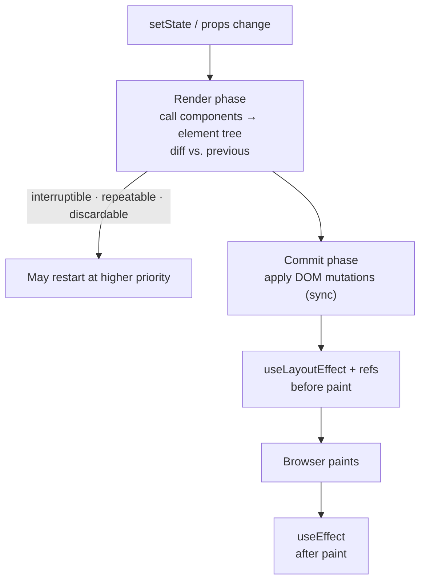

# The Render Phase

> Rendering is React calling your function to ask what the UI should look like — a question it may ask twice, ask about work it later discards, and never promises to follow with a DOM update.

**Part:** [02 · Rendering & Frameworks](../) · **Domain:** React · **Priority:** Critical · **Difficulty:** Intermediate · **Reading time:** ~12 min

## TL;DR

React splits an update into two phases. The **render phase** calls components to produce an element tree and diffs it against the previous one; it touches no DOM, can be **interrupted, restarted, or thrown away**, and is called twice per update in development Strict Mode. The **commit phase** applies the resulting mutations to the DOM synchronously and then runs layout effects and passive effects. Everything that follows comes from one rule: **render must be pure** — same props, state, and context in, same elements out, with no observable side effects. Mutation, subscriptions, logging, and anything that reads live DOM belong in commit-phase code.

> **Recommendation:** Treat a component body as a calculation; if a line does something rather than computing something, move it into an event handler when it responds to interaction, or an effect when it synchronizes with an external system.

## At a Glance

| | |
| --- | --- |
| **Use when** | Any time you reason about why a component re-rendered, why an effect ran twice, or where a side effect belongs. |
| **Avoid when** | N/A — this is React's execution model, not an optional technique. |
| **Alternatives** | [Deriving during render vs. state](#alternative-approaches), [event handlers](#alternative-approaches), [effects](#alternative-approaches). |
| **Primary risk** | Side effects in render: duplicated requests, corrupted shared state, and bugs that only appear under Strict Mode or concurrent rendering. |
| **Maturity** | Stable — the two-phase model dates to React 16's Fiber rewrite; concurrent rendering became the default in React 18. |

## Prerequisites

Rendering produces elements and compares them, so the element model comes first.

- [Elements vs Components](./elements-vs-components.md) — what a component returns and how identity decides reuse.
- [JSX Semantics](./jsx-semantics.md) — why expressions in the tree run during render.

## Overview

A **render** is React calling a component function with its current props, state, and context, and receiving an element tree. React then walks that tree, comparing it to the previous one, and builds a list of the DOM changes that would be needed. None of that touches the document. The **commit** is the separate, synchronous step where React applies those changes, runs `useLayoutEffect` callbacks and layout measurements, paints, and then runs `useEffect` callbacks.

Two properties of the render phase drive everything else. It is **repeatable**: React may call a component more than once for a single update, and in development Strict Mode it deliberately does, to surface impurity. And it is **discardable**: with concurrent rendering, a higher-priority update can interrupt an in-progress render, and the partially computed tree is thrown away and started over. Neither is safe if the component did something during render — the "something" happened once, twice, or on a tree that was never shown.

It is worth separating a **render** from a **DOM update**. A re-render that produces the same elements results in no DOM mutation at all, so "this component rendered 40 times" is a statement about function calls, not about layout work. It is also worth separating a **re-render** from a **remount**: re-render preserves state and calls the same instance again; remount destroys state, and is caused by a change in element type or `key`.

## The Problem

The rules are invisible until they are violated, and the violations are subtle.

```tsx
// ❌ Three impurities that each look harmless.
let renderCount = 0;

function OrderSummary({ order, onTotal }) {
  renderCount += 1;                          // module state mutated during render
  order.items.sort((a, b) => a.price - b.price); // props mutated during render
  onTotal(order.items.reduce(sum, 0));       // parent state updated during render
  return <Table items={order.items} />;
}
```

Each line is a common shape. The counter is "just for debugging" and quietly doubles under Strict Mode. The `sort` mutates an array the parent owns, so the parent's data changes without the parent rendering — and if the render is discarded, the mutation still happened. The `onTotal` call updates a parent during a child's render, which React reports as an error and which, in the versions where it merely warned, produced infinite loops.

The second problem is derived state stored in state. A component receives `items`, computes `filteredItems`, and stores that in `useState`, syncing it with an effect. Now there are two sources of truth and a frame where they disagree — the classic "the list shows the previous filter for one render" bug.

The third is misattributing re-renders. A team sees a component rendering often, wraps everything in `memo` and `useCallback`, and measures no improvement, because the renders were cheap and the actual cost was a layout thrash in an effect. The two-phase model is what tells you which half to look at.

## Why It Matters

Purity is what makes React's scheduling possible. Because render has no observable effects, React is free to call components speculatively, interrupt them for a more urgent update, and discard the result — which is what `startTransition`, Suspense, and time-slicing all depend on. A codebase with side effects in render does not merely have a few bugs; it opts out of the guarantees those features rest on, and the failures appear as nondeterminism under load rather than as a stack trace.

The phase split also tells you where a symptom must be fixed. A visual flicker before paint is a commit-phase problem, addressable with `useLayoutEffect`, which runs after mutation and before the browser paints. A duplicated network request in development is a render-purity or effect-cleanup problem. A stale value in the DOM is usually a render that never happened, not a render that was wrong. Knowing which phase produced the symptom removes most of the guesswork.

And Strict Mode's double invocation is only useful if the model is understood. It exists to make impurity fail loudly in development instead of subtly in production; teams that respond by disabling it trade a visible development problem for an invisible production one.

## Mental Model

Think of one update as **a pure calculation followed by a synchronous application**.



Four refinements matter in day-to-day work.

**A component renders when its state changes, its parent renders, or a context it consumes changes.** Props changing is not itself a trigger — a parent rendering is what produces new props. This is why `memo` helps only in the "parent rendered but my props are equal" case.

**Rendering is top-down and children are not automatically skipped.** When a parent re-renders, React re-renders its children unless it can bail out — either because the child element is referentially identical (children passed from above, hoisted elements) or because `memo` reports equal props.

**A render that produces equal elements costs no DOM work.** The diff produces an empty mutation list, so the cost is the function calls and the comparison, not layout or paint.

**Effects belong to commit, not render.** `useEffect` runs after paint, `useLayoutEffect` after mutation and before paint. In development, effects are mounted, cleaned up, and re-mounted once to prove the cleanup is correct — which is why a subscription without cleanup shows up as a double subscription.

## Best Practices

**Calculate during render; do not store what you can derive.** If a value is a function of props and state, compute it in the body. Reach for `useMemo` only when profiling shows the computation is expensive, and treat it as a performance hint rather than a semantic guarantee.

**Never mutate props, context values, or module-level state in a component body.** Copy before sorting (`[...items].sort(…)`), and keep counters and caches out of render.

**Never call a state setter during render of another component.** The one sanctioned form is the "adjust state when props change" pattern — calling `setState` during *your own* render, guarded by a comparison — and even that is a last resort React documents as rare.

**Put interaction-driven work in event handlers.** Sending analytics, writing to storage, and issuing mutations belong where the user did something, not where React asked what to draw.

**Keep Strict Mode on in development.** Its double render and double effect mount are the cheapest available detector for impurity and missing cleanup.

**Measure before memoizing.** Use the React DevTools Profiler to confirm which components render and what they cost; a render that takes 0.2 ms does not need `memo`, and `memo` on a component whose props are new objects every time does nothing at all.

## Trade-offs

The two-phase model trades a purity constraint for scheduling freedom.

**Advantages**

- Interruptible rendering keeps the main thread responsive during large updates, which is what makes transitions and Suspense possible.
- Pure components are trivially testable: same input, same output, no setup.
- The diff produces a minimal mutation list, so many re-renders cost nothing in the DOM.

**Disadvantages**

- The purity rule is not enforced by the language, so violations compile and often appear to work.
- Double invocation in development confuses newcomers and produces duplicated logs and requests that look like bugs.
- Reasoning about *why* something re-rendered requires tooling; the code alone does not show it.

| Dimension | Two-phase rendering | Cost / caveat |
| --- | --- | --- |
| Responsiveness | Renders can yield to input | Only if render is genuinely pure |
| Correctness | Same input → same output | Enforced by convention and Strict Mode, not the compiler |
| Debuggability | Clear phase for each symptom | Requires the Profiler to attribute renders |
| Performance | Equal elements cost no DOM work | Component calls still cost; deep trees add up |
| Learning curve | One rule (purity) | The rule's consequences are wide and non-obvious |

## Alternative Approaches

The alternatives are about *where the work goes*, not whether to render.

| Approach | Best when | Weakness | See |
| --- | --- | --- | --- |
| Derive during render | The value is a function of props/state | Recomputed each render (usually fine) | (this article) |
| `useMemo` | The derivation is measurably expensive | Adds a dependency array to maintain; not a correctness tool | (this article) |
| Event handler | The work responds to a user action | Does not cover changes from props or external sources | [React — You Might Not Need an Effect](https://react.dev/learn/you-might-not-need-an-effect) |
| `useEffect` | Synchronizing with an external system | Runs after paint; overuse creates render loops | The Commit Phase (planned) |
| `useLayoutEffect` | You must measure or mutate before paint | Blocks paint; misuse causes jank | The Commit Phase (planned) |
| State + setter | The value cannot be derived (it is user input) | Duplicating derivable data creates two sources of truth | useState (planned) |

## Bad Example

A report view that does its work in the wrong phase.

```tsx
// ❌ Side effects and derived state, all during render.
let lastReportId: string | null = null;

export function ReportView({ report, onLoaded }: ReportViewProps) {
  const [rows, setRows] = useState<Row[]>([]);

  // ❌ Derived data stored in state and synced with an effect.
  useEffect(() => {
    setRows(report.rows.filter((r) => r.visible));
  }, [report.rows]);

  // ❌ Module state mutated during render; also double-fires under Strict Mode.
  if (lastReportId !== report.id) {
    lastReportId = report.id;
    analytics.track('report_viewed', { reportId: report.id });
  }

  // ❌ Mutates a prop the parent owns.
  report.rows.sort((a, b) => b.amount - a.amount);

  // ❌ Updates the parent during this component's render.
  onLoaded(report.rows.length);

  // ❌ Reads live layout during render — the DOM is from the *previous* commit.
  const width = document.getElementById('report')?.clientWidth ?? 0;

  return (
    <div id="report">
      <Summary count={rows.length} width={width} />
      <Table rows={rows} />
    </div>
  );
}
```

**What goes wrong:** `rows` duplicates data that is a pure function of `report.rows`, so the first render after a new report shows the *previous* report's rows until the effect runs and triggers a second render — a visible one-frame flicker, and an extra render for every change. The `analytics.track` call runs during render, so Strict Mode's second invocation double-counts the event in development, and a discarded concurrent render counts a view the user never saw. `report.rows.sort` mutates an array owned by the parent, which means another component holding the same reference sees reordered data without rendering, and React's diff sees no change to report. `onLoaded` updates the parent mid-render, which React reports as an error and which historically produced an update loop. And `document.getElementById(...).clientWidth` reads the DOM from the previous commit, so `width` is always one render stale — and is `0` on the first render.

## Good Example

The same view with each piece of work in its own phase.

```tsx
export function ReportView({ report, onLoaded }: ReportViewProps) {
  const containerRef = useRef<HTMLDivElement>(null);
  const [width, setWidth] = useState(0);

  // ✅ Derived during render — one source of truth, no sync effect, no stale frame.
  const rows = useMemo(
    () => report.rows.filter((row) => row.visible).toSorted((a, b) => b.amount - a.amount),
    [report.rows],
  );

  // ✅ Analytics is a synchronization with an external system: commit phase, keyed by id.
  useEffect(() => {
    analytics.track('report_viewed', { reportId: report.id });
  }, [report.id]);

  // ✅ The parent is notified after commit, never during render.
  useEffect(() => {
    onLoaded(rows.length);
  }, [rows.length, onLoaded]);

  // ✅ Measurement happens after mutation, before paint, and is kept live.
  useLayoutEffect(() => {
    const element = containerRef.current;
    if (!element) return;
    const observer = new ResizeObserver(([entry]) => setWidth(entry.contentRect.width));
    observer.observe(element);
    return () => observer.disconnect();   // cleanup proves correct under Strict Mode
  }, []);

  return (
    <div id="report" ref={containerRef}>
      <Summary count={rows.length} width={width} />
      <Table rows={rows} />
    </div>
  );
}
```

```tsx
// ✅ Interaction-driven work belongs in the handler, not in render or an effect.
function ExportButton({ report }: { report: Report }) {
  const [pending, startTransition] = useTransition();

  function handleExport() {
    analytics.track('report_exported', { reportId: report.id });
    startTransition(async () => {
      await exportReport(report.id);   // the transition keeps the UI responsive
    });
  }

  return (
    <button type="button" onClick={handleExport} disabled={pending}>
      {pending ? 'Exporting…' : 'Export'}
    </button>
  );
}
```

**Why it's better:** `rows` is computed from `report.rows` during render, so there is exactly one source of truth and no frame in which the table disagrees with the report — the sync effect and the extra render both disappear. `toSorted` returns a new array rather than mutating the prop, so the parent's data is untouched and the diff sees the change it should. The analytics call moved into an effect keyed by `report.id`, which means it fires once per report after commit, unaffected by Strict Mode's double render and by discarded concurrent renders. `onLoaded` is called from an effect, so the parent updates in its own render pass instead of during the child's. Measurement uses a ref and a `ResizeObserver` in `useLayoutEffect`, so the width is read after the DOM exists, updated when it changes, and torn down by a cleanup that Strict Mode's mount/unmount/mount cycle verifies. And the export handler shows the remaining category: work triggered by a user action goes in the event handler, with `startTransition` keeping the interface responsive while it runs.

## Common Mistakes

See the [React anti-patterns](../../../anti-patterns/) for the domain catalog. Concept-specific:

### Mistake: Storing derived data in state and syncing it with an effect

- **Symptom:** A list shows the previous filter for one frame; every input change causes two renders; the state and its source drift after an edge-case update.
- **Why it fails:** The value is a function of props and state, so storing it creates a second source of truth that is correct only after an extra render. Any path that updates the source without running the effect leaves the copy stale.
- **Fix:** Compute the value during render. If profiling shows the computation is expensive, wrap it in `useMemo` — same value, cached, still one source of truth.

### Mistake: Side effects in the component body

- **Symptom:** Duplicated analytics events, doubled requests in development, mutated props, or "Cannot update a component while rendering a different component."
- **Why it fails:** Render may run more than once per update and may be discarded entirely, so anything observable that happens there happens an unpredictable number of times, sometimes for UI that is never shown.
- **Fix:** Move interaction-driven work into event handlers and external-system synchronization into effects. Treat the component body as a calculation with no `let` mutation, no I/O, and no setters.

### Mistake: Reading the DOM during render

- **Symptom:** A measured width that is `0` on first render and one step behind afterwards; layout that settles a frame late.
- **Why it fails:** During render, the DOM still reflects the previous commit — the nodes for this render do not exist yet. Reading it produces stale values and forces a layout recalculation at the worst time.
- **Fix:** Attach a ref and measure in `useLayoutEffect` (before paint) or with a `ResizeObserver` for values that change over time.

## Checklist

- [ ] Component bodies contain no assignments to module or prop state, no I/O, and no state setters.
- [ ] Values derivable from props and state are computed during render, not stored in state.
- [ ] `useMemo`/`useCallback` are present only where profiling justified them.
- [ ] Analytics, storage writes, and mutations live in event handlers.
- [ ] Every effect has a cleanup where it subscribes, times, or opens anything.
- [ ] DOM measurement happens through a ref in `useLayoutEffect` or a `ResizeObserver`, never in render.
- [ ] Strict Mode is enabled in development and its double invocation produces no duplicated observable behavior.
- [ ] Re-render claims were verified in the React DevTools Profiler rather than assumed.

## Related Articles

- [Elements vs Components](./elements-vs-components.md) — identity rules that decide re-render versus remount.
- [JSX Semantics](./jsx-semantics.md) — why expressions in the returned tree run during render.
- [Composition & Children](./composition-and-children.md) — passing `children` so a subtree can be skipped without `memo`.
- Reconciliation & Diffing (planned), The Commit Phase (planned), and useState (planned) — what happens on either side of this phase.

## References

- [React — Render and Commit](https://react.dev/learn/render-and-commit) — the two phases and their ordering.
- [React — Keeping Components Pure](https://react.dev/learn/keeping-components-pure) — the purity rule and what violates it.
- [React — `StrictMode`](https://react.dev/reference/react/StrictMode) — the development-only double invocation and what it detects.
- [React — You Might Not Need an Effect](https://react.dev/learn/you-might-not-need-an-effect) — deriving during render instead of synchronizing state.
