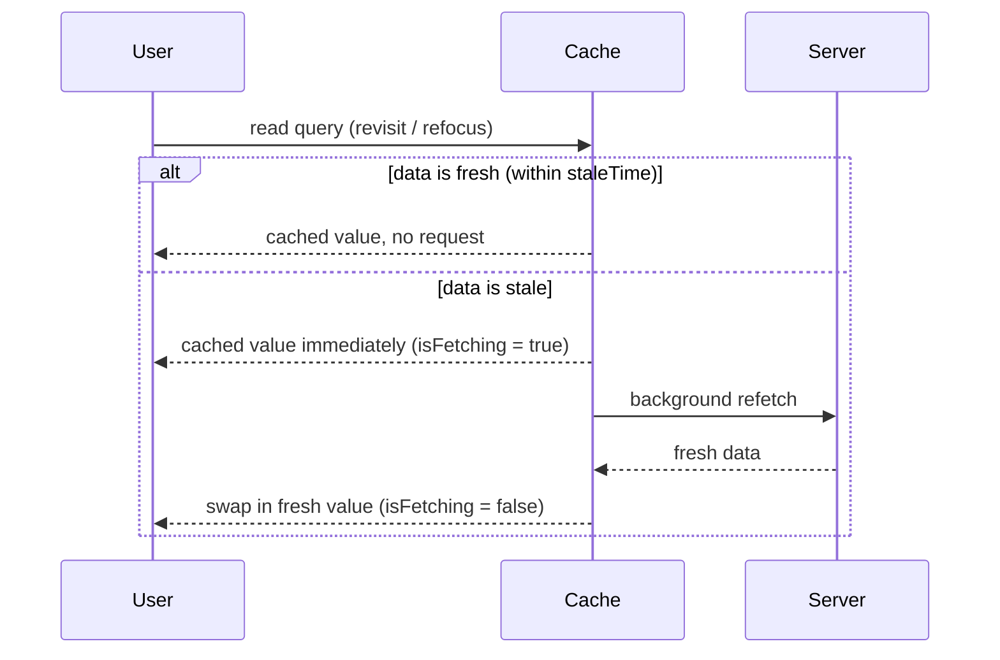

# Background Refetching

> Serve the cached value instantly, then quietly check the server behind it. Done right, the user never waits and the data never rots — done wrong, every window switch flashes a spinner or the data never updates at all.

**Part:** [03 · Application Architecture](../) · **Domain:** Data & Server State · **Priority:** Critical · **Difficulty:** Intermediate · **Reading time:** ~12 min

## TL;DR

Background refetching is the *revalidate* half of stale-while-revalidate: when a query is read and its data is stale, the cache returns the cached value immediately and fires a refetch in the background, swapping in the fresh result when it lands. The triggers are event-based — remounting the query, refocusing the window, reconnecting the network — plus an optional polling interval. The critical distinction is `isLoading` (no data yet, must wait) versus `isFetching` (data on screen, a background request is in flight); confuse them and you turn a silent update into a full-page spinner. Whether a trigger actually refetches is gated by `staleTime`: fresh data never refetches, so `staleTime` is the real tuning knob, not the trigger flags.

> **Recommendation:** Keep the default focus/reconnect/mount triggers on, and tune behavior with `staleTime` rather than disabling triggers. Render background refetches with a subtle `isFetching` indicator, never `isLoading`. Reserve `refetchInterval` for data that genuinely changes without user action, and stop it when the tab is hidden.

## At a Glance

| | |
| --- | --- |
| **Use when** | Cached data can drift from the server between reads and you want it current without a manual reload. |
| **Avoid when** | Data is immutable per session, or a strict interval hammers an expensive endpoint for no user benefit. |
| **Alternatives** | [Staleness & Revalidation](#alternative-approaches) (the policy that gates it); [Cache Invalidation](#alternative-approaches) (event-driven, targeted). |
| **Primary risk** | Rendering a background refetch as a blocking spinner, or polling that drains battery and rate limits. |
| **Maturity** | Stable. |

## Prerequisites

- [Cache Keys & Query Identity](./cache-keys-and-query-identity.md) — a refetch targets the exact key whose data is stale.
- [Fetch-on-Render vs Render-as-You-Fetch](./fetch-on-render-vs-render-as-you-fetch.md) — when the initial request starts, which background refetching extends.

## Overview

*Background refetching* is the cache re-requesting data a component already has, without blocking the render on the result. It is the mechanism behind the "revalidate" in stale-while-revalidate: a read of stale data returns the cached copy synchronously so the UI paints now, and a refetch runs in the background so the copy converges on the server's current value. The user sees data immediately and sees it update a moment later, rather than waiting on a spinner for data they already had a version of.

The behavior is driven by triggers, not timers alone. TanStack Query refetches a query in the background when the query remounts (`refetchOnMount`), when the window regains focus (`refetchOnWindowFocus`), and when the network reconnects (`refetchOnReconnect`) — the events that correlate with "the user came back and might be looking at old data." A `refetchInterval` adds time-based polling on top. Every one of these is gated by `staleTime`: a query still within its `staleTime` is *fresh* and refetches for none of these triggers. That is the boundary to internalize — the triggers decide *when the cache checks staleness*, and `staleTime` decides *whether the check leads to a request*.

## The Problem

A dashboard reads a list of open tickets. The team wants it current, so they see two failure modes and overcorrect between them. First version: every navigation back to the dashboard shows a full-screen loading spinner while the list refetches, even though the previous list is still perfectly renderable — the code branches on `isLoading`, which is true whenever a fetch runs. The dashboard feels slower than a hard refresh.

Reacting to that, the team disables refetching: `refetchOnWindowFocus: false`, a huge `staleTime`. Now the spinner is gone, but a ticket someone closed ten minutes ago still shows as open until a manual reload. They have swung from "refetches too visibly" to "never refetches," and neither is what they wanted. The actual goal — show the cached list instantly, update it quietly in the background — is exactly what background refetching does by default, if `isLoading` versus `isFetching` is respected and `staleTime` is set to a sane window instead of zero or infinity.

## Why It Matters

Server data goes stale the instant it is cached, because another user or process can change it. Background refetching is how a client stays current without making the user pay a latency tax on every view — the difference between an app that feels live and one that shows a stale snapshot until manually reloaded. For any multi-user or long-lived screen, that freshness is a correctness property, not a nicety: acting on data you can see is wrong if the data is quietly out of date.

The cost of getting it wrong runs both directions. Treat every background refetch as a blocking load and the app feels slower the more it caches — the opposite of the intended payoff. Disable refetching to kill the spinner and the app shows stale data confidently. And reach for `refetchInterval` as the freshness tool and you get constant polling that drains mobile batteries, burns API quota, and refetches a hidden tab nobody is watching. The lever that resolves all three is understanding that `staleTime` — not the trigger flags — governs how often the network is actually touched, and that background fetches must render differently from initial loads.

## Mental Model

Picture two clocks per query. `staleTime` decides when data turns from *fresh* to *stale*; `gcTime` (formerly `cacheTime`) decides when an unused query is dropped from memory. Triggers only ever ask one question — "is this query stale?" — and only a *stale* answer produces a background request. Fresh data is served from cache and no network happens, no matter how many times the window is focused.



The state you render on determines whether this is invisible or jarring. `isLoading` is `true` only when there is **no cached data to show** — the genuine first load. `isFetching` is `true` whenever a request is in flight, including every background refetch over existing data. Branch your full-screen spinner on `isLoading`; branch a small inline "updating" affordance on `isFetching`. This one mapping is the whole difference between a background refetch the user never notices and one that blanks the screen.

## Best Practices

Tune `staleTime`, not the triggers. The instinct on seeing an unwanted refetch is to disable `refetchOnWindowFocus`; the better fix is to set a `staleTime` that matches how fast the data actually changes (seconds for a live feed, minutes for a settings page). With a correct `staleTime`, the default triggers refetch exactly when it is worth it and skip it otherwise.

Render `isFetching` and `isLoading` differently. Show the cached data with a subtle background indicator (a thin progress bar, a dimmed refresh icon) while `isFetching`; reserve the skeleton or full spinner for `isLoading`, when there is truly nothing to show. Never gate the whole view on `isFetching`.

Keep the default focus and reconnect triggers on. "The user switched back to the tab" and "the laptop rejoined Wi-Fi" are precisely the moments cached data is most likely to be stale. Disabling these globally is the common overcorrection; scope any opt-out to the specific queries that warrant it.

Use `refetchInterval` only for data that changes without user action, and pause it when hidden. Polling suits live prices, job status, and notifications — not a profile page. Set `refetchIntervalInBackground: false` (the default) so a hidden tab stops polling, and prefer the longest interval the feature tolerates.

Let the fresh/stale window absorb bursts. Because a fresh query refetches for no trigger, a sensible `staleTime` naturally deduplicates a flurry of focus/mount events — you do not need to hand-throttle refetches. This composes with [request deduplication](./cache-keys-and-query-identity.md) at the key level.

## Trade-offs

Background refetching trades a small amount of extra network and render churn for data that stays current without blocking the user. For volatile, shared data the trade is strongly positive; for static data it is pure overhead you switch off with `staleTime`.

**Advantages**

- The user reads cached data instantly and it self-updates — no latency tax per view.
- Freshness follows real signals (focus, reconnect, remount) instead of manual reloads.
- `staleTime` gives one dial to trade freshness against request volume.

**Disadvantages**

- Extra requests and a re-render when fresh data lands; wasteful for immutable data.
- Easy to mis-render as a blocking spinner, defeating the purpose.
- `refetchInterval` can drain battery and rate limits if used as the default freshness tool.

| Dimension | Background refetching | Cost / caveat |
| --- | --- | --- |
| Performance | Instant paint from cache; update off the critical path | An extra request + re-render per stale read |
| Complexity | Mostly defaults; one `staleTime` per query | Must split `isFetching` vs `isLoading` in the UI |
| Maintainability | Freshness policy centralized in query options | Interval polling needs care around visibility |
| Failure behavior | Keeps showing last-good data if the refetch fails | A silently failing refetch can look "fresh" but isn't |

## Alternative Approaches

Background refetching is the *time/event-triggered* freshness mechanism. Its alternatives address the same "keep the cache current" job from different angles: staleness policy decides *when* a refetch is allowed, and invalidation pushes freshness *reactively* after a known change.

| Approach | Best when | Weakness | See |
| --- | --- | --- | --- |
| Background refetching (this article) | Data drifts over time; freshness on revisit/focus | Time/event-based, not tied to a specific change | (this article) |
| [Staleness & Revalidation](./staleness-and-revalidation.md) | You need to define *when* data counts as stale | A policy, not a trigger — pairs with this | `Staleness & Revalidation · Data & Server State` |
| [Cache Invalidation](./cache-invalidation.md) | A known event (a mutation) makes data stale *now* | Requires knowing what changed | `Cache Invalidation · Data & Server State` |

## Bad Example

A query whose entire view is gated on `isFetching`, so every background refetch blanks the screen the user was reading.

```tsx
import { useQuery } from '@tanstack/react-query';
import { ticketKeys } from './ticket-keys';

// ❌ isFetching is true on EVERY background refetch, not just the first load.
// Gating the whole view on it means each window refocus throws away the
// perfectly good cached list and shows a spinner — slower than no cache.
function TicketList() {
  const { data, isFetching } = useQuery({
    queryKey: ticketKeys.list(),
    queryFn: fetchTickets,
  });

  if (isFetching) {
    return <FullPageSpinner />;
  }

  return <Tickets items={data ?? []} />;
}
```

**What goes wrong:** `isFetching` is `true` during background refetches over existing data, so a `refetchOnWindowFocus` (on by default) replaces the visible list with a spinner every time the user tabs back. The cache is working; the render throws its benefit away.

## Good Example

The same query, splitting the genuine first load from background refetches and tuning freshness with `staleTime`.

```tsx
import { useQuery } from '@tanstack/react-query';
import { ticketKeys } from './ticket-keys';

interface Ticket {
  id: string;
  subject: string;
  status: 'open' | 'closed';
}

async function fetchTickets({ signal }: { signal: AbortSignal }): Promise<Ticket[]> {
  const response = await fetch('/api/tickets', { signal });
  if (!response.ok) {
    throw new Error(`Failed to load tickets (${response.status})`);
  }
  return (await response.json()) as Ticket[];
}

function TicketList() {
  const { data, isLoading, isError, error, isFetching } = useQuery({
    queryKey: ticketKeys.list(),
    queryFn: fetchTickets,
    // Treat data as fresh for 30s: focus/mount within that window won't refetch,
    // absorbing bursts. After 30s a revisit refetches in the background.
    staleTime: 30_000,
  });

  // ✅ Only the true first load (no cached data) shows the skeleton.
  if (isLoading) {
    return <TicketsSkeleton />;
  }

  if (isError) {
    return <p role="alert">Couldn’t load tickets: {error.message}</p>;
  }

  return (
    <section aria-busy={isFetching}>
      {/* ✅ Background refetch is a quiet affordance over the visible list. */}
      {isFetching && <span className="refreshing" aria-live="polite">Updating…</span>}
      <Tickets items={data} />
    </section>
  );
}
```

**Why it's better:** The skeleton is gated on `isLoading`, so it appears once, on the real first load. Background refetches keep the list on screen and surface only a small, `aria-live` "Updating…" hint. A 30-second `staleTime` means routine refocus doesn't refetch at all, cutting request volume without any trigger disabled.

## Production Example

A live order-status view that polls while visible, backs off when the tab is hidden, and stops once the order reaches a terminal state — the disciplined use of `refetchInterval`.

```tsx
import { useQuery } from '@tanstack/react-query';
import { orderKeys } from './order-keys';

interface Order {
  id: string;
  status: 'pending' | 'preparing' | 'out_for_delivery' | 'delivered' | 'cancelled';
}

const TERMINAL: ReadonlySet<Order['status']> = new Set(['delivered', 'cancelled']);

async function fetchOrder(
  id: string,
  signal: AbortSignal,
): Promise<Order> {
  const response = await fetch(`/api/orders/${id}`, { signal });
  if (!response.ok) {
    throw new Error(`Failed to load order (${response.status})`);
  }
  return (await response.json()) as Order;
}

export function useOrderStatus(orderId: string) {
  return useQuery({
    queryKey: orderKeys.detail(orderId),
    queryFn: ({ signal }) => fetchOrder(orderId, signal),
    // Poll every 5s — but only while the order is still in flight.
    refetchInterval: (query) =>
      query.state.data && TERMINAL.has(query.state.data.status) ? false : 5_000,
    // Default: don't poll a hidden tab. Saves battery and quota.
    refetchIntervalInBackground: false,
    staleTime: 0, // status is volatile; treat every read as stale
  });
}
```

## Common Mistakes

See the [Data & Server State anti-patterns](../../../anti-patterns/#data-server-state) for the domain catalog. Concept-specific:

### Mistake: Rendering a background refetch as a full-page spinner

- **Symptom:** The whole view is gated on `isFetching`; every focus/remount blanks the screen.
- **Why it fails:** `isFetching` covers background refetches over existing data, not just the first load, so cached data is thrown away on each revisit.
- **Fix:** Gate the skeleton on `isLoading`; show only a small inline indicator while `isFetching`.

### Mistake: Disabling refetch triggers instead of setting `staleTime`

- **Symptom:** `refetchOnWindowFocus: false` (or `staleTime: Infinity`) applied broadly to stop unwanted requests.
- **Why it fails:** It kills freshness entirely; data goes stale and only a manual reload fixes it.
- **Fix:** Leave the triggers on and set a `staleTime` that matches the data's real change rate.

### Mistake: Using `refetchInterval` as the default freshness tool

- **Symptom:** Many queries poll on a timer, including on hidden tabs.
- **Why it fails:** Constant polling drains battery and rate limits and refetches data nobody is viewing.
- **Fix:** Prefer event triggers + `staleTime`; reserve intervals for genuinely live data and keep `refetchIntervalInBackground: false`.

## Checklist

- [ ] The first-load skeleton is gated on `isLoading`, not `isFetching`.
- [ ] Background refetches render as a subtle, `aria-live` affordance over existing data.
- [ ] `staleTime` is set per query to its real change rate — not left at `0` everywhere or set to `Infinity` to silence refetches.
- [ ] Default focus/reconnect/mount triggers stay on unless a specific query justifies opting out.
- [ ] `refetchInterval` is used only for live data, stops at terminal states, and does not poll hidden tabs.

## Related Articles

- [Staleness & Revalidation](./staleness-and-revalidation.md) — the policy that decides when a refetch is allowed to fire.
- [Cache Invalidation](./cache-invalidation.md) — pushing freshness reactively after a known change.
- [Cache Keys & Query Identity](./cache-keys-and-query-identity.md) — the identity a refetch targets and deduplicates on.

## Related Examples

- [Stale-time configuration](../../../examples/stale-time-configuration.ts) — the dial that gates whether a background trigger actually refetches.

## References

- [TanStack Query — Important Defaults](https://tanstack.com/query/latest/docs/framework/react/guides/important-defaults) — default `staleTime`, and the mount/focus/reconnect refetch triggers.
- [TanStack Query — Window Focus Refetching](https://tanstack.com/query/latest/docs/framework/react/guides/window-focus-refetching) — `refetchOnWindowFocus` and how to tune it.
