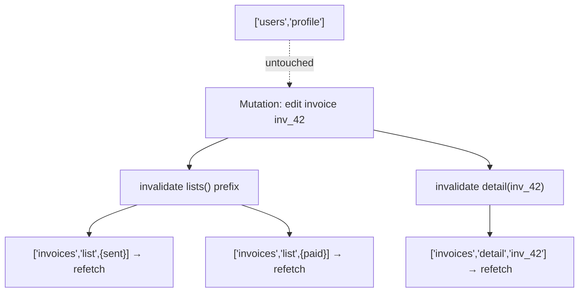

# Cache Invalidation

> After a write, the cache is out of date. Invalidation is how you tell it so — precisely, by key prefix — so exactly the affected queries refetch and nothing else.

**Part:** [03 · Application Architecture](../) · **Domain:** Data & Server State · **Priority:** Critical · **Difficulty:** Intermediate · **Reading time:** ~12 min

## TL;DR

Invalidation marks matching cached queries stale and refetches the ones with active observers. It is the event-driven complement to time-based staleness: when a mutation changes server data, you invalidate the keys that data feeds, and the affected screens refresh. Because matching is by key prefix, `invalidateQueries({ queryKey: invoiceKeys.lists() })` refreshes every filtered list without naming them. The two failure modes are under-invalidation (a screen keeps stale data because you missed its key) and over-invalidation (you nuke the whole cache and trigger a refetch storm). A key factory makes precise invalidation a one-liner.

> **Recommendation:** Invalidate from a mutation's `onSuccess`/`onSettled` using prefix keys from your factory. Target the narrowest prefix that covers everything the write could have changed — usually the resource's list prefix plus the specific detail.

## At a Glance

| | |
| --- | --- |
| **Use when** | A mutation or external event changed server data that cached queries depend on. |
| **Avoid when** | The data changes on its own schedule with no discrete event — use `staleTime`/refetch instead. |
| **Alternatives** | [Staleness & Revalidation](#alternative-approaches) for time-driven freshness; optimistic updates for instant feedback. |
| **Primary risk** | Under-invalidating (stale UI) or over-invalidating (refetch storm). |
| **Maturity** | Stable. |

## Prerequisites

- [Cache Keys & Query Identity](./cache-keys-and-query-identity.md) — invalidation is a prefix match against keys.
- [Fetch-on-Render vs Render-as-You-Fetch](./fetch-on-render-vs-render-as-you-fetch.md) — which queries have observers to refetch.

## Overview

*Invalidation* marks one or more cached queries as stale and refetches those that are currently observed. `queryClient.invalidateQueries({ queryKey })` does both: entries whose key starts with the given prefix flip to stale, and any with a mounted component refetch immediately; unobserved ones simply refetch next time they are read. It is the explicit, event-driven way to keep the cache correct, as opposed to `staleTime`, which is implicit and time-driven.

The mechanism rests entirely on key identity. Invalidation matches by prefix: `['invoices']` matches every invoice query; `['invoices', 'list']` matches every list regardless of filters; `['invoices', 'detail', id]` matches one. This is why key ordering (general to specific) and a shared factory matter so much — invalidation is only as precise as your keys allow. Invalidation does not delete data; it marks it stale and refreshes it, so the UI keeps showing the old value until the new one lands (stale-while-revalidate), avoiding a flash of empty state.

## The Problem

A user edits an invoice's amount. The detail screen updates because the mutation returns the new record, but the invoice *list* on the previous screen still shows the old amount, because nothing told the list query it was out of date. The team's fix is to call `queryClient.invalidateQueries()` with no arguments — which invalidates *everything*. Now the edit works, but saving one invoice refetches the user profile, the notifications, the reference data, and every other query in the app. On a busy screen that is dozens of requests per save.

Both the original bug and the fix are invalidation errors. The first under-invalidates (misses the list). The second over-invalidates (hits the whole cache). The correct answer is in between: invalidate the invoice list prefix and the specific detail, and nothing else. Reaching that answer requires keys designed so the right prefix exists — which is exactly what a factory provides and inline keys do not.

## Why It Matters

Invalidation is where server writes and the client cache are reconciled, and getting it wrong is directly visible to users. Under-invalidation shows stale data after an action the user just took — the most jarring kind of staleness, because they *know* they changed it. Over-invalidation turns every write into a cache-wide refetch, wasting bandwidth and server capacity and causing loading flicker across unrelated parts of the screen.

The cost compounds with app size. In a small app, invalidating everything is merely wasteful; in a large one it can mean a hundred refetches per mutation and a noticeably sluggish app. Precise invalidation keeps the work proportional to the change: a write touches the queries that write could have affected, and no others. That precision is only achievable if invalidation targets are expressed as prefixes over a designed key hierarchy, which ties this decision tightly to key design.

## Mental Model

Invalidation is a targeted "this is stale now" broadcast, scoped by how much of the key you specify. Specify less of the key and you hit more queries; specify more and you hit fewer. It is a dial from "one exact query" to "everything about this resource," and you pick the setting that matches what a given write could have changed.



The reasoning is "what could this change affect?" Editing an invoice's status could move it between filtered lists, so every list is a candidate — invalidate the list prefix. It changed one detail record — invalidate that detail. It did not touch the user profile — leave it alone. The dial setting follows from the write's semantics, not from convenience.

## Best Practices

Invalidate from the mutation, in `onSuccess` or `onSettled`. The write's completion is the event that makes the cache stale, so the invalidation belongs there. Use `onSettled` when you want to refetch even after an error (to reconcile a partial change); `onSuccess` when only a confirmed write matters.

Target the narrowest prefix that covers the change. For a create/update/delete of an invoice, that is usually the list prefix (the item may enter or leave any filtered list) plus the specific detail. Resist the urge to invalidate `all` unless the write genuinely affects everything.

Never invalidate the entire cache to fix a missed query. `invalidateQueries()` with no filter is a code smell that trades a correctness bug for a performance one. If a screen is stale, find its key and invalidate that prefix.

Await invalidation when the UI should wait for fresh data. `invalidateQueries` returns a promise that resolves when the refetch settles. Awaiting it in the mutation keeps a submit button in its pending state until the list is actually current, avoiding a flash of stale data.

Prefer optimistic updates plus invalidation for instant feedback. Invalidation alone means the user waits for a refetch after their action. Pairing an optimistic write (instant) with an `onSettled` invalidation (eventual truth) gives both speed and correctness — see [Optimistic Updates](./optimistic-updates.md).

## Trade-offs

Invalidation buys correctness after writes at the cost of extra requests — the refetches it triggers. The engineering judgment is entirely in the scope: too wide wastes requests, too narrow leaves stale data.

**Advantages**

- Keeps the cache correct after discrete write events, precisely.
- Prefix matching refreshes related queries without enumerating them.
- Stale-while-revalidate means no empty flash during the refetch.

**Disadvantages**

- Every invalidation costs the refetches it triggers.
- Correct scope requires knowing which keys a write affects.
- Invalidation-only feedback makes the user wait for a round trip after acting.

| Dimension | Prefix invalidation | Cost / caveat |
| --- | --- | --- |
| Performance | Work proportional to the change | Over-broad scope causes refetch storms |
| Complexity | One call per affected prefix | Must reason about the write's blast radius |
| Maintainability | Targets derive from the key factory | Wrong key hierarchy makes precision impossible |
| Failure behavior | Stale-while-revalidate, no empty flash | Under-scoping leaves visible stale data |

## Alternative Approaches

Invalidation is the *event-driven* way to keep data fresh; its alternatives are the other freshness mechanisms, and real apps combine them.

| Approach | Best when | Weakness | See |
| --- | --- | --- | --- |
| Invalidation (this article) | A discrete event changed the data | Must know the affected keys | (this article) |
| [Staleness & Revalidation](./staleness-and-revalidation.md) | Data changes on its own over time | Fails silently if `staleTime` is too high | `Staleness & Revalidation` |
| Background refetching | Near-real-time freshness needed | Polling cost | *Background Refetching* (planned — see the [domain index](./README.md)) |

## Bad Example

Invalidating the entire cache to make an edit show up.

```tsx
import { useMutation, useQueryClient } from '@tanstack/react-query';

// ❌ No key filter: this marks every query in the app stale, so saving one
// invoice refetches profiles, notifications, reference data — everything.
function useUpdateInvoice() {
  const queryClient = useQueryClient();
  return useMutation({
    mutationFn: updateInvoice,
    onSuccess: () => {
      queryClient.invalidateQueries();
    },
  });
}
```

**What goes wrong:** Over-invalidation. The edit works, but every save triggers a cache-wide refetch storm — dozens of unrelated requests and loading flicker across the screen. The performance cost scales with the size of the app.

## Good Example

Invalidate exactly the affected prefixes, derived from the key factory, and await them.

```tsx
import { useMutation, useQueryClient } from '@tanstack/react-query';
import { invoiceKeys } from './invoice-keys';

// ✅ Invalidate only what an invoice edit can affect: every list (the item may
// move between filters) and the one detail that changed. Nothing else refetches.
function useUpdateInvoice() {
  const queryClient = useQueryClient();
  return useMutation({
    mutationFn: updateInvoice,
    onSuccess: async (_data, variables) => {
      await Promise.all([
        queryClient.invalidateQueries({ queryKey: invoiceKeys.lists() }),
        queryClient.invalidateQueries({ queryKey: invoiceKeys.detail(variables.id) }),
      ]);
    },
  });
}
```

**Why it's better:** The scope matches the write's blast radius: lists (because the edit can move the invoice between filtered views) and the specific detail. Unrelated queries are untouched, so the save costs a bounded, predictable number of refetches. Awaiting the invalidations lets the caller keep a pending state until the data is genuinely current.

## Production Example

A delete mutation that removes the item, invalidates the lists, and also directly drops the stale detail entry so a back-navigation cannot show a deleted record.

```tsx
import { useMutation, useQueryClient } from '@tanstack/react-query';
import { invoiceKeys } from './invoice-keys';

async function deleteInvoice(id: string, signal?: AbortSignal): Promise<void> {
  const response = await fetch(`/api/invoices/${id}`, { method: 'DELETE', signal });
  if (!response.ok && response.status !== 404) {
    // 404 is fine for a delete — the goal state is "gone". Anything else is a
    // real failure the caller must surface.
    throw new Error(`Failed to delete invoice ${id} (${response.status})`);
  }
}

export function useDeleteInvoice() {
  const queryClient = useQueryClient();

  return useMutation({
    mutationFn: (id: string) => deleteInvoice(id),
    onSuccess: async (_data, id) => {
      // Remove the detail outright: it no longer exists, so a refetch would 404.
      queryClient.removeQueries({ queryKey: invoiceKeys.detail(id) });
      // Refetch the lists so the row disappears everywhere it appeared.
      await queryClient.invalidateQueries({ queryKey: invoiceKeys.lists() });
    },
    onError: (error) => {
      // Surface, don't swallow: the caller shows this in an accessible alert.
      reportError(error);
    },
  });
}
```

## Common Mistakes

See the [Data & Server State anti-patterns](../../../anti-patterns/README.md#data-server-state) for the domain catalog. Concept-specific:

### Mistake: Invalidating the whole cache

- **Symptom:** `queryClient.invalidateQueries()` with no key filter after a write.
- **Why it fails:** It refetches every query in the app, causing a request storm proportional to app size.
- **Fix:** Invalidate the specific prefixes the write affects, from the key factory.

### Mistake: Forgetting the list when you invalidate the detail

- **Symptom:** After an edit, the detail is fresh but a list still shows the old value.
- **Why it fails:** The write can move the item between filtered lists, but only the detail key was invalidated.
- **Fix:** Invalidate the list prefix as well as the detail; reason about the full blast radius.

## Checklist

- [ ] Invalidation happens in the mutation's `onSuccess`/`onSettled`, not scattered in components.
- [ ] Targets are prefix keys from the factory, scoped to what the write can change.
- [ ] The whole cache is never invalidated to patch a missed query.
- [ ] Deletes `removeQueries` the gone detail so back-navigation can't show it.
- [ ] Invalidations are awaited when the UI should wait for fresh data.

## Related Articles

- [Cache Keys & Query Identity](./cache-keys-and-query-identity.md) — the prefixes invalidation matches against.
- [Optimistic Updates](./optimistic-updates.md) — instant feedback paired with `onSettled` invalidation.
- [Staleness & Revalidation](./staleness-and-revalidation.md) — the time-driven counterpart.

## Related Recipes

- [Optimistic list mutation with rollback](../../../recipes/optimistic-list-mutation.md) — invalidation as the reconcile step after an optimistic write.

## Related Examples

- [Invalidate after mutation](../../../examples/invalidate-after-mutation.ts) — the minimal precise-invalidation pattern.

## References

- [TanStack Query — Query Invalidation](https://tanstack.com/query/latest/docs/framework/react/guides/query-invalidation) — prefix matching and `invalidateQueries`.
- [TanStack Query — Invalidation from Mutations](https://tanstack.com/query/latest/docs/framework/react/guides/invalidations-from-mutations) — where to invalidate in the lifecycle.
