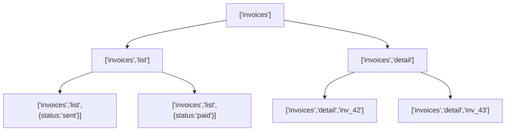

# Cache Keys & Query Identity

> A query cache is a map. The query key is the map key, and every dedupe, refetch, and invalidation is really a lookup against it. Treat keys as an API.

**Part:** [03 · Application Architecture](../) · **Domain:** Data & Server State · **Priority:** Critical · **Difficulty:** Intermediate · **Reading time:** ~15 min

## TL;DR

The query key is the identity of a cached request. Two components that use the same key share one cache entry, one request, and one refetch; two keys that differ by anything — a stray object, a different order, a missing filter — are two separate entries that neither dedupe nor invalidate together. Because keys are serialized structurally (not by reference), the rules for what counts as "the same key" are precise and easy to violate by accident. Define keys once in a factory, derive every read and every invalidation from it, and key identity becomes a property you can reason about instead of a bug you chase.

> **Recommendation:** Never inline a query key. Put every key behind a typed factory, order keys from general to specific (`['invoices', 'list', filters]`), and invalidate by prefix so a mutation can refresh a whole subtree with one call.

## At a Glance

| | |
| --- | --- |
| **Use when** | Always — every cached query has a key, and the only choice is whether it is designed or accidental. |
| **Avoid when** | Never; the alternative to a designed key is an undesigned one. |
| **Alternatives** | None. Key design is intrinsic to any server-state cache. |
| **Primary risk** | Duplicate or drifting keys that fork the cache, so data looks stale or refuses to invalidate. |
| **Maturity** | Stable. |

## Prerequisites

- [Fetch-on-Render vs Render-as-You-Fetch](./fetch-on-render-vs-render-as-you-fetch.md) — why the prefetch and the read must share a key.

## Overview

A *query key* uniquely identifies a query in the cache. In TanStack Query it is an array — `['invoices', 'list', { status: 'sent' }]` — that the library hashes into a stable string. That hash is the cache-map key. Everything the cache does is a lookup or a prefix scan against these hashes: deduping two identical in-flight requests, returning cached data on a remount, invalidating a group of related queries, and reading a value optimistically during a mutation.

The subtlety is that keys are compared *by value, structurally*, using a deterministic serialization — not by JavaScript reference and not by insertion order of object properties. `{ a: 1, b: 2 }` and `{ b: 2, a: 1 }` are the same key; `['invoices']` and `['invoices', undefined]` are not. Understanding this comparison is the whole game: get it right and identity is predictable, get it wrong and you get two caches where you meant one.

## The Problem

A team ships an invoice list keyed `['invoices', filters]` in one component and `['invoices', { ...filters }]` in another, spread into a fresh object with an extra defaulted field. To the cache these are different keys, so the two components each fire their own request and hold their own copy. When a mutation invalidates `['invoices', filters]`, the second component never refreshes — its key was never touched. The bug reads as "the list doesn't update after editing," and it is untraceable from the mutation code, because the mutation did exactly what it said.

The mirror-image failure is over-broad keys. A detail query keyed only `['invoice']` without the id means every invoice detail collides on one cache entry; navigating between invoices shows the previous one's data until the refetch lands. Both failures come from the same root cause: the key did not encode identity at the right granularity, and nothing in the type system caught it because a key is "just an array."

## Why It Matters

Key identity is the contract that makes a server-state cache coherent. Deduplication, background refetching, and invalidation are all defined in terms of key equality and key prefixes; if keys are inconsistent, those features silently do the wrong thing rather than erroring. There is no runtime exception for "you meant these to be the same query" — you get two entries, extra requests, and stale UI, discovered only by a user noticing the screen is wrong.

The blast radius is wide because keys are referenced from many places: the component that reads, the loader that prefetches, the mutation that invalidates, and any code that reads or writes the cache optimistically. Every one of those sites must agree on the key for a given query. When keys are inlined, that agreement is maintained by hand across the codebase and drifts the first time someone adds a filter. Centralizing keys turns a cross-cutting invariant into a single module you can test.

## Mental Model

Picture the cache as a filing cabinet where the key is the label on the drawer, ordered from broad category to specific item: cabinet `invoices` → drawer `list` → folder `{ status: 'sent' }`. Reading fetches the exact folder. Invalidating a folder refreshes one query; invalidating a drawer refreshes every list regardless of filters; invalidating the cabinet refreshes everything about invoices. This hierarchy only works if keys are ordered **general to specific** and every key for a resource shares the same prefix.



The factory that produces these keys is the model made real. `invoiceKeys.all` is the cabinet, `invoiceKeys.lists()` the drawer, `invoiceKeys.list(filters)` the folder. Invalidation targets a level by calling the matching factory method. Because the library matches by prefix, `invalidateQueries({ queryKey: invoiceKeys.lists() })` catches every filtered list without you enumerating them.

## Best Practices

Define keys in a typed factory, one per resource. A single object literal with `as const` gives you autocompletion, prevents typos, and makes the hierarchy visible. Every read, prefetch, and invalidation imports from it; no key is ever written inline.

Order keys from general to specific. `['invoices', 'list', filters]`, never `[filters, 'invoices']`. Prefix ordering is what lets you invalidate a whole category with one call and a single item with another, using the same structure.

Put only serializable, identity-bearing values in a key. The key must contain everything that changes the response — filters, ids, pagination — and nothing that does not, like a callback, a class instance, or a timestamp that changes every render. Non-serializable values break the structural hash.

Normalize inputs before they enter the key. If two call sites can produce logically equal but structurally different filters (missing defaults, different property order is fine, but `undefined` vs absent is not), normalize them in the factory so the key is canonical.

Keep the query function beside the key. Colocating the key and its fetcher — via `queryOptions` — means a component cannot accidentally pair the right key with the wrong request. This also powers render-as-you-fetch, where the loader and component share one `queryOptions`.

## Trade-offs

A key factory adds one small module per resource and a rule that everyone imports keys instead of writing them. That discipline is the cost, and it is cheap relative to the class of bug it removes.

**Advantages**

- One place defines identity, so reads, prefetches, and invalidations cannot drift.
- Prefix invalidation refreshes related queries without enumerating them.
- Keys become typed and autocompleted, so typos surface at compile time.

**Disadvantages**

- Indirection: a reader follows the factory to see the literal key.
- A poorly designed hierarchy (wrong ordering) is now wrong everywhere at once.
- Over-normalizing inputs can hide a genuinely distinct query behind a shared key.

| Dimension | Key factory | Cost / caveat |
| --- | --- | --- |
| Performance | Correct dedupe and invalidation; no forked caches | None material |
| Complexity | Identity centralized and testable | One layer of indirection to the literal key |
| Maintainability | Adding a filter is a one-file change | A bad hierarchy propagates everywhere |
| Failure behavior | Prefix scans catch related queries | Over-broad keys collide distinct data |

## Alternative Approaches

There is no competing pattern: any server-state cache identifies entries by key, so the question is only whether keys are designed. Inlining keys is not an alternative approach — it is the absence of one, and it is the source of the mistakes below. `alternatives: []` reflects that this is a foundational property rather than a choice among substitutes.

## Bad Example

Keys inlined at each call site, drifting by a spread and a defaulted field.

```ts
import { useQuery, useQueryClient } from '@tanstack/react-query';

// ❌ Inlined keys that look equal but hash differently: one includes a defaulted
// `page`, the other does not, so these are two cache entries, not one.
function useInvoiceList(status: string) {
  return useQuery({
    queryKey: ['invoices', { status }],
    queryFn: () => fetchInvoices({ status }),
  });
}

function refreshInvoicesAfterEdit(queryClient: ReturnType<typeof useQueryClient>) {
  // Targets a key no component actually uses (extra `page: 1`), so nothing
  // refetches and the list shows stale data after an edit.
  return queryClient.invalidateQueries({
    queryKey: ['invoices', { status: 'sent', page: 1 }],
  });
}
```

**What goes wrong:** A silent cache fork. The read key and the invalidation key differ structurally, so `invalidateQueries` matches nothing and the UI never updates. Nothing throws; the bug is a screen that "won't refresh."

## Good Example

A typed factory as the single source of key identity, with `queryOptions` binding each key to its fetcher.

```ts
import { queryOptions } from '@tanstack/react-query';

export interface InvoiceFilters {
  status?: 'draft' | 'sent' | 'paid';
  customerId?: string;
}

// ✅ One factory owns identity. Ordered general → specific; every read and
// invalidation derives from here, so they cannot drift apart.
export const invoiceKeys = {
  all: ['invoices'] as const,
  lists: () => [...invoiceKeys.all, 'list'] as const,
  list: (filters: InvoiceFilters) => [...invoiceKeys.lists(), filters] as const,
  details: () => [...invoiceKeys.all, 'detail'] as const,
  detail: (id: string) => [...invoiceKeys.details(), id] as const,
};

export const invoiceListQuery = (filters: InvoiceFilters) =>
  queryOptions({
    queryKey: invoiceKeys.list(filters),
    queryFn: ({ signal }) => fetchInvoices(filters, signal),
  });

export const invoiceDetailQuery = (id: string) =>
  queryOptions({
    queryKey: invoiceKeys.detail(id),
    queryFn: ({ signal }) => fetchInvoice(id, signal),
  });
```

**Why it's better:** Reads use `invoiceListQuery(filters)`; an invalidation after editing uses `invalidateQueries({ queryKey: invoiceKeys.lists() })` and catches every filtered list at once. The read and the invalidation reference the same structure, so they cannot fork. Adding a filter changes one type and one function.

## Production Example

The factory in use across a read, a prefetch, and a targeted invalidation — the three sites that must agree on identity — with the prefix behavior made explicit.

```ts
import {
  QueryClient,
  useQuery,
  useQueryClient,
} from '@tanstack/react-query';
import { invoiceKeys, invoiceListQuery, invoiceDetailQuery } from './invoice-keys';
import type { InvoiceFilters } from './invoice-keys';

// Read: the component never sees a raw key.
export function useInvoiceList(filters: InvoiceFilters) {
  return useQuery(invoiceListQuery(filters));
}

// Prefetch on intent: identical query object, so the later read is a cache hit.
export function prefetchInvoiceDetail(queryClient: QueryClient, id: string) {
  return queryClient.prefetchQuery(invoiceDetailQuery(id));
}

// Invalidate: choose the level deliberately.
export async function invalidateAfterInvoiceChange(
  queryClient: QueryClient,
  changedId: string,
) {
  // Refresh every list (any filter) because a change can move an invoice in or
  // out of any filtered view — prefix match, no enumeration needed.
  await queryClient.invalidateQueries({ queryKey: invoiceKeys.lists() });
  // Refresh just the one detail that changed.
  await queryClient.invalidateQueries({ queryKey: invoiceKeys.detail(changedId) });
}
```

## Common Mistakes

See the [Data & Server State anti-patterns](../../../anti-patterns/README.md#data-server-state) for the domain catalog. Concept-specific:

### Mistake: Inlining keys instead of using a factory

- **Symptom:** `queryKey: ['invoices', ...]` written literally in components, loaders, and mutations.
- **Why it fails:** The sites drift the first time a filter is added, forking the cache; invalidation then misses.
- **Fix:** Route every key through a typed factory and import it everywhere.

### Mistake: Putting non-serializable or volatile values in a key

- **Symptom:** A key holds a function, a class instance, or `new Date()`.
- **Why it fails:** The structural hash changes every render (or throws), so the query never dedupes or caches.
- **Fix:** Keys hold only the serializable inputs that change the response; pass the rest as closure or `meta`.

## Checklist

- [ ] Every query key comes from a typed factory, never inlined.
- [ ] Keys are ordered general → specific and share a common prefix per resource.
- [ ] Keys contain only serializable values that actually change the response.
- [ ] Reads, prefetches, and invalidations for a resource derive from the same factory.
- [ ] Invalidation targets the right level (all / list / detail) by prefix.

## Related Articles

- [Cache Invalidation](./cache-invalidation.md) — how prefix keys let one mutation refresh a subtree.
- [Staleness & Revalidation](./staleness-and-revalidation.md) — what a keyed entry does between reads.
- [Background Refetching](./background-refetching.md) — interval and focus revalidation for the same keys.

## Related Recipes

- [Paginated query with prefetch on intent](../../../recipes/paginated-query-with-prefetch.md) — a key factory driving list, detail, and page prefetch.

## Related Examples

- [Query key factory](../../../examples/query-key-factory.ts) — the minimal typed factory pattern.

## References

- [TanStack Query — Query Keys](https://tanstack.com/query/latest/docs/framework/react/guides/query-keys) — structural hashing and key rules.
- [TanStack Query — Query Invalidation](https://tanstack.com/query/latest/docs/framework/react/guides/query-invalidation) — prefix matching semantics.
- [TanStack Query — Query Options](https://tanstack.com/query/latest/docs/framework/react/reference/queryOptions) — binding a key to its fetcher.
