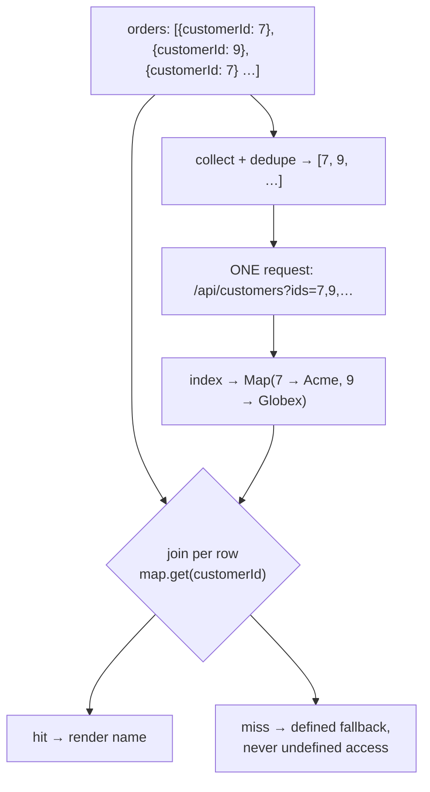

# Client-Side Relations

> A list of fifty orders that each render a customer name is either one extra request or fifty. The difference is whether the client batches its reference lookups — and whether the server should have joined them in the first place.

**Part:** [03 · Application Architecture](../) · **Domain:** Data & Server State · **Priority:** Critical · **Difficulty:** Intermediate · **Reading time:** ~12 min

## TL;DR

Once responses are normalized, entities hold IDs instead of embedded objects, and something has to resolve those references for rendering. Resolving them per item is the client-side N+1 problem: fifty rows, fifty requests, a request waterfall, and a UI that fills in unevenly. The fix is to collect the referenced IDs for the whole collection, fetch them in one batched request, index the result into a lookup map, and join in memory — one extra round trip regardless of list size. Missing references are normal, not exceptional: an entity can be deleted, filtered by permissions, or simply not loaded yet, so every join needs a defined behavior for absence.

> **Recommendation:** Join from a lookup map built once per collection, not per row. Prefer a batch endpoint (`?ids=`) or a server-side join over many single-entity requests; render a defined fallback for missing references; and if a view always needs the joined shape, ask the server for it.

## At a Glance

| | |
| --- | --- |
| **Use when** | Views need entities the client holds separately, and the server cannot or should not embed them. |
| **Avoid when** | One view always needs one shape — have the server join it and skip the client work entirely. |
| **Alternatives** | [Derived Server Data](#alternative-approaches) (compute instead of join); server-side joins or a BFF endpoint. |
| **Primary risk** | N+1 request fan-out, and crashes or blanks when a reference cannot be resolved. |
| **Maturity** | Stable. |

## Prerequisites

- [Normalizing Server Responses](./normalizing-server-responses.md) — the flat entity shape that makes references, and therefore joins, necessary.
- [Parallel vs Waterfall Requests](./parallel-vs-waterfall-requests.md) — the request-shape problem that per-row resolution reintroduces.

## Overview

*Client-side relations* are the joins a client performs between entities it stores separately. A normalized order holds `customerId` and `lineItemIds`; a component that renders "Order #4102 — Acme Corp" must turn `customerId` into a customer. The resolution can happen three ways: the server embeds the related data in the response, the client fetches the related entities and joins them in memory, or the component reads them from an entity store it already has.

The distinction that matters is *where the fan-out happens*. Resolving a reference inside a row component means the number of requests scales with the number of rows — the client-side version of the N+1 query problem that ORMs made famous. Resolving references at the collection level means collecting every referenced ID first, issuing one batched request, and joining locally: one extra round trip whether the list has five rows or five hundred. The mechanics are the same as a database's hash join, and the server-side equivalent — batching per tick, deduplicating IDs — is exactly what `DataLoader` does for GraphQL resolvers.

## The Problem

An orders table renders fifty rows, each showing the customer's name and their account tier. Orders are normalized, so each row has `customerId` and nothing else about the customer. A `<CustomerCell customerId={...} />` component calls `useQuery(['customer', customerId])`, which is clean, colocated, and reusable — the shape this codebase uses everywhere.

On first render, fifty requests leave the browser. On HTTP/1.1 they queue against the per-origin connection limit, so the customer names appear in waves over two seconds while rows shift as text arrives. The API's rate limiter starts rejecting requests around row forty, so the last ten rows render "—" and never recover, because the failed queries have no retry path the user can see. In the server logs, a page view now costs fifty-one queries.

The team's first fix is to prefetch all customers at once: one request for the full customer list. That works for a thousand customers and stops working at fifty thousand, where the payload is larger than the page. The second fix embeds the customer in the order response, which is correct here — and then a different view needs the customer's billing address, so the embedded object grows, and now the list endpoint returns nested objects nobody on that screen renders. The real question is not "embed or join" in the abstract; it is which references this view needs, resolved in how many requests, with what behavior when one is missing.

## Why It Matters

Request count is the dominant cost in a data-dense UI, and per-row resolution is the most reliable way to make it scale with content. Fifty small requests are slower than one batched request of the same total size — connection limits, per-request overhead, and head-of-line effects all compound — and they fail *partially*, which is a much worse user experience than failing wholly. Batching converts a fan-out that grows with the data into a fixed cost, which is the difference between a table that loads in one step and one that fills in unevenly for seconds.

The correctness half is missing references. In a normalized client, `customerId` pointing to nothing is routine: the customer was deleted, the current user lacks permission to see it, it was evicted from the store, or its request failed while others succeeded. Code written as though joins always resolve produces `undefined` reads deep in render — the crash that reproduces only for the one user whose data has a gap. A join is a partial function, and treating it as total is the most common bug in this area.

There is also an architectural signal worth reading. Repeatedly joining the same relations on the client usually means the API is not shaped for its consumers. Client-side joins are the right tool when relations are genuinely many-to-many across views, or when the related data is shared and cached; they are a workaround when one screen always needs one shape and the server could have provided it in a single response.

## Mental Model

Think in two steps that must not be interleaved: *collect*, then *resolve*. Collect every referenced ID across the whole collection, deduplicate, fetch once, index by ID, and only then join per row against that map.



Two properties follow. The request count is `1` per relation per collection, not per row — and because the ID list is deduplicated, a table where fifty orders belong to six customers fetches six records. And every join site has two branches, hit and miss, which forces the missing-reference decision to be made explicitly rather than discovered in production.

The batching can live at several layers, and the layer matters more than the technique. In the component, `useQueries` with a batched key is simple but re-derives per render. In the data layer, a request-coalescing loader (the `DataLoader` shape: collect IDs within a tick, issue one request, distribute results) makes every call site cheap without any call site knowing. At the network layer, a batch endpoint is what makes either possible — without `?ids=`, the client cannot batch no matter how it is written.

## Best Practices

Resolve at the collection level, never inside the row. Lift reference resolution to the component that owns the list, pass resolved values down, and keep row components pure. This is the single change that removes N+1.

Deduplicate IDs before fetching. Collections repeat references heavily; a `Set` before the request often cuts the batch by an order of magnitude.

Prefer one batched request over many single-entity requests. `GET /api/customers?ids=7,9,12` is one round trip, one rate-limit unit, and one error to handle. Cap the batch size and chunk beyond it, since URL length and server limits are real.

Push the join to the server when a view always needs it. If every consumer of the orders list renders the customer name, the list endpoint should include it — as a compact embedded summary, not the whole related record. Client joins are for relations that vary by view.

Index into a `Map` once, then join. Building the map is `O(n)`; joining per row is then `O(1)`. `array.find()` inside a row is the quadratic version of the same code and is easy to miss in review.

Define the missing-reference behavior per relation. Decide, explicitly, between rendering a placeholder, hiding the row, showing an error, or treating it as a data-integrity alert — and encode that in types so `undefined` cannot be read accidentally.

Distinguish "not loaded" from "does not exist". A pending batch and a confirmed absence look identical if both are `undefined`. Model them separately so the UI can show a skeleton in one case and a fallback in the other.

Keep joined objects referentially stable. Memoize the join so unchanged rows keep identical props, which is what lets `React.memo` and virtualized rows avoid re-rendering.

Guard batch depth. Resolving a relation of a relation (orders to customers to accounts) multiplies round trips. Two levels is usually the point to ask the server for a joined shape instead.

Don't fetch a whole collection to resolve a few references. `GET /api/customers` to find six of them is convenient at small scale and a payload cliff later.

## Trade-offs

Client-side joins trade extra client complexity and one extra round trip per relation for endpoints that stay generic and cacheable per entity. Compared with server-side joins they win on reuse and cache hit rate, and lose on round trips and code volume.

**Advantages**

- Endpoints stay entity-shaped, so each entity is cached and invalidated once, independent of the views that use it.
- Related data already in the cache resolves with no request at all.
- Views compose relations freely without a bespoke endpoint per screen.

**Disadvantages**

- At least one extra round trip per relation, and more if relations nest.
- Every join site must handle absence, which is easy to forget and hard to test.
- The join logic is duplicated code that a server-side join would not need.
- Consistency is per-entity: two batches fetched seconds apart can disagree.

| Dimension | Client-side join | Server-side join / BFF |
| --- | --- | --- |
| Round trips | 1 + 1 per relation | 1 |
| Cache granularity | Per entity — high reuse across views | Per view — duplicated entities |
| Endpoint churn | None; generic endpoints serve all views | A new shape per view need |
| Client complexity | Collect, batch, index, join, handle misses | Render the response |
| Consistency | Entities fetched at different times may disagree | One snapshot per response |
| Payload size | Only the referenced entities, deduplicated | Whatever the view shape includes |

## Alternative Approaches

Joining is one answer to "this view needs data from two places." The alternatives move the work to the server, or avoid needing the related entity at all.

| Approach | Best when | Weakness | See |
| --- | --- | --- | --- |
| Batched client-side join (this article) | Relations vary by view; entities are widely shared | Extra round trip; absence handling everywhere | (this article) |
| Server-side join / BFF endpoint | One view always needs one shape | A bespoke endpoint per view; duplicated entities in cache | `API Design · Application Architecture` |
| Embedded summaries in the parent | The related field is small, stable, and always rendered | Grows into a nested payload nobody fully uses | [Normalizing Server Responses](./normalizing-server-responses.md) |
| [Derived Server Data](./derived-server-data.md) | The value can be computed from data already held | Only works when no additional entity is required | `Derived Server Data · Data & Server State` |

## Bad Example

Per-row resolution: a clean, colocated component that costs one request per row and reads `undefined` when a reference is missing.

```tsx
import { useQuery } from '@tanstack/react-query';

// ❌ Reusable, readable, and fifty requests.
function CustomerCell({ customerId }: { customerId: string }) {
  const { data } = useQuery({
    queryKey: ['customer', customerId],
    queryFn: () => fetch(`/api/customers/${customerId}`).then((r) => r.json()),
  });

  // (1) `data` is undefined while loading AND when the customer doesn't exist;
  //     the optional chain hides a real data-integrity problem.
  return <span>{data?.name ?? '—'}</span>;
}

function OrdersTable({ orders }: { orders: Order[] }) {
  return (
    <table>
      <tbody>
        {orders.map((order) => (
          <tr key={order.id}>
            <td>{order.reference}</td>
            {/* (2) One query per row: 50 rows → 50 requests, queued against
                    the connection limit, rate-limited near the end. */}
            <td><CustomerCell customerId={order.customerId} /></td>
            {/* (3) Second relation, same fan-out: now 100 requests. */}
            <td><WarehouseCell warehouseId={order.warehouseId} /></td>
          </tr>
        ))}
      </tbody>
    </table>
  );
}

function OrderTotal({ order }: { order: Order }) {
  const { data: items } = useQuery({
    queryKey: ['lineItems', order.id],
    queryFn: () => fetch(`/api/orders/${order.id}/items`).then((r) => r.json()),
  });
  // (4) Nested relation resolved per row: a second wave of N requests that
  //     cannot start until the first wave's rows render.
  return <span>{items?.reduce((sum: number, i: LineItem) => sum + i.total, 0)}</span>;
}
```

**What goes wrong:** Request count is a function of row count, so the table's cost grows with the data and fails partially under a rate limit — the last rows show "—" permanently, indistinguishable from a genuinely missing customer. Two relations double the fan-out, and the nested line-items query adds a second wave that cannot begin until the first has rendered, which is a waterfall by construction. The `data?.name ?? '—'` collapses loading and absence into one visual state, so nobody notices that references are broken.

## Good Example

Collect, deduplicate, batch, index, join — with loading and absence modeled separately.

```tsx
import { useMemo } from 'react';
import { useQuery } from '@tanstack/react-query';

interface Order {
  id: string;
  reference: string;
  customerId: string;
}

interface Customer {
  id: string;
  name: string;
  tier: 'standard' | 'premium';
}

const BATCH_LIMIT = 100;

/** ✅ One batched request per collection, from a deduplicated ID list. */
function useCustomersByIds(ids: readonly string[]) {
  const unique = useMemo(
    // Sorted so the key is stable regardless of row order.
    () => [...new Set(ids)].sort(),
    [ids],
  );

  return useQuery({
    queryKey: ['customers', 'batch', unique],
    enabled: unique.length > 0,
    staleTime: 5 * 60_000, // customers change rarely; reuse across views
    queryFn: async ({ signal }): Promise<ReadonlyMap<string, Customer>> => {
      // ✅ Chunked: URL length and server limits are real constraints.
      const chunks: string[][] = [];
      for (let i = 0; i < unique.length; i += BATCH_LIMIT) {
        chunks.push(unique.slice(i, i + BATCH_LIMIT));
      }

      const responses = await Promise.all(
        chunks.map(async (chunk) => {
          const response = await fetch(`/api/customers?ids=${chunk.join(',')}`, { signal });
          if (!response.ok) {
            throw new Error(`Failed to load customers (${response.status})`);
          }
          return (await response.json()) as Customer[];
        }),
      );

      // ✅ Index once; joining per row is then O(1).
      return new Map(responses.flat().map((customer) => [customer.id, customer]));
    },
  });
}

/** ✅ Absence is a value, not `undefined`: loading and missing are distinct. */
type Resolved<T> =
  | { state: 'loading' }
  | { state: 'missing' }
  | { state: 'ready'; value: T };

export function OrdersTable({ orders }: { orders: readonly Order[] }) {
  const customerIds = useMemo(() => orders.map((order) => order.customerId), [orders]);
  const { data: customers, isLoading, isError, error } = useCustomersByIds(customerIds);

  // ✅ Memoized join: unchanged rows keep identical props.
  const rows = useMemo(
    () =>
      orders.map((order) => {
        const customer: Resolved<Customer> = isLoading
          ? { state: 'loading' }
          : customers?.has(order.customerId)
            ? { state: 'ready', value: customers.get(order.customerId)! }
            : { state: 'missing' };
        return { order, customer };
      }),
    [orders, customers, isLoading],
  );

  if (isError) {
    return <p role="alert">Couldn’t load customer details: {error.message}</p>;
  }

  return (
    <table>
      <tbody>
        {rows.map(({ order, customer }) => (
          <tr key={order.id}>
            <td>{order.reference}</td>
            <td>
              {/* ✅ Three explicit branches; no optional chaining into unknowns. */}
              {customer.state === 'loading' && <Shimmer width={120} />}
              {customer.state === 'missing' && (
                <span title="This customer is no longer available">Unknown customer</span>
              )}
              {customer.state === 'ready' && <span>{customer.value.name}</span>}
            </td>
          </tr>
        ))}
      </tbody>
    </table>
  );
}
```

**Why it's better:** Request count is one (or one per chunk) regardless of row count, and deduplication means six distinct customers across fifty orders cost six records. Indexing into a `Map` makes the per-row join constant time instead of a nested scan. Most importantly, `Resolved<T>` forces the three states apart: a shimmer while the batch is in flight, an explicit "Unknown customer" for a reference that genuinely does not resolve, and a value otherwise — so a broken reference is visible rather than silently rendering a dash.

## Production Example

Batching in the data layer beats batching in components: call sites stay simple, and coalescing happens automatically within a tick. This is the `DataLoader` shape adapted to a browser cache.

```ts
type Resolver<T> = { resolve: (value: T | undefined) => void; reject: (error: unknown) => void };

/**
 * Coalesces per-ID requests made within the same tick into one batched
 * request. Call sites ask for a single entity; the network sees one request.
 */
export function createBatchLoader<T extends { id: string }>(
  fetchMany: (ids: readonly string[], signal: AbortSignal) => Promise<T[]>,
  { maxBatch = 100, windowMs = 0 } = {},
) {
  const pending = new Map<string, Resolver<T>[]>();
  let scheduled = false;

  async function flush() {
    scheduled = false;
    // Take the current batch and reset, so requests arriving during the
    // network call form the next batch instead of joining this one.
    const ids = [...pending.keys()].slice(0, maxBatch);
    const resolvers = ids.map((id) => [id, pending.get(id)!] as const);
    for (const id of ids) pending.delete(id);

    if (ids.length === 0) return;

    const controller = new AbortController();
    try {
      const records = await fetchMany(ids, controller.signal);
      const byId = new Map(records.map((record) => [record.id, record]));
      for (const [id, waiters] of resolvers) {
        // ✅ An ID with no record resolves to undefined — a normal outcome,
        // not an error. Callers decide what a missing reference means.
        for (const waiter of waiters) waiter.resolve(byId.get(id));
      }
    } catch (error) {
      // ✅ Reject every waiter: a partial batch failure must not leave
      // promises pending forever.
      for (const [, waiters] of resolvers) {
        for (const waiter of waiters) waiter.reject(error);
      }
    }

    if (pending.size > 0) schedule();
  }

  function schedule() {
    if (scheduled) return;
    scheduled = true;
    // A macrotask window catches everything rendered in one pass; 0ms is
    // enough for a single render tree.
    setTimeout(flush, windowMs);
  }

  return function load(id: string): Promise<T | undefined> {
    return new Promise<T | undefined>((resolve, reject) => {
      const waiters = pending.get(id) ?? [];
      waiters.push({ resolve, reject });
      // ✅ Duplicate IDs share one slot: fifty rows, six customers, six IDs.
      pending.set(id, waiters);
      schedule();
    });
  };
}

export const customerLoader = createBatchLoader<Customer>(async (ids, signal) => {
  const response = await fetch(`/api/customers?ids=${ids.join(',')}`, { signal });
  if (!response.ok) {
    throw new Error(`Failed to load customers (${response.status})`);
  }
  return (await response.json()) as Customer[];
});
```

With the loader in place, a row-level `queryFn: () => customerLoader.load(id)` costs one request for the whole table, so the colocated component shape from the bad example becomes correct. Two caveats: the loader must resolve missing IDs to `undefined` rather than throwing, or one deleted record fails a whole batch; and every waiter must be settled on failure, since an unsettled promise is a query stuck in loading forever.

## Common Mistakes

See the [Data & Server State anti-patterns](../../../anti-patterns/README.md#data-server-state) for the domain catalog. Concept-specific:

### Mistake: Resolving references inside row components

- **Symptom:** Request count tracks row count; names fill in over seconds and the last rows fail.
- **Why it fails:** Each row issues its own request, so fan-out grows with the data and hits connection and rate limits.
- **Fix:** Collect IDs at the collection level and issue one batched request, or route per-ID calls through a batching loader.

### Mistake: Treating a join as total

- **Symptom:** `Cannot read properties of undefined` in render, for some users only.
- **Why it fails:** References can point to deleted, filtered, evicted, or not-yet-loaded entities; the join is a partial function.
- **Fix:** Model the result as loading / missing / ready and render an explicit fallback for absence.

### Mistake: Collapsing "loading" and "missing" into one state

- **Symptom:** A dash where a name should be, permanently, with no error anywhere.
- **Why it fails:** `data?.name ?? '—'` cannot distinguish a pending request from a broken reference, so data-integrity problems are invisible.
- **Fix:** Keep the two states distinct in types and in the UI.

### Mistake: `array.find()` per row

- **Symptom:** A large table is slow even though only one request was made.
- **Why it fails:** Scanning the related array for every row is quadratic in list size.
- **Fix:** Build a `Map` once and look up by key.

### Mistake: Fetching the whole related collection

- **Symptom:** A multi-megabyte customers payload to resolve a handful of references.
- **Why it fails:** Payload scales with the related table, not with what the view needs.
- **Fix:** Batch by explicit IDs and chunk large batches.

### Mistake: Deeply nested client joins

- **Symptom:** Three sequential waves of requests before a row is complete.
- **Why it fails:** Each level's IDs are only known after the previous level resolves — a waterfall by construction.
- **Fix:** Ask the server for the joined shape at the second level, or embed a compact summary.

## Checklist

- [ ] Reference resolution happens at the collection level, not inside rows.
- [ ] IDs are deduplicated and sorted before being used in a batch key.
- [ ] One batched request per relation, chunked below URL and server limits.
- [ ] Results are indexed into a `Map` before joining.
- [ ] Loading, missing, and ready are distinct states in types and in the UI.
- [ ] Missing references render a defined fallback and are observable in telemetry.
- [ ] Joined objects are memoized for referential stability.
- [ ] Relations nested more than two levels deep are joined server-side instead.
- [ ] A relation every view needs is embedded by the server as a compact summary.

## Related Articles

- [Normalizing Server Responses](./normalizing-server-responses.md) — the entity shape that produces references to resolve.
- [Derived Server Data](./derived-server-data.md) — values computed from data you already hold, needing no join.
- [Parallel vs Waterfall Requests](./parallel-vs-waterfall-requests.md) — why per-row resolution becomes a waterfall.
- [Request Deduplication](./request-deduplication.md) — collapsing identical reference lookups that escape batching.
- [List Virtualization](./list-virtualization.md) — why stable joined props matter once rows are recycled.

## Related Examples

- [Query key factory](../../../examples/query-key-factory.ts) — where a batch key (`['customers', 'batch', ids]`) belongs.

## References

- [TanStack Query — useQueries](https://tanstack.com/query/latest/docs/framework/react/reference/useQueries) — resolving several dependent entities without per-row hooks.
- [GraphQL — DataLoader batching](https://github.com/graphql/dataloader) — the per-tick coalescing pattern the production example adapts.
