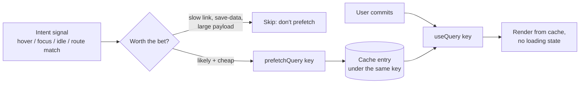

# Data Prefetching

> The fastest request is the one that finished before the user asked. Prefetching spends bandwidth on a guess so the next view can render from cache — and the entire design question is how good the guess is.

**Part:** [03 · Application Architecture](../) · **Domain:** Data & Server State · **Priority:** Critical · **Difficulty:** Intermediate · **Reading time:** ~12 min

## TL;DR

Data prefetching starts a request for data a user will *probably* need and writes the result into the cache, so the view that needs it renders without a loading state. It is the same fetch as always, moved earlier in time and triggered by a signal — a hover, a focus, an idle callback, a route match — rather than by a render. Because the request lands in the cache under the same key the consuming query uses, the payoff is automatic: the query finds fresh data and never enters a loading state. The cost is speculative work, so prefetching is only a win when the hit rate is high, the payload is modest, and the prefetch cannot starve requests the user is actually waiting on.

> **Recommendation:** Prefetch on intent signals (hover, focus, viewport entry) with a small delay, on the exact key the destination query uses, at low priority, with a non-zero `staleTime` so the prefetch isn't immediately refetched. Skip it on slow connections and on data you cannot cheaply guess.

## At a Glance

| | |
| --- | --- |
| **Use when** | The next data need is predictable — a link the pointer is resting on, the next page of a list, a route's data on match. |
| **Avoid when** | Hit rate is low, payloads are large, the connection is metered or slow, or the data is per-interaction. |
| **Alternatives** | [Request Deduplication](#alternative-approaches) (make the eventual request cheap, not early); [Parallel vs Waterfall Requests](#alternative-approaches) (reshape the requests you know you need). |
| **Primary risk** | Speculative requests competing with critical ones, and cache churn from prefetches that are never read. |
| **Maturity** | Stable. |

## Prerequisites

- [Fetch-on-Render vs Render-as-You-Fetch](./fetch-on-render-vs-render-as-you-fetch.md) — prefetching is render-as-you-fetch taken one step earlier, before the component exists.
- [Cache Keys & Query Identity](./cache-keys-and-query-identity.md) — a prefetch only helps if it lands under the key the consumer reads.

## Overview

*Data prefetching* is writing data into the client cache before the code that needs it runs. Nothing about the request changes: same endpoint, same key, same parse. What changes is the trigger — an intent signal instead of a render — and the destination, which is the cache rather than a component's state. When the user commits to the interaction, the query that would have started a request finds a populated entry and renders immediately.

The boundary worth drawing is against the browser's own speculative machinery. `<link rel="preload">` and `rel="prefetch"` operate on *resources* through the HTTP cache and know nothing about your query keys; speculation rules prefetch whole documents. Data prefetching operates on *application state* through your cache, keyed by query identity, and can therefore be invalidated, deduplicated, and read back with type safety. They compose — prefetch the route's JavaScript with the platform, its data with your cache — but they are different layers with different failure modes.

## The Problem

A support inbox lists conversations; clicking one opens a detail pane that fetches messages, the customer record, and related tickets. The list renders instantly from cache, and then every click costs 400 ms of spinner even though the pointer sat on that row for a second and a half beforehand. The information needed to start the request existed long before the click, and the app spent that time idle.

Teams then overcorrect in a predictable way. The first attempt prefetches every row's detail on list render: fifty conversations, fifty requests, fired at exactly the moment the user is waiting on the list itself to become interactive. Time-to-interactive regresses, the API rate-limits the tab, and mobile users on a metered connection pay for forty-nine payloads they never open. The second attempt prefetches on `mouseenter` with no delay, so dragging the pointer across the list on the way to the scrollbar fires a dozen requests in 200 ms. Both are prefetching; neither is a prediction worth its cost. The useful version needs an intent signal with a threshold, a priority that yields to real work, and a key that guarantees the eventual query actually reads what was fetched.

## Why It Matters

Perceived speed is dominated by whether a view can paint with data on the first frame. Prefetching is the only technique that removes the request from the interaction entirely — caching helps the second visit, deduplication helps concurrent callers, but neither helps the first click. For flows with a strong funnel (a list into a detail, step one into step two, page one into page two), a correct prefetch converts a visible wait into an instant transition, which is the single largest perceived-performance lever available to the client.

The reason it deserves care is that prefetching is the only one of these techniques that can make things *slower*. Every speculative request consumes bandwidth, a connection slot, server capacity, and cache space that a request the user is actually waiting on might need. On a constrained connection, an eager prefetch measurably delays the current view — trading a certain cost now for a probable saving later, at a bad exchange rate. There is also a privacy and correctness dimension: prefetching a resource makes a request the user never authorized, which for logged-read-marking endpoints or metered APIs has consequences beyond performance. So the discipline is not "prefetch more," it is "prefetch what you can predict, at a priority that cannot hurt, and stop when the signals say the guess is expensive."

## Mental Model

Think of a prefetch as a bet with a known cost and a probabilistic payoff. The cost is one request's bandwidth and priority; the payoff is the latency removed from a future interaction, multiplied by the probability that the interaction happens. Anything that raises the probability (a stronger intent signal) or lowers the cost (a smaller payload, a lower priority, a faster connection) improves the bet.



Two things make the diagram work in practice. The prefetch and the consumer must use the *same* key, or the bet pays out to nobody — a mismatched key means the prefetch sits unread while the query fetches again, which is strictly worse than not prefetching. And the prefetched entry needs a `staleTime` long enough to survive until it is read; a prefetch written with `staleTime: 0` is stale before the click lands, so the consuming query refetches in the background and you have paid twice for one render.

## Best Practices

Trigger on intent, not on existence. `mouseenter` with a 100–150 ms delay, `focus` events for keyboard users, and viewport entry for the next page of a list are all signals that the user is *about* to need the data. Rendering a link is not such a signal.

Prefetch through the same key factory the consumer uses. This is the single most common reason a prefetch produces no benefit. Route the prefetch and the query through one options object or one factory so the identity cannot drift, as in [Request Deduplication](./request-deduplication.md).

Give the prefetch a `staleTime` that outlives the gap to first read. A few seconds is usually enough for hover-to-click; for route-level prefetching, match the value the consuming query uses. Otherwise the query treats the just-arrived data as stale and immediately refetches.

Yield to the user's current work. Wrap non-urgent prefetches in `requestIdleCallback` (or a `scheduler.postTask` low-priority task) so they run when the main thread and network are quiet, and never prefetch during initial page load, when every byte competes with first paint.

Respect connection and data constraints. Check `navigator.connection.saveData` and `effectiveType`, and skip prefetching on `2g`/`slow-2g` or when the user has asked to save data. A prefetch that delays the current view is a net loss.

Prefetch the next page, not every page. In paginated lists the strongest prediction available is "page N+1," and it is one request. That single prefetch is most of the perceived-speed win — see the [paginated query with prefetch](../../../recipes/paginated-query-with-prefetch.md) recipe.

Cancel or ignore stale bets. If the pointer leaves before the threshold elapses, don't start the request; if it has started and the user navigates elsewhere, let it settle into the cache rather than aborting — the entry may still be useful, and cancelling a shared request is its own hazard.

Never prefetch a request with side effects. `GET` endpoints that mark items read, consume quota, or write audit entries are not safe to speculate on. If the endpoint is not safe to call twice for no reason, it is not prefetchable.

## Trade-offs

Prefetching trades certain, immediate cost for probable, future saving. The trade is excellent when prediction is strong and payloads are small, and it inverts quickly as either assumption weakens — which is why the decision is per-flow, not global.

**Advantages**

- Removes the request from the interaction: the destination renders with data on the first frame.
- Uses idle time and idle bandwidth that would otherwise be wasted.
- Needs no change to the consuming component — it just stops seeing a loading state.

**Disadvantages**

- Wasted bandwidth and server load whenever the prediction misses.
- Can delay the view the user is currently waiting on if not deprioritized.
- Silent failure mode: a key mismatch makes the whole mechanism a no-op that looks fine in code review.

| Dimension | Data prefetching | Cost / caveat |
| --- | --- | --- |
| Performance | Removes perceived latency from the next interaction | Costs bandwidth and priority now, for a probabilistic payoff |
| Complexity | A trigger, a threshold, and a shared key | Signal tuning (delay, viewport margin) is per-flow work |
| Maintainability | No change to the consumer; opt-in per flow | Key drift breaks it silently — needs a test or a metric |
| Failure behavior | A failed prefetch is harmless; the query retries normally | An aborted or stale prefetch can double the request count |

## Alternative Approaches

Prefetching moves work earlier. The alternatives leave the timing alone and change the *shape* or *sharing* of the requests instead — which is often cheaper, and sometimes enough on its own.

| Approach | Best when | Weakness | See |
| --- | --- | --- | --- |
| Data prefetching (this article) | The next need is predictable and the payload is modest | Wasted work on a miss; can compete with critical requests | (this article) |
| [Request Deduplication](./request-deduplication.md) | Several callers need the same data at once | Doesn't remove latency from the first interaction | `Request Deduplication · Data & Server State` |
| [Parallel vs Waterfall Requests](./parallel-vs-waterfall-requests.md) | The requests are known but badly sequenced | Doesn't help before the view mounts | `Parallel vs Waterfall Requests · Data & Server State` |
| [Background Refetching](./background-refetching.md) | Data is already cached and just needs to stay fresh | Only helps repeat visits, not first navigation | `Background Refetching · Data & Server State` |

## Bad Example

Prefetching everything, on render, at full priority, with a key that does not match the consumer.

```tsx
import { useEffect } from 'react';
import { useQuery, useQueryClient } from '@tanstack/react-query';

// ❌ Fires one request per row while the user is still waiting for the list.
function ConversationList({ conversations }: { conversations: Conversation[] }) {
  const queryClient = useQueryClient();

  useEffect(() => {
    for (const conversation of conversations) {
      queryClient.prefetchQuery({
        // Key is ['conversation', id] here …
        queryKey: ['conversation', conversation.id],
        queryFn: () => fetchConversation(conversation.id),
        // No staleTime: the entry is stale the instant it arrives.
      });
    }
  }, [conversations, queryClient]);

  return <ul>{conversations.map((c) => <Row key={c.id} conversation={c} />)}</ul>;
}

function ConversationDetail({ id }: { id: string }) {
  // … but ['conversations', 'detail', id] here. The prefetch is never read.
  return useQuery({
    queryKey: ['conversations', 'detail', id],
    queryFn: () => fetchConversation(id),
  }).data;
}
```

**What goes wrong:** Fifty prefetches contend with the list's own critical requests, so the page gets slower before it gets faster, and forty-nine payloads are pure waste on a metered connection. The keys don't match, so even the one useful prefetch is never read — the detail view fetches again from scratch. And with no `staleTime`, any entry that *was* matched would be considered stale on arrival and refetched in the background anyway. Three independent defects, and the code looks like a reasonable optimization.

## Good Example

Hover and focus intent with a threshold, one shared options factory, an explicit `staleTime`, and a connection check.

```tsx
import { useRef } from 'react';
import { useQuery, useQueryClient, type QueryClient } from '@tanstack/react-query';

interface Conversation {
  id: string;
  subject: string;
  messages: readonly { id: string; body: string }[];
}

async function fetchConversation(id: string, signal: AbortSignal): Promise<Conversation> {
  const response = await fetch(`/api/conversations/${id}`, { signal });
  if (!response.ok) {
    throw new Error(`Failed to load conversation (${response.status})`);
  }
  return (await response.json()) as Conversation;
}

// ✅ One factory shared by the prefetch and the consumer: the keys cannot drift,
// and staleTime is long enough for the prefetched entry to survive the click.
export function conversationQuery(id: string) {
  return {
    queryKey: ['conversations', 'detail', id] as const,
    queryFn: ({ signal }: { signal: AbortSignal }) => fetchConversation(id, signal),
    staleTime: 30_000,
  };
}

/** Skip speculation when the user is paying for bytes or the link is slow. */
function shouldSpeculate(): boolean {
  const connection = (navigator as Navigator & {
    connection?: { saveData?: boolean; effectiveType?: string };
  }).connection;
  if (!connection) return true;
  if (connection.saveData) return false;
  return connection.effectiveType !== '2g' && connection.effectiveType !== 'slow-2g';
}

const HOVER_INTENT_MS = 120;

export function ConversationRow({ conversation }: { conversation: Conversation }) {
  const queryClient = useQueryClient();
  const timer = useRef<number | undefined>(undefined);

  // ✅ Intent, not existence: a pointer passing through on its way elsewhere
  // never reaches the threshold, so no request is made.
  const arm = () => {
    if (!shouldSpeculate() || timer.current !== undefined) return;
    timer.current = window.setTimeout(() => {
      void queryClient.prefetchQuery(conversationQuery(conversation.id));
    }, HOVER_INTENT_MS);
  };

  const disarm = () => {
    if (timer.current !== undefined) {
      clearTimeout(timer.current);
      timer.current = undefined;
    }
  };

  return (
    <li
      onMouseEnter={arm}
      onMouseLeave={disarm}
      // ✅ Keyboard users get the same benefit — focus is an intent signal too.
      onFocus={arm}
      onBlur={disarm}
    >
      <a href={`/conversations/${conversation.id}`}>{conversation.subject}</a>
    </li>
  );
}

export function ConversationDetail({ id }: { id: string }) {
  // Reads the prefetched entry: no loading state when the bet paid off,
  // a normal fetch when it didn't.
  const { data, isLoading, isError, error } = useQuery(conversationQuery(id));

  if (isLoading) return <DetailSkeleton />;
  if (isError) return <p role="alert">Couldn’t load conversation: {error.message}</p>;
  return <Messages messages={data.messages} />;
}

/** Route-level prefetch for a known navigation, using the same factory. */
export function loadConversation(queryClient: QueryClient, id: string) {
  return queryClient.ensureQueryData(conversationQuery(id));
}
```

**Why it's better:** One request per *intent* instead of one per row, so cost tracks probability. The shared factory makes a key mismatch impossible, and `staleTime: 30_000` means the prefetched entry is still fresh when the detail view reads it — one request total for the interaction. The connection check turns the feature off exactly where it would hurt, and `onFocus` extends the benefit to keyboard navigation rather than making it a pointer-only optimization.

## Production Example

Paginated lists give you the strongest prediction in the app for one request: the user on page 3 is very likely to want page 4. Prefetch exactly one page ahead, at idle priority, and stop at the end of the list.

```tsx
import { useEffect } from 'react';
import { useQuery, useQueryClient, keepPreviousData } from '@tanstack/react-query';

interface Page<T> {
  items: readonly T[];
  page: number;
  hasNextPage: boolean;
}

function ordersQuery(page: number) {
  return {
    queryKey: ['orders', 'list', { page }] as const,
    queryFn: async ({ signal }: { signal: AbortSignal }): Promise<Page<Order>> => {
      const response = await fetch(`/api/orders?page=${page}`, { signal });
      if (!response.ok) {
        throw new Error(`Failed to load orders page ${page} (${response.status})`);
      }
      return (await response.json()) as Page<Order>;
    },
    staleTime: 60_000,
  };
}

export function useOrdersPage(page: number) {
  const queryClient = useQueryClient();
  const query = useQuery({
    ...ordersQuery(page),
    // Keeps the current page visible while the next one loads, so a miss
    // degrades to a soft transition rather than a blank list.
    placeholderData: keepPreviousData,
  });

  useEffect(() => {
    if (!query.data?.hasNextPage) return;

    // ✅ Idle priority: the prefetch never competes with the page the user
    // is reading right now. Falls back to a timeout where unsupported.
    const schedule =
      window.requestIdleCallback ?? ((cb: IdleRequestCallback) => window.setTimeout(cb, 200));
    const cancel = window.cancelIdleCallback ?? window.clearTimeout;

    const handle = schedule(() => {
      void queryClient.prefetchQuery(ordersQuery(page + 1));
    });

    return () => cancel(handle as number);
  }, [page, query.data?.hasNextPage, queryClient]);

  return query;
}
```

Two details carry the weight. `placeholderData: keepPreviousData` means a prefetch miss shows the previous page rather than a skeleton, so the worst case is a brief stale view instead of a layout collapse. And scheduling in `requestIdleCallback` with a cleanup means a fast-scrolling user who blows through five pages does not leave five competing requests in flight.

## Common Mistakes

See the [Data & Server State anti-patterns](../../../anti-patterns/#data-server-state) for the domain catalog. Concept-specific:

### Mistake: Prefetching with a key the consumer doesn't use

- **Symptom:** Prefetch requests appear in the network panel, and the destination still shows a spinner.
- **Why it fails:** The entry is written under a key nothing reads, so the consuming query fetches again — the app pays twice and saves nothing.
- **Fix:** Share one options factory between the prefetch and the query; treat key construction as a single source of truth.

### Mistake: Prefetching on render instead of on intent

- **Symptom:** A list of N rows fires N prefetches on mount, often during initial page load.
- **Why it fails:** Cost scales with list size while payoff scales with the one row the user clicks, and the speculative requests compete with the critical ones.
- **Fix:** Trigger on hover/focus with a delay, or on viewport entry for "next page" predictions only.

### Mistake: Prefetching with `staleTime: 0`

- **Symptom:** The destination renders instantly but immediately refetches in the background.
- **Why it fails:** The entry is stale the moment it lands, so the consuming query revalidates on mount and the request happens twice.
- **Fix:** Give prefetched entries a `staleTime` that comfortably covers the gap between prefetch and read.

### Mistake: Speculating on unsafe or expensive endpoints

- **Symptom:** Prefetching a `GET` that marks notifications read, consumes a quota, or returns a multi-megabyte payload.
- **Why it fails:** The user is charged — in state changes, quota, or bytes — for an interaction they never performed.
- **Fix:** Prefetch only side-effect-free, modestly sized responses; gate on `saveData` and `effectiveType`.

## Checklist

- [ ] The prefetch and the consuming query share one key factory or options object.
- [ ] The trigger is an intent signal with a threshold, not a render.
- [ ] Prefetched entries carry a `staleTime` that outlives the gap to first read.
- [ ] Non-urgent prefetches run at idle/low priority and never during initial load.
- [ ] `saveData` and slow `effectiveType` disable speculation.
- [ ] Only side-effect-free endpoints with modest payloads are prefetched.
- [ ] Paginated flows prefetch exactly one page ahead and stop at the last page.

## Related Articles

- [Request Deduplication](./request-deduplication.md) — why a prefetch and a later query collapse into one request instead of two.
- [Cache Keys & Query Identity](./cache-keys-and-query-identity.md) — the identity a prefetch must match to be read.
- [Staleness & Revalidation](./staleness-and-revalidation.md) — the `staleTime` that decides whether a prefetched entry is trusted on arrival.
- [Pagination](./pagination.md) — the flow where "prefetch the next page" is the highest-value bet available.

## Related Recipes

- [Paginated query with prefetch](../../../recipes/paginated-query-with-prefetch.md) — the next-page prefetch wired end to end.

## Related Examples

- [Render-as-you-fetch loader](../../../examples/render-as-you-fetch-loader.tsx) — the route-level form of starting a request before render.
- [Query key factory](../../../examples/query-key-factory.ts) — the shared identity that makes a prefetch readable.

## References

- [TanStack Query — Prefetching & Router Integration](https://tanstack.com/query/latest/docs/framework/react/guides/prefetching) — `prefetchQuery`, `ensureQueryData`, and router-level warming.
- [MDN — Navigator.connection](https://developer.mozilla.org/en-US/docs/Web/API/Navigator/connection) — `saveData` and `effectiveType`, the signals that should disable speculation.
