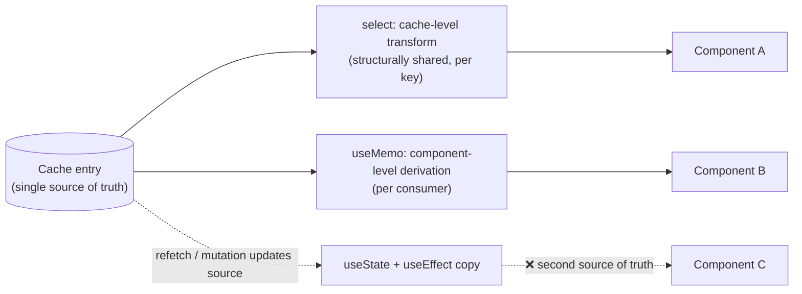

# Derived Server Data

> Every total, filtered list, and grouped summary computed from a server response is derived data. Compute it on read and it is always correct; copy it into state and you have created a second source of truth that will disagree with the first.

**Part:** [03 · Application Architecture](../) · **Domain:** Data & Server State · **Priority:** Critical · **Difficulty:** Intermediate · **Reading time:** ~12 min

## TL;DR

Derived server data is any value computed from cached server state: a sum, a sort, a filtered subset, a lookup index, a "3 of 12 complete" label. The rule is that it is *computed*, never *stored* — a copy in `useState` or in a store is a second source of truth that goes stale the moment the cache updates, and no synchronization effect makes that reliable. Compute during render, memoized on the inputs, so derivation is automatic and correctness is structural. Two things decide where the memo goes: whether the result is per-component or shared, and whether the derivation is cheap enough that memoizing costs more than it saves. Move the work to the server when it needs data the client does not hold, or when the input set is far larger than the output.

> **Recommendation:** Derive during render, never in state or an effect. Memoize with `select` (per-query, cache-level) or `useMemo` (per-component), keep the derivation pure, and return stable references. Push aggregation to the server when the input is much larger than the result.

## At a Glance

| | |
| --- | --- |
| **Use when** | A view needs a transformation of data the cache already holds — totals, sorts, filters, groupings, indexes. |
| **Avoid when** | The computation needs data the client doesn't have, or scans far more rows than it returns. |
| **Alternatives** | [Client-Side Relations](#alternative-approaches) (join instead of compute); server-side aggregation. |
| **Primary risk** | Copying derived values into state, and unmemoized derivations that break referential stability. |
| **Maturity** | Stable. |

## Prerequisites

- [Normalizing Server Responses](./normalizing-server-responses.md) — the stored shape derivation reads from, and the reason not to store computed values as entities.
- [Cache Keys & Query Identity](./cache-keys-and-query-identity.md) — the cache entry a derivation is a pure function of.

## Overview

*Derived server data* is a pure function of cached server state. `orders.filter(o => o.status === 'pending')`, `items.reduce((sum, i) => sum + i.total, 0)`, `new Map(customers.map(c => [c.id, c]))`, and `` `${done} of ${total} complete` `` are all derived. None of them is new information: each is a projection of data the client already has, and each can be recomputed from that data at any time.

That property is what makes storing them a mistake. A stored derived value must be updated whenever its inputs change, and the client does not control when its inputs change — a background refetch, a mutation result, or a cache invalidation can update the source at any moment. Every stored copy therefore needs synchronization, and every synchronization path is a chance to be stale. Deriving on read removes the problem by construction: there is one stored value, and everything else is a function of it.

The distinction to hold is derivation versus caching. A memoized derivation is not a second source of truth — it is a performance optimization whose value is discarded and recomputed when inputs change. A stored derived value survives its inputs changing. The first is safe at any scale; the second is the bug this article exists to prevent.

## The Problem

A checkout page loads a cart from the server and needs a total. The straightforward implementation puts the total in state and keeps it in sync:

the cart query returns items, an effect recomputes the total whenever items change, and the total renders from state. It works in development. Then three things happen. A background refetch updates the cart after a price change on the server; the effect runs one render *after* the items update, so for one frame the page shows new items with the old total. A mutation removes an item optimistically; the items update immediately but the effect's dependency array compares the array by reference, and because a memoized selector upstream returns a new array each render, the effect runs on every render — recomputing constantly and, on a large cart, dropping frames. Then someone adds a discount code feature that also writes to the total, and now two writers disagree.

Meanwhile a different problem appears in the orders table. A `select` transform sorts and filters the cached list, written inline in the hook call. Because the function is recreated every render, the transform re-runs on every render, and because it returns a fresh array, every consumer re-renders too — including a virtualized list that now recycles rows continuously. The data is correct; the app is slow, and the cause is invisible in the profiler unless you know to look for identity changes rather than value changes.

Both failures come from the same two decisions: where the derivation runs, and whether its result is referentially stable.

## Why It Matters

Correctness first. A stored derived value has a lifetime independent of its inputs, so any code path that updates the source without updating the copy produces a UI that contradicts itself — a total that does not match the line items, a count that does not match the list, a badge that says three when four rows are visible. These bugs are hard to reproduce because they depend on *when* the refetch landed relative to the render, and they multiply with the number of derived copies. Deriving on read makes them impossible rather than unlikely.

Performance is the second-order concern, and it cuts both ways. Derivation runs on every render unless memoized, so an expensive transform over thousands of rows can dominate a frame. But memoization is not free either: it costs a dependency comparison and retained memory, and applied to a trivial calculation it is pure overhead — an over-memoized codebase is slower to read and no faster to run. The important asymmetry is referential stability: an unmemoized derivation that returns a *new object* on every render defeats `React.memo`, `useEffect` dependency arrays, and virtualized row recycling, so its cost is paid by every downstream consumer rather than just the computation itself. That is why the guidance is not "memoize everything" but "memoize what is expensive or what must be referentially stable."

Finally, some derivations do not belong on the client at all. Computing a sum over a page of twenty rows is trivially client-side. Computing a sum over all matching orders when the client holds one page of them is impossible — the client would have to fetch the entire collection to derive one number, which is a payload cliff wearing the costume of a calculation.

## Mental Model

Picture a one-way pipeline: the cache entry is the source, derivations are pure functions over it, and components read the outputs. Nothing flows backwards, and nothing is stored along the way.



Two placement rules follow. `select` runs inside the query subscription, so the transform is applied where the data lives: the result is shared per key, structural sharing keeps unchanged parts referentially identical, and — importantly — the component only re-renders when the *selected* value changes, not when any part of the response does. That makes it the right home for a projection the whole app agrees on, and for narrowing a large response to a small slice.

`useMemo` runs in the component, so it is the right home for a derivation that depends on component state — the current sort column, a search box, a locale. Its cost is per consumer: three components deriving the same value from the same cache entry compute it three times, which is a signal to lift the derivation into `select` or a shared selector.

The third path in the diagram — copying into state and reconciling with an effect — is not a placement choice. It is a bug, and the presence of an effect whose only job is to keep one piece of state in agreement with another is the reliable symptom.

## Best Practices

Never copy server data, or anything derived from it, into state. If a value can be computed from the cache, compute it. An effect that synchronizes state with a query is the anti-pattern this rule exists to prevent.

Use `select` for shared, cache-level projections. Narrowing a large response, sorting into the canonical order, or building an index belongs in `select`, where it runs once per key, benefits from structural sharing, and prevents re-renders when unrelated fields change.

Keep `select` functions referentially stable. An inline arrow is recreated every render, so the transform re-runs each time. Define it at module scope, or wrap it in `useCallback` when it closes over props.

Use `useMemo` for derivations that depend on component state, and memoize on the narrowest inputs. Depend on the specific fields the computation reads, not the whole object, so unrelated changes do not invalidate the memo.

Don't memoize trivial work. A string concatenation, a comparison, or a sum over a handful of items is cheaper than the dependency check around it. Memoize when the input is large, the computation is real, or the result must be referentially stable.

Return stable references for objects and arrays. This is the reason to memoize even a cheap derivation: a new array identity each render invalidates every downstream memo, effect, and virtualized row.

Keep derivations pure and total. No fetching, no mutation, no `Date.now()`, no randomness — a derivation that reads the clock is not a function of its inputs and will produce hydration mismatches and stale memo results. Handle empty and partial inputs explicitly rather than assuming shape.

Derive from one source. A value computed from two independently fetched queries can be internally inconsistent if they were fetched at different times; if that matters, fetch them together or have the server compute it.

Push aggregation to the server when the input dwarfs the output. A count, a sum, or a top-N over a collection the client only partially holds must come from the server. The signal is fetching rows purely to reduce them to a number.

Test derivations directly. They are pure functions — the cheapest thing in the codebase to unit test, and the place where an off-by-one in a total actually gets caught.

## Trade-offs

Deriving on read trades some repeated computation for guaranteed consistency. The computation is almost always the cheaper side of that trade, and memoization bounds it; the exception is aggregation over data the client should not be holding at all.

**Advantages**

- One source of truth, so derived values cannot go stale.
- No synchronization code, and no effects that exist only to copy data.
- `select` narrows re-renders to the slice a component actually reads.
- Pure functions are trivially testable in isolation.

**Disadvantages**

- Recomputation on every render unless memoized.
- Memoization adds dependency-comparison cost and retained memory.
- Component-level derivations are duplicated across consumers.
- Client-side aggregation forces the client to hold data it otherwise would not need.

| Dimension | Derive on read | Store derived value |
| --- | --- | --- |
| Consistency | Structural — always matches the source | Requires synchronization; stale on any missed path |
| Code | A pure function | State, an updater, and an effect per copy |
| Render cost | Per render unless memoized | Read is free; writes must be maintained |
| Debuggability | One value to inspect; derivation is reproducible | Two values that can disagree, and a timing question |
| Scaling limit | Large inputs need memoization or the server | Grows worse with each additional writer |

## Alternative Approaches

Derivation answers "the value I need is a function of data I have." When that premise fails, the alternatives are to fetch the missing data or to have the server compute the value.

| Approach | Best when | Weakness | See |
| --- | --- | --- | --- |
| Derive on read (this article) | The inputs are already cached and the output is small | Recomputation cost; needs memoization at scale | (this article) |
| [Client-Side Relations](./client-side-relations.md) | The value needs another entity, not another computation | An extra round trip per relation | `Client-Side Relations · Data & Server State` |
| Server-side aggregation | The input set is far larger than the result | A round trip; a bespoke endpoint or query parameter | `API Design · Application Architecture` |
| Materialized field on the response | Every consumer needs the same computed value | Server must keep it consistent; grows the payload | [Normalizing Server Responses](./normalizing-server-responses.md) |

## Bad Example

A derived total copied into state and reconciled with an effect, plus an inline `select` that re-runs every render.

```tsx
import { useEffect, useMemo, useState } from 'react';
import { useQuery } from '@tanstack/react-query';

// ❌ Two independent failures, both common.
function Cart() {
  const { data: items } = useQuery({
    queryKey: ['cart'],
    queryFn: fetchCart,
  });

  // (1) A second source of truth for a value that is a pure function of `items`.
  const [total, setTotal] = useState(0);

  // (2) The effect runs AFTER render, so for one frame the page shows new
  //     items with the old total. Any refetch or optimistic update flashes
  //     an inconsistent state.
  useEffect(() => {
    if (!items) return;
    setTotal(items.reduce((sum, item) => sum + item.price * item.quantity, 0));
  }, [items]);

  // (3) A second writer for the same value: two code paths now disagree.
  const applyDiscount = (percent: number) => setTotal((t) => t * (1 - percent));

  return <Summary items={items ?? []} total={total} onDiscount={applyDiscount} />;
}

function OrdersTable() {
  const { data: rows } = useQuery({
    queryKey: ['orders'],
    queryFn: fetchOrders,
    // (4) Inline arrow: a new function identity every render, so the transform
    //     re-runs each time and returns a NEW array — defeating React.memo on
    //     every row and re-rendering virtualized children continuously.
    select: (orders) =>
      orders
        .filter((order) => order.status === 'pending')
        .sort((a, b) => a.createdAt.localeCompare(b.createdAt)),
  });

  // (5) Memo over the whole object when only one field is read: any unrelated
  //     change to `rows` invalidates it.
  const count = useMemo(() => rows?.length ?? 0, [rows]);

  return <Table rows={rows ?? []} count={count} />;
}
```

**What goes wrong:** The cart total is stored, so it lags its inputs by one render and can be written by two different code paths — the classic "total doesn't match the items" bug, and it only reproduces when a refetch lands at the wrong moment. `applyDiscount` mutating the derived total instead of the derivation's inputs makes the value unreproducible: refetch and the discount silently disappears. In the table, the inline `select` is recreated every render, so the sort and filter re-run continuously and hand every consumer a new array identity, which is precisely the change that makes memoized rows and virtualization useless.

## Good Example

Everything derived, memoized at the right level, with stable references and narrow dependencies.

```tsx
import { useCallback, useMemo, useState } from 'react';
import { useQuery } from '@tanstack/react-query';

interface CartItem {
  id: string;
  price: number;
  quantity: number;
}

interface CartTotals {
  subtotal: number;
  itemCount: number;
}

// ✅ Module scope: one stable identity, so `select` runs only when data changes.
function selectTotals(items: readonly CartItem[]): CartTotals {
  return {
    subtotal: items.reduce((sum, item) => sum + item.price * item.quantity, 0),
    itemCount: items.reduce((count, item) => count + item.quantity, 0),
  };
}

export function CartSummary({ discountPercent }: { discountPercent: number }) {
  // ✅ The derivation lives at the cache level: shared, and this component
  // re-renders only when the totals change — not when an item's label does.
  const { data: totals, isLoading } = useQuery({
    queryKey: ['cart'],
    queryFn: fetchCart,
    select: selectTotals,
  });

  if (isLoading || !totals) return <SummarySkeleton />;

  // ✅ The discount is derived too, from a prop and the source — never stored.
  const payable = totals.subtotal * (1 - discountPercent);

  return (
    <Summary
      itemCount={totals.itemCount}
      subtotal={totals.subtotal}
      payable={payable}
    />
  );
}

type SortKey = 'createdAt' | 'total';

export function OrdersTable() {
  const [sortKey, setSortKey] = useState<SortKey>('createdAt');
  const [search, setSearch] = useState('');

  const { data: orders = [], isLoading } = useQuery({
    queryKey: ['orders'],
    queryFn: fetchOrders,
  });

  // ✅ Depends on component state, so it belongs in the component — memoized
  // on the narrowest inputs, and returning one stable array per input set.
  const visible = useMemo(() => {
    const needle = search.trim().toLowerCase();
    const filtered = needle
      ? orders.filter((order) => order.reference.toLowerCase().includes(needle))
      : orders;
    // Copy before sorting: sort() mutates, and mutating cached data corrupts
    // the source of truth for every other consumer.
    return [...filtered].sort((a, b) =>
      sortKey === 'total' ? b.total - a.total : a.createdAt.localeCompare(b.createdAt),
    );
  }, [orders, search, sortKey]);

  // ✅ Not memoized: a length read is cheaper than a dependency comparison.
  const count = visible.length;

  const onSort = useCallback((key: SortKey) => setSortKey(key), []);

  if (isLoading) return <TableSkeleton />;

  return (
    <>
      <SearchInput value={search} onChange={setSearch} />
      <p aria-live="polite">{count} orders</p>
      <Table rows={visible} onSort={onSort} />
    </>
  );
}
```

**Why it's better:** No derived value is stored, so nothing can be stale and there is exactly one writer for the underlying data. `selectTotals` at module scope has a stable identity, so the transform runs when the cache changes rather than on every render, and the component re-renders only when the totals it selected actually change. The table's derivation depends on component state, so it stays in `useMemo` with narrow dependencies — and it copies before sorting, which matters because sorting a cached array in place mutates the source every other consumer reads. `count` is deliberately not memoized: memoizing a `.length` read costs more than it saves.

## Production Example

The important production judgment is *where* a derivation runs. This dashboard derives what it can from the page it already has, and asks the server for the aggregate it cannot compute from a page.

```tsx
import { useQuery } from '@tanstack/react-query';

interface Order {
  id: string;
  status: 'pending' | 'shipped' | 'cancelled';
  total: number;
}

interface OrdersPage {
  items: readonly Order[];
  hasNextPage: boolean;
}

interface PageInsights {
  pendingOnPage: number;
  pageValue: number;
  byStatus: ReadonlyMap<Order['status'], number>;
}

/**
 * ✅ Cheap, page-scoped derivations: computed from the page in hand, so they
 * cost nothing extra and cannot disagree with the rows being displayed.
 */
function selectPageInsights(page: OrdersPage): PageInsights {
  const byStatus = new Map<Order['status'], number>();
  let pendingOnPage = 0;
  let pageValue = 0;

  for (const order of page.items) {
    byStatus.set(order.status, (byStatus.get(order.status) ?? 0) + 1);
    if (order.status === 'pending') pendingOnPage += 1;
    if (order.status !== 'cancelled') pageValue += order.total;
  }

  return { pendingOnPage, pageValue, byStatus };
}

export function OrdersDashboard({ page }: { page: number }) {
  const insights = useQuery({
    queryKey: ['orders', 'list', { page }],
    queryFn: () => fetchOrdersPage(page),
    select: selectPageInsights,
    staleTime: 30_000,
  });

  /**
   * ✅ Totals across ALL orders cannot be derived from one page. Deriving them
   * client-side would mean fetching every order to reduce it to two numbers —
   * so the server computes it. Separate query, separate cache lifetime.
   */
  const totals = useQuery({
    queryKey: ['orders', 'stats'],
    queryFn: fetchOrderStats,
    staleTime: 60_000,
  });

  if (insights.isLoading) return <DashboardSkeleton />;
  if (insights.isError) {
    return <p role="alert">Couldn’t load orders: {insights.error.message}</p>;
  }

  return (
    <>
      <StatCard label="Pending on this page" value={insights.data.pendingOnPage} />
      <StatCard label="Value on this page" value={insights.data.pageValue} />

      {/* The global figure has its own loading and error state, because it is
          a separate request — not a derivation that can fail silently. */}
      <StatCard
        label="Pending (all orders)"
        value={totals.data?.pendingCount}
        state={totals.status}
      />
    </>
  );
}
```

Two judgments are worth naming. The page-scoped stats are labelled *on this page* — deriving from a page and presenting the result as a global figure is the most common way derived data lies, and honest labelling is part of the design, not a copy detail. And the global aggregate is a separate query with its own loading and error states, because a value that requires a round trip must be allowed to be pending or to fail; folding it into a derivation would hide that.

## Common Mistakes

See the [Data & Server State anti-patterns](../../../anti-patterns/README.md#data-server-state) for the domain catalog. Concept-specific:

### Mistake: Copying derived values into state

- **Symptom:** A total, count, or filtered list that briefly — or permanently — disagrees with the data it came from.
- **Why it fails:** The copy has its own lifetime; every path that updates the source must also update the copy, and effects run a render late.
- **Fix:** Delete the state and the effect; compute during render, memoized if needed.

### Mistake: Inline `select` functions

- **Symptom:** A transform that re-runs on every render, and consumers that re-render even when nothing changed.
- **Why it fails:** A new function identity each render means the library cannot reuse the previous result, and a new array identity invalidates every downstream memo.
- **Fix:** Define `select` at module scope, or wrap it in `useCallback` when it must close over props.

### Mistake: Mutating cached data while deriving

- **Symptom:** A sort in one component changes the order in another; data changes without a refetch.
- **Why it fails:** `sort()`, `reverse()`, and `splice()` mutate in place, and the array they mutate is the cache's own object.
- **Fix:** Copy before mutating (`[...items].sort(...)`), and treat cached data as read-only.

### Mistake: Memoizing everything

- **Symptom:** `useMemo` around string concatenations, comparisons, and single-field reads.
- **Why it fails:** The dependency comparison plus retained memory costs more than the computation, and the noise hides the memos that matter.
- **Fix:** Memoize expensive derivations and anything whose reference identity is consumed downstream; leave trivial reads alone.

### Mistake: Deriving an aggregate from a page

- **Symptom:** A "total revenue" figure that changes when the user pages, or a client that fetches every row to compute one number.
- **Why it fails:** The client holds a subset, so a client-side aggregate is an aggregate of the subset — regardless of the label above it.
- **Fix:** Ask the server for the aggregate, or label the derived value as page-scoped.

### Mistake: Impure derivations

- **Symptom:** Hydration mismatches, or a memoized value that never updates when it should.
- **Why it fails:** Reading `Date.now()`, randomness, or external mutable state makes the result depend on something outside the dependency list.
- **Fix:** Pass time and locale in as inputs so the derivation stays a function of its arguments.

## Checklist

- [ ] No derived value is stored in state or in a store.
- [ ] No effect exists purely to keep one value in agreement with another.
- [ ] Shared, cache-level projections use a module-scope `select`.
- [ ] Component-state-dependent derivations use `useMemo` with narrow dependencies.
- [ ] Derivations copy before sorting or reversing; cached data is treated as read-only.
- [ ] Objects and arrays crossing a memo boundary are referentially stable.
- [ ] Trivial computations are not memoized.
- [ ] Derivations are pure — no clock, no randomness, no side effects.
- [ ] Aggregates over data the client only partially holds come from the server, or are labelled as page-scoped.

## Related Articles

- [Normalizing Server Responses](./normalizing-server-responses.md) — why computed values should not be stored as entities.
- [Client-Side Relations](./client-side-relations.md) — when the value needs another entity rather than another computation.
- [Cache Keys & Query Identity](./cache-keys-and-query-identity.md) — the entry a derivation is a pure function of.
- [Background Refetching](./background-refetching.md) — the source updates that make stored derived values go stale.
- [List Virtualization](./list-virtualization.md) — why referential stability of derived rows matters for render cost.

## Related Examples

- [Stale-time configuration](../../../examples/stale-time-configuration.ts) — the refetch behavior that keeps derivations' inputs current.
- [Schema-inferred types](../../../examples/schema-inferred-types.ts) — typing the source a derivation reads from.

## References

- [TanStack Query — Render Optimizations (select)](https://tanstack.com/query/latest/docs/framework/react/guides/render-optimizations) — cache-level transforms, structural sharing, and re-render narrowing.
- [React — useMemo](https://react.dev/reference/react/useMemo) — when memoization pays for itself and when it does not.
