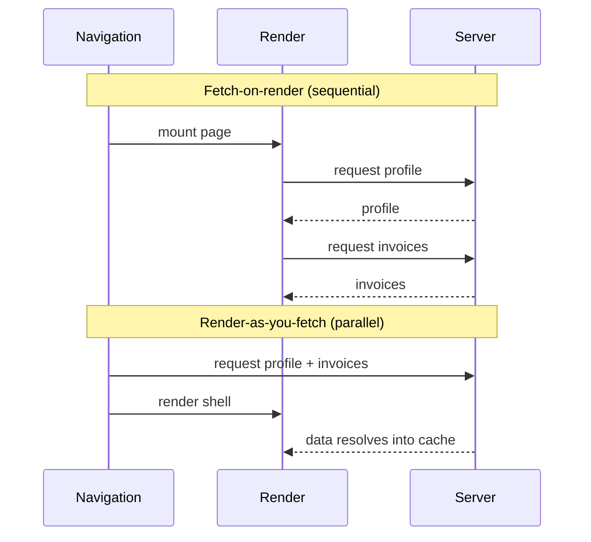

# Fetch-on-Render vs Render-as-You-Fetch

> Two fetching timings: start the request *after* a component renders, or start it *as* you navigate. The second removes a hidden round trip from every screen.

**Part:** [03 · Application Architecture](../) · **Domain:** Data & Server State · **Priority:** Critical · **Difficulty:** Intermediate · **Reading time:** ~15 min

## TL;DR

Fetch-on-render couples a request to a component's lifecycle: the component mounts, an effect runs, and only then does the fetch begin. That ordering forces the browser to render, discover the need for data, and wait — a waterfall you pay on every screen and, worse, once per nesting level. Render-as-you-fetch inverts the order: you start the request at the moment intent is known (a route match, a hover, a click) and render against the already-in-flight promise. The data and the UI load in parallel instead of in sequence.

> **Recommendation:** Start fetches at navigation, not in effects. Use a router loader or an imperative `prefetchQuery` on intent, and let components read from the cache. Reserve fetch-on-render for data whose need is genuinely undiscoverable until render.

## At a Glance

| | |
| --- | --- |
| **Use when** | You know what data a screen needs before it renders — route params, a clicked row, a hovered link. |
| **Avoid when** | The data need is truly dynamic and cannot be known until a component computes it mid-render. |
| **Alternatives** | None that solve the same problem; the axis is *timing*, and the two ends are the only two positions. |
| **Primary risk** | A request waterfall that scales with component nesting depth, invisible in dev and brutal on slow networks. |
| **Maturity** | Stable. |

## Prerequisites

- [HTTP semantics](../../00-foundations/networking-protocols/README.md) (`· Networking & Protocols`) — why an extra round trip costs what it costs.
- [Elements vs Components](../../02-rendering-frameworks/react/README.md) (`· React`) — what "render" means and when effects run.
- [Categories of State](../state-management/README.md) (`· State Management`) — why server data is not the same as client state.

## Overview

*Fetch-on-render* and *render-as-you-fetch* name **when** a data request starts relative to rendering, not **how** it is made. In fetch-on-render, the component renders first and its effect kicks off the request; the classic shape is a `useEffect` that calls `fetch`, or a `useQuery` whose enablement depends on props that only exist after mount. In render-as-you-fetch, the request is dispatched earlier — from a route loader, a click handler, or a prefetch on hover — so the component renders while the request is already traveling.

The distinction is easy to miss because both can use the same fetching library. The same `useQuery` call is fetch-on-render if the query only starts when the component mounts, and part of a render-as-you-fetch flow if the query was prefetched on the transition. The difference lives in the *scheduling*, and scheduling is where the latency hides.

## The Problem

Consider a dashboard: a page component renders a `<UserProfile>`, which renders an `<InvoiceList>`, which renders `<InvoiceRow>` items that each load a `<PaymentStatus>`. With fetch-on-render, each layer starts its request only after its parent has rendered and passed down the id it needs. The network timeline is a staircase: the profile request finishes, then the list request starts, then the rows render, then the status requests start. Four sequential round trips where the data had no real dependency between the first and the last.

On a fast office connection this staircase is invisible — each step is 30 ms and the whole thing feels instant. On a 4G phone at 150 ms round-trip time, the same four steps cost 600 ms of pure waiting, during which the screen shows spinners nested inside spinners. The code looks clean and colocated; the user experience is a slow reveal. This is the fetch-on-render waterfall, and it is the single most common performance defect in data-heavy React apps.

## Why It Matters

Perceived performance is dominated by when the *last* byte the user is waiting for arrives, and a waterfall stacks those waits end to end. Removing the waterfall does not make any single request faster — it makes them overlap, so the total wall-clock time collapses toward the slowest single request instead of the sum of all of them.

The cost is also structural, not just numeric. A fetch-on-render waterfall grows with your component tree: every new nested data-dependent component adds a step. Teams discover this the hard way when a screen that was fine with three levels of nesting becomes sluggish at six, and no single commit is to blame. Fixing the timing once — moving fetches to the navigation boundary — caps the depth of the waterfall regardless of how the tree grows, which is why this is an architectural decision and not a micro-optimization.

## Mental Model

Think of rendering and fetching as two workers who can either take turns or work at the same time. Fetch-on-render makes them take turns: the render worker finishes a layer, hands a note ("I need invoice 42") to the fetch worker, and waits; the fetch worker returns, and only then can the render worker start the next layer. Render-as-you-fetch lets them start together: the moment a navigation is known to be heading for the invoice screen, the fetch worker is dispatched, and the render worker builds the shell in parallel.



The practical lever is the same in every implementation: **move the start of the request earlier than the render that consumes it.** A router loader does this because the router knows the destination before the destination's components exist. A prefetch-on-hover does it because a hover is a strong signal of imminent navigation. Both turn "render, then discover, then fetch" into "fetch, then render into the result."

## Best Practices

Start data at the navigation boundary. If you use a router (TanStack Router, React Router), put the request in the route's loader so it fires the instant the route matches, before the component tree for that route mounts. The component then reads from the cache with `useQuery` and finds the data already present or in flight.

Prefetch on intent for interactions the router does not own. When a user hovers a link or focuses a row, call `queryClient.prefetchQuery` with the exact key the destination will read. The request overlaps the user's own reaction time — the few hundred milliseconds between intent and click are free latency budget.

Keep the read and the prefetch on identical keys. Render-as-you-fetch only works if the component's `useQuery` key matches the key you prefetched; a mismatch silently starts a second request and you are back to fetch-on-render with extra load. Centralize keys in a factory so the two sites cannot drift. This is the subject of [Cache Keys & Query Identity](./cache-keys-and-query-identity.md).

Fetch sibling data in parallel, not in sequence. Once you are fetching before render, request everything a screen needs at once rather than chaining. The mechanics of avoiding accidental chaining are covered in *Parallel vs Waterfall Requests* (planned — see the [Data & Server State index](./README.md)).

Fall back to fetch-on-render deliberately, not by default. Some data genuinely cannot be known until render — a value computed from other fetched data, for example. That is a legitimate waterfall; make it explicit and keep it shallow.

## Trade-offs

Render-as-you-fetch is the better default, but it moves knowledge of *what to fetch* out of the component that uses it and up to the navigation layer. That coupling is the price: the loader (or the prefetch site) has to know the query the screen will run.

**Advantages**

- Removes the render→fetch round trip and caps waterfall depth at the navigation boundary.
- Overlaps request latency with rendering and with user reaction time.
- Makes loading states intentional (you decide where to suspend) rather than emergent (a spinner per nested fetch).

**Disadvantages**

- The fetch declaration lives away from the component that reads it, so the two must be kept in sync.
- Prefetching on hover can start requests the user never completes, spending bandwidth on a guess.
- It requires a router or an explicit prefetch call; a component in isolation cannot do it alone.

| Dimension | Render-as-you-fetch | Cost / caveat |
| --- | --- | --- |
| Performance | Requests overlap render; waterfall depth is bounded | Speculative prefetch can waste requests |
| Complexity | Loading states are centralized and intentional | Fetch and read live in two places |
| Maintainability | One key factory keeps prefetch and read aligned | A key mismatch silently reintroduces the waterfall |
| Failure behavior | Errors surface at a known boundary | The loader must handle rejection, not just the component |

## Alternative Approaches

There is no substitute pattern here: the choice is a point on the *timing* axis, and fetch-on-render and render-as-you-fetch are its two ends. The real alternatives are the mechanisms you use to implement render-as-you-fetch — a router loader versus imperative prefetching — and those are complements, not competitors. `alternatives: []` in this article's metadata reflects that honestly.

## Bad Example

A profile page that fetches on render, then renders a child that fetches on render — the waterfall in miniature.

```tsx
import { useQuery } from '@tanstack/react-query';

// ❌ The invoice list query only starts after UserProfile has rendered and
// passed userId down, so profile and invoices load in sequence, not parallel.
function UserProfile({ userId }: { userId: string }) {
  const { data: user, isPending } = useQuery({
    queryKey: ['user', userId],
    queryFn: () => fetchUser(userId),
  });

  if (isPending) return <p>Loading profile…</p>;
  return (
    <section>
      <h1>{user.name}</h1>
      <InvoiceList userId={user.id} />
    </section>
  );
}

function InvoiceList({ userId }: { userId: string }) {
  // This request cannot begin until the parent above finished loading.
  const { data: invoices, isPending } = useQuery({
    queryKey: ['invoices', { userId }],
    queryFn: () => fetchInvoices(userId),
  });

  if (isPending) return <p>Loading invoices…</p>;
  return <ul>{invoices.map((invoice) => <li key={invoice.id}>{invoice.number}</li>)}</ul>;
}
```

**What goes wrong:** A request waterfall. `fetchInvoices` is gated behind `fetchUser` even though the invoice list only needs the `userId`, which the route already knew. On a high-latency connection the user watches two spinners resolve one after another.

## Good Example

Start both requests at the route boundary, then read them from the cache. The components no longer own the fetch timing.

```tsx
import {
  QueryClient,
  queryOptions,
  useSuspenseQuery,
} from '@tanstack/react-query';

// One source of truth for each query: the key and the fetcher travel together,
// so the loader and the component cannot request different things.
const userQuery = (userId: string) =>
  queryOptions({
    queryKey: ['user', userId],
    queryFn: ({ signal }) => fetchUser(userId, signal),
  });

const invoicesQuery = (userId: string) =>
  queryOptions({
    queryKey: ['invoices', { userId }],
    queryFn: ({ signal }) => fetchInvoices(userId, signal),
  });

// Router loader: runs when the route matches, before the components mount.
// Both requests are dispatched together — no render sits between them.
export async function profileLoader(queryClient: QueryClient, userId: string) {
  // ✅ Kick off in parallel and return once both are cached (or throw to the
  // route's errorElement). Prefetch never rejects; ensureQueryData does.
  await Promise.all([
    queryClient.ensureQueryData(userQuery(userId)),
    queryClient.ensureQueryData(invoicesQuery(userId)),
  ]);
}

function UserProfile({ userId }: { userId: string }) {
  // Data is already resolved by the loader; Suspense shows the route fallback
  // once, not a spinner per level.
  const { data: user } = useSuspenseQuery(userQuery(userId));
  const { data: invoices } = useSuspenseQuery(invoicesQuery(userId));

  return (
    <section>
      <h1>{user.name}</h1>
      <ul>
        {invoices.map((invoice) => (
          <li key={invoice.id}>{invoice.number}</li>
        ))}
      </ul>
    </section>
  );
}
```

**Why it's better:** The two requests leave the browser together from the loader, so their latencies overlap instead of stacking. The components read with `useSuspenseQuery` against the same `queryOptions` the loader warmed, guaranteeing a cache hit and a single, intentional loading boundary. Adding a third data dependency adds a request to the `Promise.all`, not a step to a staircase.

## Production Example

A route-integrated flow with prefetch-on-intent for the next screen. Hovering an invoice row warms its detail query so the click renders instantly, and the fetcher honors cancellation so abandoned navigations do not leak requests.

```tsx
import {
  QueryClient,
  queryOptions,
  useQueryClient,
  useSuspenseQuery,
} from '@tanstack/react-query';

interface Invoice {
  id: string;
  number: string;
  customer: string;
  amountCents: number;
  status: 'draft' | 'sent' | 'paid';
}

async function fetchInvoice(id: string, signal: AbortSignal): Promise<Invoice> {
  const response = await fetch(`/api/invoices/${id}`, { signal });
  if (!response.ok) {
    // Distinguish an expected 404 from an unexpected failure; both throw, but
    // the message lets the error boundary render the right thing.
    throw new Error(
      response.status === 404
        ? `Invoice ${id} not found`
        : `Failed to load invoice ${id} (${response.status})`,
    );
  }
  return (await response.json()) as Invoice;
}

const invoiceDetailQuery = (id: string) =>
  queryOptions({
    queryKey: ['invoices', 'detail', id],
    queryFn: ({ signal }) => fetchInvoice(id, signal),
    staleTime: 30_000,
  });

// Loader owns the initial fetch for the detail route.
export function invoiceDetailLoader(queryClient: QueryClient, id: string) {
  return queryClient.ensureQueryData(invoiceDetailQuery(id));
}

function InvoiceRow({ invoice }: { invoice: Invoice }) {
  const queryClient = useQueryClient();

  // Warm the detail cache during the user's reaction time. prefetchQuery is
  // fire-and-forget and dedupes against an existing in-flight request.
  function prefetchDetail() {
    void queryClient.prefetchQuery(invoiceDetailQuery(invoice.id));
  }

  return (
    <li>
      <a
        href={`/invoices/${invoice.id}`}
        onMouseEnter={prefetchDetail}
        onFocus={prefetchDetail}
      >
        {invoice.number} — {invoice.customer}
      </a>
    </li>
  );
}

function InvoiceDetail({ id }: { id: string }) {
  // Cache hit if the loader ran or the row was hovered; otherwise this fetches.
  const { data: invoice } = useSuspenseQuery(invoiceDetailQuery(id));
  return (
    <article>
      <h1>{invoice.number}</h1>
      <p>{invoice.customer}</p>
    </article>
  );
}

export { InvoiceRow, InvoiceDetail };
```

## Common Mistakes

See the [Data & Server State anti-patterns](../../../anti-patterns/README.md#data-server-state) for the domain catalog. The concept-specific mistakes:

### Mistake: Fetching in an effect that depends on a fetched prop

- **Symptom:** A child's `useQuery`/`useEffect` is gated on a prop that the parent only has after *its own* fetch resolves.
- **Why it fails:** It forces a sequential waterfall; latency scales with nesting depth and is invisible on fast networks.
- **Fix:** Hoist both fetches to the navigation boundary and dispatch them in parallel, as in the Good Example.

### Mistake: Prefetching with a different key than the component reads

- **Symptom:** You call `prefetchQuery(['invoice', id])` but the component reads `['invoices', 'detail', id]`.
- **Why it fails:** The prefetch warms a cache entry nobody reads; the component starts a fresh request, doubling load and reintroducing the waterfall.
- **Fix:** Derive both from one `queryOptions`/key factory. See [Cache Keys & Query Identity](./cache-keys-and-query-identity.md).

## Checklist

- [ ] Requests for a screen start at the route's loader or on an intent event, not in a mount effect.
- [ ] Sibling requests are dispatched in parallel (`Promise.all` / independent queries), not chained.
- [ ] The prefetch key and the component's read key come from one factory and are identical.
- [ ] Fetchers accept and honor an `AbortSignal` so abandoned navigations cancel.
- [ ] Any remaining fetch-on-render waterfall is intentional, shallow, and documented.

## Related Articles

- [Cache Keys & Query Identity](./cache-keys-and-query-identity.md) — the key discipline that makes prefetch and read line up.
- [Staleness & Revalidation](./staleness-and-revalidation.md) — how long a prefetched entry stays fresh before a background refetch.
- Alongside this sit *Parallel vs Waterfall Requests*, *Request Deduplication*, and *Data Prefetching* (planned — see the [Data & Server State index](./README.md)).

## Related Recipes

- [Paginated query with prefetch on intent](../../../recipes/paginated-query-with-prefetch.md) — a full list screen that warms the next page and the detail route.

## Related Examples

- [Render-as-you-fetch route loader](../../../examples/render-as-you-fetch-loader.tsx) — the minimal loader-plus-`useSuspenseQuery` shape.

## References

- [TanStack Query — Prefetching & Router Integration](https://tanstack.com/query/latest/docs/framework/react/guides/prefetching) — `prefetchQuery`, `ensureQueryData`, and loader patterns.
- [React — Suspense](https://react.dev/reference/react/Suspense) — where the loading boundary lands in render-as-you-fetch.
- [TanStack Router — Data Loading](https://tanstack.com/router/latest/docs/framework/react/guide/data-loading) — loaders as the navigation-time fetch boundary.
