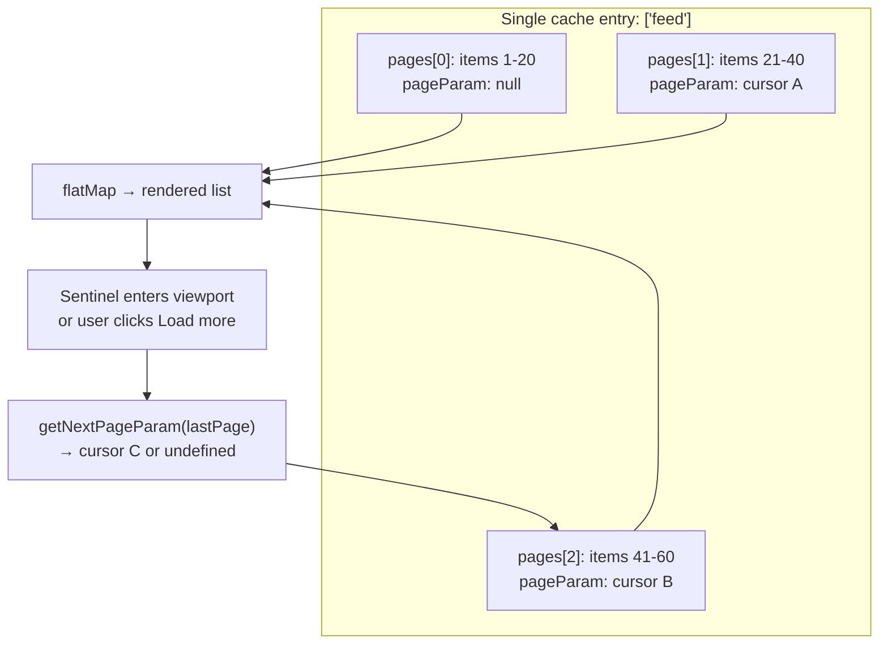

# Infinite & Cursor Loading

> One cache entry, many pages, appended forever. Infinite loading is the friendliest reading experience and the least friendly cache shape — every mutation, every scroll restore, and every screen reader has to cope with a list that has no end.

**Part:** [03 · Application Architecture](../) · **Domain:** Data & Server State · **Priority:** Critical · **Difficulty:** Intermediate · **Reading time:** ~12 min

## TL;DR

Infinite loading presents a paginated collection as one continuously growing list: each fetch appends a page of items instead of replacing the view. The cache entry is no longer a page but an ordered array of pages plus the cursor needed to request the next one, which is why libraries model it separately (`useInfiniteQuery`) rather than as a normal query. Cursors are effectively mandatory here — offsets shift under concurrent writes, and in an append-only list that shows up as duplicated items rather than a page boundary glitch. The costs are real: memory grows without bound, mutations must reach into a nested page structure, footers become unreachable, and "load more" must remain operable by keyboard.

> **Recommendation:** Use cursor-based `useInfiniteQuery` for feed-like browsing; keep an actual `<button>` for "load more" and let an `IntersectionObserver` click it automatically rather than replacing it. Cap retained pages or virtualize once lists exceed a few hundred rows, and never put required navigation in the footer.

## At a Glance

| | |
| --- | --- |
| **Use when** | Users browse or scan a feed with no fixed destination — timelines, activity logs, search results, chat history. |
| **Avoid when** | Users need to reach a specific record, compare pages, share a position, or the page has a footer that matters. |
| **Alternatives** | [Pagination](#alternative-approaches) (discrete, addressable pages); [List Virtualization](#alternative-approaches) (render cost, not fetch strategy). |
| **Primary risk** | Unbounded memory and DOM growth, plus mutation and scroll-restoration complexity. |
| **Maturity** | Stable. |

## Prerequisites

- [Pagination](./pagination.md) — cursors, page keys, and why offsets drift; infinite loading inherits all of it.
- [Mutation Lifecycle](./mutation-lifecycle.md) — writing into a nested page array is the hard part of infinite lists.

## Overview

*Infinite loading* is a presentation of cursor pagination in which pages accumulate. The client fetches page 1, renders its items, and when the user asks for more — by clicking a button or by scrolling a sentinel into view — fetches the next page using the cursor the server returned and appends its items to the rendered list. Nothing is replaced; the list only grows.

The consequence that shapes everything else is the cache shape. A paginated query caches one page per key: `['orders', { page: 3 }]` holds twenty rows. An infinite query caches *all loaded pages under one key*: `['feed']` holds `{ pages: [page1, page2, page3], pageParams: [null, cursor1, cursor2] }`. That single-entry, many-pages structure is what makes appending cheap and everything else harder. Reading requires flattening; writing requires knowing which page an item lives in; invalidating refetches every loaded page in sequence, not one. It is a genuinely different data structure, and treating it like a normal query — mutating a flat array, invalidating casually — is where most infinite-list bugs come from.

## The Problem

A social feed loads 20 posts and appends 20 more as the user scrolls. Four problems arrive in roughly this order.

Posts appear twice. The feed pages by offset, and the feed is by definition write-heavy, so by the time page 2 is requested, new posts have shifted the window — items from page 1 reappear in page 2. In a paginated table this is a visible page-boundary oddity; in an append-only list it is the same post rendered twice on screen, five rows apart, which users report as a bug within minutes. React then warns about duplicate keys, and any keyed animation misbehaves.

Liking a post refetches everything. The mutation invalidates the feed key, and because the cache entry contains all loaded pages, invalidation refetches all of them — sequentially, cursor by cursor. Twelve pages in, one like triggers twelve requests and the scroll position jumps.

The tab becomes slow. Two thousand posts are in the DOM with their images and event handlers, memory climbs past a gigabyte, and scrolling stutters. Nothing was ever released, because nothing in an infinite list ever unmounts.

And the footer is unreachable. The privacy policy and settings links live below the feed, and the feed never ends — every attempt to reach the footer loads more content and pushes it further away. Keyboard users have it worse: tabbing through a growing list with a scroll-triggered loader has no exit.

## Why It Matters

For browsing, this is the right interaction model. Scanning a timeline is a continuous activity, and forcing it into numbered pages adds a decision the user does not want to make. Cursor-based appending is also the only scheme that stays correct on a live collection: items do not shift under the reader, and each request is an indexed seek rather than a deepening scan, so page 40 costs the server what page 1 did. That combination — natural interaction plus flat cost at depth — is why feeds converge on this pattern.

The costs are equally structural, and they are the reason it should not be the default for every list. Memory and DOM size grow monotonically with session length, which on low-end mobile devices ends in a crash rather than a slowdown. There is no way to link, bookmark, or return to a position, so "I saw it halfway down yesterday" is unrecoverable. Mutation logic must operate on nested pages, which is more code and more edge cases than updating one page's array. And there is an accessibility dimension that is not optional: content that appends on scroll without an explicit control is difficult to operate by keyboard, unannounced to screen readers, and disorienting under magnification, while an infinite list makes anything positioned after it effectively unreachable. Pick this pattern for browsing, and pay these costs deliberately.

## Mental Model

Hold two structures in mind: the cache entry (an array of pages plus their cursors) and the rendered list (the flattened concatenation of those pages). Every read flattens; every write has to target a page.



Three implications follow. First, `getNextPageParam` returning `undefined` is the *only* signal that the list has ended — that is what sets `hasNextPage`, and returning a non-`undefined` value unconditionally produces an infinite loop of empty pages. Second, invalidation is expensive by construction: refetching the entry means refetching every loaded page, in order, because each page's cursor comes from the previous response. Prefer surgical cache updates over invalidation for common mutations. Third, "load more" is one request with three distinguishable states — `isFetchingNextPage` (appending), `isFetching` (also true when refetching earlier pages), and `isLoading` (the genuine first load) — and rendering the wrong one is how a spinner ends up replacing a list the user was reading.

## Best Practices

Use cursors, not offsets. In an append-only list, offset drift produces visibly duplicated items and duplicate React keys. If the API only offers offsets, deduplicate by ID on flatten as a stopgap and treat the API as a defect to fix.

Return `undefined` from `getNextPageParam` at the end, and derive the control from `hasNextPage`. Never infer "there is more" from a full page — a collection whose size is a multiple of the page size would loop forever on an empty final request.

Keep a real button, and let the observer press it. Render `<button onClick={fetchNextPage}>Load more</button>` and have an `IntersectionObserver` on a sentinel invoke the same handler. Keyboard and assistive-technology users get an operable control; everyone else gets automatic loading; and there is exactly one code path.

Distinguish `isFetchingNextPage` from `isLoading`. The append spinner belongs at the *bottom* of the list while the existing items stay put; the skeleton belongs only to the first load. Announce appended counts with a polite live region so screen reader users know more content arrived.

Bound what you retain. TanStack Query's `maxPages` drops pages from the far end, keeping memory flat during long sessions; beyond a few hundred rows, combine with virtualization so DOM size stops tracking item count.

Update the cache surgically for common mutations. `setQueryData` mapping over `pages` — updating the one item in the one page — is far cheaper than invalidating an entry that refetches twelve pages and disturbs scroll position. Reserve invalidation for structural changes.

Guard against duplicate requests. `fetchNextPage` while `isFetchingNextPage` is already true wastes a request; check the flag, and disconnect or re-arm the observer around each fetch.

Never place required content after an infinite list. Move footer navigation into the header or a sidebar, or use a "load more" button so the list has a reachable bottom. If both a footer and endless content are requirements, the pattern is wrong for the page.

Keep a stable, total sort order. Cursors are anchored to a sort position, so ties without a unique tiebreaker make the anchor ambiguous and pages overlap.

## Trade-offs

Infinite loading trades addressability, bounded memory, and mutation simplicity for a reading experience with no interruptions. That is a good trade for feeds and a poor one for tables, and the deciding question is whether users *browse* the collection or *look things up in* it.

**Advantages**

- Continuous reading with no pagination decision to make.
- Cursor-anchored pages stay correct on a live, write-heavy collection.
- Server cost is flat at depth: an indexed seek rather than a deepening scan.
- Appending never disturbs already-rendered content.

**Disadvantages**

- Memory and DOM grow monotonically; long sessions degrade and can crash low-end devices.
- No shareable, bookmarkable, or restorable position.
- Mutations and invalidation operate on a nested page array — more code, more edge cases.
- Footer content becomes unreachable; scroll-triggered loading is an accessibility hazard if not paired with a control.

| Dimension | Infinite loading | Cost / caveat |
| --- | --- | --- |
| Performance | Flat server cost per page; no re-render of loaded items | Client memory and DOM grow without bound unless capped |
| Complexity | Library handles the page array | Mutations, scroll restoration, and observer lifecycle are manual |
| Maintainability | One key for the whole list | Every cache write must know page structure |
| Failure behavior | A failed page leaves earlier pages intact | Invalidation refetches every loaded page, sequentially |
| Accessibility | Fine *with* an explicit control | Scroll-only loading traps keyboard users and hides the footer |

## Alternative Approaches

Infinite loading, discrete pagination, and virtualization are often discussed together but solve different problems: how much you fetch, how it is addressed, and how much you render.

| Approach | Best when | Weakness | See |
| --- | --- | --- | --- |
| Infinite loading (this article) | Browsing a feed with no fixed destination | No addressable position; unbounded growth | (this article) |
| [Pagination](./pagination.md) | Users look up, compare, or link specific records | Interrupts continuous reading | `Pagination · Data & Server State` |
| [List Virtualization](./list-virtualization.md) | Thousands of rows already in memory are the bottleneck | Doesn’t change fetching at all; complicates measurement | `List Virtualization · Data & Server State` |
| Load-more button only | Feeds that must keep a reachable footer | One extra click per page | (this article) |

## Bad Example

Offset-based appending, scroll-only loading, "more" inferred from page size, and a spinner that replaces the whole feed.

```tsx
import { useEffect, useState } from 'react';

// ❌ A hand-rolled infinite list with five defects.
function Feed() {
  const [posts, setPosts] = useState<Post[]>([]);
  const [page, setPage] = useState(0);
  const [loading, setLoading] = useState(false);

  useEffect(() => {
    setLoading(true);
    // (1) Offset paging on a live feed: new posts shift the window, so items
    //     from page N reappear in page N+1 — visible duplicates, duplicate keys.
    fetch(`/api/feed?offset=${page * 20}&limit=20`)
      .then((r) => r.json())
      .then((newPosts: Post[]) => {
        // (2) No dedupe and no cancellation: two in-flight pages can interleave
        //     and append out of order.
        setPosts((current) => [...current, ...newPosts]);
        setLoading(false);
      });
  }, [page]);

  useEffect(() => {
    const onScroll = () => {
      // (3) Scroll-only loading: no button, so keyboard users cannot load more
      //     and the footer below is permanently unreachable.
      if (window.innerHeight + window.scrollY >= document.body.offsetHeight - 200) {
        setPage((p) => p + 1); // (4) No hasMore check: requests empty pages forever.
      }
    };
    window.addEventListener('scroll', onScroll);
    return () => window.removeEventListener('scroll', onScroll);
  }, []);

  // (5) One loading flag for first load AND appends: the feed the user is
  //     reading is replaced by a spinner on every page.
  if (loading) return <Spinner />;

  return <ul>{posts.map((p) => <PostCard key={p.id} post={p} />)}</ul>;
}
```

**What goes wrong:** Offset paging on a live feed duplicates posts, which React reports as duplicate keys and users report as a bug. Scroll-only loading has no keyboard path and makes the footer unreachable; with no end condition, the app requests empty pages indefinitely, and a fast scroll fires several overlapping requests that append out of order. Finally, the single `loading` flag unmounts the entire list on every append — the worst possible rendering of a "load more."

## Good Example

A cursor-based infinite query with an operable control, an observer that presses it, a correct end condition, and bounded retention.

```tsx
import { useCallback, useEffect, useRef } from 'react';
import { useInfiniteQuery } from '@tanstack/react-query';

interface Post {
  id: string;
  body: string;
  likes: number;
}

interface FeedPage {
  items: readonly Post[];
  /** null when there is nothing after this page. */
  nextCursor: string | null;
}

async function fetchFeedPage(
  cursor: string | null,
  signal: AbortSignal,
): Promise<FeedPage> {
  const params = new URLSearchParams({ limit: '20' });
  if (cursor) params.set('after', cursor);

  const response = await fetch(`/api/feed?${params}`, { signal });
  if (!response.ok) {
    throw new Error(`Failed to load feed (${response.status})`);
  }
  return (await response.json()) as FeedPage;
}

export const feedKeys = { list: () => ['feed', 'list'] as const };

export function Feed() {
  const {
    data,
    error,
    isLoading,
    isError,
    hasNextPage,
    isFetchingNextPage,
    fetchNextPage,
  } = useInfiniteQuery({
    queryKey: feedKeys.list(),
    queryFn: ({ pageParam, signal }) => fetchFeedPage(pageParam, signal),
    initialPageParam: null as string | null,
    // ✅ undefined ends the list. Derived from the server's answer, never
    // guessed from page length.
    getNextPageParam: (lastPage) => lastPage.nextCursor ?? undefined,
    // ✅ Bound retention so a long session doesn't grow without limit.
    maxPages: 10,
    staleTime: 60_000,
  });

  // ✅ One handler, guarded against overlapping requests.
  const loadMore = useCallback(() => {
    if (hasNextPage && !isFetchingNextPage) {
      void fetchNextPage();
    }
  }, [hasNextPage, isFetchingNextPage, fetchNextPage]);

  const sentinel = useRef<HTMLDivElement | null>(null);
  useEffect(() => {
    const node = sentinel.current;
    if (!node || !hasNextPage) return;

    // ✅ The observer presses the same button a user would — no second code path.
    const observer = new IntersectionObserver(
      (entries) => {
        if (entries[0]?.isIntersecting) loadMore();
      },
      { rootMargin: '400px' },
    );
    observer.observe(node);
    return () => observer.disconnect();
  }, [hasNextPage, loadMore]);

  if (isLoading) return <FeedSkeleton />;
  if (isError) return <p role="alert">Couldn’t load the feed: {error.message}</p>;

  const posts = data.pages.flatMap((page) => page.items);

  return (
    <>
      <ul>
        {posts.map((post) => (
          <PostCard key={post.id} post={post} />
        ))}
      </ul>

      {/* ✅ Politely announce growth instead of leaving it silent. */}
      <p aria-live="polite" className="visually-hidden">
        Showing {posts.length} posts
      </p>

      <div ref={sentinel} aria-hidden="true" />

      {/* ✅ A real, focusable control — the observer is an enhancement. */}
      {hasNextPage ? (
        <button type="button" onClick={loadMore} disabled={isFetchingNextPage}>
          {isFetchingNextPage ? 'Loading…' : 'Load more'}
        </button>
      ) : (
        <p>You’re all caught up.</p>
      )}
    </>
  );
}
```

**Why it's better:** Cursors remove the duplicate-item failure mode entirely. `getNextPageParam` derives the end from the server's `nextCursor`, so the list terminates and `hasNextPage` drives both the button and the observer. The append spinner lives in the button while the list stays rendered, and `isLoading` is reserved for the first load. `maxPages` keeps memory flat, the guarded handler prevents overlapping fetches, and because the observer just calls the button's handler, keyboard users are never stranded.

## Production Example

The hard part in production is mutating a nested page array. Updating one item in place is far cheaper than invalidating an entry that would refetch every loaded page — and it keeps scroll position intact.

```tsx
import { useMutation, useQueryClient, type InfiniteData } from '@tanstack/react-query';
import { feedKeys } from './feed';

interface FeedPage {
  items: readonly Post[];
  nextCursor: string | null;
}

async function likePost(postId: string): Promise<Post> {
  const response = await fetch(`/api/posts/${postId}/like`, { method: 'POST' });
  if (!response.ok) {
    throw new Error(`Failed to like post (${response.status})`);
  }
  return (await response.json()) as Post;
}

export function useLikePost() {
  const queryClient = useQueryClient();

  return useMutation({
    mutationFn: likePost,

    onMutate: async (postId: string) => {
      await queryClient.cancelQueries({ queryKey: feedKeys.list() });
      const previous = queryClient.getQueryData<InfiniteData<FeedPage>>(
        feedKeys.list(),
      );

      // ✅ Map over pages, not over a flat array: the cache entry IS
      // { pages, pageParams }, and replacing it with an array corrupts it.
      queryClient.setQueryData<InfiniteData<FeedPage>>(feedKeys.list(), (current) =>
        current
          ? {
              ...current,
              pages: current.pages.map((page) => ({
                ...page,
                items: page.items.map((post) =>
                  post.id === postId ? { ...post, likes: post.likes + 1 } : post,
                ),
              })),
            }
          : current,
      );

      return { previous };
    },

    onError: (_error, _postId, context) => {
      // Restore the exact prior structure, pageParams included.
      if (context?.previous) {
        queryClient.setQueryData(feedKeys.list(), context.previous);
      }
    },

    onSuccess: (serverPost) => {
      // ✅ Reconcile with the server's value without refetching 10 pages.
      queryClient.setQueryData<InfiniteData<FeedPage>>(feedKeys.list(), (current) =>
        current
          ? {
              ...current,
              pages: current.pages.map((page) => ({
                ...page,
                items: page.items.map((post) =>
                  post.id === serverPost.id ? serverPost : post,
                ),
              })),
            }
          : current,
      );
    },
  });
}
```

Note what is deliberately *not* here: `invalidateQueries`. Invalidating an infinite entry refetches every loaded page in sequence — ten requests for one like — and the refetch can shift content under the reader. Surgical updates are the norm for item-level mutations in infinite lists; save invalidation for changes that alter the list's membership or order, and even then consider resetting to the first page instead.

## Common Mistakes

See the [Data & Server State anti-patterns](../../../anti-patterns/README.md#data-server-state) for the domain catalog. Concept-specific:

### Mistake: Inferring `hasNextPage` from page length

- **Symptom:** The list keeps requesting pages after the end, returning empty arrays forever.
- **Why it fails:** A collection whose size is an exact multiple of the page size always yields a "full" last page, so the heuristic never terminates.
- **Fix:** Return `undefined` from `getNextPageParam` based on a server-provided `nextCursor`/`hasNextPage`.

### Mistake: Scroll-triggered loading with no button

- **Symptom:** Keyboard users cannot load more; the footer below the list is unreachable.
- **Why it fails:** Scroll position is not an operable control, so there is no non-pointer path to the action and no bottom to the page.
- **Fix:** Render a focusable "Load more" button and have the observer invoke its handler.

### Mistake: Treating the cache entry as a flat array

- **Symptom:** `setQueryData` writes an array and the list breaks — pagination stops or the entry is unusable.
- **Why it fails:** An infinite entry is `{ pages, pageParams }`; overwriting it with a flat array destroys the cursors needed to fetch further pages.
- **Fix:** Map over `pages` and preserve `pageParams`, as in the production example above.

### Mistake: Invalidating the infinite key for item-level updates

- **Symptom:** One like or edit triggers a cascade of requests and the scroll position jumps.
- **Why it fails:** Refetching the entry refetches every loaded page sequentially, because each page's cursor comes from the previous response.
- **Fix:** Update the specific item with `setQueryData`; reserve invalidation for membership or ordering changes.

### Mistake: Retaining every page forever

- **Symptom:** Memory climbs through a long session; scrolling stutters and low-end devices crash.
- **Why it fails:** Nothing unmounts in an append-only list, so DOM nodes, images, and handlers accumulate for the session's lifetime.
- **Fix:** Set `maxPages`, and virtualize the rendered rows past a few hundred items.

## Checklist

- [ ] Pages are cursor-based, with a stable total sort order including a unique tiebreaker.
- [ ] `getNextPageParam` returns `undefined` at the end, from a server-provided signal.
- [ ] A focusable "Load more" button exists; the `IntersectionObserver` calls its handler.
- [ ] `isFetchingNextPage` renders an append indicator; `isLoading` renders the first-load skeleton.
- [ ] Growth is announced through a polite live region.
- [ ] Retention is bounded (`maxPages`) and long lists are virtualized.
- [ ] Item-level mutations use `setQueryData` over `pages`, not `invalidateQueries`.
- [ ] No required navigation or content sits after the infinite list.

## Related Articles

- [Pagination](./pagination.md) — cursors, page keys, and the addressable alternative.
- [Optimistic Updates](./optimistic-updates.md) — the update pattern this article applies to a nested page array.
- [Cache Invalidation](./cache-invalidation.md) — why invalidating an infinite entry is expensive and when it's still right.
- [Data Prefetching](./data-prefetching.md) — warming the next page before the sentinel is reached.
- [List Virtualization](./list-virtualization.md) — bounding render cost once thousands of rows are loaded.

## Related Recipes

- [Optimistic list mutation](../../../recipes/optimistic-list-mutation.md) — the snapshot-and-rollback shape adapted here to `pages`.

## Related Examples

- [Optimistic update with rollback](../../../examples/optimistic-update-with-rollback.tsx) — the cancel/snapshot/restore baseline the page-mapping version extends.

## References

- [TanStack Query — Infinite Queries](https://tanstack.com/query/latest/docs/framework/react/guides/infinite-queries) — `pages`/`pageParams`, `getNextPageParam`, and `maxPages`.
- [MDN — IntersectionObserver](https://developer.mozilla.org/en-US/docs/Web/API/IntersectionObserver) — the sentinel mechanism, including `rootMargin` for early loading.
