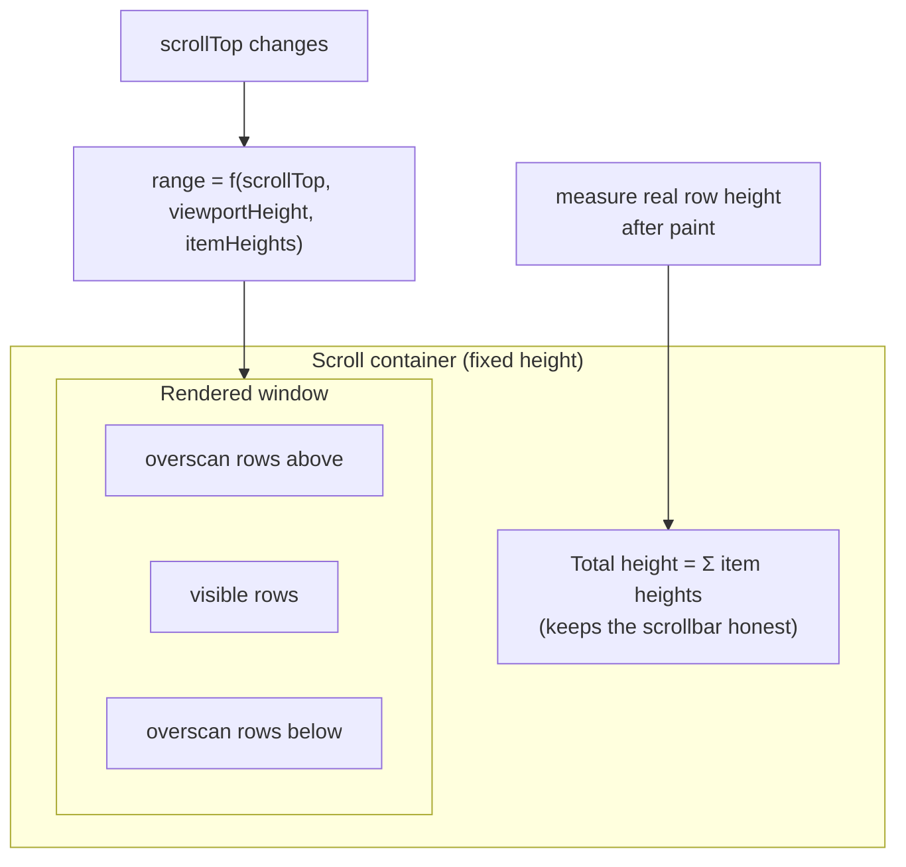

# List Virtualization

> Ten thousand rows in memory is a data problem; ten thousand rows in the DOM is a rendering problem. Virtualization solves only the second one — and charges you in measurement, find-on-page, and accessibility for the privilege.

**Part:** [03 · Application Architecture](../) · **Domain:** Data & Server State · **Priority:** Critical · **Difficulty:** Intermediate · **Reading time:** ~12 min

## TL;DR

List virtualization — also called windowed rendering or virtual scrolling — renders only the rows currently visible in a scroll container, plus a small buffer, while a sized spacer preserves the scrollbar as if every row were present. DOM node count becomes a function of viewport height rather than data length, so scroll performance stops degrading as the collection grows. It is a *rendering* optimization and changes nothing about fetching: you still need pagination or infinite loading to get the rows. The costs are concentrated in row measurement (dynamic heights are the hard case), and in the platform features that assume content is in the DOM — find-on-page, anchor links, and assistive technology.

> **Recommendation:** Don't virtualize below a few hundred rows; try `content-visibility: auto` first. Above that, use a maintained virtualizer, keep the scroll container's height explicit, set a modest overscan, and add the row/index semantics screen readers need. Never virtualize content users expect to find with the browser's own search.

## At a Glance

| | |
| --- | --- |
| **Use when** | Hundreds or thousands of rows are in memory at once and scrolling or interaction has measurably degraded. |
| **Avoid when** | The list is short, rows must be findable via browser search, or the page prints/exports. |
| **Alternatives** | [Infinite & Cursor Loading](#alternative-approaches) (fetch less); [Pagination](#alternative-approaches) (render less by bounding the set); `content-visibility: auto` (let the browser skip offscreen work). |
| **Primary risk** | Broken accessibility semantics and find-on-page, plus layout jump from mismeasured dynamic rows. |
| **Maturity** | Stable. |

## Prerequisites

- [Pagination](./pagination.md) — how the rows arrive; virtualization assumes they are already in memory.
- [Infinite & Cursor Loading](./infinite-and-cursor-loading.md) — the growth pattern that makes DOM size a problem in the first place.

## Overview

*List virtualization* keeps the rendered subset of a list proportional to the viewport instead of the data. The virtualizer tracks the scroll offset, computes which item indices intersect the visible window, renders those (plus an overscan buffer above and below), and absolutely positions them inside a container whose total height equals the sum of all item heights. The scrollbar behaves normally because the container is the right size; the DOM stays small because only a window of rows exists.

Two boundaries are worth drawing. First, virtualization is orthogonal to fetching: it does not reduce payloads, requests, or memory held by your cache — [Pagination](./pagination.md) and [Infinite & Cursor Loading](./infinite-and-cursor-loading.md) do that. A virtualized list over ten thousand cached rows still holds ten thousand objects in JavaScript memory. Second, the platform now offers a partial alternative. `content-visibility: auto` lets the browser skip layout, paint, and rendering work for offscreen elements while keeping them in the DOM — cheaper to adopt, keeps find-on-page working, but it does not reduce node count, so it helps rendering cost without helping memory or event-handler overhead.

## The Problem

An analytics table renders 5,000 rows, each with eight cells, a status badge, and a row menu. That is roughly 60,000 DOM nodes with 5,000 event handlers attached. Initial layout takes over a second, scrolling drops frames because every scroll triggers style recalculation across a huge tree, and each state change re-renders a tree React needs milliseconds just to reconcile. On a mid-range laptop the page is sluggish; on a low-end phone the tab is killed.

The team reaches for a virtualizer and hits the second-order problems. Rows have variable height — some descriptions wrap to three lines — so with a fixed estimated height the scrollbar length is wrong and the list visibly jumps as real heights are measured during scroll. Then support tickets arrive: users press <kbd>Ctrl</kbd>+<kbd>F</kbd> to find an order number and the browser reports no matches, because the row is not in the DOM. A screen reader user hears "row 12 of 12" because only twelve rows exist. And the "select all" checkbox now only selects the visible rows, since the code iterated over rendered children instead of the data.

None of these are bugs in the virtualizer. They are the intrinsic cost of the technique, and they are the reason it should be the last optimization tried rather than the first.

## Why It Matters

DOM size is one of the few frontend costs that is superlinear in practice. Style recalculation, layout, and paint all scale with node count; memory scales with nodes plus handlers; and framework reconciliation scales with the rendered tree. Past a few thousand nodes, every interaction on the page — not just scrolling the list — gets slower, which is why a heavy table degrades the whole route. Virtualization decouples that cost from the data, so a list of ten rows and a list of a million cost the same to render. For data-dense tools such as spreadsheets, log viewers, and admin tables, it is the difference between usable and unusable.

The reason to hold it at arm's length is that virtualization breaks the assumption almost every other web feature is built on: that content in the page is in the DOM. Find-on-page, `#anchor` navigation, print, "select all", text selection across rows, extensions, and assistive technology all rely on it. Each has a workaround — a search field of your own, `aria-rowcount`, a print-specific render path — but the workarounds are work, and skipping them ships a list that is fast for sighted mouse users and hostile to everyone else. That trade is only worth making when the performance problem is real and measured.

## Mental Model

Think of a fixed-size viewport sliding over an index range, with a spacer standing in for the rows you are not rendering. The virtualizer needs three inputs: the scroll offset, the viewport height, and each item's height (known or estimated). From those it computes a visible index range, widens it by the overscan, and renders exactly those items.



Everything hard about virtualization lives in `itemHeights`. When rows are a known fixed height, the math is exact and the experience is flawless. When heights vary, the virtualizer starts from an estimate and corrects it after measuring rendered rows — so total height, and therefore scrollbar position, is approximate until enough rows have been seen. A bad estimate produces the characteristic symptom: the scroll thumb jumping or the list shifting as you scroll. Give the estimate a realistic value, measure real rows with a `ResizeObserver`, and keep row heights independent of viewport width where you can.

## Best Practices

Measure before virtualizing. Profile the actual scroll and interaction cost first. If the list is under a few hundred simple rows, virtualization is likely to add more complexity than performance.

Try the platform first. `content-visibility: auto` with a `contain-intrinsic-size` hint gets much of the rendering benefit for one CSS declaration, keeps find-on-page and accessibility intact, and can be removed as easily as it was added. Reach for a virtualizer when node count itself — memory, handlers, reconciliation — is the problem.

Use a maintained virtualizer, not a hand-rolled one. Scroll anchoring, sub-pixel rounding, dynamic measurement, sticky rows, horizontal ranges, and browser scroll quirks are a deep well of edge cases. A library such as TanStack Virtual encodes them.

Give the scroll container an explicit height and let it own the scrolling. Virtualization needs a bounded viewport to compute a range. Virtualizing against the window scroll is possible but harder; a `height`/`max-height` container with `overflow: auto` is the reliable shape.

Estimate row height realistically, then measure. Pick an estimate close to the common case and attach a measurement callback so real heights replace estimates. Avoid content whose height depends on container width if you can, since resizing invalidates every measurement.

Keep overscan small. Two to five rows above and below smooths scrolling without inflating the DOM. Large overscan values quietly undo the optimization.

Derive selection, counts, and "select all" from the data, never from rendered rows. Any logic that walks the DOM will silently operate on the window instead of the collection.

Provide the semantics the DOM no longer implies. On a virtualized table use `role="grid"` with `aria-rowcount` on the container and `aria-rowindex` on each row so assistive technology reports the true position; expose an application-level search or filter, since find-on-page cannot see unrendered rows.

Manage focus explicitly. A focused row that scrolls out of the window unmounts, and focus lands on `<body>`. Keep keyboard navigation index-based, scroll the target index into view, then focus it after it renders.

Keep row components cheap and stable. Memoize rows, key them by a stable ID, and avoid per-row inline object props — recycling only pays off if mounting a row is inexpensive.

## Trade-offs

Virtualization trades platform integration and implementation complexity for render cost that is independent of data size. The performance win is large and reliable; the costs are qualitative and land on users who are not scrolling with a mouse.

**Advantages**

- DOM node count, memory, and reconciliation cost become functions of viewport size, not data size.
- Scroll and interaction performance stay flat from a hundred rows to a million.
- Enables genuinely large data views — log tails, spreadsheets, dense tables — in the browser.

**Disadvantages**

- Find-on-page, anchor links, print, and text selection across rows stop working for offscreen content.
- Accessibility semantics must be added back by hand (`aria-rowcount`, `aria-rowindex`, focus management).
- Dynamic row heights cause scrollbar drift and visible jumps until measured.
- Sticky headers, nested scrolling, and horizontal virtualization each add real complexity.

| Dimension | List virtualization | Cost / caveat |
| --- | --- | --- |
| Performance | Flat render cost regardless of item count | Per-scroll measurement work; poor estimates cause jank |
| Complexity | Library-managed, but the surrounding code changes | Selection, focus, search, and print need explicit handling |
| Maintainability | Row rendering stays declarative | Height measurement is a persistent source of subtle bugs |
| Accessibility | Workable with correct roles and indices | Broken by default; find-on-page cannot be restored |
| Memory | DOM and handlers bounded | Cached data is untouched — fetch strategy still matters |

## Alternative Approaches

The three techniques answer different questions: how much you *fetch*, how much you *keep*, and how much you *render*. They compose, and the cheapest fix is often not virtualization.

| Approach | Best when | Weakness | See |
| --- | --- | --- | --- |
| List virtualization (this article) | Many rows must be in one continuous view | Breaks find-on-page and default accessibility | (this article) |
| [Infinite & Cursor Loading](./infinite-and-cursor-loading.md) | You can bound how much is loaded at once | Still grows without limit over a long session | `Infinite & Cursor Loading · Data & Server State` |
| [Pagination](./pagination.md) | Users work in discrete chunks | Interrupts continuous scanning | `Pagination · Data & Server State` |
| `content-visibility: auto` | Render cost is the issue, node count is tolerable | No reduction in nodes, handlers, or memory | [MDN](https://developer.mozilla.org/en-US/docs/Web/CSS/content-visibility) |

## Bad Example

A hand-rolled window that slices by a guessed row height, recomputes on every scroll event, and derives behavior from the DOM.

```tsx
import { useState } from 'react';

const ROW_HEIGHT = 40; // ❌ Rows actually vary between 40px and 96px.

function OrdersTable({ rows }: { rows: Order[] }) {
  const [scrollTop, setScrollTop] = useState(0);

  // (1) Fixed-height math over variable rows: the window drifts out of sync
  //     with what is on screen, and the spacer height is wrong.
  const start = Math.floor(scrollTop / ROW_HEIGHT);
  const visible = rows.slice(start, start + 20); // (2) No overscan: blank rows on fast scroll.

  const selectAll = () => {
    // (3) Walks the DOM, so it selects only the ~20 rendered rows —
    //     silently wrong for a 5,000-row table.
    document.querySelectorAll<HTMLInputElement>('.row-checkbox').forEach((box) => {
      box.checked = true;
    });
  };

  return (
    <>
      <button onClick={selectAll}>Select all</button>
      {/* (4) Scroll handler on every pixel of scroll, unthrottled, causing a
              full React re-render per scroll event. */}
      <div style={{ height: 600, overflow: 'auto' }} onScroll={(e) => setScrollTop(e.currentTarget.scrollTop)}>
        <div style={{ height: rows.length * ROW_HEIGHT, position: 'relative' }}>
          {visible.map((row, i) => (
            // (5) Key by window position, not identity: rows lose state and
            //     focus as the window slides.
            <div key={i} style={{ position: 'absolute', top: (start + i) * ROW_HEIGHT }}>
              <Row row={row} />
            </div>
          ))}
        </div>
      </div>
      {/* (6) No aria-rowcount: a screen reader reports 20 rows, not 5,000. */}
    </>
  );
}
```

**What goes wrong:** The fixed-height assumption is false, so the spacer height and row offsets are wrong and the list jumps while scrolling. Index-based keys make React reuse the wrong row, so checkbox state and focus jump between records. "Select all" reads the DOM and therefore selects a window instead of a dataset — a data-integrity bug, not a rendering one. And the unthrottled scroll handler re-renders on every scroll event, which can cost more than the DOM you were trying to avoid.

## Good Example

A measured virtualizer over a bounded container, with stable keys, correct grid semantics, and index-based selection.

```tsx
import { useRef, useState } from 'react';
import { useVirtualizer } from '@tanstack/react-virtual';

interface Order {
  id: string;
  reference: string;
  customer: string;
  note: string; // may wrap to several lines — height varies
}

export function OrdersTable({ rows }: { rows: readonly Order[] }) {
  const scrollRef = useRef<HTMLDivElement | null>(null);
  // ✅ Selection lives in data space, so it is correct for rows never rendered.
  const [selected, setSelected] = useState<ReadonlySet<string>>(new Set());

  const virtualizer = useVirtualizer({
    count: rows.length,
    getScrollElement: () => scrollRef.current,
    // ✅ A realistic estimate; real heights replace it after measurement.
    estimateSize: () => 48,
    // ✅ Small buffer: smooth scrolling without inflating the DOM.
    overscan: 4,
    // ✅ Stable identity so measurement caches survive reordering.
    getItemKey: (index) => rows[index].id,
  });

  const selectAll = () =>
    setSelected(new Set(rows.map((row) => row.id))); // ✅ Over the data, not the DOM.

  return (
    <>
      <button type="button" onClick={selectAll}>
        Select all {rows.length}
      </button>

      <div
        ref={scrollRef}
        // ✅ Bounded viewport: the virtualizer needs a height to compute a range.
        style={{ height: 600, overflow: 'auto' }}
        role="grid"
        // ✅ True size announced, even though only a window exists.
        aria-rowcount={rows.length}
        aria-label="Orders"
      >
        <div style={{ height: virtualizer.getTotalSize(), position: 'relative' }}>
          {virtualizer.getVirtualItems().map((item) => {
            const row = rows[item.index];
            return (
              <div
                key={item.key}
                role="row"
                // ✅ 1-based true position, not the position in the window.
                aria-rowindex={item.index + 1}
                // ✅ Measured after paint, so variable heights converge.
                ref={virtualizer.measureElement}
                data-index={item.index}
                style={{
                  position: 'absolute',
                  top: 0,
                  left: 0,
                  width: '100%',
                  transform: `translateY(${item.start}px)`,
                }}
              >
                <OrderRow
                  order={row}
                  selected={selected.has(row.id)}
                  onToggle={() =>
                    setSelected((current) => {
                      const next = new Set(current);
                      next.has(row.id) ? next.delete(row.id) : next.add(row.id);
                      return next;
                    })
                  }
                />
              </div>
            );
          })}
        </div>
      </div>
    </>
  );
}
```

**Why it's better:** Heights are estimated and then measured, so the total size converges and the scrollbar stops lying. `getItemKey` ties measurement and React identity to the record, so a row keeps its state when the window slides or the data reorders. Selection is a set of IDs over the full dataset, which makes "select all" correct for rows that were never rendered. And `role="grid"` with `aria-rowcount`/`aria-rowindex` restores the position information the DOM no longer carries.

## Production Example

In production the list is usually virtualized *and* paginated: a virtualized infinite list that loads the next page as the rendered window approaches the end, with keyboard navigation that survives unmounting.

```tsx
import { useCallback, useEffect, useRef } from 'react';
import { useVirtualizer } from '@tanstack/react-virtual';

interface Props {
  rows: readonly Order[];
  hasNextPage: boolean;
  isFetchingNextPage: boolean;
  fetchNextPage: () => void;
}

export function VirtualOrderList({
  rows,
  hasNextPage,
  isFetchingNextPage,
  fetchNextPage,
}: Props) {
  const scrollRef = useRef<HTMLDivElement | null>(null);

  const virtualizer = useVirtualizer({
    count: rows.length,
    getScrollElement: () => scrollRef.current,
    estimateSize: () => 48,
    overscan: 5,
    getItemKey: (index) => rows[index].id,
  });

  const items = virtualizer.getVirtualItems();

  // ✅ Fetch off the rendered window, not a scroll listener: works with
  // keyboard scrolling, `scrollToIndex`, and programmatic jumps alike.
  useEffect(() => {
    const last = items.at(-1);
    if (!last) return;
    if (last.index >= rows.length - 5 && hasNextPage && !isFetchingNextPage) {
      fetchNextPage();
    }
  }, [items, rows.length, hasNextPage, isFetchingNextPage, fetchNextPage]);

  // ✅ Index-based keyboard navigation: scroll the target into view first,
  // then focus it, because an offscreen row does not exist to focus.
  const focusIndex = useCallback(
    (index: number) => {
      const clamped = Math.max(0, Math.min(rows.length - 1, index));
      virtualizer.scrollToIndex(clamped, { align: 'auto' });
      requestAnimationFrame(() => {
        scrollRef.current
          ?.querySelector<HTMLElement>(`[data-index="${clamped}"] [tabindex]`)
          ?.focus();
      });
    },
    [rows.length, virtualizer],
  );

  const onKeyDown = (event: React.KeyboardEvent<HTMLDivElement>) => {
    const current = Number(
      (event.target as HTMLElement).closest('[data-index]')?.getAttribute('data-index') ?? 0,
    );
    if (event.key === 'ArrowDown') {
      event.preventDefault();
      focusIndex(current + 1);
    } else if (event.key === 'ArrowUp') {
      event.preventDefault();
      focusIndex(current - 1);
    } else if (event.key === 'Home') {
      event.preventDefault();
      focusIndex(0);
    } else if (event.key === 'End') {
      event.preventDefault();
      focusIndex(rows.length - 1);
    }
  };

  return (
    <div
      ref={scrollRef}
      style={{ height: '70vh', overflow: 'auto' }}
      role="grid"
      aria-rowcount={hasNextPage ? -1 : rows.length}
      aria-busy={isFetchingNextPage}
      onKeyDown={onKeyDown}
    >
      <div style={{ height: virtualizer.getTotalSize(), position: 'relative' }}>
        {items.map((item) => (
          <div
            key={item.key}
            role="row"
            aria-rowindex={item.index + 1}
            data-index={item.index}
            ref={virtualizer.measureElement}
            style={{
              position: 'absolute',
              top: 0,
              width: '100%',
              transform: `translateY(${item.start}px)`,
            }}
          >
            <OrderRow order={rows[item.index]} />
          </div>
        ))}
      </div>
      <p aria-live="polite" className="visually-hidden">
        {isFetchingNextPage ? 'Loading more orders' : `${rows.length} orders loaded`}
      </p>
    </div>
  );
}
```

Three production details are doing real work here. Triggering the next page from the *rendered window* rather than a scroll offset means keyboard navigation and `scrollToIndex` also load data, which a scroll listener misses. `aria-rowcount={-1}` is the correct way to say "total unknown" while more pages exist, instead of announcing a count that keeps changing. And focusing after `scrollToIndex` plus a frame is the only reliable order: the row must be rendered before it can receive focus.

## Common Mistakes

See the [Data & Server State anti-patterns](../../../anti-patterns/README.md#data-server-state) for the domain catalog. Concept-specific:

### Mistake: Virtualizing a list that isn't slow

- **Symptom:** A 60-row list uses a virtualizer, and now find-on-page and print are broken.
- **Why it fails:** The costs of virtualization are paid unconditionally; the benefit only exists past a node count that a short list never reaches.
- **Fix:** Profile first; prefer `content-visibility: auto` for moderate lists and keep the DOM intact.

### Mistake: Deriving state from rendered rows

- **Symptom:** "Select all" selects only the visible rows; counts and exports are wrong.
- **Why it fails:** The DOM now contains a window, not the collection, so any DOM-walking logic silently changes meaning.
- **Fix:** Keep selection and aggregates in data space, keyed by record ID.

### Mistake: Index-based keys

- **Symptom:** Checkbox state, inline edits, or focus jump to a different row while scrolling.
- **Why it fails:** As the window slides, position-based keys let React reuse a row component for a different record.
- **Fix:** Key by a stable record ID (`getItemKey`), which also stabilizes height measurement.

### Mistake: Fixed height estimates over variable rows

- **Symptom:** The scroll thumb jumps; content shifts during scrolling; the end of the list is unreachable or overshoots.
- **Why it fails:** Total size is computed from estimates, so it disagrees with reality until rows are measured.
- **Fix:** Provide a realistic estimate and measure rendered rows (`measureElement` / `ResizeObserver`).

### Mistake: Shipping without the accessibility layer

- **Symptom:** Screen readers announce "row 8 of 8"; a focused row disappears and focus lands on the document body.
- **Why it fails:** Virtualization removes the structural information assistive technology reads from the DOM.
- **Fix:** Add `aria-rowcount`/`aria-rowindex`, manage focus around `scrollToIndex`, and provide an in-app search.

## Checklist

- [ ] The performance problem was measured before virtualizing, and `content-visibility` was considered.
- [ ] The scroll container has an explicit height and owns the scrolling.
- [ ] Rows are keyed by a stable record ID, and heights are estimated then measured.
- [ ] Overscan is small (roughly 2–5 rows).
- [ ] Selection, counts, and bulk actions are computed from data, never from the DOM.
- [ ] `aria-rowcount` and `aria-rowindex` reflect the true dataset (`-1` while unbounded).
- [ ] Keyboard navigation scrolls the target index into view, then focuses it.
- [ ] An in-app search exists, since find-on-page cannot see unrendered rows.
- [ ] A non-virtualized path exists for print or export if those matter.

## Related Articles

- [Infinite & Cursor Loading](./infinite-and-cursor-loading.md) — bounding how much is loaded, which virtualization does not do.
- [Pagination](./pagination.md) — the addressable alternative that keeps rendered sets small by construction.
- [Normalizing Server Responses](./normalizing-server-responses.md) — keeping the row data itself cheap to hold and update.
- [Derived Server Data](./derived-server-data.md) — sorting and filtering large row sets without recomputing per scroll.

## Related Examples

- [Query key factory](../../../examples/query-key-factory.ts) — the fetch identity behind the rows a virtualized list renders.

## References

- [TanStack Virtual — Introduction](https://tanstack.com/virtual/latest/docs/introduction) — measurement, overscan, `getItemKey`, and `scrollToIndex`.
- [MDN — content-visibility](https://developer.mozilla.org/en-US/docs/Web/CSS/content-visibility) — the CSS-only way to skip offscreen rendering work.
