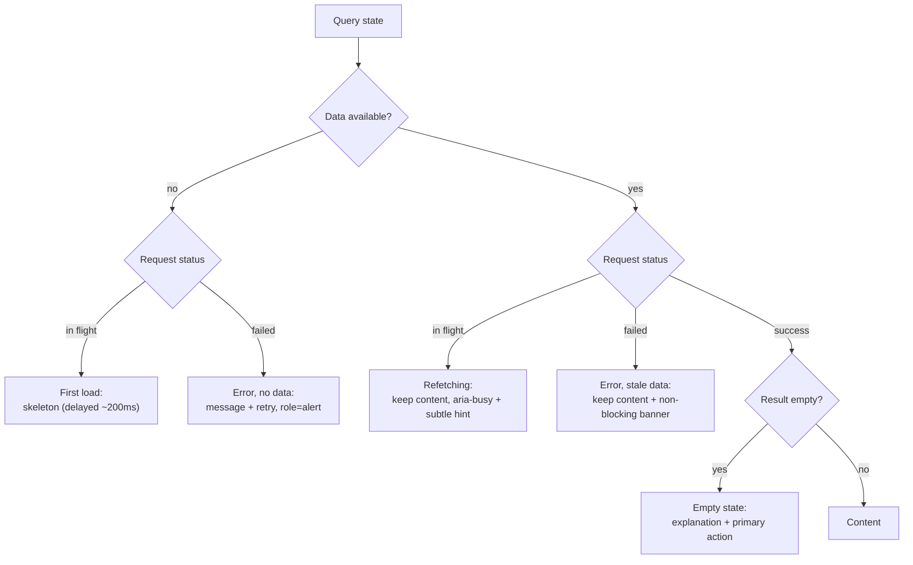

# Loading & Error States

> "Loading" is at least three different states and "error" is at least four. Collapsing them into two booleans is why apps show spinners over data they already have and empty states for requests that failed.

**Part:** [03 · Application Architecture](../) · **Domain:** Data & Server State · **Priority:** Critical · **Difficulty:** Intermediate · **Reading time:** ~12 min

## TL;DR

A view over server data has a taxonomy of states, not a boolean: first load with nothing to show, background refetch over existing data, a successful response with zero results, a failure with no data, a failure with stale data still on screen, and a partial failure where some sections loaded. Each needs a different rendering, and the two most damaging conflations are treating a refetch like a first load (a spinner replaces content the user was reading) and treating an error like an empty result ("No orders found" when the request actually failed). Every terminal state needs a recovery path the user can reach, and every state change needs to be perceivable without sight — `aria-busy`, live regions, `role="alert"`, and deliberate focus management.

> **Recommendation:** Enumerate the states explicitly rather than branching on booleans. Skeletons only when there is no data; inline indicators for refetches; distinguish empty from error; always render an actionable retry; and delay indicators by ~200 ms so fast responses never flash.

## At a Glance

| | |
| --- | --- |
| **Use when** | Any view renders server data — which is to say, always. |
| **Avoid when** | Never; the question is which states a given view needs, not whether to model them. |
| **Alternatives** | [Offline & Local-First Sync](#alternative-approaches) (avoid the states by always having local data). |
| **Primary risk** | Spinners over usable data, errors misread as empty results, and failures with no way back. |
| **Maturity** | Stable. |

## Prerequisites

- [Retries & Backoff](./retries-and-backoff.md) — what happens before a failure becomes visible, and what "exhausted" means.
- [Background Refetching](./background-refetching.md) — the `isLoading` versus `isFetching` distinction this article generalizes.

## Overview

*Loading and error states* are the rendering contract for every state a data view can occupy. The minimum useful taxonomy has six members: **first load** (no data yet), **refetching** (data on screen, request in flight), **success with data**, **success with no data** (a genuine empty result), **error with no data**, and **error with stale data** (the last-good value is still renderable). A seventh — **partial failure** — appears as soon as one view composes several requests.

The reason this needs stating is that data libraries expose overlapping booleans, and the mapping from those booleans to states is not obvious. `isLoading` means "no data and a request is in flight"; `isFetching` is true for *any* in-flight request, including background refetches over existing data. `isError` with `data` present is a different situation from `isError` with nothing — one can keep showing content, the other cannot. Empty is not a variant of loading, and it is definitely not a variant of error: an empty result is a successful answer that happens to contain nothing, and it usually calls for guidance ("create your first invoice") rather than a retry.

## The Problem

An invoices page starts with `if (isLoading) return <Spinner />` and `if (error) return <p>Something went wrong</p>`. Four bugs follow from that shape.

The user tabs away and back. `refetchOnWindowFocus` fires, `isLoading` is used inconsistently across the codebase so one component branches on `isFetching`, and the invoice table the user was reading is replaced by a spinner for 300 ms. The app feels slower the more it caches — the opposite of the intent.

A new account signs in and the list is legitimately empty, so the page renders an empty table with no explanation. Meanwhile a filter combination that returns nothing looks identical to a request that failed with a `500`, because both end up rendering "No invoices" — the error branch was skipped when `data` defaulted to `[]`.

A request fails. The page shows "Something went wrong" with no retry button, so the only recovery is a full reload — which also discards the filters and scroll position the user had set. And because the message is rendered as plain text in a region that was previously a table, a screen reader user hears nothing at all: focus stayed where it was, no live region announced the change, and the content simply became different.

Finally, the dashboard composes five queries. One fails, and the shared `if (error)` at the top replaces the whole dashboard with an error page — four working sections thrown away because a fifth could not load.

## Why It Matters

These states are where users form their judgment of reliability. A spinner over content that was already on screen reads as a slow app; an unexplained empty table reads as a broken app; an error with no way forward reads as an app that lost the user's work. None of these are data problems — the fetching logic in the scenario above is fine — which is why they survive code review and land in production.

Distinguishing empty from error matters most because the two demand opposite responses. An empty result is an invitation: explain why there is nothing and offer the action that creates something. An error is a request for another attempt: explain what failed and offer a retry. Showing an empty state for a failed request tells the user their data is gone, which is the most alarming possible reading of a transient network problem.

Accessibility is not an add-on here. State transitions are the moments where a sighted user gets information from motion and layout that a screen reader user gets from nothing unless it is announced. `aria-busy` on the region being updated, a polite live region for completions, `role="alert"` for failures, and focus moved to the error's recovery control are what make the same information available. Getting this right also improves the experience for everyone: a delayed indicator that never flashes, and a retry button placed where focus already is, are better for all users.

## Mental Model

Model the view as a state machine over two axes — do we have data, and what is the request doing — and derive one rendering per cell. Enumerating the cells is what prevents accidental conflations.



Three consequences are worth internalizing. The *have data* row never blanks: whether a refetch is running or has failed, the last-good value stays on screen and the state is communicated around it. The distinction between B and D determines whether an error is blocking or advisory — the same HTTP failure warrants a full error view in one case and a dismissible banner in the other. And F is reachable only from success, which is precisely why an error must never fall through to it.

For composed views, apply the machine per section rather than per page. A dashboard is five state machines laid out together; one section in state B does not move the others out of G.

## Best Practices

Enumerate the states rather than chaining booleans. Derive a single discriminated value — `'first-load' | 'refetching' | 'empty' | 'error' | 'stale-error' | 'ready'` — and switch on it. This makes the missing case a compile error instead of a production surprise.

Skeletons only when there is no data. Gate the skeleton on `isLoading` (no data), never on `isFetching`. A refetch keeps its content and shows a subtle indicator.

Delay indicators by roughly 200 ms. A response that arrives in 80 ms should never flash a spinner; a skeleton that appears and disappears within a frame or two is worse than nothing. Conversely, once shown, keep an indicator visible for a short minimum so it does not strobe.

Match the skeleton to the content's layout. A skeleton whose shape differs from the eventual content causes a layout shift on arrival — a Core Web Vitals regression created by the loading state itself.

Separate empty from error, and give empty a purpose. "No invoices yet — create your first" for a new account; "No invoices match these filters — clear filters" for a filtered empty; an error view for a failure. Three different messages, three different actions.

Always render a recovery path. An error state without a retry control leaves reload as the only option, which discards the user's context. Wire the retry to the query's `refetch`, not to a page reload.

Keep failures scoped to the section that failed. Compose per-section states so one failing widget does not take a working dashboard with it. Reserve full-page error views for failures that make the page meaningless.

Use error boundaries for render-time faults, not for fetch failures. A failed request is an expected, in-band state your component should render. A boundary is for the unexpected — a bug in render — and needs a reset path so recovery does not require a reload.

Announce transitions. `aria-busy="true"` on the region being refreshed, a polite live region for "12 invoices loaded", `role="alert"` for errors, and focus moved to the retry control when an error replaces content. Do not announce every keystroke-driven refetch; debounce announcements as you debounce requests.

Write error copy that says what to do. Include what failed, whether it is likely temporary, the action available, and a support reference if one exists. Never surface a raw exception message or stack to the user — log it, show a reference ID.

Keep the mutation states distinct from the query states. A submit in flight disables the control and shows progress on it; it does not put the surrounding view into a loading state.

## Trade-offs

Modeling states properly trades more branches and more markup for a UI that behaves correctly in every situation users actually encounter. The cost is real but bounded, and most of it can be shared: a handful of reusable state components covers an entire application.

**Advantages**

- Cached content stays on screen, so the app feels faster as it caches more.
- Empty and error become distinguishable, so users know whether to act or retry.
- Failures stay local, so a partial outage degrades gracefully.
- Announced transitions and reachable recovery make the view usable without sight or a mouse.

**Disadvantages**

- More branches per view, and more components to maintain.
- Delay thresholds and minimum display times add timing logic that is easy to get subtly wrong.
- Per-section states mean more skeleton variants to keep matched to their content.
- Over-communicating (banners, live regions, toasts) becomes noise in its own right.

| Dimension | Explicit state taxonomy | Two booleans |
| --- | --- | --- |
| Perceived speed | Content persists across refetches | Spinner replaces usable content |
| Clarity | Empty, error, and stale are distinct | Empty and error look the same |
| Recovery | Retry in place, context preserved | Reload, losing filters and position |
| Blast radius | Per-section failure | One failure blanks the page |
| Accessibility | Busy, alerts, and focus handled | Silent DOM swaps |
| Code | More branches, shareable components | Two lines, several wrong outcomes |

## Alternative Approaches

There is no way to avoid having these states — a request either has an answer or does not. The only structural alternative changes how *often* the empty and loading states are reachable.

| Approach | Best when | Weakness | See |
| --- | --- | --- | --- |
| Explicit state taxonomy (this article) | Any view over server data | More branches to write and test | (this article) |
| [Offline & Local-First Sync](./) (planned) | Data can live locally and sync in the background | Substantial architecture; conflict resolution | `Offline & Local-First Sync · Data & Server State` |
| Suspense + error boundaries | You want states declared at the boundary, not per component | Coarser granularity; boundaries need reset paths | [React docs](https://react.dev/reference/react/Component#catching-rendering-errors-with-an-error-boundary) |
| Placeholder / previous data | Paginated or filtered views with a prior result | Shows stale content that must be marked as such | [Pagination](./pagination.md) |

## Bad Example

Two booleans, a spinner on every fetch, empty and error conflated, and no recovery path.

```tsx
import { useQuery } from '@tanstack/react-query';

// ❌ The default shape, and five distinct failures.
function InvoicesPage({ filters }: { filters: Filters }) {
  const { data, isFetching, isError } = useQuery({
    queryKey: ['invoices', filters],
    queryFn: () => fetchInvoices(filters),
  });

  // (1) isFetching covers background refetches, so every window refocus
  //     replaces the table the user is reading with a spinner.
  if (isFetching) return <Spinner />;

  // (2) No retry: the only recovery is a full reload, which loses filters
  //     and scroll position. (3) The message says nothing actionable, and
  //     as plain text in a swapped region it is never announced.
  if (isError) return <p>Something went wrong</p>;

  // (4) `data ?? []` makes an error and an empty result render identically,
  //     so a failed request tells the user their invoices don't exist.
  const invoices = data ?? [];
  if (invoices.length === 0) return <p>No invoices found</p>;

  return <InvoiceTable invoices={invoices} />;
}

function Dashboard() {
  const revenue = useQuery({ queryKey: ['revenue'], queryFn: fetchRevenue });
  const invoices = useQuery({ queryKey: ['invoices'], queryFn: fetchInvoices });
  const activity = useQuery({ queryKey: ['activity'], queryFn: fetchActivity });

  // (5) One failure blanks three working sections.
  if (revenue.isError || invoices.isError || activity.isError) {
    return <ErrorPage />;
  }

  return <Layout revenue={revenue.data} invoices={invoices.data} activity={activity.data} />;
}
```

**What goes wrong:** Branching on `isFetching` means the app gets *worse* the more it caches, because every background refetch discards visible content. The `data ?? []` default routes failures into the empty branch, so a `500` renders as "No invoices found" — the most misleading message available. There is no retry, so recovery costs the user their filters. The error is not announced and focus is not moved, so a screen reader user experiences the table silently disappearing. And the dashboard's combined error check throws away three working sections because one request failed.

## Good Example

One derived state per view, delayed indicators, distinct empty and error paths, and announced transitions.

```tsx
import { useEffect, useRef, useState } from 'react';
import { useQuery } from '@tanstack/react-query';

type ViewState =
  | 'first-load'
  | 'refetching'
  | 'empty-new'
  | 'empty-filtered'
  | 'error'
  | 'stale-error'
  | 'ready';

/** ✅ Delays the indicator so fast responses never flash a skeleton. */
function useDelayedFlag(active: boolean, delayMs = 200): boolean {
  const [visible, setVisible] = useState(false);
  useEffect(() => {
    if (!active) {
      setVisible(false);
      return;
    }
    const timer = window.setTimeout(() => setVisible(true), delayMs);
    return () => clearTimeout(timer);
  }, [active, delayMs]);
  return visible;
}

export function InvoicesPage({
  filters,
  onClearFilters,
}: {
  filters: Filters;
  onClearFilters: () => void;
}) {
  const { data, isLoading, isFetching, isError, error, refetch } = useQuery({
    queryKey: ['invoices', filters],
    queryFn: () => fetchInvoices(filters),
    staleTime: 30_000,
  });

  const hasFilters = Object.values(filters).some(Boolean);

  // ✅ One exhaustive state instead of a chain of booleans.
  const state: ViewState =
    isLoading ? 'first-load'
    : isError && !data ? 'error'
    : isError ? 'stale-error'
    : isFetching ? 'refetching'
    : data && data.length === 0 ? (hasFilters ? 'empty-filtered' : 'empty-new')
    : 'ready';

  const showSkeleton = useDelayedFlag(state === 'first-load');
  const retryRef = useRef<HTMLButtonElement | null>(null);

  // ✅ Move focus to the recovery control when content is replaced by an error.
  useEffect(() => {
    if (state === 'error') retryRef.current?.focus();
  }, [state]);

  if (state === 'first-load') {
    // ✅ Skeleton matches the table's layout, so arrival causes no shift.
    return showSkeleton ? <InvoiceTableSkeleton rows={8} /> : <div style={{ minHeight: 400 }} />;
  }

  if (state === 'error') {
    return (
      // ✅ role="alert" announces it; the message says what to do.
      <div role="alert">
        <h2>Couldn’t load invoices</h2>
        <p>This is usually temporary. {describeError(error)}</p>
        <button type="button" ref={retryRef} onClick={() => refetch()}>
          Try again
        </button>
      </div>
    );
  }

  if (state === 'empty-new') {
    // ✅ Empty is an invitation, not a failure.
    return (
      <EmptyState
        title="No invoices yet"
        body="Invoices you create will appear here."
        action={<CreateInvoiceButton />}
      />
    );
  }

  if (state === 'empty-filtered') {
    return (
      <EmptyState
        title="No invoices match these filters"
        body="Try widening the date range or clearing the filters."
        action={<button type="button" onClick={onClearFilters}>Clear filters</button>}
      />
    );
  }

  return (
    // ✅ Content persists through refetches and stale errors.
    <section aria-busy={state === 'refetching'}>
      {state === 'stale-error' && (
        // Advisory, not blocking: the data on screen is still usable.
        <div role="status">
          Showing the last known invoices — couldn’t refresh.{' '}
          <button type="button" onClick={() => refetch()}>Retry</button>
        </div>
      )}

      {state === 'refetching' && (
        <span aria-hidden="true" className="refresh-hint">Updating…</span>
      )}

      <InvoiceTable invoices={data!} />

      <p aria-live="polite" className="visually-hidden">
        {state === 'refetching' ? 'Updating invoices' : `${data!.length} invoices loaded`}
      </p>
    </section>
  );
}
```

**Why it's better:** The state is derived once and exhaustively, so empty, error, stale-error, and refetching cannot be confused. Content is never replaced by a spinner once it exists — a refetch shows `aria-busy` and a quiet hint, and a failed refetch shows an advisory banner over still-usable data. The two empty states carry different explanations and different actions. And the accessibility layer is wired to the same state value: `role="alert"` for the blocking error, focus moved to its retry button, `role="status"` for the advisory one, and a polite live region for completion.

## Production Example

Composed views need per-section states plus an error boundary for the unexpected. This is the shape that keeps a partial outage partial.

```tsx
import { Component, type ErrorInfo, type ReactNode } from 'react';
import { useQuery, type UseQueryResult } from '@tanstack/react-query';

/**
 * ✅ One boundary per section, with a reset path: a render-time bug in one
 * widget cannot blank the dashboard, and recovery doesn't need a reload.
 */
class SectionBoundary extends Component<
  { label: string; children: ReactNode },
  { failed: boolean }
> {
  state = { failed: false };

  static getDerivedStateFromError() {
    return { failed: true };
  }

  componentDidCatch(error: Error, info: ErrorInfo) {
    // Log the technical detail; never render it.
    reportError(error, { componentStack: info.componentStack });
  }

  render() {
    if (this.state.failed) {
      return (
        <div role="alert">
          <p>{this.props.label} couldn’t be displayed.</p>
          <button type="button" onClick={() => this.setState({ failed: false })}>
            Reload this section
          </button>
        </div>
      );
    }
    return this.props.children;
  }
}

/** ✅ A reusable renderer so every section handles the taxonomy identically. */
function QuerySection<T>({
  label,
  query,
  isEmpty,
  children,
}: {
  label: string;
  query: UseQueryResult<T, Error>;
  isEmpty?: (data: T) => boolean;
  children: (data: T) => ReactNode;
}) {
  const { data, isLoading, isFetching, isError, error, refetch } = query;

  if (isLoading) return <CardSkeleton label={label} />;

  if (isError && data === undefined) {
    return (
      <div role="alert">
        <p>{label} is unavailable. {describeError(error)}</p>
        <button type="button" onClick={() => refetch()}>Try again</button>
      </div>
    );
  }

  if (data !== undefined && isEmpty?.(data)) {
    return <EmptyCard label={label} />;
  }

  return (
    <section aria-busy={isFetching} aria-label={label}>
      {/* Stale data with a failed refresh stays visible, flagged as stale. */}
      {isError && <StaleBadge onRetry={() => refetch()} />}
      {children(data!)}
    </section>
  );
}

export function Dashboard() {
  const revenue = useQuery({ queryKey: ['revenue'], queryFn: fetchRevenue });
  const invoices = useQuery({ queryKey: ['invoices'], queryFn: fetchInvoices });
  const activity = useQuery({ queryKey: ['activity'], queryFn: fetchActivity });

  return (
    <Layout>
      {/* ✅ Three independent state machines: one failure costs one card. */}
      <SectionBoundary label="Revenue">
        <QuerySection label="Revenue" query={revenue}>
          {(data) => <RevenueChart data={data} />}
        </QuerySection>
      </SectionBoundary>

      <SectionBoundary label="Invoices">
        <QuerySection
          label="Invoices"
          query={invoices}
          isEmpty={(list) => list.length === 0}
        >
          {(list) => <InvoiceTable invoices={list} />}
        </QuerySection>
      </SectionBoundary>

      <SectionBoundary label="Activity">
        <QuerySection
          label="Activity"
          query={activity}
          isEmpty={(list) => list.length === 0}
        >
          {(list) => <ActivityFeed items={list} />}
        </QuerySection>
      </SectionBoundary>
    </Layout>
  );
}
```

Two production points. Fetch failures are handled *inside* `QuerySection` as ordinary states, while the boundary catches only render-time bugs — mixing the two makes every network blip look like a crash. And the boundary's reset button matters: a boundary with no way out is a permanent blank region until the user reloads, which is the failure mode boundaries are supposed to prevent.

## Common Mistakes

See the [Data & Server State anti-patterns](../../../anti-patterns/#data-server-state) for the domain catalog. Concept-specific:

### Mistake: Gating the view on `isFetching`

- **Symptom:** Content is replaced by a spinner on every window refocus or remount.
- **Why it fails:** `isFetching` is true for background refetches over existing data, so caching makes the experience worse rather than better.
- **Fix:** Skeletons on `isLoading` only; refetches keep content and show `aria-busy` plus a subtle hint.

### Mistake: Defaulting data to `[]` before the error check

- **Symptom:** A failed request renders "No results found".
- **Why it fails:** The fallback erases the difference between "the server said none" and "we never got an answer".
- **Fix:** Check the error state before applying any default, and keep empty reachable only from success.

### Mistake: An error state with no recovery

- **Symptom:** "Something went wrong" and nothing else; users reload the page.
- **Why it fails:** A reload discards filters, scroll, and in-progress input — the error costs more than the failure did.
- **Fix:** Render a retry wired to `refetch`, and keep the surrounding context intact.

### Mistake: One error check for a composed view

- **Symptom:** A whole dashboard is replaced because one widget's request failed.
- **Why it fails:** Combining independent query states into one condition couples unrelated failures.
- **Fix:** Per-section state and per-section boundaries; full-page errors only when the page is meaningless without the data.

### Mistake: Silent state transitions

- **Symptom:** Screen reader users get no indication that content is loading, arrived, or failed.
- **Why it fails:** Layout and motion carry the information for sighted users; nothing carries it otherwise.
- **Fix:** `aria-busy` on the updating region, `role="alert"` for blocking errors, a polite live region for completion, and focus moved to the recovery control.

### Mistake: Undelayed or mismatched skeletons

- **Symptom:** A skeleton flashes for one frame on fast responses; content jumps when it arrives.
- **Why it fails:** Indicators shown immediately strobe on quick responses, and a skeleton whose shape differs from the content causes layout shift.
- **Fix:** Delay indicators ~200 ms, keep a short minimum display time, and match the skeleton to the final layout.

### Mistake: Leaking raw error detail

- **Symptom:** Stack traces, SQL fragments, or internal identifiers rendered in the UI.
- **Why it fails:** It is unusable for the user and can disclose internals.
- **Fix:** Log the technical detail, show a plain-language message plus a reference ID.

## Checklist

- [ ] The view derives one exhaustive state value rather than chaining booleans.
- [ ] Skeletons appear only when there is no data; refetches keep content on screen.
- [ ] Indicators are delayed ~200 ms and have a minimum display time.
- [ ] Skeleton layout matches the content it replaces.
- [ ] Empty and error are distinct, and empty is only reachable from success.
- [ ] The two empty variants (nothing yet vs nothing matching) have different copy and actions.
- [ ] Every error renders a retry wired to `refetch`, not a page reload.
- [ ] Failures are scoped to their section; error boundaries handle render faults and can be reset.
- [ ] `aria-busy`, `role="alert"`, `role="status"`, and a polite live region cover the transitions.
- [ ] Focus moves to the recovery control when content is replaced by an error.
- [ ] User-facing messages are plain language; technical detail is logged, not rendered.

## Related Articles

- [Retries & Backoff](./retries-and-backoff.md) — what runs before an error becomes visible, and when the budget is spent.
- [Background Refetching](./background-refetching.md) — the refetch state this taxonomy renders differently from a first load.
- [Pagination](./pagination.md) — keeping the previous page visible instead of showing a skeleton per click.
- [Optimistic Updates](./optimistic-updates.md) — the mutation-side states that sit alongside these query states.
- [Error Messaging](../forms-validation/error-messaging.md) — writing the message itself, and its accessible presentation.

## Related Examples

- [Accessible field error](../../../examples/accessible-field-error.tsx) — the announcement and focus pattern applied at field level.
- [Stale-time configuration](../../../examples/stale-time-configuration.ts) — the setting that decides how often the refetching state is entered.

## References

- [WAI-ARIA — aria-busy](https://developer.mozilla.org/en-US/docs/Web/Accessibility/ARIA/Attributes/aria-busy) — marking a region as being updated.
- [React — Error Boundaries](https://react.dev/reference/react/Component#catching-rendering-errors-with-an-error-boundary) — catching render-time faults, and why fetch failures are not among them.
