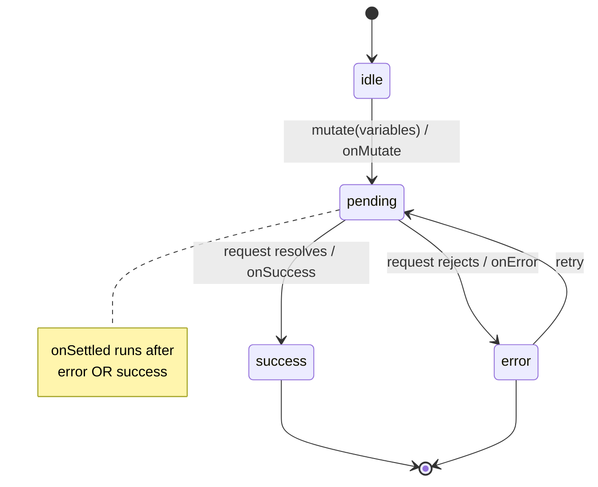

# Mutation Lifecycle

> Reads have one hard state; writes have four. A mutation is idle, then pending, then either error or success — and the callbacks between them are where cache correctness lives.

**Part:** [03 · Application Architecture](../) · **Domain:** Data & Server State · **Priority:** Critical · **Difficulty:** Intermediate · **Reading time:** ~12 min

## TL;DR

A mutation is a write with a lifecycle: it starts `idle`, becomes `pending` when fired, and resolves to `error` or `success`. Each transition has a callback — `onMutate` before the request, `onError`, `onSuccess`, and `onSettled` after — and those callbacks are where you disable the submit button, roll back optimistic state, invalidate the cache, and surface errors. Modeling the lifecycle explicitly with `useMutation` (rather than a hand-rolled `isLoading` boolean and a bare `fetch`) gives you double-submit protection, typed errors, and one place to reconcile the cache after every write.

> **Recommendation:** Use `useMutation` for every write. Drive the button's disabled state from `isPending`, invalidate affected keys in `onSettled`, and render the `error` state — never fire a write with a bare `fetch` and a manual loading flag.

## At a Glance

| | |
| --- | --- |
| **Use when** | Any create, update, or delete — anything that changes server state. |
| **Avoid when** | Read-only data flows; those are queries, not mutations. |
| **Alternatives** | None for the lifecycle itself; how you update the cache afterward is the variable (invalidate vs optimistic). |
| **Primary risk** | Unhandled rejection or double submit from treating a write as fire-and-forget. |
| **Maturity** | Stable. |

## Prerequisites

- [Cache Keys & Query Identity](./cache-keys-and-query-identity.md) — the keys a mutation invalidates or writes to.

## Overview

A *mutation* is a request that changes server state — POST, PUT, PATCH, DELETE — as opposed to a *query*, which reads. The difference is not cosmetic: writes are not idempotent by default, must not run twice by accident, and leave the client cache out of date when they succeed. The *lifecycle* is the sequence of states a mutation passes through and the hooks fired at each transition, which together let you handle all of that in one place.

`useMutation` models the lifecycle as a small state machine: `status` is `'idle' | 'pending' | 'error' | 'success'`, exposed as `isIdle`, `isPending`, `isError`, `isSuccess`, alongside `data`, `error`, and `variables`. The lifecycle callbacks run in order: `onMutate` fires before the request (the hook point for optimistic updates), then exactly one of `onError`/`onSuccess`, then `onSettled` regardless of outcome. You call the mutation with `mutate(variables)` (fire-and-forget, errors go to `onError`) or `mutateAsync(variables)` (returns a promise you must catch). This structure is what separates a robust write from a fragile one.

## The Problem

The naive write is a click handler that calls `fetch`, flips a local `saving` boolean, and moves on. It has three defects that only show up in production. First, nothing prevents a double submit: an impatient user clicks twice and creates two invoices, because the button was never disabled on the exact async boundary. Second, a rejected `fetch` becomes an unhandled promise rejection — no error state, just a console warning and a UI stuck in "saving." Third, after the write succeeds, the list the user came from still shows old data, because nothing reconciled the cache.

Each defect is a missing piece of the lifecycle. The double submit is a missing `pending` gate. The stuck UI is a missing `error` transition. The stale list is a missing `onSettled` invalidation. Hand-rolled writes tend to have all three, because a boolean and a `fetch` do not model a lifecycle — they model a single happy-path moment and leave the rest to be remembered by hand at every call site.

## Why It Matters

Writes are where an app changes the world, so their failure modes are the ones that corrupt data and erode trust: duplicate records, lost edits, a UI that claims success after a failure. Modeling the lifecycle explicitly turns those from "remember to handle it everywhere" into structural guarantees — the pending state gates the button, the error state is a value you must render, and `onSettled` is the single place the cache is reconciled.

It also standardizes writes across a team. When every mutation goes through `useMutation`, every write has the same shape: the same states to render, the same place to invalidate, the same typed error. Reviewers know where to look; new writes are copy-shaped-correctly instead of reinvented. That consistency is worth as much as the individual guarantees, because the most expensive write bugs are the ones a reviewer did not think to check for.

## Mental Model

A mutation is a one-shot state machine with fixed transitions and a callback on each edge. You do not read from it continuously the way you read a query; you fire it, watch it move `idle → pending → (error | success)`, and react at the transitions.



The callbacks map to the jobs a write needs. `onMutate` runs before the request and can snapshot state for rollback (optimistic updates). `onSuccess` gets the server's response. `onError` gets the typed failure. `onSettled` runs after either and is the natural home for invalidation, because you usually want to reconcile the cache whether the write succeeded or failed. Keeping each job on its matching edge is what makes the write's behavior predictable.

## Best Practices

Drive UI disabled state from `isPending`, not a manual flag. The library flips `isPending` exactly around the async boundary, so a button disabled on `isPending` cannot be double-clicked into a double submit. A hand-managed boolean races the async edge and misses.

Reconcile the cache in `onSettled`. After a write, the affected queries are stale. Invalidate them in `onSettled` so both success and error paths converge on a correct cache. This is the single reconciliation point that keeps lists and details current — see [Cache Invalidation](./cache-invalidation.md).

Render the `error` state; never swallow it. `isError`/`error` are values the UI must show, accessibly. A write that fails silently leaves the user believing it worked, which is worse than an error message. Surface it in an `aria-live` region and let them retry.

Choose `mutate` vs `mutateAsync` deliberately. `mutate` is fire-and-forget; failures route to `onError` and there is no promise to leak. `mutateAsync` returns a promise you *must* wrap in try/catch — use it only when you need to await the result (for example, to sequence two writes). An unawaited `mutateAsync` is an unhandled rejection.

Keep `mutationFn` pure and typed at the boundary. It takes typed `variables`, performs the request, validates the response shape, and returns typed data or throws. Side effects (cache writes, navigation, toasts) belong in the callbacks, not in the fetcher, so the lifecycle stays legible.

## Trade-offs

`useMutation` adds a small abstraction over "call the API," and for a truly trivial, throwaway write that can feel like ceremony. The payoff is that every non-trivial write needs the states it provides, and providing them by hand is exactly the code that gets skipped.

**Advantages**

- Built-in `pending` gate prevents double submits at the async boundary.
- Typed `error` state you must render, so failures cannot be silently dropped.
- One `onSettled` hook standardizes cache reconciliation across all writes.

**Disadvantages**

- More structure than a bare `fetch` for a one-off write.
- `mutateAsync` reintroduces manual rejection handling if misused.
- The callback order (`onMutate` → `onError`/`onSuccess` → `onSettled`) must be understood to place logic correctly.

| Dimension | `useMutation` lifecycle | Cost / caveat |
| --- | --- | --- |
| Performance | Negligible overhead | None material |
| Complexity | States and callbacks are explicit | Callback ordering must be learned |
| Maintainability | Every write has one shape | Slight ceremony for trivial writes |
| Failure behavior | Errors are a rendered state | `mutateAsync` can leak if unawaited |

## Alternative Approaches

The lifecycle itself has no substitute — every write passes through these states whether or not you model them. What varies is the *cache-update strategy* layered on top: invalidate-after-success (simple, a round trip of latency) versus optimistic update (instant, needs rollback). Those are covered in [Optimistic Updates](./optimistic-updates.md) and *Rollback & Conflict Resolution* (planned). `alternatives: []` here because there is no competing way to *be* a mutation.

## Bad Example

A write as a bare `fetch` with a manual boolean — double-submit-prone and swallowing errors.

```tsx
import { useState } from 'react';

// ❌ Manual `saving` races the async edge (double submit possible), the rejected
// fetch is unhandled, and nothing refreshes the list after success.
function CreateInvoiceButton({ draft }: { draft: InvoiceDraft }) {
  const [saving, setSaving] = useState(false);

  async function handleClick() {
    setSaving(true);
    const response = await fetch('/api/invoices', {
      method: 'POST',
      body: JSON.stringify(draft),
    });
    const invoice = await response.json(); // throws on non-2xx bodies; never caught
    setSaving(false);
    console.log('created', invoice);
  }

  return (
    <button onClick={handleClick} disabled={saving}>
      Create invoice
    </button>
  );
}
```

**What goes wrong:** Three lifecycle gaps at once — no reliable pending gate (double submit), an unhandled rejection (stuck UI on failure), and no cache reconciliation (stale list after success).

## Good Example

The same write through `useMutation`, with the button gated on `isPending`, the error rendered, and the cache reconciled in `onSettled`.

```tsx
import { useMutation, useQueryClient } from '@tanstack/react-query';
import { invoiceKeys } from './invoice-keys';

interface InvoiceDraft {
  customer: string;
  amountCents: number;
}

async function createInvoice(draft: InvoiceDraft): Promise<{ id: string }> {
  const response = await fetch('/api/invoices', {
    method: 'POST',
    headers: { 'content-type': 'application/json' },
    body: JSON.stringify(draft),
  });
  if (!response.ok) {
    throw new Error(`Failed to create invoice (${response.status})`);
  }
  return (await response.json()) as { id: string };
}

function CreateInvoiceButton({ draft }: { draft: InvoiceDraft }) {
  const queryClient = useQueryClient();
  const mutation = useMutation({
    mutationFn: createInvoice,
    // ✅ Reconcile the cache whether the write succeeded or failed.
    onSettled: () => queryClient.invalidateQueries({ queryKey: invoiceKeys.lists() }),
  });

  return (
    <div>
      <button onClick={() => mutation.mutate(draft)} disabled={mutation.isPending}>
        {mutation.isPending ? 'Creating…' : 'Create invoice'}
      </button>
      {mutation.isError && (
        <p role="alert">{mutation.error.message}</p>
      )}
    </div>
  );
}
```

**Why it's better:** `isPending` gates the button on the exact async boundary, so the double submit is impossible. The rejection becomes a rendered `error` state in an `alert`, not a stuck UI. `onSettled` invalidates the list so it is current after the write. All three lifecycle gaps from the Bad Example are closed structurally.

## Production Example

A mutation used through a small typed hook, with an accessible pending/error UI and a success side effect (navigation) placed on the right callback.

```tsx
import { useMutation, useQueryClient } from '@tanstack/react-query';
import { invoiceKeys } from './invoice-keys';

interface InvoiceDraft {
  customer: string;
  amountCents: number;
  dueDate: string;
}

interface Invoice extends InvoiceDraft {
  id: string;
  status: 'draft' | 'sent' | 'paid';
}

async function createInvoice(draft: InvoiceDraft, signal?: AbortSignal): Promise<Invoice> {
  const response = await fetch('/api/invoices', {
    method: 'POST',
    headers: { 'content-type': 'application/json' },
    body: JSON.stringify(draft),
    signal,
  });
  if (response.status === 422) {
    // Expected, actionable failure: the server rejected the payload. Give the
    // caller the field errors rather than a generic message.
    const problem = (await response.json()) as { message: string };
    throw new Error(problem.message);
  }
  if (!response.ok) {
    throw new Error(`Failed to create invoice (${response.status})`);
  }
  return (await response.json()) as Invoice;
}

export function useCreateInvoice(onCreated: (invoice: Invoice) => void) {
  const queryClient = useQueryClient();

  return useMutation({
    mutationFn: (draft: InvoiceDraft) => createInvoice(draft),
    // Success-only side effect: navigate to the new record.
    onSuccess: (invoice) => onCreated(invoice),
    // Always reconcile the list, success or failure.
    onSettled: () => queryClient.invalidateQueries({ queryKey: invoiceKeys.lists() }),
  });
}
```

## Common Mistakes

See the [Data & Server State anti-patterns](../../../anti-patterns/README.md#data-server-state) for the domain catalog. Concept-specific:

### Mistake: Manual loading flag instead of `isPending`

- **Symptom:** A `useState` boolean toggled around a `fetch` to disable a button.
- **Why it fails:** It races the async edge and can miss a rapid second click, causing a double submit.
- **Fix:** Gate the button on the mutation's `isPending`, which flips exactly around the boundary.

### Mistake: Unawaited `mutateAsync`

- **Symptom:** `mutateAsync(...)` called without `await` or `.catch`.
- **Why it fails:** A rejection becomes an unhandled promise rejection with no error state.
- **Fix:** Use `mutate` (errors route to `onError`) unless you truly need the promise, then wrap it in try/catch.

## Checklist

- [ ] Every write goes through `useMutation`, not a bare `fetch` plus a boolean.
- [ ] Submit controls are disabled on `isPending`.
- [ ] The `error` state is rendered accessibly (e.g. `role="alert"`), never swallowed.
- [ ] The cache is reconciled in `onSettled` (or optimistically in `onMutate`).
- [ ] `mutateAsync` is only used when awaited and wrapped in try/catch.

## Related Articles

- [Optimistic Updates](./optimistic-updates.md) — using `onMutate`/`onError` to apply and roll back a write instantly.
- [Cache Invalidation](./cache-invalidation.md) — what to do in `onSettled`.
- *Rollback & Conflict Resolution* extends the error path (planned — see the [Data & Server State index](./README.md)).

## Related Recipes

- [Type-safe form with server mutation](../../../recipes/type-safe-form-with-server-mutation.md) — a validated form driving a full mutation lifecycle.

## Related Examples

- [Invoice mutation hook](../../../examples/use-invoice-mutation.tsx) — the minimal `useMutation` shape with pending and error states.

## References

- [TanStack Query — Mutations](https://tanstack.com/query/latest/docs/framework/react/guides/mutations) — the lifecycle and callbacks.
- [TanStack Query — useMutation](https://tanstack.com/query/latest/docs/framework/react/reference/useMutation) — `status`, `mutate` vs `mutateAsync`, callback order.
