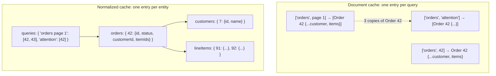

# Normalizing Server Responses

> The same order can arrive in five responses and end up in five cache entries. Normalizing means storing it once, by ID, so marking it shipped updates every screen that shows it — and accepting the bookkeeping that a database-shaped cache requires.

**Part:** [03 · Application Architecture](../) · **Domain:** Data & Server State · **Priority:** Critical · **Difficulty:** Intermediate · **Reading time:** ~15 min

## TL;DR

Normalizing server responses means splitting nested payloads into flat maps of entities keyed by ID, and replacing embedded objects with references. Each record then has exactly one home in the cache, so an update is written once and every view that reads it re-renders — no hunting through per-view entries for stale duplicates. The cost is real: you take on identity, merge, and garbage-collection concerns that a document-shaped cache handles for you, plus a denormalization step on read. Normalize when the same entities appear across many views and are frequently mutated; keep a per-view document cache when views are mostly independent.

> **Recommendation:** Default to a document cache keyed by query identity, and reach for normalization when duplicated entities across views start causing visible inconsistency. If you normalize, do it in one boundary layer with a stable `typename:id` key, validate at that boundary, and let selectors denormalize for render.

## At a Glance

| | |
| --- | --- |
| **Use when** | The same entities appear in many views, mutations are frequent, and inconsistent copies are visible to users. |
| **Avoid when** | Views are independent, payloads are view-shaped, or the team is small and the app is read-mostly. |
| **Alternatives** | None as a category — the choice is *where* records live; see [the comparison](#alternative-approaches). |
| **Primary risk** | Hand-rolled normalization that grows into an unbounded, hard-to-invalidate client database. |
| **Maturity** | Stable. |

## Prerequisites

- [Pagination](./pagination.md) — paginated lists are where duplicated entities across cache entries first bite.
- [Cache Keys & Query Identity](./cache-keys-and-query-identity.md) — the per-view identity that normalization complements rather than replaces.

## Overview

*Normalizing server responses* is the transformation of nested API payloads into a flat, relational shape: one map per entity type, each keyed by the entity's ID, with relationships stored as IDs rather than embedded objects. A response containing an order with its customer and three line items becomes four entries in three maps, plus a reference from the order to the customer and to the line-item IDs.

The alternative — and the default in most React data layers — is a *document cache*: the response is stored whole, under the key of the query that produced it. TanStack Query works this way; `['orders', { page: 1 }]` holds exactly the array the server returned, embedded objects included. This is simple, requires no identity rules, and each entry expires independently. Its weakness appears when one record lives in several documents: the same order in a list, in a detail view, and in a dashboard summary is three copies, and updating one leaves the other two stale until they refetch.

Normalized caches invert those properties. Apollo Client and RTK Query's `normalizr`-style entity adapters store `Order:42` once, so a mutation result merges into that one location and every reader updates. In exchange, you must define identity for every type, decide how partial objects merge into existing ones, denormalize on read, and answer questions the document cache never asked — like when `Order:42` can be evicted if no query currently references it.

## The Problem

A fulfillment app shows orders in three places: a paginated list, a detail drawer, and a "needs attention" widget in the header. All three fetch from different endpoints, and all three responses embed the order object.

An operator opens the drawer and marks order 42 as shipped. The mutation returns the updated order, the detail entry is updated, and the drawer shows "Shipped". Behind it, the list still says "Pending" and the header widget still counts order 42 as needing attention. The operator marks it shipped again from the list, which succeeds — the endpoint is tolerant — and now the team has an audit trail suggesting duplicate work. Nothing failed; the data simply exists in three places and only one was updated.

The reflexive fix is to invalidate everything on every mutation. That works and costs a request per affected view, per mutation: one status change triggers four refetches, the list flashes, scroll position moves, and on a slow connection the UI is briefly inconsistent in a *different* way. The second fix is to update each cache entry by hand — `setQueryData` on the list key, the detail key, and the widget key — which is correct until someone adds a fourth view and forgets. Both are symptoms of the same root cause: the record has no single home, so "update the order" is not an operation the cache can express.

## Why It Matters

Consistency across views is the property users notice first and describe as "the app is buggy." When one record can hold different values in two places on the same screen, no amount of careful mutation code fully solves it — the number of places to update grows with the number of views, and each new view is a chance to miss one. Normalization makes correctness structural: there is one place, so there is one update.

The efficiency argument is secondary but real. Storing each entity once removes duplication from memory, which matters when a thousand-row list and a dashboard hold overlapping records. More importantly it removes *refetches*: a mutation that merges into the entity map updates every view without a network request, which is the difference between an interaction that feels immediate and one that flashes through four loading states.

The cost is that you are now maintaining a database in the browser, with the responsibilities that implies. Identity must be defined and stable — an entity that arrives without an ID, or with a different ID scheme per endpoint, corrupts the map. Merges must be defined: when a list response carries a partial order (three fields) and the detail response carries the full one (thirty), naive assignment can delete fields readers depend on. Eviction must be defined, or the map grows for the session's lifetime. This is precisely why mature libraries own normalization and hand-rolled versions become the thing nobody wants to touch: the easy 80% is a `reduce` call, and the remaining 20% is where the bugs live.

## Mental Model

Hold two shapes side by side. The document cache maps *query identity to a response*; the normalized cache maps *entity identity to a record*, with queries reduced to lists of references.



Three rules make the right-hand shape work. **Identity** is a pure function from a record to a key, usually `` `${typename}:${id}` `` — it must be stable across endpoints, so the same order fetched from two routes lands in one slot. **Merge** defines what happens when a record arrives again: a shallow merge over the existing value preserves fields the new response omitted, which is almost always what you want for partial payloads. **Denormalization** is the read path: a selector resolves references back into the nested shape a component wants, memoized so the resolved object is referentially stable between renders.

The read path is where the cost shows up in practice. A normalized cache is optimized for writes and consistency; every render pays a resolution step. That trade is fine when resolution is memoized and shallow, and painful when a component needs a deep graph — which is where [Client-Side Relations](./client-side-relations.md) picks up.

## Best Practices

Start with the document cache and let pain drive the change. Per-query caching is less code, has no identity rules, and is right for most applications. Normalize the entity types that are genuinely shared and mutated — often a handful — rather than the whole API.

Use a library if you normalize. Apollo Client, RTK Query's entity adapters, and `normalizr` have solved identity, merge semantics, partial results, and eviction. A hand-rolled entity map is a weekend to build and a year to maintain.

Define identity in one place, and make it typed. `` `${typename}:${id}` `` keys prevent collisions between an order 42 and a customer 42. If an endpoint returns records without IDs, treat that as an API defect: without stable identity, normalization is not possible.

Merge, don't replace. Partial records are the norm — list endpoints return summaries, detail endpoints return everything. Shallow-merge incoming fields over the stored record so a summary response cannot erase fields the detail view depends on.

Normalize at one boundary, and validate there. Do the transformation where responses enter the app, alongside schema validation (see `Schema Validation · Forms & Validation`), so nothing downstream sees raw payloads and every entity in the store has a checked shape.

Keep query results as reference lists, with their own metadata. A paginated query becomes an ordered array of IDs plus its cursor or page info. Order lives with the query, not with the entities, because the same entity participates in many orderings.

Memoize denormalization. Resolving references on every render creates new objects and defeats `React.memo` and dependency arrays. Use memoized selectors so an unchanged entity yields an identical object reference.

Have an eviction story. Reference-count entities against live queries, or bound the store, or drop entity types on route change. "Grows until reload" is a leak that appears as slow degradation over a long session.

Don't normalize what is view-shaped. Aggregates, reports, search-result rankings, and computed summaries are not entities; they have no meaningful identity and belong in a document cache or in [Derived Server Data](./derived-server-data.md).

Keep the server's contract in mind. If the API returns different field subsets under the same ID and no `__typename`-equivalent, normalization amplifies the ambiguity. Ask for consistent identity and type discriminators; it is a cheaper fix than client-side heuristics.

## Trade-offs

Normalization trades read-path simplicity and setup cost for write-path correctness. The exchange rate depends almost entirely on how much entity overlap exists between views, which is why the same decision is obvious in one app and wrong in another.

**Advantages**

- One record, one home: a mutation updates every view without refetching.
- Memory duplication disappears when the same entities appear in many views.
- Cross-view inconsistency becomes structurally impossible rather than a discipline problem.
- Optimistic updates get simpler: patch one entity instead of every document containing it.

**Disadvantages**

- Identity, merge, and eviction rules are now your problem.
- Every read pays a denormalization step, and unmemoized selectors cause render churn.
- Partial responses can corrupt records if merge semantics are wrong.
- Debugging moves further from the network: the shape in the store no longer matches the payload.
- Ordering and pagination metadata must be modeled separately from entities.

| Dimension | Normalized cache | Document cache |
| --- | --- | --- |
| Cross-view consistency | Structural — one write updates all readers | Manual — update or invalidate each entry |
| Read cost | Denormalization per read (memoizable) | Zero: the entry is already view-shaped |
| Write cost | One merge into one entity | One write per document containing the record |
| Setup complexity | Identity, merge, eviction rules | Query keys only |
| Debuggability | Store shape differs from responses | Entries mirror responses exactly |
| Memory | One copy per entity | One copy per view that fetched it |

## Alternative Approaches

There is no substitute for *storing responses somewhere*, which is why this article's `alternatives` list is empty. The decision is which shape the store has — and the two shapes can coexist, normalizing only the types that need it.

| Approach | Best when | Weakness | See |
| --- | --- | --- | --- |
| Normalized entity store (this article) | Shared, frequently mutated entities across many views | Identity/merge/eviction complexity; read-path cost | (this article) |
| Document cache per query | Views are independent; payloads are view-shaped | Duplicated records go stale independently | [Cache Keys & Query Identity](./cache-keys-and-query-identity.md) |
| Invalidate on mutation | Occasional writes; refetch cost is acceptable | A request per affected view; visible loading churn | [Cache Invalidation](./cache-invalidation.md) |
| Server-shaped views (BFF) | The server can return exactly what each view needs | Backend coupling; a new endpoint per view | `API Design · Application Architecture` |

## Bad Example

A hand-rolled normalization that replaces instead of merging, uses bare numeric keys, and never evicts.

```ts
// ❌ The 80% that looks finished and breaks in production.
const store: Record<number, Order> = {};

function ingest(orders: Order[]) {
  for (const order of orders) {
    // (1) Bare numeric key: order 42 and customer 42 collide the moment a
    //     second entity type is added to this store.
    // (2) Replace, not merge: the list endpoint returns { id, status } only,
    //     so ingesting a list DELETES lineItems and customer from a record
    //     the detail view already loaded. The drawer renders undefined.
    store[order.id] = order;
  }
  // (3) Nothing ever leaves: the store grows for the session's lifetime,
  //     including records from routes the user closed an hour ago.
}

function getOrder(id: number): Order | undefined {
  // (4) Callers cannot tell "never fetched" from "fetched but partial",
  //     so components guess and crash on missing fields.
  return store[id];
}

function useOrders(ids: number[]) {
  // (5) New array and new objects on every render: every consumer re-renders
  //     even when nothing changed.
  return ids.map((id) => store[id]).filter(Boolean);
}
```

**What goes wrong:** Replacement semantics mean a cheap list response silently truncates a record that a detail view had already filled in — the classic normalization bug, and it presents as "fields randomly disappear." Bare IDs guarantee a collision as soon as a second type is stored. There is no distinction between absent and partial, so consumers cannot know whether to fetch. And because the selector rebuilds arrays and objects on every render, the performance benefit of storing one copy is spent on wasted renders.

## Good Example

Typed identity, shallow merge, an explicit completeness marker, and memoized denormalization — normalization done by hand *correctly*, so the rules are visible.

```ts
import { useMemo } from 'react';

type EntityKey = `${string}:${string}`;

interface OrderEntity {
  id: string;
  status: 'pending' | 'shipped';
  customerId: string;
  lineItemIds?: readonly string[];
  /** ✅ Distinguishes "summary from a list" from "fully loaded". */
  detail: 'summary' | 'full';
}

interface CustomerEntity {
  id: string;
  name: string;
}

interface EntityStore {
  orders: Readonly<Record<string, OrderEntity>>;
  customers: Readonly<Record<string, CustomerEntity>>;
  /** Query results are ordered reference lists, kept apart from entities. */
  queries: Readonly<Record<string, readonly EntityKey[]>>;
}

// ✅ Identity in one place, namespaced by type so IDs cannot collide.
export function entityKey(typename: string, id: string): EntityKey {
  return `${typename}:${id}`;
}

/**
 * ✅ Shallow merge over the existing record: a summary response can add or
 * update fields but never erase ones a fuller response already provided.
 */
function mergeEntity<T extends { id: string }>(
  existing: T | undefined,
  incoming: Partial<T> & { id: string },
): T {
  return { ...(existing ?? ({} as T)), ...incoming };
}

interface OrdersPayload {
  orders: readonly (Partial<OrderEntity> & { id: string; customer?: CustomerEntity })[];
}

/** One boundary function: raw payload in, normalized patch out. */
export function normalizeOrders(
  store: EntityStore,
  queryKey: string,
  payload: OrdersPayload,
  detail: OrderEntity['detail'],
): EntityStore {
  const orders = { ...store.orders };
  const customers = { ...store.customers };
  const refs: EntityKey[] = [];

  for (const raw of payload.orders) {
    const { customer, ...order } = raw;

    if (customer) {
      // Nested objects are hoisted out and referenced, not embedded.
      customers[customer.id] = mergeEntity(customers[customer.id], customer);
    }

    orders[order.id] = mergeEntity(orders[order.id], {
      ...order,
      customerId: customer?.id ?? orders[order.id]?.customerId,
      // ✅ Never downgrade completeness: a summary must not mark a full
      // record as partial.
      detail: orders[order.id]?.detail === 'full' ? 'full' : detail,
    });

    refs.push(entityKey('Order', order.id));
  }

  return {
    ...store,
    orders,
    customers,
    // ✅ Ordering belongs to the query, because one entity appears in many orders.
    queries: { ...store.queries, [queryKey]: refs },
  };
}

export interface DenormalizedOrder extends OrderEntity {
  customer: CustomerEntity | undefined;
}

/** ✅ Memoized read path: unchanged entities yield identical references. */
export function useOrderList(store: EntityStore, queryKey: string): DenormalizedOrder[] {
  const refs = store.queries[queryKey];
  return useMemo(() => {
    if (!refs) return [];
    return refs.flatMap((ref) => {
      const id = ref.slice(ref.indexOf(':') + 1);
      const order = store.orders[id];
      if (!order) return []; // a reference whose entity was evicted
      return [{ ...order, customer: store.customers[order.customerId] }];
    });
  }, [refs, store.orders, store.customers]);
}
```

**Why it's better:** Every rule that the bad version left implicit is now explicit and inspectable. Keys are namespaced, so types cannot collide. Merging preserves fields from richer responses, and the `detail` marker lets a component distinguish "we have a summary, fetch the rest" from "we have everything" — the distinction that removes a whole class of undefined-field crashes. Ordering lives with the query rather than the entity, and the read path is memoized so storing one copy actually pays off in renders as well as memory.

## Production Example

Most production apps do not hand-roll this. The realistic pattern is a document cache plus normalization for the few shared types — here, a mutation result written into every cached document that contains the record, driven by one identity function.

```tsx
import { useMutation, useQueryClient, type QueryKey } from '@tanstack/react-query';

interface Order {
  id: string;
  status: 'pending' | 'shipped';
  updatedAt: string;
}

/** The one place that knows how to find an order inside any cached shape. */
function replaceOrder<T>(node: T, updated: Order): T {
  if (Array.isArray(node)) {
    return node.map((child) => replaceOrder(child, updated)) as unknown as T;
  }
  if (node && typeof node === 'object') {
    const record = node as Record<string, unknown>;
    if (record.id === updated.id && 'status' in record) {
      // ✅ Merge, not replace: cached documents may hold extra view-specific
      // fields the mutation response doesn't return.
      return { ...record, ...updated } as unknown as T;
    }
    return Object.fromEntries(
      Object.entries(record).map(([key, value]) => [key, replaceOrder(value, updated)]),
    ) as unknown as T;
  }
  return node;
}

export function useShipOrder() {
  const queryClient = useQueryClient();

  return useMutation({
    mutationFn: async (orderId: string): Promise<Order> => {
      const response = await fetch(`/api/orders/${orderId}/ship`, { method: 'POST' });
      if (!response.ok) {
        throw new Error(`Failed to ship order (${response.status})`);
      }
      return (await response.json()) as Order;
    },

    onSuccess: (updated) => {
      // ✅ One write per cached document that contains this order — no
      // refetching, and no per-view mutation code to forget.
      const entries = queryClient.getQueryCache().findAll({ queryKey: ['orders'] });
      for (const entry of entries) {
        queryClient.setQueryData(entry.queryKey as QueryKey, (current) =>
          current === undefined ? current : replaceOrder(current, updated),
        );
      }

      // Aggregates are not entities: they have no ID to patch, so refetch them.
      void queryClient.invalidateQueries({ queryKey: ['orders', 'stats'] });
    },
  });
}
```

This is normalization's *benefit* — one update, every view — obtained without a full entity store, and it is a reasonable stopping point for many teams. Note what it does not give you: memory deduplication, a place to hold an entity no query currently references, and protection against a list response later overwriting the merged value. When those start to matter, that is the signal to adopt a real normalized cache rather than to extend this helper.

## Common Mistakes

See the [Data & Server State anti-patterns](../../../anti-patterns/README.md#data-server-state) for the domain catalog. Concept-specific:

### Mistake: Replacing entities instead of merging

- **Symptom:** Fields present a moment ago become `undefined` after an unrelated list loads.
- **Why it fails:** List endpoints return summaries; assignment overwrites the fuller record with the thinner one.
- **Fix:** Shallow-merge incoming fields over the stored entity, and never downgrade a completeness marker.

### Mistake: Identity that isn't namespaced or isn't stable

- **Symptom:** Two entity types collide on the same key, or the same record appears twice under different keys.
- **Why it fails:** IDs are only unique per type, and endpoints sometimes expose different identifiers (slug vs numeric ID) for one record.
- **Fix:** One typed `typename:id` function used by every write path; treat missing or inconsistent IDs as an API defect.

### Mistake: Normalizing everything

- **Symptom:** Aggregates, search rankings, and report rows are forced into entity maps with synthetic IDs.
- **Why it fails:** These have no identity and no independent lifetime, so the maps carry entries nothing can update or invalidate meaningfully.
- **Fix:** Normalize entities; keep view-shaped and computed data in a document cache or derive it (see [Derived Server Data](./derived-server-data.md)).

### Mistake: Unmemoized denormalization

- **Symptom:** Components re-render constantly; `React.memo` never prevents anything.
- **Why it fails:** Resolving references builds new arrays and objects each render, so every consumer sees changed props.
- **Fix:** Memoized selectors keyed on the specific slices they read.

### Mistake: No eviction policy

- **Symptom:** Memory climbs steadily through a long session; the store holds records from routes closed long ago.
- **Why it fails:** Entities outlive the queries that introduced them, and nothing reference-counts them.
- **Fix:** Reference-count against live queries, bound the store, or clear entity types on route boundaries.

## Checklist

- [ ] The decision to normalize is driven by observed cross-view inconsistency, not by preference.
- [ ] Identity is a single typed function producing namespaced keys.
- [ ] Writes merge over existing records and never downgrade completeness.
- [ ] Normalization happens at one boundary, alongside schema validation.
- [ ] Query results are stored as ordered reference lists with their own pagination metadata.
- [ ] Read-side denormalization is memoized and returns stable references.
- [ ] Consumers can distinguish absent, partial, and complete records.
- [ ] An eviction or bounding policy exists for the entity store.
- [ ] Aggregates and view-shaped data are not stored as entities.

## Related Articles

- [Client-Side Relations](./client-side-relations.md) — resolving the references normalization introduces, without an N+1 explosion.
- [Derived Server Data](./derived-server-data.md) — computed values that should not be stored as entities.
- [Cache Keys & Query Identity](./cache-keys-and-query-identity.md) — the document-cache identity this article contrasts with.
- [Cache Invalidation](./cache-invalidation.md) — the refetch-based alternative to merging a mutation result.
- [Optimistic Updates](./optimistic-updates.md) — much simpler against one entity than against many documents.

## Related Recipes

- [Optimistic list mutation](../../../recipes/optimistic-list-mutation.md) — patching cached documents in place, the pattern normalization generalizes.

## Related Examples

- [Invalidate after mutation](../../../examples/invalidate-after-mutation.ts) — the refetch-based baseline this article's merge approach replaces.
- [Schema-inferred types](../../../examples/schema-inferred-types.ts) — validating payloads at the boundary where normalization happens.

## References

- [Redux — Normalizing State Shape](https://redux.js.org/usage/structuring-reducers/normalizing-state-shape) — the canonical entity-map shape and the reasoning behind it.
- [Apollo Client — Caching Overview](https://www.apollographql.com/docs/react/caching/overview) — normalized identity, merge policies, and eviction in a production cache.
