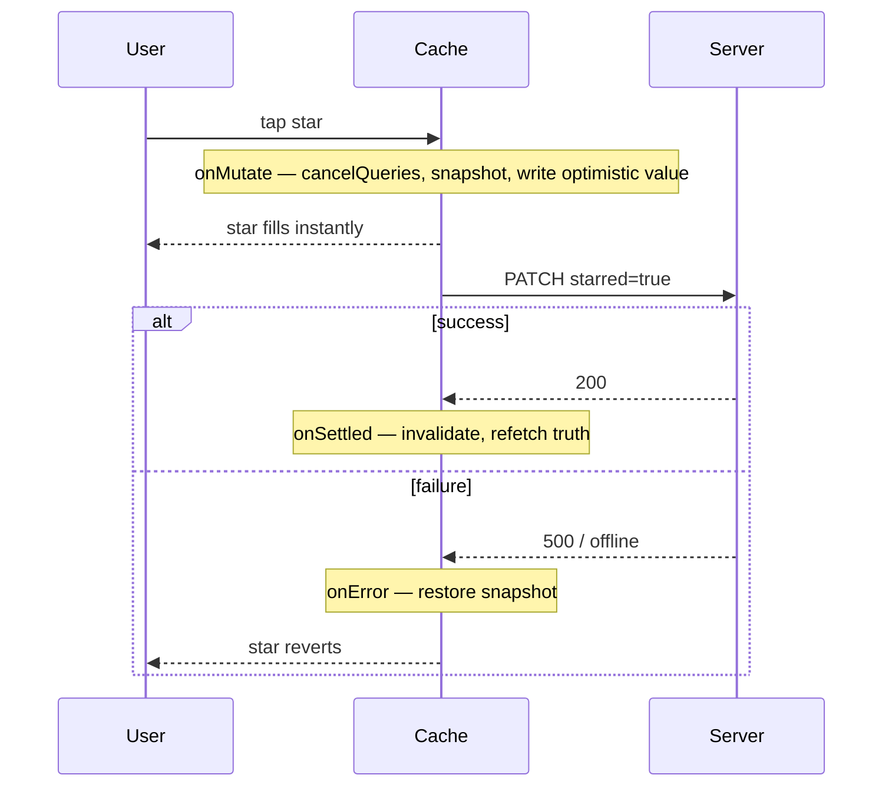

# Optimistic Updates

> Show the result before the server confirms it. The UI feels instant — but only if every optimistic write is paired with a rollback for when the server says no.

**Part:** [03 · Application Architecture](../) · **Domain:** Data & Server State · **Priority:** Critical · **Difficulty:** Intermediate · **Reading time:** ~12 min

## TL;DR

An optimistic update writes the expected result into the cache immediately, before the server responds, so the UI reacts with zero perceived latency. The bet is that the write will succeed; when it does, you reconcile with the server's real value, and when it fails, you roll the cache back to the snapshot you took first. The three-step shape is fixed: cancel in-flight refetches so they can't clobber your optimistic value, snapshot the previous cache, apply the change — then restore the snapshot on error and invalidate on settle. Skip the rollback and a failed write leaves the UI showing a change that never happened.

> **Recommendation:** Use optimistic updates for high-frequency, low-stakes, near-always-successful writes (toggles, reorders, likes). Always pair them with a snapshot-and-rollback in `onError` and a reconciling invalidation in `onSettled`. For rare or high-stakes writes, prefer the simpler pending-then-invalidate flow.

## At a Glance

| | |
| --- | --- |
| **Use when** | Frequent, low-risk writes that almost always succeed and where latency is felt (toggles, reorder, star). |
| **Avoid when** | Writes that often fail, need server-assigned data before display, or are high-stakes (payments). |
| **Alternatives** | [Pending-then-invalidate](#alternative-approaches) (the mutation lifecycle default) for simpler, rarer writes. |
| **Primary risk** | A failed write that isn't rolled back, leaving the UI showing a phantom change. |
| **Maturity** | Stable. |

## Prerequisites

- [Mutation Lifecycle](./mutation-lifecycle.md) — `onMutate`, `onError`, and `onSettled` are the hook points.
- [Cache Keys & Query Identity](./cache-keys-and-query-identity.md) — you snapshot and write by exact key.

## Overview

An *optimistic update* applies a mutation's expected outcome to the client cache at the moment the user acts, rather than waiting for the server to confirm. The alternative — the default mutation flow — shows a pending state, waits for the response, then invalidates and refetches; correct, but it makes the user wait a full round trip to see their own action. Optimistic updates remove that wait by assuming success and correcting only if the assumption breaks.

The correctness of the pattern rests entirely on the rollback. Because you wrote a value the server hasn't confirmed, you must be able to undo it. The mechanism is a snapshot: in `onMutate`, cancel any outgoing refetches for the affected key (so a settling background request can't overwrite your optimistic value), read and save the current cache value, then write the optimistic one. Return the snapshot; if the mutation errors, `onError` restores it; in `onSettled`, invalidate the key so the cache converges on the server's truth. Miss any step and the pattern degrades from "instant and correct" to "instant and occasionally lying."

## The Problem

A task list has a star toggle. With the default flow, tapping the star shows a spinner for 300 ms while the PATCH round-trips, then the star fills. Users tap stars quickly across many rows; a spinner per tap makes the whole interaction feel laggy and uncertain. The team switches to writing the starred state into the cache on tap — instant, satisfying.

Then a request fails: the user is offline for a moment, or the server rejects the change. The star stays filled, because nothing undid the optimistic write. The user believes the task is starred; the server disagrees; the next refetch silently un-stars it, and now the UI "randomly loses" their action. The instant feel came for free; the correctness did not. The missing piece is the rollback, and it is missing precisely because the happy path worked so well that the failure path never got written.

## Why It Matters

Optimistic updates are how high-frequency interactions feel native rather than web-laggy — the difference between a toggle that responds to the finger and one that responds after a network hop. For interactions users perform dozens of times in a session, that round trip is the entire perceived quality of the feature.

But the pattern moves a correctness guarantee from the server to your code. The default flow can't show a change the server didn't accept, because it waits for acceptance; the optimistic flow can, and does, unless you handle the failure. That makes rollback non-optional: an optimistic update without a rollback is not a faster version of the write, it is a write that lies when the network misbehaves. Understanding this trade — you are trading a built-in guarantee for latency, and you must rebuild the guarantee yourself — is what separates a delightful feature from a data-integrity bug that only appears on flaky connections.

## Mental Model

Treat the cache as a whiteboard you're allowed to write on before the meeting confirms the decision — but you photograph the board first. If the meeting ratifies your write, great; if it rejects it, you restore the photo. The photograph is the snapshot from `onMutate`; the restore is `onError`; wiping the board and re-reading the official minutes is the `onSettled` invalidation.



The one subtlety is `cancelQueries`. Between your optimistic write and the server's response, a background refetch might be in flight; if it resolves after you wrote, it overwrites your optimistic value with old server data and the UI flickers. Cancelling outgoing refetches for the key in `onMutate` closes that race. It is the least obvious of the three steps and the one most often omitted.

## Best Practices

Follow the fixed three-step `onMutate`: cancel, snapshot, write. `await queryClient.cancelQueries({ queryKey })` first, then `getQueryData` to snapshot, then `setQueryData` to apply the optimistic value. Return the snapshot so `onError` can restore it. The order matters — cancel before snapshot, or you might snapshot a value a settling refetch is about to change.

Always restore the snapshot in `onError`. This is the guarantee you traded away and must rebuild. Read the snapshot from the mutation context and `setQueryData` it back. An optimistic mutation with an empty or missing `onError` is the anti-pattern, not a shortcut.

Reconcile with the server in `onSettled`. Invalidate the affected key so the cache converges on the server's real value after either outcome. The optimistic value was a guess; `onSettled` replaces the guess with truth, catching cases where the server accepted the write but normalized it (trimmed a string, assigned a timestamp).

Reserve optimism for writes that almost always succeed and are low-stakes. Toggles, reorders, adding a tag — cheap to undo, rarely rejected. Do not apply it to payments, irreversible actions, or writes that depend on server-assigned data (an id, a computed total) you can't predict client-side.

Make the rollback visible when it happens. A silent revert is confusing; the user saw their action succeed. On rollback, surface a brief, accessible message ("Couldn't save — try again") so the reversion reads as a handled failure, not a glitch.

## Trade-offs

Optimistic updates trade a correctness guarantee for latency, and add the code to rebuild that guarantee. For the right writes the trade is strongly positive; for the wrong ones it is a liability.

**Advantages**

- Zero perceived latency; the UI responds to the action, not the network.
- Makes high-frequency interactions feel native.
- Reconciliation in `onSettled` still lands the server's authoritative value.

**Disadvantages**

- You must implement snapshot-and-rollback; forgetting it corrupts the UI on failure.
- The `cancelQueries` race is easy to miss and causes intermittent flicker.
- Wrong for writes that fail often or need server-assigned data before display.

| Dimension | Optimistic update | Cost / caveat |
| --- | --- | --- |
| Performance | Instant perceived response | Extra cache reads/writes per mutation |
| Complexity | Three-step `onMutate` + rollback | More moving parts than pending-then-invalidate |
| Maintainability | Isolated in the mutation | Every optimistic write needs its own rollback |
| Failure behavior | Rolls back to snapshot if done right | Silently lies if rollback is omitted |

## Alternative Approaches

The alternative is the plain mutation flow — show pending, wait, invalidate — which keeps the server's guarantee at the cost of a visible round trip.

| Approach | Best when | Weakness | See |
| --- | --- | --- | --- |
| Optimistic update (this article) | Frequent, low-stakes, near-always-successful writes | Needs hand-built rollback | (this article) |
| Pending-then-invalidate | Rare or high-stakes writes; simplicity wins | User waits a round trip | [Mutation Lifecycle](./mutation-lifecycle.md) |
| Rollback & conflict resolution | Concurrent edits can conflict | More logic to merge/resolve | *Rollback & Conflict Resolution* (planned — see the [domain index](./README.md)) |

## Bad Example

An optimistic write with no rollback — instant, and wrong on failure.

```tsx
import { useMutation, useQueryClient } from '@tanstack/react-query';
import { taskKeys } from './task-keys';

// ❌ Writes the optimistic value but never snapshots or rolls back. A failed
// PATCH leaves the star filled; the next refetch silently reverts it.
function useToggleStar() {
  const queryClient = useQueryClient();
  return useMutation({
    mutationFn: toggleStar,
    onMutate: (taskId: string) => {
      queryClient.setQueryData(taskKeys.detail(taskId), (old: Task | undefined) =>
        old ? { ...old, starred: !old.starred } : old,
      );
    },
  });
}
```

**What goes wrong:** No snapshot, no `onError`, no `cancelQueries`. On a failed request the optimistic star stays until a background refetch quietly undoes it, so the user's action appears to succeed and then vanish — the classic "flaky connection loses my taps" bug.

## Good Example

The complete three-step pattern with rollback and reconciliation.

```tsx
import { useMutation, useQueryClient } from '@tanstack/react-query';
import { taskKeys } from './task-keys';

interface Task {
  id: string;
  title: string;
  starred: boolean;
}

async function toggleStar(taskId: string): Promise<Task> {
  const response = await fetch(`/api/tasks/${taskId}/star`, { method: 'PATCH' });
  if (!response.ok) {
    throw new Error(`Failed to toggle star (${response.status})`);
  }
  return (await response.json()) as Task;
}

function useToggleStar() {
  const queryClient = useQueryClient();

  return useMutation({
    mutationFn: toggleStar,
    onMutate: async (taskId) => {
      // 1. Cancel outgoing refetches so a settling request can't overwrite us.
      await queryClient.cancelQueries({ queryKey: taskKeys.detail(taskId) });
      // 2. Snapshot the current value for rollback.
      const previous = queryClient.getQueryData<Task>(taskKeys.detail(taskId));
      // 3. Apply the optimistic value.
      queryClient.setQueryData<Task>(taskKeys.detail(taskId), (old) =>
        old ? { ...old, starred: !old.starred } : old,
      );
      return { previous };
    },
    onError: (_error, taskId, context) => {
      // ✅ Restore the snapshot: undo the change the server rejected.
      if (context?.previous) {
        queryClient.setQueryData(taskKeys.detail(taskId), context.previous);
      }
    },
    onSettled: (_data, _error, taskId) => {
      // Reconcile with the server's authoritative value.
      void queryClient.invalidateQueries({ queryKey: taskKeys.detail(taskId) });
    },
  });
}
```

**Why it's better:** Every step of the guarantee is present. `cancelQueries` closes the overwrite race, the snapshot enables a real rollback, `onError` restores it, and `onSettled` reconciles with the server. The UI is instant on the happy path and self-corrects on failure instead of lying.

## Production Example

An optimistic list write — adding a tag to an invoice that appears in a filtered list — snapshotting and restoring the list entry, with an accessible failure message on rollback.

```tsx
import { useMutation, useQueryClient } from '@tanstack/react-query';
import { invoiceKeys, type InvoiceFilters } from './invoice-keys';

interface Invoice {
  id: string;
  number: string;
  tags: string[];
}

async function addTag(input: { id: string; tag: string }): Promise<Invoice> {
  const response = await fetch(`/api/invoices/${input.id}/tags`, {
    method: 'POST',
    headers: { 'content-type': 'application/json' },
    body: JSON.stringify({ tag: input.tag }),
  });
  if (!response.ok) {
    throw new Error(`Failed to add tag (${response.status})`);
  }
  return (await response.json()) as Invoice;
}

export function useAddInvoiceTag(filters: InvoiceFilters, onFailure: (message: string) => void) {
  const queryClient = useQueryClient();
  const listKey = invoiceKeys.list(filters);

  return useMutation({
    mutationFn: addTag,
    onMutate: async ({ id, tag }) => {
      await queryClient.cancelQueries({ queryKey: listKey });
      const previous = queryClient.getQueryData<Invoice[]>(listKey);
      queryClient.setQueryData<Invoice[]>(listKey, (old) =>
        old?.map((invoice) =>
          invoice.id === id
            ? { ...invoice, tags: [...invoice.tags, tag] }
            : invoice,
        ),
      );
      return { previous };
    },
    onError: (_error, _variables, context) => {
      if (context?.previous) {
        queryClient.setQueryData(listKey, context.previous);
      }
      // Make the reversion legible instead of a silent flicker.
      onFailure('Couldn’t add the tag — please try again.');
    },
    onSettled: () => {
      void queryClient.invalidateQueries({ queryKey: invoiceKeys.lists() });
    },
  });
}
```

## Common Mistakes

See the [Data & Server State anti-patterns](../../../anti-patterns/README.md#data-server-state) for the domain catalog. Concept-specific:

### Mistake: Optimistic write without rollback

- **Symptom:** `onMutate` applies a change; there is no `onError` restore.
- **Why it fails:** A failed write leaves the UI showing a change the server rejected; the next refetch silently reverts it.
- **Fix:** Snapshot in `onMutate`, restore in `onError`. This pitfall is documented in [Optimistic updates without rollback](../../../anti-patterns/optimistic-update-without-rollback.md).

### Mistake: Skipping `cancelQueries`

- **Symptom:** The optimistic value occasionally flickers back to old data before settling.
- **Why it fails:** A background refetch in flight resolves after your write and overwrites it.
- **Fix:** `await queryClient.cancelQueries({ queryKey })` as the first step of `onMutate`.

## Checklist

- [ ] `onMutate` does cancel → snapshot → write, in that order, and returns the snapshot.
- [ ] `onError` restores the snapshot for the exact key.
- [ ] `onSettled` invalidates to reconcile with the server's value.
- [ ] Optimism is applied only to frequent, low-stakes, near-always-successful writes.
- [ ] A rollback surfaces an accessible message so the reversion reads as handled.

## Related Articles

- [Mutation Lifecycle](./mutation-lifecycle.md) — the callbacks optimism hooks into.
- [Cache Invalidation](./cache-invalidation.md) — the reconciliation step in `onSettled`.
- *Rollback & Conflict Resolution* handles concurrent-edit conflicts (planned — see the [Data & Server State index](./README.md)).

## Related Recipes

- [Optimistic list mutation with rollback](../../../recipes/optimistic-list-mutation.md) — the full pattern applied to a list.

## Related Examples

- [Optimistic update with rollback](../../../examples/optimistic-update-with-rollback.tsx) — the minimal cancel/snapshot/rollback shape.

## References

- [TanStack Query — Optimistic Updates](https://tanstack.com/query/latest/docs/framework/react/guides/optimistic-updates) — the cache-write approach with rollback.
- [TanStack Query — Mutations](https://tanstack.com/query/latest/docs/framework/react/guides/mutations) — `onMutate`/`onError`/`onSettled` semantics.
