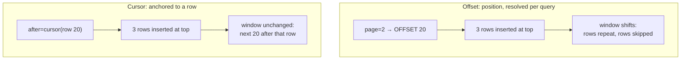

# Pagination

> A page is a coordinate into a collection, and the only question that matters is whether that coordinate still means the same thing after the data changes underneath it. Offsets don't; cursors do.

**Part:** [03 · Application Architecture](../) · **Domain:** Data & Server State · **Priority:** Critical · **Difficulty:** Intermediate · **Reading time:** ~12 min

## TL;DR

Pagination splits a collection into addressable slices so the client fetches and renders a bounded amount of data. The core decision is how a page is addressed: an *offset* ("skip 40, take 20") is shareable and lets you jump to page 5, but shifts under concurrent inserts and deletes, so rows get duplicated or skipped. A *cursor* ("everything after this record") is stable under writes but only moves forward and backward one page at a time. On the client, the page identifier belongs in the query key together with every filter and sort input, and the previous page should stay on screen while the next one loads.

> **Recommendation:** Use cursor pagination for feeds and anything write-heavy; use offset pagination when users need numbered, linkable, jumpable pages over reasonably stable data. Put page *and* all filters in the query key, keep the previous page visible with `placeholderData`, and mirror page state in the URL.

## At a Glance

| | |
| --- | --- |
| **Use when** | A collection is too large to fetch at once and users consume it in discrete chunks — tables, search results, admin lists. |
| **Avoid when** | The collection is small and stable (fetch it once), or the interaction is a continuous scroll (see infinite loading). |
| **Alternatives** | None as a category — the real choice is *which* pagination scheme; see [the comparison](#alternative-approaches). |
| **Primary risk** | Offset drift under concurrent writes, and a page key that omits the active filters. |
| **Maturity** | Stable. |

## Prerequisites

- [Mutation Lifecycle](./mutation-lifecycle.md) — a write into a paginated list is what makes offsets drift and page caches disagree.
- [Cache Keys & Query Identity](./cache-keys-and-query-identity.md) — each page is a separate cache entry, so the key must carry the page and the filters.

## Overview

*Pagination* is the contract by which a client asks for one bounded slice of a collection and learns how to ask for the next. Two schemes dominate. **Offset pagination** addresses a slice positionally — `?page=3&per_page=20`, or `LIMIT 20 OFFSET 40` on the server — which makes any page directly reachable and any page link shareable. **Cursor pagination** addresses a slice relationally — `?after=eyJpZCI6...&limit=20` — where the cursor encodes the sort position of the last row seen, so the server answers "the next 20 rows after that position" regardless of what has been inserted since.

The distinction is not a matter of taste; it is a data-consistency property. An offset is an index into a result set that only exists for the duration of one query. If three rows are inserted at the top of the collection while the user reads page 1, then page 2 fetched with `OFFSET 20` starts three rows *earlier* in the new ordering, so the user sees three rows twice and may never see three others. A cursor is anchored to a row, not a count, so it survives inserts and deletes anywhere else in the collection. Client-side, both schemes look the same — a page identifier in the query key — which is exactly why the failure mode is easy to miss until a report of "duplicate rows in the table" arrives.

## The Problem

An admin orders table paginates 20 per page with `?page=N`. Three problems surface within a month of launch.

First, duplicates. Orders arrive constantly, so by the time an operator clicks "next," the offset points somewhere else in the ordering — rows appear on both page 2 and page 3, and some rows are never shown at all. The operator's job is to process every order, so a silently skipped row is a business incident, not a UI nit.

Second, the table blanks on every page change. The query key changes from `page: 2` to `page: 3`, the new key has no cached data, `isLoading` flips true, and the whole table is replaced by a skeleton — losing scroll position and collapsing the layout for 300 ms per click. Paging through ten pages feels like ten separate page loads.

Third, filters and pages get out of sync. Page state lives in the query key but the search box lives in component state, so the key is `['orders', page]` while the request URL includes `&status=pending`. Switching the filter re-renders with the same key, so the cache serves page 3 of the *previous* filter, and the user sees pending orders under a "shipped" filter until something forces a refetch. All three problems come from the same two decisions: how a page is addressed, and what the page's cache identity includes.

## Why It Matters

Pagination is where correctness and perceived performance meet. Fetching a bounded slice is what keeps payloads, parse time, and memory flat as a collection grows from a thousand rows to a million — without it, response size scales with the dataset and the client eventually falls over. That much is obvious. What teams underestimate is that the addressing scheme is a *correctness* decision: with offsets, a user working through a live queue can miss records entirely, and no amount of client-side polish fixes it. Any workflow where "process every item" matters — moderation, fulfillment, reconciliation — needs cursors.

The client-side half determines whether the feature feels like software or like a document. Each page is a distinct cache entry, so paging naively means a loading state per click; keeping the previous page rendered while the next arrives turns ten jarring reloads into ten soft transitions. And because page and filter state describe *what the user is looking at*, they belong in the URL: a table view that cannot be linked, bookmarked, or restored after a refresh loses the property users most expect from a paginated list.

## Mental Model

Think of each page as an independent query with its own identity, not as a mutable window over one collection. The page identifier is part of that identity, alongside every filter and sort input. Under offset addressing, that identity is a *position* that the server resolves against whatever the collection looks like right now; under cursor addressing, it is an *anchor row* that resolves the same way regardless of concurrent writes.



On the client, the consequence is a cache keyed per page: `['orders', 'list', { status, sort, page }]`. Each entry is fetched, cached, and invalidated independently, which is why a mutation must invalidate the *list* prefix rather than one page (see [Cache Invalidation](./cache-invalidation.md)), and why the previous page's entry is still in cache and can be shown while the next loads. Hold on to that framing — "each page is its own query" — and the rest of the design follows: no cross-page mutation of a single array, no shared loading flag, no filter that lives outside the key.

## Best Practices

Put every input that changes the response in the key. Page, page size, sort field, sort direction, search term, and each filter. If it appears in the request URL, it belongs in the key — otherwise the cache will serve one filter's page under another filter's view.

Keep the previous page on screen while the next loads. `placeholderData: keepPreviousData` renders the old page's rows during the fetch, so the table keeps its height and the user gets a soft transition. Signal the fetch with `isPlaceholderData` or `isFetching`, not with a skeleton that replaces the content.

Prefetch exactly one page ahead. "Next" is the strongest prediction in a paginated list and costs a single request; the [paginated query with prefetch](../../../recipes/paginated-query-with-prefetch.md) recipe wires this up. Do not prefetch all pages.

Mirror page and filters in the URL. Read them from the URL as the source of truth and write them back on change. This gives you shareable links, working back/forward navigation, and correct state after a reload, for very little code.

Use a stable, total sort order. Cursor pagination requires it — sorting by a non-unique column alone (`created_at` with ties) makes cursors ambiguous, so include a tiebreaker such as the primary key. Offset pagination needs it too, or "page 2" is not reproducible.

Have the server return what the client needs to navigate. For cursors: the next and previous cursors and boolean `hasNextPage`/`hasPreviousPage`. For offsets: total count *only if* the UI shows page numbers, since an exact count over a large table is often the most expensive part of the query. If the UI just needs "is there more," ask for `limit + 1` rows and drop the extra.

Clamp and validate the requested page. A user-supplied `?page=9999` or `?per_page=100000` must be bounded server-side; unvalidated page size is a denial-of-service vector, not just a bad experience.

Reset to the first page when filters change. Page 7 of a new filter is almost never what the user meant, and it frequently does not exist.

## Trade-offs

Pagination trades the simplicity of "one request, all the data" for bounded payloads and bounded memory — an unconditional win at scale. The interesting trade-offs are between the schemes: offsets buy random access at the cost of consistency, cursors buy consistency at the cost of random access.

**Advantages**

- Payload, parse cost, and memory stay flat as the collection grows.
- Pages are independently cacheable and invalidatable.
- With offsets, any page is directly addressable and linkable.

**Disadvantages**

- Offsets drift under concurrent writes: duplicated and skipped rows.
- Cursors cannot jump to an arbitrary page or show "page 7 of 40" without extra work.
- Deep offsets are slow server-side; the database must count past every skipped row.
- Client cache holds one entry per page, so invalidation must operate on a prefix.

| Dimension | Offset pagination | Cursor pagination |
| --- | --- | --- |
| Consistency under writes | Rows duplicate or vanish between pages | Stable — anchored to a row |
| Random access | Any page directly; supports "page 7 of 40" | Sequential only; totals need a separate query |
| Server cost at depth | Degrades — deep `OFFSET` scans and discards | Flat — indexed seek from the anchor |
| Shareable URLs | Natural (`?page=3`) | Opaque cursor in the URL; less human-friendly |
| Client complexity | Lowest | Must thread cursors through state |

## Alternative Approaches

Pagination as a category has no substitute — a collection too large to send must be sliced somehow, which is why `alternatives` is empty in this article's metadata. The real decision is *which* scheme, and whether the presentation is discrete pages or a continuous list.

| Approach | Best when | Weakness | See |
| --- | --- | --- | --- |
| Offset pagination | Numbered, linkable, jumpable pages over reasonably stable data | Drifts under concurrent writes; slow at depth | (this article) |
| Cursor pagination | Live or write-heavy collections; correctness matters per row | No random access; totals cost extra | (this article) |
| Infinite / cursor loading | Feeds and browsing flows where "next page" is a scroll | Unreachable footer, memory growth, hard to link a position | [Infinite & Cursor Loading](./infinite-and-cursor-loading.md) |
| Fetch-all + client paging | Small, bounded collections (hundreds of rows) | Payload and memory scale with the dataset | [Parallel vs Waterfall Requests](./parallel-vs-waterfall-requests.md) |

## Bad Example

Offset paging with the filter outside the key and no continuity between pages.

```tsx
import { useState } from 'react';
import { useQuery } from '@tanstack/react-query';

// ❌ Two defects that interact badly.
function OrdersTable() {
  const [page, setPage] = useState(1);
  const [status, setStatus] = useState<'pending' | 'shipped'>('pending');

  const { data, isLoading } = useQuery({
    // (1) `status` is in the request but NOT in the key. Switching the filter
    //     reuses the cached page of the previous filter.
    queryKey: ['orders', page],
    queryFn: () =>
      fetch(`/api/orders?page=${page}&status=${status}`).then((r) => r.json()),
  });

  // (2) Every page change is a new key with no data, so the entire table is
  //     replaced by a spinner — layout collapses, scroll position is lost.
  if (isLoading) return <Spinner />;

  return (
    <>
      <FilterSelect value={status} onChange={setStatus} />
      <Rows rows={data.items} />
      {/* No clamping: "next" can walk past the last page forever. */}
      <button onClick={() => setPage((p) => p + 1)}>Next</button>
    </>
  );
}
```

**What goes wrong:** Because `status` is missing from the key, the cache identity lies about what the entry contains — the user switches to "shipped" and sees cached pending orders, a stale-data bug that looks random and is hard to reproduce. Gating the whole table on `isLoading` throws away the previous page on every click. And with no `hasNextPage` check, "Next" happily requests empty pages past the end. Underneath all three, offset addressing means a busy orders table duplicates and skips rows regardless of how good the client code is.

## Good Example

Offset paging done properly: complete key, URL as the source of truth, previous page retained, next page bounded and prefetched.

```tsx
import { useEffect } from 'react';
import {
  keepPreviousData,
  useQuery,
  useQueryClient,
} from '@tanstack/react-query';
import { useSearchParams } from 'react-router-dom';

interface Order {
  id: string;
  reference: string;
  status: 'pending' | 'shipped';
}

interface OrdersPage {
  items: readonly Order[];
  page: number;
  pageCount: number;
  hasNextPage: boolean;
}

interface OrdersFilters {
  page: number;
  status: Order['status'];
  sort: 'created_desc' | 'created_asc';
}

// ✅ Every input that varies the response is in the key, via one factory.
function ordersPageQuery(filters: OrdersFilters) {
  const params = new URLSearchParams({
    page: String(filters.page),
    status: filters.status,
    sort: filters.sort,
  });

  return {
    queryKey: ['orders', 'list', filters] as const,
    queryFn: async ({ signal }: { signal: AbortSignal }): Promise<OrdersPage> => {
      const response = await fetch(`/api/orders?${params}`, { signal });
      if (!response.ok) {
        throw new Error(`Failed to load orders (${response.status})`);
      }
      return (await response.json()) as OrdersPage;
    },
    staleTime: 30_000,
  };
}

export function OrdersTable() {
  // ✅ URL is the source of truth: links, bookmarks, and back/forward work.
  const [searchParams, setSearchParams] = useSearchParams();
  const filters: OrdersFilters = {
    page: Math.max(1, Number(searchParams.get('page') ?? 1)),
    status: (searchParams.get('status') as Order['status']) ?? 'pending',
    sort: (searchParams.get('sort') as OrdersFilters['sort']) ?? 'created_desc',
  };

  const queryClient = useQueryClient();
  const { data, isLoading, isError, error, isPlaceholderData } = useQuery({
    ...ordersPageQuery(filters),
    // ✅ Previous page stays rendered while the next loads: no layout collapse.
    placeholderData: keepPreviousData,
  });

  // ✅ One page ahead, and only when there is one.
  useEffect(() => {
    if (!data?.hasNextPage) return;
    void queryClient.prefetchQuery(
      ordersPageQuery({ ...filters, page: filters.page + 1 }),
    );
  }, [data?.hasNextPage, filters, queryClient]);

  const go = (next: Partial<OrdersFilters>) => {
    setSearchParams((current) => {
      const params = new URLSearchParams(current);
      for (const [key, value] of Object.entries(next)) {
        params.set(key, String(value));
      }
      // ✅ Changing a filter resets to page 1 — page 7 of a new filter is meaningless.
      if (next.status || next.sort) params.set('page', '1');
      return params;
    });
  };

  if (isLoading) return <TableSkeleton rows={10} />;
  if (isError) return <p role="alert">Couldn’t load orders: {error.message}</p>;

  return (
    <section aria-busy={isPlaceholderData}>
      <FilterSelect value={filters.status} onChange={(status) => go({ status })} />

      <Rows rows={data.items} dimmed={isPlaceholderData} />

      <nav aria-label="Pagination">
        <button
          onClick={() => go({ page: filters.page - 1 })}
          disabled={filters.page <= 1 || isPlaceholderData}
        >
          Previous
        </button>
        <span aria-live="polite">
          Page {data.page} of {data.pageCount}
        </span>
        <button
          onClick={() => go({ page: filters.page + 1 })}
          // ✅ Bounded by the server's answer, not by optimism.
          disabled={!data.hasNextPage || isPlaceholderData}
        >
          Next
        </button>
      </nav>
    </section>
  );
}
```

**Why it's better:** The key contains page, status, and sort, so a cache entry can only be served to the view that asked for it. `keepPreviousData` plus `isPlaceholderData` turns each page change into a dimmed transition rather than a skeleton, and `aria-busy` with an `aria-live` page indicator announces it to assistive technology. Navigation is bounded by the server's `hasNextPage` and `pageCount`, filters reset the page, and every bit of view state is in the URL.

## Production Example

For a live collection, cursor pagination is the correct scheme — and the client-side shape barely changes. The cursor for the *current* page is what goes in the key, and the server returns the cursors for the neighbours.

```tsx
import { keepPreviousData, useQuery } from '@tanstack/react-query';

interface Cursors {
  next: string | null;
  previous: string | null;
}

interface CursorPage<T> {
  items: readonly T[];
  cursors: Cursors;
}

/**
 * The cursor identifies the page. `null` means "the first page", which keeps
 * the key stable for the initial view instead of leaving it undefined.
 */
function auditLogQuery(cursor: string | null, pageSize = 25) {
  const params = new URLSearchParams({ limit: String(pageSize) });
  if (cursor) params.set('after', cursor);

  return {
    queryKey: ['audit-log', 'page', { cursor, pageSize }] as const,
    queryFn: async ({
      signal,
    }: {
      signal: AbortSignal;
    }): Promise<CursorPage<AuditEntry>> => {
      const response = await fetch(`/api/audit-log?${params}`, { signal });
      if (response.status === 400) {
        // An expired or malformed cursor is recoverable: fall back to page one
        // rather than trapping the user on a broken view.
        throw new InvalidCursorError();
      }
      if (!response.ok) {
        throw new Error(`Failed to load audit log (${response.status})`);
      }
      return (await response.json()) as CursorPage<AuditEntry>;
    },
    staleTime: 60_000,
    retry: (failureCount: number, error: Error) =>
      error instanceof InvalidCursorError ? false : failureCount < 2,
  };
}

export class InvalidCursorError extends Error {
  constructor() {
    super('Cursor is no longer valid');
    this.name = 'InvalidCursorError';
  }
}

export function useAuditLogPage(cursor: string | null) {
  return useQuery({
    ...auditLogQuery(cursor),
    placeholderData: keepPreviousData,
  });
}
```

Two production details matter here. Cursors expire — they encode a sort position that can become invalid after a schema change or a purge — so an invalid cursor must be a *recoverable* error that resets to the first page, not a retry loop against a request that will never succeed. And because the cursor is opaque, a bookmarked URL containing one can break in a way `?page=3` never does; storing the cursor in the URL is still worth it for back/forward navigation, but the first-page fallback is what makes it safe.

## Common Mistakes

See the [Data & Server State anti-patterns](../../../anti-patterns/#data-server-state) for the domain catalog. Concept-specific:

### Mistake: Filters and sort outside the query key

- **Symptom:** Changing a filter briefly shows the previous filter's rows, or a page seems to "remember" the wrong data.
- **Why it fails:** The cache key no longer identifies the response, so entries are served to views that asked for something else.
- **Fix:** Build the key from a single filters object that includes page, page size, sort, and every filter.

### Mistake: Offset pagination over a live collection

- **Symptom:** Rows appear on two consecutive pages; items are reported missing from a queue.
- **Why it fails:** An offset is a position in a result set that is recomputed per request, so concurrent inserts and deletes shift the window between pages.
- **Fix:** Switch to cursor pagination for write-heavy collections, or freeze the ordering with a snapshot timestamp the server honors.

### Mistake: Replacing the table with a skeleton on every page change

- **Symptom:** Layout collapses and scroll position resets on each "Next" click.
- **Why it fails:** A new page is a new cache key with no data, so `isLoading` is true and the content unmounts.
- **Fix:** `placeholderData: keepPreviousData` plus an `isPlaceholderData` affordance; reserve the skeleton for the genuine first load.

### Mistake: Unbounded page and page-size parameters

- **Symptom:** `?page=99999` returns an empty view; `?per_page=50000` returns a huge payload or times out.
- **Why it fails:** User-controlled bounds become a cost multiplier on the server, and a deep offset scans and discards everything before it.
- **Fix:** Clamp page size server-side, cap reachable depth, and derive navigation from `hasNextPage`/`pageCount` rather than optimism.

## Checklist

- [ ] Page, page size, sort, and every filter are in the query key.
- [ ] The scheme matches the data: cursors for live/write-heavy collections, offsets for stable, jumpable lists.
- [ ] Sort order is total (includes a unique tiebreaker), so pages are reproducible.
- [ ] The previous page stays rendered while the next loads, with a visible and announced busy state.
- [ ] Navigation is bounded by server-reported `hasNextPage`/`pageCount`; page size is clamped server-side.
- [ ] Page and filter state live in the URL and survive reload, back, and forward.
- [ ] Changing a filter resets to the first page.
- [ ] Mutations invalidate the list *prefix*, not a single page's key.

## Related Articles

- [Infinite & Cursor Loading](./infinite-and-cursor-loading.md) — the same slicing presented as one continuously growing list.
- [Cache Invalidation](./cache-invalidation.md) — why a write must invalidate the list prefix rather than one page.
- [Data Prefetching](./data-prefetching.md) — the next-page prefetch that makes paging feel instant.
- [Cache Keys & Query Identity](./cache-keys-and-query-identity.md) — the identity rules a page key has to satisfy.
- [List Virtualization](./list-virtualization.md) — rendering cost once a page’s rows are in memory.

## Related Recipes

- [Paginated query with prefetch](../../../recipes/paginated-query-with-prefetch.md) — page key, previous-page continuity, and one-page-ahead prefetch together.

## Related Examples

- [Query key factory](../../../examples/query-key-factory.ts) — the factory a paginated key should be built from.

## References

- [TanStack Query — Paginated Queries](https://tanstack.com/query/latest/docs/framework/react/guides/paginated-queries) — page-as-key, `keepPreviousData`, and `isPlaceholderData`.
- [GraphQL Cursor Connections Specification](https://relay.dev/graphql/connections.htm) — the canonical cursor pagination contract: edges, `pageInfo`, `hasNextPage`.
