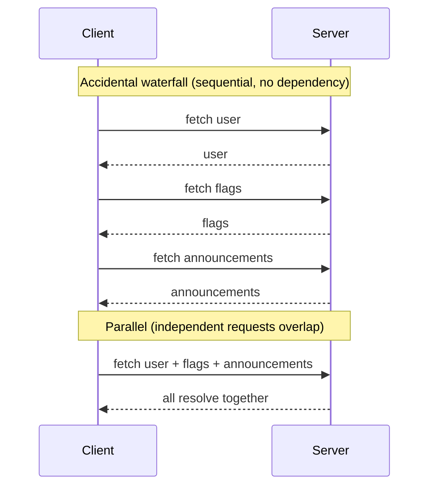

# Parallel vs Waterfall Requests

> Two requests either wait in line or travel together. A waterfall is the line you never meant to form — independent requests serialized by accident, each one paying for the last.

**Part:** [03 · Application Architecture](../) · **Domain:** Data & Server State · **Priority:** Critical · **Difficulty:** Intermediate · **Reading time:** ~15 min

## TL;DR

A request waterfall is a sequence of network calls where each one waits for the previous to finish, even though it did not need to. Some waterfalls are unavoidable — you cannot fetch a user's orders until you know the user's id — but most are accidental: an `await` in a loop, sibling queries that happen to run one after another, or a component tree that discovers its data needs one level at a time. Parallel fetching overlaps every request that has no true dependency, so total wall-clock time collapses toward the *slowest single request* instead of the *sum* of all of them.

> **Recommendation:** Treat every waterfall as accidental until you can name the value that flows from one request into the next. If no such value exists, fire the requests together with `Promise.all` (or independent, unblocked queries). Keep only the chains whose dependency is real, and keep them shallow.

## At a Glance

| | |
| --- | --- |
| **Use when** | Requests are independent — no response feeds the next request's input. Fire them in parallel. |
| **Avoid when** | One request genuinely needs a value from another's response; that chain must stay sequential. |
| **Alternatives** | Deduplicate identical in-flight requests (*Request Deduplication*); start requests earlier (*Data Prefetching*). |
| **Primary risk** | A latency staircase invisible on fast networks and brutal on high-latency ones; it grows with tree depth. |
| **Maturity** | Stable. |

## Prerequisites

- [Fetch-on-Render vs Render-as-You-Fetch](./fetch-on-render-vs-render-as-you-fetch.md) — where render-driven waterfalls come from and why timing dominates perceived speed.

## Overview

*Parallel* and *waterfall* describe the **shape of a request timeline**, not a fetching library or an API. A waterfall runs requests end to end: request B starts only after request A resolves. Parallel fetching starts every independent request at once and lets their latencies overlap. The word "waterfall" comes from the staircase shape these serialized requests draw in a network panel — each bar begins where the one above it ended.

The distinction that matters is not parallel-versus-sequential in the abstract; it is *necessary* versus *accidental* serialization. A necessary waterfall exists because data depends on data: you fetch a user, read their `teamId`, then fetch the team. An accidental waterfall serializes requests that share no such link — two independent lookups that a loop, an `await`, or a component boundary happened to place in sequence. The first kind you keep and keep short. The second kind is pure latency you can delete.

## The Problem

Consider a page that loads three independent things: the current user, the site's feature flags, and a list of announcements. None of them depends on the others. Written naturally with `async`/`await`, the code reads top to bottom and runs top to bottom:

```ts
const user = await fetchUser();
const flags = await fetchFeatureFlags();
const announcements = await fetchAnnouncements();
```

Each `await` pauses the function until its request resolves before the next one is even dispatched. Three requests that could have overlapped now run in a line. At 150 ms round-trip time, that is 450 ms of waiting for data that would have arrived in 150 ms if the three had traveled together. The code looks clean, and on a fast office connection the difference is imperceptible — which is exactly why the waterfall survives review and ships.

The component-tree version of this problem is subtler. A parent fetches its data, renders, passes an id to a child, and only then does the child begin its own fetch. The waterfall is spread across render boundaries instead of `await` statements, but the shape is identical: sequential requests with no dependency between them. That render-driven variant is the subject of [Fetch-on-Render vs Render-as-You-Fetch](./fetch-on-render-vs-render-as-you-fetch.md); here we focus on the imperative and query-level shapes.

## Why It Matters

Perceived performance is governed by when the last byte a user is waiting for arrives. A waterfall stacks those waits; parallelism overlaps them. Collapsing a three-request waterfall does not make any single request faster — it removes two full round trips of dead time, and on mobile networks a round trip is the dominant cost, far larger than server processing or payload size.

The cost is also structural. A waterfall's depth tends to track something that grows: the number of sections on a dashboard, the nesting depth of a component tree, the length of a list you fetch one item at a time. No single commit introduces a "slow page"; the page accretes steps until a screen that felt instant at three requests feels sluggish at eight. Fixing the shape once — fanning independent requests out in parallel — caps the cost at the slowest single request regardless of how many you add, which is why this is an architectural habit and not a one-off optimization.

## Mental Model

Picture each request as a runner and the network round trip as the length of the track. A waterfall makes them run a relay: runner two waits at the line holding the baton until runner one arrives. Parallel fetching starts every runner at the gun. If the batons are real — runner two literally cannot start without what runner one carries — you have a relay and must run it as one. If the batons are imaginary, you are making runners wait for a handoff that carries nothing.



The test is mechanical: for each request, ask *what input does it need, and where does that input come from?* If the input is a route param, a constant, or already in hand, the request can start now — it belongs in the parallel batch. If the input is a field from another request's response, that one edge is a real dependency; keep it sequential and fan out everything downstream of it in parallel again. Most real screens are a shallow tree of parallel fan-outs with one or two genuine dependency edges, not a single long chain.

## Best Practices

Fan out independent requests with `Promise.all`. When several requests share no dependency, dispatch them together and await the group. `Promise.all` starts every promise the moment the array is constructed, so the requests overlap; it resolves when the slowest finishes. Use `Promise.allSettled` instead when a single failure should not discard the others' results.

Break false chains hiding behind `await`. A row of sequential `await` statements is the most common accidental waterfall. If none of the awaited values feeds the next call, assign the *promises* first and await them together — start the requests, then collect them.

Keep necessary chains, but shorten them. A real dependency (fetch the user, then the user's team) is a legitimate two-step waterfall. Question every step beyond the first: often a purpose-built endpoint (`/users/:id?include=team`) or a request that takes the id directly can remove a hop. Depth is the enemy; two is usually fine, five is a design smell.

Do not gate a query that does not need gating. In query libraries, a dependent query uses `enabled` to wait for an input. Reserve `enabled` for genuine dependencies. Gating a query on data it never reads silently serializes it behind that data, reintroducing the waterfall the library was meant to remove.

Parallelize with restraint. Firing two hundred requests at once trades a latency problem for a throughput one — browsers cap concurrent connections per origin, and a server can be overwhelmed by a fan-out that a paginated or batched endpoint would serve in one call. When the fan-out is large, prefer a single batch request or a bounded concurrency pool over an unbounded `Promise.all`.

## Trade-offs

Parallel fetching is the better default for independent requests, but "fire everything at once" is not free: it concentrates load, complicates error handling, and can mask a missing batch endpoint.

**Advantages**

- Total time collapses toward the slowest single request instead of the sum.
- Waterfall depth stops tracking tree depth or list length.
- Loading states become one intentional boundary rather than a cascade of nested spinners.

**Disadvantages**

- A large unbounded fan-out concentrates load and can hit per-origin connection limits or overwhelm the server.
- Partial failure is trickier: you must decide whether one rejected request fails the whole group (`Promise.all`) or not (`Promise.allSettled`).
- It can paper over an API gap — twenty parallel requests are often one missing batch endpoint.

| Dimension | Parallel fetching | Cost / caveat |
| --- | --- | --- |
| Performance | Requests overlap; wall-clock time bounded by the slowest one | A huge fan-out shifts the bottleneck from latency to throughput |
| Complexity | One awaited group, one loading boundary | Partial-failure semantics need an explicit choice |
| Maintainability | Adding a request adds a promise, not a step | Easy to overuse where a batch endpoint belongs |
| Failure behavior | `allSettled` isolates failures | `all` rejects on the first failure and discards the rest |

## Alternative Approaches

Parallelizing is one lever on the request timeline; two others solve adjacent problems and often combine with it rather than replacing it. *Request Deduplication* addresses the case where the *same* request is issued more than once concurrently — it collapses duplicates into one in-flight promise, which cuts load but does not reshape independent requests into parallel ones. *Data Prefetching* attacks the timeline from the other end: it starts requests *earlier* (on hover, on route match) so they are already resolving by the time they are needed. Both are planned — see the [Data & Server State index](./README.md). Use deduplication when the waste is repetition, prefetching when the waste is late starts, and parallelization when the waste is needless ordering; a well-tuned data layer usually uses all three.

| Approach | Best when | Weakness | See |
| --- | --- | --- | --- |
| Parallel fetching | Independent requests are running in sequence | Large fan-outs shift cost to throughput | (this article) |
| [Request Deduplication](./request-deduplication.md) | The same request fires multiple times at once | Does nothing for distinct requests | `Request Deduplication · Data & Server State` |
| [Data Prefetching](./data-prefetching.md) | Requests start too late, after render | Speculative fetches can be wasted | `Data Prefetching · Data & Server State` |

## Bad Example

A dashboard loader that awaits three independent requests in sequence, then chains a fourth that does not actually need to wait.

```ts
// ❌ Four requests run in a line. None of the first three depends on another,
// and the fourth only needs `user.id`, which the route already knew.
async function loadDashboard(userId: string) {
  const user = await fetchUser(userId);          // request 1
  const flags = await fetchFeatureFlags();       // request 2 — waits on 1 for no reason
  const announcements = await fetchAnnouncements(); // request 3 — waits on 2 for no reason
  const activity = await fetchActivity(user.id); // request 4 — needs only userId, not `user`

  return { user, flags, announcements, activity };
}
```

**What goes wrong:** Four sequential round trips where at most one edge is real — and even that one is false, because `fetchActivity` needs `userId` (a route param already in hand), not a field from the `user` response. On a 150 ms connection this loader costs ~600 ms; the same data is available in ~150 ms. The waterfall is entirely a product of writing `await` on every line.

## Good Example

The same loader, fanned out. Every request that can start now does, and the result shape is unchanged.

```ts
// ✅ All four requests are independent given `userId`, so dispatch them together.
// Promise.all starts every promise immediately and resolves when the slowest lands.
async function loadDashboard(userId: string) {
  const [user, flags, announcements, activity] = await Promise.all([
    fetchUser(userId),
    fetchFeatureFlags(),
    fetchAnnouncements(),
    fetchActivity(userId), // takes the route param directly — no dependency on `user`
  ]);

  return { user, flags, announcements, activity };
}
```

**Why it's better:** The four requests leave the browser together, so their latencies overlap and the loader's wall-clock time is the single slowest request, not the sum. Adding a fifth independent request adds one line to the array, not one step to a staircase. The only thing that changed is removing three `await` keywords that were silently serializing independent work.

## Production Example

A real screen rarely has zero dependencies. This loader models the honest shape: one genuine dependency edge (comments need the post's author to resolve mentions) wrapped by parallel fan-outs on both sides, with partial-failure handling so a non-critical widget cannot blank the page.

```ts
interface Post {
  id: string;
  authorId: string;
  title: string;
  body: string;
}

interface DashboardData {
  post: Post;
  author: Awaited<ReturnType<typeof fetchUser>>;
  comments: Awaited<ReturnType<typeof fetchComments>>;
  related: Awaited<ReturnType<typeof fetchRelatedPosts>>;
  // Non-critical: absent if its request failed, rather than failing the page.
  recommendations: Awaited<ReturnType<typeof fetchRecommendations>> | null;
}

async function loadPostScreen(
  postId: string,
  signal: AbortSignal,
): Promise<DashboardData> {
  // Level 1: the post is the only thing we can fetch with just the route param.
  const post = await fetchPost(postId, signal);

  // Level 2: everything that needs the post can now run in parallel. The author
  // is a real dependency (post.authorId); the others need only postId, but they
  // were blocked on nothing except being written after the post fetch — so we
  // start them here, together, not one at a time.
  const [author, comments, related, recommendations] = await Promise.all([
    fetchUser(post.authorId, signal),
    fetchComments(postId, signal),
    fetchRelatedPosts(postId, signal),
    // allSettled-style isolation for a non-critical widget: swallow its failure
    // so a recommendations outage degrades gracefully instead of blanking the page.
    fetchRecommendations(postId, signal).catch((error) => {
      console.warn(`Recommendations unavailable for ${postId}:`, error);
      return null;
    }),
  ]);

  return { post, author, comments, related, recommendations };
}
```

**Why it's better:** There is exactly one sequential edge — fetching the post before anything that needs its fields — and it is real. Every request downstream of that edge runs in parallel, so the screen's total latency is *post + slowest-of-the-rest*, not the sum of five requests. The `AbortSignal` threads through every call so an abandoned navigation cancels the whole batch, and the recommendations `catch` isolates a non-essential failure instead of letting `Promise.all` reject the page.

## Common Mistakes

See the [Data & Server State anti-patterns](../../../anti-patterns/README.md#data-server-state) for the domain catalog. The concept-specific mistakes:

### Mistake: `await` inside a loop

- **Symptom:** `for (const id of ids) { results.push(await fetchItem(id)); }` — one request per iteration, each waiting for the last.
- **Why it fails:** It serializes N independent requests into an N-deep waterfall; latency scales linearly with list length and is invisible on fast networks.
- **Fix:** Map to promises and await together — `await Promise.all(ids.map((id) => fetchItem(id)))` — or, for large N, use a batch endpoint or a bounded concurrency pool.

### Mistake: Gating an independent query with `enabled`

- **Symptom:** A query sets `enabled: !!user` but its `queryFn` never reads `user`.
- **Why it fails:** The query waits for data it does not use, serializing it behind that fetch and recreating the waterfall the query cache was meant to remove.
- **Fix:** Remove the `enabled` gate; reserve it for queries whose `queryFn` genuinely consumes the awaited value.

### Mistake: `Promise.all` where one failure should not sink the rest

- **Symptom:** A batch of independent widgets loads with `Promise.all`; one flaky endpoint rejects and the entire screen errors out.
- **Why it fails:** `Promise.all` rejects on the first rejection and discards every other result, coupling unrelated widgets' fates.
- **Fix:** Use `Promise.allSettled`, or attach a per-request `.catch` that returns a fallback, so non-critical failures degrade in place.

## Checklist

- [ ] Every sequential `await` has a named value flowing from the awaited response into the next call; if not, the calls run in parallel.
- [ ] Requests over a list use `Promise.all(list.map(...))` or a batch endpoint, never `await` in a loop.
- [ ] `enabled` / dependency gates are present only where the `queryFn` actually reads the awaited data.
- [ ] Real dependency chains are two steps at most, or justified in a comment; deeper chains were checked for a batching endpoint.
- [ ] Partial-failure behavior is chosen deliberately (`all` vs `allSettled` vs per-request `catch`).
- [ ] Large fan-outs are bounded (batch request or concurrency limit) rather than an unbounded `Promise.all`.

## Related Articles

- [Fetch-on-Render vs Render-as-You-Fetch](./fetch-on-render-vs-render-as-you-fetch.md) — the render-driven form of the same waterfall, and how fetch timing removes it.
- [Cache Keys & Query Identity](./cache-keys-and-query-identity.md) — stable keys are what let parallel queries dedupe and share results instead of colliding.
- Alongside this sit *Request Deduplication* and *Data Prefetching* (planned — see the [Data & Server State index](./README.md)).

## Related Recipes

- [Paginated query with prefetch on intent](../../../recipes/paginated-query-with-prefetch.md) — a list screen that overlaps the next page's fetch with the current render.

## Related Examples

- [Render-as-you-fetch route loader](../../../examples/render-as-you-fetch-loader.tsx) — the loader shape where independent queries are warmed together.

## References

- [MDN — Promise.all()](https://developer.mozilla.org/en-US/docs/Web/JavaScript/Reference/Global_Objects/Promise/all) — concurrency semantics and first-rejection behavior.
- [MDN — Promise.allSettled()](https://developer.mozilla.org/en-US/docs/Web/JavaScript/Reference/Global_Objects/Promise/allSettled) — resolving a whole batch regardless of individual failures.
- [TanStack Query — Dependent Queries](https://tanstack.com/query/latest/docs/framework/react/guides/dependent-queries) — when `enabled` gating is a real dependency and when it is an accidental waterfall.
