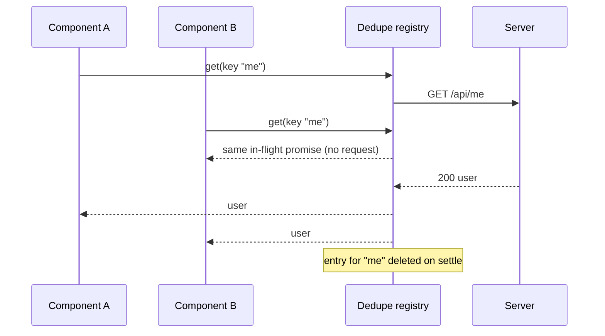

# Request Deduplication

> Ten components asking for the same user profile at the same moment should produce one request, not ten. Deduplication is the cache answering the second through tenth callers with the promise the first one already started.

**Part:** [03 · Application Architecture](../) · **Domain:** Data & Server State · **Priority:** Critical · **Difficulty:** Intermediate · **Reading time:** ~12 min

## TL;DR

Request deduplication collapses concurrent identical requests into a single in-flight fetch: the first caller starts the request and registers its promise under a key, and every caller arriving before it settles receives that same promise instead of issuing its own. It is what makes a shared data hook safe to call from anywhere in the tree — twelve components calling `useQuery` with the same key produce one network request, not twelve. The mechanism is a keyed registry of unsettled promises, so *key identity* is the whole design: two requests dedupe if and only if their keys are equal. Deduplication is a concurrency property, distinct from caching, which is a *time* property — one collapses simultaneous callers, the other serves later ones.

> **Recommendation:** Dedupe at the cache/data layer keyed by a serialized request identity, never per component. Use a shared key factory so identical requests actually produce identical keys. Delete the registry entry when the promise settles, and never dedupe non-repeatable writes.

## At a Glance

| | |
| --- | --- |
| **Use when** | Several components or effects can request the same resource in the same tick, or a route loader and a child both need it. |
| **Avoid when** | The request is a write, or the response depends on per-caller state your key does not capture. |
| **Alternatives** | [Parallel vs Waterfall Requests](#alternative-approaches) (shape the fan-out); [Data Prefetching](#alternative-approaches) (start it earlier, once). |
| **Primary risk** | A key that is too coarse (unrelated requests share a response) or a registry entry that outlives the request. |
| **Maturity** | Stable. |

## Prerequisites

- [Fetch-on-Render vs Render-as-You-Fetch](./fetch-on-render-vs-render-as-you-fetch.md) — when requests start, which decides how many can overlap.
- [Parallel vs Waterfall Requests](./parallel-vs-waterfall-requests.md) — the fan-out shape that produces duplicates in the first place.

## Overview

*Request deduplication* is the collapsing of concurrent identical requests into one. A data layer keeps a map from request identity to the promise currently resolving it; the first caller creates the entry, later callers read it, and the entry is removed once the promise settles. Every caller sees the same result and the same error, and exactly one request crosses the network.

The distinction worth holding onto is deduplication versus caching. Deduplication answers "two callers, right now, same request" — it is scoped to the lifetime of one in-flight promise and needs no freshness policy at all. Caching answers "a caller later, same request" and immediately raises the questions of staleness, revalidation, and eviction that [Staleness & Revalidation](./staleness-and-revalidation.md) covers. In practice a server-state library gives you both: deduplication is the degenerate case where the window is "while the request is running," and a non-zero `staleTime` extends that window past the response. But they fail differently, so it helps to reason about them separately.

## The Problem

A layout renders an avatar, a permissions gate, a greeting, and a settings menu. Each is a self-contained component that fetches the current user in an effect, because that is what makes each component independently usable. On first paint the browser sends four identical `GET /api/me` requests within a few milliseconds of each other. Nothing is cached yet, so nothing prevents them.

The symptoms are the ones teams misdiagnose. The network panel shows request counts that scale with component count rather than with data needs, and on HTTP/1.1 connections the duplicates consume the per-origin connection budget that the *other* critical requests needed — so the page gets slower the more it decomposes. Rate limits trip in development long before production traffic would justify it. Worse, the four responses can differ if a write lands between them, so four copies of "the current user" end up in four components with four subtly different values, and the UI disagrees with itself. Lifting the fetch into a provider fixes this one case, at the cost of a prop-drilling or context bottleneck for every shared resource in the app — which is the workaround deduplication makes unnecessary.

## Why It Matters

Deduplication is what lets data requirements be declared where they are used. Without it, "which component owns the fetch?" becomes an architectural question with real coupling attached: you hoist requests into ancestors, thread results down, and lose the ability to move or reuse a component without rewiring its data. With it, a component can state what it needs, and the data layer guarantees the request happens once. That single property is why colocated data hooks scale in a way that hand-rolled effects do not.

The cost of getting it wrong is bidirectional. Too little deduplication is wasted bandwidth, exhausted connections, tripped rate limits, and inconsistent copies of the same resource on one screen. Too aggressive deduplication is worse and harder to see: if the key omits something the response depends on — a locale, a tenant, an auth scope, a request body — then one caller receives another caller's data, which is a correctness and potentially a security bug rather than a performance one. And a registry that forgets to remove settled entries turns a dedupe cache into a permanent one, pinning stale results and their memory for the life of the page.

## Mental Model

Picture a coat check for promises. Each request computes a ticket — a stable string derived from everything that affects the response. The first caller with a given ticket hangs its promise on the hook and starts the network request; anyone presenting the same ticket while it is hanging there gets handed the same promise. When the promise settles, the hook is cleared, so the *next* caller starts a fresh request unless a cache with its own freshness policy answers first.



Two consequences follow from the model. First, correctness rests entirely on the ticket: the key must include every input the response varies by, and nothing that it does not. This is the same identity problem as [Cache Keys & Query Identity](./cache-keys-and-query-identity.md), and the same key factory should serve both. Second, cancellation is shared. Because callers share one promise, one caller aborting would abort everyone's request — so per-caller cancellation must either be reference-counted or given up entirely in favor of letting the shared request finish.

## Best Practices

Derive keys from one factory, not from ad-hoc strings. `["me"]` in one file and `["user", "me"]` in another are different keys for the same resource, and no deduplication will happen. A key factory (see [`examples/query-key-factory.ts`](../../../examples/query-key-factory.ts)) makes identical requests provably identical and gives you one place to audit what the key includes.

Put deduplication in the data layer, one level below the components. Dedupe inside the query cache or inside your fetch wrapper, so every caller — hooks, route loaders, imperative event handlers — routes through the same registry. Deduplication implemented per component, or per hook instance, deduplicates nothing.

Delete the entry when the promise settles, in a `finally`. An entry that survives its response has silently become a cache with no staleness policy, no size bound, and no invalidation path. If you *want* time-based sharing, use the cache layer's `staleTime`, which is designed for it.

Include the request body and headers that vary the response, and nothing else. For `GET` requests the URL plus varying headers (locale, tenant, auth subject) is usually the whole identity. For anything with a body, serialize the parts of it that matter — and prefer not to dedupe writes at all.

Reference-count cancellation, or don't cancel. If two components share one request and one unmounts, aborting is wrong. Either track how many callers are still waiting and abort only when the count reaches zero, or let the shared request complete and discard the result — the usual choice, and what a query cache does.

Don't dedupe non-repeatable operations. Two "add to cart" clicks are two intents, not one request to share. Collapse those in the UI with disabled buttons or mutation state (see [Mutation Lifecycle](./mutation-lifecycle.md)), not in the transport.

## Trade-offs

Deduplication trades a small amount of bookkeeping — a map, a key discipline, shared cancellation semantics — for the ability to declare data needs locally without paying per-declaration network cost. For read-heavy UIs that trade is almost unconditionally worth taking; the real cost lands on cancellation precision and on the discipline the key requires.

**Advantages**

- Request volume tracks data needs, not component count.
- Components can own their data requirements without hoisting fetches into ancestors.
- One shared response means one shared value — no disagreeing copies of the same resource on screen.

**Disadvantages**

- Per-caller cancellation is no longer straightforward; aborting affects every sharer.
- A too-coarse key leaks one caller's data to another — a correctness bug, not a slowdown.
- The registry is state: entries that outlive their request leak memory and pin stale results.

| Dimension | Request deduplication | Cost / caveat |
| --- | --- | --- |
| Performance | One request instead of N; frees connections for other work | Negligible map overhead; no effect on a single-caller path |
| Complexity | A key factory plus a `Map` in the data layer | Key discipline must be enforced across every call site |
| Maintainability | Data needs stay colocated with components | Key correctness becomes a review item |
| Failure behavior | One failure is shared, so callers stay consistent | One caller's abort can cancel everyone's request if not counted |

## Alternative Approaches

Deduplication removes *simultaneous* duplicate work. The alternatives attack the same "too many requests, too slowly" problem from different directions: request shaping changes how the fan-out is arranged, prefetching moves the one request earlier in time.

| Approach | Best when | Weakness | See |
| --- | --- | --- | --- |
| Request deduplication (this article) | Independent callers legitimately need the same resource at once | Does nothing about requests that are merely sequential | (this article) |
| [Parallel vs Waterfall Requests](./parallel-vs-waterfall-requests.md) | The requests are *different* but badly sequenced | Doesn't help when the requests are identical | `Parallel vs Waterfall Requests · Data & Server State` |
| [Data Prefetching](./data-prefetching.md) | The need is predictable before render | Wasted work if the prediction is wrong | `Data Prefetching · Data & Server State` |

## Bad Example

A hand-rolled dedupe map that looks correct, keys on a partial identity, and never clears entries.

```ts
import { useEffect, useState } from 'react';

// ❌ Three defects, each subtle in isolation.
const inFlight = new Map<string, Promise<unknown>>();

export function dedupedFetch<T>(url: string, init?: RequestInit): Promise<T> {
  // (1) Key ignores init: the same URL with a different tenant header,
  //     locale, or body collapses into one shared response.
  const existing = inFlight.get(url);
  if (existing) {
    return existing as Promise<T>;
  }

  const promise = fetch(url, init).then((r) => r.json() as Promise<T>);

  // (2) Nothing ever deletes the entry, so a settled promise is reused
  //     forever — including a rejected one, which now poisons the URL
  //     for the rest of the session.
  inFlight.set(url, promise);
  return promise;
}

function useUser() {
  const [user, setUser] = useState<User | null>(null);
  useEffect(() => {
    // (3) No error branch and no unmount guard: a rejection is an
    //     unhandled rejection, and a late resolve sets state on a dead
    //     component.
    dedupedFetch<User>('/api/me').then(setUser);
  }, []);
  return user;
}
```

**What goes wrong:** Keying on the URL alone makes the dedupe window a data-leak surface — a request with a `X-Tenant` header resolves with another tenant's response. Because entries are never deleted, the map is an unbounded permanent cache with no freshness policy, and one network failure caches a rejected promise for the page's lifetime. The consuming hook has no error path, so that rejection surfaces as an unhandled rejection rather than a rendered error state.

## Good Example

The same helper with a full request identity, `finally`-based cleanup, and reference-counted cancellation so one caller leaving does not cancel the rest.

```ts
interface Entry<T> {
  promise: Promise<T>;
  controller: AbortController;
  waiters: number;
}

const inFlight = new Map<string, Entry<unknown>>();

/** Stable identity: everything the response varies by, and nothing else. */
function requestKey(url: string, init: RequestInit = {}): string {
  const method = (init.method ?? 'GET').toUpperCase();
  const headers = new Headers(init.headers);
  const varying = ['accept-language', 'x-tenant-id'].map(
    (h) => `${h}=${headers.get(h) ?? ''}`,
  );
  return JSON.stringify([method, url, varying]);
}

export function dedupedFetch<T>(
  url: string,
  init: RequestInit = {},
  callerSignal?: AbortSignal,
): Promise<T> {
  // ✅ Writes are intents, not shareable reads — never dedupe them.
  const method = (init.method ?? 'GET').toUpperCase();
  if (method !== 'GET' && method !== 'HEAD') {
    return fetch(url, { ...init, signal: callerSignal }).then(parse<T>);
  }

  const key = requestKey(url, init);
  let entry = inFlight.get(key) as Entry<T> | undefined;

  if (!entry) {
    const controller = new AbortController();
    const created: Entry<T> = {
      controller,
      waiters: 0,
      promise: fetch(url, { ...init, signal: controller.signal })
        .then(parse<T>)
        // ✅ Cleared on success AND failure: the registry only ever holds
        // unsettled promises, so it can never become a stale cache.
        .finally(() => inFlight.delete(key)),
    };
    inFlight.set(key, created as Entry<unknown>);
    entry = created;
  }

  entry.waiters += 1;

  // ✅ Cancellation is reference-counted: the shared request is aborted
  // only when the last interested caller has gone away.
  callerSignal?.addEventListener(
    'abort',
    () => {
      if (entry!.waiters > 0 && --entry!.waiters === 0) {
        entry!.controller.abort();
      }
    },
    { once: true },
  );

  return entry.promise;
}

async function parse<T>(response: Response): Promise<T> {
  if (!response.ok) {
    throw new Error(`Request failed (${response.status} ${response.statusText})`);
  }
  return (await response.json()) as T;
}
```

**Why it's better:** The key covers method, URL, and the headers that vary the response, so unrelated requests can no longer share one. Writes bypass the registry entirely. The `finally` guarantees the map holds only unsettled promises, which removes both the memory growth and the poisoned-rejection failure mode. Reference counting means an unmounting component stops waiting without cancelling the request its siblings still need.

## Production Example

In an app that already uses a query cache, don't build the registry — use the one you have, and make every entry point go through it. The pattern below shares one identity across a route loader, a hook, and an imperative handler, so all three dedupe against each other.

```tsx
import {
  useQuery,
  useQueryClient,
  type QueryClient,
} from '@tanstack/react-query';

interface User {
  id: string;
  name: string;
  permissions: readonly string[];
}

// ✅ One factory = one identity. Every caller below shares it, so every
// caller participates in the same deduplication and the same cache entry.
export const userKeys = {
  me: () => ['user', 'me'] as const,
};

async function fetchMe({ signal }: { signal: AbortSignal }): Promise<User> {
  const response = await fetch('/api/me', { signal, credentials: 'include' });
  if (response.status === 401) {
    throw new Error('Not authenticated');
  }
  if (!response.ok) {
    throw new Error(`Failed to load profile (${response.status})`);
  }
  return (await response.json()) as User;
}

const meQuery = {
  queryKey: userKeys.me(),
  queryFn: fetchMe,
  // Extends sharing past the response: later callers reuse the value
  // instead of starting a second request. Deduplication over time.
  staleTime: 60_000,
};

/** Route loader: starts the request before components render. */
export function loadMe(queryClient: QueryClient) {
  // ensureQueryData joins the in-flight request if the loader already
  // started one, or if a sibling route did.
  return queryClient.ensureQueryData(meQuery);
}

/** Any number of components may call this; one request is made. */
export function useMe() {
  return useQuery(meQuery);
}

/** Imperative path (an event handler) shares the same in-flight request. */
export function useRequireMe() {
  const queryClient = useQueryClient();
  return () => queryClient.ensureQueryData(meQuery);
}
```

The subtle part is not `useQuery` — it is that the loader and the event handler use `ensureQueryData` with the *same* options object rather than calling `fetch` directly. A call site that bypasses the cache bypasses deduplication, and one such call site is enough to reintroduce duplicate requests on every page load.

## Common Mistakes

See the [Data & Server State anti-patterns](../../../anti-patterns/#data-server-state) for the domain catalog. Concept-specific:

### Mistake: A key that omits part of the request identity

- **Symptom:** Deduplication keyed on the URL only, while requests differ by locale, tenant, auth subject, or body.
- **Why it fails:** Two semantically different requests share one promise, so a caller receives data it never asked for — a correctness or data-isolation bug that looks like a caching glitch.
- **Fix:** Build the key from everything the response varies by, through a shared [key factory](./cache-keys-and-query-identity.md).

### Mistake: Leaving settled promises in the registry

- **Symptom:** The in-flight map only ever grows; a failed request keeps failing until reload.
- **Why it fails:** The map has become a cache with no eviction, no staleness policy, and no way to invalidate — and a cached rejected promise pins the failure permanently.
- **Fix:** Delete the entry in a `finally`, and use the cache layer's `staleTime` if you want sharing to outlive the response.

### Mistake: Letting one caller's abort cancel the shared request

- **Symptom:** A component unmounts and its siblings' data never arrives, intermittently and usually only in development.
- **Why it fails:** Callers share one promise and one `AbortController`, so any caller's cleanup aborts the request everyone is waiting on.
- **Fix:** Reference-count waiters and abort only at zero, or don't cancel shared reads at all.

## Checklist

- [ ] Every call site for a resource builds its key from the same factory.
- [ ] The key includes method, URL, and any header or body input the response varies by.
- [ ] Registry entries are deleted when the promise settles, in a `finally`.
- [ ] Writes and other non-repeatable operations bypass deduplication.
- [ ] Cancellation is reference-counted, or shared reads are not cancelled.
- [ ] Imperative and loader paths go through the cache, not raw `fetch`.

## Related Articles

- [Cache Keys & Query Identity](./cache-keys-and-query-identity.md) — the identity that decides what dedupes with what.
- [Parallel vs Waterfall Requests](./parallel-vs-waterfall-requests.md) — arranging the requests that remain after duplicates are gone.
- [Data Prefetching](./data-prefetching.md) — starting the single request earlier instead of later.
- [Staleness & Revalidation](./staleness-and-revalidation.md) — extending sharing beyond the in-flight window.

## Related Examples

- [Query key factory](../../../examples/query-key-factory.ts) — one identity per resource, which is what makes deduplication possible.

## References

- [TanStack Query — Caching Examples](https://tanstack.com/query/latest/docs/framework/react/guides/caching) — how concurrent observers of one key share a single fetch.
- [MDN — AbortController](https://developer.mozilla.org/en-US/docs/Web/API/AbortController) — the cancellation primitive that shared requests must reference-count.
