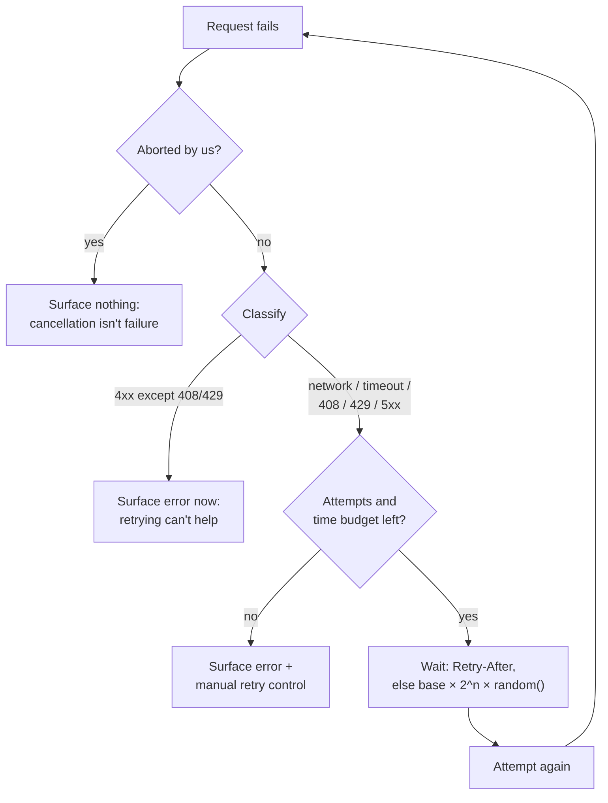

# Retries & Backoff

> A retry is a bet that the failure was luck. Classify the error before you take the bet, wait longer each time, add randomness so every client doesn't return at once — and know when to stop and tell the user.

**Part:** [03 · Application Architecture](../) · **Domain:** Data & Server State · **Priority:** Critical · **Difficulty:** Intermediate · **Reading time:** ~12 min

## TL;DR

Retrying is the correct response to a *transient* failure — a dropped connection, a timeout, a `503` while a server restarts — and the wrong response to everything else. A `404` will still be a `404`, a `422` will still be invalid, and retrying either wastes the user's time while hiding a real bug. Delays must grow exponentially and carry randomness, because synchronized retries from many clients are how a brief blip becomes an outage. Every policy needs a hard ceiling — attempt count *and* total elapsed time — after which the failure is surfaced with a manual retry the user controls. Writes are only safe to retry if the server can recognize a duplicate.

> **Recommendation:** Retry only on network errors, timeouts, `408`, `429`, and `5xx`. Use exponential backoff with full jitter, honor `Retry-After` when present, cap at 3 attempts and a few seconds total, and never auto-retry a write without a server-side duplicate guard.

## At a Glance

| | |
| --- | --- |
| **Use when** | Failures include a meaningful share of transient ones — flaky mobile networks, deploys, rate limits, cold starts. |
| **Avoid when** | The error is deterministic (`4xx` other than `408`/`429`), the request was deliberately cancelled, or a retried write could double-charge. |
| **Alternatives** | None as a category — the choice is *what* to retry and *how long* to wait; see [the comparison](#alternative-approaches). |
| **Primary risk** | Retry storms that amplify an outage, and hidden latency that makes failures look like hangs. |
| **Maturity** | Stable. |

## Prerequisites

- [Normalizing Server Responses](./normalizing-server-responses.md) — a consistent error shape is what a retry policy classifies on.
- [Mutation Lifecycle](./mutation-lifecycle.md) — where a write's retry behavior is configured, and why writes differ from reads.

## Overview

A *retry* re-issues a failed request in the hope that the cause was temporary. *Backoff* is the delay between attempts, and *jitter* is the randomness added to that delay. Together they form a policy with four parameters: which errors qualify, how long to wait before each attempt, how many attempts to make, and what happens when the attempts run out.

The classification step is the one most often skipped, and it is the one that matters most. Failures divide into transient — connection reset, DNS hiccup, request timeout, `503` during a rolling deploy, `429` under a rate limit — and deterministic: a missing resource, a validation error, a permission denial, a malformed request. Retrying a transient failure converts it into a success the user never notices. Retrying a deterministic failure produces the same error three times, delays the error message by several seconds, and multiplies load for no possible benefit. There is also a third category that must never be retried: requests the client deliberately cancelled, whose `AbortError` is a success signal for the abort, not a failure of the request.

## The Problem

A mobile web app loses its connection for two seconds in a tunnel. Three requests fail, three error banners appear, and the user reloads the page — which they experience as the app being broken, because from their side it was.

So the team adds `retry: 3`. Now consider what that means with the library defaults on a bad day. The API returns `403` for an expired session: three attempts, exponentially spaced, then the error — the user waits four seconds to learn they need to sign in again, and the auth-refresh bug behind it is invisible in the metrics because two-thirds of the failures never reach the error handler. A `422` on form submission behaves the same way, so validation errors feel like the app is hanging.

Then a deploy briefly returns `503`. Every open tab retries at exactly 1 s, 2 s, and 4 s after the failure, because all of them use the same fixed schedule. The retry traffic arrives in three synchronized waves against a service that is still coming up, and the waves are larger than the original traffic. The blip becomes a real outage — a retry storm, caused by the fix.

And a payment `POST` times out at the gateway after the charge was created. The retry creates a second charge. The request failed from the client's perspective and succeeded from the server's, and nothing in the retry policy knew the difference.

## Why It Matters

On real networks, a meaningful share of failures are transient — packet loss, connection migration between cellular and Wi-Fi, brief server unavailability during deploys, cold starts. A correct retry policy makes those invisible, which is the difference between an app users think is reliable and one they think is broken. No amount of error-state polish substitutes for the request simply succeeding.

The reason to be careful is that retries are load amplification aimed at a system that is already struggling. A service returning errors under pressure receives, from a naive policy, three or four times its normal request volume — which is precisely the wrong response and can prevent recovery entirely. Synchronization makes it worse: without jitter, clients that failed together retry together, converting a smooth load curve into spikes. This is why backoff is not a politeness convention but a stability mechanism, and why a ceiling matters as much as the retries themselves.

The failure modes are also easy to hide from yourself. Retries mask errors from your own metrics and lengthen every failure by the total backoff time, so a mis-classified deterministic error becomes both a slower experience and an invisible bug. And on writes, a retry after a timeout is indistinguishable from a duplicate request unless the server can recognize it — which makes duplicate charges, duplicate orders, and double-sent messages a retry-policy problem rather than a backend one.

## Mental Model

Every failure passes through a classifier before a retry is even considered. Only transient failures reach the backoff calculation; deterministic ones and cancellations go straight to the caller.



Two details carry most of the value. The wait is `base × 2^attempt`, multiplied by a random factor — *full jitter*, where the delay is a random value between zero and the computed ceiling, spreads clients across the whole window instead of clustering them at its edges. And the budget is two-dimensional: attempt count bounds server load, while total elapsed time bounds the user's wait. Three attempts with a 30-second ceiling is a policy that keeps a user staring at a spinner; three attempts capped at four seconds total is one that fails honestly and hands control back.

## Best Practices

Classify before retrying. Retry network errors, timeouts, `408`, `429`, and `5xx`. Do not retry other `4xx` codes: they are statements about the request, and the request has not changed. Give the classifier one place to live so every query and mutation shares it.

Never retry an aborted request. An `AbortError` means the client cancelled — a navigation, an unmount, a superseded search keystroke. Retrying it resurrects work nobody wants and can loop indefinitely against a component that keeps aborting.

Use exponential backoff with full jitter. `delay = random() × min(cap, base × 2 ** attempt)`. Exponential growth gives a struggling service room to recover; full jitter prevents synchronized waves across clients. A fixed 1-second retry is the single most harmful policy in this article.

Honor `Retry-After`. On `429` and `503`, the server is telling you when to come back — in seconds or as an HTTP date. Parse it, clamp it to something sane, and prefer it over your computed delay. Ignoring it is how a client earns a longer rate limit.

Cap attempts *and* total time. Three attempts is a good default for reads. Bound the whole sequence to a few seconds, because a user watching a spinner for twenty seconds would rather have seen an error at four.

Set a per-attempt timeout. A request that never settles is not retried, because nothing has failed yet. `AbortSignal.timeout()` turns a hanging request into a timeout the policy can act on.

Treat writes separately, and require a duplicate guard. Do not auto-retry a mutation unless the server can recognize a repeat — an `Idempotency-Key` header, a client-generated ID, or a conditional precondition. Where that guard exists, retry sparingly (one attempt) and only on network errors and `5xx`, where the outcome is genuinely unknown.

Give the user the final retry. When the budget is exhausted, render the error with a manual retry control. A deliberate user retry is worth more than a fourth automatic attempt: they know whether the network came back.

Keep retries visible in telemetry. Log attempts with their classification and outcome. If retried failures never reach your error tracking, a systematic bug can hide behind a healthy success rate.

Stop early when the whole client is offline. `navigator.onLine === false` means no attempt can succeed; wait for the `online` event rather than burning the budget. Persistent queuing of failed writes belongs to a different mechanism (offline sync), not to a retry policy.

## Trade-offs

Retrying trades latency on failure, and extra load on a struggling server, for a materially higher success rate on unreliable networks. Well-classified and well-bounded, the trade is strongly positive; unclassified and unbounded, it makes both reliability and observability worse.

**Advantages**

- Transient failures become invisible to the user — the most valuable reliability win available on mobile.
- Rate limits and deploys degrade gracefully instead of surfacing as errors.
- One shared policy replaces per-call-site error handling.

**Disadvantages**

- Every failure takes longer to surface, by the total backoff time.
- Retries amplify load against a system that is already failing.
- Mis-classified errors hide real bugs from metrics and from the user.
- Writes require a server-side duplicate guard before they can be retried at all.

| Dimension | Retries with backoff | Cost / caveat |
| --- | --- | --- |
| Reliability | Converts transient failures into successes | No help — and active harm — on deterministic errors |
| Latency | Unchanged on success | Failure latency grows with attempts and delays |
| Server load | Jitter and backoff keep amplification bounded | Any fixed-delay policy risks synchronized storms |
| Complexity | One classifier plus a delay function | Writes need duplicate protection and a stricter policy |
| Observability | Retry telemetry shows transient error rates | Silent retries can mask systematic failures |

## Alternative Approaches

Retrying has no substitute as a category — a transient failure either gets another attempt or becomes a user-visible error. The decisions are how many attempts, how long to wait, and what happens when the budget is gone.

| Approach | Best when | Weakness | See |
| --- | --- | --- | --- |
| Exponential backoff with jitter (this article) | Failures are a mix of transient and deterministic | Failure latency grows; needs classification | (this article) |
| Fail fast + manual retry | Deterministic errors dominate, or the user must decide | Transient blips become visible errors | [Loading & Error States](./loading-and-error-states.md) |
| Circuit breaker | A dependency is failing consistently, not occasionally | Adds state and a half-open probe path; coarse-grained | (this article) |
| Queue and replay when online | Writes must survive a genuine offline period | Ordering, conflicts, and expiry become your problem | [Offline & Local-First Sync](./README.md) (planned) |

## Bad Example

A blanket retry with a fixed delay, applied to everything including writes.

```ts
import { QueryClient } from '@tanstack/react-query';

// ❌ One policy for every failure, with no classification and no jitter.
export const queryClient = new QueryClient({
  defaultOptions: {
    queries: {
      // (1) Retries 403, 404, and 422 — errors that cannot succeed on retry.
      //     The user waits ~7s to be told their session expired.
      retry: 5,
      // (2) Fixed delay: every client that failed together retries together.
      //     Five synchronized waves at 1s intervals against a recovering server.
      retryDelay: 1000,
    },
    mutations: {
      // (3) Retrying a POST with no duplicate guard: a gateway timeout after
      //     the charge succeeded creates a second charge.
      retry: 3,
    },
  },
});

async function loadInvoice(id: string) {
  // (4) No timeout: a request that hangs forever never fails, so it is never
  //     retried and the spinner never resolves.
  const response = await fetch(`/api/invoices/${id}`);
  if (!response.ok) throw new Error('Request failed');
  return response.json();
}
```

**What goes wrong:** Without classification, deterministic errors consume the full retry budget — a `422` takes five seconds to reach the form, and a `403` from an expired session is retried instead of triggering a refresh. The fixed delay synchronizes every client in the fleet into waves that hit a struggling service hardest exactly when it can least absorb them. Retrying mutations with no duplicate guard turns one timeout into multiple charges. And with no per-attempt timeout, the one failure mode the retry policy cannot see is a request that simply never settles.

## Good Example

A shared classifier, exponential backoff with full jitter, `Retry-After` support, a per-attempt timeout, and a bounded budget.

```ts
import { QueryClient } from '@tanstack/react-query';

/** Errors carry the status so a single classifier can make the decision. */
export class HttpError extends Error {
  constructor(
    readonly status: number,
    readonly retryAfterMs: number | null,
    message: string,
  ) {
    super(message);
    this.name = 'HttpError';
  }
}

const RETRY_STATUS = new Set([408, 429, 500, 502, 503, 504]);
const MAX_ATTEMPTS = 3;
const BASE_DELAY_MS = 400;
const MAX_DELAY_MS = 4_000;

/** ✅ One place decides what a transient failure is. */
export function isTransient(error: unknown): boolean {
  // Cancellation is not failure — never retry our own abort.
  if (error instanceof DOMException && error.name === 'AbortError') return false;

  // No connectivity at all: wait for the `online` event instead of burning attempts.
  if (typeof navigator !== 'undefined' && navigator.onLine === false) return false;

  if (error instanceof HttpError) return RETRY_STATUS.has(error.status);

  // A TypeError from fetch means the request never reached the server.
  return error instanceof TypeError;
}

/** ✅ Full jitter: a random point in the window, not its edge. */
export function retryDelay(attemptIndex: number, error: unknown): number {
  if (error instanceof HttpError && error.retryAfterMs !== null) {
    // Server told us when to come back; clamp it so a hostile value can't
    // strand the UI for minutes.
    return Math.min(error.retryAfterMs, 30_000);
  }
  const ceiling = Math.min(MAX_DELAY_MS, BASE_DELAY_MS * 2 ** attemptIndex);
  return Math.random() * ceiling;
}

function parseRetryAfter(header: string | null): number | null {
  if (!header) return null;
  const seconds = Number(header);
  if (Number.isFinite(seconds)) return Math.max(0, seconds * 1000);
  const date = Date.parse(header);
  return Number.isNaN(date) ? null : Math.max(0, date - Date.now());
}

export async function request<T>(url: string, init: RequestInit = {}): Promise<T> {
  // ✅ Per-attempt timeout: a hanging request becomes a failure the policy
  // can classify, and the caller's own signal still wins.
  const timeout = AbortSignal.timeout(8_000);
  const signal = init.signal
    ? AbortSignal.any([init.signal, timeout])
    : timeout;

  const response = await fetch(url, { ...init, signal });
  if (!response.ok) {
    throw new HttpError(
      response.status,
      parseRetryAfter(response.headers.get('retry-after')),
      `${init.method ?? 'GET'} ${url} failed (${response.status})`,
    );
  }
  return (await response.json()) as T;
}

export const queryClient = new QueryClient({
  defaultOptions: {
    queries: {
      retry: (failureCount, error) =>
        failureCount < MAX_ATTEMPTS && isTransient(error),
      retryDelay,
    },
    mutations: {
      // ✅ Writes don't retry by default. Opt in per mutation, only where the
      // server can recognize a duplicate.
      retry: false,
    },
  },
});
```

**Why it's better:** Deterministic errors reach the caller on the first attempt, so a `422` renders instantly and a `403` can trigger a session refresh instead of being retried into silence. Full jitter spreads retries across the whole delay window, so a fleet of clients no longer arrives in waves. `Retry-After` is honored and clamped. The per-attempt timeout converts hangs into classifiable failures, and mutations are excluded until a duplicate guard makes them safe.

## Production Example

A payment mutation is the case where retrying is both most valuable — a timeout leaves the outcome genuinely unknown — and most dangerous. The duplicate guard is what makes it safe.

```tsx
import { useMutation } from '@tanstack/react-query';
import { HttpError, request } from './http';

interface ChargeInput {
  invoiceId: string;
  amountCents: number;
}

interface Charge {
  id: string;
  status: 'succeeded' | 'pending';
}

/**
 * The key is generated once per user intent, NOT per attempt — that is the
 * whole mechanism. The server records it and returns the original result for
 * any repeat, so a retry after a timeout can never charge twice.
 */
function chargeInvoice(input: ChargeInput, idempotencyKey: string): Promise<Charge> {
  return request<Charge>('/api/charges', {
    method: 'POST',
    headers: {
      'content-type': 'application/json',
      'Idempotency-Key': idempotencyKey,
    },
    body: JSON.stringify(input),
  });
}

export function useChargeInvoice() {
  return useMutation({
    mutationFn: (input: ChargeInput) =>
      // Generated in mutationFn's caller scope: every retry of this mutation
      // reuses the same key.
      chargeInvoice(input, crypto.randomUUID()),

    // ✅ One retry, and only where the outcome is unknown: a network error or
    // a 5xx. A 402 (payment declined) or 422 is final and must reach the user.
    retry: (failureCount, error) => {
      if (failureCount >= 1) return false;
      if (error instanceof HttpError) {
        return error.status >= 500 || error.status === 408;
      }
      return error instanceof TypeError;
    },
    retryDelay: () => 300 + Math.random() * 700,

    onError: (error) => {
      // The user gets the decision once the (short) budget is spent.
      reportError(error);
    },
  });
}
```

Two production caveats. The duplicate-guard key must be created when the *intent* is created — one key per "user pressed Pay," reused across attempts. Generating it inside the retried call would defeat the purpose, so in real code it is captured alongside the input (for example in component state or a ref) rather than inline. And a bounded retry is not a queue: if the user is genuinely offline, the right behavior is to persist the intent and replay it on reconnect, which is offline sync rather than backoff.

## Common Mistakes

See the [Data & Server State anti-patterns](../../../anti-patterns/README.md#data-server-state) for the domain catalog. Concept-specific:

### Mistake: Retrying deterministic errors

- **Symptom:** Validation errors and permission failures take seconds to appear; `404`s are requested repeatedly.
- **Why it fails:** The request has not changed, so the response will not either — the only effects are delay, load, and errors hidden from telemetry.
- **Fix:** Retry only network errors, timeouts, `408`, `429`, and `5xx`, from one shared classifier.

### Mistake: Fixed retry delays

- **Symptom:** A brief server error turns into repeated traffic spikes at regular intervals.
- **Why it fails:** Clients that fail together retry together; without exponential growth and jitter the retries arrive as synchronized waves against a recovering service.
- **Fix:** `random() × min(cap, base × 2 ** attempt)`, and honor `Retry-After` when the server sends it.

### Mistake: Auto-retrying writes with no duplicate guard

- **Symptom:** Duplicate orders, double charges, or repeated messages after a network hiccup.
- **Why it fails:** A timeout means the outcome is unknown, not that the write failed; the server may have succeeded already.
- **Fix:** Disable mutation retries by default; enable them only with a server-recognized `Idempotency-Key` reused across attempts.

### Mistake: Retrying a request the client cancelled

- **Symptom:** Requests reappear after navigation or unmount; a fast typist's search issues far more requests than keystrokes.
- **Why it fails:** `AbortError` reports a successful cancellation, not a failed request, so retrying it fights the code that cancelled it.
- **Fix:** Return `false` from the classifier for `AbortError` before any other check.

### Mistake: No per-attempt timeout

- **Symptom:** A spinner that never resolves, with nothing in the error logs.
- **Why it fails:** A request that never settles never fails, so the retry policy is never consulted.
- **Fix:** Wrap each attempt in `AbortSignal.timeout()`, combined with the caller's signal.

## Checklist

- [ ] One shared classifier decides what is transient; `AbortError` is excluded first.
- [ ] Delays are exponential with full jitter and a ceiling.
- [ ] `Retry-After` is parsed (seconds and HTTP-date) and clamped.
- [ ] Attempts and total elapsed time are both bounded.
- [ ] Each attempt has its own timeout, combined with the caller's abort signal.
- [ ] Mutations do not retry unless the server recognizes a duplicate via a stable key.
- [ ] The duplicate-guard key is generated per user intent, not per attempt.
- [ ] Exhausted budgets surface an error with a manual retry control.
- [ ] Retry attempts and classifications appear in telemetry.

## Related Articles

- [Mutation Lifecycle](./mutation-lifecycle.md) — where a write's retry policy lives and why writes are the strict case.
- [Rollback & Conflict Resolution](./rollback-and-conflict-resolution.md) — what to do when a retried write conflicts with a newer state.
- [Background Refetching](./background-refetching.md) — the reconnect trigger that pairs with "stop retrying while offline."
- [Loading & Error States](./loading-and-error-states.md) — rendering the failure once the budget is exhausted.
- [Offline & Local-First Sync](./README.md) — persisting and replaying intents beyond a bounded retry (planned).

## Related Examples

- [Use invoice mutation](../../../examples/use-invoice-mutation.tsx) — the mutation shape a retry policy is attached to.

## References

- [MDN — Retry-After](https://developer.mozilla.org/en-US/docs/Web/HTTP/Headers/Retry-After) — the header's two formats and the statuses that carry it.
- [AWS — Exponential Backoff and Jitter](https://aws.amazon.com/blogs/architecture/exponential-backoff-and-jitter/) — why full jitter outperforms plain exponential backoff under contention.
